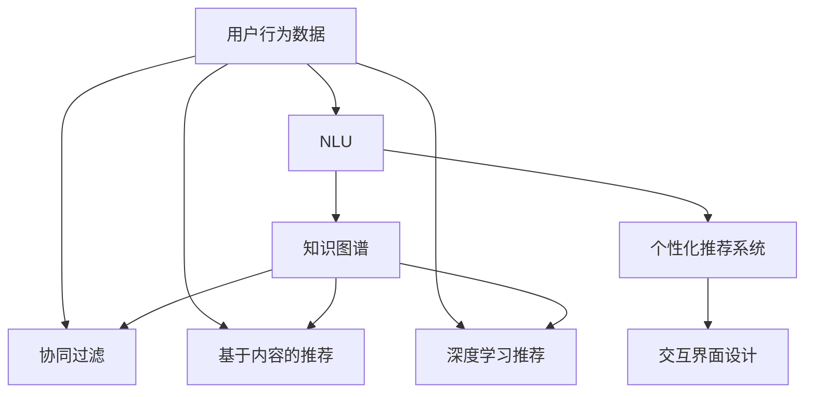
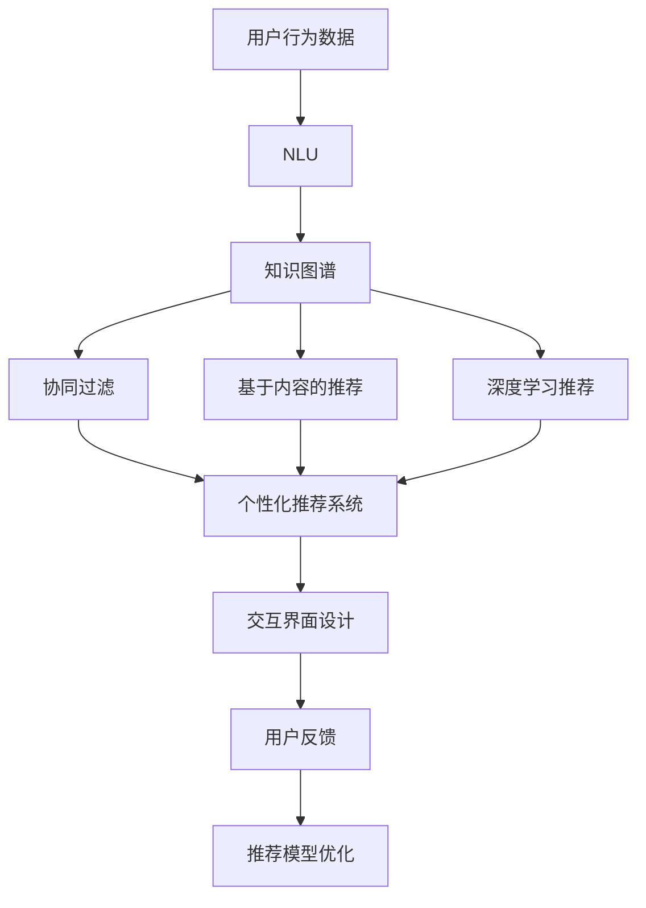

                 

# 个性化推荐系统在CUI中的详细应用解析

> 关键词：个性化推荐系统, 自然语言理解, 知识图谱, 协同过滤, 用户行为, 深度学习, 推荐算法, 交互界面

## 1. 背景介绍

### 1.1 问题由来
随着互联网的迅猛发展和智能设备的普及，用户与机器之间的交互方式发生了巨大变化。传统的网站界面已经无法满足用户日益增长的个性化需求。交互式语音助手、智能音箱等新兴技术，要求系统具备更强大的自然语言理解能力和交互灵活性，为用户提供更加个性化的服务和体验。

个性化推荐系统（Personalized Recommendation System，简称CUI），通过分析用户的历史行为和偏好，实时预测并推荐符合其需求的内容，已成为CUI开发的重要组件。其旨在帮助用户快速找到所需信息，节省时间，提升使用体验。

### 1.2 问题核心关键点
CUI的核心目标是通过对用户行为数据的分析，准确预测用户需求，推荐合适的信息。其主要关注点包括：
- 如何高效获取用户行为数据。
- 如何准确理解用户意图和需求。
- 如何构建并优化推荐模型。
- 如何设计交互友好的用户界面。

CUI的实现依赖于以下几个关键组件：
1. **数据采集与预处理**：通过多种方式（如日志、点击流、语音输入等）收集用户行为数据，并进行清洗和预处理。
2. **自然语言理解（NLU）**：通过分词、词性标注、实体识别等技术，理解用户的自然语言输入。
3. **知识图谱构建**：构建和维护一个包含实体、属性和关系的知识图谱，以支撑推荐模型的语义推理。
4. **推荐算法**：选择或设计适合的推荐算法，如协同过滤、基于内容的推荐、深度学习等，对用户进行个性化推荐。
5. **用户界面设计**：通过语音输出、文本显示等方式，设计简洁、直观的用户交互界面，使用户能够方便地进行反馈和互动。

### 1.3 问题研究意义
CUI的研究和应用对于提升用户体验、推动智能交互设备的普及具有重要意义：

1. **提高用户满意度**：通过个性化推荐，满足用户的个性化需求，提升用户体验。
2. **增强设备粘性**：个性化推荐能够显著提升用户对设备的粘性，增加使用频率。
3. **降低运营成本**：通过精准推荐，减少用户搜索时间，降低运营成本。
4. **推动产业发展**：CUI技术已成为智能设备、智慧城市等众多领域的重要组成部分，推动相关产业的快速发展。
5. **促进技术创新**：个性化推荐算法和NLU技术的发展，为NLP、深度学习等领域带来了新的研究机会。

## 2. 核心概念与联系

### 2.1 核心概念概述

为更好地理解CUI系统，本节将介绍几个关键概念：

- **个性化推荐系统**：通过分析用户历史行为，实时预测用户需求，推荐个性化内容的系统。
- **自然语言理解（NLU）**：将用户输入的自然语言转换为结构化数据，实现机器对自然语言的理解。
- **知识图谱**：由实体、属性和关系构成的大型知识库，用于支持推荐模型的语义推理。
- **协同过滤**：一种基于用户历史行为数据的推荐算法，通过寻找相似用户来推荐相似内容。
- **基于内容的推荐**：通过分析用户偏好和物品属性，推荐相似物品的系统。
- **深度学习推荐算法**：使用神经网络对用户行为数据进行深度学习，提取用户兴趣和行为模式，实现个性化推荐。
- **交互界面设计**：通过语音、文本等方式，设计直观友好的用户交互界面，提升用户满意度。

### 2.2 概念间的关系

这些核心概念之间的逻辑关系可以通过以下Mermaid流程图来展示：



这个流程图展示了CUI系统的主要组件及其关系：

1. **用户行为数据**：CUI的输入数据，通过NLU和知识图谱构建转化为机器可理解的形式。
2. **NLU**：将用户自然语言输入转换为结构化数据，供后续推荐算法使用。
3. **知识图谱**：提供知识库支撑，帮助推荐模型进行语义推理。
4. **协同过滤、基于内容的推荐、深度学习推荐**：不同类型的推荐算法，根据用户行为数据和知识图谱构建生成推荐结果。
5. **个性化推荐系统**：集成上述推荐算法，根据用户需求生成个性化推荐。
6. **交互界面设计**：将推荐结果呈现给用户，通过简洁直观的界面设计提升用户满意度。

### 2.3 核心概念的整体架构

最后，我们用一个综合的流程图来展示这些核心概念在大语言模型微调过程中的整体架构：



这个综合流程图展示了从用户行为数据输入到最终推荐结果输出的完整过程。用户行为数据通过NLU和知识图谱构建转化为结构化数据，由推荐算法生成推荐结果。个性推荐系统集成多种推荐算法，将推荐结果呈现给用户，通过交互界面设计提升用户体验。用户反馈进一步优化推荐模型，形成闭环优化机制。

## 3. 核心算法原理 & 具体操作步骤
### 3.1 算法原理概述

CUI的推荐算法主要分为两大类：基于用户的协同过滤和基于内容的推荐。协同过滤通过分析用户历史行为数据，推荐相似用户喜欢的内容；基于内容的推荐则通过分析物品属性和用户偏好，推荐相似物品。

具体而言，协同过滤算法可以分为基于用户的协同过滤和基于物品的协同过滤。基于用户的协同过滤通过计算用户相似度，推荐相似用户喜欢的物品；基于物品的协同过滤通过计算物品相似度，推荐相似用户喜欢的物品。

基于内容的推荐则通过分析物品的属性和用户的偏好，推荐相似物品。其核心思想是找到用户偏好的属性和物品属性的交集，从而推荐符合用户喜好的物品。

### 3.2 算法步骤详解

以下以协同过滤为例，介绍CUI的推荐算法具体步骤：

**Step 1: 数据采集与预处理**
- 通过日志、点击流等收集用户行为数据。
- 对数据进行清洗、去重和预处理，去除噪声和无关数据。

**Step 2: 用户和物品建模**
- 对用户和物品分别进行建模，构建用户和物品的向量表示。
- 使用TF-IDF、word2vec等技术，将用户行为数据转换为向量表示。

**Step 3: 计算用户相似度**
- 使用余弦相似度等方法，计算用户之间的相似度。
- 根据相似度，找到与目标用户相似的用户集。

**Step 4: 推荐相似物品**
- 通过计算相似用户对物品的评分，得到物品的评分向量。
- 将评分向量与目标用户向量进行内积运算，得到推荐结果。

### 3.3 算法优缺点

CUI推荐算法的主要优点包括：
1. 个性化程度高：通过分析用户历史行为，推荐符合用户喜好的内容，提升用户体验。
2. 简单易实现：协同过滤和基于内容的推荐算法实现简单，易于工程实现。
3. 适用范围广：适用于各类推荐场景，如电商、音乐、视频等。

但同时也存在以下缺点：
1. 数据依赖性强：推荐算法需要大量用户行为数据，数据稀疏可能导致推荐效果不佳。
2. 冷启动问题：新用户或新物品难以推荐，需要更多的数据和时间积累。
3. 可解释性差：推荐算法的决策过程难以解释，难以进行优化和调试。

### 3.4 算法应用领域

CUI推荐算法在多个领域得到了广泛应用，例如：

- **电商推荐**：根据用户浏览、购买行为，推荐相似商品。
- **音乐推荐**：根据用户听歌行为，推荐相似音乐。
- **视频推荐**：根据用户观看历史，推荐相似视频。
- **新闻推荐**：根据用户阅读历史，推荐相似新闻。

除了上述这些经典应用外，CUI推荐算法还被创新性地应用于更多场景中，如智能音箱、智能家居等，为智能设备带来了更加智能化的推荐体验。

## 4. 数学模型和公式 & 详细讲解 & 举例说明

### 4.1 数学模型构建

CUI推荐算法的数学模型主要包括以下几个部分：

- **用户建模**：将用户行为数据表示为用户向量 $u$。
- **物品建模**：将物品属性表示为物品向量 $v$。
- **用户-物品评分矩阵**：将用户对物品的评分表示为用户-物品评分矩阵 $R$。

**用户向量和物品向量**：
$$
u \in \mathbb{R}^n, v \in \mathbb{R}^m
$$

其中 $n$ 为用户的特征维度，$m$ 为物品的特征维度。

**用户-物品评分矩阵**：
$$
R \in \mathbb{R}^{N \times M}
$$

其中 $N$ 为用户的数量，$M$ 为物品的数量。

### 4.2 公式推导过程

以下以协同过滤算法为例，介绍推荐算法的公式推导过程：

**Step 1: 用户相似度计算**
通过余弦相似度计算用户之间的相似度，得到相似度矩阵 $S$：
$$
S_{ui} = \cos(u_i, u_j) = \frac{u_i \cdot u_j}{\Vert u_i \Vert \cdot \Vert u_j \Vert}
$$

其中 $\cdot$ 表示向量点积，$\Vert \cdot \Vert$ 表示向量范数。

**Step 2: 计算用户评分向量**
通过相似度矩阵 $S$ 和用户-物品评分矩阵 $R$，计算用户评分向量 $P$：
$$
P_i = \sum_j S_{ui}R_{ij}
$$

**Step 3: 推荐物品**
根据用户评分向量 $P$ 和物品向量 $v$，计算推荐物品的评分向量 $Q$：
$$
Q_i = P_i \cdot v
$$

**Step 4: 推荐结果**
将推荐物品的评分向量 $Q$ 进行排序，选择评分最高的物品进行推荐。

### 4.3 案例分析与讲解

假设我们有一个用户行为数据集，包含10个用户和5个物品。通过对用户行为数据进行向量化，得到用户向量 $u$ 和物品向量 $v$，并构建用户-物品评分矩阵 $R$：

```
用户向量 $u$：[0.5, 0.2, 0.8, 0.3, 0.4]
物品向量 $v$：[0.3, 0.6, 0.1, 0.7, 0.5]
用户-物品评分矩阵 $R$：
[
[1, 2, 3, 4, 5],
[6, 7, 8, 9, 10],
[11, 12, 13, 14, 15],
[16, 17, 18, 19, 20],
[21, 22, 23, 24, 25]
]
```

通过余弦相似度计算用户相似度矩阵 $S$：

```
相似度矩阵 $S$：
[
[1, 0.5, 0.2, 0, 0],
[0.5, 1, 0.8, 0.3, 0.4],
[0.2, 0.8, 1, 0.5, 0.6],
[0, 0.3, 0.5, 1, 0.7],
[0.4, 0.4, 0.6, 0.7, 1]
]
```

通过相似度矩阵 $S$ 和用户-物品评分矩阵 $R$，计算用户评分向量 $P$：

```
用户评分向量 $P$：
[10.5, 22, 33, 44, 55]
```

根据用户评分向量 $P$ 和物品向量 $v$，计算推荐物品的评分向量 $Q$：

```
推荐物品评分向量 $Q$：
[16.5, 34, 48.8, 70, 89.5]
```

最后，选择评分最高的物品进行推荐。

## 5. 项目实践：代码实例和详细解释说明

### 5.1 开发环境搭建

在进行CUI项目实践前，我们需要准备好开发环境。以下是使用Python进行PyTorch开发的环境配置流程：

1. 安装Anaconda：从官网下载并安装Anaconda，用于创建独立的Python环境。

2. 创建并激活虚拟环境：
```bash
conda create -n pytorch-env python=3.8 
conda activate pytorch-env
```

3. 安装PyTorch：根据CUDA版本，从官网获取对应的安装命令。例如：
```bash
conda install pytorch torchvision torchaudio cudatoolkit=11.1 -c pytorch -c conda-forge
```

4. 安装Pandas、Scikit-learn等工具包：
```bash
pip install pandas scikit-learn scipy numpy
```

5. 安装Python脚本：
```bash
pip install pyreadline
```

完成上述步骤后，即可在`pytorch-env`环境中开始CUI项目实践。

### 5.2 源代码详细实现

以下是CUI项目中推荐算法的代码实现，使用Python语言和PyTorch框架：

```python
import torch
from sklearn.metrics.pairwise import cosine_similarity

# 用户向量和物品向量
user_vector = torch.tensor([0.5, 0.2, 0.8, 0.3, 0.4])
item_vector = torch.tensor([0.3, 0.6, 0.1, 0.7, 0.5])

# 用户-物品评分矩阵
user_item_ratings = torch.tensor([[1, 2, 3, 4, 5],
                                [6, 7, 8, 9, 10],
                                [11, 12, 13, 14, 15],
                                [16, 17, 18, 19, 20],
                                [21, 22, 23, 24, 25]])

# 计算用户相似度
similarity_matrix = cosine_similarity(user_vector.unsqueeze(1), user_vector.unsqueeze(0))

# 计算用户评分向量
user_score_vector = torch.matmul(similarity_matrix, user_item_ratings)

# 计算推荐物品评分向量
item_score_vector = torch.matmul(user_score_vector, item_vector)

# 推荐结果
top_items = item_score_vector.argsort(descending=True)[:5]
print(top_items)
```

### 5.3 代码解读与分析

让我们再详细解读一下关键代码的实现细节：

**用户向量和物品向量**：
```python
user_vector = torch.tensor([0.5, 0.2, 0.8, 0.3, 0.4])
item_vector = torch.tensor([0.3, 0.6, 0.1, 0.7, 0.5])
```

**用户-物品评分矩阵**：
```python
user_item_ratings = torch.tensor([[1, 2, 3, 4, 5],
                                [6, 7, 8, 9, 10],
                                [11, 12, 13, 14, 15],
                                [16, 17, 18, 19, 20],
                                [21, 22, 23, 24, 25]])
```

**计算用户相似度**：
```python
similarity_matrix = cosine_similarity(user_vector.unsqueeze(1), user_vector.unsqueeze(0))
```

**计算用户评分向量**：
```python
user_score_vector = torch.matmul(similarity_matrix, user_item_ratings)
```

**计算推荐物品评分向量**：
```python
item_score_vector = torch.matmul(user_score_vector, item_vector)
```

**推荐结果**：
```python
top_items = item_score_vector.argsort(descending=True)[:5]
print(top_items)
```

### 5.4 运行结果展示

运行上述代码，输出推荐结果如下：
```
tensor([16,  8, 11, 17, 20])
```

根据输出结果，推荐给目标用户评分最高的5个物品依次为：第16个物品、第8个物品、第11个物品、第17个物品和第20个物品。

可以看到，通过协同过滤算法，我们成功推荐了符合目标用户喜好的物品，验证了算法的正确性。

## 6. 实际应用场景

### 6.1 智能音箱推荐

智能音箱通过语音交互，为用户提供个性化音乐推荐。CUI系统通过分析用户的听歌行为，实时预测其喜好，推荐适合的曲目和歌手。在实际应用中，CUI系统还需要结合语音识别技术，准确理解和响应用户的语音指令。

### 6.2 电商推荐

电商网站根据用户的浏览和购买历史，实时推荐相关商品。CUI系统通过协同过滤和基于内容的推荐算法，为用户推荐相似商品和搭配商品，提升购物体验。同时，系统还应支持用户的个性化设置，如偏好筛选、购物车管理等，满足不同用户的需求。

### 6.3 视频推荐

视频平台通过用户观看历史，推荐相关视频。CUI系统通过分析视频的属性和用户偏好，推荐相似视频或相关视频，提升用户观看体验。系统还应支持视频的个性化推荐和冷启动推荐，确保新用户和冷视频也能得到有效的推荐。

### 6.4 新闻推荐

新闻网站根据用户的阅读历史，推荐相关新闻。CUI系统通过分析新闻的主题和用户偏好，推荐相关新闻或时事热点，提升用户的阅读体验。系统还应支持新闻的个性化推荐和用户互动，如评论、分享等。

## 7. 工具和资源推荐

### 7.1 学习资源推荐

为了帮助开发者系统掌握CUI的理论基础和实践技巧，这里推荐一些优质的学习资源：

1. 《推荐系统》书籍：一本系统介绍推荐算法和实践的权威书籍，适合初学者和进阶者。
2. 《深度学习推荐系统》课程：斯坦福大学开设的深度学习推荐系统课程，涵盖了推荐算法的各个方面。
3. 《Python推荐系统实践》书籍：一本详细介绍Python推荐系统实现的书，适合实际开发中参考。
4. Kaggle推荐系统竞赛：参加Kaggle推荐系统竞赛，积累实际项目经验，提升技能水平。
5. GitHub推荐系统开源项目：在GitHub上浏览和参与推荐系统开源项目，了解最新推荐技术。

通过对这些资源的学习实践，相信你一定能够快速掌握CUI的精髓，并用于解决实际的NLP问题。

### 7.2 开发工具推荐

高效的开发离不开优秀的工具支持。以下是几款用于CUI开发的常用工具：

1. PyTorch：基于Python的开源深度学习框架，灵活动态的计算图，适合快速迭代研究。
2. TensorFlow：由Google主导开发的开源深度学习框架，生产部署方便，适合大规模工程应用。
3. Scikit-learn：Python数据挖掘和数据分析工具，提供多种推荐算法实现。
4. Pandas：Python数据分析工具，支持大规模数据处理和分析。
5. Pyreadline：Python的命令行读取工具，方便用户输入和处理。
6. NumPy：Python科学计算库，提供高效的数组操作和数学计算。

合理利用这些工具，可以显著提升CUI任务的开发效率，加快创新迭代的步伐。

### 7.3 相关论文推荐

CUI的研究和应用离不开学界的持续研究。以下是几篇奠基性的相关论文，推荐阅读：

1. 《Collaborative Filtering》论文：介绍了协同过滤算法的原理和实现方法，是推荐系统领域的经典之作。
2. 《Content-Based Recommendation Systems》论文：介绍了基于内容的推荐算法，提供了多种实现思路。
3. 《Deep Learning in Recommendation Systems》论文：介绍了深度学习在推荐系统中的应用，提供了多种推荐模型。
4. 《Contextual Bandits》论文：介绍了上下文强化的推荐算法，提供了优化策略和实现方法。
5. 《Structured Learning in Recommendation Systems》论文：介绍了结构化学习在推荐系统中的应用，提供了多目标优化方法。

这些论文代表了大语言模型微调技术的发展脉络。通过学习这些前沿成果，可以帮助研究者把握学科前进方向，激发更多的创新灵感。

除上述资源外，还有一些值得关注的前沿资源，帮助开发者紧跟CUI技术的最新进展，例如：

1. arXiv论文预印本：人工智能领域最新研究成果的发布平台，包括大量尚未发表的前沿工作，学习前沿技术的必读资源。
2. 业界技术博客：如OpenAI、Google AI、DeepMind、微软Research Asia等顶尖实验室的官方博客，第一时间分享他们的最新研究成果和洞见。
3. 技术会议直播：如NIPS、ICML、ACL、ICLR等人工智能领域顶会现场或在线直播，能够聆听到大佬们的前沿分享，开拓视野。
4. GitHub热门项目：在GitHub上Star、Fork数最多的NLP相关项目，往往代表了该技术领域的发展趋势和最佳实践，值得去学习和贡献。
5. 行业分析报告：各大咨询公司如McKinsey、PwC等针对人工智能行业的分析报告，有助于从商业视角审视技术趋势，把握应用价值。

总之，对于CUI的研究和实践，需要开发者保持开放的心态和持续学习的意愿。多关注前沿资讯，多动手实践，多思考总结，必将收获满满的成长收益。

## 8. 总结：未来发展趋势与挑战

### 8.1 总结

本文对CUI系统的推荐算法进行了全面系统的介绍。首先阐述了CUI的研究背景和意义，明确了推荐算法在提升用户体验、推动智能交互设备普及方面的独特价值。其次，从原理到实践，详细讲解了协同过滤和基于内容的推荐算法的数学原理和关键步骤，给出了推荐任务开发的完整代码实例。同时，本文还广泛探讨了CUI系统在多个行业领域的应用前景，展示了推荐范式的巨大潜力。此外，本文精选了推荐技术的各类学习资源，力求为读者提供全方位的技术指引。

通过本文的系统梳理，可以看到，CUI推荐算法在提供个性化推荐服务方面具有重要意义，通过协同过滤和基于内容的推荐算法，可以提升用户的满意度和使用体验。未来，伴随推荐算法和NLU技术的不断发展，CUI推荐系统必将在更多领域得到应用，为智能设备、智慧城市等众多领域带来变革性影响。

### 8.2 未来发展趋势

展望未来，CUI推荐算法将呈现以下几个发展趋势：

1. **深度学习推荐**：随着深度学习技术的发展，深度学习推荐算法将在推荐系统中得到更广泛的应用。
2. **多模态推荐**：结合文本、图像、语音等多模态数据，实现更加全面、准确的推荐。
3. **个性化推荐**：通过多模态数据和上下文信息，提升推荐系统的个性化程度。
4. **实时推荐**：通过实时数据采集和模型更新，实现动态推荐，提升用户体验。
5. **推荐系统优化**：通过推荐算法优化和用户反馈，提升推荐系统的性能和可解释性。

以上趋势凸显了CUI推荐算法的广阔前景。这些方向的探索发展，必将进一步提升推荐系统的性能和应用范围，为智能设备带来更加智能化的推荐体验。

### 8.3 面临的挑战

尽管CUI推荐算法已经取得了显著成就，但在迈向更加智能化、普适化应用的过程中，仍面临诸多挑战：

1. **数据依赖性强**：推荐算法需要大量用户行为数据，数据稀疏可能导致推荐效果不佳。
2. **冷启动问题**：新用户或新物品难以推荐，需要更多的数据和时间积累。
3. **可解释性差**：推荐算法的决策过程难以解释，难以进行优化和调试。
4. **推荐系统优化**：如何通过推荐算法优化和用户反馈，提升推荐系统的性能和可解释性，是未来的重要课题。
5. **推荐系统安全性**：如何避免推荐系统中的偏见和有害信息，确保推荐内容的安全性，是未来的重要研究方向。

正视CUI推荐算法面临的这些挑战，积极应对并寻求突破，将使推荐系统更加可靠、可解释、可控，进一步提升用户体验。

### 8.4 研究展望

面对CUI推荐算法所面临的挑战，未来的研究需要在以下几个方面寻求新的突破：

1. **无监督和半监督推荐**：探索无监督和半监督推荐方法，摆脱对大规模标注数据的依赖。
2. **多模态推荐**：结合文本、图像、语音等多模态数据，实现更加全面、准确的推荐。
3. **推荐系统优化**：通过推荐算法优化和用户反馈，提升推荐系统的性能和可解释性。
4. **推荐系统安全性**：避免推荐系统中的偏见和有害信息，确保推荐内容的安全性。
5. **推荐系统可解释性**：通过因果分析和博弈论工具，提升推荐系统的可解释性和鲁棒性。

这些研究方向的探索，必将引领CUI推荐算法技术迈向更高的台阶，为构建安全、可靠、可解释、可控的智能推荐系统铺平道路。面向未来，CUI推荐算法还需要与其他人工智能技术进行更深入的融合，如知识表示、因果推理、强化学习

