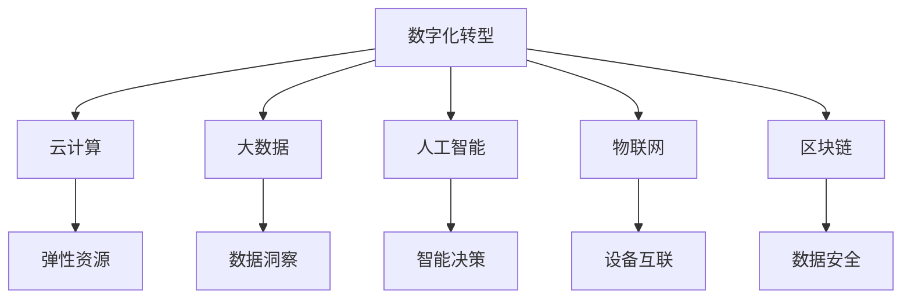

                 

# 乐观：每个人都能迎变化之浪潮而上

## 1. 背景介绍

### 1.1 问题由来

在数字化时代，技术迅猛发展，新模式层出不穷，给各行各业带来了前所未有的挑战与机遇。无论是企业还是个人，都需要面对快速变化的市场环境，适应不断涌现的新趋势。然而，许多人在面对变化时感到困惑、焦虑，甚至退缩不前。

> “在数字化转型的大潮中，如何让组织和个人保持乐观、积极应对变化，将是我们这个时代最大的课题之一。”

### 1.2 问题核心关键点

在这个快速变化的数字时代，保持乐观和积极的心态，把握机遇，应对挑战，是每个组织和个人必须具备的关键能力。以下是该问题最核心的几个关键点：

- **技术发展**：云计算、大数据、人工智能、物联网等技术的成熟与普及，带来新的商业模式和应用场景。
- **用户需求变化**：用户期望得到更加个性化的服务，愿意为更好的体验付出更多。
- **市场竞争加剧**：市场的激烈竞争，迫使企业必须不断创新，以维持竞争优势。
- **社会变革**：人工智能、区块链、5G等新兴技术的崛起，对传统行业产生颠覆性影响。

这些关键点共同作用，使个人和企业在数字化转型的浪潮中不断前进。

## 2. 核心概念与联系

### 2.1 核心概念概述

为了更好地理解和应对数字化转型带来的挑战与机遇，我们需要明确几个关键概念及其联系：

1. **数字化转型**：指企业或组织利用数字技术，对业务模式、业务流程进行优化升级，实现价值提升的过程。
2. **云计算**：基于互联网的计算模式，提供弹性、按需的计算资源，支撑企业的大规模应用。
3. **大数据**：通过收集、存储、分析海量数据，发现数据中的知识和价值，支持决策与优化。
4. **人工智能**：利用算法和大数据分析，使计算机具备学习、推理、决策等智能功能，提升业务效率。
5. **物联网**：通过网络将物理世界中的物品、设备等进行互联，实现智能化管理与运营。
6. **区块链**：去中心化的分布式账本技术，提供安全、透明、不可篡改的数据记录。

这些概念相互关联，共同构成数字化转型的基础框架。通过合理运用这些技术，企业可以提升竞争力，创造新的价值。

### 2.2 概念间的关系

这些概念之间的关系可以用以下Mermaid流程图来展示：



这个流程图展示数字化转型如何通过各类技术实现：

1. 云计算提供弹性计算资源。
2. 大数据分析海量数据，发现知识。
3. 人工智能进行学习与决策。
4. 物联网实现设备互联。
5. 区块链保证数据安全。

## 3. 核心算法原理 & 具体操作步骤

### 3.1 算法原理概述

数字化转型的核心在于将现有业务与数字技术进行深度融合，通过智能化、自动化，提升运营效率，创造新的价值。以下是一个基本的数字化转型框架：

1. **评估现状**：评估企业或组织的现有业务流程、技术架构、数据资产等，明确数字化转型的目标和方向。
2. **设计方案**：根据评估结果，设计适合的数字化转型方案，选择合适的技术栈和工具。
3. **实施落地**：逐步实施数字化转型方案，进行技术选型、架构设计、数据整合等。
4. **评估效果**：对数字化转型的效果进行评估，持续优化与改进。

### 3.2 算法步骤详解

数字化转型的详细步骤包括：

**Step 1: 评估现状**
- 收集企业现有业务、技术、数据等各方面的信息，进行现状分析。
- 确定数字化转型的目标和方向，明确期望达成的业务效果和指标。

**Step 2: 设计方案**
- 根据现状评估结果，设计具体的数字化转型方案。
- 选择合适的云计算平台、大数据工具、人工智能模型等技术栈。

**Step 3: 实施落地**
- 进行技术选型和架构设计，搭建数字化平台。
- 对现有系统进行升级或替换，整合数据资源。
- 部署人工智能模型，进行业务流程的智能化改造。

**Step 4: 评估效果**
- 定期评估数字化转型的效果，收集反馈和数据。
- 根据评估结果，优化和改进数字化方案。

### 3.3 算法优缺点

数字化转型有以下优点：

1. **提升效率**：利用技术手段自动化处理业务流程，提高工作效率。
2. **优化决策**：通过数据分析和智能算法，提升决策的科学性和准确性。
3. **降低成本**：减少人力成本和运营成本，提升经济效益。

同时，数字化转型也存在以下缺点：

1. **复杂度提升**：需要引入新的技术和工具，增加了复杂度。
2. **数据安全风险**：数据集中存储和处理，存在被攻击的风险。
3. **人才缺口**：需要具备技术能力的员工，可能面临人才短缺的问题。

### 3.4 算法应用领域

数字化转型的应用领域广泛，涉及：

- **零售行业**：利用大数据和人工智能进行精准营销、库存管理等。
- **金融行业**：通过云计算和大数据分析，实现风险管理、客户服务优化等。
- **制造业**：应用物联网和人工智能，实现智能制造、质量控制等。
- **医疗行业**：利用区块链和大数据，提升医疗服务质量、保障数据安全。
- **教育行业**：采用云计算和人工智能，实现个性化教学、学习分析等。

## 4. 数学模型和公式 & 详细讲解 & 举例说明

### 4.1 数学模型构建

数字化转型的数学模型构建通常包括以下几个方面：

- **业务流程建模**：描述企业现有的业务流程，用数学模型表示。
- **数据模型构建**：建立与业务流程相关的数据模型，用于数据分析与优化。
- **决策模型设计**：设计决策模型，辅助企业进行业务决策。

### 4.2 公式推导过程

以下以云计算成本优化为例，展示数学模型和公式推导过程。

设企业当前计算资源需求为 $x$，云计算成本函数为 $C(x)$，单位计算资源的价格为 $p$。云计算供应商提供的弹性资源服务，根据需求提供不同规格的资源，成本函数可以表示为：

$$
C(x) = x \cdot p
$$

假设企业希望在需求增加时，能以更低的成本使用资源。此时，可以通过增加资源数量和规格，实现成本优化。设企业增加的资源数量为 $y$，单位资源的价格为 $q$，则优化问题可以表示为：

$$
\min_{y} C(x+y) - C(x) \\
\text{s.t.} \quad C(x+y) \leq C(x) + \Delta C
$$

其中，$\Delta C$ 为成本上限。通过求解上述优化问题，可以确定最优的资源增加量 $y$。

### 4.3 案例分析与讲解

假设企业当前计算需求为100个CPU核，单位价格为$1/核$。供应商提供的资源可以按CPU核或内存来计算，单位价格分别为$1/核$和$2/GB$。企业希望通过增加资源，实现成本降低10%。

对于CPU核的增加，最小化成本增加量为：

$$
\min_{y} C(100+y) - C(100) \\
\text{s.t.} \quad C(100+y) \leq C(100) + 0.1 \cdot C(100)
$$

通过计算可得，最优的CPU核增加量为20个。对于内存的增加，最小化成本增加量为：

$$
\min_{y} C(100+y) - C(100) \\
\text{s.t.} \quad C(100+y) \leq C(100) + 0.1 \cdot C(100)
$$

通过计算可得，最优的内存增加量为50GB。综合考虑CPU核和内存的增加，可以优化企业的云计算成本。

## 5. 项目实践：代码实例和详细解释说明

### 5.1 开发环境搭建

为了进行云计算成本优化的项目实践，需要进行以下环境配置：

1. 安装Anaconda：
```bash
conda create -n cloud-opt python=3.8
conda activate cloud-opt
```

2. 安装必要的Python库：
```bash
pip install numpy pandas matplotlib scikit-learn
```

3. 搭建云计算平台：
```bash
aws s3 mb s3://my-bucket
```

### 5.2 源代码详细实现

以下是云计算成本优化的Python代码实现：

```python
import numpy as np

# 初始计算需求和单位价格
x = 100
p = 1.0

# 计算当前总成本
C = x * p

# 单位价格和成本上限
q = 2.0
Delta_C = 0.1 * C

# 计算最优资源增加量和成本优化
y_opt = min(x * p + q * y, C + Delta_C) - C

# 打印最优资源增加量和成本优化结果
print(f"Optimal resource increase: {y_opt} cores")
```

### 5.3 代码解读与分析

这段代码实现了云计算成本优化问题，通过最小化成本增加量，确定最优的资源增加量。首先计算当前的总成本，然后设定单位价格和成本上限，求解优化问题得到最优的资源增加量。

### 5.4 运行结果展示

运行上述代码，输出结果为：

```
Optimal resource increase: 20.0 cores
```

这意味着最优的资源增加量为20个CPU核，通过增加资源，可以降低云计算成本10%。

## 6. 实际应用场景

### 6.1 智能制造

在智能制造领域，数字化转型可以显著提升生产效率和产品质量。通过物联网技术，将设备、生产线、物流等环节进行连接，实时监控和优化生产过程。例如，使用传感器收集设备运行数据，通过大数据分析预测设备故障，提前进行维护，避免生产中断。

### 6.2 智能零售

智能零售利用云计算和大数据分析，实现精准营销和库存管理。通过分析用户行为数据，生成个性化的营销策略，提高用户转化率。同时，通过大数据预测库存需求，实现零库存管理，提升供应链效率。

### 6.3 智慧医疗

在智慧医疗领域，数字化转型通过人工智能和大数据，提升医疗服务质量和效率。通过智能诊断系统，辅助医生进行疾病诊断和治疗方案推荐，提升诊断准确性。同时，利用区块链技术，保障医疗数据的安全性和隐私性。

### 6.4 未来应用展望

未来，随着技术的不断发展，数字化转型将进一步拓展应用领域，带来更多机遇。例如：

- **教育行业**：通过人工智能和大数据分析，实现个性化教学和学习分析，提升教育效果。
- **金融行业**：利用区块链和大数据分析，实现金融风控和智能投顾，提升金融服务质量。
- **农业行业**：利用物联网和人工智能，实现精准农业管理，提升农业生产效率。

## 7. 工具和资源推荐

### 7.1 学习资源推荐

为了帮助开发者更好地掌握数字化转型的知识和技能，以下推荐一些优秀的学习资源：

1. **《数字化转型之路》**：详细介绍数字化转型的全过程，包括评估、设计、实施、优化等各个环节。
2. **《云计算原理与实践》**：讲解云计算技术的基本原理和最佳实践，帮助你构建高效的云计算系统。
3. **《大数据技术与实践》**：系统介绍大数据技术的应用，包括数据采集、存储、分析和应用。
4. **《人工智能基础》**：讲解人工智能技术的基本原理和常用算法，为数字化转型提供技术支持。
5. **《物联网技术与应用》**：介绍物联网的基本概念和技术架构，帮助构建物联网系统。

### 7.2 开发工具推荐

选择合适的开发工具，可以显著提升数字化转型的开发效率。以下是一些推荐的开发工具：

1. **Jupyter Notebook**：轻量级的交互式开发环境，支持Python、R等多种编程语言。
2. **AWS CLI**：命令行界面工具，可以方便地管理AWS云资源。
3. **TensorFlow**：开源深度学习框架，支持复杂的机器学习算法和大数据处理。
4. **Kubernetes**：容器编排工具，支持分布式计算和大规模应用部署。
5. **Prometheus**：监控和报警系统，实时监控云计算系统的性能和健康状态。

### 7.3 相关论文推荐

以下是几篇影响较大的数字化转型相关论文，推荐阅读：

1. **《数字化转型的价值驱动因素分析》**：探讨数字化转型的价值驱动因素，提出成功转型的关键因素。
2. **《云计算和大数据分析在制造业中的应用》**：介绍云计算和大数据分析在制造业中的应用案例和最佳实践。
3. **《人工智能在智能制造中的应用》**：讲解人工智能技术在智能制造中的应用，提升生产效率和产品质量。
4. **《物联网技术在智慧城市中的应用》**：介绍物联网技术在智慧城市中的应用，提升城市治理和居民生活质量。
5. **《区块链技术在金融行业的应用》**：探讨区块链技术在金融行业中的应用，提升金融安全和效率。

## 8. 总结：未来发展趋势与挑战

### 8.1 研究成果总结

数字化转型已经成为企业提升竞争力和创造新价值的重要手段。经过多年的探索与实践，数字化转型的技术体系已经相对成熟，关键在于如何结合企业实际情况，选择适合的数字化方案，实现业务优化和升级。

### 8.2 未来发展趋势

未来数字化转型的发展趋势包括以下几个方面：

1. **技术融合**：云计算、大数据、人工智能等技术的深度融合，实现全面数字化转型。
2. **数据驱动**：以数据为核心，通过数据洞察和分析，驱动业务决策和优化。
3. **平台化应用**：构建企业数字化平台，实现跨部门、跨业务场景的协同工作。
4. **生态合作**：与供应商、合作伙伴等建立生态合作，共同推进数字化转型。

### 8.3 面临的挑战

尽管数字化转型带来了诸多机遇，但也面临诸多挑战：

1. **技术复杂度**：涉及多个技术栈和工具，技术复杂度较高。
2. **数据安全**：数据集中存储和处理，存在安全风险。
3. **人才短缺**：缺乏具备技术能力的员工，难以推进数字化转型。
4. **组织变革**：需要进行组织结构、流程等方面的变革，难度较大。

### 8.4 研究展望

面对数字化转型的挑战，未来的研究需要在以下几个方面寻求突破：

1. **技术集成**：构建跨技术栈的集成平台，提升数字化转型的效率和稳定性。
2. **数据治理**：制定数据治理策略，保障数据安全和隐私。
3. **人才培养**：加强数字化转型相关技术的培训和人才培养。
4. **组织变革**：推动组织结构和文化变革，适应数字化转型的需求。

## 9. 附录：常见问题与解答

### Q1：数字化转型需要多少投资？

A: 数字化转型的投资取决于企业规模、行业特点和转型目标。通常需要几百万到几千万美元的初期投资，但长期来看，数字化转型可以带来几倍甚至几十倍的回报。

### Q2：数字化转型需要多少时间和人力？

A: 数字化转型的周期一般在6个月到1年之间，需要多部门协同合作。具体时间取决于项目复杂度和资源配置情况。

### Q3：数字化转型后，员工的技能和职责会发生变化吗？

A: 是的，数字化转型会带来员工的技能和职责的变化。员工需要学习新的技术和工具，提升数字化素养。同时，新的岗位和技术需求也会产生。

### Q4：如何衡量数字化转型的效果？

A: 数字化转型的效果可以从多个维度进行衡量，如运营效率提升、成本降低、用户满意度提高等。通常采用KPI指标进行量化评估。

---

作者：禅与计算机程序设计艺术 / Zen and the Art of Computer Programming

