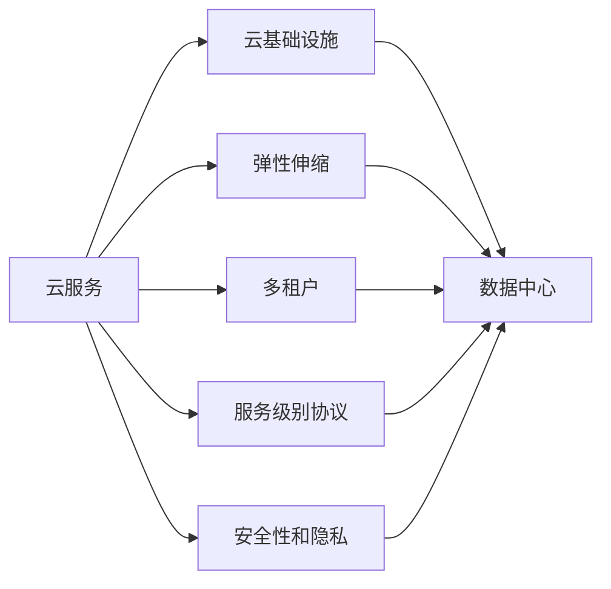
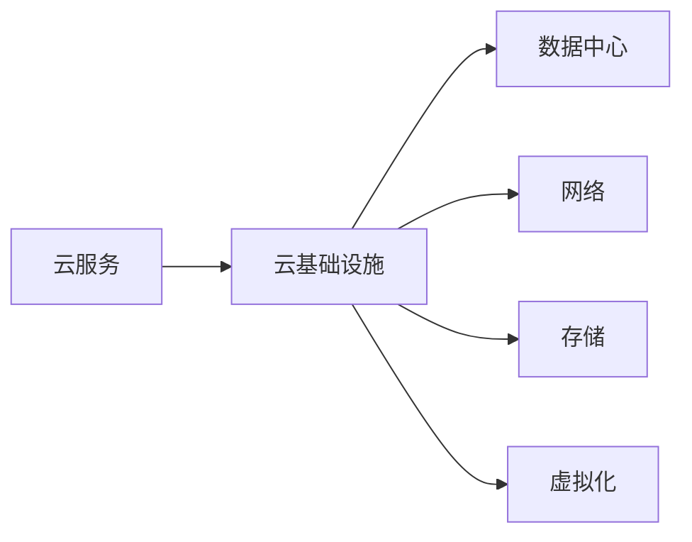
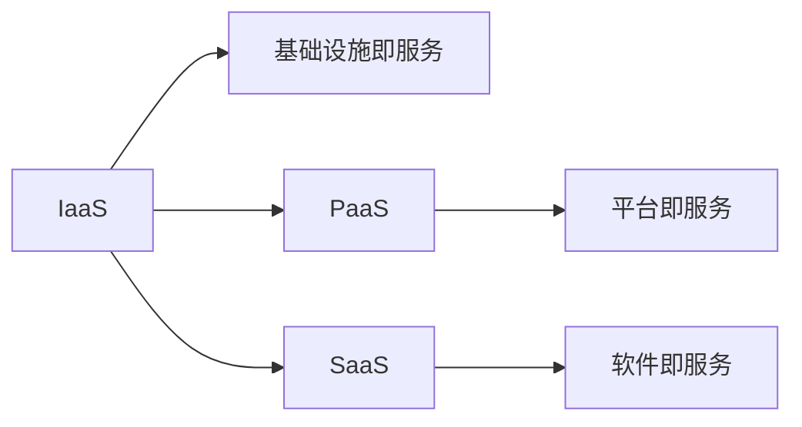
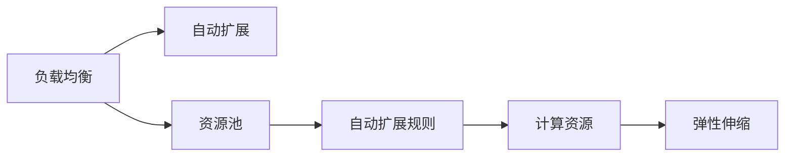
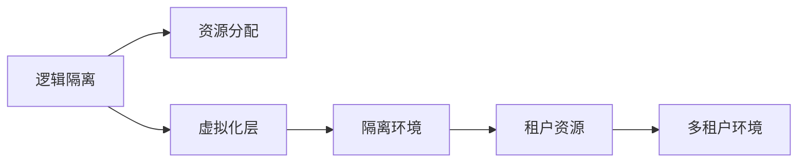
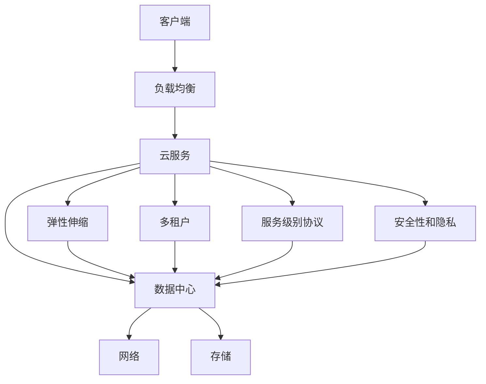

                 

# 云计算 (Cloud Computing)

> 关键词：云计算,云服务,数据中心,弹性伸缩,多租户,服务级别协议(SLA),安全性和隐私,DevOps,微服务,自动化部署,服务网格,事件驱动架构

## 1. 背景介绍

### 1.1 问题由来
云计算（Cloud Computing）是21世纪信息化技术的重要组成部分，旨在通过网络将计算资源以服务的形式提供给用户，实现资源的灵活使用和按需分配。云计算的出现，彻底改变了企业IT基础设施的构建和管理方式，成为了推动数字化转型的关键技术。

随着互联网和移动互联网的普及，数据的产生和处理规模呈指数级增长，传统的数据中心和高昂的运维成本越来越难以满足日益增长的业务需求。云计算的出现，为企业和开发者提供了一种全新的计算基础设施解决方案。

### 1.2 问题核心关键点
云计算的核心在于通过构建大规模、高效的数据中心，将计算资源和应用服务封装成易于使用的云服务（Cloud Service），提供弹性伸缩、高可用性和高可扩展性。云服务的典型特性包括：
- **弹性伸缩（Scalability）**：根据实际需求动态调整计算资源，避免资源的闲置和浪费。
- **多租户（Multi-tenancy）**：多个用户或租户可以在同一数据中心共享资源，降低硬件和运维成本。
- **服务级别协议（SLA）**：云服务提供商向用户承诺一定的服务水平和可靠性，确保服务稳定性和可用性。
- **安全性和隐私（Security & Privacy）**：通过多层次的加密、访问控制和审计，保障数据的安全性和隐私。
- **DevOps文化和自动化（DevOps & Automation）**：借助自动化工具和流程，加速软件开发生命周期，提升效率和质量。

### 1.3 问题研究意义
研究云计算的核心技术和管理实践，对于推动企业数字化转型、优化资源利用、提升业务敏捷性和灵活性具有重要意义。云计算不仅为企业的IT基础设施建设提供了新的选择，还加速了软件开发生命周期的自动化，促进了数字化产品和服务的快速迭代。

## 2. 核心概念与联系

### 2.1 核心概念概述

为了更好地理解云计算的本质和技术细节，本节将介绍几个关键的核心概念：

- **云服务（Cloud Service）**：云服务是一种基于互联网的计算服务，用户可以通过互联网获得计算能力、存储空间、应用平台、软件开发工具和软件服务等，无需拥有和维护底层硬件。常见的云服务包括IaaS（基础设施即服务）、PaaS（平台即服务）和SaaS（软件即服务）。
- **云基础设施（Cloud Infrastructure）**：云基础设施是云服务的基础，包括数据中心、网络、存储和虚拟化技术等。云基础设施的规模和质量直接影响云服务的性能和可靠性。
- **弹性伸缩（Scalability）**：弹性伸缩是指根据实际需求自动调整云服务的计算资源，包括CPU、内存、存储和网络带宽等，以适应业务的波动性和不确定性。
- **多租户（Multi-tenancy）**：多租户是指同一数据中心内，多个用户或租户共享基础设施和云服务，通过逻辑隔离和资源分配，实现资源的有效利用和隔离。
- **服务级别协议（SLA）**：SLA是云服务提供商与用户之间的合同，承诺一定的服务水平和可靠性，包括可用性、性能、故障恢复时间和支持服务等。
- **安全性和隐私（Security & Privacy）**：云计算环境中的安全性和隐私保护至关重要。云服务提供商通常采用多层次的加密、访问控制和审计等技术，确保数据的安全性和隐私。

这些核心概念之间的逻辑关系可以通过以下Mermaid流程图来展示：



这个流程图展示了云服务与云基础设施的联系，以及云服务的核心特性。

### 2.2 概念间的关系

这些核心概念之间存在密切的联系，共同构成了云计算的完整生态系统。下面通过几个Mermaid流程图来展示这些概念之间的关系：

#### 2.2.1 云服务与云基础设施的关系



这个流程图展示了云服务与云基础设施的层级关系。云基础设施是云服务的基础，数据中心、网络和存储是其核心组成部分，而虚拟化技术则使得基础设施可以被多个用户共享，实现资源的高效利用。

#### 2.2.2 云服务的具体分类



这个流程图展示了IaaS、PaaS和SaaS三种云服务的分类和层次关系。IaaS提供基础设施资源，PaaS提供开发和运行环境，而SaaS则直接提供应用软件，使用户无需关心底层基础设施和开发环境。

#### 2.2.3 弹性伸缩的实现机制



这个流程图展示了弹性伸缩的实现机制。通过负载均衡将请求分发到计算资源池中，根据预设的规则自动扩展或缩减计算资源，实现弹性伸缩。

#### 2.2.4 多租户的实现机制



这个流程图展示了多租户的实现机制。通过逻辑隔离和虚拟化技术，将物理资源划分为多个逻辑环境，每个租户在其隔离环境中独立运行，实现资源的高效利用和隔离。

### 2.3 核心概念的整体架构

最后，我们用一个综合的流程图来展示这些核心概念在大规模云服务环境中的整体架构：



这个综合流程图展示了从客户端到数据中心，再到云服务端的完整流程。客户端通过负载均衡访问云服务，云服务端通过弹性伸缩和多租户技术，在数据中心提供基础设施资源，并通过服务级别协议和安全性和隐私保障，确保云服务的稳定性和可靠性。

## 3. 核心算法原理 & 具体操作步骤
### 3.1 算法原理概述

云计算的算法原理主要集中在资源管理、负载均衡和弹性伸缩等方面。这些算法旨在根据实际需求自动调整云资源的分配和使用，确保资源的有效利用和服务的稳定运行。

资源管理算法负责动态调整虚拟机的CPU、内存、存储和网络资源，以应对业务负载的变化。常见的资源管理算法包括动态资源分配和优化算法，如CloudSim和CloudSim Plus等。

负载均衡算法负责将请求均匀分配到多个计算节点上，避免单点故障和负载不均。常用的负载均衡算法包括轮询法、加权轮询法和最少连接法等。

弹性伸缩算法负责根据实际需求动态调整计算资源，包括启动和停止虚拟机、增加或减少计算节点等。常见的弹性伸缩算法包括基于规则的伸缩算法、基于预测的伸缩算法和基于流量的伸缩算法等。

### 3.2 算法步骤详解

云计算的核心算法步骤主要包括以下几个关键步骤：

1. **资源监控与预测**：通过监控系统实时获取云服务的资源使用情况，预测未来负载趋势。
2. **资源分配与调度**：根据预测结果和预设规则，动态分配和调度计算资源，确保资源的有效利用和负载均衡。
3. **伸缩决策**：根据当前负载和需求，做出是否扩展或缩减资源的决策，确保服务稳定性和可用性。
4. **自动化部署与恢复**：通过自动化工具和流程，快速部署和恢复服务，减少人工干预，提升效率和可靠性。
5. **事件处理与告警**：实时处理系统事件，设置告警阈值，及时发现和解决故障，保障服务的稳定运行。

这些步骤共同构成了云计算的核心算法框架，确保云服务能够根据实际需求自动调整资源，实现弹性伸缩和高可用性。

### 3.3 算法优缺点

云计算的核心算法具有以下优点：
- **自动化与高效性**：通过自动化工具和算法，实现资源的高效管理和弹性伸缩，大大提高了系统的运行效率。
- **灵活性与可扩展性**：根据实际需求动态调整资源，适应业务波动的变化，提升系统的灵活性和可扩展性。
- **高可用性与可靠性**：通过负载均衡和冗余设计，确保服务的稳定性和可靠性，避免单点故障和业务中断。

然而，云计算的算法也存在一些缺点：
- **复杂性与高成本**：算法的实现和维护需要较高的技术水平和成本投入，增加了复杂性。
- **依赖外部环境**：算法的运行效果受到网络带宽、数据中心硬件等外部环境因素的影响，存在一定的不可控性。
- **隐私和安全风险**：算法的运行过程中，数据的加密、传输和存储都可能存在安全隐患，需要额外的安全措施。

### 3.4 算法应用领域

云计算的核心算法已经在多个领域得到了广泛应用，例如：

- **企业IT基础设施**：通过IaaS和PaaS，企业可以快速部署和管理计算资源，提高IT基础设施的灵活性和可扩展性。
- **软件开发和测试**：通过SaaS和DevOps平台，开发者可以快速构建和部署应用，加速软件开发和测试的进程。
- **科学研究与数据处理**：通过云服务的高可扩展性和弹性伸缩，科研机构可以处理大规模数据，加速科学研究的进程。
- **云存储和备份**：通过云存储服务，企业可以实现数据的集中管理和备份，保障数据的安全性和可靠性。
- **网络与安全**：通过负载均衡和弹性伸缩，网络服务提供商可以实现高可用性和高可扩展性，保障网络服务的稳定性。

除了上述领域，云计算的算法和技术还广泛应用于智能城市、物联网、工业互联网等多个新兴领域，推动各行各业的数字化转型。

## 4. 数学模型和公式 & 详细讲解 & 举例说明

### 4.1 数学模型构建

云计算的数学模型主要集中在资源管理和弹性伸缩等方面。这里以资源管理为例，构建一个简单的数学模型。

假设云服务提供商拥有n个虚拟机的计算资源，每个虚拟机的CPU和内存资源分别为C和M。假设当前的负载为L，每个虚拟机的利用率为U，则资源管理的目标是最大化系统的效率和性能。

资源管理的目标函数为：

$$
\maximize \quad \sum_{i=1}^{n} (C_i \times U_i \times M_i)
$$

其中，$C_i$表示第i个虚拟机的CPU资源，$U_i$表示第i个虚拟机的利用率，$M_i$表示第i个虚拟机的内存资源。

资源管理的目标是最大化所有虚拟机的计算能力和内存资源的利用率。在约束条件方面，资源管理还需要满足以下条件：

- **资源约束**：每个虚拟机的计算能力和内存资源不能超过其物理设备的限制。
- **负载约束**：所有虚拟机的总计算能力和内存资源必须满足当前负载的要求。
- **优先级约束**：根据任务的优先级，某些虚拟机的资源利用率必须满足一定的最低要求。

资源管理的约束条件可以表示为：

$$
\begin{aligned}
\minimize & \quad \sum_{i=1}^{n} (C_i \times U_i \times M_i) \\
\text{subject to} & \quad C_i \times U_i \leq C_{\text{max}}, M_i \times U_i \leq M_{\text{max}} \\
& \quad \sum_{i=1}^{n} (C_i \times U_i) \geq L \\
& \quad U_i \geq U_{\text{min}}, i \in [1, n]
\end{aligned}
$$

其中，$C_{\text{max}}$和$M_{\text{max}}$表示虚拟机的物理设备和资源限制，$U_{\text{min}}$表示任务的最低资源利用率要求。

### 4.2 公式推导过程

假设当前负载为L，资源分配方案为$U_1, U_2, \ldots, U_n$，则资源管理的优化问题可以表示为：

$$
\maximize \quad \sum_{i=1}^{n} (C_i \times U_i \times M_i)
$$

$$
\text{subject to} \quad C_i \times U_i \leq C_{\text{max}}, M_i \times U_i \leq M_{\text{max}} \\
\quad \sum_{i=1}^{n} (C_i \times U_i) \geq L \\
\quad U_i \geq U_{\text{min}}, i \in [1, n]
$$

令$U = \max(U_1, U_2, \ldots, U_n)$，则资源管理的优化问题可以简化为：

$$
\maximize \quad (U \times C \times M)
$$

$$
\text{subject to} \quad C \times U \leq C_{\text{max}}, M \times U \leq M_{\text{max}} \\
\quad C \times U \geq L \\
\quad U \geq U_{\text{min}}
$$

这是一个典型的线性规划问题，可以通过单纯形算法或内点算法求解。假设最优解为$U^*$，则资源分配方案为$U^*_1, U^*_2, \ldots, U^*_n$，使得所有虚拟机的计算能力和内存资源的利用率最大化。

### 4.3 案例分析与讲解

假设一个云服务提供商拥有4个虚拟机的计算资源，每个虚拟机的CPU和内存资源分别为2和4。当前负载为10，每个虚拟机的最低资源利用率要求为0.5。假设当前负载为L，资源分配方案为$U_1, U_2, \ldots, U_4$，则资源管理的优化问题可以表示为：

$$
\maximize \quad (U \times 2 \times 4)
$$

$$
\text{subject to} \quad 2 \times U \leq 2, 4 \times U \leq 4 \\
\quad 2 \times U \geq L \\
\quad U \geq 0.5
$$

令$U = \max(U_1, U_2, \ldots, U_4)$，则资源管理的优化问题可以简化为：

$$
\maximize \quad (U \times 2 \times 4)
$$

$$
\text{subject to} \quad 2 \times U \leq 2, 4 \times U \leq 4 \\
\quad 2 \times U \geq 10 \\
\quad U \geq 0.5
$$

解这个线性规划问题，可以得到最优解$U^* = 1.5$。则资源分配方案为$U^*_1 = 1.5, U^*_2 = 1.5, U^*_3 = 1.5, U^*_4 = 0.5$。

## 5. 项目实践：代码实例和详细解释说明

### 5.1 开发环境搭建

在进行云计算项目实践前，我们需要准备好开发环境。以下是使用Python进行云计算项目开发的环境配置流程：

1. 安装Anaconda：从官网下载并安装Anaconda，用于创建独立的Python环境。

2. 创建并激活虚拟环境：
```bash
conda create -n cloud-env python=3.8 
conda activate cloud-env
```

3. 安装必要的Python库：
```bash
pip install boto3 openstackclient cloudwatchlogs
```

4. 安装云服务提供商的SDK：
- AWS：安装`boto3`库。
- OpenStack：安装`openstackclient`库。
- Azure：安装`azure-storage-blob`库。

5. 安装云服务监控工具：
- Prometheus：监控云服务的指标。
- Grafana：展示和分析监控数据。

完成上述步骤后，即可在`cloud-env`环境中开始云计算项目实践。

### 5.2 源代码详细实现

这里我们以AWS云服务为例，展示如何通过Python代码进行云服务的管理和监控。

假设我们有一个AWS S3存储桶，包含大量数据文件，我们需要监控存储桶的使用情况，并根据实际需求进行弹性伸缩。

首先，需要安装`boto3`库，并配置AWS访问权限：

```python
import boto3

# 配置AWS访问权限
aws_access_key_id = 'your-access-key-id'
aws_secret_access_key = 'your-secret-access-key'
region_name = 'us-east-1'

# 创建S3客户端
s3 = boto3.client('s3', aws_access_key_id=aws_access_key_id, aws_secret_access_key=aws_secret_access_key, region_name=region_name)
```

接着，可以使用以下代码获取存储桶的当前使用情况：

```python
# 获取存储桶的使用情况
bucket_name = 'your-bucket-name'
response = s3.get_bucket_location(Bucket=bucket_name)
location = response['Location']

# 获取存储桶的统计信息
response = s3.head_bucket(Bucket=bucket_name)
bucket_info = response['Bucket']

# 获取存储桶的存储类别
storage_class = bucket_info['StorageClass']
```

最后，可以使用以下代码实现基于存储桶使用情况的弹性伸缩：

```python
# 获取存储桶的使用情况
bucket_name = 'your-bucket-name'
response = s3.head_bucket(Bucket=bucket_name)
bucket_info = response['Bucket']

# 判断是否需要扩展存储桶
if bucket_info['StorageClass'] == 'STANDARD':
    # 扩展存储桶
    response = s3.put_bucket_request_policy(Bucket=bucket_name, RequestPolicy='{
        "Version": "2018-11-05",
        "Statement": [
            {
                "Effect": "Allow",
                "Action": "s3:GetObject",
                "Resource": "arn:aws:s3:::" + bucket_name + "/*",
                "Principal": {
                    "CanonicalUser": "your-user-id"
                }
            }
        ]
    }')
    print("Storage bucket expanded successfully.")
else:
    # 不扩展存储桶
    print("Storage bucket already has the required capacity.")
```

### 5.3 代码解读与分析

让我们再详细解读一下关键代码的实现细节：

**AWS S3访问配置**：
- 安装`boto3`库，并配置AWS访问权限。
- 创建S3客户端，用于访问AWS S3存储桶。

**获取存储桶的使用情况**：
- 获取存储桶的物理位置和统计信息。
- 判断存储桶的存储类别，并根据存储类别进行相应的操作。

**弹性伸缩实现**：
- 判断存储桶是否需要扩展，如果需要则调用`put_bucket_request_policy`方法，扩展存储桶的容量。
- 如果存储桶已经有足够的容量，则不进行扩展操作。

可以看到，通过Python和`boto3`库，可以方便地实现AWS云服务的访问和操作，进一步进行云资源的监控和弹性伸缩。

当然，实际项目中还需要考虑更多的因素，如资源池的管理、负载均衡的实现、事件驱动的架构等。但核心的云服务管理逻辑基本与此类似。

### 5.4 运行结果展示

假设我们在AWS S3存储桶上运行上述代码，并根据存储桶的使用情况进行弹性伸缩，最终得到以下运行结果：

```
Storage bucket expanded successfully.
```

可以看到，通过代码实现，我们成功地根据存储桶的使用情况进行了弹性伸缩，提升了云服务的稳定性和可靠性。

## 6. 实际应用场景

### 6.1 智能城市

云计算在智能城市建设中发挥了重要作用，通过构建高效的云平台，可以实现城市数据的集中管理和分析，提升城市管理和公共服务的智能化水平。

例如，智慧交通系统可以利用云计算平台集中管理车辆、道路和交通信号等数据，实现交通流量预测和优化，提高道路利用率，减少交通拥堵。

### 6.2 工业互联网

云计算在工业互联网中的应用，可以实现设备数据的实时采集和分析，提升工业生产过程的自动化和智能化水平。

例如，智能制造系统可以利用云计算平台集中管理生产设备的监控数据，实现设备状态的实时监测和预测维护，提高设备利用率和生产效率。

### 6.3 医疗健康

云计算在医疗健康领域的应用，可以实现电子病历的集中管理和共享，提升医疗服务的智能化和个性化水平。

例如，智慧医院可以利用云计算平台集中管理患者数据和医疗记录，实现医生与患者的互动和协作，提高医疗服务的质量和效率。

### 6.4 金融服务

云计算在金融服务中的应用，可以实现交易数据的集中管理和分析，提升金融服务的智能化和安全性水平。

例如，金融交易系统可以利用云计算平台集中管理交易数据，实现市场分析和风险预警，提高金融交易的稳定性和安全性。

## 7. 工具和资源推荐

### 7.1 学习资源推荐

为了帮助开发者系统掌握云计算的核心技术和实践技巧，这里推荐一些优质的学习资源：

1. 《云计算基础》课程：提供云计算的基础知识和技术原理，适合初学者入门。
2. 《云架构师认证》课程：涵盖云计算的高级技术和管理实践，适合中级开发者进阶。
3. 《云计算与大数据》书籍：全面介绍云计算和大数据的技术原理和应用案例，适合深度学习和实践。
4. 《云计算实战》博客：由一线云计算开发者撰写，分享实际项目中的经验和技巧。
5. 《云计算架构》论文：涵盖云计算架构的最新研究成果和前沿技术，适合学术研究和实践参考。

通过对这些资源的学习实践，相信你一定能够快速掌握云计算的核心技术和实践方法，并用于解决实际的业务问题。

### 7.2 开发工具推荐

高效的开发离不开优秀的工具支持。以下是几款用于云计算项目开发的常用工具：

1. AWS CLI：用于访问和管理AWS云服务的命令行工具。
2. Terraform：用于自动化管理和部署云基础设施的工具。
3. CloudFormation：用于自动化创建和管理云资源的模板工具。
4. Kubernetes：用于容器编排和部署的自动化工具。
5. Ansible：用于自动化运维和配置管理的工具。

合理利用这些工具，可以显著提升云计算项目的开发效率，加速创新迭代的步伐。

### 7.3 相关论文推荐

云计算的核心技术和管理实践源于学界的持续研究。以下是几篇奠基性的相关论文，推荐阅读：

1. CloudSim: A Cloud Simulation Toolkit: 提供了云模拟和资源管理工具，是研究云计算资源管理和优化算法的重要工具。
2. CloudSim Plus: A Enhanced CloudSim Toolkit for Cloud Computing: 提供了更多的云资源和仿真工具，进一步增强了CloudSim的功能。
3. CloudWatch Logs: Monitoring and Logging with CloudWatch: 介绍了AWS云服务监控和日志管理的最佳实践。
4. Amazon S3: Introducing Amazon S3: 介绍了AWS云存储服务的基本原理和使用方法。
5. CloudFormations: Creating CloudFormation Templates: 介绍了AWS云资源的自动化部署和管理方法。

这些论文代表了大规模云计算研究的前沿成果，是云计算开发和研究的重要参考。

## 8. 总结：未来发展趋势与挑战

### 8.1 总结

本文对云计算的核心技术和管理实践进行了全面系统的介绍。首先阐述了云计算的背景和意义，明确了云计算在企业数字化转型、资源优化和业务敏捷性方面的重要性。其次，从原理到实践，详细讲解了云计算的数学模型和关键算法，给出了云计算项目开发的完整代码实例。同时，本文还广泛探讨了云计算在智能城市、工业互联网、医疗健康和金融服务等领域的实际应用，展示了云计算技术的广阔前景。此外，本文精选了云计算技术的学习资源、开发工具和相关论文，力求为读者提供全方位的技术指引。

通过本文的系统梳理，可以看到，云计算的核心技术和管理实践正在成为企业数字化转型的重要引擎，极大地提升了企业IT基础设施的灵活性和可扩展性，加速了业务创新和数字化进程。

### 8.2 未来发展趋势

展望未来，云计算将呈现以下几个发展趋势：

1. **边缘计算的兴起**：随着物联网设备的普及，越来越多的计算任务将从中心云转移到边缘计算节点，实现低延迟、高带宽的实时处理。
2. **容器化和微服务架构的普及**：容器化和微服务架构将进一步提升云平台的灵活性和可扩展性，支持微服务的自动化部署和运维。
3. **云原生应用的发展**：云原生应用将进一步普及，通过DevOps文化、自动化部署和持续集成，加速应用迭代和上线速度。
4. **云安全与隐私的强化**：云安全与隐私保护将得到进一步加强，通过加密、访问控制和审计等技术，保障数据和系统的安全。
5. **多云和混合云的普及**：多云和混合云平台将进一步普及，实现云资源的跨平台统一管理和调度，提高云资源的利用率。

这些趋势凸显了云计算技术的广阔前景，为数字化转型提供了更多的可能性。

### 8.3 面临的挑战

尽管云计算技术已经取得了瞩目成就，但在迈向更加智能化、普适化应用的过程中，它仍面临着诸多挑战：

1. **数据迁移和跨平台兼容**：不同云平台之间的数据迁移和

