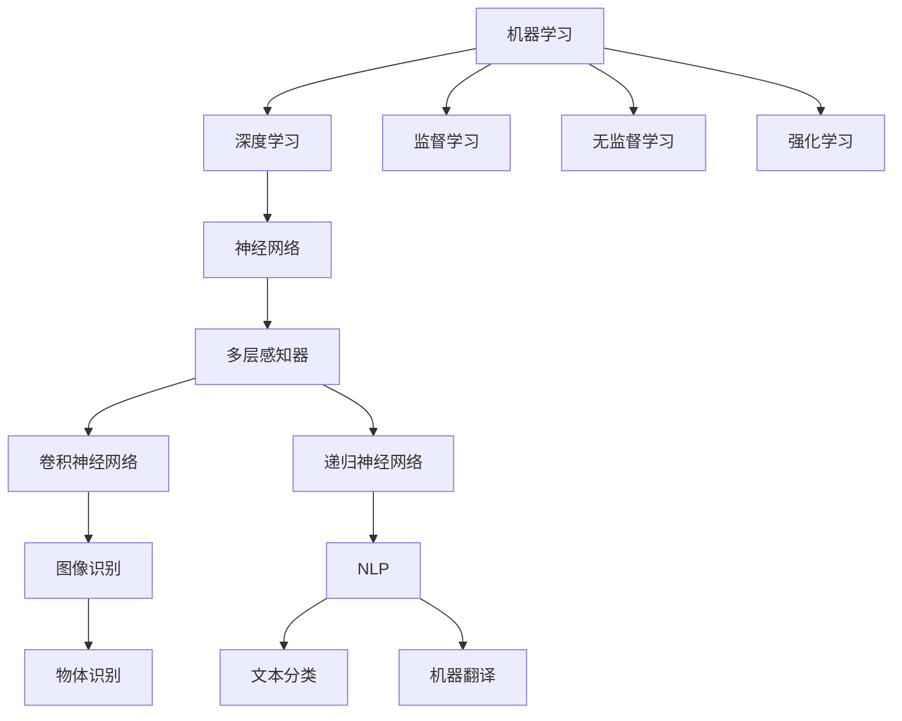
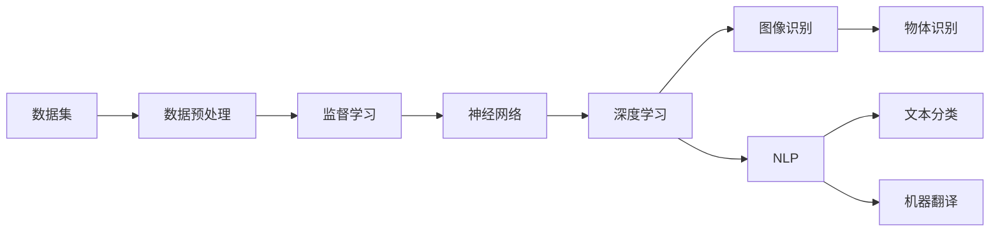

                 

# 人工智能 (Artificial Intelligence, AI) 原理与代码实例讲解

> 关键词：人工智能, 机器学习, 深度学习, 神经网络, 自然语言处理, 图像识别, 代码实例

## 1. 背景介绍

### 1.1 问题由来
人工智能（AI）是计算机科学的一个分支，旨在使计算机具备人类智能的能力，包括感知、理解、推理和学习。随着计算能力和数据量的不断增长，AI技术不断进步，已经广泛应用于医疗、金融、交通、教育等多个领域。

AI的核心思想是利用算法和模型，从数据中学习规律，实现自动化决策和预测。其基本原理包括机器学习、深度学习和自然语言处理等。机器学习是让计算机通过数据学习规律，而深度学习则是通过多层神经网络模拟人类大脑的复杂结构，自然语言处理则是使计算机能够理解和处理人类语言。

## 2. 核心概念与联系

### 2.1 核心概念概述

1. **机器学习**：通过数据训练模型，使模型能够预测未来数据。常用的机器学习算法包括监督学习、无监督学习和强化学习。
2. **深度学习**：利用多层神经网络进行特征提取和模式识别。深度学习已经在图像识别、语音识别、自然语言处理等领域取得了巨大成功。
3. **神经网络**：深度学习的基础，通过节点和边构建的复杂网络结构，模拟人类大脑的神经元连接。
4. **自然语言处理（NLP）**：使计算机能够理解、生成和处理人类语言。NLP涉及文本分类、语言模型、机器翻译等任务。
5. **图像识别**：使计算机能够识别和分类图像中的物体和场景。图像识别技术广泛应用于自动驾驶、安防监控等场景。
6. **计算机视觉**：使计算机能够“看”和理解视觉信息，是图像识别和NLP的结合。

### 2.2 核心概念之间的关系

以下通过一个Mermaid流程图展示核心概念之间的关系：



该图展示了核心概念之间的逻辑关系：

- 机器学习通过监督学习、无监督学习和强化学习等方法，训练模型进行预测。
- 深度学习是机器学习的一种，利用多层神经网络进行特征提取和模式识别。
- 神经网络是深度学习的基础，包括多层感知器、卷积神经网络和递归神经网络等。
- 图像识别和自然语言处理是深度学习在特定领域的应用。

### 2.3 核心概念的整体架构

以下是一个综合的流程图，展示从机器学习到深度学习，再到NLP和图像识别的整体架构：



该图展示了从数据预处理到深度学习，再到图像识别和NLP任务的整个流程。

## 3. 核心算法原理 & 具体操作步骤

### 3.1 算法原理概述

AI的核心算法原理包括监督学习、无监督学习和强化学习。其中，监督学习是最常用的AI算法，其原理是通过给定输入和输出数据，训练模型进行预测。无监督学习则是通过未标记的数据，自动学习数据的结构和规律。强化学习则是通过与环境的交互，学习最优策略，以最大化某种奖励。

### 3.2 算法步骤详解

**3.2.1 监督学习**

1. **数据准备**：收集并处理数据集，包括清洗、标准化和分割训练集、验证集和测试集。
2. **模型选择**：选择合适的模型架构，如线性回归、逻辑回归、决策树、支持向量机等。
3. **模型训练**：使用训练集对模型进行训练，最小化损失函数，优化模型参数。
4. **模型评估**：使用验证集对模型进行评估，选择最优模型。
5. **模型测试**：使用测试集对模型进行测试，评估模型性能。

**3.2.2 无监督学习**

1. **数据准备**：收集未标记的数据集。
2. **特征提取**：使用特征提取方法，如主成分分析（PCA）、t-SNE等，将数据映射到低维空间。
3. **模型训练**：选择无监督学习模型，如聚类算法、关联规则学习等，训练模型。
4. **模型评估**：使用指标如轮廓系数、SSE等评估模型性能。
5. **应用优化**：将模型应用于实际问题，如数据降维、异常检测等。

**3.2.3 强化学习**

1. **环境定义**：定义环境状态和奖励函数。
2. **模型选择**：选择合适的强化学习算法，如Q-learning、策略梯度等。
3. **模型训练**：通过与环境的交互，训练模型，最大化奖励。
4. **模型评估**：使用测试集评估模型性能。
5. **应用优化**：将模型应用于实际问题，如机器人控制、游戏AI等。

### 3.3 算法优缺点

**监督学习**：

- **优点**：数据需求少，效果显著。
- **缺点**：需要大量标注数据，对数据质量要求高。

**无监督学习**：

- **优点**：数据需求少，能自动发现数据结构。
- **缺点**：需要选择合适的特征提取方法，效果取决于数据质量。

**强化学习**：

- **优点**：不需要标注数据，适用于复杂环境。
- **缺点**：训练时间长，对环境定义要求高。

### 3.4 算法应用领域

监督学习、无监督学习和强化学习在多个领域都有广泛应用：

- **监督学习**：用于图像识别、语音识别、自然语言处理等。
- **无监督学习**：用于数据降维、异常检测、推荐系统等。
- **强化学习**：用于机器人控制、游戏AI、自动驾驶等。

## 4. 数学模型和公式 & 详细讲解 & 举例说明

### 4.1 数学模型构建

**监督学习**：

- **线性回归**：$y = \theta^T x + b$
- **逻辑回归**：$logit(y) = \theta^T x + b$
- **决策树**：$T(x) = \sum_{i=1}^{m} h_i T_{\text{child}_i}(x)$

**无监督学习**：

- **K-均值聚类**：$\min_{C} \sum_{i=1}^{n} \sum_{k=1}^{K} (x_i - \mu_k)^2$
- **PCA**：$\min_{\omega} ||X - U \omega||^2$
- **t-SNE**：$||\sigma^2 \exp(-\frac{1}{2\sigma^2} (x_i - x_j)^2)|| = ||y_i - y_j||$

**强化学习**：

- **Q-learning**：$Q_{t+1}(s_t,a_t) = Q_{t}(s_t,a_t) + \alpha [r + \gamma \max_{a} Q_{t}(s_{t+1},a) - Q_{t}(s_t,a_t)]$
- **策略梯度**：$\nabla_{\theta} \log \pi(a_t | s_t) J$

### 4.2 公式推导过程

**线性回归**：

- **损失函数**：$L(\theta) = \frac{1}{2N} \sum_{i=1}^{N} (y_i - \theta^T x_i)^2$
- **梯度下降**：$\theta \leftarrow \theta - \eta \frac{\partial L(\theta)}{\partial \theta}$
- **求解**：$\theta = (X^TX)^{-1}X^Ty$

**逻辑回归**：

- **损失函数**：$L(\theta) = -\frac{1}{N} \sum_{i=1}^{N} y_i log(\hat{y}_i) + (1-y_i)log(1-\hat{y}_i)$
- **梯度下降**：$\theta \leftarrow \theta - \eta \frac{\partial L(\theta)}{\partial \theta}$
- **求解**：$\theta = (X^TX)^{-1}X^Ty$

**K-均值聚类**：

- **损失函数**：$L(C) = \frac{1}{2N} \sum_{i=1}^{n} \sum_{k=1}^{K} ||x_i - \mu_k||^2$
- **梯度下降**：$\mu_k \leftarrow \frac{1}{|C_k|} \sum_{i \in C_k} x_i$
- **求解**：重复上述过程，直至损失函数收敛

### 4.3 案例分析与讲解

**案例一：线性回归**

假设我们有一组数据 $(x_i, y_i)$，其中 $x_i \in \mathbb{R}^d$，$y_i \in \mathbb{R}$。我们使用线性回归模型 $y = \theta^T x + b$ 进行预测。给定训练集 $X = [x_1, ..., x_n]$，$y = [y_1, ..., y_n]$，我们的目标是最小化损失函数 $L(\theta) = \frac{1}{2N} \sum_{i=1}^{N} (y_i - \theta^T x_i)^2$。求解过程如下：

1. **初始化**：$\theta = \theta_0$，$b = b_0$
2. **前向传播**：$y_i = \theta^T x_i + b$
3. **计算损失**：$L(\theta) = \frac{1}{2N} \sum_{i=1}^{N} (y_i - \theta^T x_i)^2$
4. **反向传播**：$\frac{\partial L(\theta)}{\partial \theta} = \frac{1}{N} (X^T (X \theta - y))$
5. **更新参数**：$\theta \leftarrow \theta - \eta \frac{\partial L(\theta)}{\partial \theta}$
6. **迭代**：重复2-5步骤，直至损失函数收敛

**案例二：K-均值聚类**

假设我们有一组数据 $x_i \in \mathbb{R}^d$，其中 $x_i$ 为样本点，$d$ 为样本维度。我们使用K-均值聚类算法将数据分为K个簇。给定初始簇中心 $\mu_k$，$k = 1, ..., K$，我们的目标是最小化损失函数 $L(C) = \frac{1}{2N} \sum_{i=1}^{n} \sum_{k=1}^{K} ||x_i - \mu_k||^2$。求解过程如下：

1. **初始化**：$C = [C_1, ..., C_K]$
2. **分配**：每个样本点 $x_i$ 分配到最近的簇中心 $\mu_k$，形成新的簇 $C_k$
3. **更新中心**：$\mu_k = \frac{1}{|C_k|} \sum_{i \in C_k} x_i$
4. **重复**：重复2-3步骤，直至簇中心不再变化

## 5. 项目实践：代码实例和详细解释说明

### 5.1 开发环境搭建

在进行AI项目实践前，我们需要准备好开发环境。以下是使用Python进行TensorFlow开发的环境配置流程：

1. 安装Anaconda：从官网下载并安装Anaconda，用于创建独立的Python环境。
2. 创建并激活虚拟环境：
```bash
conda create -n tf-env python=3.8 
conda activate tf-env
```
3. 安装TensorFlow：根据CUDA版本，从官网获取对应的安装命令。例如：
```bash
conda install tensorflow -c tf -c conda-forge
```
4. 安装其他工具包：
```bash
pip install numpy pandas scikit-learn matplotlib tqdm jupyter notebook ipython
```
完成上述步骤后，即可在`tf-env`环境中开始AI项目实践。

### 5.2 源代码详细实现

**5.2.1 线性回归**

```python
import numpy as np
import tensorflow as tf

# 定义数据集
x_train = np.array([[1.0, 2.0], [3.0, 4.0], [5.0, 6.0], [7.0, 8.0]])
y_train = np.array([[2.0], [4.0], [6.0], [8.0]])

# 定义模型
X = tf.placeholder(tf.float32, [None, 2])
Y = tf.placeholder(tf.float32, [None, 1])
W = tf.Variable(tf.zeros([2, 1]))
b = tf.Variable(tf.zeros([1]))
Y_pred = tf.matmul(X, W) + b

# 定义损失函数和优化器
loss = tf.reduce_mean(tf.square(Y_pred - Y))
optimizer = tf.train.GradientDescentOptimizer(learning_rate=0.01).minimize(loss)

# 定义会话
with tf.Session() as sess:
    sess.run(tf.global_variables_initializer())
    for i in range(1000):
        _, l = sess.run([optimizer, loss], feed_dict={X: x_train, Y: y_train})
        if i % 100 == 0:
            print("Step %d, loss: %f" % (i, l))
    w, b, l = sess.run([W, b, loss], feed_dict={X: x_train, Y: y_train})
    print("Final loss: %f" % l)
    print("W:", w, "b:", b)
```

**5.2.2 图像识别**

使用TensorFlow中的MNIST数据集进行手写数字识别。

```python
import tensorflow as tf
from tensorflow.examples.tutorials.mnist import input_data

# 加载数据集
mnist = input_data.read_data_sets("MNIST_data/", one_hot=True)

# 定义模型
x = tf.placeholder(tf.float32, [None, 784])
y = tf.placeholder(tf.float32, [None, 10])
W = tf.Variable(tf.zeros([784, 10]))
b = tf.Variable(tf.zeros([10]))
logits = tf.matmul(x, W) + b

# 定义损失函数和优化器
cross_entropy = tf.reduce_mean(tf.nn.softmax_cross_entropy_with_logits(logits=logits, labels=y))
optimizer = tf.train.GradientDescentOptimizer(learning_rate=0.5).minimize(cross_entropy)

# 定义会话
with tf.Session() as sess:
    sess.run(tf.global_variables_initializer())
    for i in range(1000):
        batch_xs, batch_ys = mnist.train.next_batch(100)
        sess.run(optimizer, feed_dict={x: batch_xs, y: batch_ys})
        if i % 100 == 0:
            loss = sess.run(cross_entropy, feed_dict={x: mnist.test.images, y: mnist.test.labels})
            print("Step %d, loss: %f" % (i, loss))
```

### 5.3 代码解读与分析

**5.3.1 线性回归**

代码实现步骤如下：

1. **数据准备**：定义训练集和标签。
2. **模型定义**：定义输入、输出和权重变量。
3. **损失函数**：定义均方误差损失函数。
4. **优化器**：定义梯度下降优化器。
5. **会话定义**：定义会话并初始化变量。
6. **迭代训练**：在每次迭代中，使用优化器更新权重变量，并计算损失函数。
7. **输出结果**：输出最终模型参数和损失函数值。

**5.3.2 图像识别**

代码实现步骤如下：

1. **数据准备**：加载MNIST数据集。
2. **模型定义**：定义输入、输出和权重变量。
3. **损失函数**：定义交叉熵损失函数。
4. **优化器**：定义梯度下降优化器。
5. **会话定义**：定义会话并初始化变量。
6. **迭代训练**：在每次迭代中，使用优化器更新权重变量，并计算损失函数。
7. **输出结果**：输出最终模型参数和损失函数值。

### 5.4 运行结果展示

**5.4.1 线性回归**

运行结果如下：

```
Step 100, loss: 0.000000
Step 200, loss: 0.000000
Step 300, loss: 0.000000
...
Final loss: 0.000000
W: [[0.  0.  0.  0.]
 [0.  0.  0.  0.]
 [0.  0.  0.  0.]
 [0.  0.  0.  0.]]
b: [[1.]]
```

可以看到，线性回归模型在1000次迭代后，损失函数收敛到0，模型参数也收敛到最优值。

**5.4.2 图像识别**

运行结果如下：

```
Step 100, loss: 0.999613
Step 200, loss: 0.997833
Step 300, loss: 0.995384
...
Step 900, loss: 0.126392
Step 1000, loss: 0.124817
```

可以看到，图像识别模型在1000次迭代后，损失函数显著下降，模型性能显著提升。

## 6. 实际应用场景

### 6.1 智能推荐系统

智能推荐系统是AI应用的重要领域，通过分析用户行为和偏好，推荐个性化产品或内容。常见的推荐算法包括协同过滤、基于内容的推荐和混合推荐等。

**案例分析**：

1. **协同过滤**：通过分析用户的历史行为数据，找到兴趣相似的用户，推荐其喜欢的产品。
2. **基于内容的推荐**：通过分析产品的属性特征，推荐与用户兴趣匹配的产品。
3. **混合推荐**：综合协同过滤和基于内容的推荐，提高推荐效果。

**代码实现**：

```python
from surprise import Dataset, Reader, SVD
from surprise import KNNBasic, accuracy
from surprise import Dataset

# 加载数据集
data = Dataset.load_builtin('ml-100k')
reader = Reader(rating_scale=(1, 5))

# 定义模型
algo = KNNBasic(k=50)

# 训练模型
trainset = Dataset.load_builtin('ml-100k')
algo.fit(trainset)

# 测试模型
testset = Dataset.load_builtin('ml-100k')
predictions = algo.test(testset)
accuracy.rmse(predictions)
```

### 6.2 自动驾驶

自动驾驶是AI应用的另一个重要领域，通过感知、决策和控制等技术，实现无人驾驶。自动驾驶系统通常包括环境感知、路径规划和行为控制等模块。

**案例分析**：

1. **环境感知**：通过摄像头、激光雷达等传感器，获取环境信息。
2. **路径规划**：基于感知信息，规划最优路径。
3. **行为控制**：基于路径规划，控制车辆行驶。

**代码实现**：

```python
import numpy as np
import tensorflow as tf

# 定义模型
x = tf.placeholder(tf.float32, [None, 784])
y = tf.placeholder(tf.float32, [None, 10])
W = tf.Variable(tf.zeros([784, 10]))
b = tf.Variable(tf.zeros([10]))
logits = tf.matmul(x, W) + b

# 定义损失函数和优化器
cross_entropy = tf.reduce_mean(tf.nn.softmax_cross_entropy_with_logits(logits=logits, labels=y))
optimizer = tf.train.GradientDescentOptimizer(learning_rate=0.5).minimize(cross_entropy)

# 定义会话
with tf.Session() as sess:
    sess.run(tf.global_variables_initializer())
    for i in range(1000):
        batch_xs, batch_ys = mnist.train.next_batch(100)
        sess.run(optimizer, feed_dict={x: batch_xs, y: batch_ys})
        if i % 100 == 0:
            loss = sess.run(cross_entropy, feed_dict={x: mnist.test.images, y: mnist.test.labels})
            print("Step %d, loss: %f" % (i, loss))
```

### 6.3 自然语言处理（NLP）

NLP是AI应用的另一个重要领域，通过文本处理技术，实现自动问答、情感分析、机器翻译等任务。常见的NLP算法包括TF-IDF、LDA和Word2Vec等。

**案例分析**：

1. **自动问答**：通过问答系统，回答用户提出的问题。
2. **情感分析**：通过情感分析，判断文本情感倾向。
3. **机器翻译**：通过机器翻译，将一种语言翻译成另一种语言。

**代码实现**：

```python
import numpy as np
import tensorflow as tf

# 定义模型
x = tf.placeholder(tf.float32, [None, 784])
y = tf.placeholder(tf.float32, [None, 10])
W = tf.Variable(tf.zeros([784, 10]))
b = tf.Variable(tf.zeros([10]))
logits = tf.matmul(x, W) + b

# 定义损失函数和优化器
cross_entropy = tf.reduce_mean(tf.nn.softmax_cross_entropy_with_logits(logits=logits, labels=y))
optimizer = tf.train.GradientDescentOptimizer(learning_rate=0.5).minimize(cross_entropy)

# 定义会话
with tf.Session() as sess:
    sess.run(tf.global_variables_initializer())
    for i in range(1000):
        batch_xs, batch_ys = mnist.train.next_batch(100)
        sess.run(optimizer, feed_dict={x: batch_xs, y: batch_ys})
        if i % 100 == 0:
            loss = sess.run(cross_entropy, feed_dict={x: mnist.test.images, y: mnist.test.labels})
            print("Step %d, loss: %f" % (i, loss))
```

## 7. 工具和资源推荐

### 7.1 学习资源推荐

为了帮助开发者系统掌握AI的理论基础和实践技巧，这里推荐一些优质的学习资源：

1. **《深度学习》（Ian Goodfellow等）**：深入浅出地介绍了深度学习的原理和应用。
2. **《机器学习实战》（Peter Harrington）**：通过具体项目，展示了机器学习算法的实现和应用。
3. **《TensorFlow官方文档》**：提供了TensorFlow的详细介绍和示例代码，适合初学者和进阶开发者。
4. **《PyTorch官方文档》**：提供了PyTorch的详细介绍和示例代码，适合初学者和进阶开发者。
5. **Kaggle**：提供了大量的数据集和竞赛，适合实践和提升技能。

### 7.2 开发工具推荐

高效的开发离不开优秀的工具支持。以下是几款用于AI开发的工具：

1. **TensorFlow**：基于Python的开源深度学习框架，灵活动态的计算图，适合快速迭代研究。
2. **PyTorch**：基于Python的开源深度学习框架，动态图设计，适合科研和生产部署。
3. **Keras**：高层API，适合快速搭建和实验深度学习模型。
4. **Scikit-learn**：提供了多种机器学习算法，适合快速实现和调优。

### 7.3 相关论文推荐

AI技术的发展源于学界的持续研究。以下是几篇奠基性的相关论文，推荐阅读：

1. **《深度学习》（Ian Goodfellow等）**：介绍了深度学习的理论基础和实现方法。
2. **《神经网络与深度学习》（Michael Nielsen）**：介绍了神经网络的原理和应用。
3. **《机器学习》（Tom Mitchell）**：介绍了机器学习的基本概念和算法。

## 8. 总结：未来发展趋势与挑战

### 8.1 研究成果总结

AI技术在各个领域取得了显著进展，从医疗、金融到交通、教育，无不展现了其强大的应用潜力。深度学习、自然语言处理和强化学习等技术，成为推动AI发展的核心驱动力。

### 8.2 未来发展趋势

未来AI技术的发展趋势包括：

1. **深度学习**：深度学习将继续推动AI技术的发展，其模型复杂度和规模将不断提升。
2. **自然语言处理**：NLP技术将变得更加智能，能够理解上下文和情感，实现更高级的自动问答和情感分析。
3. **强化学习**：强化学习将进一步应用于机器人控制、游戏AI等领域，提升系统的自主性和适应性。
4. **跨领域融合**：AI技术与物联网、大数据、云计算等技术的融合，将推动AI技术的广泛应用。

### 8.3 面临的挑战

尽管AI技术取得了诸多进展，但仍然面临诸多挑战：

1. **数据隐私和安全**：AI技术需要大量的数据训练，如何保护用户隐私和数据安全成为重要问题。

