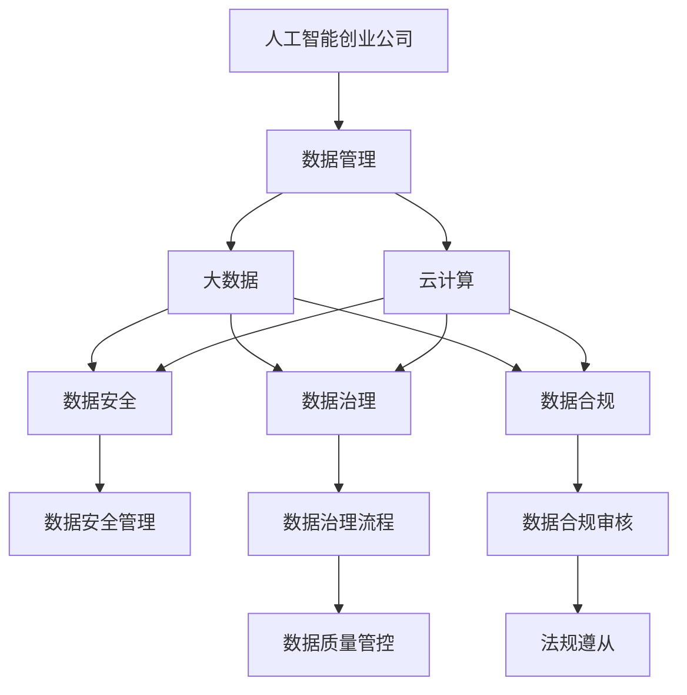
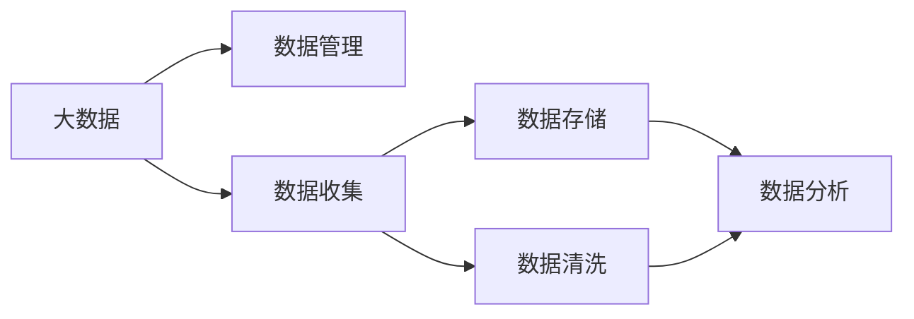
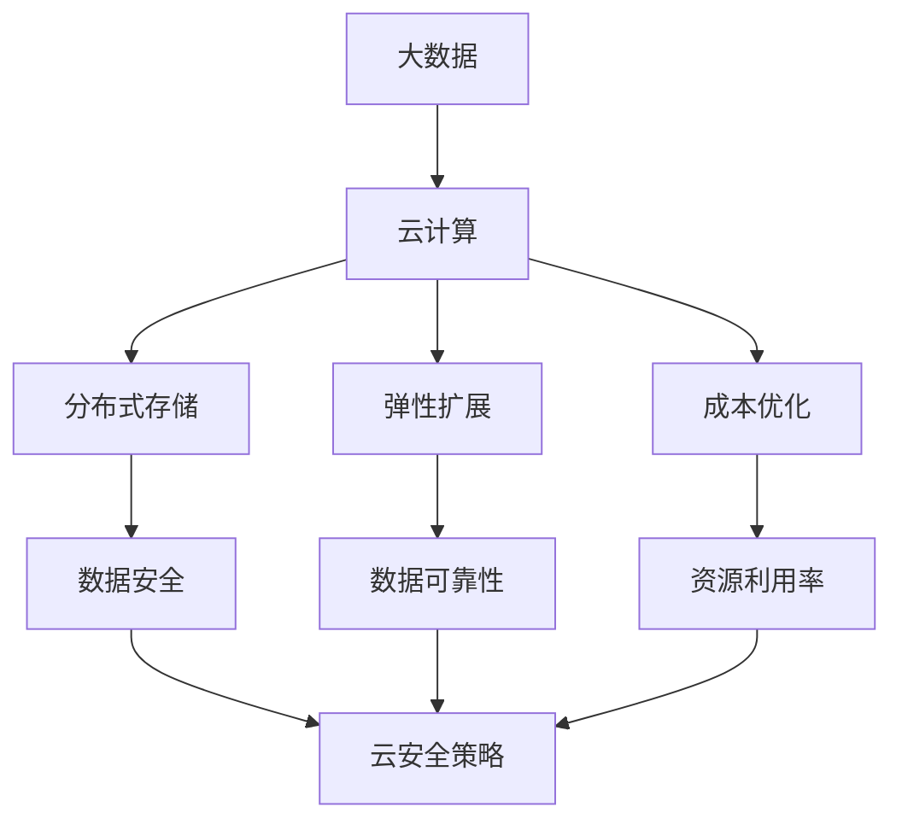
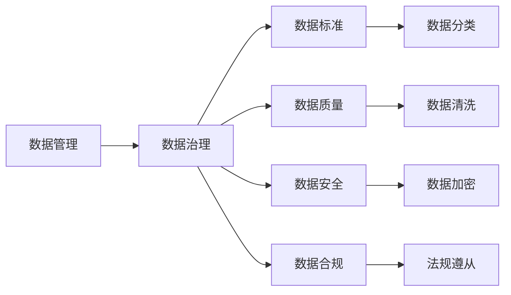
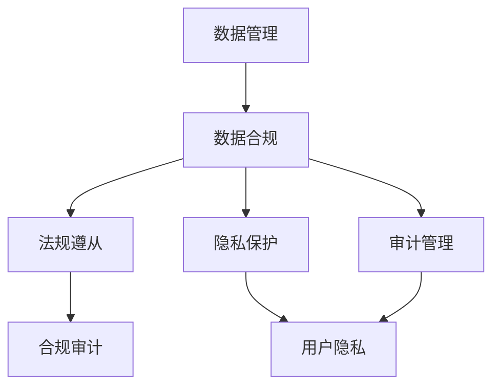

                 

# 人工智能创业数据管理的核心策略分享

> 关键词：人工智能创业,数据管理,大数据,云计算,数据安全,数据治理,数据合规,数据治理平台

## 1. 背景介绍

### 1.1 问题由来
在人工智能创业领域，数据无疑是最核心的资源之一。无论是深度学习模型的训练、产品的创新迭代，还是服务的精准推荐，都依赖于高质量、有价值的数据。然而，数据管理是一个复杂而庞大的工程，涉及到数据的采集、存储、清洗、分析和应用等多个环节。很多创业公司往往因数据管理不善而错失发展良机，甚至导致业务失败的案例比比皆是。因此，本文旨在探讨人工智能创业公司进行数据管理的核心策略，帮助创业者在起步阶段就建立坚实的数据基础。

### 1.2 问题核心关键点
数据管理是人工智能创业公司成败的关键之一，涉及数据战略制定、数据平台建设、数据质量管控、数据安全和合规等多个方面。对于初创企业，首先需要明确数据管理的策略和方向，建立标准化的数据管理体系，确保数据的质量和合规性，从而支撑业务的稳定运行和创新发展。

### 1.3 问题研究意义
研究人工智能创业公司数据管理策略，对于提升企业的技术能力、业务竞争力和市场份额，具有重要意义：

1. 数据驱动创新。高质量的数据是实现业务创新的基石。通过数据管理，企业可以高效获取有价值的信息，驱动产品创新和服务的优化。
2. 降低运营成本。数据管理能够提高数据处理的效率，减少因数据错误或不当使用带来的运营损失。
3. 确保数据安全。在数据处理过程中，合理的数据管理策略可以有效防范数据泄露和滥用风险，保障用户隐私和企业利益。
4. 满足合规要求。数据管理需要遵循各国的数据保护法规和行业标准，确保企业合规运营，避免法律风险。
5. 推动数据智能化。数据管理技术的运用，可以帮助企业更有效地利用大数据资源，实现数据的深度分析和智能应用。

## 2. 核心概念与联系

### 2.1 核心概念概述

为更好地理解人工智能创业公司数据管理的核心策略，本节将介绍几个密切相关的核心概念：

- 人工智能创业公司：指专注于人工智能技术研发和应用的企业，涵盖数据驱动的产品、服务和技术平台。
- 数据管理：指对数据进行全面、系统化的管理和运用的过程，包括数据收集、存储、清洗、分析和应用等环节。
- 大数据：指规模庞大、种类繁多、来源多样的数据集合，需要先进的技术和工具进行高效处理。
- 云计算：指通过互联网提供按需服务的计算资源，实现数据的分布式存储和弹性扩展。
- 数据安全：指保护数据不受未授权访问、篡改和泄露，保障数据完整性和隐私性。
- 数据治理：指建立数据管理的标准和流程，确保数据的质量、安全性和合规性，优化数据应用效果。
- 数据合规：指遵循相关法律法规，确保数据处理过程的合法性，避免法律风险。
- 数据治理平台：指基于现代技术构建的数据管理平台，提供数据收集、存储、处理和分析等一站式服务。

这些核心概念之间的逻辑关系可以通过以下Mermaid流程图来展示：



这个流程图展示了大数据、云计算、数据安全、数据治理、数据合规等核心概念在大数据管理过程中的相互作用和依赖关系。

### 2.2 概念间的关系

这些核心概念之间存在着紧密的联系，形成了人工智能创业公司数据管理的完整生态系统。下面我们通过几个Mermaid流程图来展示这些概念之间的关系。

#### 2.2.1 数据管理与大数据的关系



这个流程图展示了大数据如何通过数据管理，从数据收集到存储、清洗和分析的完整流程。数据管理是大数据处理的重要环节，直接影响数据的质量和可用性。

#### 2.2.2 数据管理与云计算的关系



这个流程图展示了云计算如何通过数据管理，提供数据的分布式存储和弹性扩展，优化资源利用率和成本，同时保障数据安全和可靠性。

#### 2.2.3 数据管理与数据治理的关系



这个流程图展示了数据治理如何通过标准和流程，确保数据的分类、清洗、加密和合规，提升数据质量和安全性。

#### 2.2.4 数据管理与数据合规的关系



这个流程图展示了数据合规如何通过法规遵从、隐私保护和审计管理，确保数据处理过程的合法性和透明度，避免法律风险。

## 3. 核心算法原理 & 具体操作步骤
### 3.1 算法原理概述

人工智能创业公司数据管理的核心策略可以概括为以下五个方面：数据战略制定、数据平台建设、数据质量管控、数据安全和数据治理。

### 3.2 算法步骤详解

#### 3.2.1 数据战略制定
- **明确业务需求**：了解企业的业务目标和需求，确定数据管理的重点和优先级。
- **数据分类与价值评估**：对数据进行分类，识别有价值的数据资产，评估其对业务的影响。
- **数据供应链管理**：建立数据收集、存储、清洗、分析和应用的标准流程，确保数据链路透明。

#### 3.2.2 数据平台建设
- **选择合适的技术架构**：根据企业规模和技术需求，选择合适的云计算平台和数据管理技术栈，如AWS、Azure、Google Cloud等。
- **构建数据仓库与湖**：利用分布式存储和计算资源，构建高效的数据仓库或数据湖，支持大规模数据处理。
- **数据管道设计与实施**：设计和实施数据管道，实现数据从源头到仓库的自动化采集、清洗和加载。

#### 3.2.3 数据质量管控
- **数据清洗与规范化**：通过数据清洗和规范化，去除重复、缺失、错误的数据，提升数据质量。
- **数据质量指标监控**：设定数据质量指标，实时监控数据清洗效果和数据质量。
- **数据质量提升措施**：采用先进的数据清洗工具和技术，提升数据质量和处理效率。

#### 3.2.4 数据安全
- **数据加密与访问控制**：对敏感数据进行加密，限制访问权限，保障数据安全。
- **数据备份与恢复**：定期备份数据，确保数据在意外情况下可恢复。
- **数据安全审计与监控**：实时监控数据访问和操作，定期进行安全审计，发现并修复安全漏洞。

#### 3.2.5 数据治理
- **数据标准与规范**：制定数据采集、存储、清洗、分析和应用的标准和规范，确保数据一致性和可用性。
- **数据治理流程与制度**：建立数据治理流程，明确各岗位职责，确保数据管理有序进行。
- **数据合规管理**：确保数据处理过程符合法律法规和行业标准，规避法律风险。

### 3.3 算法优缺点

#### 3.3.1 优点
- **提升业务效率**：通过科学的数据管理策略，优化数据处理流程，提高数据利用率和业务效率。
- **降低运营成本**：合理的数据管理可以降低数据处理和存储成本，优化资源利用率。
- **保障数据安全**：数据管理策略可以加强数据安全防护，防止数据泄露和滥用。
- **确保数据合规**：数据治理和合规管理，确保数据处理过程合法合规，避免法律风险。

#### 3.3.2 缺点
- **复杂度高**：数据管理涉及多个环节，需要综合考虑技术、管理和法规等多方面因素，实施复杂。
- **成本投入高**：构建和维护数据管理平台，需要高额的资金投入和技术人才。
- **技术更新快**：数据管理和分析技术快速迭代，需要持续跟进和升级。
- **依赖外部服务商**：数据管理平台依赖于云计算服务商的技术和服务支持，存在一定的依赖风险。

### 3.4 算法应用领域

数据管理策略可以应用于人工智能创业公司的多个领域：

- **产品创新与优化**：通过数据管理，获取有价值的信息，驱动产品创新和优化。
- **服务质量提升**：利用数据管理技术，提升服务的精准度和用户满意度。
- **市场营销与广告**：通过数据管理，优化广告投放策略，提升营销效果。
- **客户关系管理**：通过数据管理，建立客户画像，提供个性化服务。
- **运营效率提升**：通过数据管理，优化资源配置，提升运营效率。

## 4. 数学模型和公式 & 详细讲解 & 举例说明

### 4.1 数学模型构建

本节将使用数学语言对人工智能创业公司数据管理策略进行更加严格的刻画。

记企业总数据量为 $D$，其中 $D_i$ 为第 $i$ 类数据的数量。设数据质量指标为 $Q_i$，数据安全等级为 $S_i$，数据合规性为 $C_i$，数据治理成本为 $C_G$。则整体数据管理的优化目标为：

$$
\min_{D_i, Q_i, S_i, C_i, C_G} \sum_{i} f(D_i, Q_i, S_i, C_i, C_G)
$$

其中 $f$ 为综合评估函数，衡量数据管理的整体效果。

### 4.2 公式推导过程

设 $f$ 函数包含以下几个部分：

- 数据质量损失 $L_Q$：衡量数据清洗和规范化的效果。
- 数据安全损失 $L_S$：衡量数据加密和访问控制的效果。
- 数据合规损失 $L_C$：衡量数据处理过程的合法性。
- 数据治理成本 $C_G$：衡量数据治理流程的投入和效益。

则优化目标可以表示为：

$$
\min_{D_i, Q_i, S_i, C_i, C_G} L_Q + L_S + L_C + C_G
$$

其中：

$$
L_Q = \sum_{i} Q_i \cdot \omega_Q
$$

$$
L_S = \sum_{i} S_i \cdot \omega_S
$$

$$
L_C = \sum_{i} C_i \cdot \omega_C
$$

其中 $\omega_Q$、$\omega_S$、$\omega_C$ 为各指标的权重系数。

### 4.3 案例分析与讲解

假设某创业公司需要管理用户数据 $D_u$ 和日志数据 $D_l$，数据管理的目标是最大化用户满意度和降低运营成本。

#### 4.3.1 数据质量管理
通过数据清洗和规范化，用户数据 $D_u$ 的质量提升至 $Q_u$，日志数据 $D_l$ 的质量提升至 $Q_l$。数据质量提升的损失函数为：

$$
L_Q = (1-Q_u) \cdot \omega_Q + (1-Q_l) \cdot \omega_Q
$$

#### 4.3.2 数据安全管理
对用户数据 $D_u$ 和日志数据 $D_l$ 进行加密处理，分别赋以数据安全等级 $S_u$ 和 $S_l$。数据安全管理的损失函数为：

$$
L_S = (1-S_u) \cdot \omega_S + (1-S_l) \cdot \omega_S
$$

#### 4.3.3 数据合规管理
用户数据 $D_u$ 的合规性为 $C_u$，日志数据 $D_l$ 的合规性为 $C_l$。数据合规管理的损失函数为：

$$
L_C = (1-C_u) \cdot \omega_C + (1-C_l) \cdot \omega_C
$$

#### 4.3.4 数据治理成本
数据治理的总成本为 $C_G$，包括技术投资、人力成本和管理费用。

将这些数据管理的目标函数整合，得到整体优化目标：

$$
\min_{D_u, D_l, Q_u, Q_l, S_u, S_l, C_u, C_l, C_G} L_Q + L_S + L_C + C_G
$$

通过优化上述目标函数，可以在有限的成本下，实现数据质量、安全、合规的全面提升，最大化企业收益。

## 5. 项目实践：代码实例和详细解释说明

### 5.1 开发环境搭建

在进行数据管理实践前，我们需要准备好开发环境。以下是使用Python进行Apache Airflow搭建数据管道的流程：

1. 安装Apache Airflow：
```bash
pip install apache-airflow
```

2. 创建和激活虚拟环境：
```bash
conda create --name airflow-env python=3.8
conda activate airflow-env
```

3. 安装相关依赖：
```bash
pip install sqlalchemy pandas psycopg2-binary
```

4. 配置Airflow：
- 创建Airflow配置文件 `airflow.cfg`，配置数据库连接信息等。
- 设置Airflow超级用户账户，如 `airflow_default`。

5. 启动Airflow Web Server和Worker进程：
```bash
airflow webserver -p 8080
airflow worker
```

### 5.2 源代码详细实现

接下来，我们将使用Apache Airflow构建一个简单的数据管道，实现从数据源到数据仓库的自动化处理。

#### 5.2.1 创建DAG

首先，创建DAG文件 `data_pipeline.dag`，定义数据管道的基本流程：

```python
from datetime import datetime
from airflow import DAG
from airflow.operators.python_operator import PythonOperator
from airflow.operators.bash_operator import BashOperator
from airflow.models import Variable
from airflow.utils.dates import days_ago

default_args = {
    'owner': 'airflow',
    'depends_on_past': False,
    'start_date': days_ago(1),
}

with DAG('data_pipeline', default_args=default_args, schedule_interval='@daily', catchup=False) as dag:
    start_task = PythonOperator(
        task_id='start',
        python_callable=start_pipeline,
        provide_context=True,
        dag=dag
    )
    load_user_data_task = PythonOperator(
        task_id='load_user_data',
        python_callable=load_user_data,
        provide_context=True,
        dag=dag
    )
    load_log_data_task = PythonOperator(
        task_id='load_log_data',
        python_callable=load_log_data,
        provide_context=True,
        dag=dag
    )
    process_user_data_task = PythonOperator(
        task_id='process_user_data',
        python_callable=process_user_data,
        provide_context=True,
        dag=dag
    )
    process_log_data_task = PythonOperator(
        task_id='process_log_data',
        python_callable=process_log_data,
        provide_context=True,
        dag=dag
    )
    write_user_data_to_warehouse_task = PythonOperator(
        task_id='write_user_data_to_warehouse',
        python_callable=write_user_data_to_warehouse,
        provide_context=True,
        dag=dag
    )
    write_log_data_to_warehouse_task = PythonOperator(
        task_id='write_log_data_to_warehouse',
        python_callable=write_log_data_to_warehouse,
        provide_context=True,
        dag=dag
    )
    end_task = PythonOperator(
        task_id='end',
        python_callable=end_pipeline,
        provide_context=True,
        dag=dag
    )

start_task >> load_user_data_task >> process_user_data_task >> write_user_data_to_warehouse_task
start_task >> load_log_data_task >> process_log_data_task >> write_log_data_to_warehouse_task
load_user_data_task >> end_task
load_log_data_task >> end_task
```

#### 5.2.2 实现DAG节点

下面我们定义各个DAG节点的具体实现函数：

```python
# 初始化任务
def start_pipeline(**kwargs):
    print('Starting data pipeline...')

# 加载用户数据
def load_user_data(**kwargs):
    conn = kwargs['ti'].xcom_pull(task_ids='start', key='conn')
    with conn.cursor() as cur:
        cur.execute('SELECT * FROM user_data')
        data = cur.fetchall()
        kwargs['ti'].xcom_push(key='user_data', value=data)

# 加载日志数据
def load_log_data(**kwargs):
    conn = kwargs['ti'].xcom_pull(task_ids='start', key='conn')
    with conn.cursor() as cur:
        cur.execute('SELECT * FROM log_data')
        data = cur.fetchall()
        kwargs['ti'].xcom_push(key='log_data', value=data)

# 清洗用户数据
def process_user_data(**kwargs):
    user_data = kwargs['ti'].xcom_pull(key='user_data')
    # 数据清洗和规范化
    # ...

# 清洗日志数据
def process_log_data(**kwargs):
    log_data = kwargs['ti'].xcom_pull(key='log_data')
    # 数据清洗和规范化
    # ...

# 将用户数据写入数据仓库
def write_user_data_to_warehouse(**kwargs):
    user_data = kwargs['ti'].xcom_pull(key='processed_user_data')
    # 数据加载到数据仓库
    # ...

# 将日志数据写入数据仓库
def write_log_data_to_warehouse(**kwargs):
    log_data = kwargs['ti'].xcom_pull(key='processed_log_data')
    # 数据加载到数据仓库
    # ...

# 结束任务
def end_pipeline(**kwargs):
    print('Data pipeline completed.')
```

### 5.3 代码解读与分析

这里我们详细解读一下关键代码的实现细节：

**start_pipeline函数**：
- 初始化数据管道，开始数据处理流程。

**load_user_data函数**：
- 加载用户数据，将其存储在XCom变量中，供后续任务使用。

**load_log_data函数**：
- 加载日志数据，同样存储在XCom变量中，供后续任务使用。

**process_user_data函数**：
- 对用户数据进行清洗和规范化处理，处理后的数据也存储在XCom变量中。

**process_log_data函数**：
- 对日志数据进行清洗和规范化处理，处理后的数据同样存储在XCom变量中。

**write_user_data_to_warehouse函数**：
- 将清洗后的用户数据加载到数据仓库中。

**write_log_data_to_warehouse函数**：
- 将清洗后的日志数据加载到数据仓库中。

**end_pipeline函数**：
- 结束数据管道，标志着整个流程的完成。

### 5.4 运行结果展示

假设在运行上述DAG后，数据管道在日度的基础上正常运行，没有出现异常，最终处理后的数据被成功加载到数据仓库中。

## 6. 实际应用场景
### 6.1 智能客服系统

智能客服系统是人工智能创业公司常见的应用场景之一。通过数据管理，企业可以建立详尽的用户画像，理解客户需求，提升客户体验。

具体而言，企业可以通过收集客服对话记录、用户行为数据等，构建数据管道，对数据进行清洗和分析，识别用户兴趣和需求。基于这些信息，智能客服系统可以提供个性化的服务，如智能问答、知识推荐等，提升服务质量。

### 6.2 金融风控平台

金融风控平台也是数据管理的重要应用场景。通过数据管理，企业可以实时监测和分析客户风险，预测信用违约率，优化风险控制策略。

具体而言，企业可以收集客户的信用记录、交易数据等，建立数据管道，进行数据清洗和分析。利用机器学习模型，企业可以构建风险评估模型，实时预测客户违约概率，及时采取风险控制措施，降低不良贷款率。

### 6.3 医疗健康数据平台

医疗健康数据平台是数据管理在医疗领域的应用。通过数据管理，企业可以整合医疗数据，提供精准的疾病预测、治疗方案和健康管理服务。

具体而言，企业可以收集患者的电子健康记录、医疗影像等数据，构建数据管道，进行数据清洗和分析。利用深度学习模型，企业可以构建疾病预测模型，辅助医生进行疾病诊断和治疗决策，提升医疗服务的质量和效率。

### 6.4 未来应用展望

随着数据管理技术的不断进步，人工智能创业公司在数据处理和应用上将迎来新的突破。

未来，数据管理将更加智能化和自动化，通过AI技术优化数据处理流程，提高数据质量和管理效率。同时，数据管理也将更加标准化和合规化，确保数据处理过程合法合规，保障用户隐私和企业利益。

## 7. 工具和资源推荐
### 7.1 学习资源推荐

为了帮助创业者系统掌握数据管理的核心策略和实践，这里推荐一些优质的学习资源：

1. **Apache Airflow官方文档**：Airflow的官方文档提供了丰富的学习资源和实践案例，适合初学者和高级用户。

2. **《Python数据科学手册》**：该书详细介绍了Python在数据科学中的应用，包括数据收集、清洗、分析和可视化等。

3. **《大数据技术指南》**：该书全面介绍了大数据的技术框架和应用案例，适合了解大数据基础和实践。

4. **Kaggle学习社区**：Kaggle是一个数据科学竞赛平台，提供了大量实际数据集和竞赛任务，适合锻炼数据处理和分析能力。

5. **Google Cloud Dataflow教程**：Google Cloud提供的数据流处理平台教程，提供了丰富的学习资源和实践案例，适合使用Google Cloud进行数据管理。

6. **Amazon EMR教程**：Amazon EMR是一个弹性计算服务，提供了数据流处理和分布式计算的全面支持，适合了解AWS数据管理服务。

### 7.2 开发工具推荐

高效的开发离不开优秀的工具支持。以下是几款用于数据管理开发的常用工具：

1. **Apache Airflow**：一个开源的工作流自动化平台，提供可视化任务调度，适合构建数据管道和数据处理工作流。

2. **Apache Spark**：一个分布式计算框架，支持大规模数据处理和分析，适合处理大数据集。

3. **Apache Kafka**：一个分布式流处理平台，适合处理实时数据流，支持高并发和高吞吐。

4. **Amazon S3**：AWS提供的云存储服务，适合分布式存储和数据备份。

5. **Google Cloud Storage**：Google Cloud提供的云存储服务，支持高可用性和强一致性。

6. **AWS EMR**：AWS提供的弹性计算服务，支持分布式计算和数据流处理。

7. **Microsoft Azure Data Lake**：微软提供的分布式数据存储和处理平台，适合大规模数据处理。

合理利用这些工具，可以显著提升数据管理的开发效率，加快创新迭代的步伐。

### 7.3 相关论文推荐

数据管理技术的发展源于学界的持续研究。以下是几篇奠基性的相关论文，推荐阅读：

1. **《大数据管理：挑战与解决方案》**：作者Wang Lifeng，详细介绍了大数据管理的挑战和解决方案，提供了丰富的实践案例和理论分析。

2. **《数据治理框架》**：作者Mastro I, Sicari E, Gegi M，介绍了数据治理的框架和实践方法，为数据治理提供了系统的理论基础。

3. **《数据管理与分析》**：作者Mallat D，详细介绍了数据管理与分析的技术和应用，提供了丰富的案例和实践指南。

4. **《智能数据治理：利用人工智能提升数据治理》**：作者Chen Z, Zhang C, Wang Z，介绍了利用AI技术提升数据治理的思路和方法，提供了丰富的理论和实践案例。

这些论文代表了数据管理技术的发展脉络。通过学习这些前沿成果，可以帮助创业者掌握数据管理的技术和应用，推动企业业务创新和发展。

除上述资源外，还有一些值得关注的前沿资源，帮助创业者紧跟数据管理技术的最新进展，例如：

1. **arXiv论文预印本**：人工智能领域最新研究成果的发布平台，包括大量尚未发表的前沿工作，学习前沿技术的必读资源。

2. **业界技术博客**：如Amazon Web Services、Google Cloud、Microsoft Azure等顶尖实验室的官方博客，第一时间分享他们的最新研究成果和洞见。

3. **技术会议直播**：如SIGKDD、ICML、KDD等人工智能领域顶会现场或在线直播，能够聆听到专家们的前沿分享，开拓视野。

4. **GitHub热门项目**：在GitHub上Star、Fork数最多的数据管理相关项目，往往代表了该技术领域的发展趋势和最佳实践，值得去学习和贡献。

5. **行业分析报告**：各大咨询公司如McKinsey、PwC等针对数据管理行业的分析报告，有助于从商业视角审视技术趋势，把握应用价值。

总之，对于数据管理的学习和实践，需要创业者保持开放的心态和持续学习的意愿。多关注前沿资讯，多动手实践，多思考总结，必将收获满满的成长收益。

## 8. 总结：未来发展趋势与挑战

###

