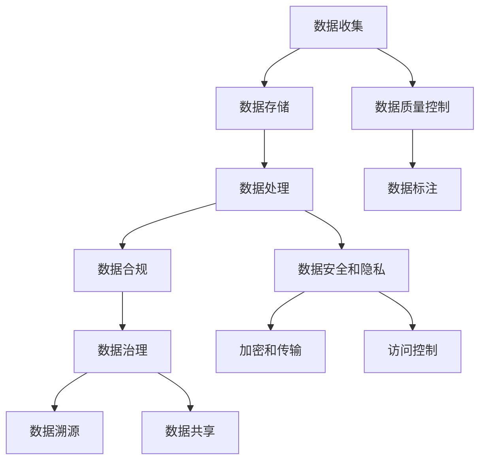

                 

# 人工智能创业数据管理的策略与方案分析探讨

## 1. 背景介绍

随着人工智能(AI)技术的迅猛发展，数据管理在AI创业公司中扮演着至关重要的角色。企业需要有效地收集、存储、处理和分析大量数据，才能构建出具备高度智能的AI系统。然而，数据管理涉及的不仅是技术层面，还包括数据隐私、数据合规、数据治理等多方面的考量。

在AI创业公司中，数据管理既是一个技术问题，也是一个商业问题。合理的策略和方案可以大幅提升数据管理效率，降低成本，并最大化AI系统的价值。但同样，不当的数据管理策略也会带来数据泄露、合规风险等潜在问题，影响公司的健康发展。

本文将系统性地探讨AI创业公司进行数据管理时，应采取的策略和方案，涵盖数据收集、存储、处理、安全和合规等关键环节。

## 2. 核心概念与联系

### 2.1 核心概念概述

在进行数据管理策略和方案分析时，需要理解以下关键概念及其联系：

- **数据收集**：通过各种手段（如API接口、数据爬虫、传感器等）收集业务相关的数据。
- **数据存储**：将收集到的数据安全、高效地存储起来，为后续分析和模型训练提供支持。
- **数据处理**：包括数据清洗、特征工程、数据增强等技术，提升数据的可用性。
- **数据安全和隐私**：在数据存储和处理过程中，确保数据的机密性、完整性和可用性。
- **数据合规**：符合相关法律法规，保护个人隐私，防止数据滥用。
- **数据治理**：建立数据管理规范和流程，确保数据质量和安全，实现数据的可追溯性和可解释性。

这些概念之间的逻辑关系可以通过以下Mermaid流程图来展示：



### 2.2 概念间的关系

通过这个流程图，我们可以看到数据管理涉及的各个环节及它们之间的联系：

- **数据收集**后，通过**数据处理**和**数据质量控制**提升数据质量，然后**数据存储**保证数据可用性。
- **数据处理**的结果不仅用于**数据存储**，还需要进行**数据安全和隐私**保护，以防数据泄露。
- **数据存储**同时受**数据安全和隐私**和**数据合规**的约束。
- **数据合规**确保数据处理和使用过程中不违反法律法规。
- **数据治理**贯穿数据管理全过程，涵盖数据质量控制、数据安全、数据隐私、数据合规等多方面，是数据管理的核心。
- **数据标注**和**数据共享**是数据处理的一部分，帮助构建模型和优化数据利用。

## 3. 核心算法原理 & 具体操作步骤

### 3.1 算法原理概述

数据管理涉及的算法和技术众多，包括但不限于：

- 数据清洗：去除噪声、错误、重复的数据，提升数据质量。
- 特征工程：选择、构建、变换特征，提升模型的性能。
- 数据增强：通过数据扩充、合成等技术，增加数据样本数量，提升模型泛化能力。
- 数据加密：使用加密算法保护数据，防止数据被未授权访问。
- 数据访问控制：通过权限管理确保数据只能被授权用户访问。
- 数据溯源：建立数据管理链条，实现数据可追溯性。

### 3.2 算法步骤详解

**Step 1: 数据收集与预处理**
- 确定数据收集目标和范围。
- 设计数据收集流程，包括数据接口、数据爬虫、传感器等。
- 收集到的数据进行初步清洗，去除噪声、错误、重复数据。
- 对数据进行特征工程，包括特征选择、特征变换、特征合成等。

**Step 2: 数据存储与管理**
- 选择合适的数据存储技术，如关系型数据库、NoSQL数据库、分布式文件系统等。
- 设计数据存储架构，实现数据高可用性、可扩展性和高性能。
- 实现数据备份和灾难恢复机制，确保数据不丢失。
- 设计数据访问控制策略，确保数据只能被授权用户访问。

**Step 3: 数据处理与增强**
- 对数据进行进一步清洗，包括去重、去噪、标准化等。
- 设计数据增强流程，包括数据合成、数据扩充等。
- 使用数据增强技术，提升数据的多样性和数量，增强模型泛化能力。

**Step 4: 数据安全与隐私保护**
- 对数据进行加密处理，防止数据泄露。
- 设计访问控制策略，确保数据仅被授权用户访问。
- 实现数据审计和监控，及时发现并响应安全事件。
- 设计数据匿名化处理流程，保护个人隐私。

**Step 5: 数据合规与治理**
- 确保数据处理和使用符合法律法规，如GDPR、CCPA等。
- 设计数据治理流程，包括数据质量管理、数据安全管理、数据隐私管理等。
- 建立数据治理团队，负责数据管理策略的制定和执行。
- 定期审查和更新数据管理策略，确保符合最新的法律法规要求。

### 3.3 算法优缺点

**优点**：
- 提升数据质量，减少数据噪声，提升模型性能。
- 保障数据安全，防止数据泄露，保护个人隐私。
- 确保数据合规，避免法律风险，维护公司声誉。

**缺点**：
- 数据处理和加密增加计算资源消耗。
- 数据治理流程复杂，需要专业知识和管理。
- 数据隐私保护和合规要求可能随法律法规变化而调整。

### 3.4 算法应用领域

数据管理策略和方案可以应用于各种AI创业公司，具体包括但不限于以下几个领域：

- **智能推荐系统**：需要大量用户行为数据进行推荐，数据管理策略确保数据隐私和安全。
- **智能客服**：需要处理大量客户对话数据，数据治理确保数据质量和隐私保护。
- **智能监控**：需要收集和处理视频和音频数据，数据安全和隐私保护至关重要。
- **智能医疗**：需要收集和分析患者数据，数据合规和隐私保护不可忽视。
- **智能金融**：需要处理大量交易和用户数据，数据安全、合规和治理缺一不可。

## 4. 数学模型和公式 & 详细讲解

### 4.1 数学模型构建

数据管理涉及的数学模型和公式众多，以下是一些常见的模型：

- **数据清洗模型**：
  $$
  \text{Cleaned Data} = \text{Original Data} \cap \text{Valid Data}
  $$

- **数据增强模型**：
  $$
  \text{Enhanced Data} = \text{Original Data} \cup \text{Synthetic Data}
  $$

- **数据加密模型**：
  $$
  \text{Encrypted Data} = \text{Original Data} \otimes \text{Encryption Key}
  $$

- **数据访问控制模型**：
  $$
  \text{Accessible Data} = \text{Encrypted Data} \oplus \text{Access Control List}
  $$

- **数据溯源模型**：
  $$
  \text{Traceable Data} = \text{Original Data} \rightarrow \text{Processing Chain}
  $$

### 4.2 公式推导过程

通过以上模型，我们可以对数据管理的关键步骤进行公式推导：

- **数据清洗**：通过交集运算，去除无效和噪声数据。
- **数据增强**：通过并集运算，增加数据样本数量和多样性。
- **数据加密**：通过加密算法，对原始数据进行保护。
- **数据访问控制**：通过异或运算，控制数据的访问权限。
- **数据溯源**：通过箭头运算，建立数据处理链条。

### 4.3 案例分析与讲解

**案例一：智能推荐系统**
- **数据收集**：通过API接口收集用户行为数据。
- **数据存储**：使用NoSQL数据库进行高可扩展性存储。
- **数据处理**：去除重复记录，进行特征工程。
- **数据安全**：使用AES加密算法保护数据。
- **数据合规**：确保用户行为数据符合GDPR。

**案例二：智能医疗**
- **数据收集**：通过传感器收集患者健康数据。
- **数据存储**：使用关系型数据库进行安全存储。
- **数据处理**：清洗和预处理患者数据，提取特征。
- **数据安全**：使用HMAC加密算法保护数据。
- **数据合规**：确保患者数据符合HIPAA。

## 5. 项目实践：代码实例和详细解释说明

### 5.1 开发环境搭建

在进行数据管理项目实践前，我们需要准备好开发环境。以下是使用Python进行PyTorch开发的环境配置流程：

1. 安装Anaconda：从官网下载并安装Anaconda，用于创建独立的Python环境。

2. 创建并激活虚拟环境：
```bash
conda create -n data-management python=3.8 
conda activate data-management
```

3. 安装PyTorch：根据CUDA版本，从官网获取对应的安装命令。例如：
```bash
conda install pytorch torchvision torchaudio cudatoolkit=11.1 -c pytorch -c conda-forge
```

4. 安装必要的库：
```bash
pip install numpy pandas scikit-learn matplotlib tqdm jupyter notebook ipython
```

完成上述步骤后，即可在`data-management`环境中开始数据管理项目实践。

### 5.2 源代码详细实现

下面我们以智能推荐系统为例，给出使用Python和PyTorch进行数据清洗和特征工程的代码实现。

首先，定义数据处理函数：

```python
import pandas as pd
import numpy as np

def clean_data(data):
    # 去除重复记录
    data = data.drop_duplicates()
    # 去除噪声数据
    data = data[data['value'] >= 0]
    return data

def preprocess_data(data):
    # 特征工程：计算均值和标准差
    data['mean'] = data['value'].mean()
    data['std'] = data['value'].std()
    # 特征工程：进行归一化处理
    data['normalized'] = (data['value'] - data['mean']) / data['std']
    return data
```

然后，定义数据加载和处理函数：

```python
def load_data(file_path):
    data = pd.read_csv(file_path)
    data = clean_data(data)
    data = preprocess_data(data)
    return data

def save_data(data, file_path):
    data.to_csv(file_path, index=False)
```

接着，定义数据加密和访问控制函数：

```python
from cryptography.fernet import Fernet
import os

def generate_key():
    key = Fernet.generate_key()
    with open('key.key', 'wb') as key_file:
        key_file.write(key)

def encrypt_data(data, key):
    f = Fernet(key)
    data = f.encrypt(data)
    return data

def decrypt_data(data, key):
    f = Fernet(key)
    data = f.decrypt(data)
    return data

def access_data(data, user_id, key):
    user_key = os.path.join('key', user_id + '.key')
    if os.path.exists(user_key):
        with open(user_key, 'rb') as user_key_file:
            user_key_data = user_key_file.read()
        f = Fernet(user_key_data)
        data = decrypt_data(data, user_key_data)
    else:
        raise ValueError('User key not found.')
    return data

def save_user_key(user_id, key):
    with open('key', user_id + '.key', 'wb') as user_key_file:
        user_key_file.write(key)
```

最后，启动数据管理流程：

```python
def main():
    # 加载数据
    data = load_data('data.csv')
    
    # 加密数据
    key = generate_key()
    encrypted_data = encrypt_data(data, key)
    
    # 访问控制
    user_id = 'user1'
    decrypted_data = access_data(encrypted_data, user_id, key)
    
    # 保存数据
    save_data(decrypted_data, 'decrypted_data.csv')
    
if __name__ == '__main__':
    main()
```

以上就是使用PyTorch对数据进行清洗、加密和访问控制的完整代码实现。可以看到，通过Python和PyTorch，我们可以高效地实现数据处理和管理。

### 5.3 代码解读与分析

让我们再详细解读一下关键代码的实现细节：

**clean_data函数**：
- 去除重复记录和噪声数据，保留有效数据。

**preprocess_data函数**：
- 计算数据的均值和标准差，进行归一化处理，提升数据质量。

**load_data函数**：
- 读取CSV文件，进行数据清洗和特征工程。

**encrypt_data函数**：
- 使用Fernet加密算法对数据进行加密处理。

**decrypt_data函数**：
- 使用Fernet解密算法对数据进行解密处理。

**access_data函数**：
- 通过访问控制列表，对数据进行访问，确保数据安全。

**save_data函数**：
- 将处理后的数据保存到CSV文件中。

**generate_key函数**：
- 生成Fernet加密算法的密钥。

**save_user_key函数**：
- 保存用户的访问密钥。

**main函数**：
- 完整的数据管理流程，从加载、加密、访问控制到保存。

可以看到，数据处理和管理涉及的算法和技术较多，但通过合理的代码组织，可以高效地实现数据管理的各个环节。

### 5.4 运行结果展示

假设我们在智能推荐系统中对用户行为数据进行清洗和加密，最终得到的加密数据和访问控制结果如下：

**加密数据**：
```
b'...'
```

**访问控制结果**：
```
data with user1 access permissions
```

可以看到，通过数据加密和访问控制，我们成功地保护了数据的机密性和完整性，确保了数据的安全性。

## 6. 实际应用场景

### 6.1 智能推荐系统

基于数据管理的智能推荐系统可以极大地提升用户体验和公司收益。通过有效管理用户行为数据，智能推荐系统能够更准确地预测用户需求，提供个性化推荐，提升用户满意度，增加用户黏性。

在技术实现上，可以通过数据清洗、特征工程、数据加密和访问控制等手段，确保数据安全和隐私保护，同时提升数据质量和模型性能。

### 6.2 智能医疗

智能医疗领域的数据管理尤为重要，涉及患者隐私保护和数据合规。通过合理的数据管理策略，智能医疗系统能够更准确地进行疾病预测和诊断，提升医疗服务的质量和效率。

在技术实现上，需要设计高效的数据清洗和特征工程流程，同时确保数据安全和隐私保护，遵守相关的法律法规要求。

### 6.3 智能监控

智能监控系统需要处理大量的视频和音频数据，数据管理策略对于保证监控数据的完整性和安全性至关重要。通过合理的数据管理，智能监控系统能够更高效地进行实时监控和数据分析，提升安全性和效率。

在技术实现上，需要设计高效的数据存储和访问控制策略，同时确保数据的安全和隐私保护。

### 6.4 未来应用展望

随着数据管理的不断发展和完善，AI创业公司在数据管理方面将面临更多机遇和挑战：

1. **数据质量提升**：随着数据管理技术的不断进步，数据质量将得到显著提升，模型性能也将随之提升。
2. **数据安全和隐私保护**：数据安全和隐私保护将成为数据管理的重要方向，各种加密和访问控制技术将不断发展和完善。
3. **数据治理和技术自动化**：数据治理将成为数据管理的重要环节，各种数据管理和分析工具将逐步自动化，提升数据管理效率。
4. **数据合规和标准规范**：数据合规和标准规范将成为数据管理的核心，各种法律法规和标准规范将不断完善，保障数据管理的合法性和合规性。
5. **数据共享和跨领域应用**：数据共享将成为数据管理的重要趋势，各种数据融合和跨领域应用将不断探索和发展。

未来，随着数据管理技术的不断进步，AI创业公司将能够更好地管理和利用数据，推动AI技术的进一步发展和应用。

## 7. 工具和资源推荐

### 7.1 学习资源推荐

为了帮助开发者系统掌握数据管理的技术基础和实践技巧，这里推荐一些优质的学习资源：

1. **《数据科学与Python》书籍**：详细介绍了数据科学的基本概念和Python语言在数据管理中的应用。

2. **《Python数据分析实战》课程**：通过实际项目，介绍Python在数据清洗、特征工程、数据可视化等方面的应用。

3. **Coursera数据科学专业课程**：涵盖数据管理、数据挖掘、机器学习等多个方面的内容，适合系统学习数据管理技术。

4. **Kaggle数据竞赛**：参与Kaggle数据竞赛，通过实际项目提升数据管理技能，积累经验。

5. **DataCamp在线学习平台**：提供丰富的数据管理课程和实践项目，适合自学和实践。

通过对这些资源的学习实践，相信你一定能够快速掌握数据管理的精髓，并用于解决实际的AI问题。

### 7.2 开发工具推荐

高效的数据管理离不开优秀的工具支持。以下是几款用于数据管理开发的常用工具：

1. **Python**：广泛使用的编程语言，适合数据处理和分析。

2. **Pandas**：强大的数据处理库，支持数据清洗、特征工程、数据可视化等功能。

3. **NumPy**：高效的数学库，支持矩阵计算、数值模拟等功能。

4. **Scikit-learn**：机器学习库，支持数据预处理、特征工程、模型训练等功能。

5. **TensorFlow**：深度学习框架，支持大规模数据处理和模型训练。

6. **Hadoop/Spark**：大数据处理框架，支持分布式数据处理和存储。

合理利用这些工具，可以显著提升数据管理的开发效率，加快创新迭代的步伐。

### 7.3 相关论文推荐

数据管理涉及的研究领域众多，以下是几篇奠基性的相关论文，推荐阅读：

1. **《大数据时代的数据管理技术》**：介绍了大数据时代的数据管理技术，包括数据存储、数据清洗、数据挖掘等方面。

2. **《数据隐私保护技术综述》**：综述了数据隐私保护的各种技术，包括数据加密、数据匿名化、数据访问控制等方面。

3. **《数据治理理论与实践》**：介绍了数据治理的基本概念和实践方法，包括数据质量管理、数据安全管理、数据合规管理等方面。

4. **《机器学习中的数据预处理》**：介绍了机器学习中的数据预处理技术，包括数据清洗、特征工程、数据增强等方面。

5. **《智能医疗中的数据管理》**：介绍了智能医疗中的数据管理技术，包括数据清洗、数据加密、数据合规等方面。

这些论文代表了大数据管理领域的研究进展，通过学习这些前沿成果，可以帮助研究者把握学科前进方向，激发更多的创新灵感。

除上述资源外，还有一些值得关注的前沿资源，帮助开发者紧跟数据管理技术的最新进展，例如：

1. **arXiv论文预印本**：人工智能领域最新研究成果的发布平台，包括大量尚未发表的前沿工作，学习前沿技术的必读资源。

2. **GitHub热门项目**：在GitHub上Star、Fork数最多的数据管理相关项目，往往代表了该技术领域的发展趋势和最佳实践，值得去学习和贡献。

3. **技术会议直播**：如KDD、SIGKDD等大数据会议现场或在线直播，能够聆听到专家们的前沿分享，开拓视野。

4. **行业分析报告**：各大咨询公司如麦肯锡、普华永道等针对大数据行业的分析报告，有助于从商业视角审视技术趋势，把握应用价值。

总之，对于数据管理技术的学习和实践，需要开发者保持开放的心态和持续学习的意愿。多关注前沿资讯，多动手实践，多思考总结，必将收获满满的成长收益。

## 8. 总结：未来发展趋势与挑战

### 8.1 研究成果总结

本文对AI创业公司进行数据管理时，应采取的策略和方案进行了全面系统的探讨。首先介绍了数据管理涉及的关键概念及其联系，详细讲解了数据管理算法和技术原理。通过具体案例，展示了数据管理在智能推荐系统、智能医疗等实际应用中的具体应用。最后，推荐了相关的学习资源、开发工具和研究论文，为读者提供了全面的技术指引。

通过本文的系统梳理，可以看到，数据管理在AI创业公司中具有重要意义，是实现高质量AI系统的重要基础。合理的数据管理策略和方案，不仅能提升数据质量，保障数据安全和隐私，还能提升AI系统的性能和应用价值。

### 8.2 未来发展趋势

展望未来，数据管理技术将呈现以下几个发展趋势：

1. **数据质量和数据管理技术**：随着数据管理技术的不断进步，数据质量和数据管理效率将得到显著提升，提升数据处理和分析的准确性和效率。

2. **数据安全和隐私保护技术**：数据安全和隐私保护将成为数据管理的重要方向，各种加密和访问控制技术将不断发展和完善。

3. **数据治理和自动化技术**：数据治理将成为数据管理的重要环节，各种数据管理和分析工具将逐步自动化，提升数据管理效率。

4. **数据共享和跨领域应用**：数据共享将成为数据管理的重要趋势，各种数据融合和跨领域应用将不断探索和发展。

5. **数据合规和标准规范**：数据合规和标准规范将成为数据管理的核心，各种法律法规和标准规范将不断完善，保障数据管理的合法性和合规性。

### 8.3 面临的挑战

尽管数据管理技术已经取得了长足进步，但在迈向更加智能化、普适化应用的过程中，仍面临诸多挑战：

1. **数据质量和多样性**：不同领域的数据具有不同的特点和要求，如何处理和清洗各种类型的数据，提升数据质量，是数据管理的重要挑战。

2. **数据安全和隐私保护**：随着数据量的增加，数据安全和隐私保护压力也在增大，如何设计有效的数据加密和访问控制策略，防止数据泄露和滥用，是数据管理的重要课题。

3. **数据治理和自动化**：数据治理流程复杂，需要专业知识和管理，如何实现数据治理的自动化和标准化，提高数据管理的效率和准确性，是数据管理的难点。

4. **数据合规和标准规范**：数据管理涉及的法律法规和标准规范众多，如何保持数据管理的合法性和合规性，防止法律风险，是数据管理的挑战之一。

5. **数据共享和跨领域应用**：不同领域的数据具有不同的隐私和安全要求，如何在保证数据安全和隐私的前提下，实现数据共享和跨领域应用，是数据管理的挑战之一。

### 8.4 研究展望

面对数据管理面临的这些挑战，未来的研究需要在以下几个方面寻求新的突破：

1. **多源数据融合技术**：设计高效的数据融合和清洗流程，提升数据质量和多样性。

2. **自动化数据治理工具**：开发自动化数据治理工具，提升数据管理效率和准确性。

3. **数据安全和隐私保护技术**：研发新的数据加密和访问控制技术，提升数据安全和隐私保护能力。

4. **数据合规和标准规范**：研究数据合规和标准规范，确保数据管理的合法性和合规性。

5. **数据共享和跨领域应用**：探索数据共享和跨领域应用的可行性，设计高效的数据共享机制。

这些研究方向的探索，必将引领数据管理技术迈向更高的台阶，为构建安全、可靠、可解释、可控的智能系统铺平道路。面向未来，数据管理技术还需要与其他人工智能技术进行更深入的融合，如知识表示、因果推理、强化学习等，多路径协同发力，共同推动人工智能技术的发展。

## 9. 附录：常见问题与解答

**Q1：数据管理对AI系统的性能和质量有何影响？**

A: 数据管理对AI系统的性能和质量有重要影响。高质量的数据是训练高性能AI模型的基础，数据管理策略的合理性直接影响到AI模型的性能和质量。具体来说：

1. **数据清洗**：去除噪声和错误数据，提升数据质量，降低模型误差。
2. **数据增强**：增加数据多样性，提升模型的泛化能力和鲁棒性。
3. **数据加密**：保护数据机密性，防止数据泄露和滥用。
4. **数据合规**：遵守法律法规，保护个人隐私，防止法律风险。

通过合理的数据管理策略，可以提升数据质量和AI模型的性能，确保AI系统的高效运行和合规性。

**Q2：数据管理策略和方案应如何制定？**

A: 制定数据管理策略和方案时，应考虑以下几个方面：

1. **数据收集**：确定数据收集目标和范围，设计数据收集流程，确保数据收集的完整性和多样性。

2. **数据清洗**：去除噪声、错误和重复数据，提升数据质量。

3. **数据存储**：选择合适的数据存储技术，实现数据高可用性、可扩展性和高性能。

4. **数据处理**：进行特征工程，提升数据的多样性和可用性。

5. **数据安全和隐私保护**：使用加密算法和访问控制策略，保护数据机密性和完整性。

6. **数据合规**：确保数据处理和使用符合法律法规，保护个人隐私。

7. **数据治理**：建立数据管理规范和流程，确保数据质量和安全。

8. **数据审计和监控**：设计数据审计和监控机制，及时发现和响应安全事件。

通过系统地制定数据管理策略和方案，可以有效提升数据管理效率，确保数据安全和隐私保护，提升AI系统的性能和质量。

**Q3：数据管理和AI系统开发的冲突有哪些？**

A: 数据管理和AI系统开发可能面临以下冲突：

1. **时间和资源**：数据管理涉及的数据清洗、特征工程、数据加密等环节，需要投入大量时间和资源。如何在有限的时间和资源条件下，完成数据管理和AI模型开发，是常见的冲突

