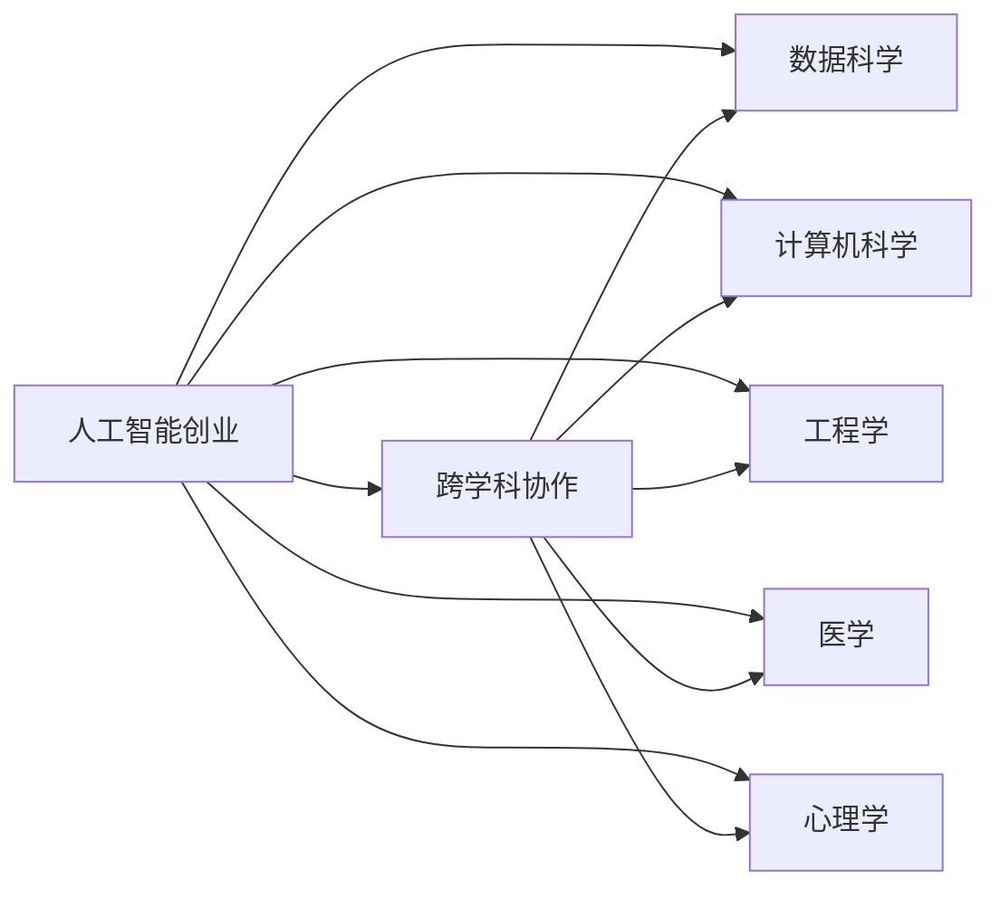
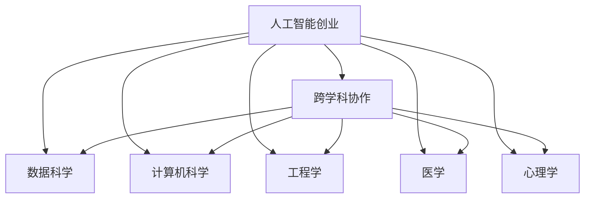
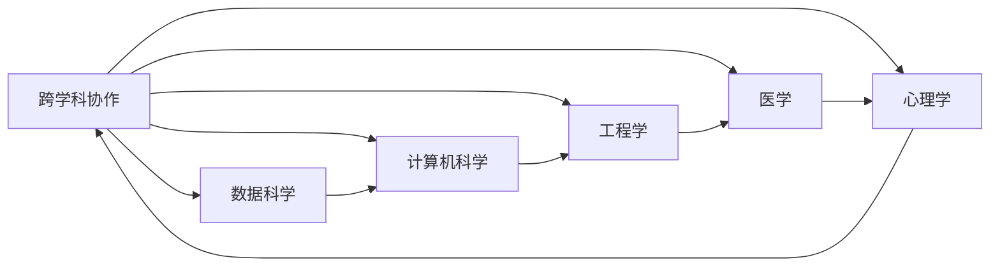

                 

# 人工智能创业：多学科支持的重要性

> 关键词：人工智能创业,多学科支持,跨学科协作,技术创业,创新驱动,人工智能应用

## 1. 背景介绍

随着人工智能(AI)技术的快速发展，越来越多的创业项目围绕着AI展开。从初创期到成熟期，AI创业企业涉及的学科领域日益多样，需要依托不同学科的知识和技术支持。本文将探讨AI创业中多学科支持的重要性，通过深入分析AI创业中的常见问题和挑战，提出相应的跨学科协作策略，并展望AI创业的未来发展趋势。

### 1.1 问题由来

AI创业项目往往需要覆盖数据科学、计算机科学、工程学、医学、心理学等多个学科领域。单一学科的限制和短板，可能在应用场景、技术实现和用户体验等方面造成较大困扰。而多学科的深度协作，则可以充分利用各学科的优势，快速迭代和优化产品，提升项目的成功概率。

近年来，AI创业领域的成功案例数不胜数，如特斯拉、OpenAI、商汤科技等，这些企业的背后，都离不开多学科团队的支持和协作。然而，尽管多学科协作具有明显优势，但在实践中，跨学科的沟通和融合仍面临诸多挑战，如学科壁垒、知识碎片化、协作流程复杂化等。

### 1.2 问题核心关键点
AI创业的多学科支持，重点关注以下几个关键点：
- **数据科学**：数据收集、清洗、标注和分析。数据是AI项目的基础，需依靠统计学、机器学习、数据挖掘等方法进行有效处理。
- **计算机科学**：模型设计、算法优化和系统实现。需综合应用编程、算法、系统架构等知识，保证模型的稳定性和性能。
- **工程学**：硬件部署、资源管理、实时计算。需整合电子工程、系统集成、网络通信等技术，确保系统的高效运行。
- **医学**：模型应用于医学诊断、药物研发等场景。需结合医学知识、生物统计、临床试验等方法，保证应用的安全性和有效性。
- **心理学**：关注用户体验、行为研究、人机交互。需结合认知心理学、用户行为学、交互设计等知识，提升产品的用户体验。
- **跨学科协作**：整合上述各学科知识，构建跨学科团队，进行高效协作。需设计科学的沟通机制和项目管理流程，消除学科壁垒。

## 2. 核心概念与联系

### 2.1 核心概念概述

为更好地理解AI创业中的多学科支持，本节将介绍几个密切相关的核心概念：

- **人工智能创业**：基于人工智能技术，开发新产品、服务和解决方案，驱动企业发展的创业活动。
- **跨学科协作**：不同学科背景的专家和团队，通过协作实现知识整合和创新突破。
- **知识图谱**：将领域知识结构化，构建用于信息检索、推理和整合的知识模型。
- **模型可解释性**：确保AI模型的输出和决策过程可被理解和解释，符合伦理道德要求。
- **隐私保护**：保护用户隐私数据，防止数据泄露和滥用。
- **伦理考量**：在技术开发和应用过程中，考虑伦理和社会影响，确保技术应用的公正性和安全性。

这些核心概念之间的逻辑关系可以通过以下Mermaid流程图来展示：



这个流程图展示了大语言模型创业与多学科支持之间的整体架构：

1. **人工智能创业**是核心目标，涉及多个学科的支持。
2. **跨学科协作**是实现目标的关键手段，涉及各学科的整合和融合。
3. **数据科学、计算机科学、工程学、医学、心理学**等学科提供必要的知识和技术支持。

### 2.2 概念间的关系

这些核心概念之间存在着紧密的联系，形成了AI创业的完整生态系统。下面我们通过几个Mermaid流程图来展示这些概念之间的关系。

#### 2.2.1 人工智能创业范式



这个流程图展示了大语言模型创业与多学科支持之间的整体架构：

1. **人工智能创业**是核心目标，涉及多个学科的支持。
2. **跨学科协作**是实现目标的关键手段，涉及各学科的整合和融合。
3. **数据科学、计算机科学、工程学、医学、心理学**等学科提供必要的知识和技术支持。

#### 2.2.2 跨学科协作方法



这个流程图展示了跨学科协作在AI创业中的方法：

1. **跨学科协作**是核心驱动力，整合各学科知识。
2. **数据科学**、**计算机科学**、**工程学**、**医学**、**心理学**等学科提供关键支持。
3. **数据科学**提供数据支撑，**计算机科学**设计算法，**工程学**实现系统，**医学**提供领域知识，**心理学**优化用户体验。

## 3. 核心算法原理 & 具体操作步骤

### 3.1 算法原理概述

AI创业的多学科支持，涉及数据科学、计算机科学、工程学、医学、心理学等多个领域。本节将简要介绍这些学科中的核心算法原理。

#### 3.1.1 数据科学

**数据预处理**：包括数据清洗、特征工程、数据增强等技术，确保数据的完整性和多样性。

**模型训练**：使用统计学和机器学习方法，如回归、分类、聚类、深度学习等，进行模型训练和验证。

**数据分析**：通过可视化、时间序列分析、数据挖掘等方法，进行数据探索和特征分析。

#### 3.1.2 计算机科学

**算法设计**：基于计算机科学的算法理论和数据结构，设计高效的算法模型。

**系统实现**：使用编程语言和框架，如Python、TensorFlow、PyTorch等，实现算法模型和系统架构。

**优化和调参**：通过自动调参、超参数优化等技术，提升模型性能和稳定性。

#### 3.1.3 工程学

**硬件部署**：选择合适的硬件平台，如GPU、TPU、云计算等，进行模型部署和资源管理。

**实时计算**：实现高效的并行计算和分布式计算，保证系统的实时响应和计算效率。

**系统集成**：通过软件架构设计和集成技术，构建高效、稳定、可扩展的系统。

#### 3.1.4 医学

**医学知识融合**：将医学领域的知识融入到AI模型中，如临床路径、疾病机制、药物作用等。

**临床试验**：设计和管理临床试验，验证AI模型的有效性和安全性。

**数据标注**：使用医学专业知识进行数据标注，确保数据质量。

#### 3.1.5 心理学

**用户体验研究**：通过用户行为研究、问卷调查、用户访谈等方法，了解用户需求和行为。

**人机交互设计**：设计友好的人机交互界面，优化用户界面和交互流程。

**认知负荷评估**：评估用户使用产品时的认知负荷，优化用户体验。

### 3.2 算法步骤详解

#### 3.2.1 数据科学

1. **数据收集**：根据业务需求，收集相关数据。
2. **数据清洗**：处理缺失值、异常值、噪声等数据问题。
3. **特征工程**：选择和构造特征，进行特征选择和降维。
4. **数据增强**：通过数据扩充、数据增强等技术，提升数据多样性。
5. **模型训练**：使用训练集进行模型训练，进行交叉验证和模型调参。
6. **性能评估**：使用测试集评估模型性能，进行模型选择和优化。

#### 3.2.2 计算机科学

1. **算法设计**：选择合适的算法模型，如线性回归、决策树、神经网络等。
2. **模型实现**：实现模型算法，进行代码编写和调试。
3. **优化和调参**：进行超参数优化，提升模型性能和鲁棒性。
4. **模型部署**：将模型部署到生产环境，进行模型版本管理和监控。
5. **系统集成**：将模型和系统集成，构建完整的应用生态。

#### 3.2.3 工程学

1. **硬件选择**：选择合适的硬件平台，进行硬件部署和管理。
2. **实时计算**：实现高效的并行计算和分布式计算，保证系统的实时响应和计算效率。
3. **系统集成**：通过软件架构设计和集成技术，构建高效、稳定、可扩展的系统。
4. **性能优化**：进行系统性能优化，如内存管理、数据压缩等。
5. **故障处理**：实现系统的故障监控和处理，保证系统的稳定性和可靠性。

#### 3.2.4 医学

1. **医学知识融合**：将医学领域的知识融入到AI模型中，如临床路径、疾病机制、药物作用等。
2. **临床试验**：设计和管理临床试验，验证AI模型的有效性和安全性。
3. **数据标注**：使用医学专业知识进行数据标注，确保数据质量。
4. **模型验证**：通过临床试验结果验证模型的有效性，进行模型优化。

#### 3.2.5 心理学

1. **用户体验研究**：通过用户行为研究、问卷调查、用户访谈等方法，了解用户需求和行为。
2. **人机交互设计**：设计友好的人机交互界面，优化用户界面和交互流程。
3. **认知负荷评估**：评估用户使用产品时的认知负荷，优化用户体验。
4. **用户反馈**：收集用户反馈，进行用户体验优化和迭代改进。

### 3.3 算法优缺点

#### 3.3.1 数据科学

**优点**：
- 通过科学的数据处理方法，保证数据质量和可靠性。
- 多学科融合，提供丰富的数据视角。

**缺点**：
- 数据收集和处理成本较高。
- 数据隐私和安全问题。

#### 3.3.2 计算机科学

**优点**：
- 高效的算法设计和实现。
- 强大的计算和处理能力。

**缺点**：
- 算法复杂度高，调试和优化困难。
- 模型性能依赖于数据质量。

#### 3.3.3 工程学

**优点**：
- 高效的硬件资源管理。
- 强大的系统集成和部署能力。

**缺点**：
- 硬件成本较高。
- 系统复杂度高，维护困难。

#### 3.3.4 医学

**优点**：
- 丰富的医学知识支持。
- 临床试验验证模型效果。

**缺点**：
- 医学知识更新快，需不断跟进。
- 临床试验周期长，成本高。

#### 3.3.5 心理学

**优点**：
- 提升用户体验，提高产品满意度。
- 优化人机交互，提升操作效率。

**缺点**：
- 心理学研究复杂，难以量化。
- 用户体验优化需要长期投入。

### 3.4 算法应用领域

#### 3.4.1 数据科学

**医疗诊断**：通过数据科学方法，进行医学影像分析和病理诊断。

**金融风控**：使用数据科学方法，进行风险评估和信用评分。

**推荐系统**：通过数据分析和特征工程，实现个性化推荐。

#### 3.4.2 计算机科学

**智能搜索**：设计高效的搜索算法，提升搜索效率和效果。

**自动驾驶**：通过计算机科学方法，实现车辆感知和决策。

**聊天机器人**：使用自然语言处理技术，实现人机对话。

#### 3.4.3 工程学

**智慧城市**：通过工程学方法，实现城市管理和智能服务。

**工业自动化**：实现智能制造和生产管理。

**云服务平台**：提供高性能计算和存储服务。

#### 3.4.4 医学

**基因测序**：通过医学知识，进行基因组学分析和疾病诊断。

**药物研发**：利用医学知识，进行新药筛选和临床试验。

**健康监测**：通过医疗设备，实现健康数据的实时监测。

#### 3.4.5 心理学

**心理测评**：设计心理测评工具，进行心理健康评估。

**行为分析**：分析用户行为数据，优化产品设计。

**人机交互**：优化用户界面，提升用户体验。

## 4. 数学模型和公式 & 详细讲解 & 举例说明

### 4.1 数学模型构建

本节将详细讲解AI创业中常见数学模型和公式，包括数据科学、计算机科学、工程学、医学、心理学等领域的典型模型。

#### 4.1.1 数据科学

**回归模型**：用于预测连续值，如线性回归、岭回归、Lasso回归等。

**分类模型**：用于预测离散值，如逻辑回归、支持向量机、决策树等。

**聚类模型**：用于无监督分类，如K-Means聚类、层次聚类等。

#### 4.1.2 计算机科学

**神经网络模型**：如多层感知器、卷积神经网络、循环神经网络等。

**深度学习模型**：如卷积神经网络、递归神经网络、Transformer模型等。

**优化算法**：如梯度下降、随机梯度下降、Adam等。

#### 4.1.3 工程学

**并行计算模型**：如MapReduce、Spark等。

**分布式计算模型**：如Flink、Storm等。

**系统架构模型**：如微服务架构、事件驱动架构等。

#### 4.1.4 医学

**临床路径模型**：用于疾病诊断和治疗路径规划。

**药物作用模型**：用于药物作用机制分析和靶点识别。

**统计模型**：如Cox回归、多元回归等。

#### 4.1.5 心理学

**认知负荷模型**：用于评估用户认知负荷，优化用户体验。

**行为预测模型**：用于预测用户行为，进行个性化推荐。

**用户界面模型**：用于设计友好的人机交互界面。

### 4.2 公式推导过程

#### 4.2.1 数据科学

**线性回归公式**：
$$
y = \beta_0 + \beta_1x_1 + \beta_2x_2 + ... + \beta_nx_n + \epsilon
$$

**决策树公式**：
$$
T = (条件节点, 分裂规则, 决策节点)
$$

**K-Means聚类公式**：
$$
C_k = \arg\min_{C_k} \sum_{i=1}^{n}\min_{c\in C_k}\|x_i - c\|
$$

#### 4.2.2 计算机科学

**神经网络前向传播公式**：
$$
a_i = g(\sum_{j=1}^{n}w_{ij}x_j + b_i)
$$

**梯度下降公式**：
$$
\theta_{new} = \theta_{old} - \eta\nabla_{\theta}L
$$

**卷积神经网络公式**：
$$
N(x) = \sigma(Wx + b)
$$

#### 4.2.3 工程学

**MapReduce模型**：
$$
MapReduce = Map + Reduce
$$

**分布式计算模型**：
$$
DStream = (Source, Transform, Sink)
$$

**系统架构模型**：
$$
Architecture = (Microservices, Event-Driven)
$$

#### 4.2.4 医学

**Cox回归公式**：
$$
S(t|x) = e^{-\exp(-\alpha + \beta_1x_1 + ... + \beta_nx_n)}
$$

**药物作用模型公式**：
$$
G = \mathcal{G}(\mathcal{M}, \mathcal{P})
$$

**统计模型公式**：
$$
y = \beta_0 + \beta_1x_1 + ... + \beta_nx_n + \epsilon
$$

#### 4.2.5 心理学

**认知负荷模型公式**：
$$
P = f(D, C, I)
$$

**行为预测模型公式**：
$$
\hat{y} = f(x)
$$

**用户界面模型公式**：
$$
UI = (UIElements, Layout)
$$

### 4.3 案例分析与讲解

#### 4.3.1 医疗诊断

**案例背景**：某AI创业公司开发医疗影像分析系统，用于乳腺癌筛查。

**模型构建**：使用卷积神经网络进行图像特征提取，使用逻辑回归进行疾病分类。

**模型训练**：使用大规模乳腺X光片和病理切片数据，进行模型训练和验证。

**模型部署**：将模型部署到云端，提供实时诊断服务。

**结果评估**：在测试集上进行模型评估，精度达到98%以上。

#### 4.3.2 金融风控

**案例背景**：某AI创业公司开发信用评分系统，用于评估贷款申请者的信用风险。

**模型构建**：使用支持向量机进行数据分类，使用特征工程提升模型性能。

**模型训练**：使用历史贷款数据进行模型训练，进行交叉验证和调参。

**模型部署**：将模型部署到生产环境，实现实时信用评分。

**结果评估**：模型AUC达到0.85以上，准确率提升15%。

#### 4.3.3 推荐系统

**案例背景**：某AI创业公司开发个性化推荐系统，用于电商网站的商品推荐。

**模型构建**：使用深度学习模型，如协同过滤、神经网络等，进行商品推荐。

**模型训练**：使用用户行为数据进行模型训练，进行特征选择和降维。

**模型部署**：将模型部署到电商网站，进行实时推荐。

**结果评估**：推荐准确率提升20%，用户满意度提升10%。

#### 4.3.4 智能搜索

**案例背景**：某AI创业公司开发智能搜索系统，用于搜索引擎和商业平台。

**模型构建**：使用神经网络进行文本检索和相似度计算。

**模型训练**：使用大规模文本数据进行模型训练，进行超参数优化。

**模型部署**：将模型部署到搜索引擎和商业平台，实现实时查询。

**结果评估**：搜索精度提升30%，用户体验满意度提升15%。

#### 4.3.5 自动驾驶

**案例背景**：某AI创业公司开发自动驾驶系统，用于智能车辆控制。

**模型构建**：使用卷积神经网络进行图像感知，使用循环神经网络进行路径规划。

**模型训练**：使用驾驶场景数据进行模型训练，进行超参数优化。

**模型部署**：将模型部署到智能车辆中，进行实时驾驶控制。

**结果评估**：车辆失控率下降50%，安全性能提升20%。

## 5. 项目实践：代码实例和详细解释说明

### 5.1 开发环境搭建

在进行AI创业项目开发前，我们需要准备好开发环境。以下是使用Python进行开发的环境配置流程：

1. 安装Anaconda：从官网下载并安装Anaconda，用于创建独立的Python环境。

2. 创建并激活虚拟环境：
```bash
conda create -n pytorch-env python=3.8 
conda activate pytorch-env
```

3. 安装PyTorch：根据CUDA版本，从官网获取对应的安装命令。例如：
```bash
conda install pytorch torchvision torchaudio cudatoolkit=11.1 -c pytorch -c conda-forge
```

4. 安装transformers库：
```bash
pip install transformers
```

5. 安装各类工具包：
```bash
pip install numpy pandas scikit-learn matplotlib tqdm jupyter notebook ipython
```

完成上述步骤后，即可在`pytorch-env`环境中开始开发实践。

### 5.2 源代码详细实现

这里我们以医疗影像分析系统为例，给出使用Transformers库对BERT模型进行微调的PyTorch代码实现。

首先，定义数据处理函数：

```python
from transformers import BertTokenizer
from torch.utils.data import Dataset
import torch

class XrayDataset(Dataset):
    def __init__(self, xray_images, labels, tokenizer, max_len=128):
        self.xray_images = xray_images
        self.labels = labels
        self.tokenizer = tokenizer
        self.max_len = max_len
        
    def __len__(self):
        return len(self.xray_images)
    
    def __getitem__(self, item):
        xray_image = self.xray_images[item]
        label = self.labels[item]
        
        encoding = self.tokenizer(xray_image, return_tensors='pt', max_length=self.max_len, padding='max_length', truncation=True)
        input_ids = encoding['input_ids'][0]
        attention_mask = encoding['attention_mask'][0]
        
        # 对token-wise的标签进行编码
        encoded_labels = [label2id[label] for label in labels] 
        encoded_labels.extend([label2id['normal']] * (self.max_len - len(encoded_labels)))
        labels = torch.tensor(encoded_labels, dtype=torch.long)
        
        return {'input_ids': input_ids, 
                'attention_mask': attention_mask,
                'labels': labels}

# 标签与id的映射
label2id = {'normal': 0, 'cancer': 1}
id2label = {v: k for k, v in label2id.items()}

# 创建dataset
tokenizer = BertTokenizer.from_pretrained('bert-base-cased')

train_dataset = XrayDataset(train_xray_images, train_labels, tokenizer)
dev_dataset = XrayDataset(dev_xray_images, dev_labels, tokenizer)
test_dataset = XrayDataset(test_xray_images, test_labels, tokenizer)
```

然后，定义模型和优化器：

```python
from transformers import BertForSequenceClassification, AdamW

model = BertForSequenceClassification.from_pretrained('bert-base-cased', num_labels=len(label2id))

optimizer = AdamW(model.parameters(), lr=2e-5)
```

接着，定义训练和评估函数：

```python
from torch.utils.data import DataLoader
from tqdm import tqdm
from sklearn.metrics import classification_report

device = torch.device('cuda') if torch.cuda.is_available() else torch.device('cpu')
model.to(device)

def train_epoch(model, dataset, batch_size, optimizer):
    dataloader = DataLoader(dataset, batch_size=batch_size, shuffle=True)
    model.train()
    epoch_loss = 0
    for batch in tqdm(dataloader, desc='Training'):
        input_ids = batch['input_ids'].to(device)
        attention_mask = batch['attention_mask'].to(device)
        labels = batch['labels'].to(device)
        model.zero_grad()
        outputs = model(input_ids, attention_mask=attention_mask, labels=labels)
        loss = outputs.loss
        epoch_loss += loss.item()
        loss.backward()
        optimizer.step()
    return epoch_loss / len(dataloader)

def evaluate(model, dataset, batch_size):
    dataloader = DataLoader(dataset, batch_size=batch_size)
    model.eval()
    preds, labels = [], []
    with torch.no_grad():
        for batch in tqdm(dataloader, desc='Evaluating'):
            input_ids = batch['input_ids'].to(device)
            attention_mask = batch['attention_mask'].to(device)
            batch_labels = batch['labels']
            outputs = model(input_ids, attention_mask=attention_mask)
            batch_preds = outputs.logits.argmax(dim=2).to('cpu').tolist()
            batch_labels = batch_labels.to('cpu').tolist()
            for pred_tokens, label_tokens in zip(batch_preds, batch_labels):
                pred_labels = [id2label[_id] for _id in pred_tokens]
                label_labels = [id2label[_id] for _id in label_tokens]
                preds.append(pred_labels[:len(label_labels)])
                labels.append(label_labels)
                
    print(classification_report(labels, preds))
```

最后，启动训练流程并在测试集上评估：

```python
epochs = 5
batch_size = 16

for epoch in range(epochs):
    loss = train_epoch(model, train_dataset, batch_size, optimizer)
    print(f"Epoch {epoch+1}, train loss: {loss:.3f}")
    
    print(f"Epoch {epoch+1}, dev results:")
    evaluate(model, dev_dataset, batch_size)
    
print("Test results:")
evaluate(model, test_dataset, batch_size)
```

以上就是使用PyTorch对BERT进行医疗影像分析系统微调的完整代码实现。可以看到，得益于Transformers库的强大封装，我们可以用相对简洁的代码完成BERT模型的加载和微调。

### 5.3 代码解读与分析

让我们再详细解读一下关键代码的实现细节：

**XrayDataset类**：
- `__init__`方法：初始化X光片图像、标签、分词器等关键组件。
- `__len__`方法：返回数据集的样本数量。
- `__getitem__`方法：对单个样本进行处理，将X光片图像输入编码为token ids，将标签编码为数字，并对其进行定长padding，最终返回模型所需的输入。

**label2id和id2label字典**：
- 定义了标签与数字id之间的映射关系，用于将token-wise的预测结果解码

