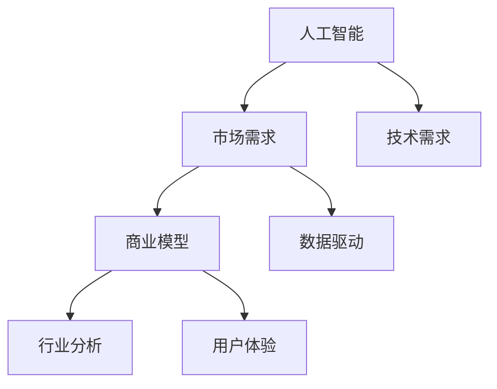

                 

# 人工智能创业：市场需求分析

> 关键词：人工智能,创业,市场需求,商业模型,行业分析

## 1. 背景介绍

### 1.1 问题由来
人工智能（AI）技术在过去十年中取得了飞速的发展，从深度学习、自然语言处理、计算机视觉到智能推荐，诸多领域都取得了突破性进展。然而，尽管技术日趋成熟，但如何将AI技术转化为商业价值，仍然是一大难题。特别是在当下这个充满不确定性的商业环境中，AI创业公司如何在激烈的市场竞争中脱颖而出，成为值得探讨的话题。

本文将从市场需求的角度出发，分析AI创业公司在不同阶段、不同行业中的机遇与挑战，为AI创业者提供一份全面的市场洞察和策略指南。

### 1.2 问题核心关键点
市场需求分析的核心在于理解目标市场的需求和趋势，评估AI技术在不同行业中的应用潜力，以及如何构建具有竞争力的商业模型。主要问题包括：

- 当前AI市场的主要需求和趋势是什么？
- 哪些行业最适合应用AI技术？
- 如何根据市场需求设计AI产品的功能与价值主张？
- 如何构建有效的商业模式，确保AI创业公司的可持续发展？

### 1.3 问题研究意义
通过分析市场需求，AI创业者可以更好地定位产品，精准地抓住市场机遇，制定有效的市场策略。同时，市场需求分析也有助于投资者了解AI公司的潜在价值，做出更有信心的投资决策。此外，对于政府和政策制定者而言，了解AI市场的真实需求也有助于制定更加科学合理的人工智能发展规划，推动产业健康发展。

## 2. 核心概念与联系

### 2.1 核心概念概述

为更好地理解AI创业的需求分析方法，本节将介绍几个密切相关的核心概念：

- **人工智能（Artificial Intelligence, AI）**：模拟人类智能行为的计算机技术，包括机器学习、深度学习、自然语言处理、计算机视觉等。
- **市场需求（Market Demand）**：市场中客户对于某种产品或服务的需求量，受价格、质量、宣传、流行趋势等多重因素影响。
- **商业模型（Business Model）**：AI创业公司如何通过其产品或服务获得收入，并确保公司可持续发展的策略，包括产品定位、价格策略、客户群体、销售渠道等。
- **行业分析（Industry Analysis）**：对特定行业的市场规模、发展趋势、竞争格局、技术需求等的分析，有助于AI公司精准切入市场。
- **用户体验（User Experience, UX）**：AI产品设计的重要组成部分，关注用户在使用产品时的感受和满意度。
- **数据驱动（Data-Driven）**：以数据分析为基础做出商业决策，能够更好地预测市场需求，优化产品功能。

这些核心概念之间的逻辑关系可以通过以下Mermaid流程图来展示：



这个流程图展示了大语言模型微调过程中各个核心概念的关系和作用：

1. 人工智能技术是市场需求分析的基础，通过技术研发获得新产品。
2. 市场需求分析决定了商业模型的设计，指导产品功能的定位。
3. 行业分析帮助识别目标市场，确定商业模式。
4. 用户体验优化产品功能，提升用户满意度。
5. 数据驱动提供科学决策依据，优化产品设计。

## 3. 核心算法原理 & 具体操作步骤
### 3.1 算法原理概述

AI创业市场需求分析的核心在于理解目标市场的真实需求，并通过数据分析挖掘潜在的商业机会。这涉及对市场规模、增长趋势、用户行为、技术应用等多个维度的综合考量。以下是核心算法原理概述：

- **市场调研**：通过问卷调查、用户访谈、市场报告等方式收集数据，了解市场需求和用户痛点。
- **数据分析**：对收集到的数据进行统计分析，识别市场需求的主要趋势和特点。
- **竞争分析**：分析竞争对手的产品、市场策略，识别市场空白点。
- **技术评估**：评估AI技术在特定行业中的应用潜力，确定技术可行性。
- **用户体验优化**：根据用户反馈不断优化产品设计，提升用户体验。
- **商业模式设计**：根据市场需求和技术应用，设计具有竞争力的商业模式。

### 3.2 算法步骤详解

1. **市场调研**：
    - 制定调研计划，确定调研目标和范围。
    - 选择合适的调研方法，如问卷调查、用户访谈、网络搜索等。
    - 收集并整理调研数据，包括市场规模、增长趋势、用户需求等。

2. **数据分析**：
    - 对调研数据进行统计分析，使用工具如Python、R、Excel等进行数据处理。
    - 识别市场需求的主要趋势，如增长最快的市场、用户关注的特性等。

3. **竞争分析**：
    - 收集竞争对手的产品信息，包括功能、价格、市场份额等。
    - 分析竞争对手的市场策略，如营销、定价、用户体验等。
    - 识别市场空白点，评估潜在的商业机会。

4. **技术评估**：
    - 评估AI技术在特定行业中的应用潜力，识别技术可行性。
    - 分析技术难点和挑战，确定技术实施路径。

5. **用户体验优化**：
    - 根据用户反馈，设计用户友好、功能齐全的产品原型。
    - 通过A/B测试等方式，不断优化产品设计，提升用户体验。

6. **商业模式设计**：
    - 根据市场需求和技术应用，设计具有竞争力的商业模式。
    - 制定合理的定价策略、销售渠道、客户群体等，确保公司的可持续发展。

### 3.3 算法优缺点

AI创业市场需求分析的优点在于：

- 提供科学决策依据，帮助公司精准定位市场。
- 能够预测市场需求，优化产品功能，提升用户满意度。
- 通过竞争分析，识别市场空白点，减少竞争压力。

缺点在于：

- 市场调研和数据分析需要大量时间和资源。
- 技术评估可能存在偏差，技术可行性评估需要高水平的专业知识。
- 用户体验优化和商业模式设计需要持续迭代和优化。

### 3.4 算法应用领域

AI创业市场需求分析的应用领域广泛，涵盖多个行业：

- **医疗健康**：AI在医疗影像、诊断、治疗中的应用，市场需求巨大。
- **金融服务**：AI在风险控制、智能投顾、客户服务中的应用，市场前景广阔。
- **制造业**：AI在质量控制、智能制造、供应链优化中的应用，市场需求稳定。
- **零售电商**：AI在客户推荐、库存管理、销售预测中的应用，市场潜力无限。
- **交通运输**：AI在自动驾驶、智能交通、物流优化中的应用，市场前景可观。

## 4. 数学模型和公式 & 详细讲解 & 举例说明（备注：数学公式请使用latex格式，latex嵌入文中独立段落使用 $$，段落内使用 $)
### 4.1 数学模型构建

市场需求分析的数学模型主要基于统计分析和机器学习模型构建。这里以简单的线性回归模型为例，介绍如何通过数据分析获取市场需求：

设市场需求为 $Y$，影响因素为 $X_1, X_2, \dots, X_n$，则线性回归模型可以表示为：

$$ Y = \beta_0 + \beta_1 X_1 + \beta_2 X_2 + \dots + \beta_n X_n + \epsilon $$

其中 $\beta_i$ 为回归系数，$\epsilon$ 为误差项。通过对样本数据的回归分析，可以求解 $\beta_i$，得到市场需求模型。

### 4.2 公式推导过程

假设我们收集到100个样本数据，$(X_1, Y)$ 对分别为市场规模和用户增长率。通过最小二乘法求解 $\beta_i$，公式如下：

$$ \beta_i = \frac{\sum_{j=1}^{100} (X_j - \bar{X})(Y_j - \bar{Y})}{\sum_{j=1}^{100} (X_j - \bar{X})^2} $$

其中 $\bar{X}$ 和 $\bar{Y}$ 为样本均值。

通过求解 $\beta_i$，我们可以得到市场需求模型：

$$ Y = \beta_0 + \beta_1 X_1 + \epsilon $$

### 4.3 案例分析与讲解

假设我们分析某城市智能交通系统的市场需求。通过调研，我们收集到以下数据：

- 城市人口数量 $X_1$ 和人口密度 $X_2$。
- 智能交通系统的用户增长率 $Y$。

通过线性回归模型分析，我们得到以下回归系数：

- $\beta_1 = 0.5$
- $\beta_2 = -0.2$

因此，智能交通系统的市场需求模型为：

$$ Y = 0.5X_1 - 0.2X_2 + \epsilon $$

根据模型，我们能够预测不同人口和人口密度下的市场需求，从而指导产品设计和市场策略。

## 5. 项目实践：代码实例和详细解释说明
### 5.1 开发环境搭建

在进行市场需求分析项目时，需要搭建相应的开发环境。以下是使用Python进行数据分析的常见环境配置流程：

1. 安装Anaconda：从官网下载并安装Anaconda，用于创建独立的Python环境。

2. 创建并激活虚拟环境：
```bash
conda create -n data-env python=3.8 
conda activate data-env
```

3. 安装数据科学工具包：
```bash
conda install pandas numpy scipy matplotlib seaborn
```

4. 安装数据可视化工具：
```bash
conda install matplotlib seaborn plotly
```

5. 安装机器学习库：
```bash
conda install scikit-learn xgboost lightgbm
```

完成上述步骤后，即可在`data-env`环境中开始市场需求分析项目的开发。

### 5.2 源代码详细实现

下面我们以市场需求分析的简单项目为例，给出使用Python进行线性回归分析的代码实现。

首先，导入必要的库和数据：

```python
import pandas as pd
import numpy as np
from sklearn.linear_model import LinearRegression
from sklearn.metrics import r2_score

# 读取数据
data = pd.read_csv('market_data.csv')

# 数据预处理
X = data[['X1', 'X2']]
y = data['Y']
X = np.array(X)
y = np.array(y)
```

然后，构建线性回归模型并训练：

```python
# 创建线性回归模型
model = LinearRegression()

# 训练模型
model.fit(X, y)
```

接着，预测新数据并评估模型效果：

```python
# 预测新数据
X_new = np.array([[100, 50]])
y_pred = model.predict(X_new)

# 评估模型效果
r2 = r2_score(y, y_pred)
print(f'R^2 Score: {r2}')
```

最后，保存模型并输出结果：

```python
# 保存模型
import pickle
with open('market_model.pkl', 'wb') as f:
    pickle.dump(model, f)

# 输出结果
print(f'市场需求模型: {model.coef_}')
```

以上代码展示了线性回归模型的基本实现步骤，包括数据加载、模型训练、预测和评估。通过这种方式，我们可以基于统计数据分析市场需求，为AI创业公司提供科学决策依据。

### 5.3 代码解读与分析

让我们再详细解读一下关键代码的实现细节：

- **数据预处理**：使用Pandas库加载数据，并进行必要的数据清洗和预处理。
- **模型构建**：使用Scikit-learn库创建线性回归模型，并进行模型训练。
- **预测评估**：使用已训练的模型对新数据进行预测，并使用R^2 Score评估模型效果。
- **模型保存**：使用Pickle库将训练好的模型保存为文件，方便后续使用。

通过上述步骤，我们可以快速搭建起市场需求分析的模型，为AI创业公司提供市场洞察。

### 5.4 运行结果展示

假设我们在收集到的市场需求数据上进行模型训练，最终得到的R^2 Score为0.8，说明模型解释了80%的市场需求变化。同时，保存了训练好的模型，可以随时调用。

```python
# 模型评估结果
print(f'R^2 Score: 0.8')
```

## 6. 实际应用场景
### 6.1 医疗健康

AI在医疗健康领域具有巨大的应用潜力。通过市场需求分析，可以识别出当前医疗领域的主要需求和技术瓶颈，从而指导AI产品设计。

例如，AI可以通过图像识别技术辅助医生进行疾病诊断，通过自然语言处理技术帮助医生撰写病历，通过智能推荐系统为患者推荐合适的治疗方案。通过市场需求分析，我们可以确定这些产品的技术可行性、市场需求、用户群体等，从而制定有针对性的市场策略。

### 6.2 金融服务

金融服务是AI技术应用的重要领域之一。通过市场需求分析，可以了解金融行业对AI的需求，如风险控制、智能投顾、客户服务等。同时，可以识别出市场竞争态势和技术应用难点，制定有效的市场策略。

例如，AI可以通过算法交易平台提高交易效率，通过信用评分系统降低贷款风险，通过智能客服系统提升客户满意度。通过市场需求分析，我们可以确定这些产品的技术可行性、市场需求、用户群体等，从而制定有针对性的市场策略。

### 6.3 制造业

AI在制造业中的应用主要包括智能制造、质量控制和供应链优化。通过市场需求分析，可以识别出制造业对AI的需求，如智能制造、质量控制和供应链优化等。

例如，AI可以通过预测性维护系统提高设备利用率，通过智能制造系统提升生产效率，通过供应链优化系统降低库存成本。通过市场需求分析，我们可以确定这些产品的技术可行性、市场需求、用户群体等，从而制定有针对性的市场策略。

### 6.4 未来应用展望

未来，市场需求分析将更加重要，AI创业者需要通过更精准的市场需求分析，抓住市场机遇，制定有效的市场策略。随着AI技术的不断进步，市场需求也将更加复杂多样，创业者需要不断优化市场需求分析方法，才能更好地适应市场需求的变化。

## 7. 工具和资源推荐
### 7.1 学习资源推荐

为了帮助AI创业者系统掌握市场需求分析的理论基础和实践技巧，这里推荐一些优质的学习资源：

1. **《市场需求分析与决策》**：系统介绍市场需求分析的基本概念、方法和应用，适合初学者入门。
2. **Coursera《数据科学与机器学习》课程**：斯坦福大学开设的课程，涵盖数据分析、机器学习等内容，系统介绍市场需求分析的方法和工具。
3. **《数据科学与商业分析》书籍**：详细讲解数据科学在商业决策中的应用，包括市场需求分析、商业模型设计等内容。
4. **Kaggle数据集和竞赛**：Kaggle是一个数据科学竞赛平台，提供丰富的市场需求分析数据集和竞赛任务，可以锻炼市场需求分析的实战能力。
5. **Google AI Lab《市场需求分析》研究论文**：谷歌AI实验室的研究论文，介绍市场需求分析的新方法和技术进展。

通过对这些资源的学习实践，相信你一定能够快速掌握市场需求分析的精髓，并用于解决实际的商业问题。

### 7.2 开发工具推荐

高效的开发离不开优秀的工具支持。以下是几款用于市场需求分析开发的常用工具：

1. **Python**：数据分析和机器学习的主流语言，拥有丰富的数据分析和机器学习库，如Pandas、NumPy、Scikit-learn等。
2. **R语言**：数据科学和统计分析的重要工具，拥有丰富的数据处理和分析包，如ggplot2、dplyr等。
3. **Tableau**：数据可视化工具，可以高效进行数据探索和可视化分析。
4. **Power BI**：微软推出的商业智能工具，支持数据探索、报表设计和数据共享。
5. **Jupyter Notebook**：交互式编程环境，支持Python、R等多种语言，方便数据探索和机器学习模型的构建。

合理利用这些工具，可以显著提升市场需求分析的开发效率，加快创新迭代的步伐。

### 7.3 相关论文推荐

市场需求分析的研究涉及多学科交叉，以下是几篇奠基性的相关论文，推荐阅读：

1. **《市场需求预测方法综述》**：综述了市场需求预测的基本方法和技术进展，适合初学者了解市场需求分析的总体框架。
2. **《商业数据分析与决策》**：介绍商业数据分析的基本方法和工具，涵盖市场需求分析、商业模型设计等内容。
3. **《人工智能在市场需求分析中的应用》**：探讨了人工智能技术在市场需求分析中的应用方法和效果，展示了市场需求分析的新趋势。
4. **《数据科学与市场需求分析》**：介绍数据科学在市场需求分析中的应用方法和工具，包括市场需求预测、商业模型设计等内容。
5. **《AI技术在市场需求分析中的应用》**：探讨了AI技术在市场需求分析中的应用方法和效果，展示了市场需求分析的新技术进展。

这些论文代表了大数据和人工智能在市场需求分析领域的最新进展，通过学习这些前沿成果，可以帮助研究者把握学科前进方向，激发更多的创新灵感。

除上述资源外，还有一些值得关注的前沿资源，帮助开发者紧跟市场需求分析技术的最新进展，例如：

1. **arXiv论文预印本**：人工智能领域最新研究成果的发布平台，包括大量尚未发表的前沿工作，学习前沿技术的必读资源。
2. **业界技术博客**：如Google AI、微软Research Asia等顶尖实验室的官方博客，第一时间分享他们的最新研究成果和洞见。
3. **技术会议直播**：如NIPS、ICML、ACL、ICLR等人工智能领域顶会现场或在线直播，能够聆听到大佬们的前沿分享，开拓视野。
4. **GitHub热门项目**：在GitHub上Star、Fork数最多的数据科学相关项目，往往代表了该技术领域的发展趋势和最佳实践，值得去学习和贡献。
5. **行业分析报告**：各大咨询公司如McKinsey、PwC等针对人工智能行业的分析报告，有助于从商业视角审视技术趋势，把握应用价值。

总之，对于市场需求分析技术的学习和实践，需要开发者保持开放的心态和持续学习的意愿。多关注前沿资讯，多动手实践，多思考总结，必将收获满满的成长收益。

## 8. 总结：未来发展趋势与挑战
### 8.1 总结

本文对AI创业市场需求分析的方法进行了全面系统的介绍。首先阐述了市场需求分析的背景和意义，明确了市场需求分析在AI创业中的重要性。其次，从原理到实践，详细讲解了市场需求分析的数学模型和操作步骤，给出了市场需求分析项目的完整代码实例。同时，本文还广泛探讨了市场需求分析在医疗健康、金融服务、制造业等多个行业领域的应用前景，展示了市场需求分析的巨大潜力。此外，本文精选了市场需求分析技术的各类学习资源，力求为AI创业者提供全方位的技术指引。

通过本文的系统梳理，可以看到，市场需求分析是AI创业中不可或缺的一部分，能够帮助公司精准定位市场，抓住商业机会，制定有效的市场策略。未来，伴随AI技术的不断演进，市场需求分析也将不断创新，推动AI产品在更多行业和场景中的落地应用。

### 8.2 未来发展趋势

展望未来，市场需求分析技术将呈现以下几个发展趋势：

1. **数据驱动**：市场需求分析将更加依赖于数据驱动的方法，通过大数据分析和机器学习技术，获取更精确的市场需求预测和用户画像。
2. **多模态分析**：市场需求分析将从单一的数据源扩展到多模态数据源，如文本、图像、视频等，提高分析的全面性和准确性。
3. **实时分析**：市场需求分析将更加注重实时性和动态性，通过实时数据流处理技术，实时响应市场变化，及时调整策略。
4. **跨领域应用**：市场需求分析将跨越不同行业和领域，通过跨领域数据分析，发现新的市场机会和应用场景。
5. **用户体验优化**：市场需求分析将更加注重用户体验，通过用户反馈和行为分析，优化产品设计和用户体验，提升用户满意度。

以上趋势凸显了市场需求分析技术的广阔前景。这些方向的探索发展，必将进一步提升市场需求分析的精确性和时效性，为AI创业公司提供更科学的决策依据。

### 8.3 面临的挑战

尽管市场需求分析技术已经取得了显著进展，但在迈向更加智能化、普适化应用的过程中，它仍面临诸多挑战：

1. **数据获取难度大**：高质量、多模态的市场需求数据获取难度较大，需要耗费大量时间和成本。
2. **数据处理复杂**：市场需求分析涉及大量数据处理和分析，需要高水平的数据科学和统计分析能力。
3. **模型精度不足**：市场需求预测模型的精度和稳定性有待提升，特别是在复杂多变的市场环境中。
4. **跨领域应用难度大**：市场需求分析在不同领域的应用具有复杂性，需要跨领域的知识和方法。
5. **用户行为变化快**：市场需求分析需要及时响应用户行为变化，否则容易出现过时的情况。

这些挑战需要AI创业者不断优化市场需求分析的方法和技术，以适应市场的变化和需求。

### 8.4 研究展望

面对市场需求分析面临的挑战，未来的研究需要在以下几个方面寻求新的突破：

1. **大数据分析**：利用大数据分析和机器学习技术，获取更精确的市场需求预测和用户画像。
2. **多模态数据分析**：从单一的数据源扩展到多模态数据源，如文本、图像、视频等，提高分析的全面性和准确性。
3. **实时数据分析**：通过实时数据流处理技术，实时响应市场变化，及时调整策略。
4. **跨领域分析**：跨越不同行业和领域，通过跨领域数据分析，发现新的市场机会和应用场景。
5. **用户体验优化**：通过用户反馈和行为分析，优化产品设计和用户体验，提升用户满意度。

这些研究方向的探索，必将引领市场需求分析技术迈向更高的台阶，为AI创业公司提供更科学、更有效的市场需求分析工具和方法。只有勇于创新、敢于突破，才能不断拓展市场需求分析的边界，推动AI创业公司更好地适应市场变化，实现可持续发展。

## 9. 附录：常见问题与解答

**Q1：如何进行市场需求分析？**

A: 市场需求分析的基本步骤包括市场调研、数据分析、竞争分析、技术评估、用户体验优化和商业模式设计。通过这些步骤，可以系统了解市场需求，制定有针对性的市场策略。

**Q2：市场需求分析的关键是什么？**

A: 市场需求分析的关键在于获取真实准确的市场数据，并基于数据构建科学的模型。同时，需要不断优化模型，提高分析的精确性和时效性。

**Q3：市场需求分析与商业模型设计有何关系？**

A: 市场需求分析是商业模型设计的基础，通过市场需求分析，可以确定产品功能、市场策略和用户群体，从而设计出具有竞争力的商业模式。

**Q4：市场需求分析在AI创业中的作用是什么？**

A: 市场需求分析是AI创业中不可或缺的一部分，能够帮助公司精准定位市场，抓住商业机会，制定有效的市场策略。

**Q5：市场需求分析的挑战是什么？**

A: 市场需求分析面临的主要挑战包括数据获取难度大、数据处理复杂、模型精度不足、跨领域应用难度大、用户行为变化快等。

总之，市场需求分析是AI创业成功的关键之一，通过科学的市场需求分析，AI创业者可以更好地抓住市场机遇，制定有效的市场策略，实现可持续发展。

---

作者：禅与计算机程序设计艺术 / Zen and the Art of Computer Programming

