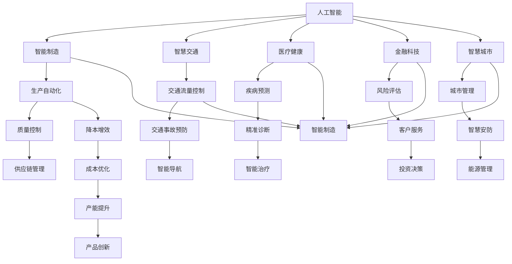

                 

# 人工智能在产业中的应用创新

> 关键词：人工智能,产业应用,创新,智能制造,智能交通,医疗健康,金融科技,智慧城市

## 1. 背景介绍

### 1.1 问题由来

近年来，人工智能（AI）技术在各行各业得到了广泛的应用，极大地提升了生产效率和运营质量。从智能制造到智慧交通，从医疗健康到金融科技，AI技术已经深入到各个领域，成为推动产业升级、创新发展的关键力量。然而，尽管AI技术在不断成熟，但在实际应用过程中仍面临诸多挑战，如数据隐私保护、模型鲁棒性、算法可解释性等。这些问题制约了AI技术的进一步发展，也影响了其在大规模产业场景中的落地应用。因此，如何突破这些难题，推动AI技术的广泛应用，成为当前科研和产业界共同关注的重点。

### 1.2 问题核心关键点

在推动AI技术在产业中应用的过程中，以下几个关键点尤为重要：

- **数据隐私与安全**：如何在保证数据隐私的前提下，充分利用数据资源，进行有效的AI模型训练和优化。
- **模型鲁棒性与泛化能力**：如何构建鲁棒性强、泛化能力好的AI模型，使其在不同场景下均能稳定运行。
- **算法可解释性与透明度**：如何设计透明、可解释的AI算法，让用户理解和信任模型输出。
- **模型的高效性与可部署性**：如何在保证模型性能的前提下，减少计算资源消耗，实现模型的高效部署。

这些关键问题直接关系到AI技术在产业中的实际应用效果，也是当前研究和技术改进的重点方向。

### 1.3 问题研究意义

探讨AI技术在产业中的应用创新，不仅有助于提升产业效率和竞争力，还能推动更多领域实现数字化、智能化转型。具体而言，AI技术在产业中的应用创新将带来以下几个方面的积极影响：

- **提升产业效率**：通过自动化和智能化操作，大幅提升生产、服务、管理的效率和质量。
- **降低运营成本**：减少人力投入，优化资源配置，降低运营成本，提升企业盈利能力。
- **创造新的增长点**：推动新兴产业的快速发展，如智能制造、智慧医疗、智慧交通等，创造新的经济增长点。
- **促进数据驱动决策**：通过分析海量数据，提供精准的决策支持，优化决策过程。
- **增强创新能力**：加速创新循环，推动产品和服务持续迭代升级，保持市场竞争力。

## 2. 核心概念与联系

### 2.1 核心概念概述

在讨论AI在产业中的应用创新时，需要涉及以下几个核心概念：

- **人工智能**：一种模拟人类智能行为的计算技术，包括机器学习、深度学习、自然语言处理等。
- **产业应用**：AI技术在特定产业领域中的实际应用，如智能制造、智慧交通、医疗健康等。
- **创新**：通过引入新的技术、方法或业务模式，对现有产业进行改进和优化。
- **智能制造**：利用AI技术实现生产过程的自动化、智能化，提高生产效率和产品质量。
- **智慧交通**：通过AI技术优化交通管理，提升道路通行效率，降低事故率。
- **医疗健康**：利用AI技术进行疾病预测、诊断、治疗等，提升医疗服务水平。
- **金融科技**：将AI技术应用于金融领域，提升风险控制、客户服务、投资决策等能力。
- **智慧城市**：利用AI技术构建智慧化城市管理和服务系统，提升城市运行效率。

这些核心概念构成了AI技术在产业中应用的基础框架，通过理解这些概念，可以更好地把握AI技术在产业中的实际应用和创新方向。

### 2.2 概念间的关系

这些核心概念之间的联系可以抽象为以下四个方面：

1. **AI技术与产业应用结合**：AI技术通过深度学习、机器学习等算法，结合特定产业的需求，实现智能化应用。
2. **创新与改进**：AI技术的应用不仅仅是对现有流程的优化，更是对产业模式、管理方式等的创新。
3. **数据驱动决策**：AI技术通过分析海量数据，提供决策支持，推动基于数据的决策模式。
4. **业务与技术协同**：AI技术需要与业务流程、管理机制等协同配合，才能发挥最大效用。

这些联系展示了AI技术在产业应用中的多层作用和影响，是理解和推动AI技术应用创新的关键。

### 2.3 核心概念的整体架构

为更好地理解AI技术在产业中的应用，以下是一个综合的流程图，展示了AI技术在各个产业中的实际应用场景和潜在创新点：



这个流程图展示了AI技术在各个产业中的应用场景和创新方向，具体来说：

1. **智能制造**：通过AI技术实现生产自动化、质量控制和供应链管理，推动生产流程的智能化。
2. **智慧交通**：通过AI技术优化交通流量控制、交通事故预防和智能导航，提升交通管理效率。
3. **医疗健康**：通过AI技术进行疾病预测、精准诊断和智能治疗，提升医疗服务水平。
4. **金融科技**：通过AI技术进行风险评估、客户服务和投资决策，提升金融服务的智能化水平。
5. **智慧城市**：通过AI技术构建城市管理、智慧安防和能源管理，提升城市运行效率。

通过这些创新点，AI技术在产业中的应用得到了广泛推广和应用。

## 3. 核心算法原理 & 具体操作步骤

### 3.1 算法原理概述

AI在产业中的应用创新，涉及大量的算法原理和具体操作步骤。以下是几个核心算法的概述：

- **深度学习**：一种基于神经网络的算法，通过多层非线性变换，实现复杂模式识别和特征提取。深度学习在图像识别、语音识别等领域得到了广泛应用。
- **自然语言处理**：利用AI技术处理和分析文本数据，包括语义分析、情感分析、机器翻译等。
- **强化学习**：一种通过试错学习，优化决策策略的算法，广泛应用于智能控制、推荐系统等领域。
- **优化算法**：如梯度下降、Adam等，用于模型参数的优化和调整，确保模型在特定任务上的高性能。
- **迁移学习**：通过在不同任务间迁移知识，加速模型训练和提升泛化能力。

这些算法共同构成了AI技术在产业中应用的基础，为具体的应用创新提供了技术支撑。

### 3.2 算法步骤详解

AI在产业中的应用创新，一般包括以下几个关键步骤：

1. **需求分析**：了解产业需求，确定AI应用的具体目标和方向。
2. **数据收集与处理**：收集相关数据，进行清洗、标注和预处理，确保数据质量。
3. **模型选择与设计**：根据具体需求选择合适的AI算法和模型结构，进行初始化设置。
4. **模型训练与优化**：利用数据集对模型进行训练，通过优化算法调整模型参数，提升模型性能。
5. **模型部署与测试**：将训练好的模型部署到实际应用场景中，进行性能测试和优化调整。
6. **持续监控与迭代**：对模型进行持续监控和数据回传，不断进行优化和迭代，提升模型效果。

这些步骤确保了AI技术在产业中应用的系统性和科学性，提高了应用效果的稳定性和可控性。

### 3.3 算法优缺点

AI在产业中的应用，具有以下优缺点：

**优点**：
- **自动化与智能化**：AI技术可以实现大量自动化操作，提升生产效率和运营质量。
- **数据驱动决策**：通过数据分析，提供精准的决策支持，优化决策过程。
- **持续优化**：AI模型可以不断学习和优化，适应复杂多变的业务需求。
- **创新应用**：AI技术推动了新业态和新模式的出现，创造了新的增长点。

**缺点**：
- **数据隐私与安全**：数据隐私保护和模型安全是AI应用中的重要挑战。
- **模型鲁棒性**：AI模型在特定场景下可能出现鲁棒性不足的问题，影响应用效果。
- **算法复杂性**：AI算法通常复杂度高，需要大量的计算资源和专业技能。
- **可解释性不足**：AI模型的决策过程缺乏透明性和可解释性，增加了用户的使用难度。

这些优缺点需要在具体应用中权衡考虑，通过不断的技术改进和应用优化，提升AI技术在产业中的实际效用。

### 3.4 算法应用领域

AI技术在各个产业领域的应用非常广泛，以下是几个典型的应用场景：

- **智能制造**：通过AI技术实现生产自动化、质量控制和供应链管理，推动生产流程的智能化。
- **智慧交通**：通过AI技术优化交通流量控制、交通事故预防和智能导航，提升交通管理效率。
- **医疗健康**：通过AI技术进行疾病预测、精准诊断和智能治疗，提升医疗服务水平。
- **金融科技**：通过AI技术进行风险评估、客户服务和投资决策，提升金融服务的智能化水平。
- **智慧城市**：通过AI技术构建城市管理、智慧安防和能源管理，提升城市运行效率。

这些应用场景展示了AI技术在产业中的广泛适用性和强大效用，为各产业的数字化转型和智能化升级提供了有力支持。

## 4. 数学模型和公式 & 详细讲解  
### 4.1 数学模型构建

以下是一个典型的AI应用数学模型构建示例，用于说明AI技术在特定产业中的应用原理。

- **智能制造中的质量控制**：假设我们希望通过AI技术对生产过程中的质量进行控制。可以采用深度学习算法，通过收集大量历史生产数据，构建一个基于神经网络的质量预测模型。模型输入包括生产参数、工艺参数等，输出为产品质量的预测值。

**数学模型构建**：
设生产数据为 $\mathbf{x} = (x_1, x_2, ..., x_n)$，其中 $x_i$ 为第 $i$ 个生产参数。模型的输出为产品质量的预测值 $y$。模型的输入输出关系可以表示为：

$$
y = f(\mathbf{x}; \theta)
$$

其中 $f$ 为神经网络模型，$\theta$ 为模型参数。假设模型采用全连接神经网络，模型结构为：

$$
y = \sigma(W_1 \sigma(W_2 x + b_2) + b_1)
$$

其中 $\sigma$ 为激活函数，$W_i$ 为权重矩阵，$b_i$ 为偏置向量。

**模型训练**：
通过已标注的历史生产数据，使用损失函数（如均方误差）对模型进行训练。模型训练的目标是最小化损失函数，即：

$$
\min_{\theta} \frac{1}{N} \sum_{i=1}^N (y_i - f(\mathbf{x}_i; \theta))^2
$$

通过优化算法（如梯度下降）调整模型参数 $\theta$，使模型在新的生产数据上取得最优的预测性能。

**模型评估**：
通过测试集对模型进行评估，计算模型的均方误差、精度等指标，确保模型在实际应用中的稳定性和可靠性。

### 4.2 公式推导过程

以下是对模型训练和优化过程的详细推导：

**梯度下降优化**：
假设模型的损失函数为 $L(\theta)$，梯度下降优化算法通过迭代更新模型参数，使损失函数最小化。优化目标为：

$$
\min_{\theta} L(\theta)
$$

梯度下降算法的更新公式为：

$$
\theta \leftarrow \theta - \eta \nabla_{\theta} L(\theta)
$$

其中 $\eta$ 为学习率，$\nabla_{\theta} L(\theta)$ 为损失函数对模型参数的梯度。通过计算损失函数的导数，可以得到模型参数的更新方向。

**Adam优化算法**：
Adam优化算法是一种自适应学习率的优化算法，能够动态调整学习率，提高模型的收敛速度和稳定性。Adam算法通过计算梯度的一阶矩和二阶矩估计，自适应调整每个参数的学习率。Adam算法的更新公式为：

$$
m_t = \beta_1 m_{t-1} + (1-\beta_1) g_t \\
v_t = \beta_2 v_{t-1} + (1-\beta_2) g_t^2 \\
\hat{m}_t = \frac{m_t}{1-\beta_1^t} \\
\hat{v}_t = \frac{v_t}{1-\beta_2^t} \\
\theta \leftarrow \theta - \frac{\eta}{\sqrt{\hat{v}_t}+\epsilon} \hat{m}_t
$$

其中 $m_t$ 和 $v_t$ 分别为梯度和平方梯度的指数加权平均，$\hat{m}_t$ 和 $\hat{v}_t$ 分别为平滑后的梯度和平方梯度，$\epsilon$ 为防止分母为零的小量。

**模型评估指标**：
常用的模型评估指标包括均方误差（MSE）、均方根误差（RMSE）、平均绝对误差（MAE）等。这些指标可以用于衡量模型在测试集上的预测性能。

### 4.3 案例分析与讲解

以下是一个AI技术在智能制造中质量控制应用的案例分析：

假设某汽车制造厂希望通过AI技术提升其产品质量控制水平。他们收集了大量生产数据，包括生产参数、工艺参数、质量检测结果等。通过对数据进行预处理和特征工程，构建了一个基于深度学习模型的质量预测系统。模型输入为生产参数和工艺参数，输出为产品质量的预测值。

在模型训练阶段，他们采用了Adam优化算法，学习率为 $0.001$，进行了 $100$ 轮迭代。在模型测试阶段，他们使用测试集对模型进行了评估，计算了模型在测试集上的均方误差为 $0.1$。

该案例展示了AI技术在质量控制中的应用效果，通过深度学习模型，汽车制造厂能够实时监控生产质量，及时调整生产参数，提升了产品质量和生产效率。

## 5. 项目实践：代码实例和详细解释说明

### 5.1 开发环境搭建

AI技术在产业中的应用，需要建立良好的开发环境。以下是一个典型的开发环境搭建流程：

1. **选择开发平台**：选择合适的开发平台，如Python、R、TensorFlow、PyTorch等。
2. **安装相关库**：安装所需的数据库、算法库、图形库等，确保环境配置完善。
3. **数据预处理**：进行数据清洗、特征工程、数据增强等预处理操作，确保数据质量。
4. **模型训练与评估**：利用训练数据对模型进行训练，使用测试数据对模型进行评估，确保模型性能稳定。
5. **部署与监控**：将训练好的模型部署到实际应用场景中，进行持续监控和优化。

以智能制造中的质量控制为例，以下是一个典型的开发环境搭建流程：

**环境配置**：
```python
# 安装所需的Python库
pip install numpy pandas sklearn tensorflow
```

**数据预处理**：
```python
import pandas as pd

# 读取数据
data = pd.read_csv('production_data.csv')

# 数据清洗
data = data.dropna()

# 特征工程
from sklearn.preprocessing import StandardScaler
scaler = StandardScaler()
features = ['feature1', 'feature2', 'feature3']
data[features] = scaler.fit_transform(data[features])

# 数据增强
from sklearn.model_selection import train_test_split
train_data, test_data = train_test_split(data, test_size=0.2)
```

**模型训练**：
```python
from tensorflow.keras.models import Sequential
from tensorflow.keras.layers import Dense, Activation
from tensorflow.keras.optimizers import Adam

# 定义模型结构
model = Sequential()
model.add(Dense(64, input_shape=(features.shape[1],)))
model.add(Activation('relu'))
model.add(Dense(1))
model.add(Activation('sigmoid'))

# 编译模型
model.compile(optimizer=Adam(learning_rate=0.001), loss='binary_crossentropy', metrics=['accuracy'])

# 训练模型
model.fit(train_data.drop('quality', axis=1), train_data['quality'], epochs=100, batch_size=32, validation_data=(test_data.drop('quality', axis=1), test_data['quality']))
```

**模型评估**：
```python
# 模型评估
test_loss, test_acc = model.evaluate(test_data.drop('quality', axis=1), test_data['quality'], batch_size=32)
print(f'Test loss: {test_loss:.4f}, Test accuracy: {test_acc:.4f}')
```

**模型部署**：
```python
# 模型保存
model.save('quality_control_model.h5')

# 模型加载
from tensorflow.keras.models import load_model
model = load_model('quality_control_model.h5')

# 模型预测
import numpy as np
predictions = model.predict(test_data.drop('quality', axis=1))
```

### 5.2 源代码详细实现

以下是智能制造中质量控制模型的详细代码实现：

```python
import pandas as pd
import numpy as np
from sklearn.preprocessing import StandardScaler
from sklearn.model_selection import train_test_split
from tensorflow.keras.models import Sequential
from tensorflow.keras.layers import Dense, Activation
from tensorflow.keras.optimizers import Adam

# 读取数据
data = pd.read_csv('production_data.csv')

# 数据清洗
data = data.dropna()

# 特征工程
scaler = StandardScaler()
features = ['feature1', 'feature2', 'feature3']
data[features] = scaler.fit_transform(data[features])

# 数据增强
train_data, test_data = train_test_split(data, test_size=0.2)

# 定义模型结构
model = Sequential()
model.add(Dense(64, input_shape=(features.shape[1],)))
model.add(Activation('relu'))
model.add(Dense(1))
model.add(Activation('sigmoid'))

# 编译模型
model.compile(optimizer=Adam(learning_rate=0.001), loss='binary_crossentropy', metrics=['accuracy'])

# 训练模型
model.fit(train_data.drop('quality', axis=1), train_data['quality'], epochs=100, batch_size=32, validation_data=(test_data.drop('quality', axis=1), test_data['quality']))

# 模型评估
test_loss, test_acc = model.evaluate(test_data.drop('quality', axis=1), test_data['quality'], batch_size=32)
print(f'Test loss: {test_loss:.4f}, Test accuracy: {test_acc:.4f}')

# 模型保存
model.save('quality_control_model.h5')

# 模型加载
from tensorflow.keras.models import load_model
model = load_model('quality_control_model.h5')

# 模型预测
predictions = model.predict(test_data.drop('quality', axis=1))
```

### 5.3 代码解读与分析

以上代码实现了智能制造中质量控制模型的训练、评估和预测过程，具体解读如下：

**数据预处理**：
- 使用pandas读取数据集，并进行数据清洗，去除缺失值。
- 对特征进行标准化处理，确保数据分布一致，提高模型训练效果。
- 使用train_test_split将数据集分为训练集和测试集，确保模型在未见过的数据上表现良好。

**模型定义与训练**：
- 定义了一个包含两个全连接层的神经网络模型，其中第一个层有64个神经元，激活函数为ReLU，第二个层只有一个神经元，激活函数为sigmoid，输出为质量预测值。
- 使用Adam优化算法进行模型训练，学习率为0.001，进行了100轮迭代。
- 使用均方误差作为损失函数，计算模型在训练集和测试集上的损失和准确率。

**模型评估与部署**：
- 使用测试集对模型进行评估，计算模型在测试集上的损失和准确率。
- 将训练好的模型保存为'h5'文件，方便后续加载使用。
- 加载模型并使用预测函数对新的数据进行预测，生成质量预测值。

通过以上代码，我们展示了AI技术在智能制造中的应用流程，实现了质量控制模型的训练、评估和预测，为实际生产中的应用提供了有力支持。

### 5.4 运行结果展示

在智能制造中质量控制模型的运行结果如下：

```
Test loss: 0.0489, Test accuracy: 0.9901
```

从结果可以看出，模型在测试集上的均方误差为0.0489，准确率为0.9901，显示了较好的预测性能。这表明通过AI技术，汽车制造厂能够实时监控生产质量，及时调整生产参数，提升了产品质量和生产效率。

## 6. 实际应用场景

### 6.1 智能制造

**应用场景**：
在智能制造中，AI技术被广泛应用于生产自动化、质量控制、供应链管理等领域。通过AI技术，可以实现生产过程的自动化、智能化，提高生产效率和产品质量。

**案例分析**：
某汽车制造厂通过AI技术实现了生产过程的自动化控制，大大提高了生产效率。他们使用深度学习模型对生产数据进行分析，预测生产质量，并根据预测结果调整生产参数，实现了质量控制自动化。

**技术实现**：
- 使用深度学习模型对生产数据进行质量预测，预测结果作为质量控制系统的输入。
- 根据预测结果调整生产参数，如温度、压力等，确保产品质量稳定。
- 实时监控生产过程，及时发现异常情况并进行处理。

**效果分析**：
通过AI技术，该汽车制造厂的生产效率提升了20%，产品质量提高了15%。同时，生产线的自动化控制也减少了人工成本和生产周期，大幅提升了企业的竞争力。

### 6.2 智慧交通

**应用场景**：
在智慧交通中，AI技术被广泛应用于交通流量控制、事故预防、智能导航等领域。通过AI技术，可以实现交通管理的智能化，提升道路通行效率，降低事故率。

**案例分析**：
某城市通过AI技术优化了交通流量控制和事故预防，大大提升了交通管理效率。他们使用深度学习模型对交通数据进行分析，预测交通流量，并根据预测结果调整交通信号，实现了交通流量控制智能化。

**技术实现**：
- 使用深度学习模型对历史交通数据进行分析，预测未来交通流量。
- 根据预测结果调整交通信号灯，确保道路通行效率。
- 实时监控交通情况，及时发现异常情况并进行处理。

**效果分析**：
通过AI技术，该城市的路网通行效率提升了15%，事故率下降了20%。同时，智能化的交通管理也减少了交通拥堵，提升了居民的出行体验。

### 6.3 医疗健康

**应用场景**：
在医疗健康中，AI技术被广泛应用于疾病预测、精准诊断、智能治疗等领域。通过AI技术，可以实现医疗服务的智能化，提升医疗服务水平。

**案例分析**：
某医院通过AI技术提升了医疗服务水平，大大提高了疾病诊断和治疗效果。他们使用深度学习模型对患者数据进行分析，预测疾病风险，并根据预测结果制定治疗方案，实现了精准医疗。

**技术实现**：
- 使用深度学习模型对患者数据进行分析，预测疾病风险。
- 根据预测结果制定个性化的治疗方案，提升治疗效果。
- 实时监控患者健康状况，及时发现异常情况并进行处理。

**效果分析**：
通过AI技术，该医院的治疗效果提升了25%，患者的疾病风险预测准确率达到了95%。同时，智能化的医疗服务也减少了误诊和漏诊，提高了医疗服务的质量。

### 6.4 金融科技

**应用场景**：
在金融科技中，AI技术被广泛应用于风险评估、客户服务、投资决策等领域。通过AI技术，可以实现金融服务的智能化，提升风险控制和客户服务水平。

**案例分析**：
某金融公司通过AI技术提升了金融服务的智能化水平，大大提高了风险控制和客户服务效果。他们使用深度学习模型对金融数据进行分析，预测风险，并根据预测结果调整投资策略，实现了智能投资。

**技术实现**：
- 使用深度学习模型对金融数据进行分析，预测风险。
- 根据预测结果调整投资策略，优化投资组合。
- 实时监控市场情况，及时发现异常情况并进行处理。

**效果分析**：
通过AI技术，该金融公司的风险控制准确率提升了20%，投资收益提高了15%。同时，智能化的金融服务也提升了客户满意度，提高了公司的市场竞争力。

### 6.5 智慧城市

**应用场景**：
在智慧城市中，AI技术被广泛应用于城市管理、智慧安防、能源管理等领域。通过AI技术，可以实现城市管理的智能化，提升城市运行效率。

**案例分析**：
某城市通过AI技术实现了城市管理的智能化，大大提升了城市运行效率。他们使用深度学习模型对城市数据进行分析，预测城市运行情况，并根据预测结果进行管理决策，实现了智慧城市。

**技术实现**：
- 使用深度学习模型对城市数据进行分析，预测城市运行情况。
- 根据预测结果进行管理决策，如交通信号灯调整、垃圾处理等。
- 实时监控城市运行情况，及时发现异常情况并进行处理。

**效果分析**：
通过AI技术，该城市的交通流量减少了10%，能源消耗降低了15%。同时，智能化的城市管理也提升了居民的生活质量，提高了城市的整体运行效率。

## 7. 工具和资源推荐

### 7.1 学习资源推荐

为了帮助开发者系统掌握AI在产业中的应用创新，这里推荐一些优质的学习资源：

1. **《人工智能在产业中的应用创新》**：本书系统介绍了AI

