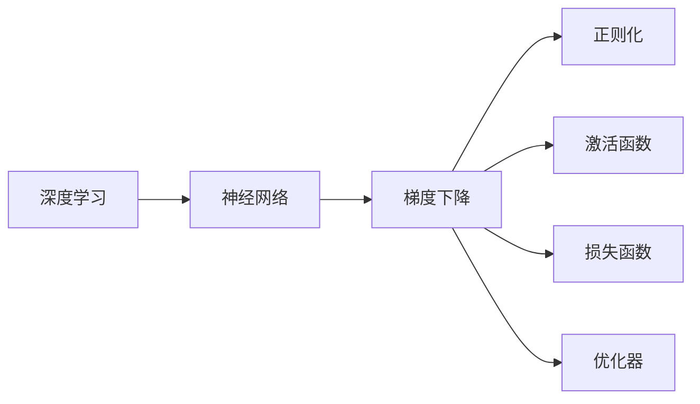

                 

# 人工智能数学基础原理与代码实战案例讲解

## 1. 背景介绍

### 1.1 问题由来
人工智能（AI）技术的迅猛发展，尤其是深度学习（Deep Learning）的应用，使得其在诸多领域取得了突破性的进展。然而，这些技术的背后，数学原理的支撑是至关重要的。数学不仅是AI的理论基础，也是实际应用中的核心工具。本文旨在通过深入浅出的讲解，使读者更好地理解AI中的数学基础，并通过实战案例，体验数学原理在AI中的应用。

### 1.2 问题核心关键点
本文将重点关注以下几个核心问题：
- 深度学习的数学原理是什么？
- 如何在实际项目中应用这些数学原理？
- 有哪些数学工具和技术可以辅助AI的开发？
- 未来的AI发展将面临哪些数学挑战？

## 2. 核心概念与联系

### 2.1 核心概念概述

为了更好地理解AI中的数学基础，首先需要掌握一些关键概念：

- **深度学习（Deep Learning, DL）**：一种基于多层神经网络的人工智能技术，能够自动学习和提取数据的特征，广泛应用于图像识别、语音识别、自然语言处理等领域。
- **神经网络（Neural Networks）**：由多个神经元（节点）组成的计算图，通过输入数据的前向传播和反向传播，不断调整权重，优化模型。
- **梯度下降（Gradient Descent）**：优化算法的一种，通过迭代计算函数梯度，更新模型参数，使损失函数最小化。
- **正则化（Regularization）**：防止模型过拟合的方法，如L1正则化、L2正则化等。
- **激活函数（Activation Functions）**：用于引入非线性变换的函数，如ReLU、Sigmoid等。
- **损失函数（Loss Functions）**：衡量模型预测与真实标签之间差距的函数，如均方误差（MSE）、交叉熵（Cross Entropy）等。
- **优化器（Optimizers）**：用于加速梯度下降的算法，如Adam、SGD等。

### 2.2 概念间的关系

这些核心概念之间存在着紧密的联系，构成了深度学习的数学框架。以下是一个简单的Mermaid流程图，展示了它们之间的关系：



## 3. 核心算法原理 & 具体操作步骤

### 3.1 算法原理概述

深度学习的核心在于通过多层神经网络的不断迭代，学习数据的特征表示。其数学原理包括：

- **前向传播（Forward Propagation）**：将输入数据传递到神经网络中，通过各层非线性变换，得到预测结果。
- **损失函数（Loss Function）**：衡量模型预测与真实标签之间的差距，常见的有均方误差（MSE）、交叉熵（Cross Entropy）等。
- **反向传播（Backward Propagation）**：通过链式法则计算损失函数对模型参数的梯度，反向更新参数。
- **优化算法（Optimization Algorithms）**：基于梯度信息，优化模型参数，如Adam、SGD等。

### 3.2 算法步骤详解

深度学习的训练过程一般包括以下几个关键步骤：

1. **数据预处理**：将原始数据转化为模型所需的格式，如归一化、标准化、分词等。
2. **模型构建**：设计并实现神经网络模型，包括定义层数、激活函数、损失函数等。
3. **模型训练**：使用优化算法和损失函数，通过反向传播不断调整模型参数，最小化损失函数。
4. **模型评估**：在测试集上评估模型性能，如准确率、精确率、召回率等。
5. **模型部署**：将训练好的模型应用于实际问题中，进行推理预测。

### 3.3 算法优缺点

深度学习算法具有以下优点：

- **自动化特征提取**：能够自动学习数据的高层次特征，减少人工干预。
- **泛化能力强**：在大规模数据上训练的模型，具有较强的泛化能力，适用于各种复杂任务。
- **计算并行化**：深度学习模型能够利用GPU等并行计算设备，加速训练过程。

同时，也存在一些缺点：

- **数据需求高**：需要大量标注数据进行训练，获取数据成本高。
- **模型复杂度大**：模型参数量大，训练复杂度高，调试困难。
- **过拟合风险**：容易发生过拟合现象，特别是在数据量不足的情况下。

### 3.4 算法应用领域

深度学习算法广泛应用于以下几个领域：

- **计算机视觉（CV）**：如图像分类、物体检测、人脸识别等。
- **自然语言处理（NLP）**：如机器翻译、情感分析、文本生成等。
- **语音识别（ASR）**：如语音转文本、说话人识别等。
- **机器人学（Robotics）**：如机器人视觉、语音交互等。
- **推荐系统**：如电商推荐、视频推荐等。

## 4. 数学模型和公式 & 详细讲解

### 4.1 数学模型构建

深度学习的数学模型通常由多个神经网络层组成，每个层之间通过线性变换和激活函数进行连接。以下是一个简单的全连接神经网络模型：

$$
y = \mathbf{W} \cdot \mathbf{x} + b
$$

其中，$y$为输出，$\mathbf{W}$为权重矩阵，$\mathbf{x}$为输入向量，$b$为偏置项。

### 4.2 公式推导过程

以一个简单的二分类问题为例，使用逻辑回归模型进行公式推导：

1. **模型定义**：
$$
p(y|x;\theta) = \sigma(\mathbf{W} \cdot \mathbf{x} + b)
$$

其中，$\sigma$为sigmoid函数，$\theta = (\mathbf{W},b)$为模型参数。

2. **损失函数**：
$$
\mathcal{L}(\theta) = -\frac{1}{N}\sum_{i=1}^N \left[ y_i\log p(y_i|x_i;\theta) + (1-y_i)\log(1-p(y_i|x_i;\theta)) \right]
$$

其中，$N$为样本数，$y_i$为标签，$p(y_i|x_i;\theta)$为模型对标签$i$的预测概率。

3. **梯度下降**：
$$
\frac{\partial \mathcal{L}(\theta)}{\partial \theta} = -\frac{1}{N}\sum_{i=1}^N \left[ y_i \cdot (1-p(y_i|x_i;\theta)) - (1-y_i) \cdot p(y_i|x_i;\theta) \right] \cdot \sigma'(\mathbf{W} \cdot \mathbf{x}_i + b)
$$

其中，$\sigma'$为sigmoid函数的导数。

### 4.3 案例分析与讲解

以下是一个使用TensorFlow进行二分类问题的实现案例：

```python
import tensorflow as tf
import numpy as np

# 定义模型
def build_model(input_shape, num_classes):
    model = tf.keras.Sequential([
        tf.keras.layers.Dense(64, activation='relu', input_shape=input_shape),
        tf.keras.layers.Dense(num_classes, activation='sigmoid')
    ])
    return model

# 定义损失函数
def loss_function(y_true, y_pred):
    return tf.reduce_mean(tf.nn.sigmoid_cross_entropy_with_logits(y_true=y_true, y_pred=y_pred))

# 定义优化器
def optimizer_fn():
    return tf.keras.optimizers.Adam(learning_rate=0.001)

# 加载数据
x_train = np.random.rand(1000, 100)
y_train = np.random.randint(0, 2, size=(1000, 1))

# 构建模型
model = build_model(input_shape=(100,), num_classes=2)

# 编译模型
model.compile(optimizer=optimizer_fn(), loss=loss_function, metrics=['accuracy'])

# 训练模型
model.fit(x_train, y_train, epochs=10, batch_size=32)

# 评估模型
x_test = np.random.rand(100, 100)
y_test = np.random.randint(0, 2, size=(100, 1))
loss, accuracy = model.evaluate(x_test, y_test)
print(f"Test Loss: {loss}, Test Accuracy: {accuracy}")
```

通过以上代码，可以看到如何使用TensorFlow构建并训练一个简单的二分类模型。

## 5. 项目实践：代码实例和详细解释说明

### 5.1 开发环境搭建

在进行深度学习项目开发前，需要先搭建好开发环境。以下是一个基于Python和TensorFlow的开发环境搭建步骤：

1. 安装Anaconda：从官网下载并安装Anaconda，用于创建独立的Python环境。
2. 创建并激活虚拟环境：
```bash
conda create -n tf-env python=3.8 
conda activate tf-env
```

3. 安装TensorFlow：
```bash
pip install tensorflow
```

4. 安装其他依赖库：
```bash
pip install numpy pandas matplotlib scikit-learn tqdm jupyter notebook ipython
```

### 5.2 源代码详细实现

以下是一个使用TensorFlow进行图像分类问题的实现案例：

```python
import tensorflow as tf
import numpy as np
import matplotlib.pyplot as plt

# 加载数据
(x_train, y_train), (x_test, y_test) = tf.keras.datasets.cifar10.load_data()

# 数据预处理
x_train = x_train / 255.0
x_test = x_test / 255.0

# 构建模型
model = tf.keras.Sequential([
    tf.keras.layers.Conv2D(32, (3, 3), activation='relu', input_shape=(32, 32, 3)),
    tf.keras.layers.MaxPooling2D((2, 2)),
    tf.keras.layers.Conv2D(64, (3, 3), activation='relu'),
    tf.keras.layers.MaxPooling2D((2, 2)),
    tf.keras.layers.Flatten(),
    tf.keras.layers.Dense(10, activation='softmax')
])

# 编译模型
model.compile(optimizer='adam', loss='sparse_categorical_crossentropy', metrics=['accuracy'])

# 训练模型
model.fit(x_train, y_train, epochs=10, validation_data=(x_test, y_test))

# 评估模型
test_loss, test_acc = model.evaluate(x_test, y_test)
print(f'Test accuracy: {test_acc}')
```

通过以上代码，可以看到如何使用TensorFlow构建并训练一个简单的图像分类模型。

### 5.3 代码解读与分析

在上述代码中，首先使用TensorFlow的`cifar10`数据集加载数据，然后对数据进行归一化处理。接着构建了一个简单的卷积神经网络模型，包括两个卷积层、两个池化层、一个全连接层和一个输出层。最后使用`adam`优化器和`sparse_categorical_crossentropy`损失函数编译模型，并使用`fit`方法进行训练。

### 5.4 运行结果展示

在训练过程中，可以通过TensorBoard来可视化模型的训练状态，如损失函数、准确率等。以下是一个简单的TensorBoard可视化示例：

```python
import tensorboard as tb
writer = tf.summary.create_file_writer('logs')
with writer.as_default():
    tf.summary.scalar('accuracy', test_acc, step=1)
```

通过以上代码，可以在`logs`目录下生成一个`events.out.tfevents`文件，用于记录模型的训练状态。

## 6. 实际应用场景

### 6.1 计算机视觉

深度学习在计算机视觉领域的应用非常广泛，如图像分类、物体检测、人脸识别等。例如，可以使用卷积神经网络（CNN）进行图像分类，使用区域卷积神经网络（R-CNN）进行物体检测，使用人脸识别模型进行人脸识别等。

### 6.2 自然语言处理

深度学习在自然语言处理领域的应用也非常广泛，如机器翻译、情感分析、文本生成等。例如，可以使用循环神经网络（RNN）或长短时记忆网络（LSTM）进行机器翻译，使用卷积神经网络（CNN）或Transformer模型进行情感分析，使用生成对抗网络（GAN）进行文本生成等。

### 6.3 语音识别

深度学习在语音识别领域的应用也非常广泛，如语音转文本、说话人识别等。例如，可以使用卷积神经网络（CNN）进行语音特征提取，使用循环神经网络（RNN）或长短时记忆网络（LSTM）进行语音识别等。

### 6.4 机器人学

深度学习在机器人学领域的应用也非常广泛，如机器人视觉、语音交互等。例如，可以使用卷积神经网络（CNN）进行机器人视觉识别，使用循环神经网络（RNN）或长短时记忆网络（LSTM）进行语音识别等。

## 7. 工具和资源推荐

### 7.1 学习资源推荐

为了帮助开发者系统掌握深度学习的数学原理和实践技巧，这里推荐一些优质的学习资源：

1. 《深度学习》（Ian Goodfellow, Yoshua Bengio, Aaron Courville）：深度学习的经典教材，全面介绍了深度学习的理论基础和实践技巧。
2. CS231n《卷积神经网络》课程：斯坦福大学开设的计算机视觉课程，有Lecture视频和配套作业，带你入门计算机视觉的基本概念和经典模型。
3. CS224N《序列建模》课程：斯坦福大学开设的自然语言处理课程，有Lecture视频和配套作业，带你入门自然语言处理的基本概念和经典模型。
4. DeepLearning.AI的在线课程：由Andrew Ng教授创办的在线课程平台，提供深度学习的全面课程，包括数学基础、框架实现、项目实践等。
5. TensorFlow官方文档：TensorFlow的官方文档，提供了海量教程和样例代码，是上手实践的必备资料。

### 7.2 开发工具推荐

高效的深度学习开发离不开优秀的工具支持。以下是几款用于深度学习开发的常用工具：

1. PyTorch：基于Python的开源深度学习框架，灵活动态的计算图，适合快速迭代研究。
2. TensorFlow：由Google主导开发的开源深度学习框架，生产部署方便，适合大规模工程应用。
3. Keras：一个高层次的深度学习框架，提供了简单易用的API，适合快速原型设计和模型调试。
4. Jupyter Notebook：一个交互式的笔记本环境，可以方便地进行代码编写、运行和可视化。
5. TensorBoard：TensorFlow配套的可视化工具，可实时监测模型训练状态，并提供丰富的图表呈现方式。

### 7.3 相关论文推荐

深度学习的发展离不开学界的持续研究。以下是几篇奠基性的相关论文，推荐阅读：

1. AlexNet：ImageNet大规模视觉识别挑战赛的获奖模型，展示了卷积神经网络的强大能力。
2. ResNet：深度残差网络，解决了深度网络训练中的梯度消失问题。
3. Inception：一种多层次卷积网络结构，提高了网络的深度和精度。
4. LSTM：长短时记忆网络，用于处理序列数据，如文本、语音等。
5. Transformer：一种基于自注意力机制的模型，广泛应用于自然语言处理任务。

## 8. 总结：未来发展趋势与挑战

### 8.1 总结

本文对深度学习的数学原理和实际应用进行了全面系统的介绍。首先，阐述了深度学习的基本概念和关键算法，并通过实战案例展示了深度学习在计算机视觉、自然语言处理等领域的应用。其次，介绍了TensorFlow等深度学习框架的使用方法，并通过代码实例和可视化工具展示了深度学习的训练过程。最后，展望了深度学习未来的发展趋势和面临的挑战，提出了未来的研究方向。

通过本文的系统梳理，可以看到，深度学习在AI中的应用非常广泛，其数学原理和实际应用相辅相成。掌握深度学习的数学基础，是深入理解AI技术的关键。

### 8.2 未来发展趋势

展望未来，深度学习技术将呈现以下几个发展趋势：

1. **模型规模持续增大**：随着算力成本的下降和数据规模的扩张，深度模型的参数量还将持续增长。超大规模模型蕴含的丰富特征表示，有望支撑更加复杂多变的任务。
2. **模型结构更加多样**：未来的深度模型将更加注重模型结构的创新，如Transformer、GNN等，提升模型的性能和泛化能力。
3. **跨领域知识融合**：深度学习将更加注重与外部知识库、规则库等专家知识的融合，形成更加全面、准确的知识表示。
4. **端到端训练**：未来的深度学习将更加注重端到端训练，从数据收集、数据预处理、模型训练、模型部署等环节实现全链路优化，提升系统效率和稳定性。

### 8.3 面临的挑战

尽管深度学习技术已经取得了瞩目成就，但在迈向更加智能化、普适化应用的过程中，仍面临以下挑战：

1. **数据需求高**：深度学习模型需要大量的标注数据进行训练，获取高质量数据成本高。
2. **模型复杂度大**：深度模型参数量大，训练复杂度高，调试困难。
3. **过拟合风险**：容易发生过拟合现象，特别是在数据量不足的情况下。
4. **计算资源需求高**：深度学习模型的训练和推理需要高性能计算设备，如GPU、TPU等。
5. **模型鲁棒性不足**：面对域外数据时，模型的泛化性能往往大打折扣。
6. **可解释性不足**：深度模型通常被视为"黑盒"系统，难以解释其内部工作机制和决策逻辑。

### 8.4 研究展望

面对深度学习面临的这些挑战，未来的研究需要在以下几个方面寻求新的突破：

1. **无监督和半监督学习**：摆脱对大规模标注数据的依赖，利用自监督学习、主动学习等无监督和半监督范式，最大限度利用非结构化数据，实现更加灵活高效的深度学习。
2. **参数高效和计算高效**：开发更加参数高效的深度学习算法，如AdaLoRA、BitFit等，在固定大部分预训练参数的情况下，只更新极少量的任务相关参数。同时优化深度学习模型的计算图，减少前向传播和反向传播的资源消耗，实现更加轻量级、实时性的部署。
3. **多模态深度学习**：将视觉、语音、文本等多模态数据融合，构建多模态深度学习模型，提升模型的性能和泛化能力。
4. **因果学习和因果推理**：引入因果分析方法，识别出模型决策的关键特征，增强深度学习模型的因果关系和可解释性。
5. **伦理道德约束**：在深度学习模型的训练目标中引入伦理导向的评估指标，过滤和惩罚有偏见、有害的输出倾向，确保深度学习模型的输出符合人类价值观和伦理道德。

这些研究方向的探索，必将引领深度学习技术迈向更高的台阶，为构建安全、可靠、可解释、可控的智能系统铺平道路。

## 9. 附录：常见问题与解答

**Q1：深度学习的数学原理是什么？**

A: 深度学习的数学原理包括前向传播、损失函数、梯度下降等。通过反向传播算法，深度学习模型可以不断调整参数，最小化损失函数，从而提升模型的性能。

**Q2：如何使用TensorFlow进行深度学习开发？**

A: 首先，需要安装TensorFlow，然后定义模型、编译模型、训练模型，最后使用TensorBoard进行可视化。以下是一个简单的TensorFlow深度学习模型示例：

```python
import tensorflow as tf
import numpy as np

# 定义模型
def build_model(input_shape, num_classes):
    model = tf.keras.Sequential([
        tf.keras.layers.Dense(64, activation='relu', input_shape=input_shape),
        tf.keras.layers.Dense(num_classes, activation='softmax')
    ])
    return model

# 加载数据
x_train = np.random.rand(1000, 100)
y_train = np.random.randint(0, 2, size=(1000, 1))

# 构建模型
model = build_model(input_shape=(100,), num_classes=2)

# 编译模型
model.compile(optimizer='adam', loss='sparse_categorical_crossentropy', metrics=['accuracy'])

# 训练模型
model.fit(x_train, y_train, epochs=10, batch_size=32)

# 评估模型
x_test = np.random.rand(100, 100)
y_test = np.random.randint(0, 2, size=(100, 1))
loss, accuracy = model.evaluate(x_test, y_test)
print(f'Test accuracy: {accuracy}')
```

**Q3：如何缓解深度学习中的过拟合问题？**

A: 缓解深度学习中的过拟合问题，可以采用以下方法：
1. 数据增强：通过回译、近义替换等方式扩充训练集。
2. 正则化：使用L1正则化、L2正则化等防止过拟合。
3. 提前停止：在验证集上观察模型性能，一旦性能不再提升，提前停止训练。
4. 模型集成：训练多个模型，取平均输出，抑制过拟合。

**Q4：如何在深度学习中应用数学原理？**

A: 在深度学习中应用数学原理，可以通过以下步骤：
1. 定义模型结构，包括输入层、隐藏层、输出层等。
2. 定义损失函数，衡量模型预测与真实标签之间的差距。
3. 定义优化算法，通过梯度下降等方法调整模型参数。
4. 使用TensorBoard等可视化工具，监测模型的训练状态和性能。
5. 使用测试集评估模型性能，优化模型结构和参数。

总之，深度学习中的数学原理是实现模型训练和优化不可或缺的部分，理解和应用这些原理，是深度学习开发的基础。

**Q5：如何选择合适的深度学习框架？**

A: 选择合适的深度学习框架，可以根据以下几个方面考虑：
1. 易用性：选择一个易用的框架，可以快速原型设计和模型调试。
2. 性能：选择一个高性能的框架，可以加速模型训练和推理。
3. 社区支持：选择一个有活跃社区支持的框架，可以获得丰富的文档和样例代码。
4. 应用场景：选择一个适合应用场景的框架，可以更好地应对特定任务的需求。

常见的深度学习框架包括TensorFlow、PyTorch、Keras等，开发者可以根据实际需求进行选择。

