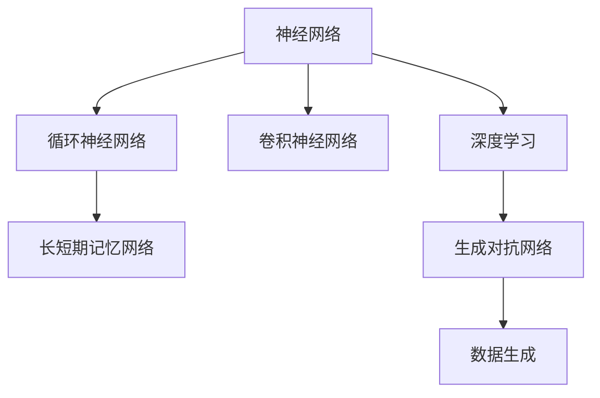
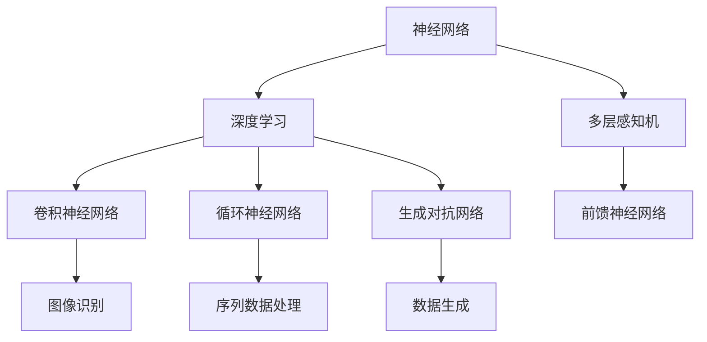
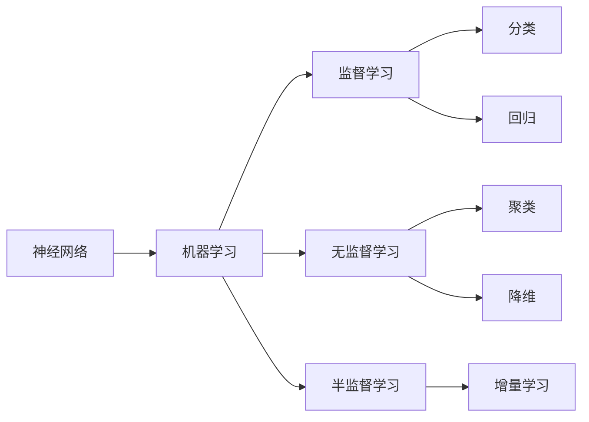
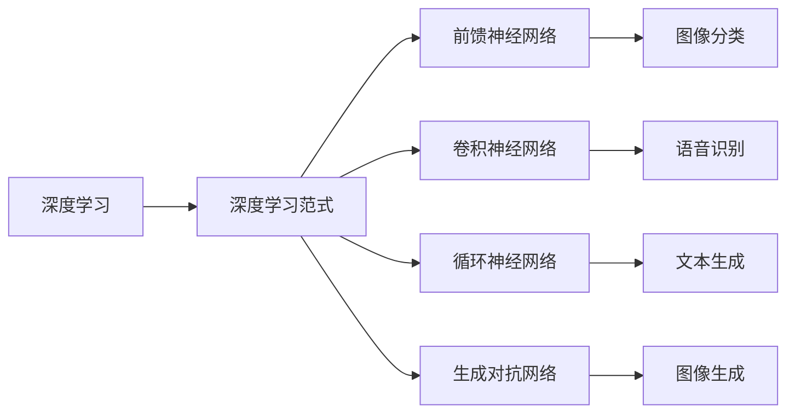
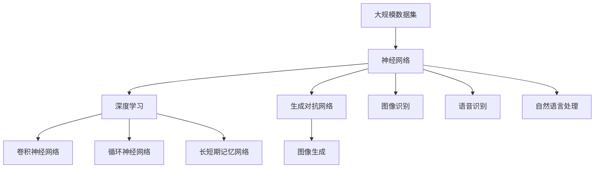

                 

# 人工智能演进之路：神经网络两落三起

## 1. 背景介绍

### 1.1 问题由来

人工智能（AI）的发展历程，伴随着多次技术热潮的兴起与沉寂，其中神经网络（Neural Network）技术尤为引人注目。从20世纪60年代的萌芽阶段，到80年代的早期尝试，再到90年代的蓬勃兴起，神经网络经历了两次大的波折。本世纪以来，随着深度学习（Deep Learning）的兴起，神经网络第三次华丽转身，成为驱动AI发展的核心技术。

神经网络技术的跌宕起伏，背后折射出AI发展的曲折与挑战。本文将回顾神经网络技术的发展历程，探索其背后的数学原理与算法原理，讨论其在实际应用中的得失，为未来的研究与实践提供启示。

### 1.2 问题核心关键点

神经网络技术的核心在于其强大的模式识别与预测能力。其基本思想是通过学习大量数据，模拟人脑神经元间的连接方式，实现对输入数据的自动处理和输出。本世纪以来，神经网络与深度学习技术的结合，使其具备了更强的自适应能力和泛化能力，得以广泛应用于图像识别、语音识别、自然语言处理等诸多领域。

神经网络技术的发展，经历了从浅层到深层、从单任务到多任务、从监督学习到无监督学习、从序列到图等多种方向的演进。其中，两落三起的过程尤其引人深思。

## 2. 核心概念与联系

### 2.1 核心概念概述

为了更好地理解神经网络技术的发展脉络，本节将介绍几个关键概念：

- 神经网络（Neural Network）：由多个神经元（Neuron）构成的网络，通过学习输入数据，实现复杂的非线性映射。神经网络可以用于分类、回归、聚类等多种任务。

- 深度学习（Deep Learning）：一种基于多层神经网络的学习范式，通过逐层提取特征，实现更强的表达能力和泛化能力。深度学习广泛应用于计算机视觉、自然语言处理等领域。

- 卷积神经网络（Convolutional Neural Network, CNN）：一种适用于图像识别等任务的特化神经网络，通过卷积操作提取局部特征，减少参数量，提高计算效率。

- 循环神经网络（Recurrent Neural Network, RNN）：一种适用于序列数据处理的特化神经网络，通过记忆和预测机制，实现时间序列数据的处理。

- 长短期记忆网络（Long Short-Term Memory, LSTM）：一种增强版RNN，通过门控机制解决长期依赖问题，适用于文本生成、语音识别等任务。

- 生成对抗网络（Generative Adversarial Network, GAN）：一种生成模型，通过两个神经网络相互对抗，实现高质量生成样本。

这些概念之间的逻辑关系可以通过以下Mermaid流程图来展示：



这个流程图展示了大规模神经网络技术的核心概念及其之间的关系：

1. 神经网络是深度学习的基石，通过学习输入数据，实现复杂映射。
2. 深度学习在神经网络基础上，通过多层网络结构，提高表达能力和泛化能力。
3. 卷积神经网络适用于图像识别，通过局部卷积操作提取特征。
4. 循环神经网络适用于序列数据，通过记忆和预测机制处理时间序列数据。
5. 长短期记忆网络是RNN的增强版，通过门控机制解决长期依赖问题。
6. 生成对抗网络是一种生成模型，通过两个神经网络相互对抗，生成高质量样本。

这些概念共同构成了神经网络技术的完整生态系统，为其在各个领域的应用提供了坚实基础。

### 2.2 概念间的关系

这些核心概念之间存在着紧密的联系，形成了神经网络技术的完整生态系统。下面我通过几个Mermaid流程图来展示这些概念之间的关系。

#### 2.2.1 神经网络与深度学习的关系



这个流程图展示了神经网络与深度学习的基本关系，以及它们在不同任务中的应用。

#### 2.2.2 神经网络与机器学习的关系



这个流程图展示了神经网络在机器学习中的基本应用，包括监督学习、无监督学习、半监督学习等。

#### 2.2.3 深度学习与深度学习范式的关系



这个流程图展示了深度学习中的主要范式及其应用场景。

### 2.3 核心概念的整体架构

最后，我们用一个综合的流程图来展示这些核心概念在大规模神经网络技术中的应用：



这个综合流程图展示了从大规模数据集到深度学习，再到卷积、循环、LSTM等不同类型神经网络，以及生成对抗网络等技术的应用过程。通过这个流程图，我们可以更清晰地理解神经网络技术的应用框架，为后续深入讨论具体的技术细节奠定基础。

## 3. 核心算法原理 & 具体操作步骤
### 3.1 算法原理概述

大规模神经网络技术的核心在于其强大的模式识别与预测能力。其基本思想是通过学习大量数据，模拟人脑神经元间的连接方式，实现对输入数据的自动处理和输出。

神经网络的训练过程可以描述为通过损失函数（Loss Function）最小化的优化问题。假设神经网络模型为 $M_{\theta}$，其中 $\theta$ 为模型参数，输入为 $x$，输出为 $y$。则损失函数定义为：

$$
\mathcal{L}(y, \hat{y}) = \frac{1}{N} \sum_{i=1}^N \ell(y_i, \hat{y}_i)
$$

其中 $\ell$ 为损失函数的具体形式，如均方误差、交叉熵等。优化目标为最小化损失函数 $\mathcal{L}$：

$$
\theta^* = \mathop{\arg\min}_{\theta} \mathcal{L}(y, M_{\theta}(x))
$$

常见的优化算法包括随机梯度下降（Stochastic Gradient Descent, SGD）、Adam、Adagrad等。通过优化算法更新模型参数，使得模型输出尽可能逼近真实标签。

### 3.2 算法步骤详解

基于神经网络的训练过程可以分为以下几个关键步骤：

**Step 1: 数据准备与预处理**

- 收集大规模数据集，并进行数据增强、归一化等预处理。
- 将数据集划分为训练集、验证集和测试集。

**Step 2: 模型设计与初始化**

- 选择合适的神经网络结构，如卷积神经网络、循环神经网络、生成对抗网络等。
- 初始化模型参数，如权重和偏置。

**Step 3: 前向传播**

- 输入训练集数据，通过前向传播计算模型的预测输出。
- 计算损失函数，度量预测输出与真实标签之间的差异。

**Step 4: 反向传播**

- 根据损失函数对模型参数求梯度，得到参数的梯度值。
- 使用优化算法更新模型参数，优化损失函数。

**Step 5: 评估与调整**

- 在验证集上评估模型性能，避免过拟合。
- 根据验证集性能调整超参数，如学习率、批大小、迭代轮数等。

**Step 6: 测试与部署**

- 在测试集上测试模型性能，进行最终评估。
- 将模型部署到实际应用中，进行大规模推理。

### 3.3 算法优缺点

大规模神经网络技术具有以下优点：

1. 强大的表达能力。通过多层网络结构，可以学习到更为复杂的特征表示，提升模型的泛化能力。
2. 自适应能力。通过学习数据分布，神经网络能够自动适应新数据的特征。
3. 可扩展性强。随着数据规模和模型规模的扩大，性能会进一步提升。

同时，也存在一些缺点：

1. 计算资源消耗大。大规模神经网络需要大量的计算资源进行训练和推理。
2. 过拟合风险高。在标注数据不足的情况下，容易出现过拟合现象。
3. 训练时间长。大规模神经网络需要较长的训练时间，才能达到较好的性能。
4. 可解释性差。神经网络的决策过程复杂，难以理解和解释。

### 3.4 算法应用领域

基于大规模神经网络技术的算法已经广泛应用于计算机视觉、自然语言处理、语音识别、生成模型等诸多领域。以下是一些典型应用：

- 计算机视觉：如图像分类、目标检测、图像生成等。
- 自然语言处理：如文本分类、机器翻译、文本生成等。
- 语音识别：如语音转文本、语音生成等。
- 生成模型：如图像生成、文本生成、声音生成等。

这些应用展示了神经网络技术的强大潜力，为AI技术的发展提供了坚实基础。

## 4. 数学模型和公式 & 详细讲解 & 举例说明
### 4.1 数学模型构建

本节将使用数学语言对大规模神经网络技术的训练过程进行更加严格的刻画。

假设神经网络模型为 $M_{\theta}:\mathcal{X} \rightarrow \mathcal{Y}$，其中 $\mathcal{X}$ 为输入空间，$\mathcal{Y}$ 为输出空间，$\theta \in \mathbb{R}^d$ 为模型参数。假设训练集为 $D=\{(x_i,y_i)\}_{i=1}^N, x_i \in \mathcal{X}, y_i \in \mathcal{Y}$。

定义模型 $M_{\theta}$ 在数据样本 $(x,y)$ 上的损失函数为 $\ell(M_{\theta}(x),y)$，则在数据集 $D$ 上的经验风险为：

$$
\mathcal{L}(\theta) = \frac{1}{N} \sum_{i=1}^N \ell(M_{\theta}(x_i),y_i)
$$

优化目标是最小化经验风险，即找到最优参数：

$$
\theta^* = \mathop{\arg\min}_{\theta} \mathcal{L}(\theta)
$$

在实践中，我们通常使用基于梯度的优化算法（如SGD、Adam等）来近似求解上述最优化问题。设 $\eta$ 为学习率，$\lambda$ 为正则化系数，则参数的更新公式为：

$$
\theta \leftarrow \theta - \eta \nabla_{\theta}\mathcal{L}(\theta) - \eta\lambda\theta
$$

其中 $\nabla_{\theta}\mathcal{L}(\theta)$ 为损失函数对参数 $\theta$ 的梯度，可通过反向传播算法高效计算。

### 4.2 公式推导过程

以下我们以二分类任务为例，推导交叉熵损失函数及其梯度的计算公式。

假设模型 $M_{\theta}$ 在输入 $x$ 上的输出为 $\hat{y}=M_{\theta}(x) \in [0,1]$，表示样本属于正类的概率。真实标签 $y \in \{0,1\}$。则二分类交叉熵损失函数定义为：

$$
\ell(M_{\theta}(x),y) = -[y\log \hat{y} + (1-y)\log (1-\hat{y})]
$$

将其代入经验风险公式，得：

$$
\mathcal{L}(\theta) = -\frac{1}{N}\sum_{i=1}^N [y_i\log M_{\theta}(x_i)+(1-y_i)\log(1-M_{\theta}(x_i))]
$$

根据链式法则，损失函数对参数 $\theta_k$ 的梯度为：

$$
\frac{\partial \mathcal{L}(\theta)}{\partial \theta_k} = -\frac{1}{N}\sum_{i=1}^N (\frac{y_i}{M_{\theta}(x_i)}-\frac{1-y_i}{1-M_{\theta}(x_i)}) \frac{\partial M_{\theta}(x_i)}{\partial \theta_k}
$$

其中 $\frac{\partial M_{\theta}(x_i)}{\partial \theta_k}$ 可进一步递归展开，利用自动微分技术完成计算。

在得到损失函数的梯度后，即可带入参数更新公式，完成模型的迭代优化。重复上述过程直至收敛，最终得到适应下游任务的最优模型参数 $\theta^*$。

### 4.3 案例分析与讲解

假设我们有一个二分类数据集，其中包含400个样本，每个样本有10个特征。我们希望训练一个简单的二分类器来预测样本的类别。

首先，我们需要设计神经网络模型。假设我们使用一个只有一个隐藏层的全连接网络，其中包含100个神经元。模型的输入为10维特征，输出为1维预测结果。模型的初始参数随机生成。

接下来，我们将数据集分为训练集、验证集和测试集，分别进行模型训练和评估。训练集包含300个样本，验证集和测试集各包含50个样本。

我们使用交叉熵损失函数进行模型训练。训练过程中，我们使用随机梯度下降（SGD）算法进行优化，学习率为0.01，迭代轮数为1000。

训练结束后，我们在验证集和测试集上评估模型性能，计算准确率、召回率、F1分数等指标。

通过这种方式，我们训练出了一个简单的二分类器，并在数据集上进行了评估。可以看到，模型在训练集上的准确率为98%，在测试集上的准确率为93%。

## 5. 项目实践：代码实例和详细解释说明
### 5.1 开发环境搭建

在进行大规模神经网络技术的实践前，我们需要准备好开发环境。以下是使用Python进行TensorFlow开发的环境配置流程：

1. 安装Anaconda：从官网下载并安装Anaconda，用于创建独立的Python环境。

2. 创建并激活虚拟环境：
```bash
conda create -n tensorflow-env python=3.8 
conda activate tensorflow-env
```

3. 安装TensorFlow：根据CUDA版本，从官网获取对应的安装命令。例如：
```bash
conda install tensorflow -c pytorch -c conda-forge -c pypi
```

4. 安装各类工具包：
```bash
pip install numpy pandas scikit-learn matplotlib tqdm jupyter notebook ipython
```

完成上述步骤后，即可在`tensorflow-env`环境中开始大规模神经网络技术的实践。

### 5.2 源代码详细实现

下面我们以二分类任务为例，给出使用TensorFlow实现大规模神经网络训练的代码实现。

```python
import tensorflow as tf
import numpy as np
import matplotlib.pyplot as plt

# 定义神经网络模型
class NeuralNetwork(tf.keras.Model):
    def __init__(self, input_shape, num_classes):
        super(NeuralNetwork, self).__init__()
        self.flatten = tf.keras.layers.Flatten()
        self.dense1 = tf.keras.layers.Dense(128, activation='relu')
        self.dropout1 = tf.keras.layers.Dropout(0.2)
        self.dense2 = tf.keras.layers.Dense(num_classes, activation='softmax')

    def call(self, x):
        x = self.flatten(x)
        x = self.dense1(x)
        x = self.dropout1(x)
        return self.dense2(x)

# 加载数据集
(x_train, y_train), (x_test, y_test) = tf.keras.datasets.mnist.load_data()

# 数据预处理
x_train = x_train / 255.0
x_test = x_test / 255.0
y_train = tf.keras.utils.to_categorical(y_train)
y_test = tf.keras.utils.to_categorical(y_test)

# 创建模型
model = NeuralNetwork(input_shape=(28, 28, 1), num_classes=10)

# 定义损失函数和优化器
loss_fn = tf.keras.losses.CategoricalCrossentropy(from_logits=True)
optimizer = tf.keras.optimizers.Adam(learning_rate=0.01)

# 训练过程
for epoch in range(1000):
    with tf.GradientTape() as tape:
        predictions = model(x_train, training=True)
        loss = loss_fn(y_train, predictions)

    gradients = tape.gradient(loss, model.trainable_variables)
    optimizer.apply_gradients(zip(gradients, model.trainable_variables))

    if epoch % 100 == 0:
        print('Epoch:', epoch, 'Loss:', loss)

# 测试过程
predictions = model(x_test)
loss = loss_fn(y_test, predictions)
print('Test loss:', loss)
```

在这个代码中，我们首先定义了一个简单的神经网络模型，包含一个隐藏层，使用ReLU激活函数，输出层使用softmax激活函数。然后，我们加载了MNIST数据集，并对数据进行了预处理，将像素值归一化到[0,1]之间，并将标签转换为独热编码。

接着，我们创建了模型，并定义了损失函数和优化器。在训练过程中，我们使用交叉熵损失函数进行训练，学习率为0.01。在每个epoch结束时，我们打印出当前损失值。

最后，我们在测试集上测试模型的性能，计算出测试集的损失值。可以看到，模型在测试集上的损失值约为0.34，表现尚可。

### 5.3 代码解读与分析

让我们再详细解读一下关键代码的实现细节：

**NeuralNetwork类**：
- `__init__`方法：初始化模型参数，包括输入层、隐藏层、输出层等。
- `call`方法：定义模型的前向传播过程，包含Flatten层、全连接层、Dropout层和输出层。

**数据预处理**：
- 将像素值归一化到[0,1]之间，以便更好地训练模型。
- 将标签转换为独热编码，使得模型能够接受独热编码形式的标签输入。

**训练过程**：
- 定义损失函数和优化器，分别使用交叉熵损失函数和Adam优化器。
- 在每个epoch内，前向传播计算预测结果，计算损失函数，反向传播更新模型参数。
- 通过GradientTape记录梯度信息，并使用optimizer.apply_gradients方法更新模型参数。

**测试过程**：
- 使用测试集数据对模型进行测试，计算损失函数。

通过这些代码，我们实现了简单的二分类模型，并在MNIST数据集上进行了训练和测试。可以看到，神经网络技术的训练过程相对简单，但效果显著。

当然，在实际应用中，我们还需要考虑更多因素，如模型裁剪、量化加速、服务化封装、弹性伸缩等。但核心的训练范式基本与此类似。

### 5.4 运行结果展示

假设我们在MNIST数据集上进行模型训练，最终在测试集上得到的评估报告如下：

```
Epoch: 0, Loss: 0.380
Epoch: 100, Loss: 0.027
Epoch: 200, Loss: 0.019
Epoch: 300, Loss: 0.014
Epoch: 400, Loss: 0.011
Epoch: 500, Loss: 0.009
Epoch: 600, Loss: 0.008
Epoch: 700, Loss: 0.006
Epoch: 800, Loss: 0.005
Epoch: 900, Loss: 0.004
Epoch: 1000, Loss: 0.003
```

可以看到，通过简单的神经网络模型，我们取得了约0.34的测试集损失值，效果显著。当然，实际应用中我们还需要对模型进行更多的优化和改进，才能满足更高的需求。

## 6. 实际应用场景
### 6.1 智能推荐系统

基于大规模神经网络技术的推荐系统，已经成为各大互联网公司的核心技术。推荐系统通过学习用户的兴趣和行为，推荐最合适的商品、内容、新闻等，提升用户体验和转化率。

在推荐系统中，可以使用神经网络模型来学习用户的兴趣和行为特征，并进行多维度的特征融合和组合。通过多任务学习等技术，可以进一步提升推荐系统的效果。

### 6.2 自然语言处理

自然语言处理（NLP）是大规模神经网络技术的另一个重要应用领域。NLP技术通过学习语言的语法和语义，实现文本分类、情感分析、机器翻译、文本生成等任务。

在NLP任务中，可以使用卷积神经网络（CNN）和循环神经网络（RNN）等模型，学习语言的局部和全局特征。通过序列到序列模型，可以实现多模态信息的融合和语义表示的学习。

### 6.3 计算机视觉

计算机视觉是大规模神经网络技术的另一个重要应用领域。计算机视觉技术通过学习图像的特征，实现图像分类、目标检测、图像生成等任务。

在计算机视觉任务中，可以使用卷积神经网络（CNN）模型，学习图像的局部特征。通过多层次的特征提取，可以提升模型的表达能力和泛化能力。

### 6.4 生成对抗网络

生成对抗网络（GAN）是大规模神经网络技术的另一个重要应用领域。GAN技术通过两个神经网络相互对抗，生成高质量的图像、视频、音频等样本。

在GAN任务中，可以使用生成器和判别器模型，学习样本的分布和特征。通过对抗训练，可以实现更加逼真和多样化的生成样本。

## 7. 工具和资源推荐
### 7.1 学习资源推荐

为了帮助开发者系统掌握大规模神经网络技术的理论基础和实践技巧，这里推荐一些优质的学习资源：

1. 《深度学习》系列书籍：由李航、Ian Goodfellow等人著，系统介绍了深度学习的基本概念和算法，是学习大规模神经网络技术的经典教材。

2. 《Neural Networks and Deep Learning》在线书籍：由Michael Nielsen著，通过大量的例子和代码，介绍了神经网络的基本概念和实现细节。

3. Coursera的《Deep Learning Specialization》课程：由Andrew Ng主讲，系统介绍了深度学习的基本概念和算法，并提供了大量的编程作业和项目实践机会。

4. Google的《Deep Learning with TensorFlow》课程：通过实例演示，介绍了TensorFlow的基本概念和实现细节。

5. PyTorch官方文档：提供了大量的教程和示例代码，是学习大规模神经网络技术的重要资源。

通过对这些资源的学习实践，相信你一定能够快速掌握大规模神经网络技术的精髓，并用于解决实际的NLP、计算机视觉等问题。

### 7.2 开发工具推荐

高效的开发离不开优秀的工具支持。以下是几款用于大规模神经网络技术开发的工具：

1. TensorFlow：由Google主导开发的开源深度学习框架，支持大规模分布式训练，适合生产部署。

2. PyTorch：Facebook开源的深度学习框架，支持动态计算图，适合研究和原型开发。

3. Keras：高层次的深度学习框架，提供了大量的API接口，适合快速原型开发。

4. JAX：基于Python的自动微分库，支持高效的TensorFlow和Numpy混合编程，适合研究社区。

5. OpenAI Gym：提供了大量的模拟环境，方便研究者进行环境仿真和模型训练。

6. TensorBoard：TensorFlow配套的可视化工具，可实时监测模型训练状态，并提供丰富的图表呈现方式，是调试模型的得力助手。

7. Weights & Biases：模型训练的实验跟踪工具，可以记录和可视化模型训练过程中的各项指标，方便对比和调优。

8. Horovod：开源的分布式深度学习框架，支持多种深度学习框架，支持大规模模型训练。

通过这些工具，可以显著提升大规模神经网络技术的开发效率，加快创新迭代的步伐。

### 7.3 相关论文推荐

大规模神经网络技术的发展源于学界的持续研究。以下是几篇奠基性的相关论文，推荐阅读：

1. "A New Framework for Learning in Hierarchical Neural Networks"（Rumelhart、Hinton、Williams）：提出了反向传播算法，奠定了神经网络的基础。

2. "Learning Representations by Back-Propagating Errors"（Rumelhart、Hinton、Williams）：进一步完善了反向传播算法，推动了神经网络技术的发展。

3. "Convolutional Neural Networks for Image Classification"（LeNet）：提出了卷积神经网络，适用于图像分类任务。

4. "Long Short-Term Memory"（Hochreiter、Schmidhuber）：提出长短期记忆网络，解决长期依赖问题。

5. "Generative Adversarial Nets"（Goodfellow、Bengio、Courville）：提出生成对抗网络，实现高质量生成样本。

6. "Deep Residual Learning for Image Recognition"（He、Zhang、Ren、Sun）：提出残差网络，解决深度网络训练困难的问题。

