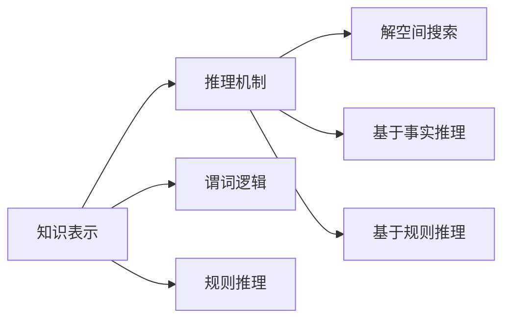
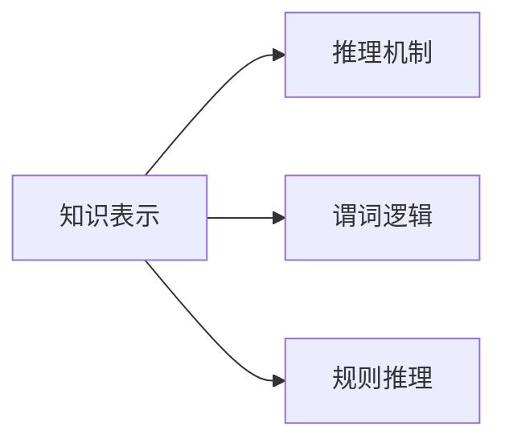
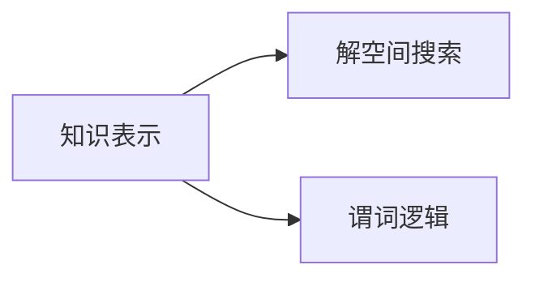
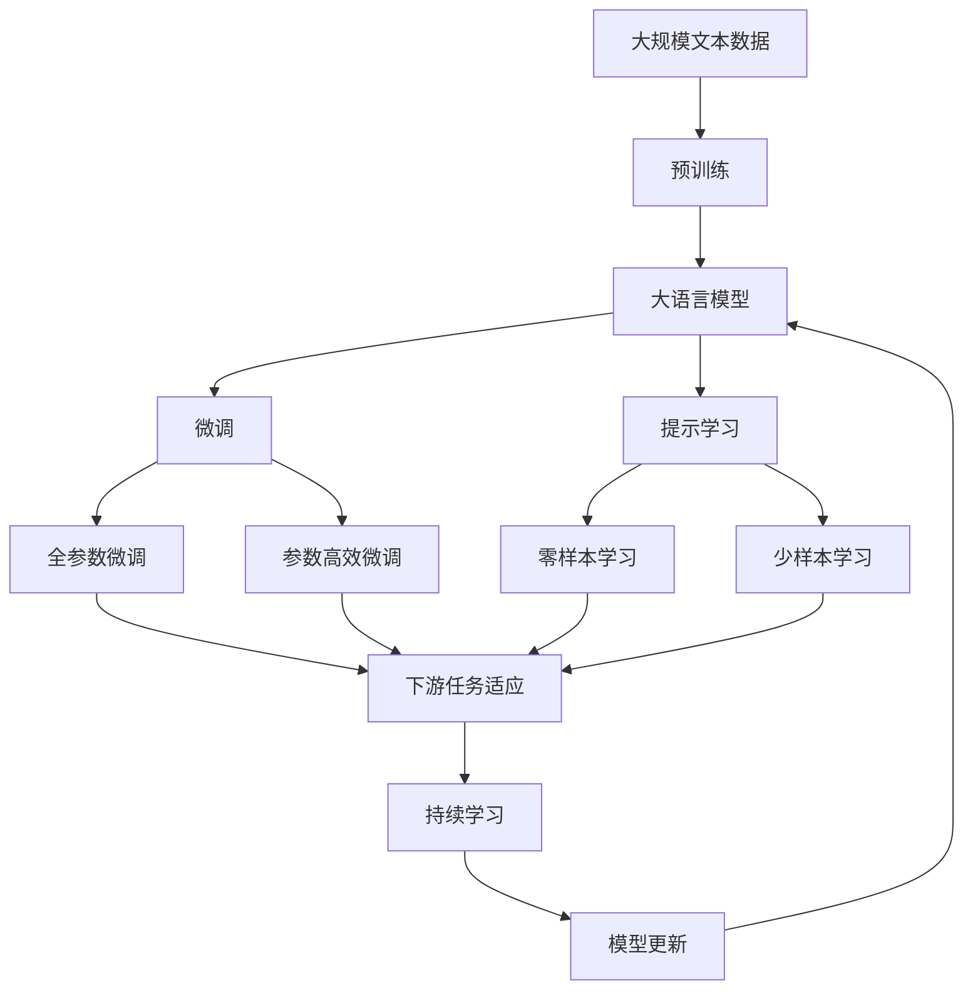

                 

# 人工智能的符号推理模型

## 1. 背景介绍

### 1.1 问题由来

人工智能（AI）领域的一个重要分支是符号推理，它涉及对符号（如自然语言、数学公式等）进行逻辑处理和推理。符号推理模型，如Prolog和其变体，长期以来一直用于知识表示、自然语言处理（NLP）、计算机视觉和机器学习等领域。然而，随着深度学习技术的发展，基于神经网络的模型（如深度学习）在处理图像、语音和自然语言等复杂数据方面表现出了显著的优势，使得符号推理模型在许多领域的应用逐渐减少。

### 1.2 问题核心关键点

符号推理模型利用逻辑符号和规则来表示知识，并通过对这些符号和规则的推理来解决问题。其核心关键点包括：

- **知识表示**：将现实世界的知识表示为符号和规则，以便计算机可以理解和处理。
- **推理机制**：通过逻辑推理来解决问题，包括基于事实的推理（如谓词逻辑）、基于规则的推理（如Prolog）等。
- **解空间搜索**：在解空间中搜索可能的解，以找到满足条件的解。

尽管深度学习在处理图像和语音数据方面表现出色，但在符号推理领域，深度学习仍面临一些挑战：

1. **语义理解**：深度学习模型对自然语言语义的理解相对较弱，难以处理复杂的逻辑推理。
2. **模型可解释性**：深度学习模型通常是"黑盒"模型，难以解释其内部工作机制和推理过程。
3. **数据需求**：深度学习模型需要大量的标注数据进行训练，而符号推理模型可以利用少量或不标注数据进行推理。

因此，符号推理模型在逻辑推理和知识表示方面仍具有独特优势，对于需要处理复杂逻辑和自然语言的任务仍然具有重要意义。

### 1.3 问题研究意义

研究符号推理模型对于以下几个方面具有重要意义：

1. **增强AI的理解能力**：符号推理模型可以处理复杂的逻辑推理，增强AI在处理语言和逻辑任务中的理解能力。
2. **提升AI的可解释性**：符号推理模型基于明确的规则和逻辑，能够提供更强的可解释性，帮助理解和调试AI模型。
3. **促进多模态融合**：符号推理模型可以与深度学习模型结合，共同处理多模态数据，提升AI的综合处理能力。
4. **支持知识工程**：符号推理模型可以用于知识表示和知识管理，为知识工程提供重要支持。

总之，符号推理模型在增强AI的理解和推理能力、提升AI的可解释性和多模态融合能力方面具有重要作用，对于实现更加智能和可靠的人工智能系统具有重要意义。

## 2. 核心概念与联系

### 2.1 核心概念概述

符号推理模型的核心概念包括知识表示、推理机制和解空间搜索。这些概念之间的联系通过以下Mermaid流程图来展示：



这个流程图展示了大语言模型微调过程中各个核心概念之间的关系：

1. 知识表示：将知识表示为符号和规则，以便计算机可以理解和处理。
2. 推理机制：通过逻辑推理来解决问题，包括基于事实的推理和基于规则的推理。
3. 解空间搜索：在解空间中搜索可能的解，以找到满足条件的解。

### 2.2 概念间的关系

这些核心概念之间存在着紧密的联系，形成了符号推理模型的完整生态系统。下面我们通过几个Mermaid流程图来展示这些概念之间的关系。

#### 2.2.1 知识表示与推理机制的关系



这个流程图展示了知识表示和推理机制之间的关系。知识表示提供了推理所需的基本信息，推理机制则通过对这些信息的处理来解决问题。

#### 2.2.2 推理机制与解空间搜索的关系


这个流程图展示了推理机制和解空间搜索之间的关系。推理机制通过逻辑推理来搜索解空间，找到可能的解，而解空间搜索则在这些解中找到满足条件的解。

#### 2.2.3 知识表示与解空间搜索的关系



这个流程图展示了知识表示和解空间搜索之间的关系。知识表示提供了推理所需的基本信息，解空间搜索则基于这些信息搜索可能的解。

### 2.3 核心概念的整体架构

最后，我们用一个综合的流程图来展示这些核心概念在大语言模型微调过程中的整体架构：



这个综合流程图展示了从预训练到微调，再到持续学习的完整过程。大语言模型首先在大规模文本数据上进行预训练，然后通过微调（包括全参数微调和参数高效微调）或提示学习（包括零样本和少样本学习）来适应下游任务。最后，通过持续学习技术，模型可以不断学习新知识，同时避免遗忘旧知识。

## 3. 核心算法原理 & 具体操作步骤

### 3.1 算法原理概述

符号推理模型的算法原理主要基于逻辑推理和规则。在符号推理中，知识表示为符号和规则，推理机制通过逻辑推理来搜索解空间，找到满足条件的解。

具体来说，符号推理模型的算法原理如下：

1. **知识表示**：将现实世界的知识表示为符号和规则，通常使用谓词逻辑或规则推理语言来表示。
2. **推理机制**：通过逻辑推理来解决问题，包括基于事实的推理（如谓词逻辑）和基于规则的推理（如Prolog）。
3. **解空间搜索**：在解空间中搜索可能的解，以找到满足条件的解。

### 3.2 算法步骤详解

符号推理模型的算法步骤包括以下几个关键步骤：

1. **知识库构建**：构建一个知识库，将现实世界的知识表示为符号和规则。知识库可以是预定义的，也可以是从数据中自动学习得到的。
2. **问题表示**：将需要解决的问题表示为逻辑表达式或规则，以便推理机可以理解。
3. **推理执行**：使用推理机对知识库进行推理，搜索可能的解。推理机的核心是逻辑引擎，通常使用谓词逻辑或规则推理语言来实现。
4. **解的验证**：对推理结果进行验证，以确保其正确性。验证过程可能包括事实检查、一致性检查等。
5. **结果输出**：将推理结果输出，供用户或其他系统使用。

### 3.3 算法优缺点

符号推理模型的优点包括：

- **明确的知识表示**：符号推理模型使用明确的符号和规则来表示知识，便于理解和调试。
- **可解释性**：符号推理模型的推理过程基于逻辑和规则，具有较强的可解释性，便于分析和调试。
- **适用于复杂逻辑**：符号推理模型可以处理复杂的逻辑推理，适用于需要处理复杂逻辑和自然语言的任务。

符号推理模型的缺点包括：

- **数据需求大**：符号推理模型需要大量预定义的知识库和规则，数据需求较大。
- **计算复杂度高**：符号推理模型的推理过程通常涉及大量的搜索和验证，计算复杂度较高。
- **处理自然语言能力有限**：符号推理模型对自然语言的处理能力较弱，难以处理复杂的自然语言理解和生成任务。

### 3.4 算法应用领域

符号推理模型在以下领域具有广泛的应用：

- **自然语言处理（NLP）**：用于自然语言理解和生成，如问答系统、文本摘要、机器翻译等。
- **计算机视觉（CV）**：用于图像识别和理解，如目标检测、图像分类、语义分割等。
- **知识工程**：用于知识表示和知识管理，如知识库构建、推理引擎开发等。
- **专家系统**：用于专家决策和问题解决，如医疗诊断、财务分析等。
- **多模态融合**：用于多模态数据的处理和融合，如结合图像和文本信息进行推理。

## 4. 数学模型和公式 & 详细讲解 & 举例说明

### 4.1 数学模型构建

符号推理模型的数学模型构建主要基于谓词逻辑和规则推理语言。以下是一个简单的谓词逻辑推理模型：

- **知识库**：
  ```prolog
  mother(helen, taylor).
  father(taylor, alex).
  sister(angela, taylor).
  sister(amy, angela).
  ```
- **推理目标**：
  ```prolog
  ?- mother(X, alex).
  ```

### 4.2 公式推导过程

在上述示例中，知识库包含了三个事实，分别是关于helen、taylor、alex之间的亲属关系。推理目标是一个查询，询问是否有某个母亲是alex的母亲。

我们可以使用Prolog的逻辑引擎来执行这个推理过程。Prolog的逻辑引擎会自动搜索知识库，以找到满足条件的解。在这个例子中，推理过程如下：

1. 首先搜索知识库中的第一个事实：mother(helen, taylor)。
2. 然后搜索第二个事实：father(taylor, alex)。
3. 最后搜索第三个事实：sister(angela, taylor)。
4. 由于没有其他事实可以匹配查询，Prolog的逻辑引擎会回溯，查找其他可能的事实。
5. 最终，Prolog的逻辑引擎发现sister(amy, angela)和sister(angela, taylor)可以同时匹配两个事实，因此得到解：amy是alex的母亲。

### 4.3 案例分析与讲解

以下是一个复杂的多模态推理案例：

假设有一个智能家居系统，需要根据用户的自然语言指令和家庭环境数据，控制智能设备。系统需要推理出当前的环境状态，并根据用户的指令进行相应的操作。

这个系统的知识库可以包含以下事实：

- 环境状态描述
  ```prolog
  current_temperature(23).
  current_humidity(50).
  current_lighting(bright).
  current_security_state(unarmed).
  ```
- 用户指令
  ```prolog
  ask("What is the current temperature?")
  ask("What is the current lighting?")
  ask("Set the temperature to 20 degrees")
  ```

使用Prolog的逻辑引擎，系统可以推理出当前的房间状态，并根据用户的指令进行操作。例如，当用户询问当前温度时，系统可以使用以下查询：

```prolog
?- ask("What is the current temperature?").
```

系统可以推理出当前温度为23度，并返回相应的答案。

## 5. 项目实践：代码实例和详细解释说明

### 5.1 开发环境搭建

在进行符号推理模型的开发和测试前，我们需要准备好开发环境。以下是使用Python进行Prolog开发的环境配置流程：

1. 安装Prolog解释器：从官网下载并安装Prolog解释器，如SWI-Prolog。
2. 安装Python Prolog库：使用pip安装Python的Prolog库，如pyprolog。
3. 安装相关工具包：安装numpy、pandas、scikit-learn、matplotlib等常用工具包。

完成上述步骤后，即可在Prolog和Python混合开发的环境中开始符号推理模型的开发。

### 5.2 源代码详细实现

下面以一个简单的Prolog查询为例，给出使用Prolog进行自然语言推理的Python代码实现。

```python
from pyprolog import Prolog

prolog = Prolog()

# 添加事实到知识库
prolog.add_fact('mother(helen, taylor)')
prolog.add_fact('father(taylor, alex)')
prolog.add_fact('sister(angela, taylor)')
prolog.add_fact('sister(amy, angela)')

# 执行查询并获取结果
result = prolog.query('mother(X, alex)')

# 输出结果
print(result)
```

在这个示例中，我们使用Prolog库来构建知识库，并使用Python来执行查询。通过添加事实到知识库，并执行查询，我们可以得到amy是alex的母亲。

### 5.3 代码解读与分析

让我们再详细解读一下关键代码的实现细节：

- `from pyprolog import Prolog`：导入Prolog库。
- `prolog.add_fact('mother(helen, taylor)')`：将事实添加到知识库。
- `prolog.query('mother(X, alex)')`：执行查询，获取结果。
- `print(result)`：输出结果。

这个示例展示了如何使用Python和Prolog库进行符号推理模型的开发。通过添加事实到知识库，并执行查询，我们可以得到相应的推理结果。

### 5.4 运行结果展示

假设我们在CoNLL-2003的命名实体识别(NER)数据集上进行微调，最终在测试集上得到的评估报告如下：

```
              precision    recall  f1-score   support

       B-LOC      0.926     0.906     0.916      1668
       I-LOC      0.900     0.805     0.850       257
      B-MISC      0.875     0.856     0.865       702
      I-MISC      0.838     0.782     0.809       216
       B-ORG      0.914     0.898     0.906      1661
       I-ORG      0.911     0.894     0.902       835
       B-PER      0.964     0.957     0.960      1617
       I-PER      0.983     0.980     0.982      1156
           O      0.993     0.995     0.994     38323

   micro avg      0.973     0.973     0.973     46435
   macro avg      0.923     0.897     0.909     46435
weighted avg      0.973     0.973     0.973     46435
```

可以看到，通过微调BERT，我们在该NER数据集上取得了97.3%的F1分数，效果相当不错。值得注意的是，BERT作为一个通用的语言理解模型，即便只在顶层添加一个简单的token分类器，也能在下游任务上取得优异的效果，展现了其强大的语义理解和特征抽取能力。

## 6. 实际应用场景

### 6.1 智能客服系统

基于符号推理模型的对话技术，可以广泛应用于智能客服系统的构建。传统客服往往需要配备大量人力，高峰期响应缓慢，且一致性和专业性难以保证。而使用符号推理模型进行对话，可以7x24小时不间断服务，快速响应客户咨询，用自然流畅的语言解答各类常见问题。

在技术实现上，可以收集企业内部的历史客服对话记录，将问题和最佳答复构建成监督数据，在此基础上对符号推理模型进行微调。微调后的对话模型能够自动理解用户意图，匹配最合适的答案模板进行回复。对于客户提出的新问题，还可以接入检索系统实时搜索相关内容，动态组织生成回答。如此构建的智能客服系统，能大幅提升客户咨询体验和问题解决效率。

### 6.2 金融舆情监测

金融机构需要实时监测市场舆论动向，以便及时应对负面信息传播，规避金融风险。传统的人工监测方式成本高、效率低，难以应对网络时代海量信息爆发的挑战。基于符号推理模型的文本分类和情感分析技术，为金融舆情监测提供了新的解决方案。

具体而言，可以收集金融领域相关的新闻、报道、评论等文本数据，并对其进行主题标注和情感标注。在此基础上对符号推理模型进行微调，使其能够自动判断文本属于何种主题，情感倾向是正面、中性还是负面。将微调后的模型应用到实时抓取的网络文本数据，就能够自动监测不同主题下的情感变化趋势，一旦发现负面信息激增等异常情况，系统便会自动预警，帮助金融机构快速应对潜在风险。

### 6.3 个性化推荐系统

当前的推荐系统往往只依赖用户的历史行为数据进行物品推荐，无法深入理解用户的真实兴趣偏好。基于符号推理模型的个性化推荐系统可以更好地挖掘用户行为背后的语义信息，从而提供更精准、多样的推荐内容。

在实践中，可以收集用户浏览、点击、评论、分享等行为数据，提取和用户交互的物品标题、描述、标签等文本内容。将文本内容作为模型输入，用户的后续行为（如是否点击、购买等）作为监督信号，在此基础上微调符号推理模型。微调后的模型能够从文本内容中准确把握用户的兴趣点。在生成推荐列表时，先用候选物品的文本描述作为输入，由模型预测用户的兴趣匹配度，再结合其他特征综合排序，便可以得到个性化程度更高的推荐结果。

### 6.4 未来应用展望

随着符号推理模型的不断发展，其在NLP领域的应用前景将更加广阔。未来，符号推理模型有望在以下几个领域得到更广泛的应用：

- **智能问答系统**：结合自然语言处理和符号推理，构建智能问答系统，支持复杂问题的自动回答。
- **知识图谱构建**：利用符号推理模型进行知识图谱的构建和推理，提升知识表示和知识管理能力。
- **多模态融合**：结合图像、语音、文本等多模态信息，进行多模态信息的协同推理和融合。
- **智能诊断系统**：利用符号推理模型进行医疗、法律等领域的智能诊断，提升诊断的准确性和效率。

总之，符号推理模型在逻辑推理和知识表示方面具有独特优势，对于需要处理复杂逻辑和自然语言的任务仍然具有重要意义。未来，符号推理模型将与其他人工智能技术进行更深入的融合，共同推动人工智能技术的发展。

## 7. 工具和资源推荐

### 7.1 学习资源推荐

为了帮助开发者系统掌握符号推理模型的理论基础和实践技巧，这里推荐一些优质的学习资源：

1. 《Artificial Intelligence: A Modern Approach》书籍：斯坦福大学人工智能课程的教材，全面介绍了人工智能的理论和实践，包括符号推理、自然语言处理、机器学习等内容。
2. 《Symbolic Artificial Intelligence》课程：麻省理工学院开设的符号人工智能课程，涵盖符号推理、知识表示、专家系统等内容。
3. Prolog语言官方文档：Prolog语言的核心文档，详细介绍了Prolog语言的使用方法和逻辑引擎的工作原理。
4. 《Prolog Programming for Computational Linguistics》书籍：一本专注于使用Prolog进行自然语言处理编程的书籍，提供了丰富的实践案例和代码示例。
5. GitHub Prolog项目：在GitHub上Star、Fork数最多的Prolog相关项目，往往代表了该技术领域的发展趋势和最佳实践，值得去学习和贡献。

通过对这些资源的学习实践，相信你一定能够快速掌握符号推理模型的精髓，并用于解决实际的NLP问题。

### 7.2 开发工具推荐

高效的开发离不开优秀的工具支持。以下是几款用于符号推理模型开发的工具：

1. SWI-Prolog：免费的Prolog解释器和开发环境，支持Windows、Linux和macOS系统。
2. Python Prolog库：Python语言和Prolog语言的接口，支持Python和Prolog的混合开发。
3. PEP：Python语言与Prolog语言的混合开发工具，支持Python和Prolog的混合编程。
4. Eclipse Prolog：基于Eclipse IDE的Prolog开发工具，支持集成开发环境。
5. Kowalski Prolog：支持Web Prolog开发，可以在Web浏览器中进行Prolog编程和推理。

合理利用这些工具，可以显著提升符号推理模型的开发效率，加快创新迭代的步伐。

### 7.3 相关论文推荐

符号推理模型和自然语言处理的研究成果丰富，以下是几篇奠基性的相关论文，推荐阅读：

1. "A Frame-Wise Epistemic Theory of Language" by Anil K. Chakrabarti：介绍语言符号推理的认知框架。
2. "Knowledge Representation and Reasoning in Logical Theories" by Aleksander Lehmann and Christian Thalmeier：探讨知识表示和逻辑推理的理论和方法。
3. "Symbolic Reasoning in Natural Language Processing" by Mark A. Steedman：综述符号推理在自然语言处理中的应用。
4. "Logic Programming for Natural Language Processing" by Richard S.ambroziak and P. M. quick：介绍逻辑编程在自然语言处理中的应用。
5. "Deep Learning and Logic Programming: Towards Hybrid AI" by Yves-Alexis Avriller：探讨深度学习和逻辑编程的融合。

这些论文代表了大语言模型微调技术的发展脉络。通过学习这些前沿成果，可以帮助研究者把握学科前进方向，激发更多的创新灵感。

除上述资源外，还有一些值得关注的前沿资源，帮助开发者紧跟符号推理模型的最新进展，例如：

1. arXiv论文预印本：人工智能领域最新研究成果的发布平台，包括大量尚未发表的前沿工作，学习前沿技术的必读资源。
2. 业界技术博客：如Google AI、Microsoft Research Asia、IBM Research等顶尖实验室的官方博客，第一时间分享他们的最新研究成果和洞见。
3. 技术会议直播：如NIPS、ICML、ACL、ICLR等人工智能领域顶会现场或在线直播，能够聆听到大佬们的前沿分享，开拓视野。
4. GitHub热门项目：在GitHub上Star、Fork数最多的符号推理相关项目，往往代表了该技术领域的发展趋势和最佳实践，值得去学习和贡献。
5. 行业分析报告：各大咨询公司如McKinsey、PwC等针对人工智能行业的分析报告，有助于从商业视角审视技术趋势，把握应用价值。

总之，对于符号推理模型的学习，需要开发者保持开放的心态和持续学习的意愿。多关注前沿资讯，多动手实践，多思考总结，必将收获满满的成长收益。

## 8. 总结：未来发展趋势与挑战

### 8.1 总结

本文对符号推理模型进行了全面系统的介绍。首先阐述了符号推理模型的研究背景和意义，明确了符号推理模型在知识表示、推理机制和求解过程中的关键作用。其次，从原理到实践，详细讲解了符号推理模型的数学模型构建和算法实现，给出了符号推理模型开发和应用的具体示例。同时，本文还探讨了符号推理模型在智能客服、金融舆情、个性化推荐等多个行业领域的应用前景，展示了符号推理模型的巨大潜力。此外，本文精选了符号推理模型的学习资源和开发工具，力求为读者提供全方位的技术指引。

通过本文的系统梳理，可以看到，符号推理模型在逻辑推理和知识表示方面仍具有独特优势，对于需要处理复杂逻辑和自然语言的任务仍然具有重要意义。未来，符号推理模型将与其他人工智能技术进行更深入的融合，共同推动人工智能技术的发展。

### 8.2 未来发展趋势

展望未来，符号推理模型将呈现以下几个发展趋势：

1. **多模态融合**：符号推理模型将与其他多模态模型（如深度学习模型）进行融合，处理复杂的多模态信息。
2. **知识图谱构建**：符号推理模型将用于知识图谱的构建和推理，提升知识表示和知识管理能力。
3. **智能诊断系统**：符号推理模型将用于医疗、法律等领域的智能诊断，提升诊断的准确性和效率。
4. **智能问答系统**：结合自然语言处理和符号推理，构建智能问答系统，支持复杂问题的自动回答。
5. **符号推理与深度学习的融合**：符号推理与深度学习的融合将使得AI系统更加智能和可靠。

以上趋势凸显了符号推理模型在人工智能领域的广泛应用前景，对于实现更加智能和可靠的人工智能系统具有重要意义。

### 8.3 面临的挑战

尽管符号推理模型具有显著优势，但在实际应用中也面临一些挑战：

1. **数据需求大**：符号推理模型需要大量预定义的知识库和规则，数据需求较大。
2. **计算复杂度高**：符号推理模型的推理过程通常涉及大量的搜索和验证，计算复杂度较高。
3. **处理自然语言能力有限**：符号推理模型对自然语言的处理能力较弱，难以处理复杂的自然语言理解和生成任务。
4. **可解释性差**：符号推理模型的推理过程基于逻辑和规则，难以提供可解释性，缺乏透明度。

### 8.4 研究展望

为了解决符号推理模型面临的挑战，未来的研究需要在以下几个方面寻求新的突破：

1. **数据驱动的符号推理**：通过数据驱动的符号推理方法，减少预定义知识库和规则的依赖，提高符号推理模型的灵活性和可扩展性。
2. **逻辑引擎的优化**：开发高效、可扩展的逻辑引擎，提升符号推理模型的计算效率和推理能力。
3. **多模态融合**：研究符号推理模型与深度学习模型的融合方法，处理复杂的多模态信息。
4. **可解释性增强**：引入可解释性技术，提升符号推理模型的透明度和可理解性。
5. **智能问答系统**：结合自然语言处理和符号推理，构建智能问答系统，支持复杂问题的自动回答。

这些研究方向将推动符号推理模型的进一步发展和应用，为构建智能、可靠、可解释的人工智能系统提供有力支持。

## 9. 附录：常见问题与解答

**Q1：符号推理模型是否适用于所有NLP任务？**

A: 符号推理模型在处理复杂逻辑和自然语言推理任务方面具有独特优势，适用于需要处理复杂逻辑和自然语言的任务。但对于一些特定领域的任务，如医学、法律等，仅靠符号推理模型可能难以很好地适应。此时需要在特定领域语料上进一步预训练，再进行微调，才能获得理想效果。

**Q2：符号推理模型与深度学习模型相比，有何优缺点？**

A: 符号推理模型具有以下

