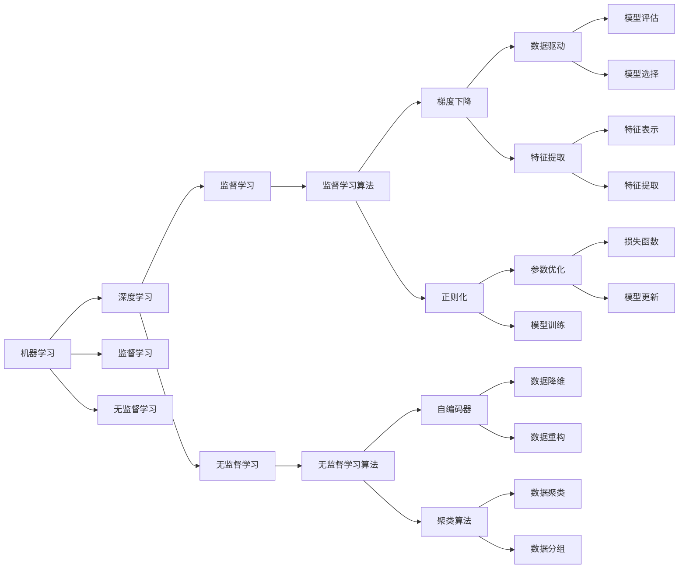

                 

# 人工智能研究的七大领域

> 关键词：人工智能，深度学习，机器学习，计算机视觉，自然语言处理，机器人，增强学习

## 1. 背景介绍

### 1.1 问题由来

人工智能（Artificial Intelligence, AI）是计算机科学的一个分支，旨在创建能够模拟人类智能行为的系统。自20世纪50年代以来，AI领域经历了多次研究热潮与低谷，但随着深度学习、计算机视觉和自然语言处理等技术的发展，AI再次成为了科技和产业界的热门话题。

现代AI研究的核心任务包括知识表示、推理、学习、自然语言理解与生成、计算机视觉、机器人学、增强学习等多个方向。本文将分别介绍这些领域的核心概念、技术进展和未来趋势，为读者提供一个全面的视角。

## 2. 核心概念与联系

### 2.1 核心概念概述

为了更好地理解人工智能研究的七大领域，我们将介绍以下几个核心概念：

- **人工智能（AI）**：指通过计算机软件实现人类智能行为的广义技术，包括感知、学习、推理和规划等。
- **机器学习（Machine Learning, ML）**：指通过数据驱动的算法，让计算机自动学习和改进的学科。
- **深度学习（Deep Learning, DL）**：一种特殊的机器学习方法，通过多层次神经网络结构模拟人脑神经系统，以实现对大规模数据集的高级抽象。
- **计算机视觉（Computer Vision, CV）**：指通过计算机理解图像和视频中包含的信息，实现目标检测、图像识别、图像生成等功能。
- **自然语言处理（Natural Language Processing, NLP）**：指使计算机能够理解和生成人类语言的技术，包括语言理解、文本生成、语音识别和翻译等。
- **机器人学（Robotics）**：研究设计和实现能够自主执行任务的智能机器人的学科，包括机器人感知、决策和控制等。
- **增强学习（Reinforcement Learning, RL）**：一种通过与环境互动进行学习的AI技术，用于优化决策和策略。

这些概念之间的联系可以通过以下Mermaid流程图来展示：

```mermaid
graph TB
    A[人工智能] --> B[机器学习]
    A --> C[深度学习]
    B --> D[监督学习]
    B --> E[无监督学习]
    C --> F[前馈神经网络]
    C --> G[卷积神经网络]
    C --> H[循环神经网络]
    D --> I[监督学习范式]
    D --> J[有监督学习]
    D --> K[监督学习算法]
    E --> L[无监督学习范式]
    E --> M[自编码器]
    E --> N[聚类算法]
    F --> O[图像分类]
    G --> P[目标检测]
    H --> Q[语言模型]
    I --> R[模型训练]
    I --> S[模型评估]
    J --> T[监督数据]
    K --> U[梯度下降]
    K --> V[正则化]
    L --> W[非标注数据]
    M --> X[数据降维]
    N --> Y[数据聚类]
    O --> Z[图像分类]
    P --> [] "目标检测"
    Q --> [] "语言模型"
    R --> [] "模型训练"
    S --> [] "模型评估"
    T --> [] "监督数据"
    U --> [] "梯度下降"
    U --> [] "正则化"
    V --> [] "正则化"
    W --> [] "非标注数据"
    X --> [] "数据降维"
    Y --> [] "数据聚类"
    Z --> [] "图像分类"
```

### 2.2 概念间的关系

这些核心概念之间存在着紧密的联系，形成了AI研究的完整生态系统。下面我们通过几个Mermaid流程图来展示这些概念之间的关系：

#### 2.2.1 机器学习与深度学习的关系



这个流程图展示了机器学习与深度学习的基本关系：机器学习包括监督学习和无监督学习，深度学习则是机器学习中一种特殊的神经网络学习方法。

#### 2.2.2 深度学习与计算机视觉的关系

```mermaid
graph LR
    A[深度学习] --> B[计算机视觉]
    A --> C[卷积神经网络]
    A --> D[循环神经网络]
    A --> E[生成对抗网络]
    B --> F[图像分类]
    B --> G[目标检测]
    B --> H[图像生成]
    C --> I[图像特征提取]
    C --> J[图像分类]
    D --> K[时间序列分析]
    D --> L[文本生成]
    E --> M[图像生成]
    F --> N[图像分类]
    G --> O[目标检测]
    H --> P[图像生成]
    I --> Q[图像特征提取]
    J --> R[图像分类]
    K --> S[时间序列预测]
    L --> T[文本生成]
    M --> U[图像生成]
    N --> V[图像分类]
    O --> W[目标检测]
    P --> X[图像生成]
    Q --> Y[图像特征提取]
    R --> Z[图像分类]
    S --> [] "时间序列预测"
    T --> [] "文本生成"
    U --> [] "图像生成"
    V --> [] "图像分类"
    W --> [] "目标检测"
    X --> [] "图像生成"
    Y --> [] "图像特征提取"
    Z --> [] "图像分类"
```

这个流程图展示了深度学习与计算机视觉的基本关系：深度学习通过卷积神经网络、循环神经网络和生成对抗网络等结构，实现了图像分类、目标检测、图像生成等计算机视觉任务。

#### 2.2.3 深度学习与自然语言处理的关系

```mermaid
graph LR
    A[深度学习] --> B[自然语言处理]
    A --> C[循环神经网络]
    A --> D[卷积神经网络]
    A --> E[生成对抗网络]
    B --> F[语言理解]
    B --> G[文本生成]
    B --> H[机器翻译]
    C --> I[语言模型]
    C --> J[文本分类]
    D --> K[文本生成]
    D --> L[文本分类]
    E --> M[文本生成]
    F --> N[语言理解]
    G --> O[文本生成]
    H --> P[机器翻译]
    I --> Q[语言模型]
    J --> R[文本分类]
    K --> S[文本生成]
    L --> T[文本分类]
    M --> U[文本生成]
    N --> V[语言理解]
    O --> W[文本生成]
    P --> X[机器翻译]
    Q --> Y[语言模型]
    R --> Z[文本分类]
    S --> [] "文本生成"
    T --> [] "文本分类"
    U --> [] "文本生成"
    V --> [] "语言理解"
    W --> [] "文本生成"
    X --> [] "机器翻译"
    Y --> [] "语言模型"
    Z --> [] "文本分类"
```

这个流程图展示了深度学习与自然语言处理的基本关系：深度学习通过循环神经网络和卷积神经网络等结构，实现了语言理解、文本生成和机器翻译等自然语言处理任务。

### 2.3 核心概念的整体架构

最后，我们用一个综合的流程图来展示这些核心概念在大规模人工智能研究中的整体架构：

```mermaid
graph TB
    A[大规模数据集] --> B[机器学习]
    B --> C[深度学习]
    C --> D[计算机视觉]
    C --> E[自然语言处理]
    C --> F[机器人学]
    C --> G[增强学习]
    A --> H[监督学习]
    A --> I[无监督学习]
    H --> J[监督学习算法]
    I --> K[非监督学习算法]
    J --> L[监督数据]
    K --> M[非标注数据]
    D --> N[图像分类]
    D --> O[目标检测]
    D --> P[图像生成]
    E --> Q[语言理解]
    E --> R[文本生成]
    E --> S[机器翻译]
    F --> T[机器人感知]
    F --> U[机器人决策]
    F --> V[机器人控制]
    G --> W[状态空间]
    G --> X[行动空间]
    G --> Y[奖励信号]
    N --> Z[图像分类]
    O --> [] "目标检测"
    P --> [] "图像生成"
    Q --> [] "语言理解"
    R --> [] "文本生成"
    S --> [] "机器翻译"
    T --> [] "机器人感知"
    U --> [] "机器人决策"
    V --> [] "机器人控制"
    W --> [] "状态空间"
    X --> [] "行动空间"
    Y --> [] "奖励信号"
    Z --> [] "图像分类"
```

这个综合流程图展示了从数据到模型的完整过程。大规模数据集通过监督学习和无监督学习，转化成深度学习模型，分别用于计算机视觉、自然语言处理、机器人学和增强学习等领域的任务。

## 3. 核心算法原理 & 具体操作步骤
### 3.1 算法原理概述

人工智能的核心算法原理主要包括以下几个方面：

1. **监督学习**：指通过有标注的数据集训练模型，使其能够对新数据进行预测或分类。监督学习包括回归和分类两大类问题。

2. **无监督学习**：指通过未标注的数据集训练模型，使其能够发现数据集的内在结构和规律。无监督学习包括聚类、降维和关联规则学习等。

3. **深度学习**：指通过多层神经网络结构对数据进行特征提取和模式学习。深度学习在图像识别、语音识别、自然语言处理等任务上取得了显著的成果。

4. **增强学习**：指通过与环境互动，优化策略和决策的过程。增强学习在游戏、机器人控制和自动驾驶等领域得到了广泛应用。

5. **计算机视觉**：指通过计算机理解和分析图像和视频数据，实现目标检测、图像分类、图像生成等任务。

6. **自然语言处理**：指通过计算机理解和生成人类语言，实现语言理解、文本生成、机器翻译等任务。

7. **机器人学**：指研究设计和实现能够自主执行任务的智能机器人。

这些算法原理相互关联，共同构成了人工智能研究的完整体系。下面将详细讲解每个核心算法的基本原理和操作步骤。

### 3.2 算法步骤详解

#### 3.2.1 监督学习

**步骤1：数据准备**
- 收集有标注的数据集，如MNIST、CIFAR等，用于训练模型。

**步骤2：模型选择**
- 选择合适的模型架构，如线性回归、逻辑回归、支持向量机等。

**步骤3：模型训练**
- 使用优化算法，如梯度下降，对模型参数进行优化，最小化损失函数。

**步骤4：模型评估**
- 使用验证集对模型进行评估，调整超参数。

**步骤5：模型测试**
- 使用测试集对模型进行最终评估，获取模型性能指标。

#### 3.2.2 无监督学习

**步骤1：数据准备**
- 收集未标注的数据集，如图像数据集、文本数据集等。

**步骤2：特征提取**
- 通过降维算法，如PCA、LDA等，将数据集转化为低维特征表示。

**步骤3：模型训练**
- 使用无监督学习算法，如K-means、DBSCAN等，对数据集进行聚类或降维。

**步骤4：模型评估**
- 使用评估指标，如SSE、MAE等，对模型性能进行评估。

**步骤5：模型应用**
- 根据模型结果，进行数据分组、数据重构等操作。

#### 3.2.3 深度学习

**步骤1：数据准备**
- 收集图像、文本等数据集，如CIFAR、IMDB等。

**步骤2：模型选择**
- 选择合适的深度学习架构，如卷积神经网络、循环神经网络等。

**步骤3：模型训练**
- 使用优化算法，如随机梯度下降、Adam等，对模型参数进行优化，最小化损失函数。

**步骤4：模型评估**
- 使用验证集对模型进行评估，调整超参数。

**步骤5：模型测试**
- 使用测试集对模型进行最终评估，获取模型性能指标。

#### 3.2.4 增强学习

**步骤1：环境设计**
- 设计环境，如游戏环境、机器人控制环境等。

**步骤2：策略选择**
- 选择策略，如Q-learning、SARSA等。

**步骤3：模型训练**
- 使用优化算法，如梯度上升，对策略进行优化，最大化累积奖励。

**步骤4：模型评估**
- 使用测试集对模型进行评估，调整超参数。

**步骤5：模型应用**
- 根据模型结果，进行决策和控制等操作。

#### 3.2.5 计算机视觉

**步骤1：数据准备**
- 收集图像数据集，如MNIST、CIFAR等。

**步骤2：模型选择**
- 选择合适的模型架构，如卷积神经网络、生成对抗网络等。

**步骤3：模型训练**
- 使用优化算法，如随机梯度下降、Adam等，对模型参数进行优化，最小化损失函数。

**步骤4：模型评估**
- 使用验证集对模型进行评估，调整超参数。

**步骤5：模型测试**
- 使用测试集对模型进行最终评估，获取模型性能指标。

#### 3.2.6 自然语言处理

**步骤1：数据准备**
- 收集文本数据集，如IMDB、Yelp等。

**步骤2：模型选择**
- 选择合适的模型架构，如循环神经网络、卷积神经网络等。

**步骤3：模型训练**
- 使用优化算法，如随机梯度下降、Adam等，对模型参数进行优化，最小化损失函数。

**步骤4：模型评估**
- 使用验证集对模型进行评估，调整超参数。

**步骤5：模型测试**
- 使用测试集对模型进行最终评估，获取模型性能指标。

#### 3.2.7 机器人学

**步骤1：环境设计**
- 设计机器人控制环境，如机器人导航、机器人臂控制等。

**步骤2：模型选择**
- 选择合适的模型架构，如状态空间模型、神经网络等。

**步骤3：模型训练**
- 使用优化算法，如梯度上升，对模型参数进行优化，最小化损失函数。

**步骤4：模型评估**
- 使用测试集对模型进行评估，调整超参数。

**步骤5：模型应用**
- 根据模型结果，进行决策和控制等操作。

### 3.3 算法优缺点

#### 3.3.1 监督学习

**优点**：
- 适用于标注数据较多的任务。
- 能够获得较好的模型性能。
- 易于理解和解释。

**缺点**：
- 需要大量的标注数据。
- 容易过拟合，特别是数据量较小时。
- 对数据分布的变化敏感。

#### 3.3.2 无监督学习

**优点**：
- 适用于未标注数据较多的任务。
- 能够发现数据集的内在结构和规律。
- 对数据分布的变化相对不敏感。

**缺点**：
- 模型的解释性较差。
- 需要较强的领域知识进行特征选择和模型评估。
- 难以评估模型性能。

#### 3.3.3 深度学习

**优点**：
- 能够自动提取高层次特征。
- 适用于大规模数据集。
- 在图像识别、语音识别、自然语言处理等领域取得了显著成果。

**缺点**：
- 需要大量的标注数据。
- 计算资源消耗较大。
- 模型解释性较差。

#### 3.3.4 增强学习

**优点**：
- 能够在与环境互动中优化策略。
- 适用于决策优化问题。
- 适用于游戏、机器人控制等领域。

**缺点**：
- 需要大量的计算资源。
- 模型训练和评估过程复杂。
- 模型对环境设计的要求较高。

#### 3.3.5 计算机视觉

**优点**：
- 能够自动提取图像特征。
- 适用于大规模图像数据集。
- 在图像分类、目标检测等领域取得了显著成果。

**缺点**：
- 需要大量的标注数据。
- 计算资源消耗较大。
- 模型解释性较差。

#### 3.3.6 自然语言处理

**优点**：
- 能够理解和生成自然语言。
- 适用于大规模文本数据集。
- 在语言理解、文本生成、机器翻译等领域取得了显著成果。

**缺点**：
- 需要大量的标注数据。
- 计算资源消耗较大。
- 模型解释性较差。

#### 3.3.7 机器人学

**优点**：
- 能够在自主执行任务中优化策略。
- 适用于机器人控制等领域。
- 能够实现复杂的决策和控制。

**缺点**：
- 需要大量的计算资源。
- 模型训练和评估过程复杂。
- 对环境设计的要求较高。

### 3.4 算法应用领域

#### 3.4.1 监督学习

**应用领域**：
- 金融预测、股票分析、信用评分。
- 医疗诊断、疾病预测、患者管理。
- 图像分类、目标检测、图像生成。
- 文本分类、情感分析、命名实体识别。

#### 3.4.2 无监督学习

**应用领域**：
- 图像聚类、图像降维。
- 文本聚类、文本降维。
- 社交网络分析、用户行为分析。
- 异常检测、数据清洗。

#### 3.4.3 深度学习

**应用领域**：
- 计算机视觉、图像识别、目标检测。
- 自然语言处理、机器翻译、文本生成。
- 语音识别、语音生成、情感分析。
- 游戏智能、机器人控制、自动驾驶。

#### 3.4.4 增强学习

**应用领域**：
- 游戏智能、自动驾驶、机器人控制。
- 供应链管理、物流优化、资源分配。
- 金融交易、股票交易、策略优化。
- 医疗诊断、个性化治疗、智能诊疗。

#### 3.4.5 计算机视觉

**应用领域**：
- 医疗影像分析、疾病诊断、医学图像处理。
- 智能安防、视频监控、行为分析。
- 无人机导航、自动驾驶、增强现实。
- 工业检测、质量控制、自动化生产。

#### 3.4.6 自然语言处理

**应用领域**：
- 智能客服、智能助手、智能问答。
- 机器翻译、文本摘要、信息检索。
- 情感分析、舆情监测、舆情分析。
- 文档自动分类、信息抽取、知识图谱构建。

#### 3.4.7 机器人学

**应用领域**：
- 工业自动化、机器人臂控制、协作机器人。
- 自动驾驶、无人车控制、无人机导航。
- 家庭服务机器人、医疗服务机器人、娱乐机器人。
- 军事机器人、安全监控、救援机器人。

## 4. 数学模型和公式 & 详细讲解 & 举例说明

### 4.1 数学模型构建

#### 4.1.1 监督学习模型

**模型构建**：
- 假设数据集为 $D=\{(x_i,y_i)\}_{i=1}^N$，其中 $x_i \in \mathbb{R}^d$ 为输入特征，$y_i \in \{1,0\}$ 为标签。
- 假设模型为 $f(x;\theta)$，其中 $\theta$ 为模型参数。
- 损失函数为 $L(y,f(x;\theta))$，用于衡量模型预测与真实标签之间的差异。

**模型训练**：
- 使用优化算法，如梯度下降，对模型参数进行优化，最小化损失函数。

#### 4.1.2 无监督学习模型

**模型构建**：
- 假设数据集为 $D=\{x_i\}_{i=1}^N$，其中 $x_i \in \mathbb{R}^d$ 为输入特征。
- 假设模型为 $f(x;\theta)$，其中 $\theta$ 为模型参数。
- 假设模型目标为 $g(x;\theta)$，如聚类、降维等。

**模型训练**：
- 使用优化算法，如K-means、PCA等，对模型参数进行优化，最小化目标函数。

#### 4.1.3 深度学习模型

**模型构建**：
- 假设数据集为 $D=\{x_i\}_{i=1}^N$，其中 $x_i \in \mathbb{R}^d$ 为输入特征。
- 假设模型为 $f(x;\theta)$，其中 $\theta$ 为模型参数。
- 假设模型包括多个隐藏层，如卷积层、全连接层等。

**模型训练**：
- 使用优化算法，如随机梯度下降、Adam等，对模型参数进行优化，最小化损失函数。

#### 4.1.4 增强学习模型

**模型构建**：
- 假设环境为 $E$，状态空间为 $S$，行动空间为 $A$。
- 假设模型为 $Q(s,a;\theta)$，其中 $\theta$ 为模型参数。
- 假设奖励函数为 $R(s,a)$，用于衡量行动的奖励。

**模型训练**：
- 使用优化算法，如Q-learning、SARSA等，对模型参数进行优化，最大化累积奖励。

#### 4.1.5 计算机视觉模型

**模型构建**：
- 假设数据集为 $D=\{x_i\}_{i=1}^N$，其中 $x_i \in \mathbb{R}^d$ 为输入图像。
- 假设模型为 $f(x;\theta)$，其中 $\theta$ 为模型参数。
- 假设模型包括多个卷积层、池化层等。

**模型训练**：
- 使用优化算法，如随机梯度下降、Adam等，对模型参数进行优化，最小化损失函数。

#### 4.1.6 自然语言处理模型

**模型构建**：
- 假设数据集为 $D=\{(x_i,y_i)\}_{i=1}^N$，其中 $x_i \in \mathbb{R}^d$ 为输入文本，$y_i \in \{1,0\}$ 为标签。
- 假设模型为 $f(x;\theta)$，其中 $\theta$ 为模型参数。
- 假设模型包括多个循环层、全连接层等。

**模型训练**：
- 使用优化算法，如随机梯度下降、Adam等，对模型参数进行优化，最小化损失函数。

#### 4.1.7 机器人学模型

**模型构建**：
- 假设环境为 $E$，状态空间为 $S$，行动空间为 $A$。
- 假设模型为 $f(s;\theta)$，其中 $\theta$ 为模型参数。
- 假设模型包括多个神经网络层、状态空间模型等。

**模型训练**：
- 使用优化算法，如梯度上升等，对模型参数进行优化，最小化损失函数。

### 4.2 公式推导过程

#### 4.2.1 监督学习公式推导

**损失函数**：
- 假设数据集为 $D=\{(x_i,y_i)\}_{i=1}^N$，其中 $x_i \in \mathbb{R}^d$ 为输入特征，$y_i \in \{1,0\}$ 为标签。
- 假设模型为 $f(x;\theta)$，其中 $\theta$ 为模型参数。
- 假设损失函数为 $L(y,f(x;\theta))$，用于衡量模型预测与真实标签之间的差异。

**梯度下降公式**：
- 假设优化算法为梯度下降，学习率为 $\eta$。
- 假设目标函数为 $J(\theta)$，即损失函数的期望。
- 假设目标函数的梯度为 $\nabla J(\theta)$。

$$
\theta \leftarrow \theta - \eta \nabla_{\theta}J(\theta)
$$

#### 4.2.2 无监督学习公式推导

**聚类算法**：
- 假设数据集为 $D=\{x_i\}_{i=1}^N$，其中 $x_i \in \mathbb{R}^d$ 为输入特征。
- 假设模型为 $f(x;\theta)$，其中 $\theta$ 为模型参数。
- 假设模型目标为 $g(x;\theta)$，如K-means、DBSCAN等。

**目标函数**：
- 假设目标函数为 $J(\theta)$，即聚类或降维的目标。
- 假设目标函数的梯度为 $\nabla J(\theta)$。

**梯度下降公式**：
- 假设优化算法为梯度下降，

