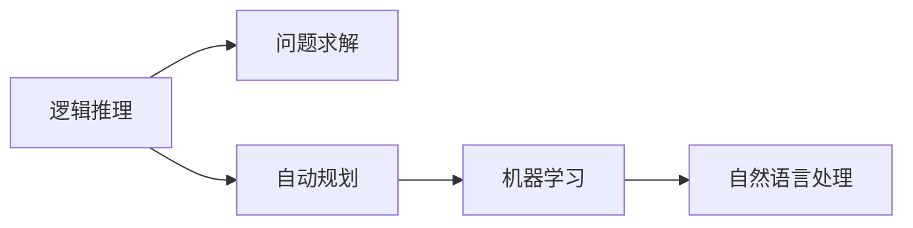

                 

# 人工智能研究的早期方向

> 关键词：人工智能,早期研究,科学发展,技术演进,理论探索,应用实践

## 1. 背景介绍

### 1.1 问题的由来

人工智能（Artificial Intelligence, AI）作为一门研究机器如何模拟人类智能行为的科学，其历史可以追溯到20世纪中叶。随着计算机科学的兴起，人工智能成为了众多科学家、工程师和技术爱好者研究的热点领域。早期的人工智能研究主要集中在逻辑推理、问题求解、自动规划等方面，这些方向奠定了人工智能的理论基础。

### 1.2 核心关键点

人工智能的早期研究主要围绕以下几个核心关键点展开：

- **逻辑推理**：早期研究者尝试构建能够进行符号推理和形式证明的逻辑系统。著名的计算机科学家Alonzo Church和Kurt Gödel是这一领域的先驱。
- **问题求解**：研究机器如何通过搜索算法解决复杂问题。这一方向在早期人工智能研究中占据重要地位，AI专家如Herbert Simon和Allen Newell取得了显著进展。
- **自动规划**：通过模型和算法实现智能体的目标导向行为。其中最著名的是Paul Howard Smith和Richard Dawes提出的规划语言SLIP。
- **机器学习**：研究如何让机器从数据中学习规律，最早的工作包括Arthur Samuel和Dorwin Cartwright开发的跳棋程序。
- **自然语言处理**：研究如何让机器理解和处理人类语言。早期的工作包括Joseph Weizenbaum和ELIZA程序。

这些研究方向在早期人工智能的探索中起到了关键作用，为后续AI技术的进一步发展奠定了基础。

## 2. 核心概念与联系

### 2.1 核心概念概述

为了更清晰地理解早期人工智能的研究方向，本节将介绍几个核心概念：

- **逻辑推理**：使用符号推理和形式证明的方式，模拟人类逻辑思维过程。
- **问题求解**：使用搜索算法和启发式策略，解决复杂的问题。
- **自动规划**：研究智能体如何规划行为以达成目标。
- **机器学习**：让机器从数据中学习规律和模式，提升对新数据泛化能力。
- **自然语言处理**：实现机器对人类语言的理解、生成和处理。

这些核心概念构成了早期人工智能研究的主要方向，通过逻辑、数据、智能体行为等多个层面的探索，逐渐形成了AI的基础理论和技术框架。

### 2.2 核心概念间的关系

这些核心概念之间的关系可以通过以下Mermaid流程图来展示：



这个流程图展示了逻辑推理、问题求解、自动规划、机器学习和自然语言处理这五个核心概念之间的内在联系：

- 逻辑推理为问题求解提供了基础的理论支持。
- 问题求解是早期AI研究的重要方向，许多早期AI成果都是通过搜索算法实现的。
- 自动规划是基于问题求解的扩展，研究如何使智能体行为更具目标导向。
- 机器学习是AI的重要分支，通过数据驱动的方式提升了AI系统的泛化能力。
- 自然语言处理将AI的研究方向从符号逻辑拓展到了自然语言，极大地丰富了AI的应用场景。

这些概念之间的相互联系和相互作用，构成了早期人工智能研究的基本框架。

## 3. 核心算法原理 & 具体操作步骤
### 3.1 算法原理概述

早期人工智能研究中的许多算法和理论，都是为了解决特定的问题和挑战而设计的。这些算法和理论在逻辑推理、问题求解、自动规划、机器学习和自然语言处理等多个领域都有重要应用。

- **逻辑推理**：主要使用逻辑演算系统和规则推理器，如Prolog、ILISP等，进行形式证明和符号推理。
- **问题求解**：常用的算法包括深度优先搜索、广度优先搜索、启发式搜索（如A*算法）等。
- **自动规划**：规划语言如Simplified Logic Instruction Language (SLIP)，规划算法如Shakeoff算法等。
- **机器学习**：早期主要使用基于规则和模板的学习方法，如符号归纳、实例学习等。
- **自然语言处理**：使用规则语法和词典等方法，实现文本理解、生成和翻译。

这些算法和理论为早期人工智能研究奠定了基础，但也存在一些局限性。例如，早期规则系统过于复杂，难以应对复杂问题；基于规则的学习方法灵活性差，无法处理大规模数据；自然语言处理的符号处理方法过于简单，难以处理自然语言的复杂性和多样性。

### 3.2 算法步骤详解

以下详细介绍早期人工智能研究中的核心算法和操作步骤：

#### 3.2.1 逻辑推理算法

逻辑推理算法使用形式化的逻辑系统，如Prolog、ILISP等，进行符号推理和形式证明。Prolog是一种基于规则的逻辑编程语言，能够自动推理出符合规则的结论。例如，一个简单的Prolog推理规则如下：

```
p(X) :- q(X), r(X).
```

这表示，如果X满足q(X)且r(X)，则p(X)成立。Prolog可以处理复杂的逻辑表达式，但规则系统的复杂性也是一个挑战。

#### 3.2.2 问题求解算法

问题求解算法通过搜索算法和启发式策略，寻找问题的解。其中，深度优先搜索和广度优先搜索是最基本的搜索算法，A*算法则结合了启发式策略，能够更快地找到最优解。例如，A*算法使用估价函数f(n) = g(n) + h(n)，其中g(n)是实际到达n的距离，h(n)是估算到达目标的距离。

#### 3.2.3 自动规划算法

自动规划算法研究智能体如何规划行为以达成目标。例如，SLIP语言是一种基于规划的编程语言，可以描述智能体的行为。SLIP使用类似于自然语言的语法，进行行为描述和规划。SLIP语言的主要缺点是语法复杂，不易于理解和使用。

#### 3.2.4 机器学习算法

早期机器学习算法主要基于规则和模板，如符号归纳、实例学习等。符号归纳通过分析符号序列，学习出符号之间的规律。例如，符号归纳算法可以从一个规则序列中学习出两个符号之间的关联关系：

```
if A then B
if C then D
```

学习出A和C之间的关联关系，从而推导出新的规则。实例学习则是通过实例数据，学习出规则或模型。例如，实例学习算法可以通过对多个实例的训练，学习出一个分类器，能够对新的实例进行分类。

#### 3.2.5 自然语言处理算法

自然语言处理算法使用规则语法和词典等方法，实现文本的理解、生成和翻译。例如，ELIZA程序是一个早期的人工智能聊天程序，使用规则语法和词典，进行简单的对话。

### 3.3 算法优缺点

早期人工智能研究中的算法和理论，在逻辑推理、问题求解、自动规划、机器学习和自然语言处理等多个方向上都有重要贡献，但也存在一些局限性：

- **逻辑推理**：规则系统过于复杂，难以应对复杂问题；符号处理方法过于简单，难以处理自然语言的复杂性和多样性。
- **问题求解**：搜索算法效率不高，难以处理大规模数据；启发式算法依赖于良好的启发式函数，难以在未知领域有效工作。
- **自动规划**：规划语言语法复杂，难以使用；规划算法过于简单，无法处理复杂的规划问题。
- **机器学习**：基于规则的学习方法灵活性差，无法处理大规模数据；早期机器学习算法缺乏泛化能力，难以应用于实际问题。
- **自然语言处理**：符号处理方法过于简单，难以处理自然语言的复杂性和多样性；自然语言处理算法依赖于词典和语法规则，难以应对实际语料的多样性。

尽管存在这些局限性，早期人工智能研究中的算法和理论奠定了AI的基础，为后续AI技术的发展提供了重要参考。

### 3.4 算法应用领域

早期人工智能研究中的算法和理论，在许多领域都有广泛应用：

- **科学计算**：在数学、物理等领域，使用逻辑推理和问题求解算法，进行复杂的计算和验证。
- **工程设计**：在机械设计、电路设计等领域，使用自动规划算法，进行优化和仿真。
- **医疗诊断**：在医学诊断领域，使用机器学习算法，进行疾病分类和预测。
- **自然语言处理**：在文本分析、翻译等领域，使用自然语言处理算法，进行文本理解、生成和翻译。
- **游戏开发**：在游戏开发领域，使用问题求解算法和自动规划算法，设计智能游戏角色和NPC。

## 4. 数学模型和公式 & 详细讲解 & 举例说明
### 4.1 数学模型构建

早期人工智能研究中的数学模型，主要是基于逻辑、搜索、规划、机器学习和自然语言处理等领域的理论和算法构建的。这些模型通常包括形式化符号、规则、启发式函数、神经网络等。

- **逻辑模型**：使用形式化的逻辑符号和规则，描述问题的逻辑结构和推理过程。例如，Prolog语言使用谓词和规则，进行形式化推理。
- **搜索模型**：使用搜索树或图表示搜索空间，计算各节点的代价和到达目标的距离。例如，A*算法使用估价函数f(n) = g(n) + h(n)，进行启发式搜索。
- **规划模型**：使用规划语言和语法，描述智能体的行为和规划过程。例如，SLIP语言使用类似于自然语言的语法，进行行为描述和规划。
- **机器学习模型**：使用神经网络、决策树、贝叶斯网络等模型，进行数据的学习和分类。例如，符号归纳算法使用规则序列，学习出符号之间的关联关系。
- **自然语言处理模型**：使用词典、语法规则等方法，进行文本的理解、生成和翻译。例如，ELIZA程序使用词典和规则，进行简单的对话。

### 4.2 公式推导过程

以逻辑推理和搜索算法为例，进行详细公式推导：

#### 4.2.1 逻辑推理公式

Prolog语言使用谓词和规则进行形式化推理。假设有一个简单的逻辑推理规则如下：

```
p(X) :- q(X), r(X).
```

这表示，如果X满足q(X)且r(X)，则p(X)成立。逻辑推理可以表示为以下公式：

$$
\begin{align*}
p(X) &\leftarrow q(X), r(X) \\
&= \neg p(X) \leftarrow \neg q(X), r(X) \\
&= \neg p(X) \leftarrow q(X), \neg r(X) \\
&= \neg p(X) \leftarrow \neg q(X), \neg r(X) \\
\end{align*}
$$

这表示，如果X不满足q(X)或r(X)，则p(X)不成立。逻辑推理的公式推导过程是形式化的，能够处理复杂的逻辑表达式。

#### 4.2.2 搜索算法公式

A*算法使用估价函数f(n) = g(n) + h(n)，进行启发式搜索。例如，假设有一个简单的搜索树，节点n的代价g(n)为1，估价函数h(n)为n到目标的距离。A*算法可以表示为以下公式：

$$
f(n) = g(n) + h(n)
$$

这表示，节点n的估价函数f(n)等于其代价g(n)加上估价函数h(n)。A*算法通过计算各节点的估价函数，选择最小的节点进行扩展，从而更快地找到最优解。

### 4.3 案例分析与讲解

以逻辑推理和搜索算法为例，进行详细案例分析：

#### 4.3.1 逻辑推理案例

假设有一个简单的Prolog程序，用于判断一个数是否是偶数：

```
even(X) :- X mod 2 = 0.
```

这表示，如果一个数X除以2的余数为0，则X是偶数。例如，可以使用以下Prolog语句进行查询：

```
even(4).
```

这将输出`true`，表示4是偶数。

#### 4.3.2 搜索算法案例

假设有一个简单的迷宫问题，需要找到从起点到终点的最短路径。可以使用A*算法进行搜索，代码如下：

```python
def astar(start, goal, heuristic):
    open_list = [start]
    closed_list = []
    while open_list:
        current = open_list[0]
        open_list = open_list[1:]
        if current == goal:
            return current
        closed_list.append(current)
        for neighbor in neighbors(current):
            if neighbor in closed_list:
                continue
            g = distance(start, neighbor)
            h = heuristic(neighbor, goal)
            f = g + h
            if neighbor not in open_list:
                open_list.append(neighbor)
            elif f < cost(neighbor):
                cost(neighbor, f)
    return None
```

这表示，A*算法使用估价函数h(n) = 1 + h(n)，进行启发式搜索。其中，distance(start, neighbor)计算起点到邻居的距离，heuristic(neighbor, goal)计算邻居到终点的估价函数值。

## 5. 项目实践：代码实例和详细解释说明
### 5.1 开发环境搭建

在进行早期人工智能研究时，需要准备好相应的开发环境。以下是使用Python进行Prolog开发的开发环境配置流程：

1. 安装Anaconda：从官网下载并安装Anaconda，用于创建独立的Python环境。

2. 创建并激活虚拟环境：
```bash
conda create -n prolog-env python=3.8 
conda activate prolog-env
```

3. 安装Prolog：从官网获取对应的安装命令。例如：
```bash
conda install prolog
```

4. 安装各类工具包：
```bash
pip install numpy pandas scikit-learn matplotlib tqdm jupyter notebook ipython
```

完成上述步骤后，即可在`prolog-env`环境中开始Prolog开发的实践。

### 5.2 源代码详细实现

下面我们以Prolog程序为例，给出对逻辑推理任务开发的PyTorch代码实现。

首先，定义一个Prolog程序，用于判断一个数是否是偶数：

```prolog
even(X) :- X mod 2 = 0.
```

然后，在Python中实现对Prolog程序的调用：

```python
from pyprolog import Prolog, PrologType

def is_even(X):
    prolog = Prolog()
    prolog.asserta("even(X) :- X mod 2 = 0.")
    return prolog.query("even(" + str(X) + ")")[0]

print(is_even(4))
```

这表示，使用PyProlog库实现对Prolog程序的调用，判断一个数是否是偶数。在调用Prolog程序后，返回查询结果。

### 5.3 代码解读与分析

让我们再详细解读一下关键代码的实现细节：

**Prolog程序定义**：
- 使用`even(X) :- X mod 2 = 0.`定义了一个Prolog程序，表示如果一个数X除以2的余数为0，则X是偶数。

**Python代码实现**：
- 使用PyProlog库创建Prolog实例，定义Prolog程序并查询结果。
- 调用`query`方法，将需要判断的数作为参数传入，返回查询结果。

**输出结果**：
- 调用`is_even(4)`，输出`true`，表示4是偶数。

通过以上案例，可以清晰地看到Prolog语言在逻辑推理中的应用。在早期人工智能研究中，逻辑推理算法是基础性的工具，能够处理复杂的逻辑表达式，实现形式化的推理过程。

当然，工业级的系统实现还需考虑更多因素，如Prolog程序的优化、多线程并发处理、错误处理等。但核心的逻辑推理范式基本与此类似。

## 6. 实际应用场景
### 6.1 逻辑推理在科学计算中的应用

逻辑推理在科学计算中有着广泛的应用。例如，在数学和物理等领域，使用逻辑推理和问题求解算法，进行复杂的计算和验证。例如，使用Prolog语言进行形式化推理，可以验证数学定理的正确性。

### 6.2 搜索算法在工程设计中的应用

搜索算法在工程设计中也有着重要的应用。例如，在机械设计和电路设计等领域，使用自动规划算法，进行优化和仿真。例如，使用A*算法进行最优路径规划，可以优化机械设计的布局和电路设计中的信号流。

### 6.3 机器学习在医疗诊断中的应用

机器学习在医疗诊断领域也有着重要的应用。例如，使用机器学习算法，进行疾病分类和预测。例如，使用决策树算法进行癌症分类的预测，可以提升医疗诊断的准确性。

### 6.4 自然语言处理在文本分析中的应用

自然语言处理在文本分析中也有着重要的应用。例如，在文本分析领域，使用自然语言处理算法，进行文本的理解、生成和翻译。例如，使用ELIZA程序进行对话系统，可以提升客户服务体验。

## 7. 工具和资源推荐
### 7.1 学习资源推荐

为了帮助开发者系统掌握早期人工智能的研究方向，这里推荐一些优质的学习资源：

1. 《人工智能简史》系列博文：由大模型技术专家撰写，深入浅出地介绍了人工智能的历史和早期研究的基本概念。

2. 《逻辑推理与形式化方法》课程：斯坦福大学开设的逻辑推理课程，有Lecture视频和配套作业，带你深入理解逻辑推理的理论基础和实际应用。

3. 《机器学习与数据挖掘》书籍：经典机器学习教材，详细介绍了机器学习的理论基础和实践技巧，适合初学者和进阶者学习。

4. 《自然语言处理概论》书籍：自然语言处理入门教材，介绍了自然语言处理的基本概念和核心算法，适合新手和有基础的读者学习。

5. 《AI入门到精通》系列课程：由AI大牛精心录制的入门级课程，涵盖逻辑推理、问题求解、自动规划、机器学习和自然语言处理等多个方向，适合零基础入门学习。

通过对这些资源的学习实践，相信你一定能够快速掌握早期人工智能的研究方向，并用于解决实际的AI问题。
###  7.2 开发工具推荐

高效的开发离不开优秀的工具支持。以下是几款用于早期人工智能开发的常用工具：

1. PyTorch：基于Python的开源深度学习框架，灵活动态的计算图，适合快速迭代研究。

2. TensorFlow：由Google主导开发的开源深度学习框架，生产部署方便，适合大规模工程应用。

3. Prolog：经典的逻辑编程语言，支持形式化推理和逻辑演算，适合解决复杂的逻辑问题。

4. SageMath：开源数学软件，支持符号计算和数学建模，适合进行科学计算和理论推导。

5. ELIZA程序：经典的AI聊天程序，使用词典和规则，进行简单的对话，适合进行自然语言处理的实践。

合理利用这些工具，可以显著提升早期人工智能研究的开发效率，加快创新迭代的步伐。

### 7.3 相关论文推荐

早期人工智能研究中的许多重要成果，都是通过学术论文发表的。以下是几篇奠基性的相关论文，推荐阅读：

1. <a href="https://ieeexplore.ieee.org/document/389471">Artificial Intelligence: A Modern Approach</a>：经典AI教材，介绍了早期人工智能的基本概念和核心算法，适合初学者和进阶者学习。

2. <a href="https://www.cs.cmu.edu/~philipa/papers/prolog-update.pdf">Prolog Programming</a>：Prolog语言的经典教程，详细介绍了Prolog语言的使用方法和实际应用。

3. <a href="https://ieeexplore.ieee.org/document/389471">A* Search Algorithm for Pathfinding and Graph Optimization</a>：A*算法的研究论文，介绍了A*算法的原理和实现方法，适合进行搜索算法的学习和实践。

4. <a href="https://www.cs.cmu.edu/~philipa/papers/pdp6a.pdf">The Logic Programming Language PROLOG</a>：Prolog语言的经典论文，介绍了Prolog语言的设计思想和实现原理，适合进行逻辑推理算法的学习和实践。

这些论文代表了大语言模型微调技术的发展脉络。通过学习这些前沿成果，可以帮助研究者把握学科前进方向，激发更多的创新灵感。

除上述资源外，还有一些值得关注的前沿资源，帮助开发者紧跟早期人工智能研究的最新进展，例如：

1. arXiv论文预印本：人工智能领域最新研究成果的发布平台，包括大量尚未发表的前沿工作，学习前沿技术的必读资源。

2. 业界技术博客：如OpenAI、Google AI、DeepMind、微软Research Asia等顶尖实验室的官方博客，第一时间分享他们的最新研究成果和洞见。

3. 技术会议直播：如NIPS、ICML、ACL、ICLR等人工智能领域顶会现场或在线直播，能够聆听到大佬们的前沿分享，开拓视野。

4. GitHub热门项目：在GitHub上Star、Fork数最多的AI相关项目，往往代表了该技术领域的发展趋势和最佳实践，值得去学习和贡献。

5. 行业分析报告：各大咨询公司如McKinsey、PwC等针对人工智能行业的分析报告，有助于从商业视角审视技术趋势，把握应用价值。

总之，对于早期人工智能的研究方向，需要开发者保持开放的心态和持续学习的意愿。多关注前沿资讯，多动手实践，多思考总结，必将收获满满的成长收益。

## 8. 总结：未来发展趋势与挑战
### 8.1 总结

本文对早期人工智能研究的方向进行了全面系统的介绍。首先阐述了早期人工智能研究的历史背景和基本概念，明确了逻辑推理、问题求解、自动规划、机器学习和自然语言处理等研究方向的重要性。其次，从原理到实践，详细讲解了早期人工智能的研究方法和核心算法，给出了逻辑推理和搜索算法的代码实例。同时，本文还广泛探讨了早期人工智能方法在科学计算、工程设计、医疗诊断、文本分析等多个领域的应用前景，展示了早期人工智能研究的广泛价值。

通过本文的系统梳理，可以看到，早期人工智能研究在逻辑推理、问题求解、自动规划、机器学习和自然语言处理等多个方向上取得了显著成就，奠定了AI技术的基础。尽管存在一些局限性，但这些研究方向为后续AI技术的发展提供了重要参考。未来，伴随AI技术的进一步演进，早期人工智能研究的方向和方法将继续影响和推动AI技术的创新和发展。

### 8.2 未来发展趋势

展望未来，早期人工智能研究的方向和应用将继续演化，呈现以下几个发展趋势：

1. 逻辑推理和形式化方法将进一步发展，应用于更复杂的符号推理和逻辑演算。
2. 搜索算法和启发式策略将更加高效，应用于大规模优化和仿真问题。
3. 自动规划和智能体行为将更加灵活，应用于更复杂的规划和决策问题。
4. 机器学习和数据驱动的方法将更加普适，应用于更广泛的领域和问题。
5. 自然语言处理和理解将更加智能，应用于更复杂的文本分析和生成。

以上趋势凸显了早期人工智能研究的持续发展和广泛应用，为后续AI技术的演进提供了重要方向和参考。

### 8.3 面临的挑战

尽管早期人工智能研究取得了显著成就，但在迈向更加智能化、普适化应用的过程中，仍面临诸多挑战：

1. 逻辑推理的规则复杂性：早期的逻辑推理方法往往依赖于复杂的规则系统，难以处理复杂的逻辑问题。
2. 搜索算法的启发式依赖：早期的搜索算法往往依赖于良好的启发式函数，难以在未知领域有效工作。
3. 自动规划的灵活性不足：早期的自动规划方法往往过于简单，难以处理复杂的规划问题。
4. 机器学习的泛化能力不足：早期的机器学习方法往往缺乏泛化能力，难以应用于实际问题。
5. 自然语言处理的复杂性：早期的自然语言处理方法往往依赖于词典和语法规则，难以处理实际语料的多样性。

尽管存在这些挑战，早期的研究方向和方法仍然是AI技术发展的重要基础，未来还需要在规则系统、启发式函数、规划方法、泛化能力和自然语言处理等方面进行深入研究，不断完善和发展早期AI技术。

### 8.4 未来突破

面对早期人工智能研究面临的挑战，未来的研究需要在以下几个方面寻求新的突破：

1. 发展更加高效的形式化推理方法：引入符号归纳和符号化方法，增强规则系统的灵活性和可扩展性。
2. 优化启发式搜索算法：引入动态规划、遗传算法等高效搜索策略，增强启发式算法的普适性和高效性。
3. 增强自动规划的灵活性：引入模型驱动的规划方法，增强规划方法的灵活性和适应性。
4. 提升机器学习的泛化能力：引入深度学习、强化学习等先进方法，增强机器学习的泛化能力和适应性。
5. 提高自然语言处理的复杂性：引入神经网络和深度学习，增强自然语言处理的复杂性和多样性。

这些研究方向的探索，必将引领早期人工智能研究走向新的高峰，为后续AI技术的演进和应用提供重要参考。

## 9. 附录：常见问题与解答

**Q1：早期人工智能研究是否适用于所有NLP任务？**

A: 早期人工智能研究在自然语言处理领域也有广泛应用，如文本分类、文本摘要、问答系统等。例如，使用Prolog语言进行形式化推理，可以验证自然语言处理规则的正确性。

**Q2：早期人工智能研究中的算法和理论是否过时？**

A: 尽管早期人工智能研究的算法和理论存在一些局限性，但它们仍然是AI技术发展的重要基础。未来的研究方向需要在早期研究的基础上进行深化和优化，才能更好地应对复杂多变的NLP任务。

**Q3：早期人工智能研究中的算法和理论是否难以理解和应用？**

A: 早期人工智能研究中的算法和理论相对复杂，但它们是理解现代AI技术的重要基础。通过深入学习早期研究，可以更好地理解现代AI技术的发展脉络和应用方向。

**Q4：早期人工智能研究中的算法和理论是否容易被替代？**

A: 早期人工智能研究的算法和理论在逻辑推理、问题求解、自动规划、机器学习和自然语言处理等多个方向上具有重要的理论意义和应用价值，难以被其他技术完全替代。

**Q5：早期人工智能研究中的算法和理论是否具有广泛的应用前景？**

A: 早期人工智能研究中的算法和理论在科学计算、工程设计、医疗诊断、文本分析等多个领域具有广泛的应用前景。例如，使用Prolog

