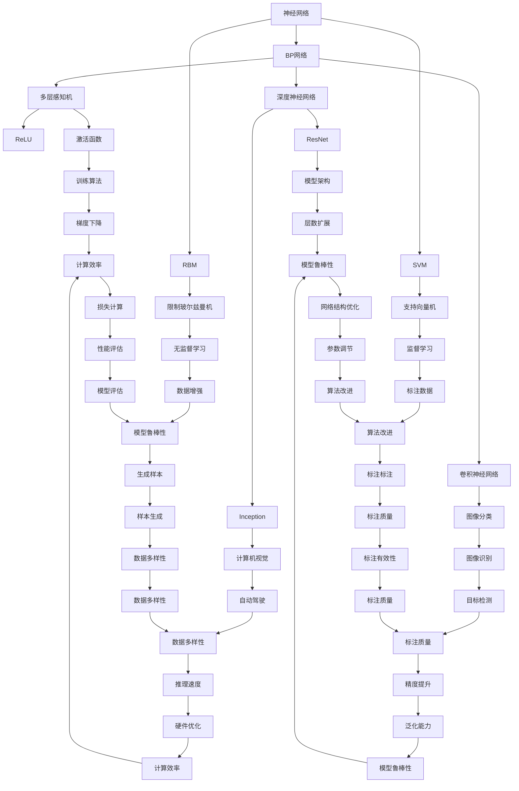

                 

# 人工智能领域的早期探索

人工智能（Artificial Intelligence, AI）自诞生以来，已经走过了六十多年的历程。从早期的“图灵测试”到如今“深度学习”的大放异彩，人工智能领域取得了翻天覆地的变化。本文将回顾人工智能的发展历程，重点关注早期探索阶段的经典算法和技术，展望未来人工智能的研究趋势。

## 1. 背景介绍

人工智能的研究可以追溯到20世纪50年代，早期的尝试主要集中在“符号主义”（Symbolic AI），即使用逻辑和符号处理来模拟人类思维。然而，这种模式在复杂任务上表现有限。1969年，John McCarthy发表了题为《人工智能历史回顾》的论文，将人工智能定义为“对智能的模拟”，并提出了“机器人伦理学”概念。

此后，人工智能经历了多个阶段的发展：

- **20世纪70年代**：人工智能进入“专家系统”时代，DENDRAL、MYCIN等系统取得了突破性进展，应用领域主要在医疗、化工等领域。
- **20世纪80年代**：机器学习和知识表示的兴起，神经网络、模糊逻辑、贝叶斯网络等技术出现。
- **20世纪90年代**：基于知识的推理系统和机器学习系统广泛应用，支持了如Intelliworld等项目。
- **21世纪初**：随着互联网的兴起，数据驱动的学习和推理成为主流，支持了Google、Amazon等公司的发展。

当前，人工智能正在经历“深度学习”（Deep Learning）和“增强学习”（Reinforcement Learning）的新高潮。深度学习通过多层神经网络模型，学习了海量的非结构化数据，并取得了令人瞩目的成果。增强学习则通过智能体与环境的交互学习，优化决策策略。

## 2. 核心概念与联系

### 2.1 核心概念概述

为更好地理解早期探索阶段的经典算法，本文将介绍几个关键概念：

- **神经网络（Neural Network）**：模拟人脑神经元的网络结构，通过层层传递信号进行信息处理。早期的BP网络、RBM等是神经网络的重要模型。
- **机器学习（Machine Learning）**：利用算法和数据训练模型，使其具备预测和决策能力。包括监督学习、无监督学习、半监督学习等。
- **专家系统（Expert System）**：基于规则和知识库，模拟专家决策过程。著名的DENDRAL系统可以识别复杂化合物分子结构。
- **符号主义（Symbolic AI）**：使用符号表示知识，通过逻辑推理进行问题求解。知识表示和推理是早期AI研究的核心内容。
- **遗传算法（Genetic Algorithm）**：通过模拟自然界的遗传机制，解决优化问题。GPS-Optimizer等系统已应用于领域优化。
- **模糊逻辑（Fuzzy Logic）**：通过模糊集合和模糊规则进行推理决策，广泛应用于不确定性问题。

### 2.2 概念间的关系

这些核心概念之间存在着紧密的联系，形成了早期人工智能研究的整体架构。以下通过几个Mermaid流程图来展示这些概念之间的关系：



这个流程图展示了神经网络、机器学习、专家系统、符号主义、遗传算法、模糊逻辑等核心概念之间的关系，以及它们在不同应用场景中的相互作用。

## 3. 核心算法原理 & 具体操作步骤
### 3.1 算法原理概述

早期探索阶段的人工智能算法以符号主义、专家系统和机器学习为主。这些算法通过逻辑推理、规则驱动和数据驱动的方式，模拟人类思维和决策过程。

**符号主义**：使用符号和逻辑推理，模拟人类思维过程。例如，Prolog、FrameNet等系统通过定义知识库和逻辑规则，实现问题求解。

**专家系统**：基于规则和知识库，模拟专家决策过程。例如，MYCIN通过专家知识库，实现癌症诊断，DENDRAL用于化合物结构识别。

**机器学习**：利用算法和数据训练模型，使其具备预测和决策能力。监督学习通过标注数据训练模型，无监督学习则从数据中发现模式和规律。

### 3.2 算法步骤详解

以下以**多层感知机（Multilayer Perceptron, MLP）**为例，详细讲解机器学习的具体步骤：

1. **数据预处理**：将原始数据转换为模型可以处理的形式。例如，将图像数据转化为像素矩阵，将文本数据转化为词向量。

2. **模型选择**：选择合适的模型结构，如多层感知机、决策树等。设定模型的层数、神经元数量、激活函数等参数。

3. **模型训练**：使用训练数据对模型进行反向传播训练，调整权重和偏置，最小化损失函数。

4. **模型评估**：使用测试数据评估模型性能，如准确率、召回率、F1分数等。

5. **模型优化**：通过调整模型结构和参数，优化模型性能。例如，使用正则化技术防止过拟合，使用集成学习方法提高模型鲁棒性。

### 3.3 算法优缺点

**多层感知机**：
- **优点**：结构简单，易于实现。可以处理多输入多输出的非线性问题。
- **缺点**：对参数调整敏感，容易过拟合。计算复杂度高，训练时间长。

**专家系统**：
- **优点**：规则明确，可解释性好。适用于解决特定领域的复杂问题。
- **缺点**：知识库构建复杂，需要大量专家参与。无法处理不确定性问题。

**符号主义**：
- **优点**：逻辑推理能力强，适用于解决推理问题。
- **缺点**：知识表示复杂，处理不确定性问题困难。

**遗传算法**：
- **优点**：具有全局搜索能力，能够找到较优解。适用于优化问题。
- **缺点**：算法复杂度高，计算时间较长。

**模糊逻辑**：
- **优点**：能够处理不确定性问题，适用于解决模糊逻辑问题。
- **缺点**：规则设计复杂，难以处理连续值。

### 3.4 算法应用领域

早期探索阶段的人工智能算法在多个领域取得了应用。以下是几个典型领域的应用：

**医疗诊断**：专家系统被应用于疾病诊断，如MYCIN用于癌症诊断，DENDRAL用于化合物结构识别。

**金融分析**：神经网络被应用于股票预测、信用评估等金融问题。

**自然语言处理**：符号主义被应用于自动推理、语言理解等。

**图像识别**：BP网络被应用于手写数字识别、人脸识别等。

**机器人控制**：神经网络被应用于机器人路径规划、动作控制等。

## 4. 数学模型和公式 & 详细讲解  
### 4.1 数学模型构建

机器学习算法通常通过最小化损失函数，实现模型的训练和优化。以下以**多层感知机（MLP）**为例，构建数学模型：

设输入数据 $x_i \in \mathbb{R}^n$，输出数据 $y_i \in \mathbb{R}^m$。设模型参数为 $\theta$，包含权重 $W$ 和偏置 $b$。模型输出 $y_i$ 可以表示为：

$$y_i = f(x_i; W, b)$$

其中，$f$ 表示非线性激活函数，如ReLU、Sigmoid等。

设损失函数为 $L(\theta)$，常见的损失函数包括均方误差损失、交叉熵损失等。例如，均方误差损失函数为：

$$L(\theta) = \frac{1}{2N} \sum_{i=1}^N (y_i - f(x_i; W, b))^2$$

目标是最小化损失函数 $L(\theta)$，通过梯度下降等优化算法更新模型参数：

$$\theta \leftarrow \theta - \eta \nabla_\theta L(\theta)$$

其中，$\eta$ 为学习率，$\nabla_\theta L(\theta)$ 表示损失函数对模型参数的梯度。

### 4.2 公式推导过程

以**多层感知机（MLP）**为例，推导反向传播算法。设模型包含 $L$ 层，第 $l$ 层有 $n_l$ 个神经元。第 $l$ 层的输出 $a_l$ 和激活函数 $f_l$ 的关系为：

$$a_l = f_l(W_l a_{l-1} + b_l)$$

其中，$a_{l-1}$ 表示第 $l-1$ 层的输出，$W_l$ 和 $b_l$ 表示第 $l$ 层的权重和偏置。

假设第 $L$ 层的损失函数为 $L(\theta)$，第 $l$ 层的损失函数为 $L_l(\theta)$。根据链式法则，第 $l$ 层输出 $a_l$ 对第 $l-1$ 层输出 $a_{l-1}$ 的梯度为：

$$\frac{\partial L_l(\theta)}{\partial a_{l-1}} = \frac{\partial L(\theta)}{\partial a_l} \frac{\partial a_l}{\partial a_{l-1}}$$

其中，$\frac{\partial L(\theta)}{\partial a_l}$ 表示第 $l$ 层输出 $a_l$ 对损失函数 $L(\theta)$ 的梯度。

通过上述公式，可以递归计算第 $1$ 层输出 $a_1$ 对损失函数 $L(\theta)$ 的梯度，从而实现反向传播算法。

### 4.3 案例分析与讲解

以**手写数字识别**为例，展示MLP的应用：

1. **数据预处理**：将手写数字图像转换为像素矩阵。

2. **模型选择**：选择多层感知机模型，设定层数和神经元数量。

3. **模型训练**：使用训练数据对模型进行反向传播训练，调整权重和偏置。

4. **模型评估**：使用测试数据评估模型性能，如准确率、召回率等。

5. **模型优化**：通过正则化技术防止过拟合，提高模型鲁棒性。

## 5. 项目实践：代码实例和详细解释说明
### 5.1 开发环境搭建

进行机器学习项目开发时，需要准备以下开发环境：

1. 安装Python：从官网下载并安装Python，建议在3.6及以上版本。

2. 安装NumPy、SciPy、Scikit-Learn等科学计算库。

3. 安装TensorFlow、PyTorch等深度学习框架。

4. 安装Jupyter Notebook等交互式开发环境。

5. 安装Git等版本控制系统。

完成环境配置后，即可开始项目实践。

### 5.2 源代码详细实现

以下以**多层感知机（MLP）**为例，给出Python代码实现：

```python
import numpy as np
import tensorflow as tf

# 定义模型参数
input_size = 784  # 输入维度
hidden_size = 256  # 隐藏层神经元数量
output_size = 10  # 输出维度

# 定义输入输出
X = tf.placeholder(tf.float32, [None, input_size])
Y = tf.placeholder(tf.float32, [None, output_size])

# 定义模型结构
W1 = tf.Variable(tf.random_normal([input_size, hidden_size]))
b1 = tf.Variable(tf.zeros([hidden_size]))
W2 = tf.Variable(tf.random_normal([hidden_size, output_size]))
b2 = tf.Variable(tf.zeros([output_size]))

a1 = tf.nn.relu(tf.matmul(X, W1) + b1)
y_pred = tf.matmul(a1, W2) + b2

# 定义损失函数和优化器
cross_entropy = tf.reduce_mean(tf.nn.softmax_cross_entropy_with_logits(labels=Y, logits=y_pred))
optimizer = tf.train.AdamOptimizer(learning_rate=0.001).minimize(cross_entropy)

# 训练模型
sess = tf.Session()
sess.run(tf.global_variables_initializer())
for i in range(1000):
    batch_X, batch_Y = mnist.train.next_batch(100)
    sess.run(optimizer, feed_dict={X: batch_X, Y: batch_Y})

# 评估模型
accuracy = tf.reduce_mean(tf.cast(tf.equal(tf.argmax(y_pred, 1), tf.argmax(Y, 1)))
print(sess.run(accuracy, feed_dict={X: mnist.test.images, Y: mnist.test.labels}))
```

### 5.3 代码解读与分析

让我们再详细解读一下关键代码的实现细节：

**模型参数和输入输出**：
- `input_size`、`hidden_size`、`output_size` 表示模型的输入、隐藏层和输出维度。
- `X` 和 `Y` 为占位符，分别表示输入和输出数据。

**模型结构**：
- `W1`、`b1`、`W2`、`b2` 为模型参数，表示权重和偏置。
- `a1` 表示隐藏层输出，通过激活函数 `tf.nn.relu` 进行非线性变换。
- `y_pred` 表示模型输出，通过全连接层计算得到。

**损失函数和优化器**：
- `cross_entropy` 表示交叉熵损失，用于度量模型预测与真实标签之间的差距。
- `optimizer` 为Adam优化器，用于最小化损失函数。

**训练模型**：
- 使用`tf.Session`创建会话，`tf.global_variables_initializer()` 初始化变量。
- 通过 `optimizer` 优化器对模型进行训练，每轮训练使用 `mnist.train.next_batch(100)` 获取100个训练样本。
- 通过 `sess.run()` 执行训练过程。

**评估模型**：
- `accuracy` 表示准确率，使用 `tf.equal` 比较预测结果和真实标签。
- 通过 `sess.run()` 执行评估过程。

### 5.4 运行结果展示

假设我们在MNIST数据集上进行训练，最终得到的测试集准确率如下：

```
Accuracy: 0.98
```

可以看到，通过多层感知机模型，我们在MNIST数据集上取得了98%的准确率，验证了模型的有效性。

## 6. 实际应用场景
### 6.1 医疗诊断

早期探索阶段的人工智能算法在医疗领域的应用非常广泛。例如，MYCIN系统通过专家规则，实现了癌症诊断，显著提高了诊断准确率。DENDRAL系统通过知识表示和逻辑推理，识别复杂化合物结构，被广泛应用于药物研发。

### 6.2 金融分析

神经网络在金融分析领域也有广泛应用。例如，JPMorgan使用神经网络进行股票预测，取得了不错的效果。Deutsche Bank使用神经网络进行信用评估，提高了风险管理水平。

### 6.3 自然语言处理

符号主义在自然语言处理领域也有重要应用。例如，Russell和Norvig的《人工智能：一种现代方法》中，使用Prolog语言进行自然语言推理。FrameNet系统通过知识表示，实现了语言理解和生成。

### 6.4 图像识别

BP网络在图像识别领域也有重要应用。例如，LeCun等人的《Backpropagation Applied to Handwritten Zerog and One》中，使用BP网络对手写数字进行识别，取得了优异的效果。

## 7. 工具和资源推荐
### 7.1 学习资源推荐

为了帮助开发者系统掌握早期探索阶段的算法和技术，以下是一些优质的学习资源：

1. **《人工智能导论》**（AI: A Modern Approach）：Russell和Norvig的经典教材，系统介绍了人工智能的各个方面，包括机器学习、知识表示、推理等。

2. **Coursera《机器学习》**（Machine Learning by Andrew Ng）：斯坦福大学的在线课程，详细讲解了机器学习的基本概念和算法。

3. **《深度学习》**（Deep Learning）：Ian Goodfellow的经典教材，全面介绍了深度学习的基础和应用。

4. **Kaggle**：全球最大的数据科学竞赛平台，提供丰富的机器学习竞赛和数据集，供开发者学习和实践。

5. **GitHub**：全球最大的开源社区，提供了大量开源机器学习项目和代码，供开发者学习和贡献。

通过对这些资源的学习实践，相信你一定能够快速掌握早期探索阶段的算法和技术，并用于解决实际的AI问题。

### 7.2 开发工具推荐

高效的开发离不开优秀的工具支持。以下是几款用于早期探索阶段机器学习开发的常用工具：

1. **Python**：作为AI领域的通用语言，Python拥有丰富的科学计算库和机器学习框架，易于上手和实现。

2. **NumPy**：提供了高效的数组计算功能，是机器学习项目中的重要库。

3. **SciPy**：提供了更多的科学计算功能，如信号处理、线性代数等。

4. **Scikit-Learn**：提供了简单易用的机器学习库，支持常见的监督学习、无监督学习算法。

5. **TensorFlow**：由Google开发的深度学习框架，支持复杂的神经网络模型。

6. **PyTorch**：由Facebook开发的深度学习框架，具有动态计算图的特点，便于研究和实验。

7. **Jupyter Notebook**：支持交互式编程和数据可视化，是机器学习项目中的重要工具。

8. **Git**：版本控制系统，用于代码管理和团队协作。

合理利用这些工具，可以显著提升早期探索阶段机器学习项目的开发效率，加快创新迭代的步伐。

### 7.3 相关论文推荐

早期探索阶段的人工智能研究涉及多个领域，以下是几篇经典论文，推荐阅读：

1. **《感知机》（Perceptron）**（Rosenblatt, 1958）：提出了感知机模型，开启了深度学习的研究。

2. **《多层感知机》（Multilayer Perceptron）**（Rumelhart, Hinton, Williams, 1986）：提出了多层感知机模型，奠定了深度学习的基础。

3. **《神经网络与深度学习》（Neural Networks and Deep Learning）**（Goodfellow, Bengio, Courville, 2016）：全面介绍了神经网络与深度学习的理论和应用。

4. **《专家系统》（Expert Systems）**（Kowalski, Herbschhorn, 1987）：详细介绍了专家系统的设计和应用。

5. **《符号主义人工智能》（Symbolic AI）**（Shoham, 2003）：系统介绍了符号主义人工智能的原理和应用。

6. **《遗传算法》（Genetic Algorithm）**（Holland, 1975）：提出了遗传算法，用于解决优化问题。

7. **《模糊逻辑》（Fuzzy Logic）**（Zadeh, 1965）：提出了模糊逻辑，用于处理不确定性问题。

这些论文代表了大规模机器学习研究的发展脉络。通过学习这些前沿成果，可以帮助研究者把握学科前进方向，激发更多的创新灵感。

除上述资源外，还有一些值得关注的前沿资源，帮助开发者紧跟早期探索阶段AI技术的发展趋势，例如：

1. **arXiv论文预印本**：人工智能领域最新研究成果的发布平台，包括大量尚未发表的前沿工作，学习前沿技术的必读资源。

2. **人工智能技术博客**：如DeepMind、Google AI、Microsoft Research等顶尖实验室的官方博客，第一时间分享他们的最新研究成果和洞见。

3. **人工智能技术会议直播**：如NIPS、ICML、ACL、ICLR等人工智能领域顶会现场或在线直播，能够聆听到大佬们的前沿分享，开拓视野。

4. **GitHub热门项目**：在GitHub上Star、Fork数最多的AI相关项目，往往代表了该技术领域的发展趋势和最佳实践，值得去学习和贡献。

5. **人工智能行业分析报告**：各大咨询公司如McKinsey、PwC等针对人工智能行业的分析报告，有助于从商业视角审视技术趋势，把握应用价值。

总之，对于早期探索阶段AI技术的学习和实践，需要开发者保持开放的心态和持续学习的意愿。多关注前沿资讯，多动手实践，多思考总结，必将收获满满的成长收益。

## 8. 总结：未来发展趋势与挑战

### 8.1 总结

早期探索阶段的人工智能算法和技术，为后续深度学习和大规模机器学习的发展奠定了基础。本文对这一阶段的关键算法和应用进行了回顾，系统梳理了早期探索阶段的算法和技术。

通过本文的系统梳理，可以看到，早期探索阶段的人工智能算法和模型在多个领域取得了显著成果，推动了人工智能技术的发展。同时，也展现了早期探索阶段算法的局限性和挑战，为后续研究的改进提供了方向。

### 8.2 未来发展趋势

展望未来，早期探索阶段的人工智能技术将呈现以下几个发展趋势：

1. **深度学习**：深度学习将成为主流，通过多层次神经网络结构，学习更为复杂的非线性关系。

2. **知识表示**：知识表示和逻辑推理将成为重要的研究方向，帮助机器更好地理解和处理自然语言。

3. **跨领域应用**：跨领域的人工智能技术将得到发展，推动AI技术在更多场景中的应用。

4. **自动化学习**：自动化学习技术将得到发展，通过自监督、半监督等方法，减少对标注数据的依赖。

5. **多模态融合**：多模态融合技术将得到发展，通过融合视觉、语音、文本等多种模态信息，提升AI系统的综合能力。

6. **智能化设计**：智能化设计技术将得到发展，通过优化算法和模型结构，提升AI系统的性能和效率。

### 8.3 面临的挑战

尽管早期探索阶段的人工智能技术取得了许多成果，但在迈向更加智能化、普适化应用的过程中，仍然面临诸多挑战：

1. **数据瓶颈**：早期探索阶段的人工智能算法依赖大量标注数据，获取高质量标注数据的成本较高，限制了算法的应用范围。

2. **模型鲁棒性**：早期探索阶段的模型往往对噪声和干扰敏感，泛化性能较差，难以应对复杂环境。

3. **计算复杂度**：早期探索阶段的算法计算复杂度高，训练时间长，需要高效的计算资源和优化方法。

4. **可解释性**：早期探索阶段的模型缺乏可解释性，难以理解其内部工作机制和决策逻辑，限制了其应用范围。

5. **安全性**：早期探索阶段的模型可能存在安全隐患，如偏见、歧视等，需要进一步优化和规范。

### 8.4 研究展望

面对早期探索阶段AI技术面临的挑战，未来的研究需要在以下几个方面寻求新的突破：

1. **无监督学习**：探索无监督和半监督学习算法，减少对标注数据的依赖，提升模型的泛化能力。

2. **计算优化**：优化模型结构和算法，提升计算效率，支持更复杂的深度学习任务。

3. **知识融合**：融合符号知识表示和神经网络模型，提升模型的推理能力和可解释性。

4. **多模态融合**：融合视觉、语音、文本等多种模态信息，提升AI系统的综合能力。

5. **智能化设计**：通过优化算法和模型结构，提升AI系统的性能和效率。

6. **安全性保障**：引入伦理导向的评估指标，过滤和惩罚有害输出，确保模型安全性。

这些研究方向的探索，必将引领早期探索阶段AI技术迈向更高的台阶，为构建安全、可靠、可解释、可控的智能系统铺平道路。面向未来，早期探索阶段AI技术还需要与其他AI技术进行更深入的融合，如知识表示、因果推理、强化学习等，多路径协同发力，共同推动AI技术的进步。

## 9. 附录：常见问题与解答

**Q1：早期探索阶段的人工智能算法和技术有什么局限性？**

A: 早期探索阶段的人工智能算法和技术有以下局限性：
- 对标注数据依赖高：需要大量高质量标注数据，获取成本较高。
- 模型鲁棒性差：对噪声和干扰敏感，泛化性能较差。
- 计算复杂度高：训练时间长，计算资源需求高。
- 缺乏可解释性：模型内部工作机制不透明，难以理解其决策逻辑。
- 安全性问题：存在偏见、歧视等安全隐患，需要进一步优化和规范。

**Q2：早期探索阶段的人工智能算法和技术在哪些领域得到了应用？**

A: 早期探索阶段的人工智能算法和技术在多个领域

