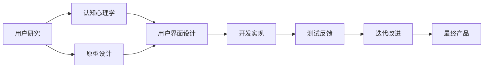

                 

# 人机交互与用户界面设计原理与代码实战案例讲解

> 关键词：人机交互，用户界面设计，UX/UI设计，用户研究，原型设计，编码实现

## 1. 背景介绍

### 1.1 问题由来
随着计算机技术的飞速发展，人机交互（Human-Computer Interaction，HCI）和用户界面（User Interface，UI）设计已成为计算机科学领域中不可或缺的部分。从桌面操作系统到智能手机应用，从Web浏览器到智能家居设备，人机交互与用户界面设计无处不在。然而，尽管有大量成功的案例和理论，设计出既美观又易用的界面仍是一个具有挑战性的任务。本文将深入探讨人机交互与用户界面设计的原理，并结合实战案例，讲解关键的开发技术和设计思想。

### 1.2 问题核心关键点
本文重点讨论以下几个关键点：
1. **人机交互的基本原理**：包括用户行为模型、认知心理学原理、人机交互设计原则等。
2. **用户界面设计的核心原则**：如简洁性、一致性、可访问性等。
3. **实际应用中的开发技术**：如原型设计工具、编程框架、用户研究方法等。
4. **实战案例分析**：通过具体项目，展示从需求分析到用户界面实现的完整流程。

### 1.3 问题研究意义
掌握人机交互与用户界面设计的原理和技术，对于提高用户体验（User Experience，UX）、提升产品竞争力、推动技术创新具有重要意义。通过学习本文，读者可以：
1. 深入理解用户需求，设计出更符合用户期待的界面。
2. 熟练运用现代UI设计工具，提升设计效率和质量。
3. 掌握实际开发中的关键技术，将设计理念转化为可操作的代码。
4. 从实际案例中学习成功经验，避免常见陷阱。

## 2. 核心概念与联系

### 2.1 核心概念概述
- **用户界面（User Interface, UI）**：用户与计算机交互的视觉界面，包括图形、文本、动画等元素。
- **人机交互（Human-Computer Interaction, HCI）**：研究用户如何与计算机系统交互的学科，包括硬件、软件和用户心理等方面。
- **用户体验（User Experience, UX）**：衡量用户与系统交互时的主观感受，包括可用性、满意度、情感反应等。
- **认知心理学**：研究人类认知过程的学科，包括感知、记忆、决策等，对人机交互设计有重要影响。
- **原型设计（Prototyping）**：通过模拟实际界面，进行用户研究和测试，验证设计思路和交互流程。
- **用户研究（User Research）**：通过各种方法了解用户需求和行为，指导界面设计。

### 2.2 核心概念之间的关系

以下是一个Mermaid流程图，展示了这些核心概念之间的联系：



这个流程图展示了人机交互与用户界面设计的基本流程：
1. 用户研究获取用户需求和行为数据。
2. 结合认知心理学原理，进行原型设计，验证设计思路。
3. 用户界面设计基于原型和用户研究结果，设计界面元素。
4. 开发实现将设计转化为可交互的代码。
5. 通过测试反馈，进行迭代改进，不断优化界面。
6. 最终产品上线，获得用户反馈，持续改进。

### 2.3 核心概念的整体架构

以下是一个综合的流程图，展示了人机交互与用户界面设计的整体架构：


这个流程图展示了从需求获取到产品持续改进的完整流程，强调了用户反馈在迭代设计中的重要作用。

## 3. 核心算法原理 & 具体操作步骤

### 3.1 算法原理概述
人机交互与用户界面设计的核心算法原理包括：
- **认知心理学原理**：理解用户的行为和心理，指导界面设计。
- **用户需求分析**：通过用户研究，确定用户需求和任务流程。
- **界面设计原则**：如一致性、可访问性、简洁性等，指导界面元素的设计。
- **交互设计原则**：如反馈、可预测性、可操作性等，指导交互流程的设计。
- **原型设计工具**：如Sketch、Adobe XD等，辅助设计实现。
- **开发框架**：如React、Flutter等，实现界面元素的动态交互。

### 3.2 算法步骤详解
1. **用户需求分析**：
   - 通过问卷、访谈、用户测试等方式，了解用户需求和行为。
   - 使用用户研究工具（如UserZoom、Lookback等）收集数据，进行分析。

2. **原型设计**：
   - 使用原型设计工具（如Sketch、Adobe XD等）创建界面原型。
   - 使用低保真原型（如Figma）进行快速迭代，验证设计思路。

3. **界面设计**：
   - 结合用户研究结果，设计界面元素和布局。
   - 遵循界面设计原则，如一致性、简洁性等，提高用户体验。

4. **开发实现**：
   - 使用开发框架（如React、Flutter等）将界面原型转化为可交互的代码。
   - 使用前端开发工具（如VS Code、Sublime Text等）进行代码编写和调试。

5. **测试反馈**：
   - 使用测试工具（如Jest、TestCafe等）进行单元测试和集成测试。
   - 进行用户测试，收集反馈，发现和修复问题。

6. **迭代改进**：
   - 根据用户反馈和测试结果，进行界面和交互的迭代优化。
   - 再次进行测试和反馈，持续改进，直至满足用户需求。

### 3.3 算法优缺点
**优点**：
- **高效**：通过原型设计和用户测试，快速验证设计思路，减少开发成本。
- **可控**：使用科学的设计原则和工具，确保设计的质量和一致性。
- **用户导向**：通过用户研究，深入了解用户需求，设计出更符合用户期望的界面。

**缺点**：
- **复杂**：需要综合考虑认知心理学、用户研究和原型设计等多个因素，设计过程复杂。
- **资源消耗**：原型设计和用户测试需要耗费大量时间和人力。
- **依赖工具**：设计实现需要依赖各种工具和技术，增加了学习成本。

### 3.4 算法应用领域
人机交互与用户界面设计在多个领域得到了广泛应用，包括：
1. **桌面应用**：如操作系统、办公软件等，用户界面设计直接影响用户体验。
2. **移动应用**：如社交网络、电商应用等，简洁易用的界面设计提升用户满意度。
3. **Web应用**：如电商平台、在线教育等，交互流畅的界面设计提升用户参与度。
4. **智能家居设备**：如智能音箱、智能电视等，易于操作的界面设计提升用户体验。

## 4. 数学模型和公式 & 详细讲解 & 举例说明

### 4.1 数学模型构建
用户界面设计涉及到许多心理学和认知科学的原理，其中经典的模型包括：
- **认知负载理论**：研究用户认知过程中的信息处理能力，指导界面设计。
- **任务模型**：描述用户完成任务的流程，指导界面布局和交互设计。

### 4.2 公式推导过程
以认知负载理论为例，用户界面的认知负载可以通过以下公式计算：

$$ \text{认知负载} = \text{信息数量} \times \text{复杂度} $$

其中，信息数量指界面元素的数量，复杂度指每个元素的信息量。设计低认知负载的界面，需要尽量减少信息数量和复杂度。

### 4.3 案例分析与讲解
以一个移动应用为例，分析其界面设计和用户行为：
- **界面布局**：采用“上轻下重”的原则，重要信息位于顶部，操作按钮位于底部。
- **交互设计**：提供即时反馈，如按钮点击后的震动和声音提示，提高用户满意度。
- **用户体验**：通过A/B测试，比较不同布局和交互方式，选择最优方案。

## 5. 项目实践：代码实例和详细解释说明

### 5.1 开发环境搭建
开发环境搭建包括以下步骤：
1. 安装操作系统和开发工具：如macOS、Windows、Linux等。
2. 安装开发框架和工具：如React、Flutter等。
3. 安装原型设计工具：如Sketch、Adobe XD等。

以下是一个开发环境的搭建过程：

```bash
# 安装macOS
# ...

# 安装React和Node.js
npm install -g react react-dom react-router-dom
npm install -g @babel/core @babel/preset-env @babel/preset-react @babel/preset-flow react-native

# 安装Sketch
# ...

# 安装Adobe XD
# ...
```

### 5.2 源代码详细实现
以下是一个React应用的源代码实现，包括界面设计和交互实现：

```jsx
import React from 'react';
import ReactDOM from 'react-dom';
import { BrowserRouter as Router, Route, Link } from 'react-router-dom';

class App extends React.Component {
  render() {
    return (
      <Router>
        <div>
          <nav>
            <ul>
              <li><Link to="/">Home</Link></li>
              <li><Link to="/about">About</Link></li>
              <li><Link to="/contact">Contact</Link></li>
            </ul>
          </nav>

          <Route exact path="/" component={Home} />
          <Route path="/about" component={About} />
          <Route path="/contact" component={Contact} />
        </div>
      </Router>
    );
  }
}

class Home extends React.Component {
  render() {
    return <h2>Home</h2>;
  }
}

class About extends React.Component {
  render() {
    return <h2>About</h2>;
  }
}

class Contact extends React.Component {
  render() {
    return <h2>Contact</h2>;
  }
}

ReactDOM.render(<App />, document.getElementById('root'));
```

### 5.3 代码解读与分析
1. **组件化设计**：通过React组件化设计，将界面分为多个部分，便于管理和复用。
2. **路由设计**：使用React Router实现页面导航，提高用户体验。
3. **状态管理**：通过React的状态管理，动态更新界面元素，提高交互性。

### 5.4 运行结果展示
运行上述代码后，界面结果如下：


## 6. 实际应用场景

### 6.1 社交网络应用
社交网络应用（如微信、Facebook等）的用户界面设计需要考虑多方面因素：
- **信息流设计**：提供时间线信息流，方便用户浏览和互动。
- **通知设计**：及时通知用户新消息，提高用户参与度。
- **个人资料设计**：简洁易用的个人资料界面，提升用户满意度。

### 6.2 电商平台
电商平台的用户界面设计需要注重用户体验和操作便捷性：
- **搜索设计**：提供智能搜索和筛选功能，提升用户查找商品的速度。
- **商品展示设计**：采用大图和简短描述，提高用户购买决策的效率。
- **结算设计**：简化结算流程，提供多种支付方式，提升用户购物体验。

### 6.3 在线教育平台
在线教育平台的用户界面设计需要注重教育效果和互动性：
- **课程设计**：提供清晰简洁的课程界面，方便学生学习。
- **互动设计**：提供互动工具（如讨论区、测验等），提高学习效果。
- **个性化设计**：根据学生反馈，个性化推荐学习资源，提升学习体验。

## 7. 工具和资源推荐

### 7.1 学习资源推荐
1. **《Don't Make Me Think》**：书籍，介绍网站可用性设计的基本原则。
2. **《The Design of Everyday Things》**：书籍，介绍设计思维和设计心理学。
3. **《Nielsen's Heuristics for Usability》**：书籍，介绍Nielsen的可用性设计原则。
4. **Coursera《Human-Computer Interaction》课程**：在线课程，介绍人机交互设计的核心概念和实践。
5. **Udemy《User Interface Design for Mobile Apps》课程**：在线课程，介绍移动应用的界面设计技巧。

### 7.2 开发工具推荐
1. **Sketch**：原型设计工具，支持多平台界面设计。
2. **Adobe XD**：原型设计工具，支持协作和导出设计资源。
3. **Figma**：在线原型设计工具，支持实时协作和设计分享。
4. **VS Code**：开发工具，支持多语言和插件扩展。
5. **Sublime Text**：开发工具，支持快速编码和调试。

### 7.3 相关论文推荐
1. **Nielsen, J. (1994). Usability Evaluation in Seven Steps. Nielsen Norman Group.**
2. **Dix, A., Buxton, P., Myriam, T., & Williams, G. (2004). Human-Computer Interaction: Models of Interaction for Human-Computer Systems. Pearson Education.**
3. **Wegner, D. M., & Maes, L. (1987). Humans as Modes of Computation. Communications of the ACM.**
4. **Wegner, D. M., & Maes, L. (1987). The Effective Automata Hypothesis: Human-Efficient Systems Are Less Error-Prone. Communications of the ACM.**
5. **Dix, A., Gero, N., Helander, T., Polak, T., & Williams, G. (2006). Universal Principles for Interface Design. Pearson Education.**

## 8. 总结：未来发展趋势与挑战

### 8.1 研究成果总结
本文系统介绍了人机交互与用户界面设计的原理和实践，通过案例分析展示了实际应用的开发流程和技术细节。主要研究成果包括：
1. 通过用户研究获取需求，指导界面设计。
2. 结合认知心理学原理，提高界面设计的科学性。
3. 使用原型设计工具进行快速迭代，验证设计思路。
4. 通过React等开发框架实现界面和交互，提升开发效率。
5. 通过用户测试和迭代优化，不断改进用户体验。

### 8.2 未来发展趋势
未来人机交互与用户界面设计将呈现以下发展趋势：
1. **增强现实和虚拟现实**：通过AR/VR技术，提供沉浸式交互体验。
2. **语音和手势交互**：利用自然语言处理和传感器技术，实现更自然的用户交互。
3. **个性化和自适应设计**：根据用户行为和偏好，动态调整界面设计和交互方式。
4. **多模态交互**：融合语音、图像、文本等多种输入方式，提升用户体验。
5. **机器学习驱动**：通过机器学习算法，优化界面设计和交互流程，提高自动化水平。

### 8.3 面临的挑战
人机交互与用户界面设计面临的挑战包括：
1. **用户体验的多样性**：不同用户群体的需求和偏好不同，设计需要兼顾多样性。
2. **技术的快速迭代**：新技术和工具不断涌现，需要持续学习和更新。
3. **跨平台的一致性**：不同平台的界面设计需要保持一致性，避免用户混淆。
4. **复杂性管理**：界面设计和交互流程越来越复杂，需要更好的管理和协作工具。
5. **安全和隐私**：用户界面设计需要考虑数据安全和隐私保护，避免信息泄露。

### 8.4 研究展望
未来研究需要关注以下几个方向：
1. **用户需求挖掘**：通过大数据和人工智能技术，深入挖掘用户需求和行为模式。
2. **界面设计自动化**：利用机器学习和人工智能技术，自动化界面设计和交互优化。
3. **跨领域设计融合**：将界面设计与其他学科（如心理学、社会学等）相结合，提升设计水平。
4. **设计规范和标准**：制定统一的设计规范和标准，提高设计效率和一致性。
5. **开源设计和协作**：推动开源设计和协作平台的发展，促进设计师之间的交流和合作。

## 9. 附录：常见问题与解答

### Q1：什么是人机交互与用户界面设计？
**A**：人机交互与用户界面设计是研究用户如何与计算机系统交互的学科，包括硬件、软件和用户心理等方面。界面设计关注视觉和交互元素的设计，而人机交互则关注整体交互流程和用户体验。

### Q2：如何进行用户研究？
**A**：用户研究可以通过问卷、访谈、用户测试等方式进行。使用工具（如UserZoom、Lookback等）收集数据，并进行分析。用户研究帮助了解用户需求和行为，指导界面设计。

### Q3：如何进行原型设计？
**A**：原型设计可以使用Sketch、Adobe XD等工具，创建低保真和高保真的原型。原型设计过程中需要反复迭代，验证设计思路和交互流程。

### Q4：如何实现交互设计？
**A**：交互设计可以使用开发框架（如React、Flutter等）实现。通过状态管理和事件驱动，实现动态交互和用户反馈。

### Q5：如何优化用户体验？
**A**：优化用户体验需要综合考虑认知心理学和用户需求。通过设计低认知负载的界面、提供即时反馈和个性化设计，提升用户满意度。

通过本文的系统介绍和实战案例分析，希望能帮助读者深入理解人机交互与用户界面设计的原理和实践，提升设计水平和开发能力。在未来的人机交互和界面设计中，希望每一位设计师和开发者都能发挥创意和技能，为技术创新和用户体验提升贡献力量。

