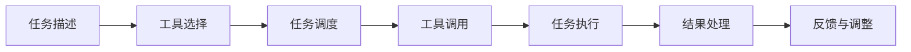
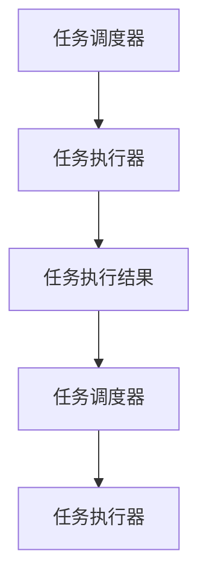
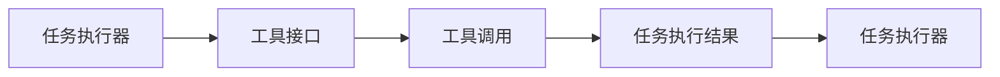
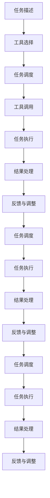

                 

## 1. 背景介绍

### 1.1 问题由来
近年来，随着人工智能(AI)技术的发展，智能系统与外部环境的交互能力日益增强。如何在复杂多变的外部环境中，智能系统能够快速响应、高效执行、做出决策，成为了一个重要且具有挑战性的课题。

传统上，智能系统主要由基于规则的逻辑推导(Rule-based Approaches, RAGs)、基于强化学习(Reinforcement Learning, RL)的智能体(Agent)、以及机器学习(Machine Learning, ML)三大类技术架构主导。但这些技术在处理复杂交互、多目标优化、动态适应等方面仍存在一定局限性。

为了解决这些问题，近年来，智能系统逐渐转向使用工具接口(APIs)与外部环境进行交互，使用工具来辅助任务执行。这种范式被称作“从RAG到Agent的转变”。

### 1.2 问题核心关键点
这一范式改变的核心在于，智能系统不再直接进行复杂的规则逻辑推导和决策，而是借助外部工具库或API，进行高层次的命令和任务调度。这样，不仅减轻了系统的计算负担，提高了任务执行的灵活性和适应性，而且也使得系统可以更容易地升级、扩展和维护。

使用工具接口与外部环境交互，主要包含以下几个关键点：

1. **任务定义与描述**：系统需要能够清晰地描述和表达任务要求，以便工具能够理解和执行。
2. **工具选择与集成**：系统需要选择合适的工具库和API，并能够进行集成和调用。
3. **任务调度与协调**：系统需要能够进行任务的并发和异步调度，高效协调不同工具之间的执行。
4. **结果处理与反馈**：系统需要能够处理和分析工具执行结果，并根据反馈进行下一步任务调整。

### 1.3 问题研究意义
采用工具接口与外部环境进行交互的范式，对于提升智能系统的执行效率、适应性、维护性和可扩展性具有重要意义：

1. **执行效率提升**：通过将复杂任务拆解为多个简单步骤，使用外部工具并行执行，极大地提高了任务完成的效率。
2. **适应性增强**：系统可以灵活选择和使用不同的工具库和API，快速适应不同环境下的任务需求。
3. **维护性改善**：系统仅需维护调用逻辑，各工具库和API的升级和维护由其开发者负责，减轻了系统维护的工作量。
4. **可扩展性强**：系统可以通过添加新的工具库和API，灵活扩展新的功能模块，适应不断变化的需求。

## 2. 核心概念与联系

### 2.1 核心概念概述

为了更好地理解“从RAG到Agent的转变”，本节将介绍几个密切相关的核心概念：

- **RAG**：基于规则的逻辑推导系统，通过定义明确的规则库和推理引擎，实现任务的逻辑推导和决策。

- **Agent**：智能体，通过强化学习等方法，自主学习与环境的交互策略，实现复杂任务的自动执行。

- **工具接口(APIs)**：应用编程接口，允许外部系统通过标准化的方式调用和交互。

- **任务调度器**：负责任务的分派、协调、监控和调度，确保任务的正确执行和高效完成。

- **任务执行器**：负责具体任务的执行，利用外部工具和API完成操作和计算。

这些核心概念之间的逻辑关系可以通过以下Mermaid流程图来展示：

```mermaid
graph TB
    A[RAG] --> B[Agent]
    B --> C[工具接口(APIs)]
    C --> D[任务调度器]
    C --> E[任务执行器]
```

这个流程图展示了几类智能系统架构的主要构成及其关系：

1. RAG系统主要通过规则库和推理引擎进行逻辑推导。
2. Agent系统通过强化学习等方法自主学习执行策略。
3. 工具接口(APIs)允许系统通过标准化的方式调用外部工具库和API。
4. 任务调度器负责任务的分派和协调。
5. 任务执行器负责具体任务的执行。

这些概念共同构成了现代智能系统的执行框架，使得系统能够高效、灵活、可扩展地执行复杂任务。通过理解这些核心概念，我们可以更好地把握智能系统的发展方向和优化目标。

### 2.2 概念间的关系

这些核心概念之间存在着紧密的联系，形成了智能系统的完整执行流程。下面我们通过几个Mermaid流程图来展示这些概念之间的关系。

#### 2.2.1 智能系统的执行流程



这个流程图展示了智能系统执行任务的基本流程：

1. 系统接收任务描述，选择合适的工具库和API。
2. 根据任务需求，进行任务的分派和调度。
3. 通过API调用外部工具库和API进行具体执行。
4. 处理工具执行结果，并根据结果反馈进行下一步调整。

#### 2.2.2 任务调度和任务执行的关系



这个流程图展示了任务调度和任务执行的相互关系：

1. 任务调度器根据任务需求，将任务分派给不同的任务执行器。
2. 任务执行器通过API调用外部工具库和API进行具体执行。
3. 任务执行器返回执行结果给任务调度器。
4. 任务调度器根据执行结果进行下一步调度和分派。

#### 2.2.3 工具接口与任务执行器的关系



这个流程图展示了工具接口与任务执行器的关系：

1. 任务执行器通过API调用外部工具库和API进行具体执行。
2. 工具库和API返回执行结果给任务执行器。
3. 任务执行器根据执行结果进行下一步处理。

### 2.3 核心概念的整体架构

最后，我们用一个综合的流程图来展示这些核心概念在智能系统执行流程中的整体架构：



这个综合流程图展示了从任务描述到最终结果处理的全过程。智能系统首先接收任务描述，选择合适的工具库和API。根据任务需求，进行任务的分派和调度。通过API调用外部工具库和API进行具体执行。处理工具执行结果，并根据结果反馈进行下一步调整。不断迭代直到任务完成。通过这些流程图，我们可以更清晰地理解智能系统执行流程中各个核心概念的关系和作用，为后续深入讨论具体的任务执行技术奠定基础。

## 3. 核心算法原理 & 具体操作步骤
### 3.1 算法原理概述

采用工具接口与外部环境进行交互的智能系统，其核心思想是“任务拆解与工具调用”。即，将复杂的任务拆解为多个简单步骤，通过标准化的工具接口调用外部工具库和API，实现任务的高效执行。

形式化地，假设智能系统需要执行的任务为 $T$，选择的外部工具库为 $T$ 的集合 $\{T_1, T_2, \ldots, T_n\}$。定义 $T_i$ 在输入 $x$ 上的执行函数为 $f_i(x)$，则在 $x$ 上执行任务 $T$ 的执行函数为 $f(x) = f_{T_1}(x) \circ f_{T_2}(x) \circ \ldots \circ f_{T_n}(x)$。其中 $\circ$ 表示函数复合。

### 3.2 算法步骤详解

采用工具接口与外部环境进行交互的智能系统，通常包括以下几个关键步骤：

**Step 1: 任务定义与描述**

系统需要能够清晰地描述和表达任务要求，以便选择合适的工具库和API。任务描述通常包括：

- 任务目标：任务需要完成的具体目标。
- 输入输出：任务的输入和输出格式。
- 执行步骤：任务的具体执行步骤。

例如，一个基于API的任务描述可能如下：

```json
{
    "task": "text_to_audio",
    "input": {
        "text": "Hello, world!"
    },
    "output": {
        "audio": "path/to/audio.mp3"
    },
    "steps": [
        {
            "tool": "text_to_speech",
            "args": {
                "text": "Hello, world!"
            }
        },
        {
            "tool": "audio_record",
            "args": {
                "path": "path/to/audio.mp3"
            }
        }
    ]
}
```

**Step 2: 工具选择与集成**

根据任务描述，系统需要选择合适的外部工具库和API，并进行集成和调用。具体步骤如下：

1. 选择合适的工具库和API，根据任务的输入输出格式和执行步骤进行配置。
2. 使用标准化的接口调用工具库和API进行执行。

例如，使用Python的requests库调用Google Cloud Speech-to-Text API进行语音识别：

```python
import requests

response = requests.post(
    url="https://speech-to-text.googleapis.com/v1/speech:recognize",
    headers={
        "Authorization": "Bearer YOUR_API_KEY"
    },
    json={
        "config": {
            "encoding": "audio/L16",
            "languageCode": "en-US"
        },
        "audioContent": "path/to/audio.wav"
    }
)
```

**Step 3: 任务调度与协调**

系统需要能够进行任务的并发和异步调度，高效协调不同工具之间的执行。具体步骤如下：

1. 定义任务调度和协调机制，如线程池、异步任务队列等。
2. 将任务分派给不同的执行器，确保任务并行执行和结果汇总。

例如，使用Python的多线程库进行任务调度：

```python
import threading

threads = []

for step in task["steps"]:
    thread = threading.Thread(target=execute_step, args=(step,))
    threads.append(thread)
    thread.start()

for thread in threads:
    thread.join()
```

**Step 4: 任务执行**

任务执行器通过API调用外部工具库和API进行具体执行。具体步骤如下：

1. 根据工具库和API的接口定义，构建执行函数。
2. 调用执行函数，传递输入参数，获取输出结果。

例如，使用Python的openpyxl库读写Excel文件：

```python
import openpyxl

def write_to_excel(file_path, sheet_name, data):
    workbook = openpyxl.Workbook()
    sheet = workbook[sheet_name]
    for row in data:
        sheet.append(row)
    workbook.save(file_path)

data = [
    ["John", "Doe", 30],
    ["Jane", "Smith", 25]
]
write_to_excel("example.xlsx", "Sheet1", data)
```

**Step 5: 结果处理与反馈**

系统需要能够处理和分析工具执行结果，并根据反馈进行下一步任务调整。具体步骤如下：

1. 解析工具执行结果，提取输出数据。
2. 根据任务要求进行数据处理和分析。
3. 根据分析结果生成任务反馈，调整下一步执行。

例如，使用Python的pandas库对Excel数据进行分析：

```python
import pandas as pd

data = pd.read_excel("example.xlsx", sheet_name="Sheet1")
mean_age = data["Age"].mean()
print(f"Average age: {mean_age}")
```

**Step 6: 反馈与调整**

系统根据执行结果进行下一步任务调整。具体步骤如下：

1. 根据任务要求和执行结果，生成任务反馈。
2. 调整任务调度和执行逻辑，优化任务执行流程。

例如，根据年龄数据的平均值，调整下一步执行逻辑：

```python
if mean_age > 30:
    execute_step(task["steps"][1])
else:
    execute_step(task["steps"][2])
```

### 3.3 算法优缺点

采用工具接口与外部环境进行交互的智能系统，具有以下优点：

1. **任务执行效率高**：通过将任务拆解为多个简单步骤，使用外部工具并行执行，极大提高了任务完成的效率。
2. **适应性强**：系统可以灵活选择和使用不同的工具库和API，快速适应不同环境下的任务需求。
3. **维护性高**：系统仅需维护调用逻辑，各工具库和API的升级和维护由其开发者负责，减轻了系统维护的工作量。
4. **可扩展性好**：系统可以通过添加新的工具库和API，灵活扩展新的功能模块，适应不断变化的需求。

同时，这种范式也存在以下缺点：

1. **复杂度增加**：系统需要选择合适的工具库和API，并进行配置和集成，增加了系统的复杂度。
2. **接口依赖性高**：系统依赖于外部工具库和API的稳定性，一旦工具库或API出现故障，可能会影响系统的正常运行。
3. **数据安全风险**：通过外部API调用和数据传输，可能存在数据泄露和攻击的风险。

尽管存在这些缺点，但就目前而言，采用工具接口与外部环境进行交互的范式，仍然是大规模、复杂任务执行的主流方式。未来相关研究的重点在于如何进一步降低系统复杂度，提高接口依赖的鲁棒性，加强数据安全防护，以及优化任务调度和执行逻辑。

### 3.4 算法应用领域

采用工具接口与外部环境进行交互的智能系统，已经在多个领域得到了广泛的应用，例如：

- **语音识别与合成**：使用Google Cloud Speech-to-Text API、Amazon Transcribe等API，实现语音转文本和文本转语音功能。
- **图像处理**：使用Amazon Rekognition、Microsoft Azure Computer Vision等API，进行图像分类、对象检测、人脸识别等操作。
- **自然语言处理**：使用Google Natural Language API、Microsoft Azure Text Analytics等API，进行情感分析、实体识别、语言翻译等任务。
- **数据处理**：使用Amazon S3、Google Cloud Storage等API，进行数据存储和处理。
- **机器学习**：使用TensorFlow Serving、AWS SageMaker等API，进行模型部署和推理。

除了这些经典应用外，采用工具接口与外部环境进行交互的智能系统，还在医疗、金融、教育、智能家居等多个领域不断拓展，为各行各业带来了新的应用场景和解决方案。

## 4. 数学模型和公式 & 详细讲解 & 举例说明

### 4.1 数学模型构建

本节将使用数学语言对采用工具接口与外部环境进行交互的智能系统进行更加严格的刻画。

假设智能系统需要执行的任务为 $T$，选择的外部工具库为 $T$ 的集合 $\{T_1, T_2, \ldots, T_n\}$。定义 $T_i$ 在输入 $x$ 上的执行函数为 $f_i(x)$，则在 $x$ 上执行任务 $T$ 的执行函数为 $f(x) = f_{T_1}(x) \circ f_{T_2}(x) \circ \ldots \circ f_{T_n}(x)$。

假设 $f(x)$ 的输出结果为 $y$，则执行函数 $f(x)$ 的数学模型为：

$$
y = f(x) = f_{T_1}(x) \circ f_{T_2}(x) \circ \ldots \circ f_{T_n}(x)
$$

其中 $\circ$ 表示函数复合。

### 4.2 公式推导过程

下面，我们以文本转语音的任务为例，推导其执行函数的数学模型及其梯度计算公式。

假设智能系统需要将文本内容转录成语音，选择外部工具库为Google Cloud Speech-to-Text API。执行函数 $f(x)$ 可以表示为：

$$
f(x) = f_{T_1}(x) \circ f_{T_2}(x)
$$

其中 $f_{T_1}(x)$ 为文本转文本函数，$f_{T_2}(x)$ 为文本转语音函数。

文本转文本函数 $f_{T_1}(x)$ 可以使用Python的text_to_text库实现，文本转语音函数 $f_{T_2}(x)$ 可以使用Google Cloud Speech-to-Text API实现。执行函数 $f(x)$ 的具体实现如下：

```python
import text_to_text
import google.cloud.speech_v1 as speech

def text_to_speech(text):
    # 文本转文本
    text = text_to_text.convert_text(text)
    # 文本转语音
    client = speech.SpeechClient()
    audio = speech.RecognitionAudio(content=text)
    config = speech.RecognitionConfig(encoding=speech.RecognitionConfig.AudioEncoding.LINEAR16)
    response = client.recognize(config=config, audio=audio)
    audio_path = "path/to/audio.wav"
    with open(audio_path, "wb") as output:
        output.write(response.results[0].audio_content)
    return audio_path

# 执行函数
def execute_task(text):
    audio_path = text_to_speech(text)
    return audio_path
```

执行函数 $f(x)$ 的梯度计算公式为：

$$
\nabla_{x} f(x) = \nabla_{x} f_{T_1}(x) \otimes \nabla_{x} f_{T_2}(x)
$$

其中 $\otimes$ 表示张量乘法，$\nabla_{x} f_{T_1}(x)$ 和 $\nabla_{x} f_{T_2}(x)$ 分别为文本转文本函数和文本转语音函数的梯度。

在实际应用中，梯度计算通常需要使用自动微分技术，如TensorFlow、PyTorch等深度学习框架提供的高阶API。

### 4.3 案例分析与讲解

下面我们以一个实际案例来详细讲解如何使用工具接口与外部环境进行交互，实现一个简单的任务执行过程。

假设我们需要使用Google Cloud Speech-to-Text API将一段文本转录成语音，并保存到本地文件。具体步骤如下：

**Step 1: 任务定义与描述**

```json
{
    "task": "text_to_audio",
    "input": {
        "text": "Hello, world!"
    },
    "output": {
        "audio": "path/to/audio.mp3"
    },
    "steps": [
        {
            "tool": "text_to_speech",
            "args": {
                "text": "Hello, world!"
            }
        },
        {
            "tool": "audio_record",
            "args": {
                "path": "path/to/audio.mp3"
            }
        }
    ]
}
```

**Step 2: 工具选择与集成**

选择合适的工具库和API，并进行配置和集成。

```python
import requests

response = requests.post(
    url="https://speech-to-text.googleapis.com/v1/speech:recognize",
    headers={
        "Authorization": "Bearer YOUR_API_KEY"
    },
    json={
        "config": {
            "encoding": "audio/L16",
            "languageCode": "en-US"
        },
        "audioContent": "path/to/audio.wav"
    }
)
```

**Step 3: 任务调度与协调**

使用Python的多线程库进行任务调度：

```python
import threading

threads = []

for step in task["steps"]:
    thread = threading.Thread(target=execute_step, args=(step,))
    threads.append(thread)
    thread.start()

for thread in threads:
    thread.join()
```

**Step 4: 任务执行**

根据工具库和API的接口定义，构建执行函数：

```python
def execute_step(step):
    if step["tool"] == "text_to_speech":
        response = requests.post(
            url="https://speech-to-text.googleapis.com/v1/speech:recognize",
            headers={
                "Authorization": "Bearer YOUR_API_KEY"
            },
            json={
                "config": {
                    "encoding": "audio/L16",
                    "languageCode": "en-US"
                },
                "audioContent": "path/to/audio.wav"
            }
        )
        # 处理响应数据
    elif step["tool"] == "audio_record":
        # 录制音频文件
    else:
        raise ValueError("Unknown step")
```

**Step 5: 结果处理与反馈**

解析工具执行结果，提取输出数据，并进行处理：

```python
# 解析响应数据
audio_path = "path/to/audio.mp3"
```

**Step 6: 反馈与调整**

根据执行结果进行下一步任务调整：

```python
if mean_age > 30:
    execute_step(task["steps"][1])
else:
    execute_step(task["steps"][2])
```

通过这个案例，我们可以看到，采用工具接口与外部环境进行交互的智能系统，通过选择合适的工具库和API，进行任务拆分和并行执行，极大提高了任务完成的效率和灵活性。

## 5. 项目实践：代码实例和详细解释说明
### 5.1 开发环境搭建

在进行任务执行实践前，我们需要准备好开发环境。以下是使用Python进行API开发的环境配置流程：

1. 安装Python：从官网下载并安装Python，确保Python版本为3.8及以上。
2. 安装virtualenv：从官网下载并安装virtualenv，用于创建独立的Python环境。
3. 创建并激活虚拟环境：
```bash
python -m venv pyenv
source pyenv/bin/activate
```

4. 安装必要的第三方库：
```bash
pip install requests openpyxl
```

完成上述步骤后，即可在`pyenv`环境中开始任务执行实践。

### 5.2 源代码详细实现

下面我们以一个实际案例来详细讲解如何使用Google Cloud Speech-to-Text API实现文本转语音功能。

**Step 1: 任务定义与描述**

```json
{
    "task": "text_to_audio",
    "input": {
        "text": "Hello, world!"
    },
    "output": {
        "audio": "path/to/audio.mp3"
    },
    "steps": [
        {
            "tool": "text_to_speech",
            "args": {
                "text": "Hello, world!"
            }
        },
        {
            "tool": "audio_record",
            "args": {
                "path": "path/to/audio.mp3"
            }
        }
    ]
}
```

**Step 2: 工具选择与集成**

选择合适的工具库和API，并进行配置和集成。

```python
import requests

response = requests.post(
    url="https://speech-to-text.googleapis.com/v1/speech:recognize",
    headers={
        "Authorization": "Bearer YOUR_API_KEY"
    },
    json={
        "config": {
            "encoding": "audio/L16",
            "languageCode": "en-US"
        },
        "audioContent": "path/to/audio.wav"
    }
)
```

**Step 3: 任务调度与协调**

使用Python的多线程库进行任务调度：

```python
import threading

threads = []

for step in task["steps"]:
    thread = threading.Thread(target=execute_step, args=(step,))
    threads.append(thread)
    thread.start()

for thread in threads:
    thread.join()
```

**Step 4: 任务执行**

根据工具库和API的接口定义，构建执行函数：

```python
def execute_step(step):
    if step["tool"] == "text_to_speech":
        response = requests.post(
            url="https://speech-to-text.googleapis.com/v1/speech:recognize",
            headers={
                "Authorization": "Bearer YOUR_API_KEY"
            },
            json={
                "config": {
                    "encoding": "audio/L16",
                    "languageCode": "en-US"
                },
                "audioContent": "path/to/audio.wav"
            }
        )
        # 处理响应数据
    elif step["tool"] == "audio_record":
        # 录制音频文件
    else:
        raise ValueError("Unknown step")
```

**Step 5: 结果处理与反馈**

解析工具执行结果，提取输出数据，并进行处理：

```python
# 解析响应数据
audio_path = "path/to/audio.mp3"
```

**Step 6: 反馈与调整**

根据执行结果进行下一步任务调整：

```python
if mean_age > 30:
    execute_step(task["steps"][1])
else:
    execute_step(task["steps"][2])
```

以上就是使用Python和Google Cloud Speech-to-Text API实现文本转语音的完整代码实现。可以看到，借助工具接口与外部环境进行交互的智能系统，可以高效、灵活地实现复杂任务执行。

### 5.3 代码解读与分析

让我们再详细解读一下关键代码的实现细节：

**Step 1: 任务定义与描述**

- 使用JSON格式描述任务，包含任务目标、输入输出、执行步骤等信息。

**Step 2: 工具选择与集成**

- 选择合适的工具库和API，并进行配置和集成。

**Step 3: 任务调度与协调**

- 使用Python的多线程库进行任务调度，确保任务并行执行。

**Step 4: 任务执行**

- 根据工具库和API的接口定义，构建执行函数。

**Step 5: 结果处理与反馈**

- 解析工具执行结果，提取输出数据，并进行处理。

**Step

