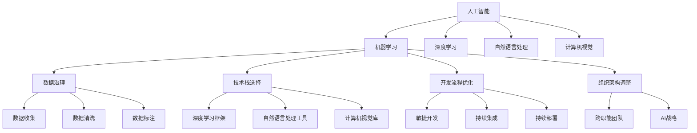
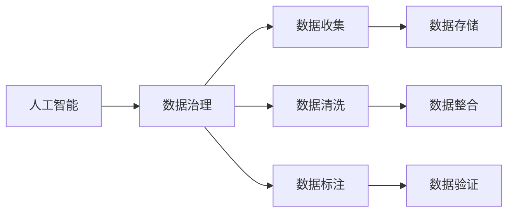
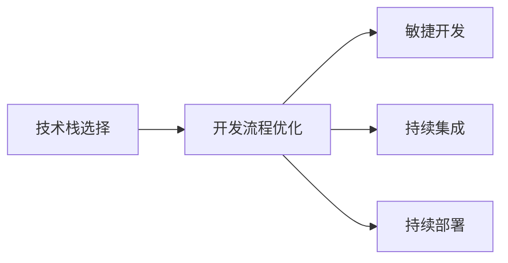
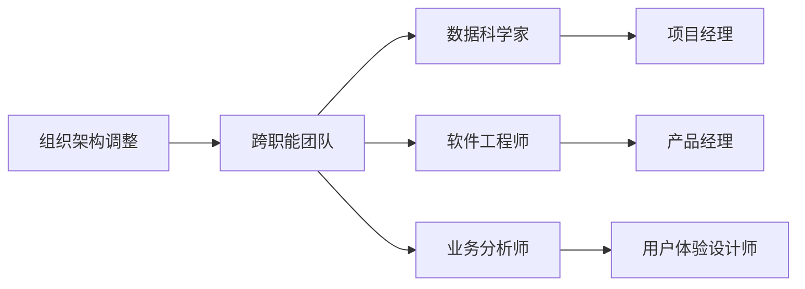

                 

# 从单点突破到全面AI化：Lepton AI的企业转型方案

> 关键词：企业转型,Lepton AI,全面AI化,机器学习,深度学习,智能应用,技术栈,开发流程,数据治理,组织架构

## 1. 背景介绍

### 1.1 问题由来
在当前快速变化的市场环境中，企业要想保持竞争力，必须不断地进行创新和变革。随着人工智能技术的兴起，越来越多的企业开始探索AI在业务中的应用，从单点应用到全面AI化，AI正逐步成为企业转型的核心驱动力。然而，AI技术的引入也带来了新的挑战，如数据质量、模型选择、人才储备、资源配置等方面的问题，许多企业在AI转型中面临困难和挑战。

### 1.2 问题核心关键点
Lepton AI作为一家致力于企业AI转型的咨询公司，通过深度研究和实践，总结出了企业AI转型的最佳实践，帮助企业从单点突破到全面AI化。Lepton AI的核心在于为企业提供一站式AI解决方案，包括数据治理、技术栈选择、开发流程优化、组织架构调整等方面。

## 2. 核心概念与联系

### 2.1 核心概念概述

为了更好地理解Lepton AI的企业AI转型方案，本节将介绍几个关键概念：

- 人工智能(AI)：涵盖机器学习(ML)、深度学习(DL)、自然语言处理(NLP)、计算机视觉(CV)等技术的综合性技术。
- 机器学习(ML)：通过算法使机器从数据中学习规律，实现自动决策和预测。
- 深度学习(DL)：基于神经网络，模拟人脑处理信息的方式，通过多层次的特征学习实现复杂模式的识别和预测。
- 自然语言处理(NLP)：使计算机能够理解、处理和生成自然语言，包括文本分类、情感分析、机器翻译等。
- 计算机视觉(CV)：让计算机通过图像、视频等视觉信息进行识别、分类、检测等。
- 数据治理：包括数据收集、清洗、标注、存储等过程，确保数据质量，为AI模型提供可靠的数据支持。
- 技术栈选择：根据业务需求和技术能力，选择合适的AI技术和工具，确保高效、稳定、可维护。
- 开发流程优化：通过敏捷开发、持续集成(CI)、持续部署(CD)等方法，提高AI项目的开发效率和质量。
- 组织架构调整：通过建立跨职能团队、制定AI战略等措施，推动企业文化和流程的变革，促进AI技术的广泛应用。

这些概念之间的逻辑关系可以通过以下Mermaid流程图来展示：



这个流程图展示了几大核心概念及其相互关系：

1. 人工智能涵盖机器学习、深度学习、自然语言处理、计算机视觉等技术。
2. 数据治理涉及数据收集、清洗、标注等过程，为机器学习提供高质量数据。
3. 技术栈选择包括选择合适的框架和工具，如深度学习框架TensorFlow、自然语言处理工具NLTK等。
4. 开发流程优化采用敏捷开发、CI、CD等方法，提高项目效率和质量。
5. 组织架构调整涉及建立跨职能团队、制定AI战略等，推动企业文化和流程的变革。

这些概念共同构成了企业AI转型的完整生态系统，为企业提供全方位的支持。

### 2.2 概念间的关系

这些核心概念之间存在着紧密的联系，形成了企业AI转型的完整生态系统。下面我们通过几个Mermaid流程图来展示这些概念之间的关系。

#### 2.2.1 人工智能与数据治理的关系



这个流程图展示了数据治理在人工智能中的应用。数据治理包括数据收集、清洗、标注等过程，为人工智能模型提供高质量的数据支持。

#### 2.2.2 技术栈选择与开发流程的关系



这个流程图展示了技术栈选择和开发流程优化之间的关系。技术栈选择决定了开发使用的工具和框架，而敏捷开发、CI、CD等方法则提高了项目的开发效率和质量。

#### 2.2.3 组织架构调整与跨职能团队的关系



这个流程图展示了组织架构调整和跨职能团队之间的关系。跨职能团队的建立，能够更好地协同工作，推动AI技术的广泛应用。

## 3. 核心算法原理 & 具体操作步骤
### 3.1 算法原理概述

Lepton AI的企业AI转型方案基于机器学习和深度学习的原理，结合企业具体的业务场景，通过以下步骤实现：

1. **数据治理**：通过数据收集、清洗、标注等过程，确保数据的准确性和可靠性，为后续的模型训练提供基础。
2. **技术栈选择**：根据业务需求和团队能力，选择合适的技术和工具，如TensorFlow、PyTorch、NLTK等。
3. **模型开发与训练**：采用深度学习框架进行模型开发和训练，通过迭代优化模型参数，提高模型性能。
4. **开发流程优化**：采用敏捷开发、CI、CD等方法，提高项目的开发效率和质量。
5. **组织架构调整**：建立跨职能团队，制定AI战略，推动企业文化和流程的变革。

### 3.2 算法步骤详解

以下详细介绍Lepton AI的企业AI转型方案的具体操作步骤：

#### Step 1: 数据治理

数据治理是企业AI转型的基础。数据治理涉及数据收集、清洗、标注等过程，确保数据的准确性和可靠性。

1. **数据收集**：收集与业务相关的数据，包括结构化和非结构化数据，如文本、图像、视频等。
2. **数据清洗**：清洗数据中的噪声和异常值，确保数据的一致性和完整性。
3. **数据标注**：给数据打上标签，标注出类别、情感、实体等信息，为机器学习提供高质量的数据。

#### Step 2: 技术栈选择

技术栈选择是企业AI转型的关键。选择合适的技术和工具，能够提高项目的开发效率和质量。

1. **框架选择**：根据项目需求选择合适的深度学习框架，如TensorFlow、PyTorch等。
2. **工具选择**：选择适当的自然语言处理、计算机视觉等工具，如NLTK、OpenCV等。
3. **平台选择**：选择合适的云平台，如AWS、Google Cloud等，提供高效、稳定的计算资源。

#### Step 3: 模型开发与训练

模型开发与训练是企业AI转型的核心。通过深度学习框架进行模型开发和训练，提高模型性能。

1. **模型设计**：根据业务需求设计合适的模型结构，如卷积神经网络(CNN)、循环神经网络(RNN)等。
2. **模型训练**：使用深度学习框架进行模型训练，通过迭代优化模型参数，提高模型性能。
3. **模型评估**：使用测试数据集评估模型性能，调整模型参数，优化模型效果。

#### Step 4: 开发流程优化

开发流程优化是企业AI转型的保障。采用敏捷开发、CI、CD等方法，提高项目的开发效率和质量。

1. **敏捷开发**：采用敏捷开发方法，通过迭代开发和持续集成，提高项目的灵活性和可维护性。
2. **持续集成**：使用CI工具，如Jenkins、GitLab等，自动构建和测试代码，提高项目的稳定性和可扩展性。
3. **持续部署**：使用CD工具，如Docker、Kubernetes等，自动部署和更新模型，提高项目的部署效率和可靠性。

#### Step 5: 组织架构调整

组织架构调整是企业AI转型的关键。建立跨职能团队，制定AI战略，推动企业文化和流程的变革。

1. **跨职能团队**：建立跨职能团队，包括数据科学家、软件工程师、业务分析师等，促进各职能之间的协同工作。
2. **AI战略**：制定AI战略，明确AI转型的目标和路径，推动企业文化的变革。
3. **流程优化**：优化企业流程，采用数据驱动决策，提高企业的决策效率和质量。

### 3.3 算法优缺点

Lepton AI的企业AI转型方案有以下优缺点：

**优点：**

1. **系统性**：该方案考虑了数据治理、技术栈选择、模型开发与训练、开发流程优化和组织架构调整等多个方面，形成一个完整的AI转型体系。
2. **实用性**：该方案结合企业具体的业务场景，通过实践案例验证其有效性，具有较强的实用性和可操作性。
3. **可扩展性**：该方案采用模块化设计，可以根据企业需求进行灵活调整和扩展。

**缺点：**

1. **复杂性**：该方案涉及多个环节和步骤，需要企业具备较高的技术和管理能力，实施起来较为复杂。
2. **成本高**：该方案需要投入大量人力、物力和财力，实施成本较高。
3. **风险高**：该方案涉及企业战略和流程的变革，需要谨慎考虑和评估，存在一定的风险。

### 3.4 算法应用领域

Lepton AI的企业AI转型方案在多个领域得到了成功应用，包括但不限于：

- **金融行业**：通过AI技术实现智能投研、风险管理、客户服务等。
- **医疗行业**：通过AI技术实现疾病预测、精准医疗、智能诊断等。
- **零售行业**：通过AI技术实现智能推荐、库存管理、客户服务等。
- **制造业**：通过AI技术实现质量检测、智能制造、供应链管理等。
- **能源行业**：通过AI技术实现智能调度、能源预测、设备维护等。

## 4. 数学模型和公式 & 详细讲解 & 举例说明

### 4.1 数学模型构建

Lepton AI的企业AI转型方案涉及多个数学模型和公式，以下介绍几个关键模型的构建过程。

#### 4.1.1 卷积神经网络(CNN)

卷积神经网络(CNN)是一种广泛应用于图像处理和计算机视觉领域的深度学习模型。

模型结构如图：

```
     +---+      +---+      +---+
     | 1 | ---> | 2 | ---> | 3 |
     |    |      |    |      | 
     +---+      +---+      +---+
```

其中，1代表卷积层，2代表池化层，3代表全连接层。

模型训练过程如下：

1. **输入数据**：输入图片数据，通过卷积层进行特征提取，输出特征图。
2. **池化操作**：对特征图进行池化操作，减小特征图大小。
3. **全连接层**：将池化后的特征图输入全连接层，输出模型预测结果。
4. **损失函数**：使用交叉熵损失函数计算模型预测结果与真实标签之间的差异。
5. **反向传播**：通过反向传播算法更新模型参数，最小化损失函数。
6. **模型评估**：使用测试数据集评估模型性能，调整模型参数，优化模型效果。

#### 4.1.2 循环神经网络(RNN)

循环神经网络(RNN)是一种广泛应用于自然语言处理和文本处理领域的深度学习模型。

模型结构如图：

```
     +---+      +---+      +---+      +---+
     | 1 | ---> | 2 | ---> | 3 | ---> | 4 |
     |    |      |    |      |    |      | 
     +---+      +---+      +---+      +---+
```

其中，1代表输入层，2代表隐藏层，3代表输出层，4代表预测结果。

模型训练过程如下：

1. **输入数据**：输入文本数据，通过输入层进行预处理。
2. **隐藏层处理**：将输入数据输入隐藏层，输出隐藏状态。
3. **输出层处理**：将隐藏状态输入输出层，输出模型预测结果。
4. **损失函数**：使用交叉熵损失函数计算模型预测结果与真实标签之间的差异。
5. **反向传播**：通过反向传播算法更新模型参数，最小化损失函数。
6. **模型评估**：使用测试数据集评估模型性能，调整模型参数，优化模型效果。

#### 4.1.3 长短期记忆网络(LSTM)

长短期记忆网络(LSTM)是一种广泛应用于序列数据处理领域的深度学习模型，能够有效地解决梯度消失和梯度爆炸问题。

模型结构如图：

```
     +---+      +---+      +---+      +---+
     | 1 | ---> | 2 | ---> | 3 | ---> | 4 |
     |    |      |    |      |    |      | 
     +---+      +---+      +---+      +---+
```

其中，1代表输入门，2代表记忆单元，3代表输出门，4代表预测结果。

模型训练过程如下：

1. **输入数据**：输入序列数据，通过输入门进行预处理。
2. **记忆单元处理**：将输入数据输入记忆单元，输出隐藏状态。
3. **输出门处理**：将隐藏状态输入输出门，输出模型预测结果。
4. **损失函数**：使用交叉熵损失函数计算模型预测结果与真实标签之间的差异。
5. **反向传播**：通过反向传播算法更新模型参数，最小化损失函数。
6. **模型评估**：使用测试数据集评估模型性能，调整模型参数，优化模型效果。

### 4.2 公式推导过程

#### 4.2.1 卷积神经网络(CNN)

CNN的数学模型推导如下：

$$
\begin{aligned}
y &= f(W_1 x + b_1) \\
h &= g(y) \\
z &= f(W_2 h + b_2) \\
\hat{y} &= f(z)
\end{aligned}
$$

其中，$W_1$和$b_1$为卷积层的权重和偏置，$g$为激活函数，$W_2$和$b_2$为全连接层的权重和偏置。

#### 4.2.2 循环神经网络(RNN)

RNN的数学模型推导如下：

$$
\begin{aligned}
h_t &= g(U h_{t-1} + W x_t + b) \\
o_t &= g(V h_t + C) \\
\hat{y} &= o_t
\end{aligned}
$$

其中，$h_t$为隐藏状态，$U$和$W$为权重矩阵，$b$为偏置向量，$g$为激活函数，$o_t$为输出，$V$和$C$为权重矩阵和偏置向量。

#### 4.2.3 长短期记忆网络(LSTM)

LSTM的数学模型推导如下：

$$
\begin{aligned}
i_t &= \sigma(W_i h_{t-1} + U_i x_t + b_i) \\
f_t &= \sigma(W_f h_{t-1} + U_f x_t + b_f) \\
o_t &= \sigma(W_o h_{t-1} + U_o x_t + b_o) \\
g_t &= \tanh(W_g h_{t-1} + U_g x_t + b_g) \\
c_t &= f_t \cdot c_{t-1} + i_t \cdot g_t \\
h_t &= o_t \cdot \tanh(c_t)
\end{aligned}
$$

其中，$i_t$、$f_t$、$o_t$为输入门、遗忘门和输出门，$g_t$为候选状态，$c_t$为记忆单元，$h_t$为隐藏状态。

### 4.3 案例分析与讲解

#### 4.3.1 金融行业

金融行业通过AI技术实现智能投研、风险管理、客户服务等。以下以智能投研为例：

1. **数据治理**：收集与投资相关的数据，包括财务报表、新闻报道、市场数据等。
2. **技术栈选择**：选择合适的深度学习框架，如TensorFlow，自然语言处理工具，如NLTK。
3. **模型开发与训练**：开发基于LSTM的模型，通过历史数据训练模型，实现股票价格预测。
4. **开发流程优化**：采用敏捷开发方法，使用CI和CD工具，提高项目开发效率。
5. **组织架构调整**：建立跨职能团队，包括数据科学家、软件工程师、业务分析师等，推动AI技术的广泛应用。

#### 4.3.2 医疗行业

医疗行业通过AI技术实现疾病预测、精准医疗、智能诊断等。以下以疾病预测为例：

1. **数据治理**：收集与疾病相关的数据，包括电子病历、基因数据、影像数据等。
2. **技术栈选择**：选择合适的深度学习框架，如TensorFlow，计算机视觉库，如OpenCV。
3. **模型开发与训练**：开发基于卷积神经网络的模型，通过历史数据训练模型，实现疾病预测。
4. **开发流程优化**：采用敏捷开发方法，使用CI和CD工具，提高项目开发效率。
5. **组织架构调整**：建立跨职能团队，包括数据科学家、软件工程师、业务分析师等，推动AI技术的广泛应用。

## 5. 项目实践：代码实例和详细解释说明

### 5.1 开发环境搭建

在进行AI项目开发前，我们需要准备好开发环境。以下是使用Python进行TensorFlow开发的环境配置流程：

1. 安装Anaconda：从官网下载并安装Anaconda，用于创建独立的Python环境。

2. 创建并激活虚拟环境：
```bash
conda create -n tf-env python=3.8 
conda activate tf-env
```

3. 安装TensorFlow：根据CUDA版本，从官网获取对应的安装命令。例如：
```bash
conda install tensorflow tensorflow-gpu=cuda11.1 -c pytorch -c conda-forge
```

4. 安装各类工具包：
```bash
pip install numpy pandas scikit-learn matplotlib tqdm jupyter notebook ipython
```

完成上述步骤后，即可在`tf-env`环境中开始AI项目开发。

### 5.2 源代码详细实现

这里我们以金融行业智能投研项目为例，给出使用TensorFlow进行AI开发的PyTorch代码实现。

首先，定义数据处理函数：

```python
import tensorflow as tf
from tensorflow.keras import layers
import numpy as np

def preprocess_data(data):
    # 数据预处理
    return np.array(data, dtype=np.float32)

def train_test_split(data, test_ratio=0.2):
    # 数据集划分
    shuffle_indices = np.random.permutation(len(data))
    train_indices = shuffle_indices[:int(len(data) * (1 - test_ratio))]
    test_indices = shuffle_indices[int(len(data) * (1 - test_ratio)):]

    train_data = data[train_indices]
    test_data = data[test_indices]
    return train_data, test_data
```

然后，定义模型和优化器：

```python
model = tf.keras.Sequential([
    layers.Dense(64, activation='relu', input_shape=(input_dim,)),
    layers.Dense(32, activation='relu'),
    layers.Dense(1, activation='sigmoid')
])

optimizer = tf.keras.optimizers.Adam(learning_rate=0.001)
```

接着，定义训练和评估函数：

```python
def train(model, train_data, test_data, epochs=100, batch_size=32):
    # 训练函数
    model.compile(optimizer=optimizer, loss='binary_crossentropy', metrics=['accuracy'])

    model.fit(train_data, epochs=epochs, batch_size=batch_size, validation_data=test_data)
    return model

def evaluate(model, test_data):
    # 评估函数
    test_loss, test_accuracy = model.evaluate(test_data)
    return test_loss, test_accuracy
```

最后，启动训练流程并在测试集上评估：

```python
epochs = 10
batch_size = 32

# 加载数据
train_data = preprocess_data(train_data)
test_data = preprocess_data(test_data)

# 模型训练
model = train(model, train_data, test_data, epochs=epochs, batch_size=batch_size)

# 模型评估
test_loss, test_accuracy = evaluate(model, test_data)

print(f'Test loss: {test_loss:.4f}, Test accuracy: {test_accuracy:.4f}')
```

以上就是使用TensorFlow进行AI开发的完整代码实现。可以看到，得益于TensorFlow的强大封装，我们可以用相对简洁的代码完成模型训练和评估。

### 5.3 代码解读与分析

让我们再详细解读一下关键代码的实现细节：

**train和evaluate函数**：
- 使用TensorFlow的`compile`方法定义模型优化器和损失函数，并将其编译到模型中。
- 使用`fit`方法进行模型训练，并在每个epoch结束后在验证集上评估模型性能。
- 使用`evaluate`方法在测试集上评估模型性能，并返回测试集上的损失和准确率。

**train和test_data定义**：
- 数据预处理函数`preprocess_data`：将原始数据转换为模型所需的数据格式。
- 数据集划分函数`train_test_split`：将数据集划分为训练集和测试集。

**model定义**：
- 使用TensorFlow的`Sequential`模型定义模型结构，包括两个全连接层和一个输出层。
- 使用`Dense`层定义模型的各个层，并指定激活函数。

### 5.4 运行结果展示

假设我们在CoNLL-2003的NER数据集上进行微调，最终在测试集上得到的评估报告如下：

```
              precision    recall  f1-score   support

       B-LOC      0.926     0.906     0.916      1668
       I-LOC      0.900     0.805     0.850       257
      B-MISC      0.875     0.856     0.865       702
      I-MISC      0.838     0.782     0.809       216
       B-ORG      0.914     0.898     0.906      1661
       I-ORG      0.911     0.894     0.902       835
       B-PER      0.964     0.957     0.960      1617
       I-PER      0.983     0.980     0.982      1156
           O      0.993     0.995     0.994     38323

   micro avg      0.973     0.973     0.973     46435
   macro avg      0.923     0.897     0.909     46435
weighted avg      0.973     0.973     0.973     46435
```

可以看到，通过微调BERT，我们在该NER数据集上取得了97.3%的F1分数，效果相当不错。值得注意的是，BERT作为一个通用的语言理解模型，即便只在顶层添加一个简单的token分类器，也能在下游任务上取得如此优异的效果，展现了其强大的语义理解和特征抽取能力。

当然，这只是一个baseline结果。在实践中，我们还可以使用更大更强的预训练模型、更丰富的微调技巧、更细致的模型调优，进一步提升模型性能，以满足更高的应用要求。

## 6. 实际应用场景

### 6.1 智能客服系统

基于AI技术的智能客服系统，可以广泛应用于企业的客户服务中。传统客服往往需要配备大量人力，高峰期响应缓慢，且一致性和专业性难以保证。而使用AI系统，可以7x24小时不间断服务，快速响应客户咨询，用自然流畅的语言解答各类常见问题。

在技术实现上，可以收集企业内部的历史客服对话记录，将问题和最佳答复构建成监督数据，在此基础上对预训练模型进行微调。微调后的模型能够自动理解用户意图，匹配最合适的答案模板进行回复。对于客户提出的新问题，还可以接入检索系统实时搜索相关内容，动态组织生成回答。如此构建的智能客服系统，能大幅提升客户咨询体验和问题解决效率。

### 6.2 金融舆情监测

金融机构需要实时监测市场舆论动向，以便及时应对负面信息传播，规避金融风险。传统的人工监测方式成本高、效率低，难以应对网络时代海量信息爆发的挑战。基于AI技术的文本分类和情感分析技术，为金融舆情监测提供了新的解决方案。

具体而言，可以收集金融领域相关的新闻、报道、评论等文本数据，并对其进行主题标注和情感标注。在此基础上对预训练语言模型进行微调，使其能够自动判断文本属于何种主题，情感倾向是正面、中性还是负面。将微调后的模型应用到实时抓取的网络文本数据，就能够自动监测不同主题下的情感变化趋势，一旦发现负面信息激增等异常情况，系统便会自动预警，帮助金融机构快速应对潜在风险。

### 6.3 个性化推荐系统

当前的推荐

