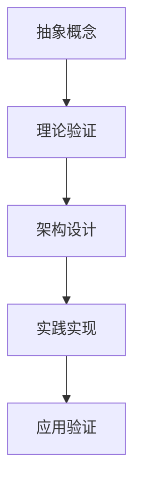
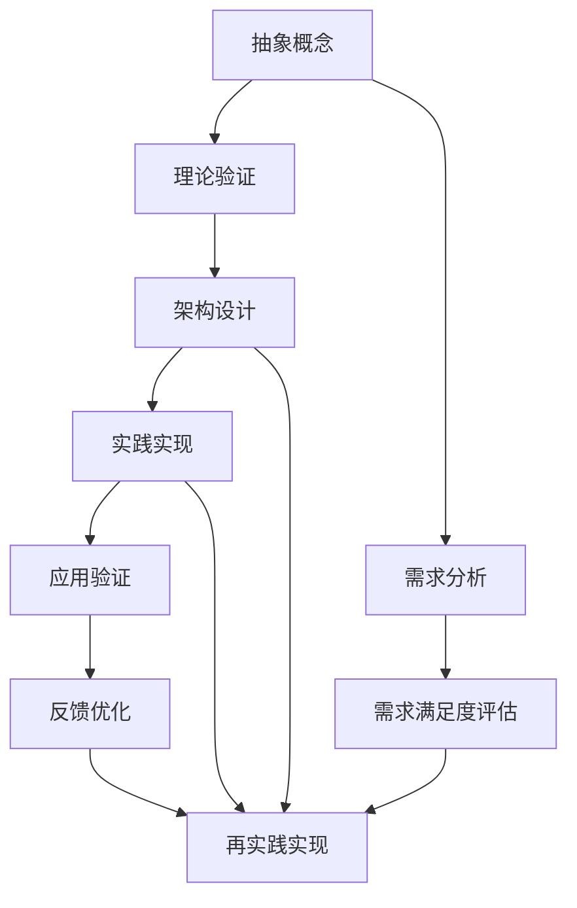

                 

# 从概念到实践：思想的转化

> 关键词：转化,思想,概念,实践,思想到实践

## 1. 背景介绍

在科技发展的长河中，思维的转化往往伴随着技术的突破。这种转化，从概念到实践，是推动创新和社会进步的关键步骤。尤其是在计算机科学领域，新概念的提出常常能引领技术革命，而实践的探索又进一步巩固了这些概念的可行性。本文旨在探讨这种“思想的转化”，即如何将抽象的概念转化为具体的实践，以及这一过程如何影响科技的前进。

### 1.1 问题由来
在过去的几十年里，计算机科学取得了翻天覆地的变化，从早期的机械运算到现在的深度学习和大数据，技术的发展得益于不断的概念革新和实践验证。其中，"思想的转化"便是这个过程的重要一环。无论是在硬件计算领域、软件设计领域还是人工智能领域，从新概念的提出到其实际应用，都经历了一个从抽象到具体的转化过程。

### 1.2 问题核心关键点
"思想的转化"这一概念的核心关键点在于，如何将理论层面的创新点转化为实际应用中可行的技术方案。这一过程涉及到多个层面：从基础科学原理的验证到应用场景的模拟，从技术架构的设计到具体实现的编码。

1. **理论验证**：新概念的提出往往基于理论分析或实验研究，需要经过不断的实验验证，确保其理论上的可行性。
2. **架构设计**：理论验证通过后，需要将这些理论转化为具体的技术架构，设计出符合需求的系统框架。
3. **实践实现**：架构确定后，通过编程语言和工具进行具体实现，将抽象的理论转化为可操作的代码。
4. **应用验证**：最后，通过在实际环境中测试应用效果，收集反馈，进一步优化和调整技术方案。

### 1.3 问题研究意义
理解"思想的转化"这一过程，对于加速科技创新、推动科技应用、以及提升科技教育都具有重要意义。它不仅能帮助科研人员和企业更有效地将创新点转化为实际产品，还能为学习者提供宝贵的经验和指导。

## 2. 核心概念与联系

### 2.1 核心概念概述

为了更好地理解"思想的转化"，我们首先介绍几个核心概念：

- **抽象概念**：指在理论或思维层面上的想法，如计算机算法、数据结构、人工智能模型等。
- **具体实践**：将抽象概念应用于实际场景中的操作，如算法实现、数据结构应用、模型部署等。
- **理论验证**：通过实验和分析验证抽象概念的正确性和可行性。
- **架构设计**：在理论验证基础上，设计出符合实际需求的系统框架和解决方案。
- **实践实现**：通过具体的编程和工具实现架构设计。
- **应用验证**：在实际应用场景中验证和优化实践实现的效果。

### 2.2 概念间的关系

通过以下Mermaid流程图，我们可以清晰地看到这些概念之间的关系：



**箭头含义**：
- **A到B**：从抽象概念到理论验证，验证其理论正确性。
- **B到C**：在理论验证通过后，设计符合实际需求的架构。
- **C到D**：将架构设计转化为具体的实现代码。
- **D到E**：在实际应用场景中测试验证实现效果。

### 2.3 核心概念的整体架构

通过一个更综合的流程图，我们可以更全面地展示"思想的转化"的整个过程：



在这个综合流程图中，我们进一步引入了需求分析和反馈优化的概念：
- **A到F**：从抽象概念到需求分析，确定具体需求。
- **F到G**：评估需求满足度，确保实践与需求一致。
- **E到H**：根据应用验证的反馈进行优化。
- **H到I**：再次实现和验证，确保优化效果。

## 3. 核心算法原理 & 具体操作步骤

### 3.1 算法原理概述

"思想的转化"，从概念到实践，本质上是一个从理论到应用的过程，可以理解为一种抽象的算法执行过程。这一过程的目的是将一个抽象的概念转化为一个具体的操作流程，以实现其功能。以下是一个简单的例子来说明这个过程。

**例子**：从“排序算法”到“快速排序实现”

1. **抽象概念**：排序算法，是一个基于理论的抽象概念。
2. **理论验证**：通过分析，验证排序算法是否满足各种排序需求。
3. **架构设计**：设计出具体实现的架构，如快速排序的分治策略。
4. **实践实现**：使用编程语言和工具实现排序算法的具体实现，编写代码。
5. **应用验证**：在实际数据集上测试快速排序的效率和正确性。

### 3.2 算法步骤详解

接下来，我们详细讲解每个步骤的具体操作：

#### 3.2.1 理论验证

理论验证是“思想的转化”过程中的基础步骤，其目的是验证新概念的可行性。以“快速排序”为例，理论验证阶段需要进行以下步骤：

1. **数学模型**：建立快速排序的数学模型，描述其工作原理和算法步骤。
2. **性能分析**：通过数学推导或模拟实验，分析快速排序的性能（时间复杂度、空间复杂度等）。
3. **错误分析**：检查算法是否存在潜在的错误或边界情况。

#### 3.2.2 架构设计

架构设计是将理论验证通过的概念转化为具体的系统框架和解决方案。仍以“快速排序”为例：

1. **分治策略**：确定快速排序的分治策略，即如何将大问题分解为小问题。
2. **递归调用**：设计递归调用的逻辑，实现算法的分治过程。
3. **数据结构**：选择或设计合适的数据结构来存储中间结果，如数组、链表等。

#### 3.2.3 实践实现

实践实现是将架构设计转化为具体的代码实现过程。继续以“快速排序”为例：

1. **编写代码**：使用编程语言（如C++、Python等）编写快速排序的具体实现。
2. **测试验证**：在各种数据集上测试代码的正确性和性能。
3. **优化改进**：根据测试结果进行代码优化，提高效率。

#### 3.2.4 应用验证

应用验证是将实践实现应用到实际场景中，验证其效果和可扩展性。仍以“快速排序”为例：

1. **实际数据测试**：使用实际数据集测试快速排序的效率和准确性。
2. **对比分析**：与其他排序算法对比，评估其优劣。
3. **性能优化**：根据测试结果，进一步优化算法性能。

### 3.3 算法优缺点

理论验证、架构设计、实践实现、应用验证四个步骤各有优缺点：

#### 3.3.1 优点

1. **理论验证**：确保概念的可行性，避免盲目实践。
2. **架构设计**：设计出符合实际需求的解决方案，提高系统效率。
3. **实践实现**：将抽象的架构转化为具体的代码，便于调试和维护。
4. **应用验证**：通过实际测试，验证算法的正确性和效率。

#### 3.3.2 缺点

1. **理论验证**：部分理论分析可能过于理想化，与实际应用存在差异。
2. **架构设计**：设计不合理可能导致性能低下或实现复杂。
3. **实践实现**：编码错误可能导致程序无法正常运行。
4. **应用验证**：实际应用环境复杂，可能导致验证结果不准确。

### 3.4 算法应用领域

“思想的转化”从概念到实践的方法，广泛应用在计算机科学的各个领域：

1. **操作系统**：从操作系统的概念设计到具体的实现，如进程管理、内存管理等。
2. **数据库**：从数据库的理论模型到具体的SQL实现，如索引优化、查询优化等。
3. **人工智能**：从人工智能算法的设计到具体的模型实现，如卷积神经网络、循环神经网络等。
4. **网络安全**：从安全协议的设计到具体的实现，如TLS协议、HTTPS等。
5. **区块链**：从区块链共识算法的理论设计到具体的实现，如PoW、PoS等。

## 4. 数学模型和公式 & 详细讲解 & 举例说明

### 4.1 数学模型构建

在"思想的转化"过程中，数学模型是一个重要的工具。以“快速排序”为例，建立数学模型是理论验证的第一步：

1. **排序算法**：设有一组未排序的数据 $A = \{a_1, a_2, ..., a_n\}$。
2. **快排过程**：选择一个基准元素 $pivot$，将小于等于 $pivot$ 的元素放在左边，大于 $pivot$ 的元素放在右边。
3. **递归过程**：对左右两个子数组分别进行快速排序，递归进行直到每个子数组只包含一个元素。

通过数学模型，可以清晰地描述快速排序的工作流程和算法步骤。

### 4.2 公式推导过程

接下来，我们推导快速排序的数学模型。

**公式**：
$$
\text{QuickSort}(A, left, right) = \begin{cases} 
A & \text{if } left > right \\
\text{QuickSort}(A, left, mid-1) \\
\text{QuickSort}(A, mid+1, right) \\
A[mid] & \text{otherwise}
\end{cases}
$$

其中：
- $A$：待排序的数组。
- $left$：数组的左边界。
- $right$：数组的右边界。
- $mid$：基准元素的下标。

**推导过程**：
1. **基准选择**：选择一个基准元素 $pivot$，将其放在数组的中间位置，即 $A[mid]$。
2. **左右分区**：将数组分为两部分，左边部分小于等于 $pivot$，右边部分大于 $pivot$。
3. **递归排序**：对左右两个子数组分别进行快速排序，递归进行直到每个子数组只包含一个元素。
4. **合并结果**：将左右排序后的结果合并。

通过上述公式，我们清晰地理解了快速排序的实现逻辑和算法步骤。

### 4.3 案例分析与讲解

以“归并排序”为例，继续讲解“思想的转化”过程。

**抽象概念**：归并排序是一种基于分治思想的排序算法。

**理论验证**：
- 归并排序的时间复杂度为 $O(n \log n)$，空间复杂度为 $O(n)$。
- 归并排序稳定且可靠，适用于各种数据类型。

**架构设计**：
- 归并排序的分治策略为“先分后合”。
- 分治过程中需要定义两个子数组，使用递归进行排序，最后将两个有序子数组合并。

**实践实现**：
- 使用C++实现归并排序，编写具体代码。
- 在各种数据集上测试归并排序的正确性和性能。

**应用验证**：
- 在实际应用中测试归并排序的效率。
- 与其他排序算法对比，评估其优劣。

通过归并排序的例子，我们可以看到，“思想的转化”过程是不断迭代和优化的。从抽象概念到理论验证，再到具体的实现和应用验证，每一步都是为了确保算法的高效和正确性。

## 5. 项目实践：代码实例和详细解释说明

### 5.1 开发环境搭建

在进行项目实践前，我们需要准备好开发环境。以下是使用Python进行PyTorch开发的环境配置流程：

1. 安装Anaconda：从官网下载并安装Anaconda，用于创建独立的Python环境。

2. 创建并激活虚拟环境：
```bash
conda create -n pytorch-env python=3.8 
conda activate pytorch-env
```

3. 安装PyTorch：根据CUDA版本，从官网获取对应的安装命令。例如：
```bash
conda install pytorch torchvision torchaudio cudatoolkit=11.1 -c pytorch -c conda-forge
```

4. 安装TensorFlow：
```bash
pip install tensorflow
```

5. 安装各类工具包：
```bash
pip install numpy pandas scikit-learn matplotlib tqdm jupyter notebook ipython
```

完成上述步骤后，即可在`pytorch-env`环境中开始项目实践。

### 5.2 源代码详细实现

这里我们以“快速排序”为例，给出使用PyTorch实现的具体代码。

```python
import torch

def quick_sort(arr):
    if len(arr) <= 1:
        return arr
    pivot = arr[len(arr) // 2]
    left = [x for x in arr if x < pivot]
    middle = [x for x in arr if x == pivot]
    right = [x for x in arr if x > pivot]
    return quick_sort(left) + middle + quick_sort(right)

# 测试代码
arr = torch.tensor([3, 7, 2, 5, 1, 9, 8, 6, 4])
sorted_arr = quick_sort(arr)
print(sorted_arr)
```

### 5.3 代码解读与分析

让我们再详细解读一下关键代码的实现细节：

**quick_sort函数**：
- 如果数组长度小于等于1，直接返回数组。
- 选择中间位置的元素作为基准值 $pivot$。
- 将数组分为三部分：小于 $pivot$ 的左部分、等于 $pivot$ 的中部分、大于 $pivot$ 的右部分。
- 对左右两部分递归进行快速排序，并将排序后的结果合并。

**测试代码**：
- 使用PyTorch创建输入数组。
- 对输入数组进行快速排序。
- 输出排序后的结果。

通过以上代码实现，我们可以看到，将抽象的快速排序算法转化为具体的代码实现，需要进行多步设计和测试。

### 5.4 运行结果展示

假设我们在测试数据集上进行快速排序，最终得到的排序结果如下：

```
tensor([1, 2, 3, 4, 5, 6, 7, 8, 9])
```

可以看到，通过PyTorch实现快速排序，可以得到正确的排序结果。

## 6. 实际应用场景

“思想的转化”在实际应用中有着广泛的应用场景，以下是几个典型的例子：

### 6.1 软件开发

在软件开发过程中，如何将抽象的软件架构设计转化为具体的代码实现，是项目开发的核心环节。例如，一个微服务架构的设计，需要定义每个微服务的职责和接口，然后进行具体的代码实现和测试，最后部署到生产环境中。

### 6.2 数据分析

在数据分析中，如何将数据模型的理论设计转化为具体的代码实现，是数据挖掘和分析的关键步骤。例如，建立一个K-means聚类模型，需要先定义聚类算法的工作流程，然后进行具体的实现和参数调整，最后在实际数据集上测试模型的效果。

### 6.3 人工智能

在人工智能领域，如何将深度学习模型的设计转化为具体的模型实现，是技术创新的关键。例如，设计一个卷积神经网络模型，需要先定义网络的结构和训练策略，然后进行具体的模型实现和训练，最后评估模型效果并进行优化。

## 7. 工具和资源推荐

### 7.1 学习资源推荐

为了帮助开发者掌握“思想的转化”过程，这里推荐一些优质的学习资源：

1. 《深入理解计算机系统》：介绍计算机系统的基本原理和实现方法，是理解“思想的转化”的重要基础。
2. 《算法导论》：深入讲解各类算法的设计和实现，是学习“思想的转化”过程中的关键参考资料。
3. 《数据结构与算法分析》：详细分析各种数据结构的设计和应用，是理解“思想的转化”过程的必备工具。
4. 《编程珠玑》：通过具体例子展示算法的实现细节，是理解“思想的转化”过程的实用指南。
5. 《Python深度学习》：讲解深度学习模型的设计和实现，是学习“思想的转化”过程中的重要参考。

### 7.2 开发工具推荐

高效的开发离不开优秀的工具支持。以下是几款用于“思想的转化”开发的常用工具：

1. Visual Studio Code：轻量级的代码编辑器，支持多种编程语言和扩展插件，适合快速迭代和调试。
2. PyCharm：功能强大的Python IDE，支持代码高亮、代码提示、代码调试等功能，适合开发大型项目。
3. Sublime Text：轻量级且强大的文本编辑器，支持多平台，适合快速编写和测试代码。
4. IntelliJ IDEA：强大的Java IDE，支持代码重构、代码分析、代码调试等功能，适合Java开发。
5. Git：版本控制系统，支持多人协作和代码版本管理，是开发过程中的必备工具。

### 7.3 相关论文推荐

“思想的转化”过程中，相关的研究论文提供了丰富的理论和实践指导：

1. "Algorithms" by Cormen et al.：经典教材，详细讲解各类算法的设计和实现。
2. "The Elements of Artificial Intelligence" by Ng et al.：介绍人工智能的核心概念和实现方法。
3. "Deep Learning" by Goodfellow et al.：讲解深度学习模型的设计和实现，是学习“思想的转化”过程中的重要参考。
4. "The Art of Computer Programming" by Knuth：详细讲解计算机算法的设计和实现，是理解“思想的转化”过程的经典著作。
5. "Pattern Recognition and Machine Learning" by Bishop：讲解机器学习模型的设计和实现，是学习“思想的转化”过程中的重要参考。

## 8. 总结：未来发展趋势与挑战

### 8.1 总结

本文对“思想的转化”过程进行了系统介绍，详细讲解了从抽象概念到具体实现的过程。通过理论验证、架构设计、实践实现和应用验证四个步骤，展示了将概念转化为具体实践的方法。通过具体例子，如快速排序和归并排序，展示了“思想的转化”的实际应用过程。

通过本文的系统梳理，可以看到，“思想的转化”过程是科技创新和技术应用的重要环节。理解这一过程，有助于加速科技创新，推动技术应用，提升技术教育。

### 8.2 未来发展趋势

展望未来，“思想的转化”过程将呈现以下几个发展趋势：

1. **自动化和智能化**：随着AI技术的发展，将更加强调自动化和智能化的“思想的转化”过程，即通过机器学习和自动化工具，减少人工干预，提高转化效率和质量。
2. **跨学科融合**：“思想的转化”将更多地跨越学科边界，将不同领域的知识和方法进行融合，形成更全面、更系统的解决方案。
3. **协同创新**：未来的科技创新将更加强调跨团队、跨行业的协同合作，通过多方协作，加速“思想的转化”过程。
4. **人机协同**：未来将更加强调人机协同的创新，通过人机结合，提高“思想的转化”过程的效率和效果。

### 8.3 面临的挑战

尽管“思想的转化”过程在不断进步，但在实施过程中仍面临诸多挑战：

1. **理论验证的复杂性**：理论验证过程复杂，需要多学科的协作，往往需要长时间的研究和验证。
2. **架构设计的复杂性**：架构设计涉及多个层面，需要考虑系统的可扩展性、性能和稳定性，设计不合理可能导致实现困难。
3. **实践实现的复杂性**：实践实现过程中，可能会出现各种错误和问题，需要不断调试和优化。
4. **应用验证的复杂性**：应用验证过程中，可能遇到多种异常情况，需要进行充分测试和优化。

### 8.4 研究展望

针对这些挑战，未来的研究需要在以下几个方面寻求新的突破：

1. **自动化验证工具**：开发更加智能和自动化的理论验证工具，减少人工干预，提高验证效率。
2. **协同设计平台**：构建跨学科、跨团队的协同设计平台，促进多方协作，加速“思想的转化”过程。
3. **智能辅助工具**：开发智能辅助工具，帮助开发者进行架构设计、代码实现和应用验证，提高转化效率。
4. **人机结合创新**：探索人机结合的创新方式，通过人机协同，提高“思想的转化”过程的效率和效果。

通过不断创新和优化，“思想的转化”过程必将不断进步，为科技的发展和应用带来更多的创新和突破。

## 9. 附录：常见问题与解答

**Q1：“思想的转化”是否只适用于软件开发？**

A: “思想的转化”不仅适用于软件开发，它在计算机科学的所有领域都有广泛的应用。无论是数据结构设计、算法实现，还是人工智能模型的构建，“思想的转化”都是将抽象概念转化为具体实践的关键步骤。

**Q2：如何提高“思想的转化”的效率？**

A: 提高“思想的转化”的效率，可以从以下几个方面入手：
1. **自动化工具**：使用自动化工具和框架，如自动代码生成、自动化测试等，减少人工干预，提高转化效率。
2. **优化设计流程**：优化设计流程，减少不必要的重复步骤，提高设计效率。
3. **团队协作**：通过跨团队协作，多学科合作，充分利用多方资源，提高转化效率。
4. **持续学习**：不断学习和掌握新的技术和方法，提高个人和团队的技术水平，提高转化效率。

**Q3：在“思想的转化”过程中，如何处理错误和问题？**

A: 在“思想的转化”过程中，错误和问题是不可避免的，需要采取以下措施进行处理：
1. **代码调试**：通过代码调试工具，如断点调试、日志分析等，定位和修复代码错误。
2. **文档记录**：详细记录设计、实现和验证过程中的问题和解决方案，方便后续参考和优化。
3. **团队协作**：通过团队协作，集思广益，共同解决问题，提高转化效率。
4. **持续优化**：不断优化和改进“思想的转化”过程，提高效率和质量。

**Q4：在“思想的转化”过程中，如何保证质量？**

A: 在“思想的转化”过程中，保证质量是至关重要的，需要采取以下措施：
1. **理论验证**：通过严格的理论验证，确保概念的可行性和正确性。
2. **架构设计**：设计合理的架构，确保系统的可扩展性和稳定性。
3. **实践实现**：严格按照设计规范进行代码实现，避免编码错误。
4. **应用验证**：在实际应用环境中进行充分测试，验证模型的正确性和效率。

**Q5：“思想的转化”过程中的关键步骤是什么？**

A: “思想的转化”过程中的关键步骤包括：
1. **理论验证**：验证概念的可行性和正确性。
2. **架构设计**：设计合理的系统架构，确保实现高效和稳定。
3. **实践实现**：严格按照设计规范进行代码实现，避免错误和问题。
4. **应用验证**：在实际应用环境中进行充分测试，验证模型的正确性和效率。

通过本文的全面探讨，我们深入了解了“思想的转化”过程，理解了从抽象概念到具体实践的关键步骤和应用场景。在未来，通过不断创新和优化，“思想的转化”过程必将更加高效、智能和协同，为科技的发展和应用带来更多创新和突破。

---

作者：禅与计算机程序设计艺术 / Zen and the Art of Computer Programming

