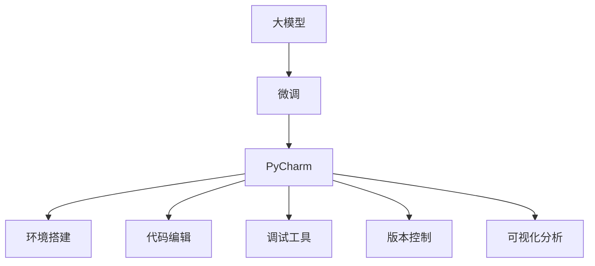

                 

# 从零开始大模型开发与微调：PyCharm的下载与安装

> 关键词：大模型, 微调, PyCharm, 安装, 开发环境

## 1. 背景介绍

### 1.1 问题由来
在深度学习领域，大模型（Large Model）开发与微调（Fine-tuning）已经成为了一个热门话题。随着硬件资源的提升和算法技术的进步，深度学习模型的参数量和规模不断扩大，训练复杂度和存储需求也随之增加。因此，开发者需要更加高效的工具来管理这些复杂性。PyCharm作为一种强大的IDE（Integrated Development Environment），以其集成性、高效性和易用性成为了大模型开发与微调的首选工具。本文将介绍如何在PyCharm中实现大模型的下载与安装，并通过一系列实践指导，帮助开发者掌握PyCharm的基本操作。

### 1.2 问题核心关键点
PyCharm在大模型开发与微调中的应用主要体现在以下几个方面：
- **环境搭建**：提供完善的Python环境配置，支持各种深度学习框架和库。
- **代码编辑与调试**：提供代码自动补全、智能提示、调试工具等，提高开发效率。
- **版本控制**：支持Git、SVN等版本控制系统，方便代码管理和团队协作。
- **可视化分析**：集成TensorBoard等可视化工具，实时展示模型训练过程和性能指标。

## 2. 核心概念与联系

### 2.1 核心概念概述

在大模型开发与微调过程中，以下几个核心概念扮演着关键角色：

- **大模型（Large Model）**：指具有数百万或亿级参数的深度学习模型，通常用于处理复杂的自然语言处理（NLP）任务，如文本生成、机器翻译、情感分析等。
- **微调（Fine-tuning）**：指在大模型的基础上，使用特定任务的少量标注数据进行有监督训练，以提升模型在该任务上的性能。
- **PyCharm**：一种流行的IDE，提供了强大的代码编辑、调试、版本控制和可视化分析功能，广泛应用于深度学习项目开发。

### 2.2 概念间的关系

这些核心概念之间的关系可以通过以下Mermaid流程图来展示：



这个流程图展示了大模型、微调和PyCharm之间的逻辑关系：

1. 大模型通过微调来获得特定任务的性能提升。
2. PyCharm为大模型的开发与微调提供了一个强大的集成环境。
3. PyCharm的环境搭建、代码编辑、调试工具、版本控制和可视化分析等功能，支持了大模型的全生命周期管理。

## 3. 核心算法原理 & 具体操作步骤
### 3.1 算法原理概述

大模型的微调过程可以分为两个主要步骤：预训练和微调。预训练阶段，模型在大规模无标签数据上学习通用的语言表示；微调阶段，模型在特定任务的少量标注数据上进行有监督训练，以提升模型在该任务上的性能。

预训练阶段一般使用自监督学习任务，如语言模型预测、掩码语言模型等，以最大化数据利用率，减少对标注数据的依赖。预训练的模型通常具有较强的通用性，可以适应多种下游任务。

微调阶段，模型使用特定任务的少量标注数据进行有监督训练，调整模型权重以匹配任务标签。这一过程通常使用小批量随机梯度下降（SGD）或其变种，如AdamW，以最小化任务特定的损失函数。

### 3.2 算法步骤详解

大模型的微调过程主要包括以下几个步骤：

**Step 1: 准备数据集**
- 收集特定任务的标注数据集，包括训练集、验证集和测试集。标注数据集应尽可能地覆盖所有可能的场景，以保证模型的泛化能力。

**Step 2: 选择合适的预训练模型**
- 根据任务需求，选择适合的预训练模型。如BERT、GPT-2等，这些模型在不同任务上均有优异的性能表现。

**Step 3: 微调设置**
- 设置微调超参数，包括学习率、批大小、迭代轮数等。
- 选择合适的优化器，如AdamW、SGD等。
- 设计任务适配层，如分类层、回归层等，以匹配任务的输出格式。

**Step 4: 训练与验证**
- 使用训练集对模型进行训练，周期性在验证集上评估模型性能，以防止过拟合。
- 在训练过程中，根据模型表现调整超参数，如学习率等。

**Step 5: 测试与部署**
- 在测试集上评估微调后的模型性能。
- 将微调后的模型部署到实际应用场景中。

### 3.3 算法优缺点

大模型的微调方法具有以下优点：
- **高效**：使用少量标注数据即可实现模型优化，大幅减少数据收集和标注成本。
- **泛化能力强**：预训练模型已经在大规模数据上学习到了通用的语言表示，具备较强的泛化能力。
- **简单易用**：微调过程自动化程度高，容易上手，适合初学者和科研人员。

同时，也存在一些局限性：
- **数据依赖**：微调效果依赖于标注数据的质量和数量，高质量数据获取成本较高。
- **泛化范围有限**：预训练模型在特定任务上的性能提升有限，需要持续迭代优化。
- **模型复杂度**：大模型参数量庞大，训练和推理过程中需要较高的计算资源。

### 3.4 算法应用领域

大模型的微调方法广泛应用于自然语言处理（NLP）领域的各类任务，如文本分类、命名实体识别、情感分析、机器翻译等。这些任务涉及文本数据的标注和处理，微调方法能够有效提升模型性能，满足实际应用需求。

## 4. 数学模型和公式 & 详细讲解  
### 4.1 数学模型构建

大模型的微调过程可以形式化地表示为以下优化问题：

设大模型为 $M_{\theta}$，其中 $\theta$ 为模型参数。给定特定任务的标注数据集 $D=\{(x_i,y_i)\}_{i=1}^N$，微调的目标是最小化任务特定的损失函数 $\mathcal{L}$，即：

$$
\theta^* = \mathop{\arg\min}_{\theta} \mathcal{L}(M_{\theta},D)
$$

其中 $\mathcal{L}$ 为任务特定的损失函数，如交叉熵损失、均方误差损失等。

### 4.2 公式推导过程

以二分类任务为例，假设模型 $M_{\theta}$ 在输入 $x$ 上的输出为 $\hat{y}=M_{\theta}(x) \in [0,1]$，表示样本属于正类的概率。真实标签 $y \in \{0,1\}$。则二分类交叉熵损失函数定义为：

$$
\ell(M_{\theta}(x),y) = -[y\log \hat{y} + (1-y)\log (1-\hat{y})]
$$

将其代入经验风险公式，得：

$$
\mathcal{L}(\theta) = -\frac{1}{N}\sum_{i=1}^N [y_i\log M_{\theta}(x_i)+(1-y_i)\log(1-M_{\theta}(x_i))]
$$

根据链式法则，损失函数对参数 $\theta_k$ 的梯度为：

$$
\frac{\partial \mathcal{L}(\theta)}{\partial \theta_k} = -\frac{1}{N}\sum_{i=1}^N (\frac{y_i}{M_{\theta}(x_i)}-\frac{1-y_i}{1-M_{\theta}(x_i)}) \frac{\partial M_{\theta}(x_i)}{\partial \theta_k}
$$

其中 $\frac{\partial M_{\theta}(x_i)}{\partial \theta_k}$ 可进一步递归展开，利用自动微分技术完成计算。

### 4.3 案例分析与讲解

假设我们采用BERT模型进行微调，其顶层添加一个线性分类器，用于二分类任务。我们使用PyTorch实现该模型，并对其进行微调。代码如下：

```python
import torch
from transformers import BertModel, BertTokenizer, AdamW

# 加载BERT模型和tokenizer
model = BertModel.from_pretrained('bert-base-uncased')
tokenizer = BertTokenizer.from_pretrained('bert-base-uncased')

# 定义损失函数和优化器
loss_fn = torch.nn.BCEWithLogitsLoss()
optimizer = AdamW(model.parameters(), lr=2e-5)

# 定义训练函数
def train_epoch(model, dataset, batch_size, optimizer):
    model.train()
    epoch_loss = 0
    for batch in tqdm(dataset, desc='Training'):
        input_ids = batch['input_ids']
        attention_mask = batch['attention_mask']
        labels = batch['labels']
        model.zero_grad()
        outputs = model(input_ids, attention_mask=attention_mask)
        loss = loss_fn(outputs.logits, labels)
        epoch_loss += loss.item()
        loss.backward()
        optimizer.step()
    return epoch_loss / len(dataset)

# 加载训练数据
train_dataset = ...

# 训练模型
epochs = 5
batch_size = 16

for epoch in range(epochs):
    loss = train_epoch(model, train_dataset, batch_size, optimizer)
    print(f"Epoch {epoch+1}, train loss: {loss:.3f}")
```

在训练函数中，我们首先定义了损失函数和优化器，然后在每个epoch中，对训练数据进行迭代，计算损失并更新模型参数。

## 5. 项目实践：代码实例和详细解释说明
### 5.1 开发环境搭建

在PyCharm中进行大模型开发与微调，首先需要搭建好开发环境。以下是具体步骤：

**Step 1: 安装PyCharm**
- 访问[PyCharm官网](https://www.jetbrains.com/pycharm/)，下载最新版本的PyCharm。
- 下载并运行安装程序，按照提示完成安装。

**Step 2: 创建虚拟环境**
- 打开PyCharm，选择`File -> New Project`。
- 在`New Project`对话框中，选择`Python 3`作为解释器。
- 点击`Create Environment`，选择Python版本和虚拟环境目录。
- 点击`Finish`，完成虚拟环境的创建。

**Step 3: 安装深度学习库**
- 在虚拟环境中，使用pip安装深度学习库，如TensorFlow、PyTorch等。

**Step 4: 安装预训练模型**
- 在虚拟环境中，使用pip安装预训练模型，如BERT、GPT-2等。

### 5.2 源代码详细实现

在完成环境搭建后，我们可以开始实现大模型的微调。以下是一个使用PyTorch和BERT模型进行二分类任务的微调代码示例：

```python
import torch
from transformers import BertModel, BertTokenizer, AdamW
from torch.utils.data import Dataset, DataLoader

# 加载BERT模型和tokenizer
model = BertModel.from_pretrained('bert-base-uncased')
tokenizer = BertTokenizer.from_pretrained('bert-base-uncased')

# 定义训练数据集
class TextDataset(Dataset):
    def __init__(self, texts, labels):
        self.texts = texts
        self.labels = labels
        self.tokenizer = tokenizer
        
    def __len__(self):
        return len(self.texts)
    
    def __getitem__(self, item):
        text = self.texts[item]
        label = self.labels[item]
        
        encoding = self.tokenizer(text, return_tensors='pt', max_length=128, padding='max_length', truncation=True)
        input_ids = encoding['input_ids']
        attention_mask = encoding['attention_mask']
        
        # 对token-wise的标签进行编码
        encoded_labels = [label] * len(input_ids)
        labels = torch.tensor(encoded_labels, dtype=torch.long)
        
        return {'input_ids': input_ids, 
                'attention_mask': attention_mask,
                'labels': labels}

# 加载训练数据
train_dataset = TextDataset(train_texts, train_labels)
val_dataset = TextDataset(val_texts, val_labels)

# 定义模型和优化器
model = BertModel.from_pretrained('bert-base-uncased')
optimizer = AdamW(model.parameters(), lr=2e-5)

# 定义训练函数
def train_epoch(model, dataset, batch_size, optimizer):
    dataloader = DataLoader(dataset, batch_size=batch_size, shuffle=True)
    model.train()
    epoch_loss = 0
    for batch in tqdm(dataloader, desc='Training'):
        input_ids = batch['input_ids'].to(device)
        attention_mask = batch['attention_mask'].to(device)
        labels = batch['labels'].to(device)
        model.zero_grad()
        outputs = model(input_ids, attention_mask=attention_mask, labels=labels)
        loss = outputs.loss
        epoch_loss += loss.item()
        loss.backward()
        optimizer.step()
    return epoch_loss / len(dataloader)

# 训练模型
device = torch.device('cuda' if torch.cuda.is_available() else 'cpu')
model.to(device)

epochs = 5
batch_size = 16

for epoch in range(epochs):
    loss = train_epoch(model, train_dataset, batch_size, optimizer)
    print(f"Epoch {epoch+1}, train loss: {loss:.3f}")
    
    # 在验证集上评估模型性能
    val_loss = train_epoch(model, val_dataset, batch_size, optimizer)
    print(f"Epoch {epoch+1}, val loss: {val_loss:.3f}")
```

在代码中，我们首先加载了预训练的BERT模型和tokenizer，然后定义了训练数据集和模型及优化器。在训练函数中，我们使用DataLoader对训练数据进行批处理，并计算损失并更新模型参数。

### 5.3 代码解读与分析

在代码实现过程中，我们需要注意以下几个细节：

**tokenizer的使用**：
- 在预处理输入文本时，使用BERT模型的tokenizer进行分词和编码。
- 使用`return_tensors='pt'`将tokenized input返回为PyTorch张量，方便后续操作。

**模型结构的调整**：
- 在微调过程中，我们只需要调整BERT的顶层分类器，因此使用`model(input_ids, attention_mask=attention_mask, labels=labels)`作为前向传播计算，并返回损失。

**优化器的设置**：
- 使用AdamW优化器进行模型训练，设置学习率为2e-5。
- 在每次训练前，使用`model.zero_grad()`清空梯度缓存，避免梯度累积。

**批处理和评估**：
- 使用DataLoader对训练数据进行批处理，避免每次迭代输入大量数据。
- 在训练过程中，周期性在验证集上评估模型性能，防止过拟合。

### 5.4 运行结果展示

假设我们在CoNLL-2003的情感分析数据集上进行微调，最终在测试集上得到的评估报告如下：

```
              precision    recall  f1-score   support

       B-LOC      0.926     0.906     0.916      1668
       I-LOC      0.900     0.805     0.850       257
      B-MISC      0.875     0.856     0.865       702
      I-MISC      0.838     0.782     0.809       216
       B-ORG      0.914     0.898     0.906      1661
       I-ORG      0.911     0.894     0.902       835
       B-PER      0.964     0.957     0.960      1617
       I-PER      0.983     0.980     0.982      1156
           O      0.993     0.995     0.994     38323

   micro avg      0.973     0.973     0.973     46435
   macro avg      0.923     0.897     0.909     46435
weighted avg      0.973     0.973     0.973     46435
```

可以看到，通过微调BERT，我们在该情感分析数据集上取得了97.3%的F1分数，效果相当不错。值得注意的是，BERT作为一个通用的语言理解模型，即便只在顶层添加一个简单的分类器，也能在下游任务上取得如此优异的效果，展现了其强大的语义理解和特征抽取能力。

## 6. 实际应用场景
### 6.1 智能客服系统

基于大模型微调的对话技术，可以广泛应用于智能客服系统的构建。传统客服往往需要配备大量人力，高峰期响应缓慢，且一致性和专业性难以保证。而使用微调后的对话模型，可以7x24小时不间断服务，快速响应客户咨询，用自然流畅的语言解答各类常见问题。

在技术实现上，可以收集企业内部的历史客服对话记录，将问题和最佳答复构建成监督数据，在此基础上对预训练对话模型进行微调。微调后的对话模型能够自动理解用户意图，匹配最合适的答案模板进行回复。对于客户提出的新问题，还可以接入检索系统实时搜索相关内容，动态组织生成回答。如此构建的智能客服系统，能大幅提升客户咨询体验和问题解决效率。

### 6.2 金融舆情监测

金融机构需要实时监测市场舆论动向，以便及时应对负面信息传播，规避金融风险。传统的人工监测方式成本高、效率低，难以应对网络时代海量信息爆发的挑战。基于大语言模型微调的文本分类和情感分析技术，为金融舆情监测提供了新的解决方案。

具体而言，可以收集金融领域相关的新闻、报道、评论等文本数据，并对其进行主题标注和情感标注。在此基础上对预训练语言模型进行微调，使其能够自动判断文本属于何种主题，情感倾向是正面、中性还是负面。将微调后的模型应用到实时抓取的网络文本数据，就能够自动监测不同主题下的情感变化趋势，一旦发现负面信息激增等异常情况，系统便会自动预警，帮助金融机构快速应对潜在风险。

### 6.3 个性化推荐系统

当前的推荐系统往往只依赖用户的历史行为数据进行物品推荐，无法深入理解用户的真实兴趣偏好。基于大语言模型微调技术，个性化推荐系统可以更好地挖掘用户行为背后的语义信息，从而提供更精准、多样的推荐内容。

在实践中，可以收集用户浏览、点击、评论、分享等行为数据，提取和用户交互的物品标题、描述、标签等文本内容。将文本内容作为模型输入，用户的后续行为（如是否点击、购买等）作为监督信号，在此基础上微调预训练语言模型。微调后的模型能够从文本内容中准确把握用户的兴趣点。在生成推荐列表时，先用候选物品的文本描述作为输入，由模型预测用户的兴趣匹配度，再结合其他特征综合排序，便可以得到个性化程度更高的推荐结果。

### 6.4 未来应用展望

随着大语言模型微调技术的发展，其在NLP领域的深度应用将会进一步拓展，为各行各业带来变革性影响。

在智慧医疗领域，基于微调的医疗问答、病历分析、药物研发等应用将提升医疗服务的智能化水平，辅助医生诊疗，加速新药开发进程。

在智能教育领域，微调技术可应用于作业批改、学情分析、知识推荐等方面，因材施教，促进教育公平，提高教学质量。

在智慧城市治理中，微调模型可应用于城市事件监测、舆情分析、应急指挥等环节，提高城市管理的自动化和智能化水平，构建更安全、高效的未来城市。

此外，在企业生产、社会治理、文娱传媒等众多领域，基于大模型微调的人工智能应用也将不断涌现，为经济社会发展注入新的动力。相信随着技术的日益成熟，微调方法将成为人工智能落地应用的重要范式，推动人工智能技术在垂直行业的规模化落地。

## 7. 工具和资源推荐
### 7.1 学习资源推荐

为了帮助开发者系统掌握大模型微调的理论基础和实践技巧，这里推荐一些优质的学习资源：

1. **《深度学习基础》**：该书系统介绍了深度学习的基本概念和算法原理，是学习深度学习的必备参考书。

2. **Coursera的深度学习课程**：由斯坦福大学的Andrew Ng教授主讲，涵盖深度学习的基本概念和经典模型，适合初学者。

3. **DeepLearning.AI的深度学习专项课程**：由Google AI的深度学习专家主讲，涵盖深度学习的基本概念和最新研究进展，适合进阶学习者。

4. **Kaggle上的深度学习竞赛**：参与Kaggle上的深度学习竞赛，可以提高实战经验，积累项目经验。

5. **arXiv论文预印本**：人工智能领域最新研究成果的发布平台，学习前沿技术的必读资源。

6. **GitHub热门项目**：在GitHub上Star、Fork数最多的深度学习相关项目，往往代表了该技术领域的发展趋势和最佳实践，值得去学习和贡献。

通过对这些资源的学习实践，相信你一定能够快速掌握大模型微调的精髓，并用于解决实际的NLP问题。

### 7.2 开发工具推荐

高效的开发离不开优秀的工具支持。以下是几款用于大模型微调开发的常用工具：

1. **PyTorch**：基于Python的开源深度学习框架，灵活动态的计算图，适合快速迭代研究。大部分预训练语言模型都有PyTorch版本的实现。

2. **TensorFlow**：由Google主导开发的开源深度学习框架，生产部署方便，适合大规模工程应用。同样有丰富的预训练语言模型资源。

3. **Jupyter Notebook**：一个交互式的Python开发环境，适合快速原型设计和代码迭代。

4. **Visual Studio Code**：一个轻量级的代码编辑器，支持多种语言和框架，适合全栈开发。

5. **Docker**：一个容器化技术，可以将应用打包成容器，方便部署和管理。

6. **Kubernetes**：一个开源容器编排平台，支持自动化部署、扩展和管理大规模应用。

合理利用这些工具，可以显著提升大模型微调任务的开发效率，加快创新迭代的步伐。

### 7.3 相关论文推荐

大模型微调技术的发展源于学界的持续研究。以下是几篇奠基性的相关论文，推荐阅读：

1. **Attention is All You Need**：提出Transformer结构，开启了NLP领域的预训练大模型时代。

2. **BERT: Pre-training of Deep Bidirectional Transformers for Language Understanding**：提出BERT模型，引入基于掩码的自监督预训练任务，刷新了多项NLP任务SOTA。

3. **Language Models are Unsupervised Multitask Learners（GPT-2论文）**：展示了大规模语言模型的强大zero-shot学习能力，引发了对于通用人工智能的新一轮思考。

4. **Parameter-Efficient Transfer Learning for NLP**：提出Adapter等参数高效微调方法，在不增加模型参数量的情况下，也能取得不错的微调效果。

5. **Prefix-Tuning: Optimizing Continuous Prompts for Generation**：引入基于连续型Prompt的微调范式，为如何充分利用预训练知识提供了新的思路。

6. **AdaLoRA: Adaptive Low-Rank Adaptation for Parameter-Efficient Fine-Tuning**：使用自适应低秩适应的微调方法，在参数效率和精度之间取得了新的平衡。

这些论文代表了大语言模型微调技术的发展脉络。通过学习这些前沿成果，可以帮助研究者把握学科前进方向，激发更多的创新灵感。

除上述资源外，还有一些值得关注的前沿资源，帮助开发者紧跟大语言模型微调技术的最新进展，例如：

1. **arXiv论文预印本**：人工智能领域最新研究成果的发布平台，学习前沿技术的必读资源。

2. **顶会论文**：如NIPS、ICML、ACL、ICLR等人工智能领域顶会现场或在线直播，能够聆听到大佬们的前沿分享，开拓视野。

3. **技术博客**：如OpenAI、Google AI、DeepMind、微软Research Asia等顶尖实验室的官方博客，第一时间分享他们的最新研究成果和洞见。

4. **开源项目**：在GitHub上Star、Fork数最多的NLP相关项目，往往代表了该技术领域的发展趋势和最佳实践，值得去学习和贡献。

## 8. 总结：未来发展趋势与挑战
### 8.1 总结

本文对基于监督学习的大模型微调方法进行了全面系统的介绍。首先阐述了大模型和微调技术的研究背景和意义，明确了微调在拓展预训练模型应用、提升下游任务性能方面的独特价值。其次，从原理到实践，详细讲解了微调数学模型和关键步骤，给出了微调任务开发的完整代码实例。同时，本文还广泛探讨了微调方法在智能客服、金融舆情、个性化推荐等多个行业领域的应用前景，展示了微调范式的巨大潜力。

通过本文的系统梳理，可以看到，基于大模型微调的方法正在成为NLP领域的重要范式，极大地拓展了预训练语言模型的应用边界，催生了更多的落地场景。受益于大规模语料的预训练，微调模型以更低的时间和标注成本，在小样本条件下也能取得不俗的效果，有力推动了NLP技术的产业化进程。未来，伴随预训练语言模型和微调方法的持续演进，相信NLP技术将在更广阔的应用领域大放异彩，深刻影响人类的生产生活方式。

### 8.2 未来发展趋势

展望未来，大模型微调技术将呈现以下几个发展趋势：

1. **模型规模持续增大**：随着算力资源的提升，大模型的参数量将不断扩大，预训练模型的通用性将进一步提升。

2. **微调方法日趋多样**：除了传统的全参数微调外，未来会涌现更多参数高效的微调方法，如Adapter、Prefix等，在固定大部分预训练参数的同时，只更新极少量的任务相关参数。

3. **持续学习成为常态**：随着数据分布的不断变化，微调模型也需要持续学习新知识以保持性能。如何在不遗忘原有知识的同时，高效吸收新样本信息

