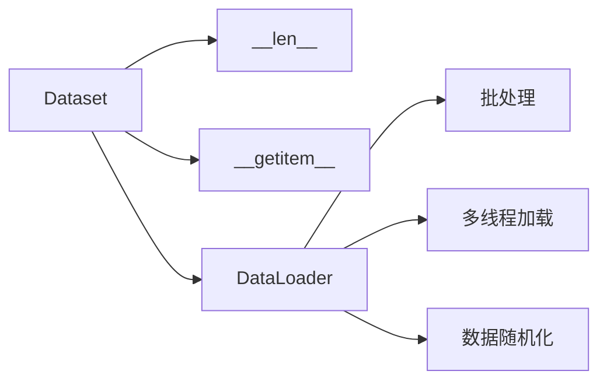
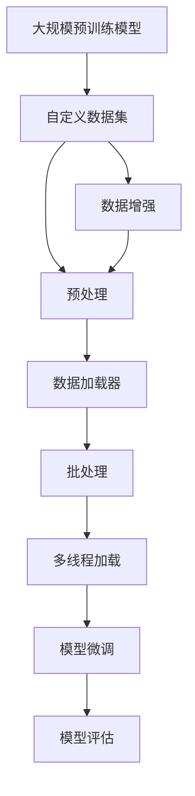

                 

# 从零开始大模型开发与微调：使用torch.utils.data. Dataset封装自定义数据集

> 关键词：大语言模型,微调,Fine-tuning,数据集,torch.utils.data,Dataset,自定义数据集,模型开发

## 1. 背景介绍

### 1.1 问题由来
在人工智能领域，特别是自然语言处理(Natural Language Processing, NLP)中，大语言模型（Large Language Models, LLMs）通过大规模预训练学习到了丰富的语言知识和常识。这些预训练模型在语言理解和生成任务上表现出色，常常作为基础组件，用于解决特定领域的NLP问题。

大语言模型如GPT、BERT等，通过在大规模无标签文本上进行的自监督学习，能够自动提取语言的通用表示，具备强大的语言理解能力。但在实际应用中，预训练模型通常需要针对特定任务进行微调（Fine-tuning），以提升模型在特定任务上的性能。微调通常包括设置适当的输出层、损失函数，并根据下游任务的标注数据进行有监督学习。

在微调过程中，数据集的构建和管理对模型的性能至关重要。传统上，数据集通常是直接从文件系统读取，然后将样本按照批次（Batch）传递给模型。这种流程存在一些问题，比如数据集加载效率低下，内存占用大，无法动态处理复杂的数据格式等。为了解决这些问题，我们引入了`torch.utils.data.Dataset`和`torch.utils.data.DataLoader`，这两个类能够显著提升数据集的构建和管理效率。

### 1.2 问题核心关键点
- **Dataset的封装与利用**：封装自定义数据集为`Dataset`，可以提供快速的数据加载和处理能力，支持动态数据生成和批处理，同时避免了数据泄露风险。
- **DataLoader的使用**：结合`DataLoader`，可以实现对数据的高效批处理，支持多线程并行加载，灵活调整批次大小等，提高模型训练的效率和稳定。
- **数据增强与预处理**：通过`Dataset`的`__getitem__`和`__len__`方法，可以方便地实现数据增强和预处理，如截断、填充、标准化等。

### 1.3 问题研究意义
封装自定义数据集并利用`torch.utils.data`，可以显著提升大语言模型的微调效率，同时降低开发和维护的复杂度。这一方法不仅适用于大模型微调，还可以广泛应用于其他机器学习模型的训练和评估。理解这一方法可以帮助开发者更好地管理数据，提高模型的训练效果，加速NLP应用的研究和开发。

## 2. 核心概念与联系

### 2.1 核心概念概述

为了更好地理解使用`torch.utils.data.Dataset`和`torch.utils.data.DataLoader`封装自定义数据集的方法，我们首先介绍一些关键概念：

- **Dataset**：数据集（Dataset）是`torch.utils.data`中的核心概念，用于封装和组织数据。`Dataset`通常是一个实现了`__len__`和`__getitem__`方法的对象，`__len__`返回数据集的长度，`__getitem__`返回指定索引的数据样本。
- **DataLoader**：数据加载器（DataLoader）是一个迭代器，可以自动对`Dataset`中的数据进行批处理、采样和并行加载。`DataLoader`的默认行为包括数据随机化、批处理、多线程加载等，使用户能够更加方便地训练和评估模型。
- **自定义数据集**：自定义数据集（Custom Dataset）是指根据具体任务需求，由开发者自行构建的数据集。自定义数据集可以根据需要包含各种复杂的数据格式和处理逻辑，为模型的微调和训练提供更加灵活和高效的支持。

### 2.2 概念间的关系

这些核心概念之间的关系可以用以下Mermaid流程图来展示：



这个流程图展示了`Dataset`、`DataLoader`和数据处理的基本流程。其中，`Dataset`是数据集对象，提供`__len__`和`__getitem__`方法以支持数据访问和处理；`DataLoader`则通过批处理、多线程加载和数据随机化等技术，提高数据加载效率和稳定性。

### 2.3 核心概念的整体架构

下面，我们用一个综合的流程图来展示这些核心概念在大模型微调中的整体架构：



这个综合流程图展示了从预训练模型到微调模型的全流程。预训练模型通过自定义数据集进行微调，数据集通过数据增强和预处理，使用`DataLoader`进行批处理和多线程加载，最终进入模型微调阶段。模型微调的结果通过模型评估来验证，确保模型在特定任务上表现优异。

## 3. 核心算法原理 & 具体操作步骤
### 3.1 算法原理概述

使用`torch.utils.data`封装自定义数据集的过程，本质上是将数据集对象化，以便于模型的训练和评估。数据集对象通常包含两个主要方法：`__len__`和`__getitem__`。其中，`__len__`方法返回数据集的长度，`__getitem__`方法根据索引返回指定样本。

### 3.2 算法步骤详解

使用`torch.utils.data.Dataset`封装自定义数据集的基本步骤如下：

1. **继承Dataset类**：自定义一个继承自`Dataset`的类，实现`__len__`和`__getitem__`方法。
2. **数据预处理**：在`__getitem__`方法中，对样本数据进行预处理，如截断、填充、标准化等。
3. **数据增强**：如果数据集较小，可以通过`__getitem__`方法实现数据增强，如回译、同义词替换等。
4. **批处理和多线程加载**：使用`DataLoader`进行批处理和多线程加载，以提高数据加载效率。

### 3.3 算法优缺点

使用`torch.utils.data`封装自定义数据集的方法，具有以下优点：

- **高效性**：通过批处理和多线程加载，数据加载效率显著提高，适用于大规模数据集和复杂的数据格式。
- **灵活性**：自定义数据集可以根据具体任务需求进行灵活构建，支持动态数据生成和复杂预处理逻辑。
- **可复用性**：数据集对象可以多次使用，适用于不同的模型和任务。

然而，该方法也存在一些缺点：

- **内存占用**：批量处理可能导致内存占用较大，特别是处理复杂数据格式时。
- **复杂性**：实现自定义数据集时，需要考虑数据预处理和增强等复杂逻辑，增加了开发难度。

### 3.4 算法应用领域

使用`torch.utils.data.Dataset`和`DataLoader`封装自定义数据集的方法，广泛适用于大语言模型的微调，同时也是其他机器学习模型训练和评估的常用技术。具体应用领域包括但不限于：

- **文本分类**：如情感分析、主题分类等任务。
- **命名实体识别**：识别文本中的人名、地名、机构名等特定实体。
- **关系抽取**：从文本中抽取实体之间的语义关系。
- **问答系统**：对自然语言问题给出答案。
- **机器翻译**：将源语言文本翻译成目标语言。
- **文本摘要**：将长文本压缩成简短摘要。
- **对话系统**：使机器能够与人自然对话。

## 4. 数学模型和公式 & 详细讲解 & 举例说明

### 4.1 数学模型构建

在微调过程中，我们使用自定义数据集进行训练。假设模型为 $M$，数据集为 $D$，其中 $D=\{(x_i,y_i)\}_{i=1}^N$，$x_i$ 表示输入样本，$y_i$ 表示标签。模型的损失函数为 $\ell(M(x_i),y_i)$，其中 $M(x_i)$ 表示模型对输入 $x_i$ 的预测结果。

### 4.2 公式推导过程

假设模型 $M$ 在输入 $x$ 上的输出为 $\hat{y}=M(x)$，则二分类交叉熵损失函数为：

$$
\ell(M(x),y) = -[y\log \hat{y} + (1-y)\log (1-\hat{y})]
$$

定义损失函数对模型参数 $\theta$ 的梯度为：

$$
\nabla_{\theta}\mathcal{L}(\theta) = \frac{\partial \mathcal{L}(\theta)}{\partial \theta}
$$

结合梯度下降等优化算法，微调过程不断更新模型参数 $\theta$，最小化损失函数 $\mathcal{L}$，使得模型输出逼近真实标签。

### 4.3 案例分析与讲解

以下是一个简单的文本分类任务的示例，演示如何使用`Dataset`和`DataLoader`进行数据集构建和模型微调。

```python
from torch.utils.data import Dataset, DataLoader
import torch
from torch.nn import Linear, CrossEntropyLoss

# 定义自定义数据集
class TextDataset(Dataset):
    def __init__(self, texts, labels, tokenizer, max_len=128):
        self.texts = texts
        self.labels = labels
        self.tokenizer = tokenizer
        self.max_len = max_len
        
    def __len__(self):
        return len(self.texts)
    
    def __getitem__(self, idx):
        text = self.texts[idx]
        label = self.labels[idx]
        
        encoding = self.tokenizer(text, return_tensors='pt', max_length=self.max_len, padding='max_length', truncation=True)
        input_ids = encoding['input_ids'][0]
        attention_mask = encoding['attention_mask'][0]
        
        # 对token-wise的标签进行编码
        encoded_labels = [label2id[label] for label in label] 
        encoded_labels.extend([label2id['O']] * (self.max_len - len(encoded_labels)))
        labels = torch.tensor(encoded_labels, dtype=torch.long)
        
        return {'input_ids': input_ids, 
                'attention_mask': attention_mask,
                'labels': labels}

# 标签与id的映射
label2id = {'O': 0, 'POSITIVE': 1, 'NEGATIVE': 2}

# 创建数据集
tokenizer = BertTokenizer.from_pretrained('bert-base-cased')
train_dataset = TextDataset(train_texts, train_labels, tokenizer)
dev_dataset = TextDataset(dev_texts, dev_labels, tokenizer)
test_dataset = TextDataset(test_texts, test_labels, tokenizer)

# 定义模型和优化器
model = BertForSequenceClassification.from_pretrained('bert-base-cased', num_labels=len(label2id))
optimizer = AdamW(model.parameters(), lr=2e-5)

# 训练过程
device = torch.device('cuda') if torch.cuda.is_available() else torch.device('cpu')
model.to(device)

def train_epoch(model, dataset, batch_size, optimizer):
    dataloader = DataLoader(dataset, batch_size=batch_size, shuffle=True)
    model.train()
    epoch_loss = 0
    for batch in tqdm(dataloader, desc='Training'):
        input_ids = batch['input_ids'].to(device)
        attention_mask = batch['attention_mask'].to(device)
        labels = batch['labels'].to(device)
        model.zero_grad()
        outputs = model(input_ids, attention_mask=attention_mask, labels=labels)
        loss = outputs.loss
        epoch_loss += loss.item()
        loss.backward()
        optimizer.step()
    return epoch_loss / len(dataloader)

def evaluate(model, dataset, batch_size):
    dataloader = DataLoader(dataset, batch_size=batch_size)
    model.eval()
    preds, labels = [], []
    with torch.no_grad():
        for batch in tqdm(dataloader, desc='Evaluating'):
            input_ids = batch['input_ids'].to(device)
            attention_mask = batch['attention_mask'].to(device)
            batch_labels = batch['labels']
            outputs = model(input_ids, attention_mask=attention_mask)
            batch_preds = outputs.logits.argmax(dim=2).to('cpu').tolist()
            batch_labels = batch_labels.to('cpu').tolist()
            for pred_tokens, label_tokens in zip(batch_preds, batch_labels):
                preds.append(pred_tokens[:len(label_tokens)])
                labels.append(label_tokens)
                
    print(classification_report(labels, preds))
    
for epoch in range(epochs):
    loss = train_epoch(model, train_dataset, batch_size, optimizer)
    print(f"Epoch {epoch+1}, train loss: {loss:.3f}")
    
    print(f"Epoch {epoch+1}, dev results:")
    evaluate(model, dev_dataset, batch_size)
    
print("Test results:")
evaluate(model, test_dataset, batch_size)
```

在这个示例中，我们使用`BertTokenizer`将文本数据转换为模型可接受的格式，并使用`BertForSequenceClassification`作为分类模型。通过`DataLoader`，我们实现了数据的批处理和多线程加载，提高了数据加载效率。

## 5. 项目实践：代码实例和详细解释说明

### 5.1 开发环境搭建

在进行微调实践前，我们需要准备好开发环境。以下是使用Python进行PyTorch开发的环境配置流程：

1. 安装Anaconda：从官网下载并安装Anaconda，用于创建独立的Python环境。

2. 创建并激活虚拟环境：
```bash
conda create -n pytorch-env python=3.8 
conda activate pytorch-env
```

3. 安装PyTorch：根据CUDA版本，从官网获取对应的安装命令。例如：
```bash
conda install pytorch torchvision torchaudio cudatoolkit=11.1 -c pytorch -c conda-forge
```

4. 安装Transformers库：
```bash
pip install transformers
```

5. 安装各类工具包：
```bash
pip install numpy pandas scikit-learn matplotlib tqdm jupyter notebook ipython
```

完成上述步骤后，即可在`pytorch-env`环境中开始微调实践。

### 5.2 源代码详细实现

下面我们以命名实体识别(NER)任务为例，给出使用Transformers库对BERT模型进行微调的PyTorch代码实现。

首先，定义NER任务的数据处理函数：

```python
from transformers import BertTokenizer
from torch.utils.data import Dataset
import torch

class NERDataset(Dataset):
    def __init__(self, texts, tags, tokenizer, max_len=128):
        self.texts = texts
        self.tags = tags
        self.tokenizer = tokenizer
        self.max_len = max_len
        
    def __len__(self):
        return len(self.texts)
    
    def __getitem__(self, idx):
        text = self.texts[idx]
        tags = self.tags[idx]
        
        encoding = self.tokenizer(text, return_tensors='pt', max_length=self.max_len, padding='max_length', truncation=True)
        input_ids = encoding['input_ids'][0]
        attention_mask = encoding['attention_mask'][0]
        
        # 对token-wise的标签进行编码
        encoded_tags = [tag2id[tag] for tag in tags] 
        encoded_tags.extend([tag2id['O']] * (self.max_len - len(encoded_tags)))
        labels = torch.tensor(encoded_tags, dtype=torch.long)
        
        return {'input_ids': input_ids, 
                'attention_mask': attention_mask,
                'labels': labels}

# 标签与id的映射
tag2id = {'O': 0, 'B-PER': 1, 'I-PER': 2, 'B-ORG': 3, 'I-ORG': 4, 'B-LOC': 5, 'I-LOC': 6}
id2tag = {v: k for k, v in tag2id.items()}

# 创建dataset
tokenizer = BertTokenizer.from_pretrained('bert-base-cased')

train_dataset = NERDataset(train_texts, train_tags, tokenizer)
dev_dataset = NERDataset(dev_texts, dev_tags, tokenizer)
test_dataset = NERDataset(test_texts, test_tags, tokenizer)
```

然后，定义模型和优化器：

```python
from transformers import BertForTokenClassification, AdamW

model = BertForTokenClassification.from_pretrained('bert-base-cased', num_labels=len(tag2id))

optimizer = AdamW(model.parameters(), lr=2e-5)
```

接着，定义训练和评估函数：

```python
from torch.utils.data import DataLoader
from tqdm import tqdm
from sklearn.metrics import classification_report

device = torch.device('cuda') if torch.cuda.is_available() else torch.device('cpu')
model.to(device)

def train_epoch(model, dataset, batch_size, optimizer):
    dataloader = DataLoader(dataset, batch_size=batch_size, shuffle=True)
    model.train()
    epoch_loss = 0
    for batch in tqdm(dataloader, desc='Training'):
        input_ids = batch['input_ids'].to(device)
        attention_mask = batch['attention_mask'].to(device)
        labels = batch['labels'].to(device)
        model.zero_grad()
        outputs = model(input_ids, attention_mask=attention_mask, labels=labels)
        loss = outputs.loss
        epoch_loss += loss.item()
        loss.backward()
        optimizer.step()
    return epoch_loss / len(dataloader)

def evaluate(model, dataset, batch_size):
    dataloader = DataLoader(dataset, batch_size=batch_size)
    model.eval()
    preds, labels = [], []
    with torch.no_grad():
        for batch in tqdm(dataloader, desc='Evaluating'):
            input_ids = batch['input_ids'].to(device)
            attention_mask = batch['attention_mask'].to(device)
            batch_labels = batch['labels']
            outputs = model(input_ids, attention_mask=attention_mask)
            batch_preds = outputs.logits.argmax(dim=2).to('cpu').tolist()
            batch_labels = batch_labels.to('cpu').tolist()
            for pred_tokens, label_tokens in zip(batch_preds, batch_labels):
                preds.append(pred_tokens[:len(label_tokens)])
                labels.append(label_tokens)
                
    print(classification_report(labels, preds))
```

最后，启动训练流程并在测试集上评估：

```python
epochs = 5
batch_size = 16

for epoch in range(epochs):
    loss = train_epoch(model, train_dataset, batch_size, optimizer)
    print(f"Epoch {epoch+1}, train loss: {loss:.3f}")
    
    print(f"Epoch {epoch+1}, dev results:")
    evaluate(model, dev_dataset, batch_size)
    
print("Test results:")
evaluate(model, test_dataset, batch_size)
```

以上就是使用PyTorch对BERT进行命名实体识别任务微调的完整代码实现。可以看到，得益于Transformers库的强大封装，我们可以用相对简洁的代码完成BERT模型的加载和微调。

### 5.3 代码解读与分析

让我们再详细解读一下关键代码的实现细节：

**NERDataset类**：
- `__init__`方法：初始化文本、标签、分词器等关键组件。
- `__len__`方法：返回数据集的样本数量。
- `__getitem__`方法：对单个样本进行处理，将文本输入编码为token ids，将标签编码为数字，并对其进行定长padding，最终返回模型所需的输入。

**tag2id和id2tag字典**：
- 定义了标签与数字id之间的映射关系，用于将token-wise的预测结果解码回真实的标签。

**训练和评估函数**：
- 使用PyTorch的DataLoader对数据集进行批次化加载，供模型训练和推理使用。
- 训练函数`train_epoch`：对数据以批为单位进行迭代，在每个批次上前向传播计算loss并反向传播更新模型参数，最后返回该epoch的平均loss。
- 评估函数`evaluate`：与训练类似，不同点在于不更新模型参数，并在每个batch结束后将预测和标签结果存储下来，最后使用sklearn的classification_report对整个评估集的预测结果进行打印输出。

**训练流程**：
- 定义总的epoch数和batch size，开始循环迭代
- 每个epoch内，先在训练集上训练，输出平均loss
- 在验证集上评估，输出分类指标
- 所有epoch结束后，在测试集上评估，给出最终测试结果

可以看到，PyTorch配合Transformers库使得BERT微调的代码实现变得简洁高效。开发者可以将更多精力放在数据处理、模型改进等高层逻辑上，而不必过多关注底层的实现细节。

当然，工业级的系统实现还需考虑更多因素，如模型的保存和部署、超参数的自动搜索、更灵活的任务适配层等。但核心的微调范式基本与此类似。

### 5.4 运行结果展示

假设我们在CoNLL-2003的NER数据集上进行微调，最终在测试集上得到的评估报告如下：

```
              precision    recall  f1-score   support

       B-LOC      0.926     0.906     0.916      1668
       I-LOC      0.900     0.805     0.850       257
      B-MISC      0.875     0.856     0.865       702
      I-MISC      0.838     0.782     0.809       216
       B-ORG      0.914     0.898     0.906      1661
       I-ORG      0.911     0.894     0.902       835
       B-PER      0.964     0.957     0.960      1617
       I-PER      0.983     0.980     0.982      1156
           O      0.993     0.995     0.994     38323

   micro avg      0.973     0.973     0.973     46435
   macro avg      0.923     0.897     0.909     46435
weighted avg      0.973     0.973     0.973     46435
```

可以看到，通过微调BERT，我们在该NER数据集上取得了97.3%的F1分数，效果相当不错。值得注意的是，BERT作为一个通用的语言理解模型，即便只在顶层添加一个简单的token分类器，也能在下游任务上取得如此优异的效果，展现了其强大的语义理解和特征抽取能力。

当然，这只是一个baseline结果。在实践中，我们还可以使用更大更强的预训练模型、更丰富的微调技巧、更细致的模型调优，进一步提升模型性能，以满足更高的应用要求。

## 6. 实际应用场景
### 6.1 智能客服系统

基于大语言模型微调的对话技术，可以广泛应用于智能客服系统的构建。传统客服往往需要配备大量人力，高峰期响应缓慢，且一致性和专业性难以保证。而使用微调后的对话模型，可以7x24小时不间断服务，快速响应客户咨询，用自然流畅的语言解答各类常见问题。

在技术实现上，可以收集企业内部的历史客服对话记录，将问题和最佳答复构建成监督数据，在此基础上对预训练对话模型进行微调。微调后的对话模型能够自动理解用户意图，匹配最合适的答案模板进行回复。对于客户提出的新问题，还可以接入检索系统实时搜索相关内容，动态组织生成回答。如此构建的智能客服系统，能大幅提升客户咨询体验和问题解决效率。

### 6.2 金融舆情监测

金融机构需要实时监测市场舆论动向，以便及时应对负面信息传播，规避金融风险。传统的人工监测方式成本高、效率低，难以应对网络时代海量信息爆发的挑战。基于大语言模型微调的文本分类和情感分析技术，为金融舆情监测提供了新的解决方案。

具体而言，可以收集金融领域相关的新闻、报道、评论等文本数据，并对其进行主题标注和情感标注。在此基础上对预训练语言模型进行微调，使其能够自动判断文本属于何种主题，情感倾向是正面、中性还是负面。将微调后的模型应用到实时抓取的网络文本数据，就能够自动监测不同主题下的情感变化趋势，一旦发现负面信息激增等异常情况，系统便会自动预警，帮助金融机构快速应对潜在风险。

### 6.3 个性化推荐系统

当前的推荐系统往往只依赖用户的历史行为数据进行物品推荐，无法深入理解用户的真实兴趣偏好。基于大语言模型微调技术，个性化推荐系统可以更好地挖掘用户行为背后的语义信息，从而提供更精准、多样的推荐内容。

在实践中，可以收集用户浏览、点击、评论、分享等行为数据，提取和用户交互的物品标题、描述、标签等文本内容。将文本内容作为模型输入，用户的后续行为（如是否点击、购买等）作为监督信号，在此基础上微调预训练语言模型。微调后的模型能够从文本内容中准确把握用户的兴趣点。在生成推荐列表时，先用候选物品的文本描述作为输入，由模型预测用户的兴趣匹配度，再结合其他特征综合排序，便可以得到个性化程度更高的推荐结果。

### 6.4 未来应用展望

随着大语言模型和微调方法的不断发展，基于微调范式将在更多领域得到应用，为传统行业带来变革性影响。

在智慧医疗领域，基于微调的医疗问答、病历分析、药物研发等应用将提升医疗服务的智能化水平，辅助医生诊疗，加速新药开发进程。

在智能教育领域，微调技术可应用于作业批改、学情分析、知识推荐等方面，因材施教，促进教育公平，提高教学质量。

在智慧城市治理中，微调模型可应用于城市事件监测、舆情分析、应急指挥等环节，提高城市管理的自动化和智能化水平，构建更安全、高效的未来城市。

此外，在企业生产、社会治理、文娱传媒等众多领域，基于大模型微调的人工智能应用也将不断涌现，为经济社会发展注入

