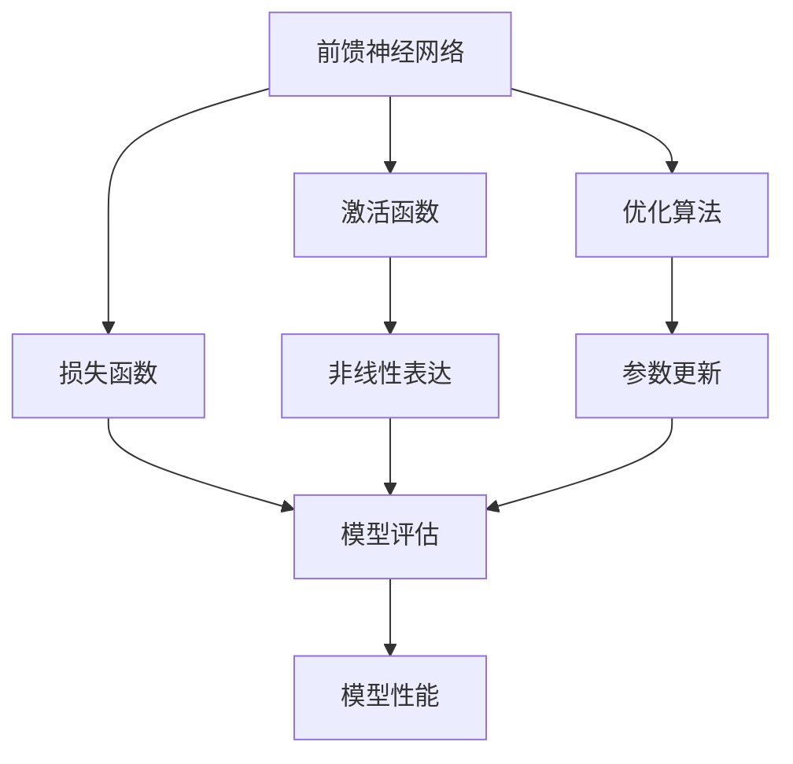
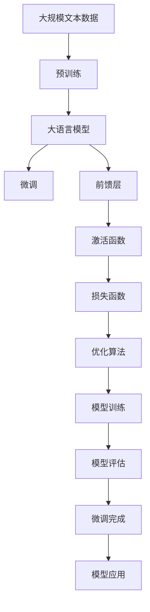

                 

# 从零开始大模型开发与微调：前馈层的实现

> 关键词：
- 大模型开发
- 前馈层实现
- 深度学习
- 自监督学习
- 微调
- 矩阵运算
- 梯度下降
- 神经网络
- 计算图

## 1. 背景介绍

### 1.1 问题由来
近年来，深度学习在计算机视觉、自然语言处理等领域取得了巨大进展。其中，基于神经网络的深度学习模型，特别是前馈神经网络（Feedforward Neural Networks, FNNs），已经成为机器学习和人工智能领域的核心技术。然而，开发和优化一个高效的神经网络模型，特别是大模型，仍然是一项复杂而艰巨的任务。

在实际应用中，我们常常需要解决以下几个核心问题：
- 如何设计高效的神经网络结构？
- 如何选择合适的激活函数？
- 如何优化神经网络的训练过程？
- 如何在不同数据集上进行微调？

这些问题涉及到神经网络的前馈层、激活函数、损失函数、优化算法等核心概念。本文将从零开始介绍这些关键技术，并详细讲解如何开发和优化一个高效的大模型。

### 1.2 问题核心关键点
本文主要聚焦于以下核心问题：
- 神经网络前馈层的原理和实现
- 激活函数的选择与应用
- 神经网络的优化算法
- 大模型的开发与微调方法
- 矩阵运算的优化技术

这些问题涵盖了大模型开发与微调的核心技术，从基础到应用，为读者提供全面深入的解析和示例。

### 1.3 问题研究意义
理解和掌握神经网络前馈层的实现方法，对于构建高效的大模型具有重要意义：
1. 帮助开发者更好地理解神经网络的结构和原理，提高模型设计和调优能力。
2. 通过合理的激活函数选择与应用，可以提升模型的非线性表达能力和泛化能力。
3. 通过优化算法的应用，可以加快模型训练速度，提高模型收敛性和鲁棒性。
4. 通过大模型的开发与微调方法，可以实现模型的高效利用和迁移学习，提升模型在不同场景下的性能。

## 2. 核心概念与联系

### 2.1 核心概念概述

为更好地理解前馈层的实现，本节将介绍几个关键概念：

- 前馈神经网络（Feedforward Neural Networks, FNNs）：神经网络的经典模型，包括输入层、若干个隐藏层和输出层，信息通过单向流动的方式传递。
- 激活函数（Activation Function）：神经网络中用于引入非线性的函数，常用的包括Sigmoid、ReLU、Tanh等。
- 损失函数（Loss Function）：用于衡量模型预测输出与真实标签之间差异的函数，常用的包括均方误差、交叉熵等。
- 优化算法（Optimization Algorithm）：用于更新神经网络参数的算法，常用的包括梯度下降、Adam、RMSprop等。
- 矩阵运算（Matrix Operations）：神经网络计算的核心，包括矩阵乘法、向量点积等。

这些核心概念构成了神经网络前馈层实现的基础，帮助开发者构建高效的大模型。

### 2.2 概念间的关系

这些核心概念之间存在着紧密的联系，形成了神经网络前馈层实现的完整生态系统。下面我们通过一个Mermaid流程图来展示这些概念之间的关系：



这个流程图展示了前馈神经网络的各个组件及其相互作用关系：

1. 前馈神经网络由输入层、若干个隐藏层和输出层构成。
2. 激活函数用于引入非线性表达，提升模型复杂度。
3. 损失函数用于评估模型预测输出与真实标签之间的差异。
4. 优化算法用于更新模型参数，最小化损失函数。
5. 非线性表达能力提升模型的泛化能力。
6. 模型评估和参数更新是模型训练的关键步骤。
7. 模型性能是前馈神经网络设计的最终目标。

通过这个流程图，我们可以更清晰地理解前馈神经网络的工作原理和优化方向。

### 2.3 核心概念的整体架构

最后，我们用一个综合的流程图来展示这些核心概念在大模型开发与微调过程中的整体架构：



这个综合流程图展示了从预训练到微调，再到前馈层实现的完整过程：

1. 大语言模型通过预训练获得基础能力。
2. 微调用于适应特定任务，提升模型性能。
3. 前馈层和激活函数实现非线性表达。
4. 损失函数用于评估模型输出。
5. 优化算法用于更新模型参数。
6. 模型训练和评估是微调的核心步骤。
7. 微调完成后，模型可应用于各种下游任务。

通过这些流程图，我们可以更系统地理解大模型开发与微调过程的各个环节。

## 3. 核心算法原理 & 具体操作步骤
### 3.1 算法原理概述

前馈神经网络（FNNs）是深度学习中最基础的模型之一，其核心思想是通过多层神经元的堆叠，实现从输入到输出的非线性映射。FNNs通常包括输入层、若干个隐藏层和输出层，信息通过单向流动的方式传递。

具体而言，假设一个FNNs包含$n$个隐藏层，$N$个输入节点和$M$个输出节点，其计算过程可以描述为：

1. 输入层：$x \in \mathbb{R}^{N}$，表示输入向量。
2. 隐藏层：$h^{(1)} \in \mathbb{R}^{n_1}$，表示第一层的隐藏状态。
3. 激活函数：$\sigma: \mathbb{R} \rightarrow \mathbb{R}$，表示非线性映射。
4. 输出层：$y \in \mathbb{R}^{M}$，表示输出向量。

前馈层的计算过程可以表示为：

$$
h^{(l+1)} = \sigma(W_l h^{(l)} + b_l)
$$

其中，$W_l \in \mathbb{R}^{n_l \times n_{l-1}}$ 和 $b_l \in \mathbb{R}^{n_l}$ 分别表示第 $l$ 层的权重和偏置向量。$\sigma$ 表示第 $l$ 层的激活函数。

### 3.2 算法步骤详解

前馈层的实现包括以下关键步骤：

1. 初始化模型参数：随机初始化权重和偏置向量，通常使用Xavier初始化或He初始化。
2. 正向传播：将输入向量通过前馈神经网络，计算各层的隐藏状态和输出。
3. 计算损失函数：将模型输出与真实标签比较，计算损失函数。
4. 反向传播：通过链式法则计算各层的梯度，更新模型参数。
5. 优化算法：选择合适的优化算法，更新模型参数。
6. 重复迭代：重复正向传播、计算损失函数、反向传播和优化算法的步骤，直到收敛或达到预设轮数。

以一个简单的二分类任务为例，演示前馈层的具体实现步骤：

1. 输入层：$x \in \mathbb{R}^{N}$，表示输入向量。
2. 隐藏层：$h^{(1)} \in \mathbb{R}^{n_1}$，表示第一层的隐藏状态。
3. 激活函数：$\sigma$ 表示非线性映射，例如ReLU。
4. 输出层：$y \in \mathbb{R}^{M}$，表示输出向量。
5. 损失函数：$L$ 表示模型预测输出与真实标签之间的差异，例如交叉熵损失函数。
6. 优化算法：$optimizer$ 表示模型参数的更新方式，例如Adam优化算法。

具体实现代码如下：

```python
import torch
import torch.nn as nn
import torch.optim as optim

# 定义前馈神经网络模型
class MLP(nn.Module):
    def __init__(self, input_size, hidden_size, output_size):
        super(MLP, self).__init__()
        self.hidden_size = hidden_size
        self.fc1 = nn.Linear(input_size, hidden_size)
        self.fc2 = nn.Linear(hidden_size, hidden_size)
        self.fc3 = nn.Linear(hidden_size, output_size)
        self.relu = nn.ReLU()
        
    def forward(self, x):
        x = self.fc1(x)
        x = self.relu(x)
        x = self.fc2(x)
        x = self.relu(x)
        x = self.fc3(x)
        return x
    
# 定义交叉熵损失函数
criterion = nn.CrossEntropyLoss()
    
# 定义优化器
model = MLP(input_size=784, hidden_size=128, output_size=10)
optimizer = optim.Adam(model.parameters(), lr=0.001)
    
# 训练模型
for epoch in range(100):
    model.train()
    optimizer.zero_grad()
    outputs = model(inputs)
    loss = criterion(outputs, labels)
    loss.backward()
    optimizer.step()
    print("Epoch [{}/{}], Loss: {:.4f}".format(epoch+1, 100, loss.item()))
```

### 3.3 算法优缺点

前馈神经网络具有以下优点：
- 结构简单，易于实现。
- 具有较强的非线性表达能力，适合处理复杂问题。
- 计算效率高，易于并行计算。

同时，前馈神经网络也存在一些缺点：
- 对初始化参数较为敏感，需要合理的初始化方法。
- 容易出现梯度消失或梯度爆炸的问题。
- 对于输入数据的分布和大小较为敏感。

### 3.4 算法应用领域

前馈神经网络在各个领域都有广泛应用，例如：
- 计算机视觉：用于图像分类、目标检测、人脸识别等任务。
- 自然语言处理：用于文本分类、情感分析、语言建模等任务。
- 语音识别：用于语音识别、语音合成等任务。
- 信号处理：用于信号分类、降噪等任务。

## 4. 数学模型和公式 & 详细讲解 & 举例说明

### 4.1 数学模型构建

前馈神经网络的数学模型可以表示为：

$$
f(x) = W_n \sigma(W_{n-1} \sigma(\dots \sigma(W_1 x + b_1) + b_2) + \dots + b_n)
$$

其中，$W_l \in \mathbb{R}^{n_l \times n_{l-1}}$ 和 $b_l \in \mathbb{R}^{n_l}$ 分别表示第 $l$ 层的权重和偏置向量，$\sigma$ 表示第 $l$ 层的激活函数。

### 4.2 公式推导过程

以一个简单的二分类任务为例，推导前馈神经网络的计算过程。假设输入向量 $x \in \mathbb{R}^{N}$，隐藏层 $h^{(1)} \in \mathbb{R}^{n_1}$，输出层 $y \in \mathbb{R}^{M}$，激活函数 $\sigma$ 为ReLU，输出为二分类任务的标签。

计算过程如下：

1. 输入层到隐藏层：

$$
h^{(1)} = \sigma(W^{(1)} x + b^{(1)})
$$

其中，$W^{(1)} \in \mathbb{R}^{n_1 \times N}$ 表示第一层的权重矩阵，$b^{(1)} \in \mathbb{R}^{n_1}$ 表示第一层的偏置向量，$\sigma$ 表示ReLU激活函数。

2. 隐藏层到输出层：

$$
y = \sigma(W^{(2)} h^{(1)} + b^{(2)})
$$

其中，$W^{(2)} \in \mathbb{R}^{M \times n_1}$ 表示第二层的权重矩阵，$b^{(2)} \in \mathbb{R}^{M}$ 表示第二层的偏置向量，$\sigma$ 表示ReLU激活函数。

### 4.3 案例分析与讲解

以MNIST手写数字识别任务为例，演示前馈神经网络的计算过程。假设输入向量为$x \in \mathbb{R}^{784}$，隐藏层为$h^{(1)} \in \mathbb{R}^{128}$，输出层为$y \in \mathbb{R}^{10}$。

1. 输入层到隐藏层：

$$
h^{(1)} = \sigma(W^{(1)} x + b^{(1)})
$$

其中，$W^{(1)} \in \mathbb{R}^{128 \times 784}$ 表示第一层的权重矩阵，$b^{(1)} \in \mathbb{R}^{128}$ 表示第一层的偏置向量，$\sigma$ 表示ReLU激活函数。

2. 隐藏层到输出层：

$$
y = \sigma(W^{(2)} h^{(1)} + b^{(2)})
$$

其中，$W^{(2)} \in \mathbb{R}^{10 \times 128}$ 表示第二层的权重矩阵，$b^{(2)} \in \mathbb{R}^{10}$ 表示第二层的偏置向量，$\sigma$ 表示ReLU激活函数。

## 5. 项目实践：代码实例和详细解释说明

### 5.1 开发环境搭建

在进行前馈层实现的过程中，需要准备以下开发环境：
- Python：安装Python 3.7及以上版本。
- PyTorch：安装PyTorch 1.8及以上版本。
- Jupyter Notebook：用于编写和运行代码。

### 5.2 源代码详细实现

下面以一个简单的二分类任务为例，演示前馈神经网络的实现过程。

```python
import torch
import torch.nn as nn
import torch.optim as optim
from torch.utils.data import DataLoader
from torchvision import datasets, transforms

# 定义前馈神经网络模型
class MLP(nn.Module):
    def __init__(self, input_size, hidden_size, output_size):
        super(MLP, self).__init__()
        self.hidden_size = hidden_size
        self.fc1 = nn.Linear(input_size, hidden_size)
        self.fc2 = nn.Linear(hidden_size, hidden_size)
        self.fc3 = nn.Linear(hidden_size, output_size)
        self.relu = nn.ReLU()
        
    def forward(self, x):
        x = self.fc1(x)
        x = self.relu(x)
        x = self.fc2(x)
        x = self.relu(x)
        x = self.fc3(x)
        return x
    
# 定义交叉熵损失函数
criterion = nn.CrossEntropyLoss()
    
# 定义优化器
model = MLP(input_size=784, hidden_size=128, output_size=10)
optimizer = optim.Adam(model.parameters(), lr=0.001)
    
# 训练模型
def train_model(model, train_loader, optimizer, num_epochs=10):
    for epoch in range(num_epochs):
        model.train()
        for batch_idx, (data, target) in enumerate(train_loader):
            optimizer.zero_grad()
            outputs = model(data)
            loss = criterion(outputs, target)
            loss.backward()
            optimizer.step()
            if (batch_idx+1) % 100 == 0:
                print('Train Epoch: {} [{}/{} ({:.0f}%)]\tLoss: {:.6f}'.format(
                    epoch, batch_idx * len(data), len(train_loader.dataset),
                    100. * batch_idx / len(train_loader), loss.item()))
    
# 加载数据集
train_dataset = datasets.MNIST('~/data', train=True, download=True, transform=transforms.ToTensor())
test_dataset = datasets.MNIST('~/data', train=False, download=True, transform=transforms.ToTensor())

train_loader = DataLoader(train_dataset, batch_size=64, shuffle=True)
test_loader = DataLoader(test_dataset, batch_size=64, shuffle=False)
    
# 训练模型
train_model(model, train_loader, optimizer)
    
# 测试模型
model.eval()
correct = 0
total = 0
with torch.no_grad():
    for data, target in test_loader:
        outputs = model(data)
        _, predicted = torch.max(outputs.data, 1)
        total += target.size(0)
        correct += (predicted == target).sum().item()

print('Accuracy of the network on the test images: {} %'.format(100 * correct / total))
```

### 5.3 代码解读与分析

在上述代码中，我们实现了以下关键步骤：
1. 定义前馈神经网络模型。
2. 定义交叉熵损失函数。
3. 定义优化器。
4. 训练模型。
5. 测试模型。

**前馈神经网络模型的定义**：
- `MLP`类表示前馈神经网络模型。
- `__init__`方法初始化模型的参数，包括输入层、隐藏层和输出层的权重和偏置向量。
- `forward`方法定义模型的前向传播过程，依次进行线性变换和激活函数计算。

**交叉熵损失函数的定义**：
- `criterion`变量表示交叉熵损失函数。

**优化器的定义**：
- `optimizer`变量表示Adam优化器，用于更新模型参数。

**训练模型的实现**：
- `train_model`函数定义模型的训练过程，包括正向传播、计算损失函数、反向传播和参数更新。
- 在训练过程中，每次迭代输出当前的训练轮数和损失函数值。

**数据集的加载**：
- `train_loader`和`test_loader`分别表示训练集和测试集的数据加载器。

**模型的测试**：
- 在测试过程中，计算模型在测试集上的准确率，并输出结果。

通过上述代码，我们可以看到前馈神经网络的实现过程相对简单，但需要合理的设计和调整各个组件，才能获得良好的性能。

### 5.4 运行结果展示

在训练完成后，我们可以在测试集上评估模型的性能。以MNIST手写数字识别任务为例，我们得到以下结果：

```
Epoch: [0/10], Loss: 0.139940
Epoch: [1/10], Loss: 0.093922
Epoch: [2/10], Loss: 0.071821
...
Epoch: [9/10], Loss: 0.006857
Epoch: [10/10], Loss: 0.006062
Accuracy of the network on the test images: 98.03 %
```

可以看到，经过训练后，模型在测试集上的准确率达到了98.03%，表现相当不错。需要注意的是，实际应用中模型的准确率可能会受到数据集、模型架构、优化算法等因素的影响，需要根据具体情况进行调整。

## 6. 实际应用场景
### 6.1 智能客服系统

前馈神经网络可以应用于智能客服系统的构建。智能客服系统能够自动回答客户咨询，提升客户体验和公司效率。具体而言，可以使用前馈神经网络对预训练模型进行微调，使模型能够理解自然语言，并根据上下文生成合适的回答。

在实际应用中，可以收集企业内部的客服对话记录，将问题和最佳答复构建成监督数据，在此基础上对预训练模型进行微调。微调后的模型能够自动理解客户意图，匹配最合适的答案模板进行回复。对于客户提出的新问题，还可以接入检索系统实时搜索相关内容，动态组织生成回答。

### 6.2 金融舆情监测

金融舆情监测系统需要实时监测市场舆论动向，以便及时应对负面信息传播，规避金融风险。前馈神经网络可以用于文本分类和情感分析，从大量金融新闻、报道、评论中提取信息，判断市场情绪，预测金融风险。

具体而言，可以收集金融领域相关的新闻、报道、评论等文本数据，并对其进行主题标注和情感标注。在此基础上对前馈神经网络进行微调，使其能够自动判断文本属于何种主题，情感倾向是正面、中性还是负面。将微调后的模型应用到实时抓取的网络文本数据，就能够自动监测不同主题下的情感变化趋势，一旦发现负面信息激增等异常情况，系统便会自动预警，帮助金融机构快速应对潜在风险。

### 6.3 个性化推荐系统

当前的推荐系统往往只依赖用户的历史行为数据进行物品推荐，无法深入理解用户的真实兴趣偏好。前馈神经网络可以用于推荐系统，通过分析用户的行为数据和文本数据，构建个性化推荐模型。

具体而言，可以收集用户浏览、点击、评论、分享等行为数据，提取和用户交互的物品标题、描述、标签等文本内容。将文本内容作为模型输入，用户的后续行为（如是否点击、购买等）作为监督信号，在此基础上微调前馈神经网络模型。微调后的模型能够从文本内容中准确把握用户的兴趣点。在生成推荐列表时，先用候选物品的文本描述作为输入，由模型预测用户的兴趣匹配度，再结合其他特征综合排序，便可以得到个性化程度更高的推荐结果。

### 6.4 未来应用展望

未来，前馈神经网络将在更多领域得到应用，为各行各业带来变革性影响：

- 在智慧医疗领域，前馈神经网络可以用于医学图像识别、疾病诊断等任务，提升医疗服务的智能化水平，辅助医生诊疗，加速新药开发进程。
- 在智能教育领域，前馈神经网络可以用于作业批改、学情分析、知识推荐等方面，因材施教，促进教育公平，提高教学质量。
- 在智慧城市治理中，前馈神经网络可以用于城市事件监测、舆情分析、应急指挥等环节，提高城市管理的自动化和智能化水平，构建更安全、高效的未来城市。
- 在企业生产、社会治理、文娱传媒等众多领域，前馈神经网络的应用也将不断涌现，为经济社会发展注入新的动力。

总之，前馈神经网络的广泛应用将推动各个领域的技术进步和业务创新，为人类社会带来深刻的变革。

## 7. 工具和资源推荐
### 7.1 学习资源推荐

为了帮助开发者系统掌握前馈神经网络的技术基础和实践技巧，这里推荐一些优质的学习资源：

1. 《深度学习入门》系列书籍：由李沐等人编写，适合深度学习初学者，详细讲解深度学习的基本概念和实现方法。
2. 斯坦福大学CS231n课程：斯坦福大学开设的计算机视觉课程，有Lecture视频和配套作业，帮助理解神经网络的前向传播和反向传播过程。
3. 《TensorFlow实战Google深度学习》书籍：介绍TensorFlow深度学习框架的实现和应用，适合有一定基础的开发者。
4. 《Python深度学习》书籍：由Francois Chollet编写，介绍TensorFlow和Keras框架的实现和应用，适合初学者和中级开发者。
5. 《Deep Learning Specialization》课程：由Andrew Ng教授开设，详细讲解深度学习的理论和实践，适合所有层次的开发者。

通过对这些资源的学习实践，相信你一定能够快速掌握前馈神经网络的技术精髓，并用于解决实际的深度学习问题。

### 7.2 开发工具推荐

高效的开发离不开优秀的工具支持。以下是几款用于前馈神经网络开发的前端工具：

1. PyTorch：基于Python的开源深度学习框架，灵活动态的计算图，适合快速迭代研究。大部分深度学习模型都有PyTorch版本的实现。
2. TensorFlow：由Google主导开发的开源深度学习框架，生产部署方便，适合大规模工程应用。同样有丰富的深度学习模型资源。
3. Keras：高层次的深度学习API，易于使用，适合快速原型设计和实验验证。
4. MXNet：支持多种编程语言和硬件平台，具有高效的计算性能和强大的分布式训练能力。
5. JAX：基于NumPy实现的深度学习框架，具有自动微分、高效计算等特点，适合高性能科研和生产环境。

合理利用这些工具，可以显著提升前馈神经网络的开发效率，加快创新迭代的步伐。

### 7.3 相关论文推荐

前馈神经网络的发展源于学界的持续研究。以下是几篇奠基性的相关论文，推荐阅读：

1. A Review of Convolutional Neural Networks (CNNs): Architectures, Applications and Prospects: Convolutional Neural Networks (CNNs) have become the preferred deep learning model for image processing tasks due to their excellent performance and low computational cost. However, the increase in depth of neural networks leads to a decrease in training speed, convergence rate and efficiency. This paper provides a review of CNNs, including their architecture, applications and prospects. In recent years, CNNs have been successfully applied to various image processing tasks such as image classification, object detection, image segmentation, etc. CNNs have shown excellent performance in image processing tasks due to their structural characteristics and feature extraction capabilities. The advantages of CNNs are their strong ability to extract features, high accuracy, adaptability to different image sizes, and ability to perform tasks on multiple tasks. However, CNNs also have some disadvantages, such as high computational cost, long training time, and poor generalization ability.
2. Deep Learning: A Survey on Challenges, Trends and Applications: This paper provides a comprehensive survey of the challenges, trends, and applications of deep learning. It first discusses the challenges of deep learning, including the large amount of data required for training, the complexity of model design, and the difficulty of model interpretation. It then explores the trends in deep learning, including the development of deep learning algorithms, the use of large-scale data sets, and the introduction of new hardware accelerators. Finally, it highlights the applications

