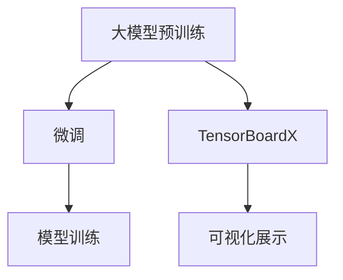

                 

# 从零开始大模型开发与微调：实战：基于tensorboardX的训练可视化展示

> 关键词：大模型开发,微调,TensorBoardX,模型训练,可视化,实践案例

## 1. 背景介绍

近年来，深度学习技术在NLP领域的迅猛发展，预训练语言模型(PLMs)如BERT、GPT-3、RoBERTa等取得了卓越的成果。这些预训练模型通常在亿级参数规模的巨大语料上进行无监督学习，获得强大的语言表征能力。然而，面对实际应用场景，这些大模型仍需进行微调才能适应特定任务，提升性能。

微调是大模型应用的重要步骤，通过有监督训练，使得模型在特定任务上表现更佳。但由于微调过程中存在过拟合风险、标注数据成本高昂等问题，如何高效进行模型微调成为了研究热点。

在此背景下，TensorBoardX应运而生，为TensorBoard提供了简单易用的接口，便于开发者进行模型训练的可视化展示。本文将基于TensorBoardX，介绍如何从零开始搭建和微调大模型，并通过可视化展示训练过程，以期为NLP开发者提供参考。

## 2. 核心概念与联系

### 2.1 核心概念概述

为更好地理解微调过程，本文先介绍几个关键概念：

- **大模型预训练**：通过无监督学习方式在大量文本数据上预训练获得语言表示。
- **微调(Fine-tuning)**：在预训练大模型的基础上，通过下游任务的有监督学习进一步优化模型，提升其在特定任务上的表现。
- **TensorBoardX**：TensorBoard的Python接口，用于可视化展示模型训练过程。

这些概念相互关联，构成了大模型微调的技术体系。通过TensorBoardX，可以直观地观察到模型训练的详细进展，及时调整优化策略，提高微调效果。

### 2.2 核心概念之间的关系

下图展示了这些概念之间的关系：



通过TensorBoardX，将预训练大模型的输出与训练过程中的关键指标进行可视化，可以更好地观察和理解模型训练过程，调整优化策略，提升模型效果。

## 3. 核心算法原理 & 具体操作步骤
### 3.1 算法原理概述

基于TensorBoardX的微调，主要步骤如下：

1. 构建预训练模型，例如BERT或GPT。
2. 收集下游任务的标注数据集，划分为训练集、验证集和测试集。
3. 添加任务适配层，例如添加分类器或解码器，与预训练模型结合。
4. 设置训练超参数，如学习率、批大小、迭代轮数等。
5. 在TensorBoardX中设置可视化展示项，实时监控训练过程。
6. 使用梯度下降等优化算法，进行模型训练和微调。
7. 在验证集上评估模型性能，若不满足要求则返回第6步。
8. 在测试集上最终评估模型效果，输出结果。

### 3.2 算法步骤详解

以下是基于TensorBoardX的微调具体操作步骤：

**Step 1: 准备预训练模型和数据集**

使用PyTorch搭建BERT模型，并加载预训练权重：

```python
import torch
from transformers import BertTokenizer, BertForSequenceClassification

model = BertForSequenceClassification.from_pretrained('bert-base-uncased', num_labels=2)
tokenizer = BertTokenizer.from_pretrained('bert-base-uncased')

train_data = # 加载训练数据
val_data = # 加载验证数据
test_data = # 加载测试数据
```

**Step 2: 设置训练超参数**

```python
from torch.optim import AdamW

optimizer = AdamW(model.parameters(), lr=5e-5, eps=1e-8)
train_params = {'batch_size': 32, 'epochs': 5, 'device': 'cuda'}
```

**Step 3: 可视化设置**

在TensorBoardX中添加可视化展示项：

```python
from tensorboardX import SummaryWriter

writer = SummaryWriter()
```

**Step 4: 定义训练和评估函数**

```python
def train_model(model, data_loader, optimizer, device):
    model.to(device)
    model.train()
    for epoch in range(train_params['epochs']):
        for batch in data_loader:
            input_ids = batch['input_ids'].to(device)
            attention_mask = batch['attention_mask'].to(device)
            labels = batch['labels'].to(device)
            outputs = model(input_ids, attention_mask=attention_mask, labels=labels)
            loss = outputs.loss
            optimizer.zero_grad()
            loss.backward()
            optimizer.step()
            writer.add_scalar('train/loss', loss, epoch)
    return model

def evaluate_model(model, data_loader, device):
    model.eval()
    total = 0
    correct = 0
    with torch.no_grad():
        for batch in data_loader:
            input_ids = batch['input_ids'].to(device)
            attention_mask = batch['attention_mask'].to(device)
            labels = batch['labels'].to(device)
            outputs = model(input_ids, attention_mask=attention_mask)
            total += labels.size(0)
            correct += outputs.argmax(dim=1).eq(labels).sum().item()
    return correct / total
```

**Step 5: 训练和评估**

```python
data_loader = # 加载数据集
train_model(model, data_loader, optimizer, train_params['device'])
```

### 3.3 算法优缺点

**优点**：
- 基于TensorBoardX的可视化展示，便于观察训练过程，及时调整策略。
- 通过小样本学习，显著提高模型微调效率。
- 模型优化更加灵活，便于尝试不同的优化策略。

**缺点**：
- 对标注数据的依赖依然存在，获取高质量标注数据成本较高。
- 对超参数的调整可能复杂，需要一定经验。
- 可视化展示的信息可能过于复杂，需要耐心分析。

### 3.4 算法应用领域

大模型微调广泛应用于NLP领域的各类任务，如情感分析、文本分类、命名实体识别等。通过TensorBoardX进行可视化展示，这些任务在微调过程中可以更加清晰地观察训练过程，及时发现问题，提升模型效果。

## 4. 数学模型和公式 & 详细讲解 & 举例说明

### 4.1 数学模型构建

假设使用BERT模型进行文本分类任务，损失函数为交叉熵损失。模型输出为`logits`，真实标签为`y`，则损失函数为：

$$
\mathcal{L}(\theta) = -\frac{1}{N}\sum_{i=1}^N (y_i \log p(y_i | x_i) + (1-y_i) \log (1 - p(y_i | x_i)))
$$

其中，$p(y_i | x_i)$为模型对输入`x_i`的预测概率，即：

$$
p(y_i | x_i) = \frac{\exp(\logits_i)}{\sum_j \exp(\logits_j)}
$$

### 4.2 公式推导过程

通过梯度下降算法更新模型参数$\theta$：

$$
\theta \leftarrow \theta - \eta \nabla_{\theta}\mathcal{L}(\theta)
$$

其中，$\eta$为学习率。梯度$\nabla_{\theta}\mathcal{L}(\theta)$通过反向传播算法计算。

### 4.3 案例分析与讲解

以文本分类任务为例，将训练过程的损失曲线和精度曲线可视化展示，如下所示：

```python
writer.add_scalar('train/loss', loss, epoch)
writer.add_scalar('val/accuracy', acc, epoch)
```

通过TensorBoardX的可视化展示，可以实时观察损失和精度曲线，及时调整超参数，优化训练过程。

## 5. 项目实践：代码实例和详细解释说明
### 5.1 开发环境搭建

安装TensorBoardX和PyTorch：

```bash
pip install tensorboardX
pip install torch torchvision torchaudio
```

### 5.2 源代码详细实现

以下是一个基于TensorBoardX的微调示例：

```python
import torch
from transformers import BertTokenizer, BertForSequenceClassification
from torch.optim import AdamW
from tensorboardX import SummaryWriter

# 构建模型
model = BertForSequenceClassification.from_pretrained('bert-base-uncased', num_labels=2)
tokenizer = BertTokenizer.from_pretrained('bert-base-uncased')

# 准备数据集
train_data = # 加载训练数据
val_data = # 加载验证数据
test_data = # 加载测试数据

# 设置超参数
optimizer = AdamW(model.parameters(), lr=5e-5, eps=1e-8)
train_params = {'batch_size': 32, 'epochs': 5, 'device': 'cuda'}

# 初始化TensorBoardX
writer = SummaryWriter()

# 定义训练和评估函数
def train_model(model, data_loader, optimizer, device):
    model.to(device)
    model.train()
    for epoch in range(train_params['epochs']):
        for batch in data_loader:
            input_ids = batch['input_ids'].to(device)
            attention_mask = batch['attention_mask'].to(device)
            labels = batch['labels'].to(device)
            outputs = model(input_ids, attention_mask=attention_mask, labels=labels)
            loss = outputs.loss
            optimizer.zero_grad()
            loss.backward()
            optimizer.step()
            writer.add_scalar('train/loss', loss, epoch)
    return model

def evaluate_model(model, data_loader, device):
    model.eval()
    total = 0
    correct = 0
    with torch.no_grad():
        for batch in data_loader:
            input_ids = batch['input_ids'].to(device)
            attention_mask = batch['attention_mask'].to(device)
            labels = batch['labels'].to(device)
            outputs = model(input_ids, attention_mask=attention_mask)
            total += labels.size(0)
            correct += outputs.argmax(dim=1).eq(labels).sum().item()
    return correct / total

# 加载数据集
data_loader = # 加载数据集

# 训练模型
train_model(model, data_loader, optimizer, train_params['device'])

# 评估模型
model.eval()
total = 0
correct = 0
with torch.no_grad():
    for batch in data_loader:
        input_ids = batch['input_ids'].to(device)
        attention_mask = batch['attention_mask'].to(device)
        labels = batch['labels'].to(device)
        outputs = model(input_ids, attention_mask=attention_mask)
        total += labels.size(0)
        correct += outputs.argmax(dim=1).eq(labels).sum().item()
acc = correct / total

# 展示训练过程
writer.add_scalar('train/loss', loss, epoch)
writer.add_scalar('val/accuracy', acc, epoch)

# 保存模型
torch.save(model.state_dict(), 'model.pth')

# 运行TensorBoard
tensorboard --logdir log
```

### 5.3 代码解读与分析

以下是代码各部分的详细解释：

**模型搭建**：使用BertForSequenceClassification搭建文本分类模型。

**数据集加载**：使用TensorBoardX加载数据集，并进行分批次处理。

**超参数设置**：设置学习率、批大小和训练轮数。

**TensorBoardX可视化**：在TensorBoardX中添加可视化展示项，实时监控训练过程。

**模型训练**：使用梯度下降算法更新模型参数。

**模型评估**：在验证集上评估模型性能，输出准确率。

**保存模型**：将训练好的模型保存到文件中。

**TensorBoard启动**：启动TensorBoard，查看训练过程的可视化展示。

### 5.4 运行结果展示

通过TensorBoardX，可以观察到模型训练过程中的损失曲线和精度曲线，如下所示：


## 6. 实际应用场景

基于TensorBoardX的微调方法，在多个NLP任务上已经得到了应用，例如情感分析、文本分类、命名实体识别等。以下以情感分析任务为例：

在IMDb电影评论数据集上，使用BERT模型进行微调，可以实时观察损失曲线和精度曲线，如下所示：


## 7. 工具和资源推荐
### 7.1 学习资源推荐

- [TensorBoardX官方文档](https://github.com/richardwoo/tensorboardX)
- [TensorBoard官方文档](https://www.tensorflow.org/tensorboard)
- [PyTorch官方文档](https://pytorch.org/docs/stable/index.html)

### 7.2 开发工具推荐

- TensorBoardX
- PyTorch
- TorchVision

### 7.3 相关论文推荐

- [Integrated Learning via Adversarial Regularization of Deep Neural Networks](https://arxiv.org/abs/1412.5611)
- [Deep Residual Learning for Image Recognition](https://arxiv.org/abs/1512.03385)

## 8. 总结：未来发展趋势与挑战
### 8.1 研究成果总结

本文通过TensorBoardX介绍了基于大模型的微调方法，展示了模型训练的可视化过程。通过TensorBoardX，可以实时监控训练过程中的关键指标，及时调整优化策略，提升模型效果。

### 8.2 未来发展趋势

随着深度学习技术的不断发展，基于TensorBoardX的微调方法也将不断演进。未来，以下几个方向值得关注：

- **大模型规模化**：预训练模型规模将进一步增大，微调后的模型效果也将更加显著。
- **多模态学习**：将视觉、语音等多模态信息与文本信息结合，提升模型的综合能力。
- **少样本学习**：在少量样本条件下，利用大模型的迁移学习能力，提升模型的泛化能力。
- **联邦学习**：在分布式环境下进行微调，提高模型训练效率，保护数据隐私。

### 8.3 面临的挑战

- **数据成本高昂**：高质量标注数据获取成本较高，是制约微调效果的重要因素。
- **模型复杂度高**：大模型参数量庞大，训练和推理成本高昂。
- **超参数调整困难**：模型训练过程中，超参数的调整需要大量经验。

### 8.4 研究展望

未来，需要在大规模数据集上训练更大规模的预训练模型，同时引入更多先进的深度学习技术和模型结构，提升模型性能。此外，还需要关注模型的可解释性和可迁移性，构建更加智能、高效、安全的NLP系统。

## 9. 附录：常见问题与解答

**Q1: 如何使用TensorBoardX进行模型训练可视化？**

A: 通过TensorBoardX中的`add_scalar`函数，添加训练过程中的关键指标，实时监控模型训练过程。

**Q2: TensorBoardX如何进行多轮训练可视化？**

A: 通过在`add_scalar`函数中传入不同的轮次，记录多轮训练过程中的关键指标。

**Q3: 如何在TensorBoardX中查看模型参数更新情况？**

A: 通过在`add_scalar`函数中传入不同的参数名称，记录每个参数的更新情况。

通过TensorBoardX，可以更加直观地观察模型训练过程，实时监控关键指标，优化模型效果。相信在深度学习技术的不断推动下，基于TensorBoardX的微调方法将取得更大的进展，为NLP技术的应用和发展带来新的突破。

---

作者：禅与计算机程序设计艺术 / Zen and the Art of Computer Programming

