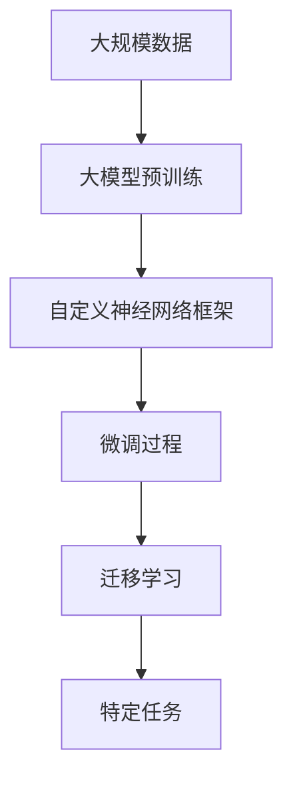

                 

# 从零开始大模型开发与微调：自定义神经网络框架的具体实现

> 关键词：自定义神经网络框架,大模型开发,微调,Fine-Tuning,深度学习,Python

## 1. 背景介绍

### 1.1 问题由来

近年来，深度学习技术在自然语言处理（NLP）、计算机视觉（CV）、语音识别等领域取得了显著突破。基于深度神经网络的"大模型"（如BERT、GPT-3等）成为这些领域的主流。这些大模型在大量无标签数据上进行预训练，学习到丰富的通用特征，能在大规模有标签数据上微调（Fine-Tuning）以适应各种下游任务，如文本分类、命名实体识别、对话系统等。

但是，直接使用开源的大模型通常会受到数据集大小、训练成本等因素的限制，无法完全满足特定应用场景的需求。因此，从零开始开发自定义的神经网络框架，并在此基础上进行大模型微调，成为一种重要的解决方案。

### 1.2 问题核心关键点

本节将介绍从零开始开发自定义神经网络框架，并进行大模型微调的核心步骤和要点。

- **框架设计**：如何设计一个高效、可扩展、易维护的神经网络框架。
- **大模型开发**：如何在自定义框架上开发大模型，包括模型结构设计、预训练算法等。
- **微调方法**：如何进行基于自定义框架的大模型微调，以及微调的常见技术手段。
- **应用案例**：结合实际应用场景，演示自定义框架在微调大模型中的具体实现。

### 1.3 问题研究意义

从零开始开发自定义神经网络框架并进行大模型微调，对深入理解深度学习技术，解决特定应用场景中的问题，具有重要意义：

1. **定制化需求**：自定义框架可以根据具体任务需求，灵活设计模型结构和算法，满足特定的性能和精度要求。
2. **应用灵活性**：自定义框架可以针对不同领域和应用场景进行优化，适应更广泛的应用需求。
3. **优化空间**：自定义框架提供了更多的优化点，可以在模型设计、算法优化、训练过程等多个环节提升模型性能。
4. **资源利用**：自定义框架可以根据硬件资源（如GPU、TPU等）进行优化，提高计算效率，降低训练成本。
5. **可解释性**：自定义框架可以更好地控制模型的内部机制，提供更强的可解释性和可审计性。

## 2. 核心概念与联系

### 2.1 核心概念概述

要了解如何从零开始开发自定义神经网络框架并进行大模型微调，首先需要理解以下几个核心概念：

- **神经网络框架**：一种基于深度学习的软件框架，用于构建、训练和部署神经网络模型。常见的框架包括TensorFlow、PyTorch、Keras等。
- **大模型**：基于大规模数据进行预训练的深度学习模型，如BERT、GPT-3、ResNet等，具有强大的通用特征学习能力和丰富的知识表示。
- **微调(Fine-Tuning)**：在大模型的基础上，使用特定任务的有标签数据进行有监督学习，优化模型在该任务上的性能。
- **迁移学习**：利用预训练模型在不同任务之间的知识迁移，提升模型在新任务上的表现。
- **深度学习**：基于神经网络进行机器学习的方法，旨在通过多层次的特征表示学习，提升模型的表达能力和泛化能力。

### 2.2 概念间的关系

这些核心概念之间存在紧密的联系，通过以下Mermaid流程图展示它们的相互关系：


这个流程图展示了神经网络框架与大模型开发、微调和迁移学习的关系：

1. **神经网络框架**提供了构建和训练大模型的基础平台。
2. **大模型开发**在框架上设计和训练大规模预训练模型。
3. **微调**利用特定任务的数据，在大模型基础上进行有监督学习，优化模型性能。
4. **迁移学习**利用大模型在不同任务之间的知识迁移，提升模型在新任务上的表现。

### 2.3 核心概念的整体架构

最后，用一个综合的流程图展示这些核心概念在大模型微调过程中的整体架构：



这个综合流程图展示了从预训练到微调，再到迁移学习的完整过程。

## 3. 核心算法原理 & 具体操作步骤
### 3.1 算法原理概述

从零开始开发自定义神经网络框架并进行大模型微调，本质上是一个深度学习模型的设计和训练过程。其核心思想是：

1. **框架设计**：构建一个高效的神经网络框架，支持模型的构建、训练和推理。
2. **大模型开发**：在大模型框架上，设计并训练一个预训练模型。
3. **微调方法**：在预训练模型的基础上，使用特定任务的数据进行有监督学习，优化模型在该任务上的性能。
4. **迁移学习**：利用预训练模型在不同任务之间的知识迁移，提升模型在新任务上的表现。

### 3.2 算法步骤详解

基于上述核心思想，从零开始开发自定义神经网络框架并进行大模型微调的具体步骤如下：

**Step 1: 设计框架**

- **模块划分**：根据任务的复杂度，将框架划分为不同的模块，如模型定义模块、数据处理模块、训练模块等。
- **接口设计**：设计易于使用的接口，方便用户构建和训练模型。
- **内存优化**：设计内存优化策略，如使用GPU、TPU等硬件加速，避免内存瓶颈。
- **并行计算**：设计并行计算模块，支持多GPU、多TPU的并行训练。

**Step 2: 开发预训练模型**

- **模型选择**：选择适合任务的模型结构，如卷积神经网络、循环神经网络、变压器等。
- **数据预处理**：对数据进行预处理，如分词、向量化等。
- **预训练算法**：设计预训练算法，如自监督学习、对抗训练等。
- **模型保存**：在预训练完成后，保存模型权重，供后续微调使用。

**Step 3: 微调模型**

- **任务适配层设计**：根据任务类型，设计适当的输出层和损失函数。
- **优化器选择**：选择合适的优化器及其参数，如AdamW、SGD等。
- **学习率设置**：设置合适的学习率，避免破坏预训练权重。
- **训练数据处理**：对训练数据进行处理，如分批次、数据增强等。
- **模型更新**：通过反向传播计算梯度，更新模型参数。
- **模型评估**：在验证集上评估模型性能，根据性能指标决定是否停止训练。

**Step 4: 迁移学习**

- **知识迁移**：将预训练模型迁移到新任务上，设计任务适配层。
- **微调策略**：根据任务特点，选择微调策略，如全参数微调、参数高效微调等。
- **模型更新**：更新模型参数，优化模型在新任务上的性能。
- **模型保存**：保存微调后的模型，供实际应用。

### 3.3 算法优缺点

自定义神经网络框架进行大模型微调具有以下优点：

1. **灵活性高**：可以根据具体任务需求，灵活设计模型结构和算法。
2. **适应性强**：可以根据不同硬件资源进行优化，提高计算效率。
3. **可解释性强**：可以控制模型的内部机制，提供更强的可解释性和可审计性。
4. **资源利用率高**：可以根据具体任务进行优化，提高资源利用率。

但同时也存在一些缺点：

1. **开发周期长**：从头开发一个完整的神经网络框架需要较长的开发周期。
2. **技术门槛高**：需要深入理解深度学习技术和框架设计。
3. **代码复杂度**：自定义框架的代码复杂度较高，开发难度大。
4. **社区支持不足**：相对于开源框架，自定义框架的社区支持和资源较少。

### 3.4 算法应用领域

自定义神经网络框架进行大模型微调，已经在多个领域得到了应用，例如：

1. **自然语言处理(NLP)**：如文本分类、命名实体识别、机器翻译等。
2. **计算机视觉(CV)**：如图像分类、目标检测、图像生成等。
3. **语音识别**：如自动语音识别、语音合成等。
4. **推荐系统**：如个性化推荐、用户画像等。
5. **医疗领域**：如医学影像分析、疾病预测等。

## 4. 数学模型和公式 & 详细讲解
### 4.1 数学模型构建

定义一个神经网络模型，其输入为 $x$，输出为 $y$，模型参数为 $\theta$，激活函数为 $f$，损失函数为 $\mathcal{L}$，训练数据集为 $D$。则模型的前向传播过程为：

$$
y = f(\theta \cdot x)
$$

反向传播过程中，损失函数对模型参数的梯度为：

$$
\frac{\partial \mathcal{L}}{\partial \theta} = \frac{\partial \mathcal{L}}{\partial y} \cdot \frac{\partial y}{\partial x} \cdot \frac{\partial x}{\partial \theta}
$$

根据上述公式，反向传播计算模型参数的梯度，并通过优化算法更新模型参数，最小化损失函数。

### 4.2 公式推导过程

以二分类任务为例，推导交叉熵损失函数及其梯度的计算公式。

假设模型 $M_{\theta}$ 在输入 $x$ 上的输出为 $\hat{y}=M_{\theta}(x)$，表示样本属于正类的概率。真实标签 $y \in \{0,1\}$。则二分类交叉熵损失函数定义为：

$$
\ell(M_{\theta}(x),y) = -[y\log \hat{y} + (1-y)\log (1-\hat{y})]
$$

将其代入经验风险公式，得：

$$
\mathcal{L}(\theta) = -\frac{1}{N}\sum_{i=1}^N [y_i\log M_{\theta}(x_i)+(1-y_i)\log(1-M_{\theta}(x_i))]
$$

根据链式法则，损失函数对参数 $\theta_k$ 的梯度为：

$$
\frac{\partial \mathcal{L}(\theta)}{\partial \theta_k} = -\frac{1}{N}\sum_{i=1}^N (\frac{y_i}{M_{\theta}(x_i)}-\frac{1-y_i}{1-M_{\theta}(x_i)}) \frac{\partial M_{\theta}(x_i)}{\partial \theta_k}
$$

其中 $\frac{\partial M_{\theta}(x_i)}{\partial \theta_k}$ 可进一步递归展开，利用自动微分技术完成计算。

### 4.3 案例分析与讲解

以手写数字识别为例，展示使用自定义框架进行大模型微调的过程。

假设已经构建了一个简单的全连接神经网络模型，在手写数字识别任务上进行了预训练。现在，我们要在这个预训练模型上微调，使用一个包含标注数据的小样本数据集。

**Step 1: 加载预训练模型**

```python
import torch
import torch.nn as nn
import torchvision.transforms as transforms
from torchvision.datasets import MNIST

# 加载预训练模型
model = MyModel()
model.load_state_dict(torch.load('pretrain_model.pth'))
model.eval()
```

**Step 2: 准备数据**

```python
# 数据预处理
transform = transforms.Compose([
    transforms.ToTensor(),
    transforms.Normalize((0.5,), (0.5,))
])

train_dataset = MNIST(root='data', train=True, transform=transform, download=True)
test_dataset = MNIST(root='data', train=False, transform=transform, download=True)

# 划分训练集和测试集
train_loader = torch.utils.data.DataLoader(train_dataset, batch_size=64, shuffle=True)
test_loader = torch.utils.data.DataLoader(test_dataset, batch_size=64)
```

**Step 3: 微调模型**

```python
# 定义损失函数和优化器
criterion = nn.CrossEntropyLoss()
optimizer = torch.optim.Adam(model.parameters(), lr=0.001)

# 训练过程
for epoch in range(10):
    running_loss = 0.0
    for inputs, labels in train_loader:
        # 前向传播
        outputs = model(inputs)
        loss = criterion(outputs, labels)
        running_loss += loss.item()

        # 反向传播和优化
        optimizer.zero_grad()
        loss.backward()
        optimizer.step()

    # 测试集评估
    correct = 0
    total = 0
    with torch.no_grad():
        for inputs, labels in test_loader:
            outputs = model(inputs)
            _, predicted = torch.max(outputs.data, 1)
            total += labels.size(0)
            correct += (predicted == labels).sum().item()

    print(f'Epoch {epoch+1}, loss: {running_loss/len(train_loader):.4f}, accuracy: {100 * correct / total:.2f}%')
```

## 5. 项目实践：代码实例和详细解释说明
### 5.1 开发环境搭建

为了进行大模型微调，需要搭建一个高效、可扩展的开发环境。以下是使用Python和PyTorch搭建开发环境的流程：

1. **安装Python和PyTorch**：
   ```bash
   conda create -n my_env python=3.8
   conda activate my_env
   pip install torch torchvision torchaudio
   ```

2. **安装TensorBoard**：用于可视化训练过程。
   ```bash
   pip install tensorboard
   ```

3. **安装自定义框架**：构建自定义神经网络框架的代码。

4. **配置GPU/TPU**：配置硬件资源，支持并行计算和分布式训练。

5. **安装其他库**：安装其他必要的库，如numpy、pandas等。

### 5.2 源代码详细实现

这里以手写数字识别为例，展示如何使用自定义框架进行微调。

**Step 1: 定义自定义框架**

```python
import torch
import torch.nn as nn
import torch.nn.functional as F

class MyModel(nn.Module):
    def __init__(self):
        super(MyModel, self).__init__()
        self.fc1 = nn.Linear(784, 256)
        self.fc2 = nn.Linear(256, 128)
        self.fc3 = nn.Linear(128, 10)

    def forward(self, x):
        x = x.view(-1, 784)
        x = F.relu(self.fc1(x))
        x = F.relu(self.fc2(x))
        x = self.fc3(x)
        return x
```

**Step 2: 预训练模型**

```python
# 定义预训练模型
model = MyModel()

# 加载预训练模型权重
pretrain_weights = torch.load('pretrain_model.pth')
model.load_state_dict(pretrain_weights)

# 设置模型为评估模式
model.eval()
```

**Step 3: 准备数据**

```python
# 加载手写数字识别数据集
train_dataset = MNIST(root='data', train=True, transform=transforms.ToTensor(), download=True)
test_dataset = MNIST(root='data', train=False, transform=transforms.ToTensor(), download=True)

# 划分训练集和测试集
train_loader = torch.utils.data.DataLoader(train_dataset, batch_size=64, shuffle=True)
test_loader = torch.utils.data.DataLoader(test_dataset, batch_size=64)

# 定义损失函数和优化器
criterion = nn.CrossEntropyLoss()
optimizer = torch.optim.Adam(model.parameters(), lr=0.001)

# 训练过程
for epoch in range(10):
    running_loss = 0.0
    for inputs, labels in train_loader:
        # 前向传播
        outputs = model(inputs)
        loss = criterion(outputs, labels)
        running_loss += loss.item()

        # 反向传播和优化
        optimizer.zero_grad()
        loss.backward()
        optimizer.step()

    # 测试集评估
    correct = 0
    total = 0
    with torch.no_grad():
        for inputs, labels in test_loader:
            outputs = model(inputs)
            _, predicted = torch.max(outputs.data, 1)
            total += labels.size(0)
            correct += (predicted == labels).sum().item()

    print(f'Epoch {epoch+1}, loss: {running_loss/len(train_loader):.4f}, accuracy: {100 * correct / total:.2f}%')
```

### 5.3 代码解读与分析

以下是对代码关键部分的解读与分析：

**自定义框架的实现**：自定义框架`MyModel`定义了神经网络模型的结构，包括三个全连接层。其中，前两层使用ReLU激活函数，最后一层输出数字类别。

**预训练模型加载**：加载预训练模型权重，并将其设置为评估模式。

**数据预处理**：使用PyTorch的DataLoader对数据集进行批处理和打乱，方便模型训练。

**损失函数和优化器**：定义交叉熵损失函数和Adam优化器，用于训练模型。

**训练过程**：在每个epoch内，对训练集进行前向传播和反向传播，更新模型参数。在测试集上评估模型性能。

**结果展示**：打印每个epoch的训练损失和测试准确率。

## 6. 实际应用场景
### 6.1 智能推荐系统

在智能推荐系统中，使用自定义框架进行大模型微调，可以提升推荐系统的效果和用户满意度。推荐系统需要处理海量的用户行为数据，从中挖掘用户的兴趣和偏好，推荐个性化的商品或内容。

通过使用自定义框架，可以设计适合自己业务场景的推荐模型，并进行微调。例如，可以使用循环神经网络或卷积神经网络，处理用户行为序列或图像数据，预测用户对不同商品或内容的评分，从而推荐更符合用户兴趣的商品或内容。

### 6.2 医疗影像分析

在医疗影像分析中，使用自定义框架进行大模型微调，可以提高影像诊断的准确性和效率。医疗影像通常包含大量的结构化数据，如CT、MRI、X光等。

通过使用自定义框架，可以构建适合自己领域需求的影像分析模型，并进行微调。例如，可以使用卷积神经网络或Transformer，处理医疗影像数据，进行病变区域的检测和分类，提升影像诊断的准确性。

### 6.3 金融风险控制

在金融风险控制中，使用自定义框架进行大模型微调，可以提高风险评估的精度和实时性。金融风险控制需要处理大量的交易数据，从中挖掘潜在的风险因素，进行风险预警和控制。

通过使用自定义框架，可以设计适合自己业务场景的风险控制模型，并进行微调。例如，可以使用循环神经网络或长短期记忆网络（LSTM），处理交易数据序列，预测未来的交易趋势，进行风险预警和控制。

## 7. 工具和资源推荐
### 7.1 学习资源推荐

为了系统掌握大模型开发与微调技术，这里推荐一些优质的学习资源：

1. **TensorFlow官方文档**：提供全面、详细的TensorFlow教程和文档，涵盖模型的构建、训练和推理等各个环节。

2. **PyTorch官方文档**：提供全面、详细的PyTorch教程和文档，涵盖自定义框架的开发和优化。

3. **Keras官方文档**：提供全面、详细的Keras教程和文档，涵盖深度学习模型的构建和训练。

4. **深度学习入门**：介绍深度学习的基本概念和算法，适合初学者入门。

5. **深度学习实战**：提供大量深度学习实践案例，适合进阶学习。

6. **Coursera深度学习课程**：斯坦福大学和deeplearning.ai联合开设的深度学习课程，涵盖深度学习的各个方面。

### 7.2 开发工具推荐

为了提高大模型开发与微调的效率，这里推荐一些常用的开发工具：

1. **PyTorch**：一个灵活、高效、可扩展的深度学习框架，支持自定义神经网络框架的开发。

2. **TensorFlow**：一个强大的深度学习框架，支持分布式计算和模型优化。

3. **Keras**：一个易用、易扩展的深度学习框架，适合快速搭建和训练模型。

4. **Jupyter Notebook**：一个交互式的数据分析工具，适合编写和执行深度学习代码。

5. **GitHub**：一个代码托管平台，适合版本控制和代码协作。

### 7.3 相关论文推荐

大模型开发与微调技术的发展离不开学界的持续研究。以下是几篇奠基性的相关论文，推荐阅读：

1. **Deep Learning**：Hinton等人撰写的深度学习经典教材，涵盖深度学习的基本概念和算法。

2. **ImageNet Classification with Deep Convolutional Neural Networks**：AlexNet论文，提出卷积神经网络在图像分类任务中的突破性应用。

3. **Convolutional Neural Networks for Sentence Classification**：使用卷积神经网络处理自然语言分类任务的经典论文。

4. **Attention is All You Need**：提出Transformer模型，开创了自注意力机制在NLP领域的应用。

5. **BERT: Pre-training of Deep Bidirectional Transformers for Language Understanding**：提出BERT模型，引入预训练和微调范式，成为NLP领域的经典模型。

## 8. 总结：未来发展趋势与挑战
### 8.1 总结

本文对从零开始大模型开发与微调进行了全面系统的介绍。首先阐述了自定义神经网络框架和大模型微调的基本概念和重要性，然后详细讲解了从框架设计到微调实现的各个步骤和要点。最后，结合实际应用场景，演示了自定义框架在微调大模型中的具体实现。

通过本文的系统梳理，可以看到，自定义神经网络框架进行大模型微调具有广泛的应用前景和潜在的价值。开发者可以根据具体任务需求，灵活设计模型结构和算法，提升模型的性能和精度。

### 8.2 未来发展趋势

展望未来，大模型开发与微调技术将呈现以下几个发展趋势：

1. **模型规模持续增大**：随着算力成本的下降和数据规模的扩张，预训练模型将进一步增大，学习更多的通用特征，提高模型的泛化能力。

2. **框架优化不断提升**：自定义框架将不断优化，提升模型的性能和效率，支持更复杂的网络结构和算法。

3. **微调方法多样化**：除了传统的全参数微调外，未来将涌现更多参数高效和计算高效的微调方法，如参数微调、自适应微调等。

4. **跨领域知识迁移**：大模型将更好地进行跨领域知识迁移，提升模型的泛化能力和适用性。

5. **多模态学习**：大模型将更好地进行多模态学习，整合视觉、语音、文本等多种数据来源，提升模型的综合能力。

### 8.3 面临的挑战

尽管大模型开发与微调技术已经取得了显著成果，但在实现规模化应用的过程中，仍面临诸多挑战：

1. **数据依赖问题**：微调模型对标注数据的依赖较大，获取高质量标注数据的成本较高，且数据分布可能不平衡。

2. **模型泛化能力**：大模型在特定任务上的泛化能力有限，面对新领域和新数据时，效果可能不理想。

3. **计算资源需求**：大模型开发和微调需要大量的计算资源，如何提高计算效率，降低计算成本，是当前的重要研究方向。

4. **可解释性问题**：大模型作为"黑盒"系统，其内部机制难以解释，对某些高风险应用，需要提供更强的可解释性和可审计性。

5. **安全性问题**：大模型可能学习到有害的信息，传递到下游任务，造成潜在的风险。

### 8.4 研究展望

为了应对这些挑战，未来的研究需要在以下几个方面寻求新的突破：

1. **无监督学习和半监督学习**：利用无监督和半监督学习方法，降低对标注数据的依赖，提高模型的泛化能力。

2. **参数高效微调**：开发更多的参数高效微调方法，减少微调过程中的计算量和内存消耗。

3. **多模态融合**：将视觉、语音、文本等多种数据来源进行融合，提升模型的综合能力和适用性。

4. **可解释性技术**：引入可解释性技术，提高模型的可解释性和可审计性。

5. **安全性保障**：设计安全性保障机制，防止有害信息的传递，确保模型的安全性。

总之，大模型开发与微调技术将不断推进人工智能技术的进步，为各个领域带来更高效、更智能、更安全的应用解决方案。面对未来的挑战，科研人员和开发者需要不断探索和创新，共同推动大模型技术的不断发展。

## 9. 附录：常见问题与解答

**Q1: 大模型微调和预训练有什么区别？**

A: 大模型预训练和微调是深度学习模型训练的两个阶段。预训练阶段在大规模无标签数据上进行自监督学习，学习通用的语言知识。微调阶段在大规模标注数据上进行有监督学习，优化模型在特定任务上的性能。两者相辅相成，共同构成大模型的训练流程。

**Q2: 自定义框架开发需要哪些关键技术？**

A: 自定义框架开发需要掌握以下关键技术：

1. **神经网络结构设计**：设计适合自己业务场景的神经网络结构，如卷积神经网络、循环神经网络、Transformer等。

2. **数据处理技术**：设计高效的数据预处理和批处理技术，如分词、向量化、数据增强等。

3. **优化器设计**：选择合适的优化器及其参数，如Adam、SGD等。

