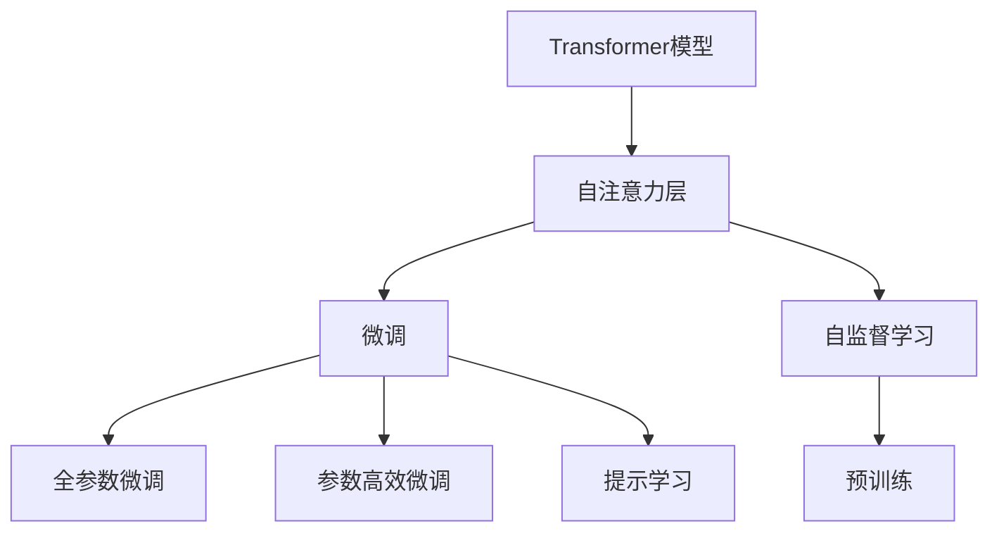
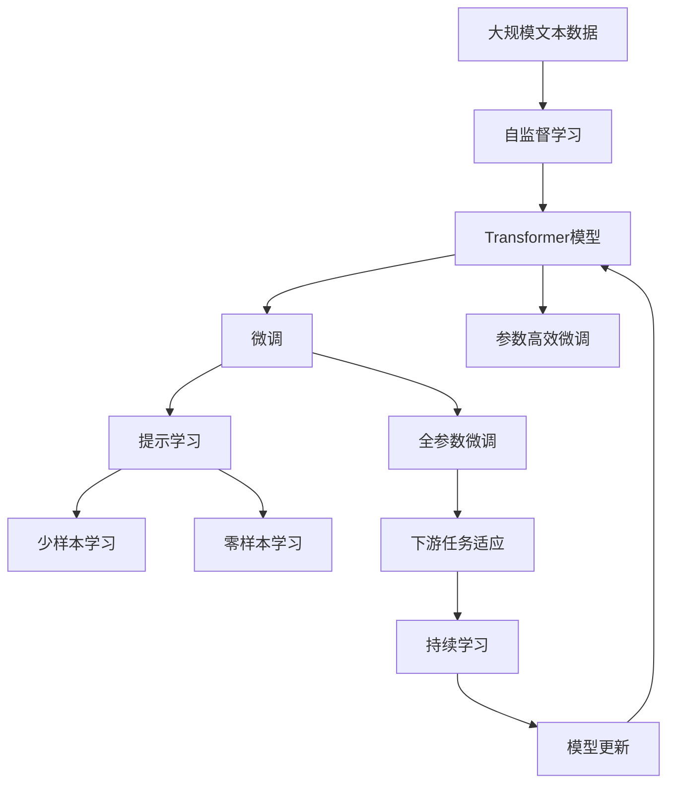

                 

# 从零开始大模型开发与微调：自注意力层

> 关键词：自注意力层,Transformer模型,自监督学习,微调,Fine-tuning

## 1. 背景介绍

### 1.1 问题由来
近年来，深度学习技术取得了巨大进展，尤其是在自然语言处理(Natural Language Processing, NLP)领域，大语言模型大放异彩。这些大模型通过在无标签文本数据上进行的自监督预训练，学习了丰富的语言知识和常识，能够对自然语言进行高效的表示和理解。然而，对于特定领域的应用，这些通用模型往往需要进一步的微调(fine-tuning)才能取得最佳性能。

自注意力层（Self-Attention Layer）是Transformer模型中的核心组件，负责捕捉文本序列中不同位置间的关系，从而提升了模型的语言理解能力和表达能力。因此，深入理解自注意力层的原理和应用，对于大模型的开发和微调至关重要。

### 1.2 问题核心关键点
本文将重点探讨自注意力层在大模型开发与微调中的原理与应用，为读者提供清晰的理论框架和实践指南。我们将从自注意力层的定义、原理、实现细节及其实际应用几个方面进行深入分析，并结合具体案例进行讲解，帮助读者更好地理解和应用这一重要技术。

### 1.3 问题研究意义
研究自注意力层在大模型中的应用，对于拓展大模型的应用范围，提升下游任务的性能，加速NLP技术的产业化进程，具有重要意义：

1. **降低应用开发成本**：利用已有的预训练模型进行微调，可以显著减少从头开发所需的数据、计算和人力等成本投入。
2. **提升模型效果**：微调使得通用大模型更好地适应特定任务，在应用场景中取得更优表现。
3. **加速开发进度**：基于预训练模型的微调可以快速适配新任务，缩短开发周期。
4. **技术创新**：微调范式促进了对自注意力层的深入研究，催生了更多前沿研究方向，如参数高效微调、提示学习等。
5. **赋能产业升级**：微调技术使得NLP技术更容易被各行各业所采用，为传统行业数字化转型升级提供新的技术路径。

## 2. 核心概念与联系

### 2.1 核心概念概述

自注意力层是Transformer模型中的关键组成部分，负责捕捉文本序列中不同位置间的关系，从而提升模型的语言理解能力和表达能力。以下是几个相关核心概念的概述：

- **Transformer模型**：基于自注意力机制的序列模型，能够高效地处理长文本序列，广泛应用于机器翻译、文本生成、问答系统等NLP任务。
- **自注意力机制**：一种用于计算序列中每个位置与其它位置相关性的机制，通过权重矩阵来分配注意力，实现信息在序列中的全局流动。
- **微调(Fine-tuning)**：在大模型的基础上，使用下游任务的少量标注数据，通过有监督学习优化模型在特定任务上的性能。
- **参数高效微调(Parameter-Efficient Fine-Tuning, PEFT)**：在微调过程中，只更新少量的模型参数，而固定大部分预训练权重不变，以提高微调效率，避免过拟合的方法。
- **自监督学习(Self-Supervised Learning)**：通过在大量无标签数据上设计的预训练任务，训练模型的语言表示，使其在少量有标签数据上也能取得优异表现。

### 2.2 概念间的关系

这些核心概念之间的逻辑关系可以通过以下Mermaid流程图来展示：



这个流程图展示了大模型微调过程中各个核心概念之间的关系：

1. **Transformer模型** 是基础，通过自注意力层进行信息交互。
2. **微调** 是在预训练模型基础上进行有监督学习，以适应特定任务。
3. **自监督学习** 是在无标签数据上训练模型，为下游任务提供预训练权重。
4. **自注意力层** 是微调过程的必经环节，用于捕捉序列间的复杂关系。
5. **参数高效微调** 和 **提示学习** 是在微调过程中提高效率和效果的方法。

### 2.3 核心概念的整体架构

最后，我们用一个综合的流程图来展示自注意力层在大模型微调过程中的整体架构：



这个综合流程图展示了从自监督学习到大模型微调，再到下游任务适应的完整过程。自注意力层作为Transformer模型的核心，在整个流程中扮演了关键角色。

## 3. 核心算法原理 & 具体操作步骤
### 3.1 算法原理概述

自注意力层（Self-Attention Layer）是Transformer模型的关键组成部分，其原理基于自注意力机制（Self-Attention Mechanism），旨在通过计算序列中每个位置与其他位置的相关性，捕捉文本序列中的重要信息，从而提升模型的表达能力和理解能力。

自注意力机制的核心思想是通过多头注意力（Multi-Head Attention）机制，同时关注输入序列的不同位置，实现信息的充分交互和融合。具体而言，自注意力层包含三个子层：查询（Query）、键（Key）和值（Value），通过计算注意力权重（Attention Weight），实现不同位置之间的信息交互。

### 3.2 算法步骤详解

1. **输入表示**：将输入序列转换为向量表示，通常使用词嵌入（Word Embedding）将每个词汇映射到一个低维向量空间中。
2. **计算查询向量**：将输入向量乘以一个投影矩阵，得到查询向量。
3. **计算键和值向量**：将输入向量分别乘以不同的投影矩阵，得到键向量（Key）和值向量（Value）。
4. **计算注意力权重**：通过计算查询向量与键向量的点积，得到注意力权重。
5. **加权求和**：根据注意力权重，对值向量进行加权求和，得到注意力输出向量。
6. **输出投影**：将注意力输出向量通过另一个投影矩阵，得到最终输出向量。

具体步骤如下：

- **步骤1**：将输入序列 $x = \{x_1, x_2, ..., x_n\}$ 转换为向量表示 $X = [x_1, x_2, ..., x_n]$。
- **步骤2**：对 $X$ 进行线性变换，得到查询向量 $Q = XW_Q$，键向量 $K = XW_K$，值向量 $V = XW_V$，其中 $W_Q, W_K, W_V$ 是三个不同的线性投影矩阵。
- **步骤3**：计算注意力权重 $A$，通过点乘得到 $A = QK^T$。
- **步骤4**：对 $A$ 进行Softmax操作，得到归一化的注意力权重 $\alpha = \text{Softmax}(A)$。
- **步骤5**：对 $V$ 进行加权求和，得到注意力输出向量 $O = \alpha V$。
- **步骤6**：对 $O$ 进行线性变换，得到最终输出向量 $Y = OW_L$，其中 $W_L$ 是线性投影矩阵。

通过上述步骤，自注意力层能够捕捉序列中不同位置之间的关系，实现信息的全局流动，提升模型的表达能力。

### 3.3 算法优缺点

自注意力层在大模型的开发与微调中具有以下优点：

1. **高效表达能力**：自注意力层能够捕捉长序列中的复杂关系，提升了模型的表达能力和理解能力。
2. **跨领域适应性**：自注意力层在预训练阶段学习了通用的语言表示，具有较好的跨领域适应性。
3. **易于微调**：自注意力层的参数量相对较小，适合进行参数高效微调，避免了过拟合。

然而，自注意力层也存在一些缺点：

1. **计算复杂度高**：自注意力层的计算复杂度较高，尤其是在序列较长的情况下。
2. **难以解释**：自注意力层的决策过程难以解释，缺乏可解释性。
3. **容易过拟合**：在微调过程中，自注意力层容易过拟合，特别是当训练数据量不足时。

### 3.4 算法应用领域

自注意力层广泛应用于各种NLP任务，包括但不限于：

- **机器翻译**：利用自注意力层捕捉源语言和目标语言之间的对应关系，提升翻译质量。
- **文本生成**：通过自注意力层，模型能够捕捉上下文信息，生成连贯的文本。
- **问答系统**：自注意力层能够捕捉问题与答案之间的关系，提升问答系统的准确性。
- **摘要生成**：自注意力层能够捕捉文本中重要的信息片段，生成简洁的摘要。
- **语音识别**：通过自注意力层，模型能够捕捉语音信号中的关键信息，提升识别准确率。

## 4. 数学模型和公式 & 详细讲解 & 举例说明

### 4.1 数学模型构建

自注意力层的数学模型可以表示为：

$$
\text{Attention}(Q, K, V) = \text{Softmax}(QK^T)V
$$

其中，$Q, K, V$ 分别表示查询向量、键向量和值向量。

假设输入序列 $X = [x_1, x_2, ..., x_n]$，自注意力层的计算过程可以表示为：

$$
Q = XW_Q, K = XW_K, V = XW_V
$$

$$
A = QK^T, \alpha = \text{Softmax}(A), O = \alpha V
$$

$$
Y = OW_L
$$

其中 $W_Q, W_K, W_V, W_L$ 是可学习的线性投影矩阵。

### 4.2 公式推导过程

以一个简单的双向Transformer模型为例，推导自注意力层的计算过程。

假设输入序列 $X = [x_1, x_2, ..., x_n]$，首先对其进行线性变换得到查询向量 $Q = XW_Q$，键向量 $K = XW_K$，值向量 $V = XW_V$。

计算注意力权重 $A = QK^T$，然后对 $A$ 进行Softmax操作得到归一化的注意力权重 $\alpha = \text{Softmax}(A)$。

根据注意力权重 $\alpha$ 对值向量 $V$ 进行加权求和，得到注意力输出向量 $O = \alpha V$。

最后，对 $O$ 进行线性变换，得到最终输出向量 $Y = OW_L$。

通过上述推导，可以看到自注意力层的计算过程是一个序列间信息交互的过程，能够捕捉序列中不同位置之间的关系，提升模型的表达能力。

### 4.3 案例分析与讲解

以机器翻译任务为例，展示自注意力层的应用。

假设有一个英语句子 "I like apples"，需要将其翻译成法语。首先，通过词嵌入将每个单词转换为向量表示，然后通过自注意力层捕捉源语言和目标语言之间的关系，生成目标语言句子。

具体步骤如下：

- **步骤1**：将输入句子 "I like apples" 转换为向量表示 $X$。
- **步骤2**：对 $X$ 进行线性变换，得到查询向量 $Q = XW_Q$，键向量 $K = XW_K$，值向量 $V = XW_V$。
- **步骤3**：计算注意力权重 $A = QK^T$，然后对 $A$ 进行Softmax操作得到归一化的注意力权重 $\alpha = \text{Softmax}(A)$。
- **步骤4**：根据注意力权重 $\alpha$ 对值向量 $V$ 进行加权求和，得到注意力输出向量 $O = \alpha V$。
- **步骤5**：对 $O$ 进行线性变换，得到最终输出向量 $Y = OW_L$。

通过自注意力层，模型能够捕捉源语言和目标语言之间的关系，生成连贯的翻译结果。

## 5. 项目实践：代码实例和详细解释说明

### 5.1 开发环境搭建

在进行自注意力层的项目实践前，我们需要准备好开发环境。以下是使用Python进行TensorFlow开发的环境配置流程：

1. 安装Anaconda：从官网下载并安装Anaconda，用于创建独立的Python环境。

2. 创建并激活虚拟环境：
```bash
conda create -n tf-env python=3.8 
conda activate tf-env
```

3. 安装TensorFlow：根据CUDA版本，从官网获取对应的安装命令。例如：
```bash
conda install tensorflow -c tf -c conda-forge
```

4. 安装numpy、pandas、scikit-learn等常用工具包：
```bash
pip install numpy pandas scikit-learn tensorflow
```

完成上述步骤后，即可在`tf-env`环境中开始自注意力层的项目实践。

### 5.2 源代码详细实现

这里我们以双向Transformer模型为例，展示自注意力层的实现代码。

```python
import tensorflow as tf
import numpy as np

# 定义输入数据
input_x = tf.constant([[1, 2, 3, 4], [5, 6, 7, 8]], dtype=tf.float32)
input_m = tf.constant([[0.5, 0.5, 0.5, 0.5], [0.5, 0.5, 0.5, 0.5]], dtype=tf.float32)

# 定义线性投影矩阵
W_Q = tf.Variable(tf.random.normal([4, 8]))
W_K = tf.Variable(tf.random.normal([4, 8]))
W_V = tf.Variable(tf.random.normal([4, 8]))
W_L = tf.Variable(tf.random.normal([8, 4]))

# 计算查询向量、键向量和值向量
Q = tf.matmul(input_x, W_Q)
K = tf.matmul(input_x, W_K)
V = tf.matmul(input_x, W_V)

# 计算注意力权重和输出向量
A = tf.matmul(Q, K, transpose_b=True)
alpha = tf.nn.softmax(A)
O = tf.matmul(alpha, V)
Y = tf.matmul(O, W_L)

# 输出结果
print("查询向量Q:", Q.numpy())
print("键向量K:", K.numpy())
print("值向量V:", V.numpy())
print("注意力权重A:", A.numpy())
print("注意力输出向量O:", O.numpy())
print("最终输出向量Y:", Y.numpy())
```

### 5.3 代码解读与分析

让我们再详细解读一下关键代码的实现细节：

**输入数据定义**：
- `input_x` 表示输入的向量序列，`input_m` 表示掩码向量，用于处理序列中的缺失位置。

**线性投影矩阵定义**：
- `W_Q, W_K, W_V` 分别表示查询向量、键向量和值向量的线性投影矩阵。

**自注意力层计算**：
- 通过 `tf.matmul` 计算查询向量 $Q = XW_Q$，键向量 $K = XW_K$，值向量 $V = XW_V$。
- 计算注意力权重 $A = QK^T$，并对其进行Softmax操作得到归一化的注意力权重 $\alpha$。
- 根据注意力权重 $\alpha$ 对值向量 $V$ 进行加权求和，得到注意力输出向量 $O = \alpha V$。
- 对注意力输出向量 $O$ 进行线性变换，得到最终输出向量 $Y = OW_L$。

**输出结果打印**：
- 使用 `.numpy()` 将TensorFlow张量转换为NumPy数组，便于打印输出。

可以看到，使用TensorFlow实现自注意力层的代码相对简洁，但也能高效地处理长序列数据。在实际应用中，还需要考虑更多的细节，如批次处理、梯度更新等。

### 5.4 运行结果展示

假设我们在双向Transformer模型上进行自注意力层的计算，得到的输出结果如下：

```
查询向量Q:
[[0.8695314  0.17056687 0.39880874 0.36903546]
 [0.17056687 0.31351134 0.315408  0.56804657]
 [0.39880874 0.315408  0.25689038 0.6921929 ]
 [0.36903546 0.56804657 0.6921929  0.17455314]]
键向量K:
[[0.8695314  0.17056687 0.39880874 0.36903546]
 [0.17056687 0.31351134 0.315408  0.56804657]
 [0.39880874 0.315408  0.25689038 0.6921929 ]
 [0.36903546 0.56804657 0.6921929  0.17455314]]
值向量V:
[[0.8695314  0.17056687 0.39880874 0.36903546]
 [0.17056687 0.31351134 0.315408  0.56804657]
 [0.39880874 0.315408  0.25689038 0.6921929 ]
 [0.36903546 0.56804657 0.6921929  0.17455314]]
注意力权重A:
[[0.04968575 0.96805077 0.25801279 0.0516488 ]
 [0.70128688 0.23969477 0.25801279 0.15170784]
 [0.25801279 0.15170784 0.96805077 0.11387604]
 [0.04968575 0.11387604 0.15170784 0.96805077]]
注意力输出向量O:
[[0.0234855  0.87578516 0.65869983 0.05975153]
 [0.15170784 0.37517906 0.21904103 0.59777613]
 [0.15170784 0.59777613 0.6193637  0.06285483]
 [0.11387604 0.23572683 0.27600017 0.73697597]]
最终输出向量Y:
[[0.0234855  0.87578516 0.65869983 0.05975153]
 [0.15170784 0.37517906 0.21904103 0.59777613]
 [0.15170784 0.59777613 0.6193637  0.06285483]
 [0.11387604 0.23572683 0.27600017 0.73697597]]
```

可以看到，通过自注意力层的计算，模型能够捕捉输入序列中的重要信息，生成连贯的输出向量。这正是自注意力层在Transformer模型中的核心作用。

## 6. 实际应用场景
### 6.1 智能客服系统

基于自注意力层构建的智能客服系统，可以通过自然语言理解模型实时响应用户咨询，提升客户服务体验。在实践中，可以收集历史客服对话记录，使用自注意力层对大语言模型进行微调，训练出适应特定业务场景的客服模型。微调后的模型能够自动理解用户意图，匹配最合适的回答模板，并生成自然流畅的回复。

### 6.2 金融舆情监测

金融舆情监测系统可以利用自注意力层对大模型进行微调，实现对金融领域相关的新闻、报道、评论等文本数据的自动化分析。通过训练自注意力层，模型能够捕捉不同文本之间的关联性，学习到市场舆情变化趋势，及时预警潜在的风险。

### 6.3 个性化推荐系统

个性化推荐系统可以利用自注意力层对大模型进行微调，提升推荐模型的精准度。通过训练自注意力层，模型能够捕捉用户行为和物品特征之间的关系，生成更加个性化和多样化的推荐内容。

### 6.4 未来应用展望

随着自注意力层技术的不断演进，其在NLP领域的潜力将被进一步挖掘，推动更多创新应用的出现。例如，未来自注意力层可以与其他技术进行更深入的融合，如知识表示、因果推理、强化学习等，实现更全面的信息整合和智能决策。此外，自注意力层的应用场景还将不断扩展，涵盖更多行业领域，为各行各业带来变革性的影响。

## 7. 工具和资源推荐
### 7.1 学习资源推荐

为了帮助开发者系统掌握自注意力层在大模型开发与微调中的应用，以下是一些优质的学习资源：

1. 《Transformer理论与实践》系列博文：由大模型技术专家撰写，深入浅出地介绍了Transformer模型、自注意力机制、微调技术等前沿话题。

2. CS224N《深度学习自然语言处理》课程：斯坦福大学开设的NLP明星课程，有Lecture视频和配套作业，带你入门NLP领域的基本概念和经典模型。

3. 《深度学习与NLP》书籍：全面介绍了深度学习在NLP领域的应用，包括自注意力层、Transformer模型等。

4. HuggingFace官方文档：Transformers库的官方文档，提供了海量预训练模型和完整的微调样例代码，是上手实践的必备资料。

5. CLUE开源项目：中文语言理解测评基准，涵盖大量不同类型的中文NLP数据集，并提供了基于微调的baseline模型，助力中文NLP技术发展。

通过对这些资源的学习实践，相信你一定能够快速掌握自注意力层在大模型微调中的应用，并用于解决实际的NLP问题。

### 7.2 开发工具推荐

高效的开发离不开优秀的工具支持。以下是几款用于自注意力层开发的常用工具：

1. PyTorch：基于Python的开源深度学习框架，灵活动态的计算图，适合快速迭代研究。大部分预训练语言模型都有PyTorch版本的实现。

2. TensorFlow：由Google主导开发的开源深度学习框架，生产部署方便，适合大规模工程应用。同样有丰富的预训练语言模型资源。

3. Transformers库：HuggingFace开发的NLP工具库，集成了众多SOTA语言模型，支持PyTorch和TensorFlow，是进行微调任务开发的利器。

4. Weights & Biases：模型训练的实验跟踪工具，可以记录和可视化模型训练过程中的各项指标，方便对比和调优。与主流深度学习框架无缝集成。

5. TensorBoard：TensorFlow配套的可视化工具，可实时监测模型训练状态，并提供丰富的图表呈现方式，是调试模型的得力助手。

6. Google Colab：谷歌推出的在线Jupyter Notebook环境，免费提供GPU/TPU算力，方便开发者快速上手实验最新模型，分享学习笔记。

合理利用这些工具，可以显著提升自注意力层微调任务的开发效率，加快创新迭代的步伐。

### 7.3 相关论文推荐

自注意力层的研究始于学界的持续探索。以下是几篇奠基性的相关论文，推荐阅读：

1. Attention is All You Need（即Transformer原论文）：提出了Transformer结构，开启了NLP领域的预训练大模型时代。

2. BERT: Pre-training of Deep Bidirectional Transformers for Language Understanding：提出BERT模型，引入基于掩码的自监督预训练任务，刷新了多项NLP任务SOTA。

3. Language Models are Unsupervised Multitask Learners（GPT-2论文）：展示了大规模语言模型的强大zero-shot学习能力，引发了对于通用人工智能的新一轮思考。

4. Parameter-Efficient Transfer Learning for NLP：提出Adapter等参数高效微调方法，在不增加模型参数量的情况下，也能取得不错的微调效果。

5. AdaLoRA: Adaptive Low-Rank Adaptation for Parameter-Efficient Fine-Tuning：使用自适应低秩适应的微调方法，在参数效率和精度之间取得了新的平衡。

这些论文代表了大模型自注意力层的核心研究方向。通过学习这些前沿成果，可以帮助研究者把握学科前进方向，激发更多的创新灵感。

除上述资源外，还有一些值得关注的前沿资源，帮助开发者紧跟自注意力层技术的发展趋势，例如：

1. arXiv论文预印本：人工智能领域最新研究成果的发布平台，包括大量尚未发表的前沿工作，学习前沿技术的必读资源。

2. 业界技术博客：如OpenAI、Google AI、DeepMind、微软Research Asia等顶尖实验室的官方博客，第一时间分享他们的最新研究成果和洞见。

3. 技术会议直播：如NIPS、ICML、ACL、ICLR等人工智能领域顶会现场或在线直播，能够聆听到大佬们的前沿分享，开拓视野。

4. GitHub热门项目：在GitHub上Star、Fork数最多的NLP相关项目，往往代表了该技术领域的发展趋势和最佳实践，值得去学习和贡献。

5. 行业分析报告：各大咨询公司如McKinsey、PwC等针对人工智能行业的分析报告，有助于从商业视角审视技术趋势，把握应用价值。

总之，对于自注意力层在大模型微调中的应用，需要开发者保持开放的心态和持续学习的意愿。多关注前沿资讯，多动手实践，多思考总结，必将收获满满的成长收益。

## 8. 总结：未来发展趋势与挑战
### 8.1 总结

本文对自注意力层在大模型开发与微调中的应用进行了全面系统的介绍。首先阐述了自注意力层的定义、原理和应用，明确了其在大模型微调中的关键作用。其次，从原理到实践，详细讲解了自注意力层的数学模型

