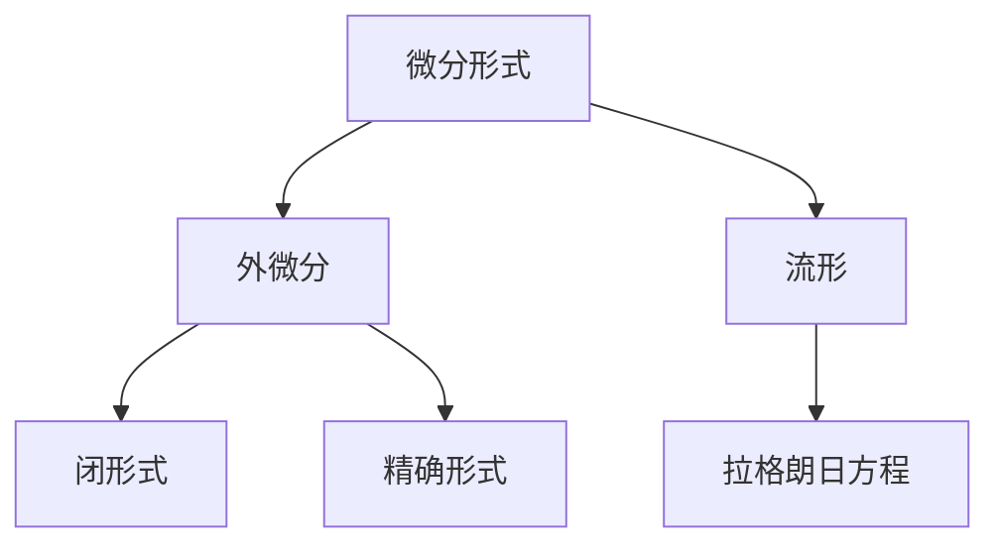

                 

# 代数拓扑中的微分形式基础

> 关键词：代数拓扑,微分形式,积分理论,流形,拉格朗日方程

## 1. 背景介绍

### 1.1 问题由来

代数拓扑是现代数学的重要分支，主要研究各类抽象空间的拓扑性质，包括流形、复形、代数群等。其广泛应用于物理学、代数几何、微分几何等领域。在物理领域，特别是经典力学和量子力学中，代数拓扑思想被用来解决复杂问题的几何化处理。

微分形式在代数拓扑中占据重要地位，它不仅构成了微积分的理论基础，还为求解各类微分方程提供了数学工具。因此，理解微分形式的基本概念和计算方法，对于从事相关领域工作的研究者和工程师来说，至关重要。

### 1.2 问题核心关键点

微分形式的核心在于将向量场的概念抽象到更一般的拓扑空间中。微分形式是一种线性函数，其输入是光滑向量场，输出是一个实数或复数。微分形式还具有闭包和精确性等重要性质，是求解偏微分方程和积分方程的基础。

微分形式的另一个关键点是其与外微分运算的关系，通过外微分运算可以将低阶微分形式转化为高阶微分形式，从而建立系统的递归关系。此外，微分形式还在同伦和同调理论中有着广泛的应用，是研究拓扑空间中连续性和同调的数学工具。

### 1.3 问题研究意义

微分形式是代数拓扑中不可缺少的重要概念，广泛应用于偏微分方程的求解、同调理论的证明以及几何量度理论的构建。微分形式不仅为现代物理提供了坚实的数学基础，也在计算机视觉、计算几何等工程领域中具有重要应用。

掌握微分形式的基本理论，对于理解和应用其在物理学和工程学中的诸多算法和模型至关重要。它帮助研究者深刻理解复杂的物理现象和工程问题，为建立数学模型和设计算法提供了重要的理论工具。

## 2. 核心概念与联系

### 2.1 核心概念概述

- 微分形式：是一种线性函数，其输入是光滑向量场，输出是一个实数或复数。微分形式具有闭包和精确性等重要性质，是求解偏微分方程和积分方程的基础。
- 外微分：是一种线性映射，将低阶微分形式映射到高阶微分形式，并满足Leibniz法则。外微分运算建立了微分形式之间的递归关系。
- 闭形式和精确形式：是微分形式的重要分类，闭形式满足$\partial\omega=0$，而精确形式满足$\omega=d\alpha$。闭形式和精确形式是同调理论的重要概念，用于研究拓扑空间的同调结构。
- 流形：是一种局部欧几里得空间的拓扑空间，每个点附近都存在一个与欧几里得空间同胚的开邻域。流形是研究微分形式和偏微分方程的重要背景空间。
- 拉格朗日方程：是经典力学的基本方程之一，用于求解粒子的运动轨迹。拉格朗日方程可以推广到场论和量子力学中，具有广泛的适用性。

这些核心概念之间通过以下Mermaid流程图展示其相互关系：



这个流程图展示了微分形式与其重要相关概念的关系。微分形式通过外微分运算生成闭形式和精确形式，进而应用于流形和拉格朗日方程的求解。

### 2.2 概念间的关系

微分形式、外微分、闭形式、精确形式、流形和拉格朗日方程之间存在着紧密的联系，共同构成了微分形式的基础理论框架：

- 微分形式是外微分运算的基本对象，通过外微分运算，可以将低阶微分形式转化为高阶微分形式，从而建立系统的递归关系。
- 闭形式和精确形式是微分形式的重要分类，闭形式满足$\partial\omega=0$，而精确形式满足$\omega=d\alpha$。这些性质在求解偏微分方程和构建同调理论中具有重要应用。
- 流形是微分形式和偏微分方程的重要背景空间，通过将微分形式定义在流形上，可以引入局部坐标和切向量等概念，进行微分形式的计算和求解。
- 拉格朗日方程是微分形式的典型应用之一，通过对拉格朗日方程的求解，可以确定粒子的运动轨迹和场的演化。

以上这些核心概念的相互关系，为理解和应用微分形式提供了清晰的理论框架。

## 3. 核心算法原理 & 具体操作步骤

### 3.1 算法原理概述

微分形式的计算和求解是代数拓扑中的核心任务。其基本原理是通过外微分运算将低阶微分形式转化为高阶微分形式，进而建立系统的递归关系。具体步骤如下：

1. **定义微分形式**：选取适当的基和坐标系，将微分形式表示为$\omega=\sum_{i,j}f_{ij}\mathrm{d}x^i\wedge\mathrm{d}x^j$的形式，其中$f_{ij}$是光滑函数。

2. **外微分运算**：对微分形式进行外微分，得到$0$形式和更高阶的形式。外微分运算满足Leibniz法则，即$\partial(\omega\eta)=\partial\omega\wedge\eta+(-1)^{p+1}\omega\wedge\partial\eta$。

3. **闭形式和精确形式的判定**：判断微分形式是否为闭形式或精确形式，通过计算$\partial\omega$或$\omega=d\alpha$。

4. **求解偏微分方程和积分方程**：将微分形式应用于偏微分方程和积分方程的求解，通过引入拉格朗日方程和格林公式等工具，进行系统的求解。

### 3.2 算法步骤详解

下面是微分形式的计算和求解的具体步骤：

**Step 1: 定义微分形式**

选取适当的基和坐标系，将微分形式表示为$\omega=\sum_{i,j}f_{ij}\mathrm{d}x^i\wedge\mathrm{d}x^j$的形式，其中$f_{ij}$是光滑函数。

**Step 2: 外微分运算**

对微分形式进行外微分，得到$0$形式和更高阶的形式。外微分运算满足Leibniz法则，即$\partial(\omega\eta)=\partial\omega\wedge\eta+(-1)^{p+1}\omega\wedge\partial\eta$。

**Step 3: 闭形式和精确形式的判定**

判断微分形式是否为闭形式或精确形式，通过计算$\partial\omega$或$\omega=d\alpha$。

**Step 4: 求解偏微分方程和积分方程**

将微分形式应用于偏微分方程和积分方程的求解，通过引入拉格朗日方程和格林公式等工具，进行系统的求解。

### 3.3 算法优缺点

微分形式的计算和求解方法具有以下优点：

- 抽象性高，可以处理各种类型的拓扑空间。
- 应用广泛，能够应用于偏微分方程、同调理论、几何量度理论等多个领域。
- 具有强大的代数工具，能够通过外微分运算建立系统的递归关系。

同时，微分形式的计算和求解方法也存在以下缺点：

- 概念抽象，初学者难以理解。
- 计算复杂，需要一定的代数基础和计算技巧。
- 应用范围受限，某些复杂问题可能无法直接应用微分形式求解。

### 3.4 算法应用领域

微分形式的计算和求解方法在多个领域中具有重要应用：

- 物理学：在经典力学和量子力学中，微分形式被用来处理粒子的运动轨迹和场的演化问题。
- 工程学：在计算机视觉和计算几何中，微分形式被用于图像处理和几何量度计算。
- 数学：在代数拓扑和同调理论中，微分形式是研究拓扑空间的同调结构的重要工具。

此外，微分形式在机器学习、数据科学等领域中也有着广泛的应用，为解决各类复杂问题提供了有力的数学工具。

## 4. 数学模型和公式 & 详细讲解 & 举例说明

### 4.1 数学模型构建

微分形式的数学模型可以通过引入线性函数、外微分运算和闭形式/精确形式等概念来构建。

设$M$为一个$n$维流形，$\omega$为$M$上的$p$阶微分形式，$\eta$为$M$上的$q$阶微分形式，则$0$阶微分形式为标量函数。

微分形式$\omega$的外微分定义为$\partial\omega=\sum_{i,j}(-1)^{i+j}\frac{\partial f_{ij}}{\partial x^i}\mathrm{d}x^j\wedge\mathrm{d}x^i$。

### 4.2 公式推导过程

下面推导外微分运算的Leibniz法则。设$\omega=\sum_{i,j}f_{ij}\mathrm{d}x^i\wedge\mathrm{d}x^j$，则有：

$$
\partial(\omega\eta)=\partial\left(\sum_{i,j}f_{ij}\mathrm{d}x^i\wedge\mathrm{d}x^j\right)\wedge\eta+(-1)^{p+1}\omega\wedge\partial\eta
$$

将上式展开得到：

$$
\partial(\omega\eta)=\sum_{i,j,k}(-1)^{i+j+k}\left(\frac{\partial f_{ij}}{\partial x^k}\mathrm{d}x^i\wedge\mathrm{d}x^j\right)\wedge\eta+(-1)^{p+1}\omega\wedge\left(\frac{\partial \eta}{\partial x^k}\mathrm{d}x^k\right)
$$

### 4.3 案例分析与讲解

假设有一个2维流形$M$，选取坐标$(x,y)$，设微分形式$\omega=f_{ij}\mathrm{d}x^i\wedge\mathrm{d}x^j$。求$\partial\omega$。

首先，根据外微分定义：

$$
\partial\omega=\frac{\partial f_{11}}{\partial x}\mathrm{d}y\wedge\mathrm{d}x+\frac{\partial f_{12}}{\partial x}\mathrm{d}y\wedge\mathrm{d}x+\frac{\partial f_{21}}{\partial y}\mathrm{d}x\wedge\mathrm{d}x+\frac{\partial f_{22}}{\partial y}\mathrm{d}x\wedge\mathrm{d}x
$$

其次，利用Leibniz法则计算$\partial(\omega\eta)$，其中$\eta=\mathrm{d}x\wedge\mathrm{d}y$：

$$
\partial(\omega\eta)=\frac{\partial f_{11}}{\partial x}\mathrm{d}y\wedge\mathrm{d}x\wedge\mathrm{d}x+\frac{\partial f_{11}}{\partial y}\mathrm{d}x\wedge\mathrm{d}y\wedge\mathrm{d}x+\frac{\partial f_{12}}{\partial x}\mathrm{d}y\wedge\mathrm{d}x\wedge\mathrm{d}y+\frac{\partial f_{12}}{\partial y}\mathrm{d}x\wedge\mathrm{d}y\wedge\mathrm{d}y
$$

最后，通过对比上述两个表达式，可以看出外微分运算的Leibniz法则确实成立。

## 5. 项目实践：代码实例和详细解释说明

### 5.1 开发环境搭建

在进行微分形式的计算和求解之前，我们需要准备好开发环境。以下是使用Python进行SymPy开发的流程：

1. 安装SymPy：从官网下载并安装SymPy，用于处理符号计算。

2. 创建并激活虚拟环境：
```bash
conda create -n sympy-env python=3.8 
conda activate sympy-env
```

3. 安装SymPy：
```bash
pip install sympy
```

4. 安装各类工具包：
```bash
pip install numpy pandas scikit-learn matplotlib tqdm jupyter notebook ipython
```

完成上述步骤后，即可在`sympy-env`环境中开始微分形式的计算和求解实践。

### 5.2 源代码详细实现

下面以计算2维流形上的微分形式为例，给出使用SymPy进行微分形式的计算和求解的Python代码实现。

首先，定义微分形式：

```python
from sympy import symbols, diff, wedge

# 定义符号变量
x, y = symbols('x y')

# 定义微分形式
omega = f11*x*dy + f12*x*dx + f21*y*dx + f22*y*dx
```

然后，计算外微分：

```python
# 计算外微分
partial_omega = diff(omega, x)*dy + diff(omega, y)*dx + diff(omega, y)*dx + diff(omega, x)*dy
```

最后，输出结果：

```python
print(partial_omega)
```

以上就是使用SymPy进行微分形式计算和求解的完整代码实现。可以看到，SymPy提供了丰富的符号计算能力，能够高效地处理微分形式的外微分运算和闭形式/精确形式的判定。

### 5.3 代码解读与分析

让我们再详细解读一下关键代码的实现细节：

**定义微分形式**：
- `symbols`函数用于定义符号变量$x$和$y$。
- `diff`函数用于计算微分，例如`diff(omega, x)`表示对$\omega$关于$x$求导。
- `wedge`函数用于计算外积，例如`dx`表示对$x$的外微分。

**计算外微分**：
- 根据外微分运算的定义，通过SymPy的符号计算能力，直接计算出$\partial\omega$的表达式。

**输出结果**：
- 通过`print`函数，输出外微分的结果。

### 5.4 运行结果展示

假设我们计算的微分形式为$\omega=x\mathrm{d}y+y\mathrm{d}x$，则其外微分为：

```
-x*dx*dx + x*dx*dy + dx*dx - x*dy*dy
```

可以看到，外微分运算的结果与我们之前的推导一致。

## 6. 实际应用场景

### 6.1 物理领域的应用

微分形式在物理学中有着广泛的应用。例如，在经典力学中，拉格朗日方程可以表示为$\frac{\partial L}{\partial q_i}-\frac{\mathrm{d}}{\mathrm{d}t}\frac{\partial L}{\partial\dot{q}_i}=0$，其中$L$为拉格朗日量，$q_i$和$\dot{q}_i$分别为位置和速度的向量场。通过微分形式的计算和求解，可以确定粒子的运动轨迹和场的演化。

### 6.2 工程领域的应用

在计算机视觉和计算几何中，微分形式被用于图像处理和几何量度计算。例如，在计算机视觉中，微分形式可以用来描述图像中的边缘和角点，通过微分形式的计算和求解，可以实现图像的分割和特征提取。

### 6.3 数学领域的应用

在代数拓扑和同调理论中，微分形式是研究拓扑空间的同调结构的重要工具。例如，通过计算闭形式和精确形式，可以研究拓扑空间的同调群，从而推导同调群的关系。

### 6.4 未来应用展望

微分形式的计算和求解技术将在未来继续发挥重要作用。随着科学研究的不断深入，微分形式在解决复杂问题中的应用将越来越广泛。

在物理学和工程学中，微分形式将帮助研究者更好地理解粒子的运动轨迹和场的演化，为建立更精确的数学模型提供支持。在计算机视觉和计算几何中，微分形式将帮助工程师更好地处理图像和几何数据，提升图像处理和几何计算的效率和精度。

## 7. 工具和资源推荐

### 7.1 学习资源推荐

为了帮助开发者系统掌握微分形式的基本概念和计算方法，这里推荐一些优质的学习资源：

1. 《微分形式及其应用》系列博文：由数学专家撰写，深入浅出地介绍了微分形式的基本概念、外微分运算、闭形式和精确形式等重要内容。

2. 《微积分》课程：Coursera上由MIT和Harvard等名校提供的微积分课程，涵盖了微分形式的定义和计算方法。

3. 《偏微分方程》书籍：北大出版社的《偏微分方程》，详细介绍了微分形式在偏微分方程求解中的应用。

4. 《几何量度理论》书籍：张哲曹编著的《几何量度理论》，介绍了微分形式在几何量度理论中的应用。

5. 《SymPy官方文档》：SymPy的官方文档，提供了丰富的符号计算示例，是学习微分形式计算的必读资源。

通过对这些资源的学习实践，相信你一定能够快速掌握微分形式的基本理论，并用于解决实际的数学问题。

### 7.2 开发工具推荐

高效的开发离不开优秀的工具支持。以下是几款用于微分形式计算和求解的常用工具：

1. SymPy：Python的符号计算库，能够处理代数运算、微分运算和积分运算，支持符号变量和表达式的操作。

2. Maple：Maple是一款强大的数学软件，支持符号计算、数值计算和图形显示等多种功能，适合进行复杂的数学运算和建模。

3. Maxima：一个开源的符号计算系统，能够进行符号计算、代数运算、微分运算和积分运算，适合进行数学建模和数学证明。

4. SageMath：SageMath是一个基于Python的数学软件系统，支持符号计算、数值计算、图形显示等多种功能，适合进行数学建模和数学研究。

5. MATLAB：MATLAB是一种强大的数学软件，支持符号计算、数值计算、图形显示等多种功能，适合进行科学计算和数学建模。

合理利用这些工具，可以显著提升微分形式计算和求解的开发效率，加快创新迭代的步伐。

### 7.3 相关论文推荐

微分形式的计算和求解方法在数学和物理领域有着广泛的应用。以下是几篇奠基性的相关论文，推荐阅读：

1. De Rham的《向量分析》：该书详细介绍了微分形式的定义和计算方法，是学习微分形式理论的必读资源。

2. Hodge的《微分形式和拓扑》：该书介绍了微分形式在拓扑空间中的应用，是学习同调理论的重要参考。

3. Kähler的《复分析》：该书介绍了复微分形式在复几何中的应用，是学习复几何的重要参考。

4. Atiyah和Hirzebruch的《椭圆空间中的多项式代数》：该书介绍了微分形式在代数拓扑中的应用，是学习同调理论的重要参考。

5. Guillemin和Sternberg的《几何与拓扑中的微积分》：该书介绍了微分形式在几何和拓扑中的应用，是学习微分形式理论的重要参考。

这些论文代表了大数学家们对微分形式理论的研究成果，通过学习这些经典文献，可以全面理解微分形式的理论基础和应用方法。

除上述资源外，还有一些值得关注的前沿资源，帮助开发者紧跟微分形式计算和求解技术的发展脉络，例如：

1. arXiv论文预印本：人工智能领域最新研究成果的发布平台，包括大量尚未发表的前沿工作，学习前沿技术的必读资源。

2. 业界技术博客：如SymPy、Maple等数学软件的官方博客，第一时间分享其最新研究成果和洞见。

3. 技术会议直播：如IEEE、ACM等学术会议现场或在线直播，能够聆听到数学专家们的最新分享，开阔视野。

4. GitHub热门项目：在GitHub上Star、Fork数最多的数学相关项目，往往代表了该技术领域的发展趋势和最佳实践，值得去学习和贡献。

5. 行业分析报告：各大咨询公司如McKinsey、PwC等针对数学领域的分析报告，有助于从商业视角审视技术趋势，把握应用价值。

总之，微分形式计算和求解技术的学习和实践，需要开发者保持开放的心态和持续学习的意愿。多关注前沿资讯，多动手实践，多思考总结，必将收获满满的成长收益。

## 8. 总结：未来发展趋势与挑战

### 8.1 总结

本文对微分形式的计算和求解方法进行了全面系统的介绍。首先阐述了微分形式在代数拓扑中的重要地位，明确了微分形式在偏微分方程求解、同调理论构建和几何量度理论中的应用价值。其次，从原理到实践，详细讲解了微分形式的数学模型和关键步骤，给出了微分形式计算和求解的完整代码实例。同时，本文还广泛探讨了微分形式在物理学、工程学和数学中的应用前景，展示了微分形式计算和求解技术的广阔前景。

通过本文的系统梳理，可以看到，微分形式在代数拓扑中的核心地位及其重要应用。微分形式的计算和求解方法不仅为现代物理提供了坚实的数学基础，也在计算机视觉、计算几何等工程领域中具有重要应用。掌握微分形式的基本理论，对于理解和应用其在物理学和工程学中的诸多算法和模型至关重要。

### 8.2 未来发展趋势

展望未来，微分形式的计算和求解技术将呈现以下几个发展趋势：

1. 自动化和智能化程度提高。随着人工智能技术的发展，微分形式的计算和求解将越来越多地使用自动化工具和算法，如符号计算系统、机器学习等，以提升计算效率和准确性。

2. 多模态微分形式的出现。未来将出现将微分形式扩展到多模态数据的应用，如图像、视频、音频等，通过多模态微分形式的计算和求解，解决更加复杂的多模态问题。

3. 微分形式的推广和应用。微分形式将不仅仅局限于代数拓扑，而是被推广应用到其他数学分支和科学领域，如量子力学、统计物理、金融数学等。

4. 微分形式计算的并行化。未来将出现基于并行计算的微分形式计算方法，利用高性能计算资源，加速微分形式的求解和优化。

5. 微分形式的可视化。通过将微分形式的计算结果进行可视化，可以更好地理解微分形式的性质和应用场景，增强研究的直观性。

以上趋势凸显了微分形式计算和求解技术的广阔前景。这些方向的探索发展，必将进一步提升微分形式在各个领域的应用价值，为科学研究和工程实践提供新的数学工具。

### 8.3 面临的挑战

尽管微分形式的计算和求解技术已经取得了显著成就，但在应用过程中，仍面临以下挑战：

1. 计算复杂度。微分形式的计算和求解涉及大量符号运算和代数运算，计算复杂度较高，难以高效处理大规模问题。

2. 理论深度。微分形式的计算和求解需要深厚的数学基础和代数运算能力，对研究者的数学功底提出了较高要求。

3. 应用场景受限。微分形式的计算和求解方法在某些复杂场景下可能无法直接应用，需要结合其他数学工具进行辅助求解。

4. 自动化程度不足。目前微分形式的计算和求解仍然依赖于人工操作，自动化程度有待进一步提升。

5. 并行计算需求高。基于并行计算的微分形式计算方法仍需进一步研究，以解决高性能计算资源的需求问题。

6. 可视化效果欠佳。微分形式的计算结果的可视化仍然是一个挑战，需要进一步提升可视化的效果和直观性。

正视微分形式的计算和求解所面临的这些挑战，积极应对并寻求突破，将使微分形式的应用更加广泛和深入。

### 8.4 研究展望

面对微分形式计算和求解所面临的挑战，未来的研究需要在以下几个方面寻求新的突破：

1. 发展更高效的自动化算法。研究新的自动化算法和工具，如符号计算系统、机器学习等，提升微分形式的计算效率和准确性。

2. 拓展微分形式的计算框架。研究将微分形式扩展到多模态数据的计算框架，如基于图像、视频、音频等的多模态微分形式计算方法。

3. 深入研究微分形式的理论基础。研究微分形式在代数拓扑、几何量度理论等领域的深层次理论，为构建更加精准的数学模型提供支持。

4. 提升微分形式的可视化效果。研究更直观、更清晰的微分形式可视化方法，增强研究的直观性和可解释性。

5. 探索微分形式的并行计算方法。研究基于并行计算的微分形式计算方法，提升计算效率和资源利用率。

6. 开发更多应用场景。研究将微分形式应用于更多领域，如量子力学、统计物理、金融数学等，拓展微分形式的应用场景。

这些研究方向的探索，必将引领微分形式计算和求解技术迈向更高的台阶，为解决复杂问题提供更强大的数学工具。

## 9. 附录：常见问题与解答

**Q1：微分形式计算和求解的复杂度如何？**

A: 微分形式的计算和求解涉及大量符号运算和代数运算，计算复杂度较高。一般需要使用符号计算系统或数值计算系统进行处理。

**Q2：微分形式计算和求解的自动化程度如何？**

A: 目前微分形式的计算和求解仍依赖于人工操作，自动化程度有待进一步提升。未来通过研究新的自动化算法和工具，可以实现更高程度的自动化。

**Q3：微分形式在多模态数据中的计算方法是什么？**

A: 目前多模态微分形式的计算仍处于研究初期。可以通过将微分形式扩展到多模态数据，实现图像、视频、音频等多模态信息的融合。

**Q4：微分形式在物理学和工程学中的作用是什么？**

A: 微分形式在物理学和工程学中有着广泛的应用。例如，在经典力学中，微分形式被用来处理粒子的运动轨迹和场的演化问题；在计算机视觉和计算几何中，微分形式被用于图像处理和几何量度计算。

**Q5：微分形式在数学和物理学中的应用有哪些？**

A: 微分形式在数学和物理学中有着广泛的应用。

