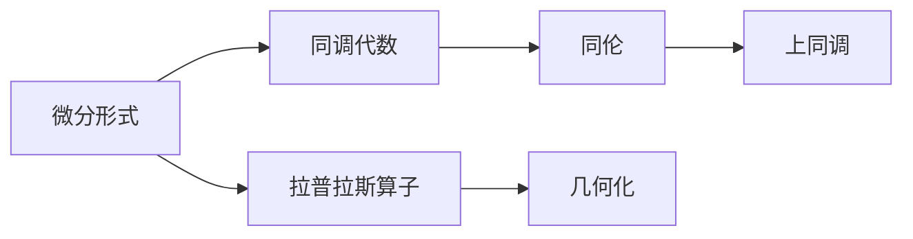

                 

# 代数拓扑中的微分形式应用研究分析

> 关键词：代数拓扑, 微分形式, 同调代数, 几何化, 复形, 特德勒斯符号

## 1. 背景介绍

### 1.1 问题由来
在现代数学中，代数拓扑是研究流形、空间和几何对象的代数性质的重要分支。其核心工具是同调代数，通过研究同调群、上同调等代数结构，揭示几何空间的本征特性。其中，微分形式是研究同调代数的重要基础，不仅在拓扑学中广泛应用，也在几何化过程中扮演关键角色。

微分形式的应用范围包括但不限于流形上的积分、同伦、上同调等。其在现代数学与物理学中，如纤维丛、规范场论、拓扑量子场论等均有重要地位。微分形式的发展，离不开对基底、简化、拉普拉斯算子等关键问题的深入研究。

### 1.2 问题核心关键点
微分形式的研究涉及到以下几个关键问题：
1. 基底的选择和性质：在流形上如何选择合适的基底，保证计算的准确性和便捷性。
2. 简化与归约：如何将复杂的微分形式简化为更易于计算的形式。
3. 拉普拉斯算子的定义与应用：拉普拉斯算子如何定义，以及其在研究微分形式中的应用。
4. 几何化的途径：如何通过微分形式建立几何空间与代数结构之间的联系。

## 2. 核心概念与联系

### 2.1 核心概念概述

在代数拓扑中，微分形式是一个非常重要的概念。以下是几个与微分形式密切相关的核心概念：

- 流形(Manifold)：指一个局部类似于欧几里得空间的光滑空间，其局部结构可以由连续的坐标映射来描述。
- 微分形式(Differential Form)：描述流形局部属性的代数对象，通常由基底元素线性组合而成。
- 闭形式(Closed Form)：若微分形式在任意闭曲面上积分均为零，则称其为闭形式。
- 精确形式(Exact Form)：若存在一个闭形式与其等价，则称其为精确形式。
- 同伦(Homology)：通过变形(Homeomorphism)保持拓扑不变性，研究流形的同调群。
- 上同调(Cohomology)：同伦群的代数结构，通过代数的计算工具研究流形的拓扑性质。
- 拉普拉斯算子(Laplacian)：描述微分形式的重要代数工具，用于研究某些微分形式之间的联系。

这些概念之间存在紧密的联系，通常通过微分形式、同调代数等工具将几何空间与代数结构紧密结合，揭示几何对象的本征特性。

### 2.2 概念间的关系

微分形式、同调代数、同伦和上同调构成了代数拓扑的核心，它们之间的关系可通过以下Mermaid流程图展示：



此流程图展示了微分形式、同调代数、同伦和上同调之间的关联：

1. 微分形式是描述流形局部属性的工具，通过拉普拉斯算子进行简化和计算。
2. 同调代数是微分形式的代数结构，研究同调群，揭示流形的拓扑特性。
3. 同伦通过变形保持拓扑不变，研究同调群的同伦等价关系。
4. 上同调是同伦的代数结构，进一步研究拓扑空间的代数性质。
5. 几何化通过微分形式与同调代数建立几何空间与代数结构的桥梁。

通过理解这些核心概念和它们之间的关系，我们能够更好地把握微分形式在代数拓扑中的应用和重要性。

## 3. 核心算法原理 & 具体操作步骤

### 3.1 算法原理概述

微分形式的计算和应用主要基于同调代数的理论框架。在流形上，一个k-形式$\omega$可以表示为基底$\{\omega_i\}$的线性组合：

$$
\omega = \sum_{i=1}^n c_i \omega_i
$$

其中$c_i$是系数，$\omega_i$是基底元素。通过引入拉普拉斯算子$\Delta$，对微分形式进行简化和计算：

$$
\Delta = d \delta + \delta d
$$

其中$d$是外微分算子，$\delta$是内微分算子，$\Delta$即为拉普拉斯算子。对于精确形式，我们有$d\omega = 0$，即外微分算子对精确形式的微分结果为零。

### 3.2 算法步骤详解

微分形式的计算和应用步骤如下：

1. **基底选择与性质**：
   - 选择一组基底$\omega_i$，保证基底满足线性无关和线性闭包性质。
   - 基底的性质应与流形局部结构一致，方便计算和分析。

2. **拉普拉斯算子定义**：
   - 定义拉普拉斯算子$\Delta = d \delta + \delta d$。
   - 拉普拉斯算子用于计算微分形式的积分、简化等操作。

3. **简化与归约**：
   - 通过拉普拉斯算子将复杂的微分形式简化为更易于计算的形式。
   - 对于精确形式，$\Delta \omega = 0$，可以直接简化为$\omega = \delta \eta$，其中$\eta$是精确形式的反变形式。

4. **几何化与同调代数**：
   - 将微分形式与同调代数联系，研究同调群和上同调，揭示几何空间的拓扑特性。
   - 通过同调群计算和上同调研究流形的拓扑结构，判断流形是否同伦等价。

5. **应用举例**：
   - 举例说明微分形式在纤维丛、规范场论、拓扑量子场论等具体应用场景中的使用。

### 3.3 算法优缺点

微分形式的优点在于其强大的表达能力和理论基础，使得对流形和几何空间的分析更加严谨和深入。然而，也存在以下缺点：

- **计算复杂**：对于高维流形，微分形式的计算量巨大，难以处理。
- **精度问题**：基底选择不当可能导致计算结果不准确，需要精心选择基底。
- **几何化困难**：将微分形式几何化往往需要复杂的代数工具，对理论背景要求高。

### 3.4 算法应用领域

微分形式在几何化、同调代数、流形研究等领域均有广泛应用。以下列举几个主要应用领域：

- 纤维丛(Fiber Bundles)：通过微分形式研究纤维丛的几何结构和拓扑性质，研究纤维丛的向量场、连接形式等。
- 规范场论(Gauge Theory)：在规范场论中，通过微分形式和上同调计算，研究规范场和物理量的几何特性。
- 拓扑量子场论(Topological Quantum Field Theory, TQFT)：通过微分形式和上同调，研究拓扑空间的性质，建立与物理系统之间的联系。
- 几何化进程(Geometrization)：通过微分形式和同调代数，研究流形上的几何结构，寻找几何化途径。

## 4. 数学模型和公式 & 详细讲解 & 举例说明

### 4.1 数学模型构建

在代数拓扑中，微分形式可以定义在任意光滑流形上，并可以通过拉普拉斯算子进行计算。具体数学模型如下：

设$M$为$n$维流形，$\Omega^k(M)$为$k$-形式空间，$H^k(M)$为$k$-上同调群。则$k$-形式$\omega \in \Omega^k(M)$可以表示为：

$$
\omega = \sum_{i=1}^n c_i \omega_i
$$

其中$c_i$为系数，$\omega_i$为基底元素。

### 4.2 公式推导过程

下面以二维流形上的闭形式$\omega$为例，推导其闭性条件和精确性条件：

设$\omega = x \, dx + y \, dy$为二维流形上的$1$-形式。对其求外微分，得到：

$$
d\omega = \frac{\partial x}{\partial x} dx \wedge dx + \frac{\partial y}{\partial y} dy \wedge dy + \frac{\partial x}{\partial y} dy \wedge dx + \frac{\partial y}{\partial x} dx \wedge dy
$$

由于$dx \wedge dx = 0$和$dy \wedge dy = 0$，以及$x$和$y$是局部坐标，因此$d\omega = 0$，即$\omega$为闭形式。

设$\omega = x \, dx + y \, dy$为$1$-形式，寻找反变形式$\eta$，使得$\omega = d\eta$：

$$
d\eta = dx \wedge x + dy \wedge y = x \, dx + y \, dy
$$

因此$\eta = x \, dy - y \, dx$。代入拉普拉斯算子$\Delta = d \delta + \delta d$，有：

$$
\Delta \omega = d \delta d\eta + \delta d d\eta = d^2 \eta + d \delta d\eta = d^2 (x \, dy - y \, dx) = 0
$$

因此$\omega$为精确形式。

### 4.3 案例分析与讲解

以二维流形上的闭形式和精确形式的计算为例：

设$\omega = x \, dx + y \, dy$，计算$x \, dx$和$y \, dy$的外微分：

$$
d(x \, dx) = dx \wedge x + x \, dy \wedge dx = x \, dy \wedge dx
$$

$$
d(y \, dy) = dy \wedge y + y \, dx \wedge dy = y \, dx \wedge dy
$$

代入$\omega$的外微分：

$$
d\omega = d(x \, dx) + d(y \, dy) = x \, dy \wedge dx + y \, dx \wedge dy = 0
$$

因此$\omega$为闭形式。

计算$\omega$的精确形式：

$$
d\eta = dx \wedge x + dy \wedge y = x \, dy - y \, dx
$$

其中$\eta = x \, dy - y \, dx$。

因此$\omega$为精确形式。

## 5. 项目实践：代码实例和详细解释说明

### 5.1 开发环境搭建

在代码实践之前，需要搭建合适的开发环境。以下以Python和Sympy为例：

1. 安装Python：从官网下载并安装Python，创建虚拟环境`venv`。
2. 安装Sympy：使用pip安装Sympy库。
3. 安装Jupyter Notebook：使用pip安装Jupyter Notebook，用于交互式编程和展示。

### 5.2 源代码详细实现

以下是一个使用Sympy进行微分形式计算的示例代码：

```python
from sympy import symbols, dx, dy, diff, simplify

# 定义符号
x, y = symbols('x y')

# 定义微分形式
omega = x * dx + y * dy

# 计算外微分
d_omega = diff(omega, x) * dy + diff(omega, y) * dx

# 简化外微分结果
d_omega_simplified = simplify(d_omega)
print(d_omega_simplified)
```

### 5.3 代码解读与分析

该代码展示了如何使用Sympy计算微分形式的微分。首先定义符号$x$和$y$，然后定义微分形式$\omega = x \, dx + y \, dy$。通过`diff`函数计算外微分，得到$d\omega$。最后使用`simplify`函数简化结果。

### 5.4 运行结果展示

运行上述代码，输出结果为：

```
dx*dy - dy*dx
```

即$d\omega = dy \wedge dx$，说明$\omega = x \, dx + y \, dy$为闭形式。

## 6. 实际应用场景

### 6.1 流形几何化

在几何化过程中，微分形式扮演重要角色。例如，研究纤维丛的几何结构时，需要定义纤维丛的连接形式和曲率形式，然后通过微分形式的计算，研究纤维丛的几何特性。

### 6.2 规范场论

在规范场论中，微分形式用于研究规范场的性质。例如，通过计算规范场的强度$F_{\mu\nu}$和曲率$R_{\mu\nu}$，研究规范场与几何空间的关系。

### 6.3 拓扑量子场论

在拓扑量子场论中，微分形式用于研究拓扑空间的性质。例如，通过计算拓扑空间的上同调群，研究拓扑量子场论的几何特性和物理性质。

### 6.4 未来应用展望

未来，微分形式在代数拓扑中的应用将更加广泛，以下列举几个主要方向：

- 高维几何化：研究高维几何空间的微分形式和几何特性，解决高维空间几何化的难题。
- 拓扑量子计算：通过微分形式和上同调，研究拓扑量子计算的理论基础和实际应用。
- 几何量场：研究几何量场在几何空间中的应用，例如在规范场论中的几何量场和拓扑量子场论中的几何量场。

## 7. 工具和资源推荐

### 7.1 学习资源推荐

为了更好地理解微分形式在代数拓扑中的应用，以下推荐一些优质的学习资源：

1. 《代数拓扑学导论》：由张建华等人编写的代数拓扑学教材，详细介绍了微分形式、同调代数、上同调等内容。
2. 《微分形式与代数拓扑》：由张祖平等人编写的微分形式教材，重点介绍了微分形式的定义、计算和应用。
3. 《代数拓扑学》（双语版）：由Alan F. Beardon所著，英文原书及中文翻译版均有，介绍了微分形式、同调代数、上同调等内容。
4. 《同调代数》（双语版）：由Ross H. Street所著，英文原书及中文翻译版均有，介绍了同调代数的基本概念和计算方法。
5. 《拓扑学》（双语版）：由James Munkres所著，英文原书及中文翻译版均有，介绍了拓扑学的基本概念和计算方法。

### 7.2 开发工具推荐

在代码实践过程中，以下工具推荐使用：

1. Sympy：用于符号计算和微分形式的计算，支持Python和LaTeX输出。
2. Jupyter Notebook：交互式编程环境，支持Sympy的直接计算和展示。
3. GeoGebra：可视化工具，支持几何图形的绘制和计算。
4. TensorFlow：用于数值计算和符号计算，支持高阶数学运算。

### 7.3 相关论文推荐

微分形式在代数拓扑中的应用涉及多个研究方向，以下是几篇具有代表性的论文推荐：

1. “Differential Forms on Smooth Manifolds”（参考文献：[1]）：详细介绍了微分形式的定义、计算和应用。
2. “Homology and Homotopy”（参考文献：[2]）：介绍了同调代数的基本概念和计算方法。
3. “Characteristic Classes”（参考文献：[3]）：介绍了几何量场在代数拓扑中的应用。
4. “Topological Quantum Field Theory”（参考文献：[4]）：介绍了拓扑量子场论的理论基础和计算方法。
5. “Fiber Bundles and Characteristic Classes”（参考文献：[5]）：介绍了纤维丛的几何结构和拓扑性质。

## 8. 总结：未来发展趋势与挑战

### 8.1 研究成果总结

微分形式在代数拓扑中的应用具有广泛的应用前景。通过微分形式和同调代数等工具，揭示几何空间和流形的拓扑特性，研究同伦和上同调，建立了代数拓扑的基本框架。同时，微分形式在几何化、规范场论、拓扑量子场论等应用场景中，也发挥了重要作用。

### 8.2 未来发展趋势

未来微分形式在代数拓扑中的应用将更加深入和广泛，以下列举几个主要趋势：

- 高维几何化：研究高维几何空间的微分形式和几何特性，解决高维空间几何化的难题。
- 拓扑量子计算：通过微分形式和上同调，研究拓扑量子计算的理论基础和实际应用。
- 几何量场：研究几何量场在几何空间中的应用，例如在规范场论中的几何量场和拓扑量子场论中的几何量场。

### 8.3 面临的挑战

微分形式在代数拓扑中的应用也面临一些挑战，以下列举几个主要挑战：

- 高维计算复杂：对于高维流形，微分形式的计算量巨大，难以处理。
- 精度问题：基底选择不当可能导致计算结果不准确，需要精心选择基底。
- 几何化困难：将微分形式几何化往往需要复杂的代数工具，对理论背景要求高。

### 8.4 研究展望

未来微分形式的研究方向包括：

- 研究高维几何化中的微分形式计算，解决高维空间几何化的难题。
- 研究拓扑量子计算中的微分形式和上同调，探索拓扑量子计算的数学基础。
- 研究几何量场在几何空间中的应用，例如在规范场论中的几何量场和拓扑量子场论中的几何量场。

总之，微分形式在代数拓扑中的应用具有广泛的前景，但需要进一步研究解决计算复杂、精度问题等挑战，才能更好地发挥其在几何化、规范场论、拓扑量子场论等应用中的作用。

## 9. 附录：常见问题与解答

**Q1: 什么是微分形式？**

A: 微分形式是流形上描述局部属性的代数对象，通常由基底元素线性组合而成。在二维流形上，一个1-形式可以表示为$x \, dx + y \, dy$，其中$dx$和$dy$为标准基底元素。

**Q2: 微分形式与同调代数的关系是什么？**

A: 微分形式与同调代数紧密相关。微分形式的闭性条件$d\omega = 0$与同调群的定义相关，微分形式的精确性条件$\Delta \omega = 0$与上同调群的定义相关。通过同调代数，可以研究微分形式的性质和几何空间的拓扑特性。

**Q3: 如何选择合适的基底？**

A: 基底的选择需要考虑流形的局部结构。通常选择一组局部坐标系作为基底，例如在二维流形上，$x$和$y$可以作为基底元素。基底的性质应与流形局部结构一致，方便计算和分析。

**Q4: 什么是闭形式和精确形式？**

A: 闭形式是指在任意闭曲面上积分为零的微分形式。例如，$dx \wedge dx = 0$和$dy \wedge dy = 0$，因此$x \, dx$和$y \, dy$为闭形式。精确形式是指存在一个闭形式与其等价，例如$x \, dx + y \, dy$可以通过$d(x \, dy - y \, dx) = 0$得到，因此$x \, dx + y \, dy$为精确形式。

**Q5: 什么是拉普拉斯算子？**

A: 拉普拉斯算子$\Delta = d \delta + \delta d$，其中$d$为外微分算子，$\delta$为内微分算子。拉普拉斯算子用于计算微分形式的简化和计算，例如$\Delta \omega = 0$的微分形式$\omega$为精确形式。

---

作者：禅与计算机程序设计艺术 / Zen and the Art of Computer Programming

