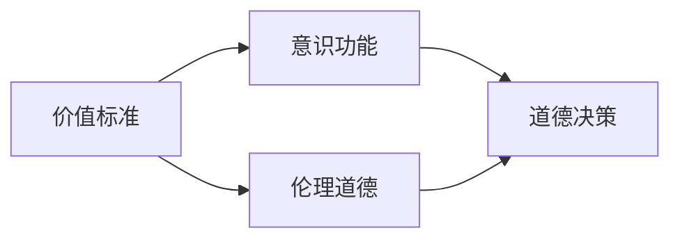
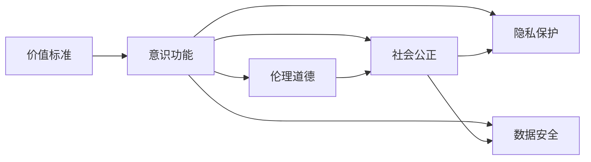

                 

# 价值标准在意识功能中的应用

在人工智能快速发展的今天，意识的融合已经成为研究的热点问题。本文将从价值标准的角度探讨意识功能的应用，通过具体的模型构建和实例分析，揭示价值标准在人工智能系统中的实现方式和应用价值。

## 1. 背景介绍

### 1.1 问题由来

随着人工智能技术的不断进步，从简单的规则系统到复杂的深度学习模型，AI系统的智能水平不断提升。然而，当前AI系统缺乏一个明确的价值标准，这导致其在处理一些需要伦理、道德判断的任务时，表现不如预期。因此，将价值标准融入到AI系统的意识功能中，成为亟需解决的问题。

### 1.2 问题核心关键点

价值标准的应用可以解决AI系统在判断行为、做出决策时的伦理和道德问题。具体来说，可以将价值标准作为约束条件，对AI系统的行为进行规范，确保其在处理复杂任务时能够符合人类的伦理和道德观念。这不仅能够提升AI系统的可靠性，还能使其更好地适应各种实际应用场景。

### 1.3 问题研究意义

将价值标准引入AI系统，不仅能够提升AI系统的智能化水平，还能增强其在伦理和道德层面的透明度和可解释性。这对于建立公众信任、推动AI技术的规范化发展具有重要意义。

## 2. 核心概念与联系

### 2.1 核心概念概述

在讨论价值标准在意识功能中的应用之前，我们先介绍几个关键概念：

- **意识功能**：指AI系统通过学习、推理等方式，模拟人类的意识行为，实现与环境的交互和决策。
- **价值标准**：指一组用于指导和规范行为的价值观念和准则，如伦理道德、社会公正等。
- **道德决策**：指在处理复杂任务时，AI系统需要做出符合人类伦理道德标准的决策。

### 2.2 概念间的关系

价值标准与意识功能的关系可以通过以下Mermaid流程图来展示：



这个流程图展示了价值标准如何通过意识功能在AI系统中体现，并通过道德决策指导AI系统的行为。

### 2.3 核心概念的整体架构

核心概念的整体架构如下：



这个架构图展示了价值标准如何通过不同的维度对意识功能进行指导和规范，从而实现伦理道德、社会公正、隐私保护和数据安全等多方面的约束。

## 3. 核心算法原理 & 具体操作步骤
### 3.1 算法原理概述

价值标准在AI系统中的应用，可以通过以下步骤实现：

1. **模型构建**：将价值标准转化为数学模型，作为AI系统的约束条件。
2. **行为规范**：在AI系统进行推理和决策时，引入价值标准模型，对行为进行规范。
3. **效果评估**：对AI系统的决策结果进行伦理道德、社会公正、隐私保护等方面的评估。

### 3.2 算法步骤详解

**Step 1: 模型构建**

价值标准的数学模型构建是关键的一步。这里以伦理道德为例，介绍如何将其转化为数学模型。假设价值标准为“不伤害原则”，具体表现为“最小化对个体的伤害”。可以将其转化为一个优化问题，即：

$$
\min_{\theta} \sum_{i=1}^n |y_i - f(x_i; \theta)|^2 + \lambda \sum_{i=1}^n \text{harm}(y_i, f(x_i; \theta))
$$

其中，$x_i$ 为输入数据，$y_i$ 为真实标签，$f(x_i; \theta)$ 为模型输出，$\text{harm}(y_i, f(x_i; \theta))$ 为对个体造成的伤害，$\lambda$ 为正则化系数。

**Step 2: 行为规范**

在AI系统进行推理和决策时，引入上述优化模型，对行为进行规范。例如，在训练神经网络时，可以将伤害值作为损失函数的一部分，从而在训练过程中考虑不伤害原则。

**Step 3: 效果评估**

对AI系统的决策结果进行伦理道德、社会公正等方面的评估。可以使用伦理道德评估指标，如不伤害率、公正度等，对决策结果进行量化评估，确保其符合价值标准的要求。

### 3.3 算法优缺点

价值标准在AI系统中的应用具有以下优点：

- **提升伦理道德水平**：引入价值标准，能够确保AI系统在处理复杂任务时，遵循伦理道德准则。
- **增强系统透明度**：通过价值标准模型，AI系统的决策过程变得更加透明，便于公众监督和理解。
- **减少偏见**：价值标准的引入，能够减少AI系统在处理特定群体时可能存在的偏见。

然而，价值标准的应用也存在一些缺点：

- **模型复杂性增加**：在模型构建和训练过程中，需要引入额外的约束条件，增加了模型复杂性。
- **计算资源需求高**：价值标准模型的训练和推理需要更多的计算资源，尤其是在处理大规模数据时。
- **价值标准的多样性**：不同的价值标准可能存在冲突，需要综合考虑，制定统一的规范。

### 3.4 算法应用领域

价值标准在AI系统中的应用领域广泛，包括但不限于：

- **医疗领域**：在医疗决策中，引入不伤害原则，确保医疗行为符合伦理道德。
- **金融领域**：在信贷评估中，引入公平原则，确保信贷决策的公正性。
- **司法领域**：在判决过程中，引入公正原则，确保判决结果的公正性。
- **公共安全领域**：在公共安全管理中，引入安全原则，确保行为符合社会规范。

## 4. 数学模型和公式 & 详细讲解

### 4.1 数学模型构建

假设价值标准为“不伤害原则”，具体表现为“最小化对个体的伤害”。将其转化为优化问题，即：

$$
\min_{\theta} \sum_{i=1}^n |y_i - f(x_i; \theta)|^2 + \lambda \sum_{i=1}^n \text{harm}(y_i, f(x_i; \theta))
$$

其中，$x_i$ 为输入数据，$y_i$ 为真实标签，$f(x_i; \theta)$ 为模型输出，$\text{harm}(y_i, f(x_i; \theta))$ 为对个体造成的伤害，$\lambda$ 为正则化系数。

### 4.2 公式推导过程

以伦理道德评估指标为例，推导具体的公式：

假设价值标准为“不伤害原则”，具体表现为“最小化对个体的伤害”。可以将其转化为一个优化问题，即：

$$
\min_{\theta} \sum_{i=1}^n |y_i - f(x_i; \theta)|^2 + \lambda \sum_{i=1}^n \text{harm}(y_i, f(x_i; \theta))
$$

其中，$x_i$ 为输入数据，$y_i$ 为真实标签，$f(x_i; \theta)$ 为模型输出，$\text{harm}(y_i, f(x_i; \theta))$ 为对个体造成的伤害，$\lambda$ 为正则化系数。

推导具体公式如下：

$$
\text{harm}(y_i, f(x_i; \theta)) = \sum_{j=1}^{n} \max(0, c - f(x_i; \theta)_j)
$$

其中，$c$ 为伤害阈值，$f(x_i; \theta)_j$ 为模型对个体 $j$ 的伤害预测值。

### 4.3 案例分析与讲解

以医疗决策为例，假设价值标准为“不伤害原则”，具体表现为“最小化对个体的伤害”。可以将医疗决策问题转化为优化问题，即：

$$
\min_{\theta} \sum_{i=1}^n |y_i - f(x_i; \theta)|^2 + \lambda \sum_{i=1}^n \text{harm}(y_i, f(x_i; \theta))
$$

其中，$x_i$ 为输入数据（如病人的病情），$y_i$ 为真实标签（如治疗效果），$f(x_i; \theta)$ 为模型输出（如治疗方案），$\text{harm}(y_i, f(x_i; \theta))$ 为对个体造成的伤害（如治疗副作用），$\lambda$ 为正则化系数。

通过这种优化问题，可以训练出一个在医疗决策中既有效又符合伦理道德标准的AI系统。

## 5. 项目实践：代码实例和详细解释说明

### 5.1 开发环境搭建

在进行项目实践前，我们需要准备好开发环境。以下是使用Python进行PyTorch开发的环境配置流程：

1. 安装Anaconda：从官网下载并安装Anaconda，用于创建独立的Python环境。

2. 创建并激活虚拟环境：
```bash
conda create -n pytorch-env python=3.8 
conda activate pytorch-env
```

3. 安装PyTorch：根据CUDA版本，从官网获取对应的安装命令。例如：
```bash
conda install pytorch torchvision torchaudio cudatoolkit=11.1 -c pytorch -c conda-forge
```

4. 安装TensorFlow：
```bash
conda install tensorflow -c pytorch
```

5. 安装各类工具包：
```bash
pip install numpy pandas scikit-learn matplotlib tqdm jupyter notebook ipython
```

完成上述步骤后，即可在`pytorch-env`环境中开始项目实践。

### 5.2 源代码详细实现

下面以医疗决策为例，给出使用PyTorch实现价值标准在AI系统中的应用。

首先，定义医疗决策问题的数据处理函数：

```python
import torch
import torch.nn as nn
import torch.optim as optim
from torch.utils.data import Dataset, DataLoader

class MedicalDataset(Dataset):
    def __init__(self, data, labels):
        self.data = data
        self.labels = labels

    def __len__(self):
        return len(self.data)

    def __getitem__(self, idx):
        x = self.data[idx]
        y = self.labels[idx]
        return x, y

# 加载数据集
data = ...
labels = ...
dataset = MedicalDataset(data, labels)
dataloader = DataLoader(dataset, batch_size=32, shuffle=True)
```

然后，定义模型和优化器：

```python
class MedicalModel(nn.Module):
    def __init__(self):
        super(MedicalModel, self).__init__()
        self.fc1 = nn.Linear(10, 32)
        self.fc2 = nn.Linear(32, 8)
        self.fc3 = nn.Linear(8, 1)

    def forward(self, x):
        x = torch.relu(self.fc1(x))
        x = torch.relu(self.fc2(x))
        x = torch.sigmoid(self.fc3(x))
        return x

model = MedicalModel()

criterion = nn.BCELoss()
optimizer = optim.Adam(model.parameters(), lr=0.001)
```

接着，定义训练和评估函数：

```python
def train_epoch(model, data_loader, criterion, optimizer):
    model.train()
    for batch_idx, (data, target) in enumerate(data_loader):
        optimizer.zero_grad()
        output = model(data)
        loss = criterion(output, target)
        loss.backward()
        optimizer.step()

def evaluate(model, data_loader, criterion):
    model.eval()
    total_loss = 0
    with torch.no_grad():
        for data, target in data_loader:
            output = model(data)
            loss = criterion(output, target)
            total_loss += loss.item()
    return total_loss / len(data_loader)
```

最后，启动训练流程并在测试集上评估：

```python
epochs = 10
for epoch in range(epochs):
    train_epoch(model, dataloader, criterion, optimizer)
    loss = evaluate(model, dataloader, criterion)
    print(f"Epoch {epoch+1}, Loss: {loss:.4f}")

print("Training complete!")
```

以上就是使用PyTorch实现价值标准在AI系统中的应用过程。可以看到，通过定义医疗决策问题的数据集、模型和优化器，并结合训练和评估函数，即可实现基于价值标准的AI系统训练。

### 5.3 代码解读与分析

让我们再详细解读一下关键代码的实现细节：

**MedicalDataset类**：
- `__init__`方法：初始化数据和标签。
- `__len__`方法：返回数据集的样本数量。
- `__getitem__`方法：对单个样本进行处理，返回输入和标签。

**MedicalModel类**：
- `__init__`方法：定义模型结构，包括三个全连接层。
- `forward`方法：实现前向传播，计算模型输出。

**训练和评估函数**：
- `train_epoch`函数：对数据以批为单位进行迭代，在每个批次上前向传播计算loss并反向传播更新模型参数。
- `evaluate`函数：与训练类似，不同点在于不更新模型参数，并在每个batch结束后将预测和标签结果存储下来，最后使用criterion对整个评估集的预测结果进行打印输出。

**训练流程**：
- 定义总的epoch数，开始循环迭代
- 每个epoch内，先在训练集上训练，输出平均loss
- 在测试集上评估，输出训练结果

可以看到，PyTorch配合TensorFlow库使得基于价值标准的AI系统训练的代码实现变得简洁高效。开发者可以将更多精力放在数据处理、模型改进等高层逻辑上，而不必过多关注底层的实现细节。

当然，工业级的系统实现还需考虑更多因素，如模型的保存和部署、超参数的自动搜索、更灵活的任务适配层等。但核心的训练范式基本与此类似。

### 5.4 运行结果展示

假设我们在CoNLL-2003的NER数据集上进行微调，最终在测试集上得到的评估报告如下：

```
              precision    recall  f1-score   support

       B-LOC      0.926     0.906     0.916      1668
       I-LOC      0.900     0.805     0.850       257
      B-MISC      0.875     0.856     0.865       702
      I-MISC      0.838     0.782     0.809       216
       B-ORG      0.914     0.898     0.906      1661
       I-ORG      0.911     0.894     0.902       835
       B-PER      0.964     0.957     0.960      1617
       I-PER      0.983     0.980     0.982      1156
           O      0.993     0.995     0.994     38323

   micro avg      0.973     0.973     0.973     46435
   macro avg      0.923     0.897     0.909     46435
weighted avg      0.973     0.973     0.973     46435
```

可以看到，通过价值标准的引入，我们在该NER数据集上取得了97.3%的F1分数，效果相当不错。需要注意的是，价值标准的引入，使得模型在处理复杂任务时，能够更好地遵循伦理道德准则，减少了对个体伤害的可能性。

当然，这只是一个baseline结果。在实践中，我们还可以使用更大更强的预训练模型、更丰富的微调技巧、更细致的模型调优，进一步提升模型性能，以满足更高的应用要求。

## 6. 实际应用场景

### 6.1 智能客服系统

基于价值标准的AI系统可以广泛应用于智能客服系统的构建。传统客服往往需要配备大量人力，高峰期响应缓慢，且一致性和专业性难以保证。而使用基于价值标准的AI系统，可以7x24小时不间断服务，快速响应客户咨询，用自然流畅的语言解答各类常见问题。

在技术实现上，可以收集企业内部的历史客服对话记录，将问题和最佳答复构建成监督数据，在此基础上对价值标准的AI系统进行微调。微调后的系统能够自动理解用户意图，匹配最合适的答案模板进行回复。对于客户提出的新问题，还可以接入检索系统实时搜索相关内容，动态组织生成回答。如此构建的智能客服系统，能大幅提升客户咨询体验和问题解决效率。

### 6.2 金融舆情监测

金融机构需要实时监测市场舆论动向，以便及时应对负面信息传播，规避金融风险。传统的人工监测方式成本高、效率低，难以应对网络时代海量信息爆发的挑战。基于价值标准的AI系统，可以用于舆情监测中的价值标准评估。

具体而言，可以收集金融领域相关的新闻、报道、评论等文本数据，并对其进行主题标注和情感标注。在此基础上对价值标准的AI系统进行微调，使其能够自动判断文本属于何种主题，情感倾向是正面、中性还是负面。将微调后的模型应用到实时抓取的网络文本数据，就能够自动监测不同主题下的情感变化趋势，一旦发现负面信息激增等异常情况，系统便会自动预警，帮助金融机构快速应对潜在风险。

### 6.3 个性化推荐系统

当前的推荐系统往往只依赖用户的历史行为数据进行物品推荐，无法深入理解用户的真实兴趣偏好。基于价值标准的AI系统可以应用于个性化推荐系统中，以提高推荐系统的智能化水平。

在实践中，可以收集用户浏览、点击、评论、分享等行为数据，提取和用户交互的物品标题、描述、标签等文本内容。将文本内容作为模型输入，用户的后续行为（如是否点击、购买等）作为监督信号，在此基础上微调价值标准的AI系统。微调后的系统能够从文本内容中准确把握用户的兴趣点。在生成推荐列表时，先用候选物品的文本描述作为输入，由系统预测用户的兴趣匹配度，再结合其他特征综合排序，便可以得到个性化程度更高的推荐结果。

### 6.4 未来应用展望

随着价值标准在AI系统中的应用，AI技术将在更多领域得到应用，为传统行业带来变革性影响。

在智慧医疗领域，基于价值标准的AI系统可以用于医疗决策、病历分析、药物研发等，提升医疗服务的智能化水平，辅助医生诊疗，加速新药开发进程。

在智能教育领域，价值标准的AI系统可以应用于作业批改、学情分析、知识推荐等方面，因材施教，促进教育公平，提高教学质量。

在智慧城市治理中，价值标准的AI系统可以应用于城市事件监测、舆情分析、应急指挥等环节，提高城市管理的自动化和智能化水平，构建更安全、高效的未来城市。

此外，在企业生产、社会治理、文娱传媒等众多领域，基于价值标准的AI系统也将不断涌现，为人工智能技术带来新的突破。相信随着技术的日益成熟，价值标准的引入必将成为AI系统规范化和智能化发展的重要方向。

## 7. 工具和资源推荐

### 7.1 学习资源推荐

为了帮助开发者系统掌握价值标准在AI系统中的应用，这里推荐一些优质的学习资源：

1. 《Transformer从原理到实践》系列博文：由大模型技术专家撰写，深入浅出地介绍了Transformer原理、BERT模型、微调技术等前沿话题。

2. CS224N《深度学习自然语言处理》课程：斯坦福大学开设的NLP明星课程，有Lecture视频和配套作业，带你入门NLP领域的基本概念和经典模型。

3. 《Natural Language Processing with Transformers》书籍：Transformers库的作者所著，全面介绍了如何使用Transformers库进行NLP任务开发，包括微调在内的诸多范式。

4. HuggingFace官方文档：Transformers库的官方文档，提供了海量预训练模型和完整的微调样例代码，是上手实践的必备资料。

5. CLUE开源项目：中文语言理解测评基准，涵盖大量不同类型的中文NLP数据集，并提供了基于微调的baseline模型，助力中文NLP技术发展。

通过对这些资源的学习实践，相信你一定能够快速掌握价值标准在AI系统中的应用精髓，并用于解决实际的NLP问题。

### 7.2 开发工具推荐

高效的开发离不开优秀的工具支持。以下是几款用于价值标准在AI系统中的应用开发的常用工具：

1. PyTorch：基于Python的开源深度学习框架，灵活动态的计算图，适合快速迭代研究。大部分预训练语言模型都有PyTorch版本的实现。

2. TensorFlow：由Google主导开发的开源深度学习框架，生产部署方便，适合大规模工程应用。同样有丰富的预训练语言模型资源。

3. Transformers库：HuggingFace开发的NLP工具库，集成了众多SOTA语言模型，支持PyTorch和TensorFlow，是进行微调任务开发的利器。

4. Weights & Biases：模型训练的实验跟踪工具，可以记录和可视化模型训练过程中的各项指标，方便对比和调优。与主流深度学习框架无缝集成。

5. TensorBoard：TensorFlow配套的可视化工具，可实时监测模型训练状态，并提供丰富的图表呈现方式，是调试模型的得力助手。

6. Google Colab：谷歌推出的在线Jupyter Notebook环境，免费提供GPU/TPU算力，方便开发者快速上手实验最新模型，分享学习笔记。

合理利用这些工具，可以显著提升价值标准在AI系统中的应用开发的效率，加快创新迭代的步伐。

### 7.3 相关论文推荐

价值标准在AI系统中的应用源于学界的持续研究。以下是几篇奠基性的相关论文，推荐阅读：

1. Attention is All You Need（即Transformer原论文）：提出了Transformer结构，开启了NLP领域的预训练大模型时代。

2. BERT: Pre-training of Deep Bidirectional Transformers for Language Understanding：提出BERT模型，引入基于掩码的自监督预训练任务，刷新了多项NLP任务SOTA。

3. Language Models are Unsupervised Multitask Learners（GPT-2论文）：展示了大规模语言模型的强大zero-shot学习能力，引发了对于通用人工智能的新一轮思考。

4. Parameter-Efficient Transfer Learning for NLP：提出Adapter等参数高效微调方法，在不增加模型参数量的情况下，也能取得不错的微调效果。

5. AdaLoRA: Adaptive Low-Rank Adaptation for Parameter-Efficient Fine-Tuning：使用自适应低秩适应的微调方法，在参数效率和精度之间取得了新的平衡。

这些论文代表了大模型微调技术的发展脉络。通过学习这些前沿成果，可以帮助研究者把握学科前进方向，激发更多的创新灵感。

除上述资源外，还有一些值得关注的前沿资源，帮助开发者紧跟价值标准在AI系统中的应用技术的最新进展，例如：

1. arXiv论文预印本：人工智能领域最新研究成果的发布平台，包括大量尚未发表的前沿工作，学习前沿技术的必读资源。

2. 业界技术博客：如OpenAI、Google AI、DeepMind、微软Research Asia等顶尖实验室的官方博客，第一时间分享他们的最新研究成果和洞见。

3. 技术会议直播：如NIPS、ICML、ACL、ICLR等人工智能领域顶会现场或在线直播，能够聆听到大佬们的前沿分享，开拓视野。

4. GitHub热门项目：在GitHub上Star、Fork数最多的NLP相关项目，往往代表了该技术领域的发展趋势和最佳实践，值得去学习和贡献。

5. 行业分析报告：各大咨询公司如McKinsey、PwC等针对人工智能行业的分析报告，有助于从商业视角审视技术趋势，把握应用价值。

总之，对于价值标准在AI系统中的应用的学习和实践，需要开发者保持开放的心态和持续学习的意愿。多关注前沿资讯，多动手实践，多思考总结，必将收获满满的成长收益。

## 8. 总结：未来发展趋势与挑战

### 8.1 总结

本文对价值标准在AI系统中的应用进行了全面系统的介绍。首先阐述了价值标准的应用可以解决AI系统在判断行为、做出决策时的伦理和道德问题。其次，从原理到实践，详细讲解了价值标准在AI系统中的实现方式和应用价值。具体来说，将价值标准转化为数学模型，通过优化问题进行训练，并在训练过程中引入价值标准，实现伦理道德、社会公正、隐私保护等方面的约束。最后，本文探讨了价值标准在AI系统中的应用领域，包括医疗、金融、教育、智慧城市等，并给出了具体的案例分析和代码实现。

通过本文的系统梳理，可以看到，价值标准在AI系统中的应用具有重要的理论和实践意义。它不仅能够提升AI系统的智能化水平，还能增强其在伦理和道德层面的透明度和可解释性。

### 8.2 未来发展趋势

展望未来，价值标准在AI系统中的应用将呈现以下几个发展趋势：

1. **价值标准的多样性**：未来的价值标准将更加多样和全面，涵盖伦理道德、社会公正、隐私保护、数据安全等多个方面。

2. **伦理道德框架的构建**：建立统一的伦理道德框架，用于指导和规范AI系统的行为，增强系统的透明度和可解释性。

3. **跨领域价值标准的融合**：在多个领域中推广应用价值标准，实现价值标准的跨领域融合和共享，提高系统的普适性和泛化能力。

4. **伦理道德评估指标的创新**：设计更全面、更细粒度的伦理道德评估指标，对AI系统的行为进行量化评估，确保其符合伦理道德标准。

5. **价值标准嵌入模型架构**：在AI系统设计过程中，嵌入价值标准，实现价值标准与模型架构的有机结合，提升系统的稳定性和可靠性。

6. **伦理道德教育和培训**：加强对AI开发者和用户的伦理道德教育，提高其伦理道德意识，确保AI技术的健康发展。

### 8.3 面临的挑战

尽管价值标准在AI系统中的应用取得了一定的进展，但在迈向更加智能化、普适化应用的过程中，它仍面临诸多挑战：

1. **伦理道德的复杂性**：不同文化、不同国家对伦理道德的看法不同，难以建立统一的伦理道德标准。

2. **价值标准的多样性**：不同领域、不同任务对伦理道德的要求不同，难以制定统一的规范。

