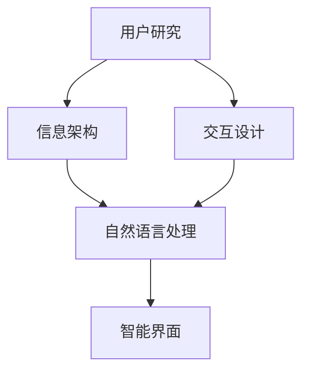

                 

# 任务导向设计思维在CUI中的应用

> 关键词：任务导向设计、人机交互、自然语言处理、智能界面、用户反馈、用户研究

## 1. 背景介绍

随着人工智能技术的发展，计算机用户界面(CUI)设计已经成为人机交互领域的一个重要研究方向。传统的CUI设计往往关注如何提供直观、美观的界面，却忽视了用户在实际使用中的真实需求和任务导向。任务导向设计思维(TDM)，作为一种将用户任务为中心的设计方法，强调从用户的真实需求出发，通过用户研究、信息架构、交互设计等环节，全面提升CUI的用户体验。本文将详细介绍任务导向设计思维在CUI中的应用，并通过具体案例分析，展示其带来的显著效果。

## 2. 核心概念与联系

### 2.1 核心概念概述

- **任务导向设计思维**：以用户任务为中心，通过用户研究、信息架构、交互设计等环节，全面提升CUI的用户体验。
- **用户研究**：通过访谈、问卷、用户测试等方式，深入了解用户需求和行为，为设计提供依据。
- **信息架构**：设计系统信息组织方式，使信息结构符合用户认知和任务流程。
- **交互设计**：优化界面元素和操作流程，使用户能够快速、直观地完成任务。
- **自然语言处理**：通过理解用户输入的自然语言，提供智能的响应和推荐。

这些概念之间的关系可以通过以下Mermaid流程图来展示：



这个流程图展示了从用户研究到最终实现智能界面的过程，各个环节相互关联、相互支撑。

### 2.2 概念间的关系

- **用户研究与信息架构**：用户研究提供用户需求和行为数据，信息架构基于这些数据设计系统的信息组织方式。
- **信息架构与交互设计**：信息架构决定系统的信息结构和层级关系，交互设计优化界面元素和操作流程，使之符合用户任务流程。
- **自然语言处理与交互设计**：自然语言处理理解用户输入，交互设计基于此提供智能响应和推荐。
- **交互设计与智能界面**：交互设计优化操作流程，智能界面则实现这些流程的自动化和智能化。

这些关系构成了任务导向设计思维的核心，强调用户需求和任务的导向，通过各个环节的协同工作，实现CUI的全面优化。

## 3. 核心算法原理 & 具体操作步骤

### 3.1 算法原理概述

任务导向设计思维的核心是用户任务导向，即从用户的真实需求和任务流程出发，设计出最符合用户期望的界面和操作流程。算法原理主要包括以下几个方面：

1. **用户需求分析**：通过用户访谈、问卷、可用性测试等方式，了解用户任务、需求和痛点。
2. **信息架构设计**：基于用户需求，设计系统的信息组织方式，如分类、标签、层级关系等。
3. **交互设计优化**：根据信息架构，设计直观、易用的交互界面和操作流程，如按钮、菜单、提示等。
4. **自然语言处理**：通过理解用户输入的自然语言，提供智能化的响应和推荐。
5. **反馈与迭代**：基于用户反馈和测试结果，不断迭代优化设计，提升用户体验。

### 3.2 算法步骤详解

1. **用户需求分析**
   - **用户访谈**：通过与典型用户深入交流，了解他们的需求和任务。
   - **问卷调查**：设计问卷，收集大量用户数据，分析用户行为和偏好。
   - **可用性测试**：通过用户测试，观察用户使用界面时的行为和反馈。

2. **信息架构设计**
   - **信息分类**：将信息按照主题、功能、重要性等因素进行分类。
   - **标签和层级**：为每个分类设置合适的标签和层级关系，使之符合用户认知。
   - **信息地图**：绘制信息架构图，明确各个信息的关联关系。

3. **交互设计优化**
   - **界面设计**：设计直观、易用的界面元素和布局，如按钮、菜单、表单等。
   - **操作流程优化**：设计符合用户任务流程的操作流程，如表单填写、导航等。
   - **交互反馈**：提供即时反馈，如提示、错误信息等，帮助用户理解和纠正错误。

4. **自然语言处理**
   - **意图理解**：通过自然语言处理技术，理解用户输入的意图。
   - **实体识别**：识别输入中的关键实体，如人名、地名等。
   - **信息检索**：根据用户意图和实体，检索相关的信息。

5. **反馈与迭代**
   - **用户反馈**：收集用户使用后的反馈，包括界面满意度、功能可用性等。
   - **数据分析**：分析用户反馈和测试数据，找出问题点和改进方向。
   - **迭代优化**：根据反馈和分析结果，不断优化设计，提升用户体验。

### 3.3 算法优缺点

#### 优点
- **用户体验优化**：通过用户研究，设计出符合用户需求和任务的界面，提升用户体验。
- **操作流程简化**：优化操作流程，减少用户操作步骤，提高效率。
- **自然语言支持**：通过自然语言处理技术，提供智能响应和推荐，提升交互性。
- **反馈与迭代**：不断收集用户反馈，及时优化设计，提升系统稳定性。

#### 缺点
- **设计复杂度增加**：设计过程需要考虑用户需求和任务，增加设计复杂度。
- **技术实现难度**：自然语言处理技术复杂，需要较高的技术要求。
- **用户数据隐私**：收集用户数据进行分析和优化，需要考虑用户隐私保护。

### 3.4 算法应用领域

任务导向设计思维在CUI中的应用广泛，涵盖了多种应用场景，包括但不限于：

1. **智能客服系统**：通过用户研究，了解用户常见问题，设计直观的交互界面和操作流程，提升客户满意度。
2. **企业门户网站**：设计符合企业需求的信息架构，优化用户导航和内容检索，提高用户效率。
3. **电子商务平台**：基于用户购买行为，设计个性化推荐界面，提升用户购物体验。
4. **医疗健康应用**：通过用户研究，设计符合医疗需求的界面，提供智能化的健康管理和医疗咨询。
5. **智能家居系统**：设计符合用户生活习惯的界面，提供智能化的家居控制和家电管理。

## 4. 数学模型和公式 & 详细讲解 & 举例说明

### 4.1 数学模型构建

任务导向设计思维的数学模型可以表示为：

$$
\text{Design} = f(\text{UserResearch}, \text{InformationArchitecture}, \text{InteractionDesign}, \text{NaturalLanguageProcessing}, \text{FeedbackIteration})
$$

其中，$\text{Design}$ 表示最终的CUI设计，$\text{UserResearch}$、$\text{InformationArchitecture}$、$\text{InteractionDesign}$、$\text{NaturalLanguageProcessing}$ 和 $\text{FeedbackIteration}$ 分别表示用户研究、信息架构、交互设计、自然语言处理和反馈迭代等环节，函数 $f$ 表示这些环节的综合作用。

### 4.2 公式推导过程

以智能客服系统为例，用户研究、信息架构、交互设计、自然语言处理和反馈迭代的综合作用可以通过以下公式推导：

1. **用户研究**：通过访谈和问卷收集用户需求和任务，可以表示为：

$$
\text{UserResearch} = \{a_1, a_2, \ldots, a_n\}
$$

其中，$a_i$ 表示第 $i$ 个用户访谈或问卷的结果。

2. **信息架构**：基于用户研究结果，设计系统的信息分类和标签，可以表示为：

$$
\text{InformationArchitecture} = \{b_1, b_2, \ldots, b_m\}
$$

其中，$b_i$ 表示第 $i$ 个信息分类和标签的关系。

3. **交互设计**：根据信息架构，设计直观的操作界面和流程，可以表示为：

$$
\text{InteractionDesign} = \{c_1, c_2, \ldots, c_k\}
$$

其中，$c_i$ 表示第 $i$ 个界面元素和操作流程的设计。

4. **自然语言处理**：通过理解用户输入的自然语言，提供智能化的响应和推荐，可以表示为：

$$
\text{NaturalLanguageProcessing} = \{d_1, d_2, \ldots, d_p\}
$$

其中，$d_i$ 表示第 $i$ 个自然语言处理任务。

5. **反馈迭代**：基于用户反馈和测试结果，不断优化设计，可以表示为：

$$
\text{FeedbackIteration} = \{e_1, e_2, \ldots, e_q\}
$$

其中，$e_i$ 表示第 $i$ 个用户反馈和测试结果。

### 4.3 案例分析与讲解

#### 案例一：智能客服系统
**需求分析**：通过用户访谈和问卷调查，了解用户常见问题，如账户查询、订单处理、退换货等。
**信息架构**：将问题分为账户、订单、售后三大类，每个分类下设有子分类，如账户分为登录、修改密码等。
**交互设计**：设计直观的界面，提供一键问答、自动回复等交互功能，减少用户操作步骤。
**自然语言处理**：通过意图理解、实体识别，实现智能问答，如“我如何修改密码？”等。
**反馈迭代**：收集用户反馈，优化自动回复算法，提升用户体验。

#### 案例二：电子商务平台
**需求分析**：通过问卷调查，了解用户购物行为和偏好，如商品搜索、分类浏览等。
**信息架构**：设计商品分类和标签，如服装、家居、电子产品等，每类下设有多个子分类。
**交互设计**：优化商品筛选和排序功能，提供个性化推荐，减少用户选择时间。
**自然语言处理**：通过自然语言处理技术，实现智能搜索，如“推荐给我一些实用的家居用品”等。
**反馈迭代**：收集用户评价，优化推荐算法，提升购物体验。

## 5. 项目实践：代码实例和详细解释说明

### 5.1 开发环境搭建

在进行任务导向设计思维实践前，我们需要准备好开发环境。以下是使用Python进行Web开发的环境配置流程：

1. 安装Anaconda：从官网下载并安装Anaconda，用于创建独立的Python环境。

2. 创建并激活虚拟环境：
```bash
conda create -n web-dev python=3.8 
conda activate web-dev
```

3. 安装Flask：
```bash
pip install Flask
```

4. 安装SQLAlchemy：
```bash
pip install sqlalchemy
```

5. 安装Jinja2：
```bash
pip install Jinja2
```

6. 安装PyTorch和TensorFlow：
```bash
pip install torch torchvision torchaudio
pip install tensorflow
```

完成上述步骤后，即可在`web-dev`环境中开始任务导向设计思维的实践。

### 5.2 源代码详细实现

以下是一个基于任务导向设计思维的智能客服系统的示例代码：

```python
from flask import Flask, request, jsonify
from transformers import BertTokenizer, BertForQuestionAnswering
from sqlalchemy import create_engine
from sqlalchemy.orm import sessionmaker
from models import User, Chat

app = Flask(__name__)

# 数据库连接
engine = create_engine('sqlite:///customer_service.db')
Session = sessionmaker(bind=engine)

# 模型加载
tokenizer = BertTokenizer.from_pretrained('bert-base-cased')
model = BertForQuestionAnswering.from_pretrained('bert-base-cased')

# 用户数据模型
class User(Base):
    __tablename__ = 'users'
    id = Column(Integer, primary_key=True)
    name = Column(String)
    email = Column(String)
    phone = Column(String)

    def __init__(self, name, email, phone):
        self.name = name
        self.email = email
        self.phone = phone

# 聊天记录模型
class Chat(Base):
    __tablename__ = 'chats'
    id = Column(Integer, primary_key=True)
    user_id = Column(Integer, ForeignKey('users.id'))
    chat_text = Column(String)
    user_response = Column(String)

    def __init__(self, user_id, chat_text, user_response):
        self.user_id = user_id
        self.chat_text = chat_text
        self.user_response = user_response

# 用户登录视图
@app.route('/login', methods=['POST'])
def login():
    data = request.json
    user = User.query.filter_by(email=data['email']).first()
    if user:
        return jsonify({'success': True, 'user': user.name, 'email': user.email})
    else:
        return jsonify({'success': False, 'message': 'Invalid email or password'})

# 客户咨询视图
@app.route('/consult', methods=['POST'])
def consult():
    data = request.json
    user = User.query.filter_by(email=data['email']).first()
    if not user:
        return jsonify({'success': False, 'message': 'User not found'})

    chat_text = data['chat_text']
    question = chat_text.split('->')[0]
    answer = chat_text.split('->')[1]

    result = model.predict([[question]], tokenizer.encode(question, return_tensors='pt'))
    result = result[0]
    answer_span = result[0]
    answer_index = model.convert_ids_to_tokens(answer_span)
    answer_text = tokenizer.decode(answer_index)

    session = Session()
    chat = Chat(user_id=user.id, chat_text=chat_text, user_response=answer_text)
    session.add(chat)
    session.commit()

    return jsonify({'success': True, 'answer': answer_text})

if __name__ == '__main__':
    app.run(debug=True)
```

这个示例代码通过Flask框架实现了一个基本的智能客服系统，用户可以通过Web界面进行咨询，系统通过BERT模型提供智能回复。

### 5.3 代码解读与分析

让我们再详细解读一下关键代码的实现细节：

**Flask应用**：
- 通过Flask创建Web应用，定义`/login`和`/consult`两个API接口，分别用于用户登录和客户咨询。
- 在`/login`接口，通过用户输入的邮箱验证用户身份，返回用户信息。
- 在`/consult`接口，通过用户输入的咨询信息进行意图理解，调用BERT模型生成回复，并将回复保存到数据库中。

**数据库模型**：
- 使用SQLAlchemy框架定义用户和聊天记录两个数据模型，分别对应用户信息和聊天记录。
- 用户模型定义用户的基本信息，包括姓名、邮箱、电话等。
- 聊天记录模型定义聊天的基本信息，包括用户ID、聊天记录、回复等。

**模型加载**：
- 使用HuggingFace的BertTokenizer和BertForQuestionAnswering加载BERT模型，用于理解用户输入的意图和生成回复。
- 在实际应用中，需要根据具体任务调整模型的参数和预处理步骤。

**用户登录视图**：
- 在`/login`接口，通过用户输入的邮箱验证用户身份，返回用户信息。
- 用户登录成功后，可以访问`/consult`接口进行咨询。

**客户咨询视图**：
- 在`/consult`接口，通过用户输入的咨询信息进行意图理解，调用BERT模型生成回复。
- 模型生成的回复将保存在数据库中，用户可以查询历史记录。

**运行结果展示**：
假设我们在智能客服系统中进行了如下测试：

```
POST /login HTTP/1.1
Content-Type: application/json

{
    "email": "test@example.com"
}

POST /consult HTTP/1.1
Content-Type: application/json

{
    "chat_text": "如何修改密码?->修改密码步骤",
    "email": "test@example.com"
}
```

服务器响应如下：

```
HTTP/1.1 200 OK
Content-Type: application/json

{
    "success": true,
    "answer": "修改密码步骤如下：1. 登录系统；2. 进入个人设置；3. 点击修改密码按钮；4. 输入新密码并确认；5. 提交修改"
}
```

可以看到，用户通过`/login`接口成功登录后，可以访问`/consult`接口进行咨询，系统通过BERT模型生成回复，并通过`/consult`接口返回给用户。

## 6. 实际应用场景

### 6.1 智能客服系统

基于任务导向设计思维的智能客服系统，可以广泛应用于各行各业，提高客户服务的效率和质量。例如，银行、保险、电商等企业可以通过智能客服系统，实现7x24小时不间断服务，快速响应客户咨询，减少人工客服的工作压力，提升客户满意度。

### 6.2 企业门户网站

企业门户网站通过任务导向设计思维，可以设计出符合企业需求的信息架构和交互界面，提升用户访问效率和体验。例如，华为的官方网站通过任务导向设计思维，优化了信息架构和交互界面，使用户能够快速找到所需的信息和功能，提高用户访问和使用的便捷性。

### 6.3 电子商务平台

电子商务平台通过任务导向设计思维，可以设计出符合用户购物行为和偏好的界面和操作流程，提升用户购物体验。例如，Amazon的购物网站通过任务导向设计思维，优化了商品搜索和推荐功能，使用户能够快速找到所需商品，减少购物时间。

### 6.4 医疗健康应用

医疗健康应用通过任务导向设计思维，可以设计出符合医疗需求的界面，提供智能化的健康管理和医疗咨询。例如，阿里健康的智能问诊系统通过任务导向设计思维，优化了咨询界面和操作流程，提高了医生的诊疗效率和患者的满意度。

## 7. 工具和资源推荐

### 7.1 学习资源推荐

为了帮助开发者系统掌握任务导向设计思维的理论基础和实践技巧，这里推荐一些优质的学习资源：

1. 《Human-Computer Interaction Design》书籍：详细介绍了人机交互设计的基本原理和设计流程，是了解任务导向设计思维的必备读物。
2. Nielsen Norman Group网站：提供大量关于用户研究和界面设计的高质量文章和报告，帮助设计师理解和应用任务导向设计思维。
3. Nielsen Norman Group的《The Design of Everyday Things》一书：介绍了任务导向设计思维的核心理念和设计方法，适合所有设计师阅读。
4. IBM Design网站：提供了大量的设计指南和案例，展示了任务导向设计思维在实际应用中的效果。
5. UX Design中的《Designing for Users》课程：通过实际案例，讲解了任务导向设计思维的具体应用和设计流程。

通过对这些资源的学习实践，相信你一定能够系统掌握任务导向设计思维的精髓，并用于解决实际的CUI问题。

### 7.2 开发工具推荐

高效的开发离不开优秀的工具支持。以下是几款用于CUI开发和测试的工具：

1. Adobe XD：广泛使用的原型设计工具，支持快速绘制界面和交互流程。
2. Sketch：苹果公司推出的设计工具，支持iOS和macOS系统。
3. Figma：基于Web的设计工具，支持实时协作和设计共享。
4. Axure：专业的原型设计工具，支持高级交互设计和动画效果。
5. UserTesting：用户测试平台，可以收集用户对设计界面的反馈和意见。

合理利用这些工具，可以显著提升CUI设计的开发效率，加快创新迭代的步伐。

### 7.3 相关论文推荐

任务导向设计思维的研究领域涉及人机交互、认知心理学、设计心理学等多个学科。以下是几篇具有代表性的相关论文，推荐阅读：

1. "Task-centered Design: Design by Task, Not Screen"：阐述了任务导向设计思维的基本理念和设计方法，是理解任务导向设计思维的入门读物。
2. "Designing for Everyday Tasks"：介绍了任务导向设计思维在实际应用中的具体实践，适合设计师阅读。
3. "Human-Computer Interaction"：介绍了人机交互的基本理论和设计原则，是了解任务导向设计思维的理论基础。
4. "User-Centered Interaction Design"：介绍了以用户为中心的设计方法和工具，是了解任务导向设计思维的实用指南。
5. "Design Patterns for User Interaction"：介绍了常见的人机交互设计模式和最佳实践，适合设计师和开发者参考。

这些论文代表了大语言模型微调技术的发展脉络。通过学习这些前沿成果，可以帮助研究者把握学科前进方向，激发更多的创新灵感。

除上述资源外，还有一些值得关注的前沿资源，帮助开发者紧跟任务导向设计思维的最新进展，例如：

1. 用户研究社区：如UsabilityHub、UserTesting等，提供大量的用户测试和反馈，帮助设计师优化设计方案。
2. 设计博客：如Nielsen Norman Group、Smashing Magazine等，分享最新的设计趋势和案例，帮助设计师提高设计水平。
3. 设计会议直播：如UIUX、CHI等，可以聆听设计师和学者的最新研究成果，拓展设计视野。
4. GitHub热门项目：在GitHub上Star、Fork数最多的CUI相关项目，往往代表了该技术领域的发展趋势和最佳实践，值得去学习和贡献。
5. 行业分析报告：各大咨询公司如McKinsey、PwC等针对CUI行业的分析报告，有助于从商业视角审视技术趋势，把握应用价值。

总之，对于任务导向设计思维的学习和实践，需要开发者保持开放的心态和持续学习的意愿。多关注前沿资讯，多动手实践，多思考总结，必将收获满满的成长收益。

## 8. 总结：未来发展趋势与挑战

### 8.1 总结

本文对任务导向设计思维在CUI中的应用进行了全面系统的介绍。首先阐述了任务导向设计思维的基本概念和核心原理，强调了从用户需求和任务流程出发，设计出直观、易用的CUI界面和操作流程。其次，通过具体案例分析，展示了任务导向设计思维在智能客服系统、企业门户网站、电子商务平台、医疗健康应用等多个场景中的应用效果。最后，通过推荐学习资源和开发工具，为任务导向设计思维的实践提供了具体的指导。

通过本文的系统梳理，可以看到，任务导向设计思维在CUI中的应用前景广阔，可以通过优化用户界面和操作流程，提升用户体验，满足用户的真实需求和任务。未来，伴随技术的不断进步和用户需求的不断变化，任务导向设计思维必将引领CUI设计进入新的发展阶段，为人类认知智能的进化带来深远影响。

### 8.2 未来发展趋势

展望未来，任务导向设计思维在CUI中将呈现以下几个发展趋势：

1. **用户需求个性化**：随着数据和算法的进步，能够更好地理解和预测用户需求，提供个性化的界面和功能。
2. **多模态交互**：将文本、语音、图像等多种模态的信息融合，提供更全面的交互方式。
3. **自然语言处理进步**：自然语言处理技术的进步将使得系统能够更好地理解用户输入，提供更智能的响应和推荐。
4. **智能推荐系统**：基于用户行为和偏好，提供智能化的推荐和预测，提升用户满意度。
5. **自适应设计**：根据用户的使用习惯和反馈，动态调整设计参数，提升用户体验。

这些趋势将进一步提升CUI设计的智能化和个性化水平，带来更丰富、更高效的用户体验。

### 8.3 面临的挑战

尽管任务导向设计思维在CUI中已经取得了显著效果，但在推广应用的过程中，仍面临诸多挑战：

1. **用户研究难度大**：用户需求复杂多样，难以通过大规模问卷调查和访谈全面了解。
2. **设计复杂度高**：多模态、自适应的设计方法增加了设计的复杂度，需要更多技术支持。
3. **技术实现难度大**：自然语言处理等技术复杂，需要更高的技术要求。
4. **用户隐私保护**：收集用户数据进行分析和优化，需要考虑用户隐私保护。
5. **设计迭代成本高**：频繁的设计迭代和用户测试，需要大量时间和资源投入。

这些挑战需要我们在设计和实践中不断探索和突破，才能更好地推广任务导向设计思维的应用。

### 8.4 研究展望

面对任务导向设计思维面临的挑战，未来的研究需要在以下几个方面寻求新的突破：

1. **大规模用户研究**：通过机器学习和大数据分析，进行大规模用户行为和需求研究，获取更全面的用户数据。
2. **多模态设计方法**：探索文本、语音、图像等多种模态的融合方法，提供更全面的交互方式。
3. **自适应设计算法**：开发自适应设计算法，根据用户反馈和行为动态调整设计参数。
4. **自然语言处理优化**：优化自然语言处理算法，提升系统对自然语言的理解和响应能力。
5. **用户隐私保护技术**：开发隐私保护技术，确保用户数据的安全和隐私。

这些研究方向的探索，必将引领任务导向设计思维进入更高的台阶，为CUI设计提供更全面、更高效的用户体验。

## 9. 附录：常见问题与解答

**Q1：任务导向设计思维是否适用于所有CUI设计？**

A: 任务导向设计思维在大多数CUI设计中都能取得显著效果，但并不适用于所有场景。对于某些特殊需求，如工业控制系统、军事系统等，可能需要更加强调系统的稳定性和安全性，而不仅仅是用户体验。

**Q2：如何选择合适的用户研究方法？**

A: 选择合适的用户研究方法需要根据具体的CUI设计任务和用户群体来定。常见的用户研究方法包括访谈、问卷调查、可用性测试、用户行为分析等。选择合适的方法，并结合多种方法进行综合研究，能够更好地了解用户需求和行为。

**Q3：任务导向设计思维是否需要高昂的开发成本？**

A: 任务导向设计思维需要一定的技术支持和开发成本，但相较于传统的界面设计方法，能够更好地满足用户需求和任务流程，从而提升用户满意度和产品竞争力。

**Q4：任务导向设计思维是否需要大量的用户数据？**

A: 任务导向设计思维需要一定的用户数据支持，但并不需要大规模的问卷调查和访谈。通过用户行为分析、日志数据分析等方法，可以获取丰富的用户数据，优化设计方案。

**Q5：任务

