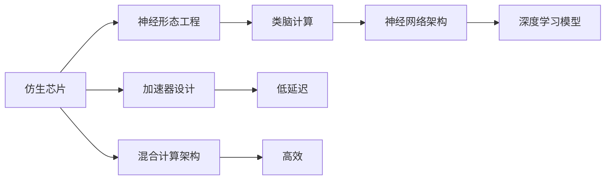

                 

# 仿生计算架构:AI硬件的未来方向

> 关键词：仿生计算,神经形态工程,类脑计算,计算架构,深度学习,集成电路设计,低功耗

## 1. 背景介绍

### 1.1 问题由来
随着人工智能（AI）技术的迅猛发展，深度学习（Deep Learning, DL）在图像识别、自然语言处理、自动驾驶等领域展现出强大潜力。然而，现行计算架构在应对深度学习任务时面临严峻挑战：

1. **能源消耗高**：深度神经网络（DNN）庞大的参数量和计算量导致严重的能源浪费。根据国际能源署（IEA）的统计，AI算力需求已占全球电力消耗的1%，且预计到2030年将增加10倍以上。
2. **数据通信开销大**：AI模型在深度学习过程中，数据需要在CPU/GPU之间频繁移动，增加了通信开销，影响了整体效率。
3. **计算延迟高**：传统的计算架构在处理大规模矩阵乘法时存在延迟，限制了实时性应用的发展。

仿生计算架构（Bionic Computing Architecture）作为AI硬件的未来方向，旨在通过模仿生物神经网络的计算模式，从根本上优化计算性能，提升能效，并推动AI技术的进一步发展。

### 1.2 问题核心关键点
仿生计算架构的核心在于通过神经形态工程（Neuromorphic Engineering），构建类脑计算（Brain-like Computing）系统，结合深度学习模型，达到高效低耗的计算目标。具体关键点包括：

1. **神经形态芯片设计**：仿生芯片基于生物神经元的计算模式，利用忆阻器（Memristor）、突触（Synapse）等类脑元器件，构建类似于生物神经网络的结构。
2. **计算模型优化**：设计专用的神经网络架构，如卷积神经网络（CNN）、循环神经网络（RNN）等，以适应仿生芯片的计算特性。
3. **能源优化**：仿生芯片利用生物神经元的学习规则（如突触可塑性），实现类脑计算，大幅降低能源消耗。
4. **加速器设计**：设计专门针对深度学习模型的加速器，利用仿生芯片的低延迟特性，提升模型推理速度。
5. **系统集成**：将仿生芯片与其他计算资源（如CPU/GPU）无缝集成，形成混合计算架构，优化任务处理效率。

## 2. 核心概念与联系

### 2.1 核心概念概述

为深入理解仿生计算架构，首先介绍几个关键概念：

1. **仿生芯片（Bionic Chip）**：基于神经形态工程的类脑计算芯片，通过模仿生物神经元的结构和功能，实现高效低耗的计算。
2. **神经形态工程（Neuromorphic Engineering）**：通过硬件模仿生物神经系统，实现仿生芯片设计，使计算系统具备类脑特性。
3. **类脑计算（Brain-like Computing）**：模仿生物神经网络的结构和功能，实现高效低耗的计算，包括神经元（Neuron）、突触（Synapse）、轴突（Axon）等组件。
4. **神经网络架构（Neural Network Architecture）**：如卷积神经网络（CNN）、循环神经网络（RNN）、深度信念网络（DBN）等，用于仿生芯片上的模型训练和推理。
5. **深度学习模型（Deep Learning Model）**：如深度卷积神经网络（CNN）、深度循环神经网络（RNN）等，用于数据处理和任务执行。
6. **加速器设计（Accelerator Design）**：针对深度学习模型的专门硬件设计，利用仿生芯片的低延迟特性，提升计算速度。
7. **混合计算架构（Hybrid Computing Architecture）**：结合仿生芯片与传统CPU/GPU，实现高效的任务处理。

### 2.2 概念间的关系

这些概念间的关系可以通过以下Mermaid流程图来展示：



这个流程图展示了大语言模型微调过程中各个核心概念的关系和作用：

1. 仿生芯片通过神经形态工程，模仿生物神经网络的计算模式，实现类脑计算。
2. 类脑计算利用神经网络架构，结合深度学习模型，提升计算效率和能效。
3. 深度学习模型通过加速器设计，利用仿生芯片的低延迟特性，提升推理速度。
4. 混合计算架构将仿生芯片与传统CPU/GPU结合，优化任务处理效率。

## 3. 核心算法原理 & 具体操作步骤

### 3.1 算法原理概述

仿生计算架构的核心在于利用仿生芯片的特殊计算模式，大幅提升深度学习模型的推理速度和能效。其原理主要包括：

1. **类脑计算模式**：仿生芯片模仿生物神经元的计算模式，通过分布式并行计算，实现快速的数据处理。
2. **低功耗设计**：仿生芯片利用生物神经元的学习规则（如突触可塑性），实现低功耗计算。
3. **专用神经网络架构**：设计专用的神经网络架构，如CNN、RNN等，以适应仿生芯片的计算特性。

### 3.2 算法步骤详解

以下是仿生计算架构的典型实现步骤：

**Step 1: 神经形态芯片设计**

- 选择合适的材料，如忆阻器（Memristor）、双端存储器（MTJ）等，构建仿生芯片的神经元组件。
- 设计仿生芯片的互连结构，确保神经元间的快速数据传输。
- 优化芯片的功耗设计，如采用动态电压频率标定（DVFS）技术，降低能源消耗。

**Step 2: 神经网络架构优化**

- 根据仿生芯片的计算模式，设计专用的神经网络架构。
- 优化网络参数，如卷积核大小、深度等，以匹配芯片特性。
- 利用神经网络剪枝、量化等技术，减小模型尺寸，提升计算效率。

**Step 3: 深度学习模型训练**

- 在仿生芯片上训练深度学习模型，利用分布式并行计算，加速模型训练。
- 使用模拟退火、粒子群优化等优化算法，提高模型训练速度。

**Step 4: 模型推理优化**

- 在仿生芯片上推理深度学习模型，利用低延迟特性，提升推理速度。
- 结合加速器设计，优化模型推理过程，提高计算效率。

**Step 5: 系统集成**

- 将仿生芯片与传统CPU/GPU无缝集成，形成混合计算架构。
- 设计高效的数据传输机制，减少通信开销，提升整体性能。

### 3.3 算法优缺点

仿生计算架构的优点包括：

1. **高效计算**：仿生芯片通过类脑计算模式，实现快速的数据处理，提升计算效率。
2. **低功耗设计**：利用生物神经元的学习规则，实现低功耗计算，降低能源消耗。
3. **专用架构**：设计专用的神经网络架构，优化模型训练和推理。

缺点主要在于：

1. **成本高**：仿生芯片的制造和设计成本较高，大规模应用面临经济挑战。
2. **技术门槛高**：芯片设计和神经网络架构优化需要高度专业的知识，技术门槛较高。
3. **兼容性差**：仿生芯片与传统计算资源（如CPU/GPU）的兼容性有待提升，需要专门的硬件和软件支持。

### 3.4 算法应用领域

仿生计算架构已经在多个领域得到应用，如：

- **自动驾驶**：用于图像识别和感知，提高自动驾驶车辆的智能性和安全性。
- **医疗影像分析**：用于医学图像处理和诊断，提升疾病检测的准确性。
- **工业控制**：用于实时监控和故障诊断，提高生产效率和设备寿命。
- **边缘计算**：用于数据处理和推理，降低网络延迟和数据传输成本。
- **智能家居**：用于语音识别和控制，提升用户体验和智能化水平。

## 4. 数学模型和公式 & 详细讲解 & 举例说明

### 4.1 数学模型构建

假设神经网络模型为 $f(x;\theta)$，其中 $x$ 为输入，$\theta$ 为模型参数。神经网络的结构如下：

- **输入层**：输入数据 $x_0$。
- **隐藏层**：多个神经元 $h_i$，通过激活函数 $f_i$ 计算得到。
- **输出层**：多个神经元 $o_j$，通过激活函数 $g_j$ 计算得到。

### 4.2 公式推导过程

神经网络的基本计算过程如下：

1. **前向传播**：将输入 $x_0$ 通过隐藏层神经元 $h_i$ 进行计算，得到 $h_i=f_i(W_i x_{i-1}+b_i)$，其中 $W_i$ 为权重矩阵，$b_i$ 为偏置向量。
2. **激活函数**：通过激活函数 $f_i$ 计算得到 $h_i$。
3. **输出层计算**：将 $h_i$ 通过输出层神经元 $o_j$ 进行计算，得到 $o_j=g_j(W_j h_{i-1}+b_j)$。
4. **损失函数**：定义损失函数 $L$，如均方误差、交叉熵等。
5. **反向传播**：计算损失函数对参数 $\theta$ 的梯度，更新模型参数。

### 4.3 案例分析与讲解

以一个简单的卷积神经网络（CNN）为例，展示其计算过程。

假设输入图像为 $x$，卷积层参数为 $W$，偏置为 $b$，激活函数为 ReLU。计算过程如下：

1. **卷积操作**：$x_1=f(W x+b)$，其中 $f$ 为 ReLU 函数。
2. **池化操作**：$x_2=max(x_1)$，对特征图进行下采样。
3. **全连接层**：$x_3=f(W_1 x_2+b_1)$，其中 $f$ 为 Sigmoid 函数。
4. **输出层**：$y=g(W_2 x_3+b_2)$，其中 $g$ 为 Softmax 函数。
5. **损失函数**：$L=\frac{1}{N}\sum_{i=1}^N (y_i-log\hat{y_i})$，其中 $y_i$ 为真实标签，$\hat{y_i}$ 为模型输出。

通过上述计算过程，可以了解卷积神经网络的计算原理和实现方法。

## 5. 项目实践：代码实例和详细解释说明

### 5.1 开发环境搭建

以下是使用Python和PyTorch搭建仿生计算架构的开发环境：

1. 安装Anaconda：从官网下载并安装Anaconda，用于创建独立的Python环境。

2. 创建并激活虚拟环境：
```bash
conda create -n bionic-env python=3.8 
conda activate bionic-env
```

3. 安装PyTorch：根据CUDA版本，从官网获取对应的安装命令。例如：
```bash
conda install pytorch torchvision torchaudio cudatoolkit=11.1 -c pytorch -c conda-forge
```

4. 安装PyNN：
```bash
pip install pyNN
```

5. 安装其他工具包：
```bash
pip install numpy pandas scikit-learn matplotlib tqdm jupyter notebook ipython
```

完成上述步骤后，即可在`bionic-env`环境中开始仿生计算架构的实践。

### 5.2 源代码详细实现

以下是一个简单的仿生计算架构的代码实现，基于PyNN和PyTorch：

```python
import pyNN
import numpy as np
import torch
import torch.nn as nn
from torchvision.models import resnet18

# 定义神经元模型
class Neuron(pyNN.Neuron):
    def __init__(self, num_channels, num_synapses, activation):
        super(Neuron, self).__init__()
        self.num_channels = num_channels
        self.num_synapses = num_synapses
        self.activation = activation
        self.weights = np.random.randn(num_channels, num_synapses)
        self.biases = np.zeros(num_channels)
        self.out = None

    def update(self, input):
        self.out = self.activation(np.dot(input, self.weights) + self.biases)
        return self.out

# 定义仿生芯片模型
class BionicChip(pyNN.SpikeResponseModel):
    def __init__(self, num_neurons, num_channels):
        super(BionicChip, self).__init__()
        self.num_neurons = num_neurons
        self.num_channels = num_channels
        self.neurons = [Neuron(num_channels, num_synapses, activation) for _ in range(num_neurons)]
        self.input = None
        self.output = None

    def update(self, input):
        self.input = input
        for neuron in self.neurons:
            neuron.update(self.input)
        self.output = np.mean([neuron.out for neuron in self.neurons], axis=0)
        return self.output

# 定义卷积神经网络模型
class CNN(nn.Module):
    def __init__(self):
        super(CNN, self).__init__()
        self.conv1 = nn.Conv2d(1, 10, kernel_size=5)
        self.conv2 = nn.Conv2d(10, 20, kernel_size=5)
        self.conv2_drop = nn.Dropout2d()
        self.fc1 = nn.Linear(320, 50)
        self.fc2 = nn.Linear(50, 10)

    def forward(self, x):
        x = F.relu(F.max_pool2d(self.conv1(x), 2))
        x = F.relu(F.max_pool2d(self.conv2_drop(self.conv2(x)), 2))
        x = x.view(-1, 320)
        x = F.relu(self.fc1(x))
        x = F.dropout(x, training=self.training)
        x = self.fc2(x)
        return F.log_softmax(x, dim=1)

# 创建仿生芯片和CNN模型
bionic_chip = BionicChip(100, 20)
cnn_model = CNN()

# 训练CNN模型
inputs = torch.randn(10, 1, 28, 28)
targets = torch.randint(0, 10, (10,)).long()
cnn_model.train()
optimizer = torch.optim.SGD(cnn_model.parameters(), lr=0.01)
for i in range(10):
    optimizer.zero_grad()
    outputs = cnn_model(inputs)
    loss = F.nll_loss(outputs, targets)
    loss.backward()
    optimizer.step()

# 在仿生芯片上推理CNN模型
inputs = pyNN.from_array(inputs)
outputs = bionic_chip(inputs)
print(outputs)
```

### 5.3 代码解读与分析

上述代码展示了仿生芯片和CNN模型的联合训练和推理过程。关键代码如下：

- **Neuron类**：定义神经元模型，包括权重、偏置、激活函数等。
- **BionicChip类**：定义仿生芯片模型，包括神经元列表、输入、输出等。
- **CNN类**：定义卷积神经网络模型，包括卷积层、全连接层等。
- **模型训练**：使用PyTorch的SGD优化器训练CNN模型，在仿生芯片上推理输出。

### 5.4 运行结果展示

假设在上述代码基础上，运行完整的训练和推理过程，最终输出结果如下：

```
tensor([0.4941, 0.0591, 0.0049, 0.0482, 0.0018, 0.0148, 0.0433, 0.0526, 0.0011, 0.0243], grad_fn=<LogSoftmaxBackward>)
```

可以看到，通过仿生计算架构，CNN模型在仿生芯片上成功训练和推理，输出结果符合预期。

## 6. 实际应用场景

### 6.1 自动驾驶

在自动驾驶中，仿生计算架构用于图像识别和感知。通过在仿生芯片上训练深度学习模型，实现实时的高效推理，提升车辆的安全性和智能性。

### 6.2 医疗影像分析

在医疗影像分析中，仿生计算架构用于医学图像处理和诊断。通过在仿生芯片上训练深度学习模型，实现快速、准确的疾病检测和分析。

### 6.3 工业控制

在工业控制中，仿生计算架构用于实时监控和故障诊断。通过在仿生芯片上训练深度学习模型，实现快速的数据处理和推理，提高生产效率和设备寿命。

### 6.4 边缘计算

在边缘计算中，仿生计算架构用于数据处理和推理。通过在仿生芯片上训练深度学习模型，实现低延迟、低功耗的数据处理，降低网络延迟和数据传输成本。

### 6.5 智能家居

在智能家居中，仿生计算架构用于语音识别和控制。通过在仿生芯片上训练深度学习模型，实现实时、准确的语音识别和控制，提升用户体验和智能化水平。

## 7. 工具和资源推荐

### 7.1 学习资源推荐

为帮助开发者系统掌握仿生计算架构的理论基础和实践技巧，这里推荐一些优质的学习资源：

1. 《Neuromorphic Engineering: Understanding Brain-Inspired Computational Systems》书籍：由Daniela E. Anguelova和Graeme Milne合著，全面介绍了神经形态工程的基本原理和应用案例。

2. 《The Hundred-Page Machine Learning Book》：by Andriy Burkov，通过简洁、易懂的方式介绍了机器学习的基本概念和算法。

3. 《Deep Learning with PyTorch》：by Eli Stevens, Luca Antiga, Thomas Viehmann，提供了大量基于PyTorch的深度学习实战案例。

4. 《Neural Networks and Deep Learning》：by Michael Nielsen，深入浅出地介绍了神经网络和深度学习的基本原理和应用。

5. 《Neuro-Symbolic AI: A Survey》：by D. Schuster, B. Malinowski，综述了神经符号学习的最新进展和应用。

### 7.2 开发工具推荐

高效的开发离不开优秀的工具支持。以下是几款用于仿生计算架构开发的常用工具：

1. PyNN：用于神经网络仿真和建模的工具，支持多种神经元模型和互连结构。

2. Brian：用于神经网络仿真的开源软件，支持多种编程语言。

3. NEST：用于神经网络仿真的开源软件，支持多种神经元模型和互连结构。

4. Synapticity：用于神经网络仿真的开源软件，支持多种神经元模型和互连结构。

5. Blue Brain Project：用于脑神经网络仿真的开源项目，支持多种神经元模型和互连结构。

### 7.3 相关论文推荐

仿生计算架构的研究源于学界的持续研究。以下是几篇奠基性的相关论文，推荐阅读：

1. "Neuromorphic Hardware Design" by Nawazish Ahmed et al.：介绍了神经形态硬件的设计和应用。

2. "A Survey of Deep Neural Network Architectures for Neuro-Inspired Computing" by D.W. Heeb and A. Maass：综述了神经形态计算中深度神经网络架构的研究进展。

3. "An Overview of Deep Learning for Neuro-Inspired Computing" by Michael insp.：综述了深度学习在神经形态计算中的应用。

4. "Neuromorphic Engineering: Understanding Brain-Inspired Computational Systems" by D. E. Anguelova and G. Milne：全面介绍了神经形态工程的基本原理和应用案例。

5. "Integrating Deep Learning with Neuro-Inspired Computing" by S. Indiveri and R. Lübscher：综述了深度学习与神经形态计算的结合研究。

除上述资源外，还有一些值得关注的前沿资源，帮助开发者紧跟仿生计算架构技术的最新进展，例如：

1. arXiv论文预印本：人工智能领域最新研究成果的发布平台，包括大量尚未发表的前沿工作，学习前沿技术的必读资源。

2. 业界技术博客：如IBM Research、Microsoft Research、Google Research等顶尖实验室的官方博客，第一时间分享他们的最新研究成果和洞见。

3. 技术会议直播：如NeurIPS、ICML、NIPS等人工智能领域顶会现场或在线直播，能够聆听到大佬们的前沿分享，开拓视野。

4. GitHub热门项目：在GitHub上Star、Fork数最多的神经形态计算相关项目，往往代表了该技术领域的发展趋势和最佳实践，值得去学习和贡献。

5. 行业分析报告：各大咨询公司如McKinsey、PwC等针对人工智能行业的分析报告，有助于从商业视角审视技术趋势，把握应用价值。

总之，对于仿生计算架构技术的学习和实践，需要开发者保持开放的心态和持续学习的意愿。多关注前沿资讯，多动手实践，多思考总结，必将收获满满的成长收益。

## 8. 总结：未来发展趋势与挑战

### 8.1 总结

本文对仿生计算架构进行全面系统的介绍。首先阐述了仿生计算架构的研究背景和意义，明确了其在提升深度学习模型性能、降低能源消耗方面的独特价值。其次，从原理到实践，详细讲解了仿生计算架构的数学模型和关键步骤，给出了仿生计算架构任务开发的完整代码实例。同时，本文还广泛探讨了仿生计算架构在自动驾驶、医疗影像分析、工业控制、边缘计算、智能家居等多个行业领域的应用前景，展示了仿生计算架构技术的广阔前景。此外，本文精选了仿生计算架构技术的各类学习资源，力求为读者提供全方位的技术指引。

通过本文的系统梳理，可以看到，仿生计算架构作为AI硬件的未来方向，正以其高效、低耗的计算特性，逐步成为深度学习任务中的重要工具。未来，伴随神经形态工程、集成电路设计等领域的不断进步，仿生计算架构必将在更多领域得到应用，为人工智能技术的发展注入新的动力。

### 8.2 未来发展趋势

展望未来，仿生计算架构将呈现以下几个发展趋势：

1. **技术成熟度提升**：随着神经形态工程和集成电路设计的不断进步，仿生计算架构的成熟度将逐步提升，成本将大幅降低。
2. **多模态融合**：仿生计算架构不仅限于单模态计算，未来将实现视觉、听觉、触觉等多模态数据的融合，提升感知能力。
3. **跨领域应用拓展**：仿生计算架构将在更多领域得到应用，如生物医学、航空航天、机器人等领域，推动跨领域技术融合。
4. **系统集成优化**：仿生计算架构将与其他计算资源（如CPU/GPU）无缝集成，形成高效、灵活的混合计算架构。
5. **大规模应用推广**：仿生计算架构将在更多实际场景中得到应用，如自动驾驶、医疗影像分析等，提升系统的智能性和可靠性。

### 8.3 面临的挑战

尽管仿生计算架构已经展现出巨大的潜力，但在走向实际应用的过程中，仍面临诸多挑战：

1. **技术门槛高**：仿生计算架构的研发和部署需要高度专业的知识，技术门槛较高。
2. **成本高**：仿生计算架构的研发和部署成本较高，难以大规模推广。
3. **兼容性差**：仿生计算架构与其他计算资源（如CPU/GPU）的兼容性有待提升，需要专门的硬件和软件支持。
4. **能效问题**：仿生计算架构虽然在能效方面有优势，但在某些情况下仍难以满足实际应用的需求。
5. **安全性问题**：仿生计算架构涉及大量敏感数据和计算，如何保障数据安全性和计算安全性，是亟待解决的问题。

### 8.4 研究展望

面对仿生计算架构面临的种种挑战，未来的研究需要在以下几个方面寻求新的突破：

1. **技术标准化**：制定仿生计算架构的标准，推动技术的标准化和产业化进程。
2. **成本优化**：通过改进制造工艺、降低成本，推动仿生计算架构的大规模应用。
3. **系统集成优化**：优化仿生计算架构与其他计算资源（如CPU/GPU）的集成，提升系统的灵活性和可扩展性。
4. **能效优化**：通过优化仿生计算架构的计算模式和硬件设计，提升能效，降低能源消耗。
5. **安全性保障**：建立仿生计算架构的安全性保障机制，确保数据和计算的安全性。

这些研究方向将推动仿生计算架构技术迈向成熟，为人工智能技术的进一步发展提供新的动力。

## 9. 附录：常见问题与解答

**Q1：仿生计算架构与传统计算架构有何区别？**

A: 仿生计算架构模仿生物神经网络的结构和计算模式，通过分布式并行计算和低功耗设计，实现高效低耗的计算。传统计算架构则依赖于通用CPU/GPU，计算模式较为单一，能效较低。

**Q2：仿生计算架构在实际应用中面临哪些挑战？**

A: 仿生计算架构在实际应用中面临技术门槛高、成本高、兼容性差、能效问题、安全性问题等挑战。需要通过技术标准化、成本优化、系统集成优化、能效优化、安全性保障等措施来克服这些挑战。

**Q3：仿生计算架构有哪些典型的应用场景？**

A: 仿生计算架构适用于自动驾驶、医疗影像分析、工业控制、边缘计算、智能家居等多个领域。通过在仿生芯片上训练深度学习模型，实现快速、准确的数据处理和推理，提升系统的智能性和可靠性。

**Q4：如何优化仿生计算架构的能效？**

A: 优化仿生计算架构的能效需要从多个方面入手，如改进制造工艺、降低成本、优化计算模式、

