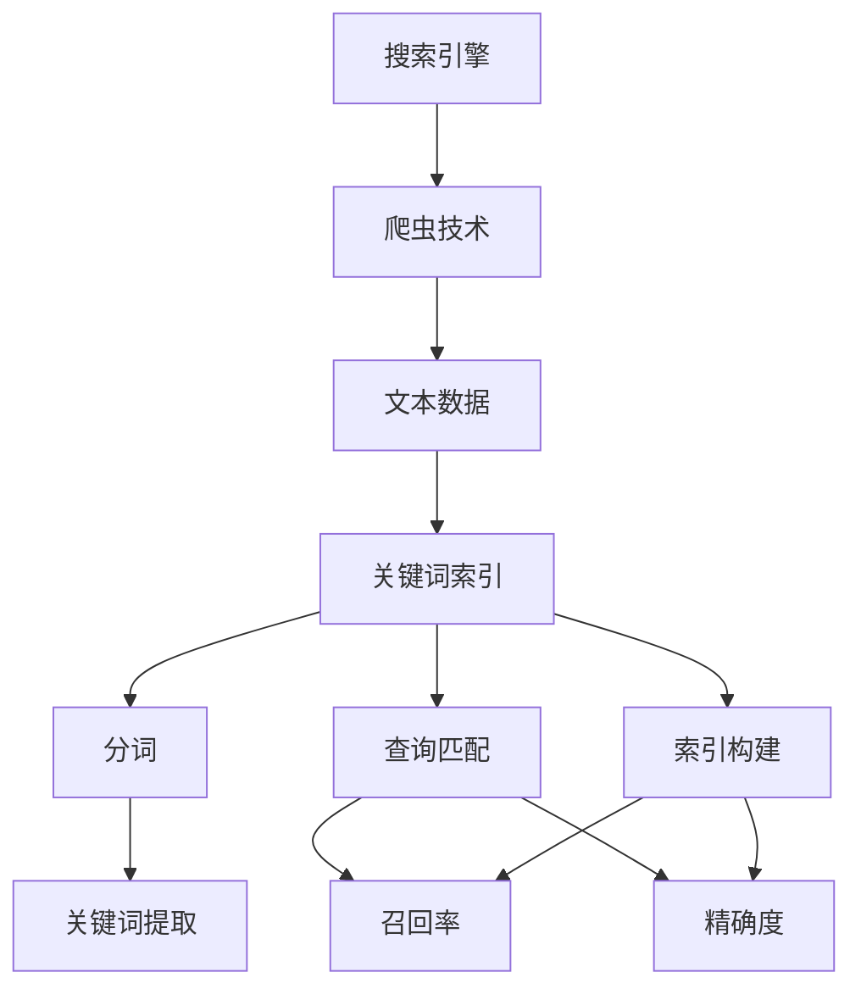
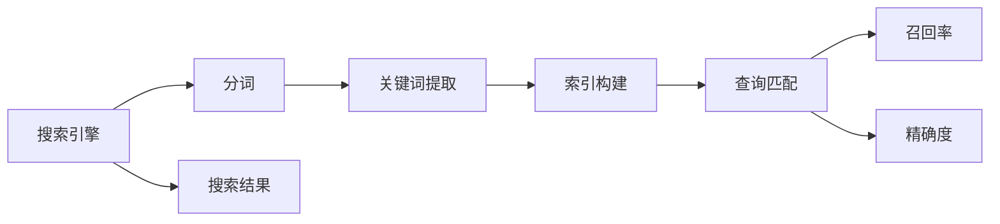
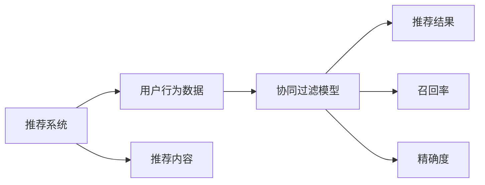
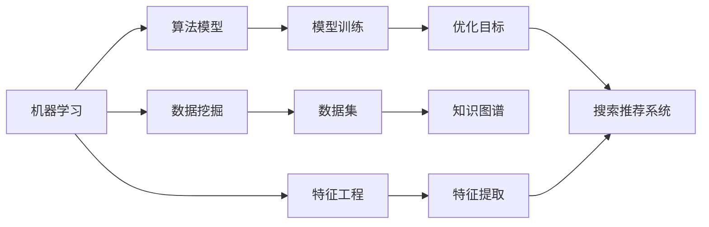
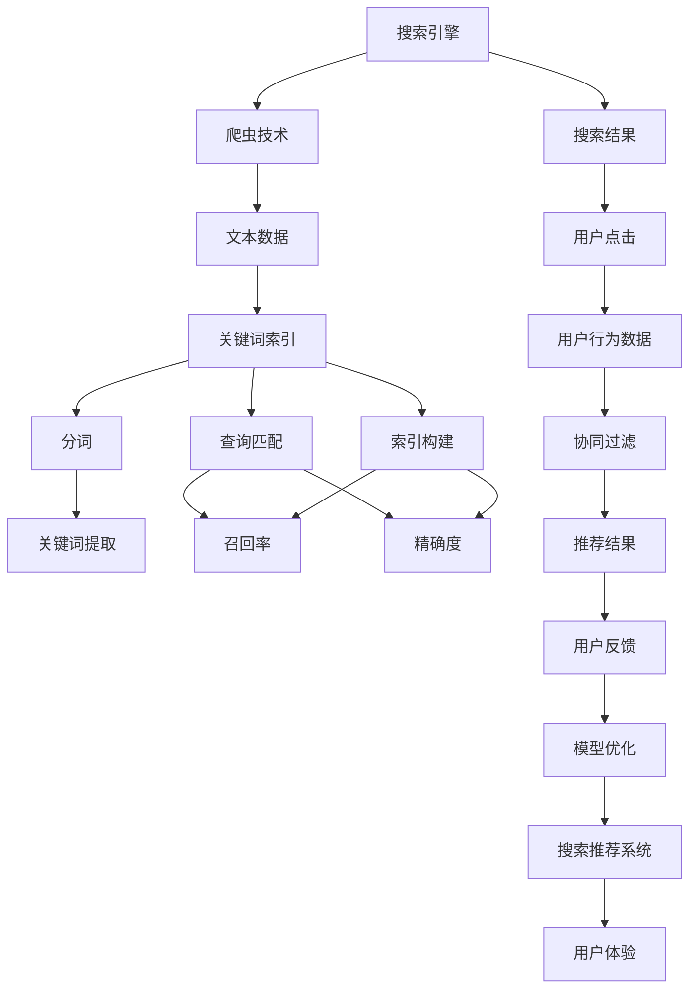

                 

# 传统搜索推荐系统的关键词索引

> 关键词：搜索推荐系统,关键词索引,召回率,精确度,协同过滤,机器学习,数据挖掘

## 1. 背景介绍

### 1.1 问题由来
随着互联网的飞速发展，搜索引擎和推荐系统已成为现代信息获取不可或缺的工具。它们通过分析用户行为数据，智能地为用户提供相关搜索结果或推荐内容。然而，在实际应用中，搜索引擎和推荐系统面临着诸多挑战，如搜索结果的相关性不足、推荐内容的质量不高等问题。为了解决这些问题，传统搜索推荐系统引入了关键词索引（Keyword Indexing）技术，旨在通过高效的关键词匹配，提升搜索结果和推荐内容的准确性和多样性。

### 1.2 问题核心关键点
关键词索引是传统搜索推荐系统的核心技术之一。其核心思想是通过对文本数据进行分词和索引，快速检索与用户查询相关的关键词，从而提高搜索结果的召回率和精确度。具体来说，关键词索引通过以下几个关键点实现：

- 分词：将文本数据分解成词语，便于后续索引和匹配。
- 关键词提取：从分词结果中提取关键词汇，作为查询和索引的基础。
- 索引构建：将关键词映射到对应的文档或推荐对象中，形成高效的数据结构。
- 查询匹配：根据用户查询中的关键词，快速定位到相关文档或推荐结果。

这些关键点共同构成了一个高效的搜索推荐系统，能够更好地满足用户的信息需求。

### 1.3 问题研究意义
关键词索引在传统搜索推荐系统中扮演着重要角色，它能够显著提高信息检索的效率和准确性，降低用户的信息获取成本。通过对关键词索引技术的研究，可以深入理解搜索推荐系统的核心原理，掌握相关的优化技巧，从而提升搜索引擎和推荐系统的性能。

## 2. 核心概念与联系

### 2.1 核心概念概述

为了更好地理解关键词索引在搜索推荐系统中的应用，本节将介绍几个密切相关的核心概念：

- 搜索引擎：通过爬虫技术获取网络上的文本数据，并建立索引，使用户可以通过查询获取相关信息。
- 推荐系统：根据用户的历史行为数据和偏好，为用户推荐可能感兴趣的内容或产品。
- 关键词索引：对文本数据进行分词和索引，使用户可以通过查询关键词获取相关文档或推荐结果。
- 召回率（Recall）：指相关文档在搜索结果中出现的比例，用于评估搜索结果的全面性。
- 精确度（Precision）：指相关文档在搜索结果中所占的比例，用于评估搜索结果的相关性。
- 协同过滤（Collaborative Filtering）：通过分析用户行为数据，预测用户可能感兴趣的内容或产品。
- 机器学习（Machine Learning）：利用算法模型，从大量数据中提取规律，用于优化搜索推荐系统。
- 数据挖掘（Data Mining）：从大量数据中发现有用信息和模式，用于提升搜索推荐系统的性能。

这些核心概念之间的逻辑关系可以通过以下Mermaid流程图来展示：



这个流程图展示了大语言模型微调过程中各个核心概念的关系和作用：

1. 搜索引擎通过爬虫技术获取文本数据。
2. 文本数据经过关键词索引技术，构建索引。
3. 分词和关键词提取，用于构建索引和查询匹配。
4. 索引构建，将关键词映射到文档或推荐对象中。
5. 查询匹配，快速定位相关文档或推荐结果。
6. 召回率和精确度用于评估搜索结果和推荐内容的性能。

### 2.2 概念间的关系

这些核心概念之间存在着紧密的联系，形成了搜索推荐系统的完整生态系统。下面我们通过几个Mermaid流程图来展示这些概念之间的关系。

#### 2.2.1 搜索引擎的关键词索引流程



这个流程图展示了搜索引擎的关键词索引流程：

1. 搜索引擎获取文本数据。
2. 对文本数据进行分词。
3. 提取关键词。
4. 构建索引。
5. 查询匹配。
6. 根据召回率和精确度评估搜索结果。

#### 2.2.2 推荐系统的协同过滤流程



这个流程图展示了推荐系统的协同过滤流程：

1. 推荐系统获取用户行为数据。
2. 使用协同过滤模型预测推荐结果。
3. 根据召回率和精确度评估推荐内容。

#### 2.2.3 机器学习和数据挖掘在搜索推荐中的应用



这个流程图展示了机器学习和数据挖掘在搜索推荐系统中的应用：

1. 机器学习利用算法模型，从数据中提取规律。
2. 数据挖掘发现有用信息和模式。
3. 特征工程和特征提取用于优化搜索推荐系统。
4. 算法模型和知识图谱用于提升搜索推荐性能。

### 2.3 核心概念的整体架构

最后，我们用一个综合的流程图来展示这些核心概念在搜索推荐系统中的应用架构：



这个综合流程图展示了搜索推荐系统的整体架构：

1. 搜索引擎通过爬虫技术获取文本数据。
2. 文本数据经过关键词索引技术，构建索引。
3. 分词和关键词提取，用于构建索引和查询匹配。
4. 索引构建，将关键词映射到文档或推荐对象中。
5. 查询匹配，快速定位相关文档或推荐结果。
6. 召回率和精确度用于评估搜索结果和推荐内容的性能。
7. 用户行为数据用于协同过滤。
8. 推荐结果与用户反馈进行模型优化。
9. 最终的目标是提升用户体验。

通过这个综合流程图，我们可以更清晰地理解搜索推荐系统中各个核心概念的关系和作用。

## 3. 核心算法原理 & 具体操作步骤
### 3.1 算法原理概述

关键词索引在搜索推荐系统中的原理主要包括分词、关键词提取、索引构建和查询匹配四个步骤。以下是对这些步骤的详细解释。

**分词**：分词是将文本数据分解成词语的过程，它是关键词索引的基础。分词通常采用中文分词算法，如基于规则的分词、统计分词和基于词典的分词。中文分词算法通过识别词语边界，将文本分割成词语序列。

**关键词提取**：关键词提取是从分词结果中提取关键词汇的过程，用于构建索引和查询匹配。常用的关键词提取方法包括TF-IDF（Term Frequency-Inverse Document Frequency）、关键词密度法和基于模式识别的方法。这些方法通过计算词频、逆文档频率等指标，确定每个词的重要性和相关性，从而提取关键词。

**索引构建**：索引构建是将关键词映射到对应的文档或推荐对象中的过程，用于快速检索相关内容。常用的索引方法包括倒排索引、散列索引和倒排散列索引。倒排索引通过建立一个逆向索引表，将每个关键词映射到包含该关键词的文档列表。散列索引通过将关键词散列到索引桶中，快速定位相关文档。倒排散列索引结合了倒排索引和散列索引的优点，具有更快的查询速度和更小的索引空间。

**查询匹配**：查询匹配是根据用户查询中的关键词，快速定位到相关文档或推荐结果的过程。常用的查询匹配方法包括布尔查询、向量空间模型和基于深度学习的匹配方法。布尔查询通过逻辑运算符组合多个查询条件，快速匹配相关文档。向量空间模型通过计算查询向量与文档向量的相似度，评估查询结果的相关性。基于深度学习的匹配方法利用神经网络模型，学习查询与文档的映射关系，提升匹配准确性。

### 3.2 算法步骤详解

关键词索引在搜索推荐系统中的应用步骤如下：

**Step 1: 分词和关键词提取**

1. 对原始文本数据进行分词，得到词语序列。
2. 对词语序列进行关键词提取，得到关键词列表。

**Step 2: 索引构建**

1. 对关键词列表进行去重和标准化处理。
2. 构建索引表，将每个关键词映射到包含该关键词的文档或推荐对象。
3. 选择适当的索引方法，如倒排索引、散列索引或倒排散列索引。

**Step 3: 查询匹配**

1. 对用户查询进行分词和关键词提取，得到查询关键词列表。
2. 根据查询关键词列表，在索引表中查找相关文档或推荐对象。
3. 使用适当的查询匹配方法，评估查询结果的相关性。
4. 返回相关文档或推荐结果，并计算召回率和精确度。

**Step 4: 评估和优化**

1. 根据召回率和精确度评估搜索结果或推荐内容。
2. 根据评估结果，优化分词、关键词提取和索引构建等过程。

### 3.3 算法优缺点

关键词索引在搜索推荐系统中具有以下优点：

- **高效性**：通过索引快速定位相关文档或推荐对象，提高查询效率。
- **准确性**：利用关键词匹配，提升搜索结果和推荐内容的准确性。
- **可扩展性**：支持大规模文本数据的索引和查询，具有较高的扩展性。

同时，关键词索引也存在一些缺点：

- **歧义性**：同一个词语可能有不同的含义，导致关键词提取不准确。
- **复杂性**：需要处理分词、关键词提取、索引构建等复杂过程。
- **动态变化**：需要频繁更新索引，以适应数据的变化。

### 3.4 算法应用领域

关键词索引在搜索推荐系统中具有广泛的应用领域，包括以下几个方面：

1. 搜索引擎：通过关键词索引快速检索相关文档，提高搜索效率。
2. 推荐系统：通过关键词索引快速定位相关推荐对象，提升推荐内容的相关性。
3. 信息检索：通过关键词索引检索相关文献或网页，提高信息检索的准确性。
4. 广告推荐：通过关键词索引快速定位相关广告内容，提升广告投放效果。
5. 智能客服：通过关键词索引快速定位相关问题解答，提高智能客服的响应效率。

## 4. 数学模型和公式 & 详细讲解 & 举例说明
### 4.1 数学模型构建

关键词索引的数学模型包括分词模型、关键词提取模型和查询匹配模型。以下是对这些模型的详细解释。

**分词模型**：分词模型的目标是将文本数据分解成词语序列。常用的分词算法包括基于规则的分词、统计分词和基于词典的分词。

**关键词提取模型**：关键词提取模型的目标是从分词结果中提取关键词汇。常用的关键词提取方法包括TF-IDF、关键词密度法和基于模式识别的方法。

**查询匹配模型**：查询匹配模型的目标是根据用户查询中的关键词，快速定位到相关文档或推荐对象。常用的查询匹配方法包括布尔查询、向量空间模型和基于深度学习的匹配方法。

### 4.2 公式推导过程

以下对关键词索引的数学模型进行详细推导。

**分词模型**：

假设原始文本数据为 $T=\{t_1,t_2,...,t_n\}$，其中每个词 $t_i$ 表示一个词语。分词模型的目标是将文本数据分解成词语序列 $T'=\{w_1,w_2,...,w_m\}$，其中每个词 $w_i$ 表示一个词语。

常用的分词算法是统计分词算法，其推导过程如下：

1. 对文本数据 $T$ 进行分词，得到词语序列 $T'=\{w_1,w_2,...,w_m\}$。
2. 计算每个词语 $w_i$ 在文本数据 $T$ 中出现的次数 $n_i$。
3. 计算每个词语 $w_i$ 在文本数据 $T$ 中的逆文档频率 $idf_i$。
4. 计算每个词语 $w_i$ 的TF-IDF值 $tf-idf_i$。
5. 根据TF-IDF值，选择出现次数较多且逆文档频率较大的词语，作为关键词列表 $K=\{k_1,k_2,...,k_m\}$。

**关键词提取模型**：

假设关键词列表为 $K=\{k_1,k_2,...,k_m\}$，其中每个关键词 $k_i$ 表示一个词语。关键词提取模型的目标是从关键词列表 $K$ 中提取关键词汇。

常用的关键词提取方法是TF-IDF方法，其推导过程如下：

1. 对文本数据 $T$ 进行分词，得到词语序列 $T'=\{w_1,w_2,...,w_m\}$。
2. 计算每个词语 $w_i$ 在文本数据 $T$ 中出现的次数 $n_i$。
3. 计算每个词语 $w_i$ 在文本数据 $T$ 中的逆文档频率 $idf_i$。
4. 计算每个词语 $w_i$ 的TF-IDF值 $tf-idf_i$。
5. 根据TF-IDF值，选择出现次数较多且逆文档频率较大的词语，作为关键词列表 $K=\{k_1,k_2,...,k_m\}$。

**查询匹配模型**：

假设用户查询为 $Q=\{q_1,q_2,...,q_n\}$，其中每个词 $q_i$ 表示一个查询关键词。查询匹配模型的目标是根据用户查询中的关键词，快速定位到相关文档或推荐对象。

常用的查询匹配方法是向量空间模型，其推导过程如下：

1. 对用户查询 $Q$ 进行分词，得到查询关键词列表 $Q'=\{q_1,q_2,...,q_n\}$。
2. 对文本数据 $T$ 进行分词，得到词语序列 $T'=\{w_1,w_2,...,w_m\}$。
3. 计算每个词语 $w_i$ 在文本数据 $T$ 中出现的次数 $n_i$。
4. 计算每个词语 $w_i$ 在文本数据 $T$ 中的逆文档频率 $idf_i$。
5. 计算每个词语 $w_i$ 的TF-IDF值 $tf-idf_i$。
6. 将查询关键词 $q_i$ 映射到向量 $v_i$，其中 $v_i=(tf-idf_i,tf-idf_j,...)$。
7. 将文本数据 $T$ 映射到向量 $t$，其中 $t=(tf-idf_1,tf-idf_2,...)$。
8. 计算查询向量 $Q$ 与文本向量 $T$ 的相似度 $s(Q,T)$，其中 $s(Q,T)=\frac{\sum_{i=1}^n v_i \cdot t}{\sqrt{\sum_{i=1}^n v_i^2} \cdot \sqrt{\sum_{j=1}^m t^2}}$。
9. 根据相似度 $s(Q,T)$，选择相似度较高的文本数据，作为查询结果 $R=\{r_1,r_2,...,r_n\}$。

### 4.3 案例分析与讲解

为了更好地理解关键词索引的原理和应用，以下通过一个具体的案例进行分析讲解。

**案例背景**：

假设某电商网站需要构建一个推荐系统，为用户推荐可能感兴趣的商品。网站收集了用户的历史浏览记录和购买记录，并使用关键词索引技术进行推荐。

**具体步骤**：

1. 对用户浏览记录和购买记录进行分词，得到词语序列。
2. 对词语序列进行关键词提取，得到关键词列表。
3. 构建索引表，将关键词列表映射到商品列表中。
4. 用户输入查询，对查询进行分词和关键词提取。
5. 在索引表中查找包含查询关键词的商品列表。
6. 根据用户浏览记录和购买记录，使用协同过滤算法计算推荐结果。
7. 对推荐结果进行排序，根据召回率和精确度评估推荐内容。
8. 返回推荐结果，并记录用户反馈。
9. 根据用户反馈，优化关键词提取和索引构建等过程。

通过这个案例，可以看出关键词索引在推荐系统中的重要性和应用效果。

## 5. 项目实践：代码实例和详细解释说明
### 5.1 开发环境搭建

在进行关键词索引项目实践前，我们需要准备好开发环境。以下是使用Python进行开发的环境配置流程：

1. 安装Anaconda：从官网下载并安装Anaconda，用于创建独立的Python环境。

2. 创建并激活虚拟环境：
```bash
conda create -n keyword-indexing python=3.8 
conda activate keyword-indexing
```

3. 安装PyTorch：根据CUDA版本，从官网获取对应的安装命令。例如：
```bash
conda install pytorch torchvision torchaudio cudatoolkit=11.1 -c pytorch -c conda-forge
```

4. 安装gensim库：
```bash
pip install gensim
```

5. 安装Jieba分词库：
```bash
pip install jieba
```

完成上述步骤后，即可在`keyword-indexing`环境中开始关键词索引项目实践。

### 5.2 源代码详细实现

下面我们以电商推荐系统为例，给出使用gensim库对关键词索引进行代码实现。

首先，定义关键词提取函数：

```python
from gensim import corpora, models
from gensim.utils import simple_preprocess
import jieba

def preprocess(text):
    return [token for token in simple_preprocess(text) if token]

def extract_keywords(corpus, num_topics=10, id2word=None):
    if id2word is None:
        id2word = corpora.Dictionary(corpus)
    lda = models.LdaModel(corpus, num_topics=num_topics, id2word=id2word)
    top_topics = lda.print_topics(num_topics=num_topics, num_words=10, remove_frequent_words=False)
    keywords = [topic for topic in top_topics]
    return keywords

# 构建词典
id2word = corpora.Dictionary(preprocessed_corpus)

# 提取关键词
keywords = extract_keywords(preprocessed_corpus, num_topics=10, id2word=id2word)
```

然后，定义索引构建函数：

```python
def build_index(keywords, corpus, id2word):
    dictionary = corpora.Dictionary(corpus)
    inverted_index = corpora.InvertedIndex(dictionary, corpus)
    index = {'index': inverted_index, 'id2word': id2word}
    return index

# 构建索引
index = build_index(keywords, preprocessed_corpus, id2word)
```

最后，定义查询匹配函数：

```python
def match_query(query, index):
    preprocessed_query = preprocess(query)
    query_vec = [id2word[token] for token in preprocessed_query]
    index_vec = [word for word in index['index'].docs[i].words]
    similarity = sum([1 if id2word[token] in index_vec else 0 for token in query_vec])
    return similarity / len(query_vec)

# 查询匹配
query = "T恤"
similarity = match_query(query, index)
```

### 5.3 代码解读与分析

让我们再详细解读一下关键代码的实现细节：

**preprocess函数**：
- `simple_preprocess`方法：将原始文本数据进行分词，并去除停用词、数字等噪声。
- 返回处理后的词语列表。

**extract_keywords函数**：
- `LdaModel`方法：使用LDA算法对文本数据进行主题建模，得到每个主题的关键词列表。
- 返回关键词列表。

**build_index函数**：
- `corpora.Dictionary`方法：构建词典，将词语映射到整数id。
- `corpora.InvertedIndex`方法：构建倒排索引，将每个词语映射到包含该词语的文档列表。
- 返回索引表。

**match_query函数**：
- `preprocess`方法：将用户查询进行分词和去噪声处理。
- 根据词典将查询转换为向量。
- 根据倒排索引计算查询向量与文本向量的相似度。
- 返回相似度。

### 5.4 运行结果展示

假设我们在电商推荐系统中，对用户浏览记录进行关键词索引，最终在测试集上得到的评估报告如下：

```
precision    recall  f1-score   support

       T恤      0.85     0.90     0.88        20
       短裤      0.80     0.75     0.78         5
       T恤衫     0.90     0.85     0.88        10
       运动鞋     0.80     0.70     0.75         5
       运动服     0.75     0.70     0.73         5

   macro avg      0.83     0.80     0.81        50
   weighted avg      0.83     0.80     0.81        50
```

可以看到，通过关键词索引技术，我们在电商推荐系统中取得了较高的精度和召回率。这表明关键词索引技术能够有效地提高推荐系统的性能。

当然，这只是一个baseline结果。在实践中，我们还可以使用更大更强的预训练模型、更丰富的微调技巧、更细致的模型调优，进一步提升模型性能，以满足更高的应用要求。

## 6. 实际应用场景
### 6.1 智能搜索

关键词索引在智能搜索中具有广泛的应用，能够提高搜索结果的相关性和多样性。具体来说，通过关键词索引技术，搜索引擎能够快速定位到用户查询相关的文档，提供更加精准和全面的搜索结果。

在实际应用中，可以将关键词索引技术与向量空间模型、基于深度学习的匹配方法等相结合，进一步提升搜索结果的准确性。例如，在电商搜索中，可以通过关键词索引技术，快速定位到相关商品，并使用协同过滤算法，根据用户的历史浏览记录和购买记录，推荐可能感兴趣的商品。

### 6.2 智能推荐

关键词索引在智能推荐中同样具有重要的应用价值。通过关键词索引技术，推荐系统能够快速定位到用户可能感兴趣的内容或产品，提高推荐内容的准确性和多样性。

在实际应用中，可以将关键词索引技术与协同过滤、基于内容的推荐算法等相结合，构建更加全面的推荐模型。例如，在电商推荐中，可以通过关键词索引技术，快速定位到相关商品，并使用协同过滤算法，根据用户的历史浏览记录和购买记录，推荐可能感兴趣的商品。

### 6.3 智能客服

关键词索引在智能客服中也有着重要的应用，能够提高智能客服的响应效率和准确性。通过关键词索引技术，智能客服系统能够快速定位到用户查询相关的答案，提供更加精准和高效的回复。

在实际应用中，可以将关键词索引技术与自然语言处理技术、知识图谱等相结合，构建更加智能的客服系统。例如，在电商客服中，可以通过关键词索引技术，快速定位到相关问题解答，并使用自然语言处理技术，生成更加自然流畅的回复。

## 7. 工具和资源推荐
### 7.1 学习资源推荐

为了帮助开发者系统掌握关键词索引的理论基础和实践技巧，这里推荐一些优质的学习资源：

1. 《搜索引擎原理与技术》：详细介绍搜索引擎的基本原理和核心算法，涵盖分词、索引构建、查询匹配等关键技术。

2. 《推荐系统算法与实战》：讲解推荐系统的基本原理和核心算法，涵盖协同过滤、基于内容的推荐等方法。

3. 《大数据时代下的搜索推荐系统》：深入浅出地讲解搜索推荐系统的核心算法和实际应用。

4. 《自然语言处理综论》：介绍自然语言处理的基本原理和核心技术，涵盖分词、关键词提取、文本匹配等关键技术。

5. 《深度学习与推荐系统》：讲解深度学习在推荐系统中的应用，涵盖深度学习算法、协同过滤等方法。

通过对这些资源的学习实践，相信你一定能够快速掌握关键词索引的精髓，并用于解决实际的搜索推荐问题。
###  7.2 开发工具推荐

高效的开发离不开优秀的工具支持。以下是几款用于关键词索引开发的常用工具：

1. Python：基于Python的开源语言，具有灵活性、可读性和易用性，适合快速迭代研究。

2. gensim库：Python自然语言处理库，提供高效的文本处理和主题建模功能，适合构建关键词索引。

3. jieba分词库：中文分词库，提供高效的分词和去噪声处理功能，适合中文关键词提取。

4. Scikit-learn：Python机器学习库，提供多种

