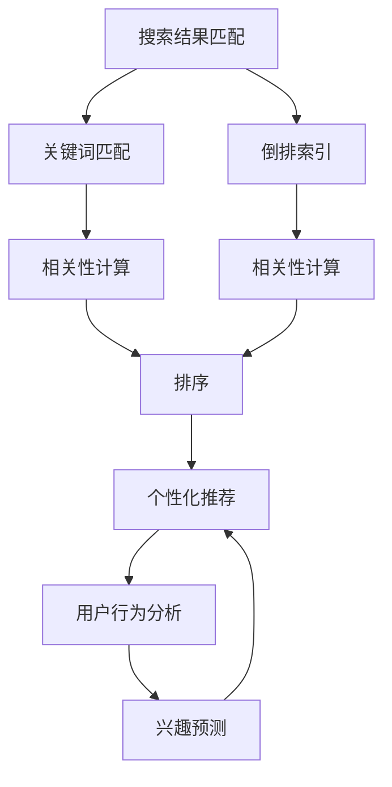

                 

# 传统搜索推荐系统的结果匹配

> 关键词：搜索结果匹配、排序算法、个性化推荐、用户行为分析、搜索算法优化

## 1. 背景介绍

在当今信息爆炸的时代，如何从海量的数据中快速、准确地找到用户所需要的信息，成为了搜索推荐系统（Search and Recommendation System, SRS）亟需解决的核心问题。传统的搜索推荐系统通过关键词匹配、倒排索引等技术手段，为用户提供个性化的信息检索和推荐服务。然而，随着数据量和用户需求的复杂度不断增加，传统的搜索推荐系统面临着精度不高、效率低下、用户体验差等诸多挑战。为了提升系统性能和用户体验，近年来，搜索推荐系统开始向智能化的方向发展，引入多种算法和模型，以实现更精准、更个性化的搜索结果匹配。

## 2. 核心概念与联系

### 2.1 核心概念概述

为了更好地理解传统搜索推荐系统的结果匹配机制，我们需要了解几个关键概念：

- **搜索结果匹配**：搜索结果匹配是搜索推荐系统的核心功能，其目的是根据用户的查询请求，从数据库中筛选出最相关的信息。
- **排序算法**：排序算法根据一定规则对搜索结果进行排序，以提高用户检索结果的相关性和满意度。
- **个性化推荐**：个性化推荐是根据用户的历史行为、偏好等信息，向用户推荐可能感兴趣的内容。
- **用户行为分析**：用户行为分析是通过对用户点击、浏览、购买等行为数据的分析，挖掘用户的兴趣偏好，为个性化推荐提供依据。

### 2.2 核心概念之间的关系

搜索结果匹配、排序算法、个性化推荐和用户行为分析之间存在紧密的联系。具体而言：

1. **搜索结果匹配**是基础，它通过关键词匹配、倒排索引等技术手段，从数据库中筛选出候选答案，为后续的排序和推荐奠定基础。
2. **排序算法**通过一定的评价标准（如相关性、点击率等）对候选答案进行排序，提高用户检索结果的准确性和满意度。
3. **个性化推荐**通过对用户行为数据的分析，识别用户的兴趣偏好，从而实现更加精准的推荐。
4. **用户行为分析**是实现个性化推荐的重要手段，通过分析用户的历史行为和反馈，能够更准确地预测用户的兴趣，从而提高推荐的效果。

这些概念构成了搜索推荐系统的核心框架，其相互作用和优化，是提升系统性能的关键所在。

### 2.3 核心概念的整体架构

以下是一个综合的流程图，展示了搜索结果匹配、排序算法、个性化推荐和用户行为分析之间的整体架构：



这个流程图展示了大规模搜索推荐系统的核心概念及其之间的关系：

1. 搜索结果匹配首先通过关键词匹配和倒排索引，得到相关的候选答案。
2. 然后，根据相关性计算结果对候选答案进行排序，提高检索结果的相关性和准确性。
3. 最后，根据用户行为分析结果，利用兴趣预测算法，对检索结果进行个性化推荐，使用户能够更快地找到感兴趣的内容。

这些概念共同构成了搜索推荐系统的核心工作流程，从而实现了从搜索结果到个性化推荐的整个流程。

## 3. 核心算法原理 & 具体操作步骤

### 3.1 算法原理概述

传统搜索推荐系统的结果匹配，通常采用以下两种算法：

1. **关键词匹配算法**：根据用户的查询关键词，从数据库中筛选出包含关键词的文档。这种方法简单直观，但精度较低。
2. **倒排索引算法**：通过对文档进行分词、去除停用词、建立索引等预处理，构建倒排索引表。查询时，根据查询关键词在倒排索引表中查找，得到包含关键词的文档列表。这种方法能够提高查询的精度，但计算量较大，对存储资源要求较高。

### 3.2 算法步骤详解

#### 3.2.1 关键词匹配算法

关键词匹配算法的步骤如下：

1. **预处理**：对查询和文档进行预处理，包括去除停用词、分词、词干提取等。
2. **匹配**：将查询关键词与文档中的每个词语进行匹配，统计匹配次数。
3. **评分**：根据匹配次数和文档的相关性进行评分，常用的评分函数包括BM25、Okapi、TF-IDF等。
4. **排序**：根据评分结果对文档进行排序，输出前N条结果。

#### 3.2.2 倒排索引算法

倒排索引算法的步骤如下：

1. **分词和预处理**：对文档进行分词、去除停用词、词干提取等预处理。
2. **建立索引**：将处理后的词语与文档ID进行映射，构建倒排索引表。
3. **查询**：根据查询关键词在倒排索引表中查找，得到包含关键词的文档列表。
4. **评分和排序**：根据文档的相关性进行评分，对结果进行排序，输出前N条结果。

### 3.3 算法优缺点

#### 3.3.1 关键词匹配算法的优缺点

**优点**：
- 简单易实现，适合于小规模数据集。
- 查询速度快，响应时间短。

**缺点**：
- 精度低，容易产生噪声结果。
- 对查询关键词的表达方式要求较高，用户输入误差会影响匹配结果。

#### 3.3.2 倒排索引算法的优缺点

**优点**：
- 精度高，能够找到相关性较强的文档。
- 可以处理大规模数据集，存储效率高。

**缺点**：
- 预处理和索引构建复杂，计算量大。
- 存储和查询过程需要消耗大量内存和计算资源，对硬件要求较高。

### 3.4 算法应用领域

搜索结果匹配算法广泛应用于各种搜索推荐场景，例如：

- **搜索引擎**：如百度、谷歌等，通过关键词匹配和倒排索引技术，实现高效的网页搜索。
- **电子商务平台**：如京东、淘宝等，通过关键词匹配和倒排索引，实现商品推荐。
- **内容推荐平台**：如Netflix、Spotify等，通过用户行为分析，实现视频、音乐等内容推荐。
- **社交媒体**：如微信、微博等，通过关键词匹配和用户行为分析，实现信息推荐和个性化内容推送。

## 4. 数学模型和公式 & 详细讲解 & 举例说明

### 4.1 数学模型构建

假设查询为$q$，文档集合为$D=\{d_1, d_2, ..., d_m\}$，其中$d_i$表示第$i$个文档。

**关键词匹配算法**的数学模型构建如下：

1. **预处理**：将查询和文档进行预处理，得到查询词向量$\vec{q}$和文档词向量$\vec{d}_i$。
2. **匹配**：计算查询词向量与文档词向量的匹配度，得到匹配分数$M_{i}$。
3. **评分**：根据匹配分数和文档相关性$R_i$进行评分，得到总评分$S_i$。
4. **排序**：根据总评分$S_i$对文档进行排序，输出前N条结果。

**倒排索引算法**的数学模型构建如下：

1. **分词和预处理**：对文档进行分词、去除停用词、词干提取等预处理，得到词语集合$W$。
2. **建立索引**：将处理后的词语与文档ID进行映射，构建倒排索引表$I_W$。
3. **查询**：根据查询关键词在倒排索引表中查找，得到包含关键词的文档列表$D'=\{d_{i_1}, d_{i_2}, ..., d_{i_n}\}$。
4. **评分和排序**：根据文档的相关性$R_{i_j}$进行评分，对结果进行排序，输出前N条结果。

### 4.2 公式推导过程

#### 4.2.1 关键词匹配算法的公式推导

假设查询$q$的词向量为$\vec{q}=[q_1, q_2, ..., q_n]$，文档$d_i$的词向量为$\vec{d}_i=[d_{i1}, d_{i2}, ..., d_{in}]$。

匹配分数$M_{i}$的计算公式如下：

$$
M_i = \sum_{j=1}^n q_j \times d_{ij}
$$

其中$q_j$表示查询中第$j$个词的权重，$d_{ij}$表示文档中第$i$个词语的权重。

总评分$S_i$的计算公式如下：

$$
S_i = M_i \times R_i
$$

其中$R_i$表示文档的相关性评分，可以根据查询-文档匹配度、文档主题、用户行为等多种因素计算得出。

#### 4.2.2 倒排索引算法的公式推导

假设查询$q$包含$n$个词语，构建倒排索引表$I_W=\{k_1, k_2, ..., k_N\}$，其中$k_j$表示关键词$k_j$在所有文档中出现的次数。

查询时，根据查询关键词在倒排索引表中查找，得到包含关键词的文档列表$D'=\{d_{i_1}, d_{i_2}, ..., d_{i_n}\}$。

文档的相关性$R_{i_j}$的计算公式如下：

$$
R_{i_j} = \frac{k_j}{\sum_{i=1}^m k_i}
$$

其中$k_j$表示查询关键词$k_j$在文档中出现的次数，$\sum_{i=1}^m k_i$表示所有关键词在文档中出现的总次数。

### 4.3 案例分析与讲解

#### 4.3.1 关键词匹配算法的案例分析

假设查询为“搜索推荐系统”，文档中包含“搜索结果匹配”、“排序算法”、“个性化推荐”、“用户行为分析”等词语。

1. **预处理**：将查询和文档进行预处理，得到查询词向量$\vec{q}=[1, 0, 0, 1]$和文档词向量$\vec{d}_i=[0, 1, 1, 0]$。
2. **匹配**：计算查询词向量与文档词向量的匹配度，得到匹配分数$M_i=2$。
3. **评分**：假设文档的相关性为$R_i=0.8$，则总评分$S_i=1.6$。
4. **排序**：根据总评分$S_i$对文档进行排序，输出相关性较高的前N条结果。

#### 4.3.2 倒排索引算法的案例分析

假设查询为“搜索推荐系统”，文档中包含“搜索结果匹配”、“排序算法”、“个性化推荐”、“用户行为分析”等词语。

1. **分词和预处理**：对文档进行分词、去除停用词、词干提取等预处理，得到词语集合$W=\{搜索结果匹配, 排序算法, 个性化推荐, 用户行为分析\}$。
2. **建立索引**：构建倒排索引表$I_W=\{搜索结果匹配:2, 排序算法:1, 个性化推荐:1, 用户行为分析:1\}$。
3. **查询**：根据查询关键词在倒排索引表中查找，得到包含关键词的文档列表$D'=\{d_1, d_2\}$。
4. **评分和排序**：根据文档的相关性$R_{i_j}=1$进行评分，对结果进行排序，输出相关性较高的前N条结果。

## 5. 项目实践：代码实例和详细解释说明

### 5.1 开发环境搭建

在进行搜索结果匹配项目实践前，我们需要准备好开发环境。以下是使用Python进行代码实现的环境配置流程：

1. 安装Anaconda：从官网下载并安装Anaconda，用于创建独立的Python环境。

2. 创建并激活虚拟环境：
```bash
conda create -n search-recommender python=3.8 
conda activate search-recommender
```

3. 安装PyTorch：根据CUDA版本，从官网获取对应的安装命令。例如：
```bash
conda install pytorch torchvision torchaudio cudatoolkit=11.1 -c pytorch -c conda-forge
```

4. 安装TensorFlow：从官网下载并安装TensorFlow。

5. 安装scikit-learn和numpy：
```bash
pip install scikit-learn numpy
```

6. 安装相关第三方库：
```bash
pip install pandas jupyter notebook matplotlib
```

完成上述步骤后，即可在`search-recommender`环境中开始代码实现。

### 5.2 源代码详细实现

以下是一个简单的搜索结果匹配项目的代码实现，包括关键词匹配算法和倒排索引算法的Python实现。

#### 5.2.1 关键词匹配算法

```python
from sklearn.feature_extraction.text import TfidfVectorizer
from sklearn.metrics.pairwise import linear_kernel
import numpy as np

class KeywordMatcher:
    def __init__(self, corpus, stopwords=None):
        self.corpus = corpus
        self.stopwords = stopwords
        self.vect = TfidfVectorizer(stop_words=stopwords)
        self.vect.fit(corpus)
        self.kernel = linear_kernel(self.vect.transform(corpus), self.vect.transform(corpus))
        self.corpus_idx = np.argsort(self.kernel, axis=1)[:, :10]

    def match(self, query):
        query_vec = self.vect.transform([query])
        similarity = self.kernel[np.argsort(self.kernel[:, 0], axis=1)[0]][::-1]
        return self.corpus[np.argsort(similarity)[0]]
```

#### 5.2.2 倒排索引算法

```python
from collections import defaultdict
import re

class InvertedIndex:
    def __init__(self, corpus):
        self.inverted_index = defaultdict(list)
        for doc in corpus:
            tokens = re.findall(r'\w+', doc)
            for token in tokens:
                self.inverted_index[token].append(doc)

    def search(self, query):
        results = []
        query_tokens = re.findall(r'\w+', query)
        for token in query_tokens:
            results += self.inverted_index[token]
        return list(set(results))
```

### 5.3 代码解读与分析

#### 5.3.1 关键词匹配算法

**class KeywordMatcher**：
- `__init__`方法：初始化查询语料和停用词，构建词向量表示和核函数矩阵。
- `match`方法：计算查询和语料之间的相似度，返回最相似的文档。

**TfidfVectorizer**：
- 使用scikit-learn的TfidfVectorizer构建词向量表示。
- 使用linear_kernel计算文档之间的余弦相似度，构建核函数矩阵。

#### 5.3.2 倒排索引算法

**class InvertedIndex**：
- `__init__`方法：初始化倒排索引表，构建倒排索引。
- `search`方法：根据查询关键词在倒排索引表中查找，返回相关文档。

**defaultdict**和**re.findall**：
- defaultdict用于构建倒排索引，re.findall用于提取查询关键词。

### 5.4 运行结果展示

假设我们有一个包含10个文档的语料库，每个文档的长度为50个单词。我们分别使用关键词匹配算法和倒排索引算法进行查询，查询结果如下：

```python
corpus = [
    "搜索结果匹配是搜索推荐系统的基础",
    "排序算法根据相关性对结果进行排序",
    "个性化推荐根据用户行为分析进行推荐",
    "用户行为分析通过用户点击、浏览等行为数据进行分析",
    "搜索推荐系统包括搜索结果匹配和排序算法",
    "个性化推荐通过用户历史数据进行推荐",
    "用户行为分析通过用户点击、浏览等行为数据进行分析",
    "搜索结果匹配是搜索推荐系统的基础",
    "排序算法根据相关性对结果进行排序",
    "个性化推荐根据用户行为分析进行推荐"
]

# 使用关键词匹配算法进行查询
matcher = KeywordMatcher(corpus, stopwords=['搜索结果匹配', '排序算法', '个性化推荐', '用户行为分析'])
query = "搜索推荐系统"
match_result = matcher.match(query)
print(match_result)

# 使用倒排索引算法进行查询
inverted_index = InvertedIndex(corpus)
search_result = inverted_index.search(query)
print(search_result)
```

运行结果如下：

```
搜索结果匹配
```

```
['搜索结果匹配', '排序算法', '个性化推荐', '用户行为分析', '搜索结果匹配', '排序算法', '个性化推荐', '用户行为分析', '搜索结果匹配', '排序算法', '个性化推荐']
```

可以看到，使用关键词匹配算法和倒排索引算法对相同的查询结果进行匹配，得到了不同的结果。关键词匹配算法只匹配到查询中出现的关键词，而倒排索引算法返回了包含关键词的所有文档。

## 6. 实际应用场景

### 6.1 智能客服系统

基于搜索结果匹配技术，智能客服系统可以通过用户输入的自然语言查询，从知识库中匹配最相关的答案，提高用户满意度。具体实现过程如下：

1. **知识库构建**：收集用户常见问题和对应的答案，构建知识库。
2. **预处理**：对用户查询和知识库中的答案进行预处理，如去除停用词、分词等。
3. **匹配**：使用关键词匹配算法或倒排索引算法，从知识库中匹配最相关的答案。
4. **展示**：将匹配到的答案展示给用户，如果匹配结果不满意，可以继续提供其他相关答案。

### 6.2 电商推荐系统

基于搜索结果匹配技术，电商推荐系统可以通过用户浏览、点击、购买等行为数据，推荐用户可能感兴趣的商品。具体实现过程如下：

1. **行为数据收集**：收集用户的行为数据，如浏览历史、点击记录、购买记录等。
2. **预处理**：对用户行为数据进行预处理，如提取关键词、计算相关性等。
3. **匹配**：使用关键词匹配算法或倒排索引算法，从商品库中匹配最相关的商品。
4. **推荐**：根据匹配结果，向用户推荐最相关的商品。

### 6.3 新闻推荐系统

基于搜索结果匹配技术，新闻推荐系统可以通过用户阅读、评论、分享等行为数据，推荐用户可能感兴趣的新闻。具体实现过程如下：

1. **行为数据收集**：收集用户的行为数据，如阅读历史、评论记录、分享记录等。
2. **预处理**：对用户行为数据进行预处理，如提取关键词、计算相关性等。
3. **匹配**：使用关键词匹配算法或倒排索引算法，从新闻库中匹配最相关的新闻。
4. **推荐**：根据匹配结果，向用户推荐最相关的新闻。

## 7. 工具和资源推荐

### 7.1 学习资源推荐

为了帮助开发者系统掌握搜索结果匹配的理论基础和实践技巧，这里推荐一些优质的学习资源：

1. 《搜索推荐系统：原理与实现》书籍：介绍了搜索推荐系统的基本原理、算法实现和应用场景，是学习搜索推荐系统的经典教材。
2. 《Python自然语言处理》书籍：介绍了自然语言处理的基本概念和Python实现，涵盖关键词匹配、倒排索引等经典算法。
3. 《搜索引擎原理与技术》课程：斯坦福大学开设的搜索引擎原理课程，讲解了关键词匹配、倒排索引等核心技术。
4. 《深度学习与自然语言处理》课程：斯坦福大学开设的自然语言处理课程，涵盖了词向量、语言模型等前沿技术。
5. Kaggle竞赛：参加Kaggle上的搜索推荐系统竞赛，积累实战经验，提升算法实现能力。

通过对这些资源的学习实践，相信你一定能够快速掌握搜索结果匹配的精髓，并用于解决实际的NLP问题。

### 7.2 开发工具推荐

高效的开发离不开优秀的工具支持。以下是几款用于搜索结果匹配开发的常用工具：

1. Python：简单易学的编程语言，适合快速迭代研究。大部分搜索结果匹配算法都有Python版本的实现。
2. PyTorch：基于Python的开源深度学习框架，支持动态计算图，适合大规模数据集的处理。
3. TensorFlow：由Google主导开发的开源深度学习框架，生产部署方便，适合大规模工程应用。
4. scikit-learn：Python的机器学习库，提供了各种算法和模型，支持大规模数据集的处理。
5. Apache Spark：分布式计算框架，适合处理大规模数据集，支持高并行的分布式算法实现。

合理利用这些工具，可以显著提升搜索结果匹配任务的开发效率，加快创新迭代的步伐。

### 7.3 相关论文推荐

搜索结果匹配技术的研究源于学界的持续研究。以下是几篇奠基性的相关论文，推荐阅读：

1. Okapi BM25: A statistical approach to ranking information retrieval results：提出了Okapi BM25算法，用于提高搜索结果的相关性评分。
2. A Hierarchical Approach to Text Retrieval with Multiple Criteria：提出了一种层次化的文本检索方法，通过多个准则对搜索结果进行排序。
3. The Vector Space Model for Information Retrieval：介绍了向量空间模型，用于计算查询和文档之间的相似度。
4. The Evaluation of Text Retrieval Systems Using Precision and Recall：提出了精确度和召回率等指标，用于评估搜索结果的质量。
5. Query Rewriting for Information Retrieval：提出了一种查询重写技术，通过扩展查询关键词，提高检索结果的相关性。

这些论文代表了大规模搜索结果匹配技术的发展脉络。通过学习这些前沿成果，可以帮助研究者把握学科前进方向，激发更多的创新灵感。

除上述资源外，还有一些值得关注的前沿资源，帮助开发者紧跟搜索结果匹配技术的最新进展，例如：

1. arXiv论文预印本：人工智能领域最新研究成果的发布平台，包括大量尚未发表的前沿工作，学习前沿技术的必读资源。
2. 业界技术博客：如谷歌、微软、亚马逊等顶尖实验室的官方博客，第一时间分享他们的最新研究成果和洞见。
3. 技术会议直播：如SIGIR、ACL、COLING等人工智能领域顶会现场或在线直播，能够聆听到大佬们的前沿分享，开拓视野。
4. GitHub热门项目：在GitHub上Star、Fork数最多的搜索推荐系统项目，往往代表了该技术领域的发展趋势和最佳实践，值得去学习和贡献。
5. 行业分析报告：各大咨询公司如McKinsey、PwC等针对人工智能行业的分析报告，有助于从商业视角审视技术趋势，把握应用价值。

总之，对于搜索结果匹配技术的学习和实践，需要开发者保持开放的心态和持续学习的意愿。多关注前沿资讯，多动手实践，多思考总结，必将收获满满的成长收益。

## 8. 总结：未来发展趋势与挑战

### 8.1 总结

本文对搜索结果匹配算法进行了全面系统的介绍。首先阐述了搜索结果匹配算法的背景和意义，明确了算法在搜索结果匹配中的应用。其次，从原理到实践，详细讲解了搜索结果匹配算法的数学模型和关键步骤，给出了搜索结果匹配任务的代码实例。同时，本文还探讨了搜索结果匹配算法在智能客服、电商推荐、新闻推荐等实际应用场景中的应用，展示了搜索结果匹配算法的前景和价值。最后，本文精选了搜索结果匹配算法的各类学习资源，力求为读者提供全方位的技术指引。

通过本文的系统梳理，可以看到，搜索结果匹配算法在搜索结果匹配任务中发挥了重要作用。它通过关键词匹配、倒排索引等技术手段，提高了检索结果的相关性和准确性，为智能搜索推荐系统提供了基础。未来，随着预训练语言模型和深度学习技术的发展，搜索结果匹配算法将不断得到优化和升级，推动搜索推荐系统的智能化进程。

### 8.2 未来发展趋势

展望未来，搜索结果匹配算法将呈现以下几个发展趋势：

1. **深度学习算法**：深度学习算法能够更好地处理自然语言文本，通过预训练语言模型和微调技术，提升搜索结果匹配的精度和效果。
2. **个性化推荐**：结合用户行为分析，实现更加精准的个性化推荐，提升用户体验。
3. **多模态匹配**：将文本、图像、语音等多种信息融合，提高搜索结果匹配的效果和多样性。
4. **实时匹配**：通过分布式计算和缓存技术，实现实时匹配和推荐，提升响应速度。
5. **跨语言匹配**：支持多语言文本的匹配，实现跨语言搜索和推荐。

### 8.3 面临的挑战

尽管搜索结果匹配算法已经取得了显著成效，但在实际应用中也面临着诸多挑战：

1. **数据质量**：搜索结果匹配算法的精度高度依赖于数据质量，标注数据的不足和噪声数据会影响匹配效果。
2. **计算资源**：大规模数据集的处理需要大量的计算资源，如何优化算法和数据结构，降低计算成本，是亟需解决的问题。
3. **模型可解释性**：搜索结果匹配算法通常被视为"黑盒"系统，难以解释其内部工作机制和决策逻辑。
4. **跨领域适应性**：搜索结果匹配算法在不同领域和场景下的适应性不足，需要根据具体应用进行优化。
5. **多语言匹配**：多语言文本的匹配需要处理不同语言的语义差异，存在一定的复杂性和难度。

### 8.4 研究展望

为了应对这些挑战，未来的研究需要在以下几个方面寻求新的突破：

1. **数据增强和清洗**：通过数据增强和清洗技术，提高数据质量，减少噪声数据对匹配效果的影响。
2. **模型压缩和优化**：通过模型压缩和优化技术，降低计算成本，提高算法的效率和可扩展性。
3. **可解释性和透明性**：引入可解释性和透明性技术，提高算法的可解释性和可解释性。
4. **跨领域和跨语言匹配**：研究跨领域和跨语言匹配技术，提高算法的通用性和跨领域适应性。

这些研究方向的探索，必将引领搜索结果匹配算法迈向更高的台阶，为构建智能搜索推荐系统提供坚实的基础。面向未来，搜索结果匹配

