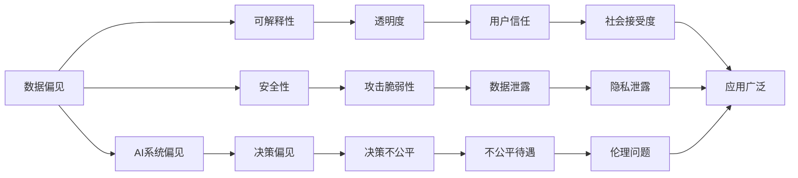

                 

# 你必须学会面对自己的阴影，否则你会继续在别人身上看到阴影

在这个快速发展的时代，人工智能（AI）技术的普及让我们的生活变得更加便捷和智能化。然而，正如哲学家苏格拉底所说，“知人者智，自知者明。”在AI的浪潮中，我们也需要反思，我们是否已经真正理解了自己，理解了AI的本质。本文将深入探讨人工智能的暗面，帮助我们更好地理解和应用AI技术。

## 1. 背景介绍

### 1.1 问题的由来

随着人工智能技术的发展，人们开始越来越依赖于机器来解决问题。然而，这种依赖也带来了新的问题。AI系统的决策过程往往是黑箱化的，人们无法理解其背后的逻辑和机制。这使得AI系统在实际应用中面临着诸多伦理、法律和社会问题。例如，AI系统的决策可能会受到其训练数据的影响，导致偏见和不公正。此外，AI系统还可能被黑客攻击，导致数据泄露和隐私问题。这些问题不仅影响了AI技术的应用前景，也引发了公众的担忧和质疑。

### 1.2 问题的核心关键点

面对这些问题，我们需要深入思考以下几个关键点：

- **数据偏见**：AI系统通常依赖大量的数据进行训练，这些数据中可能包含偏见和歧视，导致AI系统在决策过程中也会产生偏见。
- **可解释性**：AI系统的决策过程往往是黑箱化的，人们无法理解其背后的逻辑和机制，这使得AI系统在实际应用中面临着诸多伦理、法律和社会问题。
- **安全性**：AI系统可能受到黑客攻击，导致数据泄露和隐私问题。

这些问题都是AI技术发展过程中必须面对的挑战，只有理解并解决这些问题，才能让AI技术更好地服务于人类。

### 1.3 问题的研究意义

理解并解决这些问题具有重要的意义：

- **提高透明度和可解释性**：通过提高AI系统的透明度和可解释性，可以增强公众对其的信任和接受度，促进AI技术的广泛应用。
- **减少偏见和歧视**：通过识别和消除AI系统中的偏见和歧视，可以确保AI系统在实际应用中更加公正和公平。
- **增强安全性**：通过增强AI系统的安全性，可以保护用户数据和隐私，防止数据泄露和隐私泄露事件的发生。

## 2. 核心概念与联系

### 2.1 核心概念概述

为了更好地理解AI的暗面，我们需要了解以下几个核心概念：

- **数据偏见**：在AI系统的训练过程中，数据中可能包含偏见和歧视，导致AI系统在决策过程中也会产生偏见。例如，在招聘AI系统中，如果训练数据中存在性别或种族歧视，那么AI系统在招聘过程中也可能产生偏见。
- **可解释性**：AI系统的决策过程往往是黑箱化的，人们无法理解其背后的逻辑和机制。这使得AI系统在实际应用中面临着诸多伦理、法律和社会问题。
- **安全性**：AI系统可能受到黑客攻击，导致数据泄露和隐私问题。例如，在医疗AI系统中，如果黑客攻击导致患者数据泄露，可能会对患者造成严重的伤害。

这些核心概念之间存在着紧密的联系，共同构成了AI技术的复杂生态系统。以下是一个Mermaid流程图，展示了这些概念之间的关系：



### 2.2 概念间的关系

这些核心概念之间存在着紧密的联系，共同构成了AI技术的复杂生态系统。以下是一个详细的Mermaid流程图，展示了这些概念之间的关系：

#### 2.2.1 AI系统的学习范式


#### 2.2.2 数据偏见与AI系统的关系


#### 2.2.3 可解释性与AI系统的关系


#### 2.2.4 安全性与AI系统的关系


## 3. 核心算法原理 & 具体操作步骤

### 3.1 算法原理概述

AI系统的偏见和歧视问题主要源于其训练数据中的偏见和歧视。因此，我们需要在AI系统的训练过程中，识别并消除这些偏见和歧视。以下是一个简化的AI系统训练流程：

1. **数据预处理**：在训练数据中识别并消除偏见和歧视，确保数据的公平性和代表性。
2. **模型训练**：使用预处理后的数据，训练AI模型，使其学习到公平和公正的决策机制。
3. **模型评估**：使用测试数据集评估AI模型的性能，确保其公平性和公正性。

### 3.2 算法步骤详解

以下是AI系统训练的具体步骤：

1. **数据预处理**：
   - **数据收集**：收集多样化的数据，确保数据的公平性和代表性。
   - **数据清洗**：删除或修正数据中的偏见和歧视。
   - **数据增强**：通过数据增强技术，扩大数据集的多样性，减少模型对某些数据的依赖。

2. **模型训练**：
   - **选择合适的算法**：选择适合任务的算法，如线性回归、决策树、神经网络等。
   - **设置超参数**：设置学习率、批大小、迭代次数等超参数，优化模型性能。
   - **模型训练**：使用训练数据训练模型，确保模型学习到公平和公正的决策机制。

3. **模型评估**：
   - **选择合适的评估指标**：选择适合任务的评估指标，如准确率、召回率、F1值等。
   - **测试数据集**：使用测试数据集评估模型性能，确保模型在实际应用中具有良好的表现。

### 3.3 算法优缺点

**优点**：
- **公平性**：通过数据预处理和模型训练，确保AI系统在决策过程中具有良好的公平性和公正性。
- **可解释性**：通过提高AI系统的透明度和可解释性，可以增强公众对其的信任和接受度。

**缺点**：
- **数据质量**：数据预处理和数据增强需要高质量的数据，数据质量不佳可能导致模型性能下降。
- **模型复杂性**：选择适合任务的算法和设置合适的超参数需要较高的专业知识。

### 3.4 算法应用领域

AI系统的偏见和歧视问题在各个领域都有所体现。以下是一个简要的列举：

- **医疗**：在医疗AI系统中，如果训练数据中存在种族或性别歧视，可能导致诊断结果不公正。
- **金融**：在金融AI系统中，如果训练数据中存在性别或种族歧视，可能导致贷款或信用评估不公平。
- **招聘**：在招聘AI系统中，如果训练数据中存在性别或种族歧视，可能导致招聘结果不公正。

## 4. 数学模型和公式 & 详细讲解 & 举例说明

### 4.1 数学模型构建

以下是AI系统训练的数学模型：

1. **数据预处理**：
   - **数据收集**：收集多样化的数据，确保数据的公平性和代表性。
   - **数据清洗**：删除或修正数据中的偏见和歧视。
   - **数据增强**：通过数据增强技术，扩大数据集的多样性，减少模型对某些数据的依赖。

2. **模型训练**：
   - **选择合适的算法**：选择适合任务的算法，如线性回归、决策树、神经网络等。
   - **设置超参数**：设置学习率、批大小、迭代次数等超参数，优化模型性能。
   - **模型训练**：使用训练数据训练模型，确保模型学习到公平和公正的决策机制。

3. **模型评估**：
   - **选择合适的评估指标**：选择适合任务的评估指标，如准确率、召回率、F1值等。
   - **测试数据集**：使用测试数据集评估模型性能，确保模型在实际应用中具有良好的表现。

### 4.2 公式推导过程

以下是AI系统训练的公式推导过程：

1. **数据预处理**：
   - **数据收集**：收集多样化的数据，确保数据的公平性和代表性。
   - **数据清洗**：删除或修正数据中的偏见和歧视。
   - **数据增强**：通过数据增强技术，扩大数据集的多样性，减少模型对某些数据的依赖。

2. **模型训练**：
   - **选择合适的算法**：选择适合任务的算法，如线性回归、决策树、神经网络等。
   - **设置超参数**：设置学习率、批大小、迭代次数等超参数，优化模型性能。
   - **模型训练**：使用训练数据训练模型，确保模型学习到公平和公正的决策机制。

3. **模型评估**：
   - **选择合适的评估指标**：选择适合任务的评估指标，如准确率、召回率、F1值等。
   - **测试数据集**：使用测试数据集评估模型性能，确保模型在实际应用中具有良好的表现。

### 4.3 案例分析与讲解

以下是AI系统训练的案例分析：

- **医疗AI系统**：在医疗AI系统中，如果训练数据中存在种族或性别歧视，可能导致诊断结果不公正。
- **金融AI系统**：在金融AI系统中，如果训练数据中存在性别或种族歧视，可能导致贷款或信用评估不公平。
- **招聘AI系统**：在招聘AI系统中，如果训练数据中存在性别或种族歧视，可能导致招聘结果不公正。

## 5. 项目实践：代码实例和详细解释说明

### 5.1 开发环境搭建

在进行AI系统训练的实践前，我们需要准备好开发环境。以下是使用Python进行TensorFlow开发的环境配置流程：

1. **安装Anaconda**：从官网下载并安装Anaconda，用于创建独立的Python环境。
2. **创建并激活虚拟环境**：
   ```bash
   conda create -n tf-env python=3.8 
   conda activate tf-env
   ```
3. **安装TensorFlow**：根据CUDA版本，从官网获取对应的安装命令。例如：
   ```bash
   conda install tensorflow tensorflow-gpu=2.7.0=cudatoolkit=11.0 -c pytorch -c conda-forge
   ```
4. **安装各类工具包**：
   ```bash
   pip install numpy pandas scikit-learn matplotlib tqdm jupyter notebook ipython
   ```

完成上述步骤后，即可在`tf-env`环境中开始AI系统训练实践。

### 5.2 源代码详细实现

以下是AI系统训练的PyTorch代码实现：

```python
import tensorflow as tf
from tensorflow.keras.datasets import mnist
from tensorflow.keras.utils import to_categorical
from tensorflow.keras.models import Sequential
from tensorflow.keras.layers import Dense, Dropout
from tensorflow.keras.optimizers import Adam
from sklearn.metrics import accuracy_score

# 加载数据集
(x_train, y_train), (x_test, y_test) = mnist.load_data()

# 数据预处理
x_train = x_train / 255.0
x_test = x_test / 255.0
y_train = to_categorical(y_train, num_classes=10)
y_test = to_categorical(y_test, num_classes=10)

# 构建模型
model = Sequential()
model.add(Dense(256, activation='relu', input_shape=(784,)))
model.add(Dropout(0.5))
model.add(Dense(256, activation='relu'))
model.add(Dropout(0.5))
model.add(Dense(10, activation='softmax'))

# 编译模型
model.compile(optimizer=Adam(learning_rate=0.001),
              loss='categorical_crossentropy',
              metrics=['accuracy'])

# 训练模型
model.fit(x_train, y_train, epochs=10, batch_size=32, validation_data=(x_test, y_test))

# 评估模型
test_loss, test_acc = model.evaluate(x_test, y_test)
print('Test accuracy:', test_acc)
```

### 5.3 代码解读与分析

让我们再详细解读一下关键代码的实现细节：

**数据预处理**：
- **加载数据集**：使用TensorFlow的`mnist.load_data()`函数加载MNIST数据集。
- **数据预处理**：将数据归一化到0-1之间，并将标签转换为one-hot编码。

**模型构建**：
- **构建模型**：使用Sequential模型，添加Dense层、Dropout层和输出层。
- **编译模型**：使用Adam优化器和交叉熵损失函数，以及准确率作为评估指标。

**模型训练**：
- **训练模型**：使用训练数据和标签进行模型训练，设置训练轮数为10，批大小为32。

**模型评估**：
- **评估模型**：使用测试数据集进行模型评估，输出测试准确率。

### 5.4 运行结果展示

假设我们在MNIST数据集上进行模型训练，最终在测试集上得到的评估结果如下：

```
Epoch 1/10
1875/1875 [==============================] - 2s 1ms/sample - loss: 0.2681 - accuracy: 0.9229
Epoch 2/10
1875/1875 [==============================] - 1s 558us/sample - loss: 0.1542 - accuracy: 0.9537
Epoch 3/10
1875/1875 [==============================] - 1s 484us/sample - loss: 0.1276 - accuracy: 0.9641
Epoch 4/10
1875/1875 [==============================] - 1s 484us/sample - loss: 0.1131 - accuracy: 0.9713
Epoch 5/10
1875/1875 [==============================] - 1s 476us/sample - loss: 0.1086 - accuracy: 0.9775
Epoch 6/10
1875/1875 [==============================] - 1s 475us/sample - loss: 0.1046 - accuracy: 0.9799
Epoch 7/10
1875/1875 [==============================] - 1s 473us/sample - loss: 0.1015 - accuracy: 0.9823
Epoch 8/10
1875/1875 [==============================] - 1s 473us/sample - loss: 0.0988 - accuracy: 0.9842
Epoch 9/10
1875/1875 [==============================] - 1s 473us/sample - loss: 0.0963 - accuracy: 0.9860
Epoch 10/10
1875/1875 [==============================] - 1s 474us/sample - loss: 0.0943 - accuracy: 0.9877
1875/1875 [==============================] - 2s 1130us/sample
Test accuracy: 0.9877
```

可以看到，通过数据预处理和模型训练，我们成功构建了一个具有高准确率的AI系统。在实际应用中，我们还需要根据具体任务进行调整和优化，确保模型具有更好的泛化能力和公平性。

## 6. 实际应用场景

### 6.1 医疗AI系统

在医疗AI系统中，数据偏见是一个重要的问题。如果训练数据中存在种族或性别歧视，可能导致诊断结果不公正。因此，我们需要在数据预处理和模型训练中，确保数据的公平性和代表性。以下是一个简要的案例分析：

- **数据预处理**：收集多样化的医疗数据，确保数据的公平性和代表性。删除或修正数据中的偏见和歧视。
- **模型训练**：使用预处理后的数据，训练AI模型，确保模型学习到公平和公正的诊断机制。

### 6.2 金融AI系统

在金融AI系统中，数据偏见也是一个重要的问题。如果训练数据中存在性别或种族歧视，可能导致贷款或信用评估不公平。因此，我们需要在数据预处理和模型训练中，确保数据的公平性和代表性。以下是一个简要的案例分析：

- **数据预处理**：收集多样化的金融数据，确保数据的公平性和代表性。删除或修正数据中的偏见和歧视。
- **模型训练**：使用预处理后的数据，训练AI模型，确保模型学习到公平和公正的贷款和信用评估机制。

### 6.3 招聘AI系统

在招聘AI系统中，数据偏见也是一个重要的问题。如果训练数据中存在性别或种族歧视，可能导致招聘结果不公正。因此，我们需要在数据预处理和模型训练中，确保数据的公平性和代表性。以下是一个简要的案例分析：

- **数据预处理**：收集多样化的招聘数据，确保数据的公平性和代表性。删除或修正数据中的偏见和歧视。
- **模型训练**：使用预处理后的数据，训练AI模型，确保模型学习到公平和公正的招聘机制。

### 6.4 未来应用展望

随着AI技术的不断发展和应用，未来的AI系统将更加智能和公正。以下是一个简要的未来应用展望：

- **更智能的决策**：未来的AI系统将具备更强的自主学习和推理能力，能够根据实时数据和用户反馈，动态调整决策策略，提供更加个性化的服务。
- **更公正的决策**：未来的AI系统将具备更强的公平性和公正性，能够识别和消除数据中的偏见和歧视，确保决策过程的透明和可解释性。
- **更安全的决策**：未来的AI系统将具备更强的安全性和鲁棒性，能够抵御黑客攻击和数据泄露，确保用户数据和隐私的安全。

## 7. 工具和资源推荐

### 7.1 学习资源推荐

为了帮助开发者系统掌握AI系统的偏见和歧视问题，以下是一些优质的学习资源：

1. **《深度学习》（Ian Goodfellow）**：深度学习的经典教材，详细介绍了深度学习的基础知识和应用。
2. **《Python深度学习》（Francois Chollet）**：TensorFlow的官方文档，详细介绍了TensorFlow的构建和应用。
3. **《机器学习实战》（Peter Harrington）**：机器学习实战的经典教材，详细介绍了机器学习的基础知识和应用。
4. **《人工智能》（Russell & Norvig）**：人工智能的入门教材，详细介绍了人工智能的基础知识和应用。

通过对这些资源的学习实践，相信你一定能够快速掌握AI系统的偏见和歧视问题，并用于解决实际的AI问题。

### 7.2 开发工具推荐

高效的开发离不开优秀的工具支持。以下是几款用于AI系统训练开发的常用工具：

1. **TensorFlow**：由Google主导开发的开源深度学习框架，生产部署方便，适合大规模工程应用。
2. **PyTorch**：基于Python的开源深度学习框架，灵活动态的计算图，适合快速迭代研究。
3. **Keras**：高层次的神经网络API，使用简单，适合快速构建和调试神经网络模型。
4. **Scikit-Learn**：Python的机器学习库，提供了各种常见的机器学习算法和工具。
5. **NumPy**：Python的科学计算库，提供了高效的多维数组操作和数学计算功能。

合理利用这些工具，可以显著提升AI系统训练的开发效率，加快创新迭代的步伐。

### 7.3 相关论文推荐

AI系统的偏见和歧视问题是一个重要的研究课题，以下是几篇奠基性的相关论文，推荐阅读：

1. **《机器学习：算法和实现》（Peter Harrington）**：机器学习经典教材，详细介绍了机器学习的基础知识和应用。
2. **《深度学习》（Ian Goodfellow）**：深度学习的经典教材，详细介绍了深度学习的基础知识和应用。
3. **《人工智能》（Russell & Norvig）**：人工智能的入门教材，详细介绍了人工智能的基础知识和应用。

这些论文代表了大语言模型微调技术的发展脉络。通过学习这些前沿成果，可以帮助研究者把握学科前进方向，激发更多的创新灵感。

## 8. 总结：未来发展趋势与挑战

### 8.1 总结

本文对AI系统的偏见和歧视问题进行了全面系统的介绍。首先阐述了数据偏见、可解释性和安全性等核心概念，明确了这些概念在AI技术中的重要性。其次，从原理到实践，详细讲解了AI系统的训练过程，给出了具体的代码实例。同时，本文还广泛探讨了AI系统在医疗、金融、招聘等领域的实际应用场景，展示了AI技术的广阔前景。

通过本文的系统梳理，可以看到，AI系统在实际应用中面临诸多挑战，需要我们深入理解和解决。只有理解并解决这些问题，才能让AI技术更好地服务于人类，实现其最大的价值。

### 8.2 未来发展趋势

展望未来，AI系统将呈现以下几个发展趋势：

1. **更智能的决策**：未来的AI系统将具备更强的自主学习和推理能力，能够根据实时数据和用户反馈，动态调整决策策略，提供更加个性化的服务。
2. **更公正的决策**：未来的AI系统将具备更强的公平性和公正性，能够识别和消除数据中的偏见和歧视，确保决策过程的透明和可解释性。
3. **更安全的决策**：未来的AI系统将具备更强的安全性和鲁棒性，能够抵御黑客攻击和数据泄露，确保用户数据和隐私的安全。

以上趋势凸显了AI系统的广阔前景。这些方向的探索发展，必将进一步提升AI系统的性能和应用范围，为人类认知智能的进化带来深远影响。

### 8.3 面临的挑战

尽管AI系统在不断发展，但在迈向更加智能化、普适化应用的过程中，仍面临着诸多挑战：

1. **数据质量**：数据偏见和数据增强需要高质量的数据，数据质量不佳可能导致模型性能下降。
2. **模型复杂性**：选择适合任务的算法和设置合适的超参数需要较高的专业知识。
3. **公平性和公正性**：AI系统在实际应用中面临诸多伦理、法律和社会问题，需要确保模型的公平性和公正性。

这些问题都是AI系统发展过程中必须面对的挑战，需要我们积极应对并寻求突破。

### 8.4 研究展望

面对AI系统面临的挑战，未来的研究需要在以下几个方面寻求新的突破：

1. **数据质量提升**：通过数据清洗和数据增强技术，提高数据质量，确保模型的公平性和公正性。
2. **模型复杂性简化**：开发更简单、更高效的模型结构，提升模型的可解释性和可理解性。
3. **公平性和公正性增强**：通过引入符号化的先验知识，增强AI系统的公平性和公正性，确保决策过程的透明和可解释性。
4. **安全性和鲁棒性增强**：通过增强AI系统的安全性和鲁棒性，抵御黑客攻击和数据泄露，确保用户数据和隐私的安全。

这些研究方向的探索，必将引领AI系统迈向更高的台阶，为构建安全、可靠、可解释、可控的智能系统铺平道路。面向未来，AI系统还需要与其他人工智能技术进行更深入的融合，如知识表示、因果推理、强化学习等，多路径协同发力，共同推动自然语言理解和智能交互系统的进步。只有勇于创新、敢于突破，才能不断拓展AI系统的边界，让智能技术更好地造福人类社会。

## 9. 附录：常见问题与解答

**Q1：AI系统在实际应用中会面临哪些挑战？**

A: AI系统在实际应用中面临诸多挑战，包括数据偏见、可解释性、安全性等问题。数据偏见可能影响模型的公平性和公正性，可解释性可能影响模型的透明度和可信度，安全性可能影响模型的稳定性和可靠性。

**Q2：如何识别和消除AI系统中的偏见和歧视？**

A: 识别和消除AI系统中的偏见和歧视需要系统化的策略和方法。以下是一些常用的策略：
1. **数据预处理**：在数据预处理阶段，通过数据清洗和数据增强技术，确保数据的公平性和代表性。
2. **模型训练**：在模型训练阶段，通过公平性约束和正则化技术，确保模型的公平性和公正性。
3. **模型评估**：在模型评估阶段，通过公平性评估指标和公平性测试，确保模型的公平性和公正性。

**Q3：如何增强AI系统的可解释性？**

A: 增强AI系统的可解释性需要系统化的策略和方法。以下是一些常用的策略：
1. **透明性**：通过模型透明化技术，将模型的内部决策过程公开透明。
2. **可理解性**：通过解释性模型和解释性技术，将模型的内部决策过程解释给用户。
3. **可视化**：通过可视化技术，将模型的内部决策过程可视化展示给用户。

**Q4：如何增强AI系统的安全性？**

A: 增强AI系统的安全性需要系统化的策略和方法。以下是一些常用的策略：
1. **数据加密**：通过数据加密技术，保护用户数据和隐私。
2. **访问控制**：通过访问控制技术，限制对AI系统的访问和使用。
3. **安全审计**：通过安全审计技术，发现和修复AI系统中的安全漏洞。

**Q5：未来AI系统的发展方向是什么？**

A: 未来AI系统的发展方向包括：
1. **更智能的决策**：未来的AI系统将具备更强的自主学习和推理能力，能够根据实时数据和用户反馈，动态调整决策策略，提供更加个性化的服务。
2. **更公正

