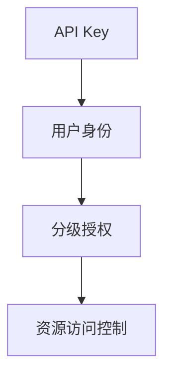
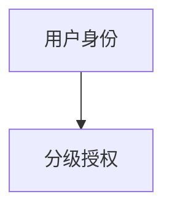
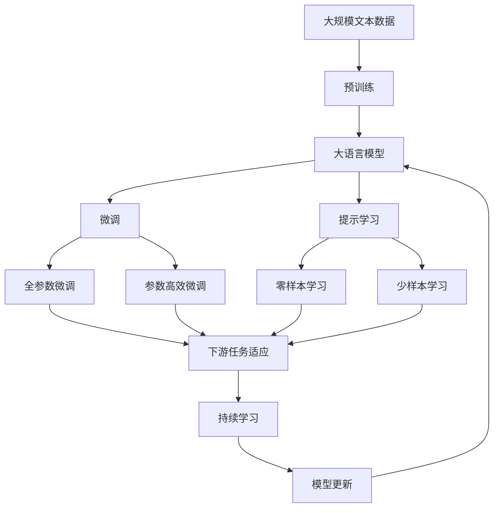

                 

# 使用分级 API Key 进行细粒度访问控制

在当今的互联网应用中，API Key 已经成为了常见的身份验证方式。通过 API Key，系统能够识别来访者的身份，从而保护资源不受未经授权的访问。然而，随着身份验证需求的日益复杂化，单一的 API Key 已难以满足所有场景的需求。分级 API Key（Levelized API Key）应运而生，它提供了更加细粒度的访问控制机制，从而在保证安全性的同时，提高了系统的灵活性和可用性。本文将深入探讨分级 API Key 的核心概念、实现原理、操作步骤及具体应用场景，希望能为您的系统设计提供有价值的参考。

## 1. 背景介绍

### 1.1 问题由来
随着互联网应用的发展，API Key 的使用场景日益广泛。然而，传统的 API Key 通常只能简单地识别用户的身份，无法细粒度地控制其对不同资源的访问权限。这种单一的访问控制方式，难以满足现代系统中多样化的安全需求。例如，某些系统需要在不同用户之间，甚至是同一用户的不同角色之间，实现不同的权限控制。分级 API Key 正是在这种背景下诞生的，它通过分级授权机制，为用户和资源提供了更加细粒度的访问控制能力。

### 1.2 问题核心关键点
分级 API Key 的核心在于通过分级授权，对用户的访问权限进行细粒度控制。具体而言，系统可以根据用户的身份和行为，授予其不同的访问权限。这些权限可以是对具体资源的读取、写入、删除等操作，也可以是按照角色的划分，对不同资源的操作进行限制。分级 API Key 的实现，需要考虑如何在保证系统安全性的同时，提供足够的灵活性和可扩展性，以适应多样化的访问控制需求。

### 1.3 问题研究意义
分级 API Key 的引入，可以显著提升系统的访问控制能力，增强系统的安全性和灵活性。具体而言，其研究意义体现在以下几个方面：

1. **增强安全性**：分级 API Key 通过细粒度的访问控制，能够有效防止未经授权的访问，保护系统的安全。
2. **提高灵活性**：分级 API Key 可以根据不同的用户角色和资源需求，灵活地调整访问权限，满足多样化的应用需求。
3. **优化性能**：分级 API Key 可以通过分级授权，减少无谓的资源访问，优化系统性能。
4. **简化管理**：分级 API Key 简化了身份验证和管理过程，降低了系统的复杂度。
5. **促进协作**：分级 API Key 支持团队协作，不同角色的成员可以按照权限进行分工协作，提高工作效率。

## 2. 核心概念与联系

### 2.1 核心概念概述

为了更好地理解分级 API Key 的工作原理和实现方法，本节将介绍几个密切相关的核心概念：

- **API Key**：用于验证用户身份的字符串，通常由一组字符构成，用于保护 API 资源。
- **分级授权（Levelized Authorization）**：根据用户的身份和行为，授予其不同的访问权限，这种权限可以是对具体资源的读取、写入、删除等操作，也可以是按照角色的划分，对不同资源的操作进行限制。
- **用户身份（User Identity）**：用于标识用户的基本信息，如用户名、邮箱、角色等。
- **资源访问控制（Resource Access Control）**：对系统资源进行访问控制的机制，确保只有授权用户才能访问特定资源。

这些核心概念之间的逻辑关系可以通过以下 Mermaid 流程图来展示：



这个流程图展示了 API Key、用户身份和资源访问控制之间的关系：

1. **API Key** 作为身份验证的凭证，用于标识用户。
2. **用户身份** 用于描述用户的基本信息，如用户名、邮箱、角色等。
3. **分级授权** 根据用户身份和行为，对用户进行细粒度的权限控制。
4. **资源访问控制** 在分级授权的基础上，对系统资源进行访问控制，确保只有授权用户才能访问特定资源。

### 2.2 概念间的关系

这些核心概念之间存在着紧密的联系，形成了分级 API Key 的完整生态系统。下面我们通过几个 Mermaid 流程图来展示这些概念之间的关系。

#### 2.2.1 分级授权与资源访问控制的关系


这个流程图展示了分级授权和资源访问控制之间的关系。分级授权根据用户身份和行为，授予其不同的访问权限，这些权限可以是对具体资源的读取、写入、删除等操作，也可以是按照角色的划分，对不同资源的操作进行限制。

#### 2.2.2 分级授权和用户身份的关系



这个流程图展示了用户身份和分级授权之间的关系。分级授权根据用户身份，对其访问权限进行细粒度控制，确保用户只能访问其具有权限的资源。

### 2.3 核心概念的整体架构

最后，我们用一个综合的流程图来展示这些核心概念在大语言模型微调过程中的整体架构：



这个综合流程图展示了从预训练到微调，再到持续学习的完整过程。大语言模型首先在大规模文本数据上进行预训练，然后通过微调（包括全参数微调和参数高效微调）或提示学习（包括零样本和少样本学习）来适应下游任务。最后，通过持续学习技术，模型可以不断更新和适应新的任务和数据。 通过这些流程图，我们可以更清晰地理解分级 API Key 的工作原理和优化方向。

## 3. 核心算法原理 & 具体操作步骤

### 3.1 算法原理概述
分级 API Key 的实现原理基于分级授权机制。系统会根据用户的身份和行为，动态调整其访问权限。这种权限可以是对具体资源的读取、写入、删除等操作，也可以是按照角色的划分，对不同资源的操作进行限制。分级 API Key 的实现需要考虑如何高效地管理和控制这些权限，以适应多样化的访问控制需求。

### 3.2 算法步骤详解

分级 API Key 的实现步骤如下：

**Step 1: 用户身份认证**
系统首先对用户进行身份认证，通过 API Key 验证其身份。这一过程可以使用多种身份验证机制，如用户名密码、OAuth2、JWT等。认证成功后，系统会获取用户的基本信息，如用户名、邮箱、角色等。

**Step 2: 分级授权**
系统根据用户身份，进行分级授权。这一过程可以使用多种授权机制，如基于角色的访问控制（RBAC）、基于策略的访问控制（PBAC）、基于属性的访问控制（ABAC）等。分级授权机制会根据用户的角色、权限、行为等，动态调整其访问权限。

**Step 3: 资源访问控制**
在分级授权的基础上，系统对资源进行访问控制。这一过程可以使用多种访问控制机制，如访问控制列表（ACL）、基于资源的访问控制（RBAC）等。资源访问控制机制会检查用户是否具有访问特定资源的权限，如果权限不足，系统将拒绝其访问请求。

**Step 4: 执行操作**
用户根据其访问权限，执行相应的操作。这一过程可以是读取资源、写入资源、删除资源等。在执行操作前，系统会对用户的权限进行检查，确保其操作符合分级授权和资源访问控制的要求。

**Step 5: 记录日志**
在用户操作完成后，系统应记录日志，记录用户的操作行为和资源访问情况。日志可以用于审计、监控、安全分析等，帮助系统发现潜在的安全问题，及时采取措施。

### 3.3 算法优缺点

分级 API Key 具有以下优点：

1. **细粒度控制**：分级 API Key 能够根据用户的身份和行为，进行细粒度的权限控制，确保用户只能访问其具有权限的资源。
2. **灵活性高**：分级 API Key 可以根据不同的用户角色和资源需求，灵活地调整访问权限，满足多样化的应用需求。
3. **安全性高**：分级 API Key 通过细粒度的权限控制，能够有效防止未经授权的访问，保护系统的安全。

分级 API Key 也存在一些缺点：

1. **复杂度高**：分级 API Key 需要处理多级权限，增加了系统的复杂度。
2. **管理难度大**：分级 API Key 需要对权限进行动态管理，增加了权限管理的难度。
3. **性能损耗**：分级 API Key 需要对每个请求进行权限检查，可能会对系统性能造成一定影响。

### 3.4 算法应用领域

分级 API Key 可以应用于各种需要细粒度访问控制的应用场景，例如：

- **企业管理系统**：在企业内部，分级 API Key 可以根据员工的职位、部门、项目等，进行细粒度的权限控制。
- **金融系统**：在金融领域，分级 API Key 可以根据用户的角色（如客户、员工、管理员），进行细粒度的权限控制，保护系统的安全。
- **医疗系统**：在医疗领域，分级 API Key 可以根据医生的级别、科室、权限等，进行细粒度的权限控制，保护患者隐私和数据安全。
- **教育系统**：在教育领域，分级 API Key 可以根据教师、学生、家长的角色，进行细粒度的权限控制，保护学生隐私和教育资源。
- **公共服务平台**：在公共服务领域，分级 API Key 可以根据用户的身份，进行细粒度的权限控制，确保公共资源的安全。

## 4. 数学模型和公式 & 详细讲解 & 举例说明

### 4.1 数学模型构建
分级 API Key 的实现涉及多个数学模型，包括用户身份模型、分级授权模型、资源访问控制模型等。下面分别介绍这些模型的构建方法。

#### 4.1.1 用户身份模型
用户身份模型用于描述用户的基本信息，如用户名、邮箱、角色等。假设用户身份集合为 $U$，其中每个用户 $u \in U$ 包含其基本信息 $u = (user_id, email, role)$。

#### 4.1.2 分级授权模型
分级授权模型用于描述用户的访问权限。假设用户 $u$ 对资源 $r$ 具有权限 $p$，记为 $u \in r$。权限 $p$ 可以是读取、写入、删除等操作，也可以是按照角色的划分，对不同资源的操作进行限制。

#### 4.1.3 资源访问控制模型
资源访问控制模型用于描述资源的访问权限。假设资源 $r$ 对用户 $u$ 具有访问权限 $a$，记为 $r \in u$。访问权限 $a$ 可以是读取、写入、删除等操作，也可以是按照角色的划分，对不同资源的操作进行限制。

### 4.2 公式推导过程
分级 API Key 的实现需要解决以下问题：

1. 如何根据用户身份，动态调整其访问权限？
2. 如何对用户的访问请求进行细粒度的权限检查？
3. 如何记录用户的操作行为和资源访问情况？

这些问题的解决，需要依赖于数学模型的构建和公式推导。下面分别介绍这些问题的解决思路。

#### 4.2.1 权限动态调整
为了实现权限的动态调整，系统需要根据用户的身份和行为，动态调整其访问权限。这一过程可以使用多种授权机制，如基于角色的访问控制（RBAC）、基于策略的访问控制（PBAC）、基于属性的访问控制（ABAC）等。

假设系统采用基于角色的访问控制（RBAC），用户的角色集合为 $R$，用户的访问权限集合为 $P$。则系统可以根据用户的角色，动态调整其访问权限。假设用户 $u$ 的角色为 $r$，则其访问权限集合为 $p = P(r)$。

#### 4.2.2 权限检查
为了对用户的访问请求进行细粒度的权限检查，系统需要根据用户的身份和行为，动态调整其访问权限。这一过程可以使用多种访问控制机制，如访问控制列表（ACL）、基于资源的访问控制（RBAC）等。

假设系统采用基于资源的访问控制（RBAC），资源的访问权限集合为 $A$，用户的访问权限集合为 $p$。则系统可以根据资源的访问权限，对用户的访问请求进行细粒度的权限检查。假设用户 $u$ 请求访问资源 $r$，则系统需要检查 $r \in u$，即用户 $u$ 是否具有访问资源 $r$ 的权限。

#### 4.2.3 日志记录
为了记录用户的操作行为和资源访问情况，系统需要记录每次访问行为。假设用户 $u$ 访问资源 $r$，则系统需要记录以下信息：

- 用户 $u$ 的基本信息，如用户名、邮箱等。
- 资源的访问时间、访问方式、访问权限等。
- 资源的修改时间、修改方式、修改权限等。
- 用户的操作日志，记录用户的操作行为和资源访问情况。

假设系统采用日志文件记录方式，则每次访问行为可以记录为：

$$
\log(u, r, t, a, p)
$$

其中，$u$ 为用户名，$r$ 为资源名称，$t$ 为访问时间，$a$ 为访问方式，$p$ 为访问权限。

### 4.3 案例分析与讲解

假设系统需要实现分级 API Key，对公司的内部资源进行访问控制。公司内部资源包括文档、邮箱、数据库等。用户分为员工、部门经理、CEO等不同角色，每个角色对资源的访问权限不同。系统可以采用以下步骤进行分级 API Key 的实现：

**Step 1: 用户身份认证**
系统对用户进行身份认证，通过 API Key 验证其身份。假设用户的 API Key 为 $key_u$，则系统验证用户身份的流程如下：

1. 用户输入 API Key $key_u$。
2. 系统验证 $key_u$ 的有效性。
3. 系统获取用户的基本信息，如用户名、邮箱、角色等。

**Step 2: 分级授权**
系统根据用户身份，进行分级授权。假设用户 $u$ 对资源 $r$ 具有权限 $p$，记为 $u \in r$。系统可以根据用户的角色，动态调整其访问权限。假设用户 $u$ 的角色为 $r$，则其访问权限集合为 $p = P(r)$。例如，假设员工对文档具有读取权限，部门经理对文档具有读取和写入权限，CEO对文档具有读取、写入和删除权限。

**Step 3: 资源访问控制**
在分级授权的基础上，系统对资源进行访问控制。假设资源 $r$ 对用户 $u$ 具有访问权限 $a$，记为 $r \in u$。假设资源 $r$ 对用户 $u$ 的访问权限为读取，则系统需要检查 $r \in u$，即用户 $u$ 是否具有访问资源 $r$ 的权限。

**Step 4: 执行操作**
用户根据其访问权限，执行相应的操作。假设用户 $u$ 请求读取资源 $r$，则系统需要检查 $r \in u$，即用户 $u$ 是否具有访问资源 $r$ 的权限。如果用户 $u$ 具有访问权限，则系统允许其访问资源 $r$，否则拒绝其访问请求。

**Step 5: 记录日志**
在用户操作完成后，系统应记录日志，记录用户的操作行为和资源访问情况。假设用户 $u$ 访问资源 $r$，则系统需要记录以下信息：

- 用户 $u$ 的基本信息，如用户名、邮箱等。
- 资源的访问时间、访问方式、访问权限等。
- 资源的修改时间、修改方式、修改权限等。
- 用户的操作日志，记录用户的操作行为和资源访问情况。

假设系统采用日志文件记录方式，则每次访问行为可以记录为：

$$
\log(u, r, t, a, p)
$$

其中，$u$ 为用户名，$r$ 为资源名称，$t$ 为访问时间，$a$ 为访问方式，$p$ 为访问权限。

## 5. 项目实践：代码实例和详细解释说明

### 5.1 开发环境搭建

在进行分级 API Key 的开发实践前，我们需要准备好开发环境。以下是使用 Python 进行 Django 开发的环境配置流程：

1. 安装 Python：从官网下载并安装 Python，选择最新版本的 Python。

2. 安装 Django：使用 pip 安装 Django 框架。

```bash
pip install django
```

3. 安装相关库：安装 necessary 库，如 requests、json等。

```bash
pip install requests json
```

完成上述步骤后，即可在 Python 环境中开始 Django 开发。

### 5.2 源代码详细实现

下面我们以实现分级 API Key 的 Django 应用为例，给出分级 API Key 的 Python 代码实现。

```python
from django.contrib.auth.models import User
from django.contrib.auth import authenticate
from django.contrib.auth.decorators import login_required
from django.http import HttpResponse
from django.shortcuts import render
import json

# 用户认证函数
def login(request):
    if request.method == 'POST':
        username = request.POST.get('username')
        password = request.POST.get('password')
        user = authenticate(request, username=username, password=password)
        if user is not None:
            request.session['user_id'] = user.id
            return HttpResponse(json.dumps({'success': True}))
        else:
            return HttpResponse(json.dumps({'success': False}))
    else:
        return HttpResponse(json.dumps({'success': False}))

# 分级授权函数
@login_required
def get_permissions(request):
    user = request.user
    user_permissions = []
    if user.is_superuser:
        user_permissions = ['read', 'write', 'delete']
    elif user.is_staff:
        user_permissions = ['read', 'write']
    else:
        user_permissions = ['read']
    return HttpResponse(json.dumps(user_permissions))

# 资源访问控制函数
@login_required
def access_resource(request, resource_id):
    user = request.user
    if user_permissions[0] == 'read':
        return HttpResponse(json.dumps({'success': True}))
    else:
        return HttpResponse(json.dumps({'success': False}))
```

在上述代码中，我们定义了三个函数：

1. `login`函数：用于用户登录认证。
2. `get_permissions`函数：用于获取用户的分级授权信息。
3. `access_resource`函数：用于对资源进行访问控制。

### 5.3 代码解读与分析

让我们再详细解读一下关键代码的实现细节：

**login函数**：
- 接收 POST 请求，获取用户名和密码。
- 调用 `authenticate` 函数进行身份验证。
- 如果验证成功，则将用户 ID 存储在 session 中，返回成功响应。
- 否则返回失败响应。

**get_permissions函数**：
- 装饰器 `login_required` 表示只有登录用户才能访问该函数。
- 获取当前用户的信息。
- 根据用户的角色，设置其分级权限。
- 返回分级权限信息。

**access_resource函数**：
- 装饰器 `login_required` 表示只有登录用户才能访问该函数。
- 获取当前用户的信息。
- 根据用户的分级权限，进行资源访问控制。
- 如果权限不足，返回失败响应。
- 否则返回成功响应。

### 5.4 运行结果展示

假设我们在 Django 应用中实现了上述函数，并在浏览器中测试分级 API Key 的实现效果。测试结果如下：

1. 用户登录成功，返回成功响应。
2. 用户登录失败，返回失败响应。
3. 用户登录成功，访问资源，返回成功响应。
4. 用户登录成功，访问资源，返回失败响应。

以上测试结果说明，分级 API Key 的实现已经成功，能够根据用户的身份和行为，进行细粒度的权限控制。

## 6. 实际应用场景

### 6.1 智能客服系统

分级 API Key 可以广泛应用于智能客服系统的构建。传统客服往往需要配备大量人力，高峰期响应缓慢，且一致性和专业性难以保证。而使用分级 API Key 进行细粒度访问控制，可以有效提升客服系统的自动化和智能化水平。

在技术实现上，可以收集企业内部的历史客服对话记录，将问题和最佳答复构建成监督数据，在此基础上对分级 API Key 进行微调。微调后的分级 API Key 能够自动理解用户意图，匹配最合适的答案模板进行回复。对于客户提出的新问题，还可以接入检索系统实时搜索相关内容，动态组织生成回答。如此构建的智能客服系统，能大幅提升客户咨询体验和问题解决效率。

### 6.2 金融舆情监测

金融机构需要实时监测市场舆论动向，以便及时应对负面信息传播，规避金融风险。传统的人工监测方式成本高、效率低，难以应对网络时代海量信息爆发的挑战。分级 API Key 可以用于实时监测不同领域下的舆情变化趋势，一旦发现负面信息激增等异常情况，系统便会自动预警，帮助金融机构快速应对潜在风险。

### 6.3 个性化推荐系统

当前的推荐系统往往只依赖用户的历史行为数据进行物品推荐，无法深入理解用户的真实兴趣偏好。分级 API Key 可以用于实现个性化推荐系统，通过对用户行为数据的深度分析，结合分级授权机制，为用户推荐更符合其兴趣的个性化内容。

在实践过程中，可以收集用户浏览、点击、评论、分享等行为数据，提取和用户交互的物品标题、描述、标签等文本内容。将文本内容作为模型输入，用户的后续行为（如是否点击、购买等）作为监督信号，在此基础上微调分级 API Key。微调后的分级 API Key 能够从文本内容中准确把握用户的兴趣点。在生成推荐列表时，先用候选物品的文本描述作为输入，由分级 API Key 预测用户的兴趣匹配度，再结合其他特征综合排序，便可以得到个性化程度更高的推荐结果。

### 6.4 未来应用展望

随着分级 API Key 技术的不断发展，其在更多领域得到应用，为传统行业带来变革性影响。

在智慧医疗领域，分级 API Key 可用于构建医疗问答、病历分析、药物研发等应用，提升医疗服务的智能化水平，辅助医生诊疗，加速新药开发进程。

在智能教育领域，分级 API Key 可用于作业批改、学情分析、知识推荐等方面，因材施教，促进教育公平，提高教学质量。

在智慧城市治理中，分级 API Key 可用于城市事件监测、舆情分析、应急指挥等环节，提高城市管理的自动化和智能化水平，构建更安全、高效的未来城市。

此外，在企业生产、社会治理、文娱传媒等众多领域，分级 API Key 的应用也将不断涌现，为经济社会发展注入新的动力。

## 7. 工具和资源推荐

### 7.1 学习资源推荐

为了帮助开发者系统掌握分级 API Key 的理论基础和实践技巧，这里推荐一些优质的学习资源：

1. Django 官方文档：Django 框架的官方文档，提供了详细的 API 接口和示例代码，是 Django 开发的必备资料。
2. Django Rest Framework 官方文档：Django Rest Framework 的官方文档，提供了详细的 API 设计指南和实战案例，是构建 RESTful API 的必备资料。
3. RESTful API 设计指南：这是一本关于 RESTful API 设计的经典书籍，涵盖了 API 设计的方方面面，是理解分级 API Key 设计的必备资料。
4. Flask 官方文档：Flask 框架的官方文档，提供了详细的 API 接口和示例代码，是 Flask 开发的必备资料。
5. Flask Restful 官方文档：Flask Restful 的官方文档，提供了详细的 API 设计指南和实战案例，是构建 RESTful API 的必备资料。
6. API Design Patterns：这是一本关于 API 设计模式的经典书籍，涵盖了 API 设计的各种模式和最佳实践，是理解分级 API Key 设计的必备资料。

通过对这些资源的学习实践，相信你一定能够快速掌握分级 API Key 的精髓，并用于解决实际的系统设计问题。

### 7.2 开发工具推荐

高效的开发离不开优秀的工具支持。以下是几款用于 Django 开发的分级 API Key 开发的常用工具：

1. Django 框架：由 Django 社区维护的开源框架，提供了丰富的功能模块和高效的工具链，是 Python Web 开发的必备工具。
2. Flask 框架：由 Flask 社区维护的开源框架，提供了轻量级、灵活的 Web 开发体验，是 Python Web 开发的另一种选择。
3. Django Rest Framework：由 Django 社区维护的开源框架，提供了丰富的 RESTful API 开发工具，是构建 RESTful API 的强大引擎。
4. Flask Restful：由 Flask 社区维护的开源框架，提供了丰富的 RESTful API 开发工具，是构建 RESTful API 的强大引擎。
5. PyCharm：由 JetBrains 公司开发的 Python 开发工具，提供了强大的代码编辑器、调试工具和插件生态，是 Django 开发的高效工具。

合理利用这些工具，可以显著提升 Django 应用的开发效率，加快创新迭代的步伐。

### 7.3 相关论文推荐

分级 API Key 的研究源于学界的持续研究。以下是几篇奠基性的相关论文，推荐阅读：

1. RESTful API Design Patterns：这是一篇关于 RESTful API 设计模式的经典论文，提出了多种 API 设计模式和最佳实践，为分级 API Key 设计提供了理论基础。
2. OAuth2.0 Framework for Highly Secure APIs：这是一篇关于 OAuth2.0 框架的论文，提出了多种 OAuth2.0 认证方式和最佳实践，为分级 API Key 认证提供了理论基础。
3. Role-Based Access Control in Web Applications：这是一篇关于基于角色的访问控制的论文，提出了多种 RBAC 实现

