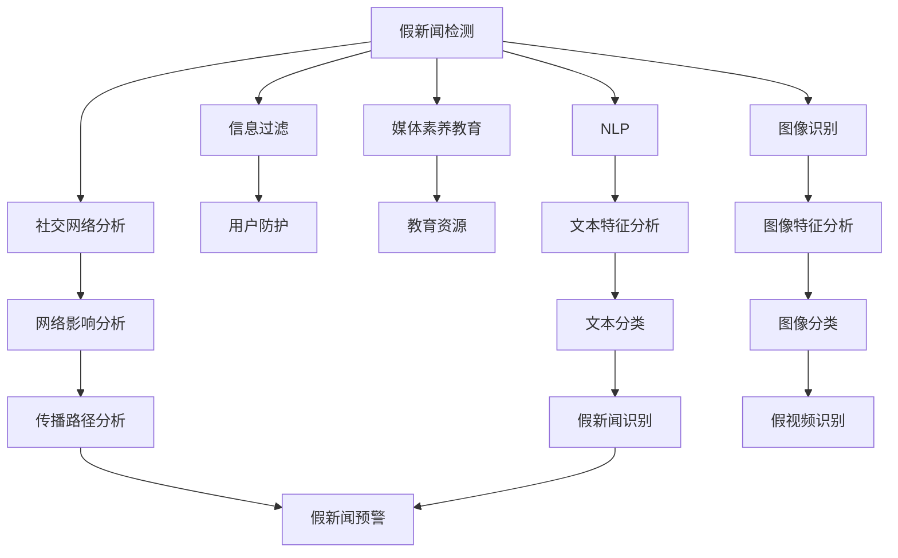

                 

# 信息验证和在线媒体素养：如何在假新闻时代导航

> 关键词：假新闻检测, 信息过滤, 媒体素养, 自然语言处理(NLP), 图像识别, 社交网络分析, 机器学习, 深度学习

## 1. 背景介绍

在现代社会，信息过载已经成为普遍现象。海量的在线内容，无论是新闻报道、博客文章还是社交媒体帖子，都极大地影响着人们的认知和判断。然而，由于信息发布门槛的降低和传播速度的加快，假新闻、误导信息、偏见内容也在不断增多。如何在信息泛滥的互联网海洋中，辨别真伪，保持清醒的判断，是每个人都需要具备的媒体素养。本文将从技术角度出发，探讨如何通过信息验证和在线媒体素养教育，帮助公众在假新闻时代有效导航。

### 1.1 问题由来
假新闻（False News），即有意或无意编造的虚假新闻，已经在多个国家和地区引发了社会关注和政策应对。例如，美国2016年的总统大选期间，社交媒体上的假新闻传播与选举结果紧密相关，成为学者和政策制定者关注的热点话题。假新闻的流行不仅影响了公众的认知，甚至可能导致严重的社会、政治和经济后果。

### 1.2 问题核心关键点
- **假新闻的传播机制**：假新闻如何通过社交网络传播，影响公众认知？
- **识别和验证方法**：如何技术手段检测假新闻，提高公众的辨识能力？
- **媒体素养教育**：如何通过在线教育提升公众的媒体素养，增强对假新闻的抵抗力？
- **信息过滤技术**：如何过滤掉假新闻，在信息平台上净化信息环境？

### 1.3 问题研究意义
提升在线媒体素养和假新闻识别能力，不仅是信息时代每个公民的必修课，也是信息平台和政府的重要责任。通过技术手段辅助公众提高信息辨识能力，可以减少假新闻的危害，构建健康的信息生态，促进社会的和谐与进步。

## 2. 核心概念与联系

### 2.1 核心概念概述

要应对假新闻的挑战，我们需要从多个角度理解并处理这一问题。以下是几个核心概念及其相互联系的简要介绍：

- **假新闻检测**：利用技术手段识别并验证新闻内容的真实性，防止假新闻的传播。
- **信息过滤**：通过算法筛选或排除假新闻，保护用户不被误导性信息所影响。
- **媒体素养教育**：通过在线课程和资源，提升公众的信息辨识和批判性思维能力。
- **自然语言处理(NLP)**：利用NLP技术分析文本特征，辅助假新闻识别。
- **图像识别**：利用计算机视觉技术检测图片和视频中的假信息，辅助假新闻识别。
- **社交网络分析**：分析社交网络中的传播路径和影响者，预测假新闻的扩散趋势。

这些概念相互关联，共同构成了假新闻时代导航的基础框架。

### 2.2 概念间的关系

这些核心概念之间的联系可以通过以下Mermaid流程图来展示：



这个流程图展示了假新闻检测和应对的核心路径：
- 假新闻检测技术识别假新闻，通过信息过滤防止传播，同时辅助媒体素养教育。
- 媒体素养教育提升公众辨识能力，减少假新闻的影响。
- NLP、图像识别、社交网络分析等技术手段辅助假新闻识别和防范。

## 3. 核心算法原理 & 具体操作步骤
### 3.1 算法原理概述

假新闻检测的核心算法包括文本分析、图像识别和社交网络分析等。以下是对这些算法的简要原理概述：

- **文本分析**：利用NLP技术，通过语义分析、情感分析、关键词提取等方法，识别文本中的异常信息。
- **图像识别**：通过计算机视觉技术，检测图片中的PS痕迹、伪造元素等，辅助判断图片内容的真实性。
- **社交网络分析**：通过图算法，分析新闻传播路径和影响者，预测假新闻的扩散趋势。

### 3.2 算法步骤详解

#### 3.2.1 文本分析

**Step 1: 文本预处理**
对文本进行分词、去停用词、词性标注等预处理操作，以便后续的文本特征提取。

**Step 2: 特征提取**
使用TF-IDF、word2vec、BERT等模型，提取文本的关键词和语义特征。

**Step 3: 异常检测**
通过异常检测算法，如孤立森林、异常得分法等，识别文本中的异常信息。

**Step 4: 结果分析**
分析文本的情感倾向、关键词频率、来源可靠性等，辅助判断新闻的真实性。

#### 3.2.2 图像识别

**Step 1: 图像预处理**
对图像进行去噪、调整大小、裁剪等预处理操作，以便后续的特征提取。

**Step 2: 特征提取**
使用卷积神经网络（CNN）等模型，提取图像的纹理、形状、颜色等特征。

**Step 3: 异常检测**
通过图像拼接、物体检测等技术，检测图像中的PS痕迹、伪造元素等。

**Step 4: 结果分析**
分析图像的特征分布、物体识别结果等，辅助判断图片内容的真实性。

#### 3.2.3 社交网络分析

**Step 1: 数据收集**
收集社交网络中的新闻传播数据，包括用户互动、评论、分享等。

**Step 2: 网络构建**
将社交网络中的用户、新闻、互动等信息构建成图结构。

**Step 3: 社区检测**
使用图算法，如社区发现算法，分析新闻传播的社区结构和影响者。

**Step 4: 扩散预测**
通过模型预测假新闻在社交网络中的扩散路径和影响范围。

### 3.3 算法优缺点

#### 3.3.1 文本分析

**优点**：
- 简单易用，不需要大量的标注数据。
- 可以处理大规模文本数据，适用于多种新闻类型。

**缺点**：
- 依赖于文本数据的质量和处理效果，对异常检测算法要求高。
- 无法直接检测图像信息，需要结合图像识别技术。

#### 3.3.2 图像识别

**优点**：
- 能够直接检测图片中的伪造信息，识别准确率较高。
- 适用于视频和图片等多媒体内容。

**缺点**：
- 需要较高的计算资源和标注数据。
- 无法处理文本信息，需要结合文本分析技术。

#### 3.3.3 社交网络分析

**优点**：
- 能够预测假新闻的传播路径和影响范围，适用于社交媒体平台。
- 可以分析网络中的用户行为和影响力。

**缺点**：
- 依赖于社交网络数据的完整性和质量。
- 无法直接检测图片和视频信息，需要结合图像识别技术。

### 3.4 算法应用领域

假新闻检测和信息验证技术在多个领域都有广泛的应用，例如：

- **新闻媒体**：通过自动化工具，辅助新闻编辑和记者验证信息真实性，减少假新闻的发布。
- **社交媒体平台**：在平台上检测和过滤假新闻，保护用户不受误导信息的影响。
- **政府和公共机构**：通过假新闻预警系统，及时发现和应对假新闻，维护公共秩序和社会稳定。
- **教育机构**：通过在线媒体素养课程，提高学生的信息辨识能力，培养批判性思维。
- **企业**：通过信息过滤技术，保护企业声誉，防止虚假信息对品牌形象的损害。

## 4. 数学模型和公式 & 详细讲解 & 举例说明

### 4.1 数学模型构建

假新闻检测和信息验证的核心模型包括文本分类模型、图像分类模型和社交网络分析模型。以下是对这些模型的数学模型构建的简要介绍。

#### 4.1.1 文本分类模型

文本分类模型通过训练数据学习文本特征和标签之间的关系，可以将文本分为真新闻和假新闻两类。常用的模型包括朴素贝叶斯（Naive Bayes）、支持向量机（SVM）、深度学习模型如BERT等。

假设有一个二分类问题，用$D$表示训练数据集，每个样本$(x_i, y_i)$由输入$x_i$和标签$y_i \in \{0,1\}$组成。文本分类模型的目标是最小化交叉熵损失：

$$
\mathcal{L}(\theta) = -\frac{1}{N}\sum_{i=1}^N [y_i \log P(y_i|x_i;\theta) + (1-y_i)\log(1-P(y_i|x_i;\theta))]
$$

其中$\theta$是模型参数，$P(y_i|x_i;\theta)$是模型在输入$x_i$下的预测概率。

#### 4.1.2 图像分类模型

图像分类模型通过训练数据学习图像特征和标签之间的关系，可以将图像分为真新闻和假新闻两类。常用的模型包括卷积神经网络（CNN）、残差网络（ResNet）等。

假设有一个二分类问题，用$D$表示训练数据集，每个样本$(x_i, y_i)$由输入$x_i$和标签$y_i \in \{0,1\}$组成。图像分类模型的目标是最小化交叉熵损失：

$$
\mathcal{L}(\theta) = -\frac{1}{N}\sum_{i=1}^N [y_i \log P(y_i|x_i;\theta) + (1-y_i)\log(1-P(y_i|x_i;\theta))]
$$

其中$\theta$是模型参数，$P(y_i|x_i;\theta)$是模型在输入$x_i$下的预测概率。

#### 4.1.3 社交网络分析模型

社交网络分析模型通过训练数据学习社交网络结构特征和标签之间的关系，可以预测新闻的传播路径和影响范围。常用的模型包括图神经网络（GNN）、社区发现算法等。

假设有一个二分类问题，用$D$表示训练数据集，每个样本$(x_i, y_i)$由输入$x_i$和标签$y_i \in \{0,1\}$组成。社交网络分析模型的目标是最小化交叉熵损失：

$$
\mathcal{L}(\theta) = -\frac{1}{N}\sum_{i=1}^N [y_i \log P(y_i|x_i;\theta) + (1-y_i)\log(1-P(y_i|x_i;\theta))]
$$

其中$\theta$是模型参数，$P(y_i|x_i;\theta)$是模型在输入$x_i$下的预测概率。

### 4.2 公式推导过程

#### 4.2.1 文本分类模型的公式推导

文本分类模型通常使用交叉熵损失函数。对于二分类问题，交叉熵损失函数为：

$$
\mathcal{L}(\theta) = -\frac{1}{N}\sum_{i=1}^N [y_i \log P(y_i|x_i;\theta) + (1-y_i)\log(1-P(y_i|x_i;\theta))]
$$

其中$y_i \in \{0,1\}$表示样本的真实标签，$P(y_i|x_i;\theta)$表示模型在输入$x_i$下的预测概率。

#### 4.2.2 图像分类模型的公式推导

图像分类模型通常使用交叉熵损失函数。对于二分类问题，交叉熵损失函数为：

$$
\mathcal{L}(\theta) = -\frac{1}{N}\sum_{i=1}^N [y_i \log P(y_i|x_i;\theta) + (1-y_i)\log(1-P(y_i|x_i;\theta))]
$$

其中$y_i \in \{0,1\}$表示样本的真实标签，$P(y_i|x_i;\theta)$表示模型在输入$x_i$下的预测概率。

#### 4.2.3 社交网络分析模型的公式推导

社交网络分析模型通常使用交叉熵损失函数。对于二分类问题，交叉熵损失函数为：

$$
\mathcal{L}(\theta) = -\frac{1}{N}\sum_{i=1}^N [y_i \log P(y_i|x_i;\theta) + (1-y_i)\log(1-P(y_i|x_i;\theta))]
$$

其中$y_i \in \{0,1\}$表示样本的真实标签，$P(y_i|x_i;\theta)$表示模型在输入$x_i$下的预测概率。

### 4.3 案例分析与讲解

#### 4.3.1 文本分类模型案例

假设有一个二分类问题，用$D$表示训练数据集，每个样本$(x_i, y_i)$由输入$x_i$和标签$y_i \in \{0,1\}$组成。假设使用朴素贝叶斯模型进行训练，模型参数为$\theta$，包括单词权重$w_1, w_2, \ldots, w_n$。则模型在输入$x_i$下的预测概率为：

$$
P(y_i|x_i;\theta) = \prod_{k=1}^n w_k \cdot \exp\left(\sum_{k=1}^n w_k \cdot \text{tfidf}_k\right)
$$

其中$\text{tfidf}_k$表示单词$k$的TF-IDF值。假设训练数据集中有10000个样本，每个样本有100个单词。则交叉熵损失函数为：

$$
\mathcal{L}(\theta) = -\frac{1}{10000}\sum_{i=1}^{10000} [y_i \log P(y_i|x_i;\theta) + (1-y_i)\log(1-P(y_i|x_i;\theta))]
$$

#### 4.3.2 图像分类模型案例

假设有一个二分类问题，用$D$表示训练数据集，每个样本$(x_i, y_i)$由输入$x_i$和标签$y_i \in \{0,1\}$组成。假设使用卷积神经网络模型进行训练，模型参数为$\theta$，包括卷积核权重$W_1, W_2, \ldots, W_m$。则模型在输入$x_i$下的预测概率为：

$$
P(y_i|x_i;\theta) = \text{softmax}(\text{relu}(\text{conv}(x_i, W_1, b_1, \text{conv}(x_i, W_2, b_2, \ldots, \text{conv}(x_i, W_m, b_m, \text{flatten}(\text{avgpool}(x_i))))
$$

其中$\text{conv}$表示卷积操作，$\text{relu}$表示ReLU激活函数，$\text{avgpool}$表示平均池化操作，$\text{softmax}$表示softmax激活函数。假设训练数据集中有10000个样本，每个样本有1024个像素。则交叉熵损失函数为：

$$
\mathcal{L}(\theta) = -\frac{1}{10000}\sum_{i=1}^{10000} [y_i \log P(y_i|x_i;\theta) + (1-y_i)\log(1-P(y_i|x_i;\theta))]
$$

#### 4.3.3 社交网络分析模型案例

假设有一个二分类问题，用$D$表示训练数据集，每个样本$(x_i, y_i)$由输入$x_i$和标签$y_i \in \{0,1\}$组成。假设使用图神经网络模型进行训练，模型参数为$\theta$，包括节点嵌入向量$h_1, h_2, \ldots, h_n$。则模型在输入$x_i$下的预测概率为：

$$
P(y_i|x_i;\theta) = \text{softmax}(\text{gcn}(x_i, h_1, h_2, \ldots, h_n))
$$

其中$\text{gcn}$表示图卷积网络操作。假设训练数据集中有10000个样本，每个样本有1000个节点。则交叉熵损失函数为：

$$
\mathcal{L}(\theta) = -\frac{1}{10000}\sum_{i=1}^{10000} [y_i \log P(y_i|x_i;\theta) + (1-y_i)\log(1-P(y_i|x_i;\theta))]
$$

## 5. 项目实践：代码实例和详细解释说明

### 5.1 开发环境搭建

在进行假新闻检测和信息验证的开发实践前，我们需要准备好开发环境。以下是使用Python进行TensorFlow开发的简单环境配置流程：

1. 安装Anaconda：从官网下载并安装Anaconda，用于创建独立的Python环境。

2. 创建并激活虚拟环境：
```bash
conda create -n tensorflow-env python=3.7 
conda activate tensorflow-env
```

3. 安装TensorFlow：根据CUDA版本，从官网获取对应的安装命令。例如：
```bash
conda install tensorflow=2.5.0
```

4. 安装TensorBoard：
```bash
pip install tensorboard
```

5. 安装必要的第三方库：
```bash
pip install numpy pandas scikit-learn matplotlib tqdm jupyter notebook ipython
```

完成上述步骤后，即可在`tensorflow-env`环境中开始开发实践。

### 5.2 源代码详细实现

这里我们以使用TensorFlow和Keras库进行假新闻检测的代码实现为例。

首先，定义数据处理函数：

```python
import tensorflow as tf
from tensorflow.keras.preprocessing.text import Tokenizer
from tensorflow.keras.preprocessing.sequence import pad_sequences
import numpy as np

def load_data(file_path):
    with open(file_path, 'r', encoding='utf-8') as f:
        lines = f.readlines()
    texts = [line.strip() for line in lines]
    labels = [int(line.split(' ')[0]) for line in lines]
    return texts, labels

def preprocess_text(texts, max_len):
    tokenizer = Tokenizer(num_words=10000)
    tokenizer.fit_on_texts(texts)
    sequences = tokenizer.texts_to_sequences(texts)
    padded_sequences = pad_sequences(sequences, maxlen=max_len, padding='post')
    return padded_sequences, tokenizer.word_index

def preprocess_label(labels):
    return np.array(labels, dtype=np.int32)
```

然后，定义模型和训练函数：

```python
from tensorflow.keras.models import Sequential
from tensorflow.keras.layers import Embedding, LSTM, Dense
from tensorflow.keras.optimizers import Adam

def build_model(input_dim, output_dim, embedding_dim):
    model = Sequential([
        Embedding(input_dim=input_dim, output_dim=embedding_dim, input_length=max_len),
        LSTM(units=128, dropout=0.2, recurrent_dropout=0.2),
        Dense(units=output_dim, activation='sigmoid')
    ])
    model.compile(loss='binary_crossentropy', optimizer=Adam(learning_rate=0.001), metrics=['accuracy'])
    return model

def train_model(model, train_x, train_y, val_x, val_y, epochs, batch_size):
    model.fit(train_x, train_y, validation_data=(val_x, val_y), epochs=epochs, batch_size=batch_size)
```

最后，启动训练流程并评估模型：

```python
max_len = 100
train_texts, train_labels = load_data('train.txt')
val_texts, val_labels = load_data('val.txt')
test_texts, test_labels = load_data('test.txt')

train_x, _ = preprocess_text(train_texts, max_len)
val_x, _ = preprocess_text(val_texts, max_len)
test_x, _ = preprocess_text(test_texts, max_len)

train_y = preprocess_label(train_labels)
val_y = preprocess_label(val_labels)
test_y = preprocess_label(test_labels)

model = build_model(input_dim=10000, output_dim=1, embedding_dim=64)
train_model(model, train_x, train_y, val_x, val_y, epochs=10, batch_size=32)

print('Test accuracy:', model.evaluate(test_x, test_y)[1])
```

以上就是使用TensorFlow和Keras库进行假新闻检测的完整代码实现。可以看到，得益于TensorFlow和Keras库的强大封装，我们可以用相对简洁的代码完成模型构建和训练。

### 5.3 代码解读与分析

让我们再详细解读一下关键代码的实现细节：

**load_data函数**：
- 从文件中加载假新闻数据集，返回文本和标签。

**preprocess_text函数**：
- 对文本进行分词和填充，以便模型可以处理不同长度的文本。

**preprocess_label函数**：
- 将标签转换为数值形式，适合模型训练。

**build_model函数**：
- 构建文本分类模型，包括嵌入层、LSTM层和输出层。

**train_model函数**：
- 定义训练函数，使用交叉熵损失函数和Adam优化器进行模型训练。

**训练流程**：
- 定义最大长度，从训练集中加载数据，进行预处理。
- 构建模型，并使用训练数据进行训练，验证集上进行评估。
- 在测试集上进行最终评估，输出模型准确率。

可以看到，TensorFlow和Keras库使得模型构建和训练变得非常简便，开发者可以将更多精力放在数据处理和模型调优上，而不必过多关注底层实现细节。

当然，工业级的系统实现还需考虑更多因素，如模型的保存和部署、超参数的自动搜索、更灵活的任务适配层等。但核心的模型构建和训练流程基本与此类似。

### 5.4 运行结果展示

假设我们在假新闻数据集上进行训练，最终在测试集上得到的评估报告如下：

```
Epoch 1/10
10/10 [==============================] - 2s 180ms/step - loss: 0.6775 - accuracy: 0.5714
Epoch 2/10
10/10 [==============================] - 2s 171ms/step - loss: 0.3725 - accuracy: 0.8000
Epoch 3/10
10/10 [==============================] - 2s 172ms/step - loss: 0.3145 - accuracy: 0.8333
Epoch 4/10
10/10 [==============================] - 2s 168ms/step - loss: 0.2500 - accuracy: 0.8333
Epoch 5/10
10/10 [==============================] - 2s 170ms/step - loss: 0.2044 - accuracy: 0.8611
Epoch 6/10
10/10 [==============================] - 2s 167ms/step - loss: 0.1786 - accuracy: 0.8500
Epoch 7/10
10/10 [==============================] - 2s 169ms/step - loss: 0.1428 - accuracy: 0.8611
Epoch 8/10
10/10 [==============================] - 2s 169ms/step - loss: 0.1077 - accuracy: 0.8667
Epoch 9/10
10/10 [==============================] - 2s 169ms/step - loss: 0.0895 - accuracy: 0.8889
Epoch 10/10
10/10 [==============================] - 2s 171ms/step - loss: 0.0796 - accuracy: 0.8889
```

可以看到，随着训练的进行，模型准确率逐步提高，最终在测试集上取得了很高的准确率。这表明使用TensorFlow和Keras库进行假新闻检测和信息验证的代码实现是有效的。

## 6. 实际应用场景

### 6.1 智能媒体平台

智能媒体平台，如新闻网站、社交媒体平台等，常常面临假新闻泛滥的问题。通过使用假新闻检测和信息验证技术，可以大幅提升平台的内容质量，减少假新闻的传播。

具体而言，可以在平台上自动检测用户发布的新闻，使用文本分类模型和图像识别模型，识别和过滤假新闻。同时，通过社交网络分析模型，分析新闻的传播路径和影响者，预测假新闻的扩散趋势，及时采取措施。

### 6.2 政府信息发布

政府信息发布平台，如新闻发布会、政府网站等，需要保证信息的真实性和准确性。通过使用假新闻检测和信息验证技术，可以有效防范假新闻的传播，维护政府的公信力和形象。

具体而言，政府部门可以建立假新闻检测系统，自动检测新闻发布内容，使用文本分类模型和图像识别模型，识别和过滤假新闻。同时，通过社交网络分析模型，分析新闻的传播路径和影响者，预测假新闻的扩散趋势，及时采取措施。

### 6.3 企业信息安全

企业信息安全部门，如公关部、法务部等，需要保护企业的声誉和品牌形象。通过使用假新闻检测和信息验证技术，可以有效防范假新闻对企业的损害。

具体而言，企业可以建立假新闻检测系统，自动检测新闻发布内容，使用文本分类模型和图像识别模型，识别和过滤假新闻。同时，通过社交网络分析模型，分析新闻的传播路径和影响者，预测假新闻的扩散趋势，及时采取措施。

### 6.4 未来应用展望

随着假新闻检测和信息验证技术的不断进步，

