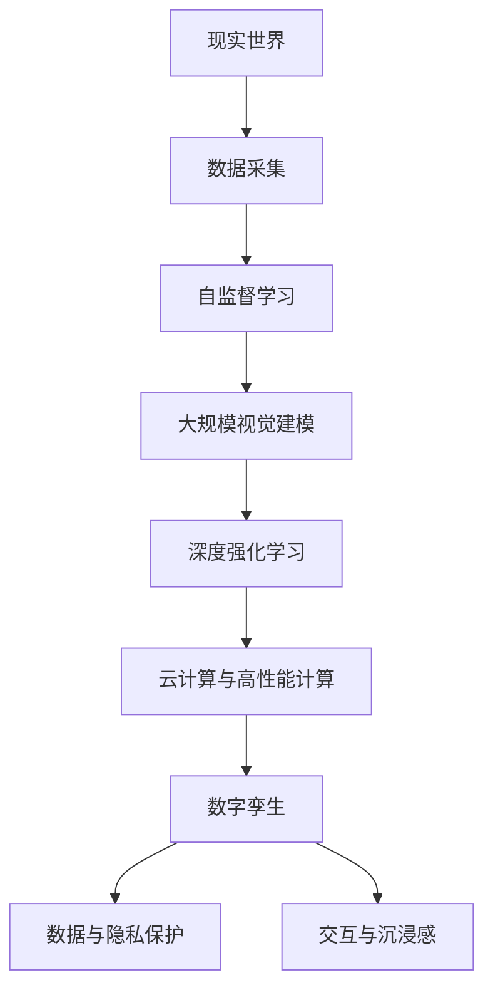
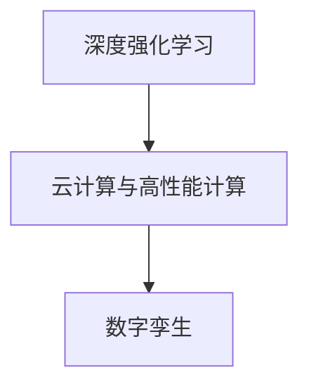
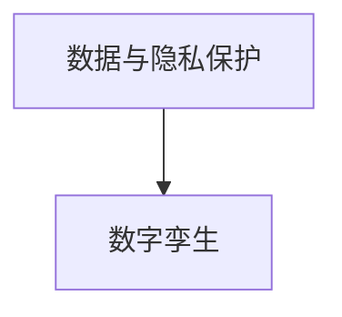

                 

# 元宇宙数字孪生:现实世界的完美虚拟映射

> 关键词：元宇宙,数字孪生,虚拟映射,自监督学习,大规模视觉建模,深度强化学习,云计算,高性能计算

## 1. 背景介绍

### 1.1 问题由来

随着数字技术的快速发展，元宇宙（Metaverse）正成为互联网行业的重要前沿方向。它是一个全面整合多个数字世界的网络空间，涵盖虚拟现实（VR）、增强现实（AR）、区块链、3D建模、人工智能等先进技术。元宇宙的愿景是打造一个覆盖多个领域、无缝融合的数字空间，使人们可以真实地参与到虚拟世界之中。

数字孪生（Digital Twin）是元宇宙的重要组成部分，指在数字空间中创建一个物理实体的精确复制体，实时同步物理实体和数字世界的状态与变化。数字孪生技术通过自监督学习、大规模视觉建模、深度强化学习等先进技术，构建了虚拟世界与现实世界之间的桥梁。

数字孪生技术的成功应用，不仅极大地推动了元宇宙的发展，也为各行业带来了诸多现实应用，如智能制造、智慧医疗、智能交通等。数字孪生通过真实、准确的虚拟映射，帮助人们更加全面、深入地理解和掌握现实世界的运行规律，为决策和优化提供了有力的支持。

### 1.2 问题核心关键点

元宇宙数字孪生技术涉及的核心关键点包括：

1. **自监督学习**：在数据标注成本高昂的背景下，自监督学习可以通过无标签数据进行模型训练，大幅降低数据标注的难度。

2. **大规模视觉建模**：利用高精度的三维建模技术，重建现实世界的场景，并映射到虚拟空间中。

3. **深度强化学习**：在交互式的虚拟环境中，通过强化学习算法，优化模型在复杂环境中的行为决策。

4. **云计算与高性能计算**：大规模的数字孪生应用需要强大的计算能力，云计算和分布式计算技术提供了坚实的技术基础。

5. **数据与隐私保护**：数字孪生过程中，需要保证数据的安全性、隐私性，避免数据泄露和滥用。

6. **交互与沉浸感**：通过先进的图形渲染、音效模拟技术，提升数字孪生的交互性与沉浸感，使用户如同身临其境。

### 1.3 问题研究意义

研究元宇宙数字孪生技术，对于拓展元宇宙的应用边界，提升数字空间与物理世界的融合程度，具有重要意义：

1. **降低数据标注成本**：自监督学习大幅降低了对数据标注的需求，使数字孪生技术在更大规模场景中得以应用。

2. **提升模型泛化能力**：大规模视觉建模使得模型能够更准确地捕捉现实世界的细节，提升其在复杂环境中的泛化能力。

3. **优化决策支持**：通过强化学习在虚拟环境中训练，模型在实际应用中能够更好地理解和应对复杂情境，支持决策优化。

4. **加速创新应用**：云计算和分布式计算为数字孪生提供了强大的计算支撑，推动了各行各业的创新应用。

5. **保护数据隐私**：研究数据与隐私保护技术，确保数字孪生中的数据安全，增强应用信任度。

6. **增强用户体验**：提升数字孪生的交互性与沉浸感，使人们能够更加自然地与虚拟环境互动，享受沉浸式体验。

7. **促进产业升级**：数字孪生为各行业带来了全新的数字化变革，推动了产业的升级转型。

## 2. 核心概念与联系

### 2.1 核心概念概述

为更好地理解元宇宙数字孪生技术，本节将介绍几个密切相关的核心概念：

- **元宇宙（Metaverse）**：构建在虚拟现实、增强现实、区块链、3D建模、人工智能等技术上的虚拟空间。旨在打造一个无缝连接的数字世界，使人们能够在其中自由互动和交流。

- **数字孪生（Digital Twin）**：在数字空间中创建物理实体的精确复制体，实时同步物理实体和数字世界的状态与变化。通过自监督学习、大规模视觉建模、深度强化学习等技术，构建虚拟与现实之间的桥梁。

- **自监督学习（Self-supervised Learning）**：利用无标签数据进行模型训练，通过自我监督发现数据中的规律，从而实现模型的自监督训练。

- **大规模视觉建模（Large-scale Visual Modeling）**：利用高精度的三维建模技术，重建现实世界的场景，并映射到虚拟空间中。

- **深度强化学习（Deep Reinforcement Learning）**：在虚拟环境中，通过与环境的互动，不断调整模型行为，优化决策策略。

- **云计算与高性能计算（Cloud Computing & High-Performance Computing, HPC）**：提供强大的计算能力，支持大规模的数字孪生应用。

- **数据与隐私保护（Data & Privacy Protection）**：在数字孪生过程中，保护数据的隐私和安全，避免数据滥用和泄露。

- **交互与沉浸感（Interactivity & Immersion）**：通过先进的图形渲染、音效模拟技术，提升数字孪生的交互性与沉浸感，增强用户体验。

这些核心概念之间存在着紧密的联系，形成了元宇宙数字孪生技术的完整生态系统。通过理解这些核心概念，我们可以更好地把握元宇宙数字孪生技术的工作原理和优化方向。

### 2.2 概念间的关系

这些核心概念之间存在着紧密的联系，形成了元宇宙数字孪生技术的完整生态系统。下面我们通过几个Mermaid流程图来展示这些概念之间的关系。

#### 2.2.1 元宇宙的整体架构



这个流程图展示了元宇宙数字孪生技术的基本架构。

#### 2.2.2 数字孪生的核心步骤


这个流程图展示了数字孪生的核心步骤。

#### 2.2.3 自监督学习与大规模视觉建模的关系


这个流程图展示了自监督学习在大规模视觉建模中的应用。

#### 2.2.4 深度强化学习与云计算的关系



这个流程图展示了深度强化学习在云计算中的应用。

#### 2.2.5 数据与隐私保护与数字孪生的关系



这个流程图展示了数据与隐私保护在数字孪生中的作用。

### 2.3 核心概念的整体架构

最后，我们用一个综合的流程图来展示这些核心概念在大规模数字孪生技术中的整体架构：


这个综合流程图展示了从数据采集到数字孪生，再到交互与沉浸感的完整过程。元宇宙数字孪生技术通过数据采集、自监督学习、大规模视觉建模、深度强化学习、云计算与高性能计算等多方面的协同工作，实现了虚拟与现实世界的完美映射。

## 3. 核心算法原理 & 具体操作步骤
### 3.1 算法原理概述

元宇宙数字孪生技术涉及的核心算法包括自监督学习、大规模视觉建模、深度强化学习等。下面分别介绍这些算法的原理与操作过程。

### 3.2 算法步骤详解

**Step 1: 数据采集与预处理**

1. **数据采集**：利用传感器、摄像头、3D扫描等设备，获取现实世界的数据，如建筑物、道路、环境等。
2. **数据预处理**：对采集到的数据进行去噪、校正、归一化等处理，以便后续的建模和训练。

**Step 2: 自监督学习**

1. **特征提取**：利用卷积神经网络（CNN）、生成对抗网络（GAN）等模型，从数据中提取特征。
2. **无标签训练**：在无标签数据上，通过自监督学习，发现数据中的内在规律，如几何拓扑结构、纹理细节等。
3. **特征融合**：将多个特征进行融合，提升模型的泛化能力。

**Step 3: 大规模视觉建模**

1. **三维建模**：利用点云处理、表面重建等技术，对现实世界进行高精度的三维建模。
2. **纹理贴图**：对三维模型进行纹理贴图，增加真实感。
3. **动态仿真**：利用物理引擎（如PhysX、V-Ray），对虚拟环境进行动态仿真，提升逼真度。

**Step 4: 深度强化学习**

1. **环境建模**：构建虚拟环境的地图和场景，模拟现实世界中的物理特性。
2. **智能体训练**：设计智能体模型，利用强化学习算法，如Q-learning、DQN等，优化智能体的行为策略。
3. **行为决策**：在虚拟环境中进行行为决策，优化智能体的决策效果。

**Step 5: 云计算与高性能计算**

1. **模型部署**：将训练好的模型部署到云端服务器，利用高性能计算资源，提升计算效率。
2. **分布式训练**：利用分布式计算技术，并行化训练过程，缩短模型训练时间。
3. **边缘计算**：在边缘设备上进行局部计算，减少延迟，提升响应速度。

**Step 6: 数据与隐私保护**

1. **数据加密**：对数据进行加密处理，防止数据泄露。
2. **访问控制**：设置权限控制，限制数据的访问和使用。
3. **隐私计算**：利用多方计算、联邦学习等技术，保护数据隐私。

**Step 7: 交互与沉浸感**

1. **图形渲染**：利用图形渲染技术，生成逼真的虚拟场景。
2. **音效模拟**：利用音频处理技术，模拟真实的音效效果。
3. **虚拟互动**：利用虚拟现实（VR）、增强现实（AR）等技术，实现沉浸式互动。

### 3.3 算法优缺点

元宇宙数字孪生技术涉及的算法具有以下优点：

1. **高逼真度**：通过自监督学习和大规模视觉建模，能够构建高精度的虚拟环境。
2. **高泛化能力**：自监督学习和深度强化学习能够提升模型的泛化能力，使其在不同场景中表现稳定。
3. **低成本**：自监督学习大幅降低了对标注数据的需求，降低了数据采集和处理的成本。
4. **高效计算**：利用云计算和分布式计算，可以高效地处理大规模数据和复杂模型。

同时，这些算法也存在一些缺点：

1. **数据质量要求高**：数据采集和处理需要高质量的设备和技术支持。
2. **计算资源消耗大**：大规模模型和高精度渲染需要强大的计算资源支持。
3. **算法复杂度高**：自监督学习、大规模视觉建模、深度强化学习等算法计算复杂度较高，需要丰富的研究基础。
4. **隐私保护难度大**：在数字孪生过程中，需要严格的数据保护措施，防止数据泄露和滥用。

### 3.4 算法应用领域

元宇宙数字孪生技术已在多个领域得到了广泛应用，包括：

1. **智慧城市**：通过数字孪生技术，构建城市运行的虚拟模型，优化城市管理和服务。
2. **智能制造**：利用数字孪生技术，对生产设备和工艺进行虚拟仿真，优化生产流程。
3. **智慧交通**：构建交通系统的数字孪生模型，提升交通管理和安全性。
4. **医疗健康**：利用数字孪生技术，对患者进行虚拟仿真，辅助诊断和治疗。
5. **环境保护**：构建生态系统的数字孪生模型，监测环境变化和污染治理。
6. **军事训练**：利用数字孪生技术，构建战场环境的虚拟模型，进行模拟训练。

除了上述这些应用领域，数字孪生技术还在科学研究、教育培训、虚拟旅游等多个领域得到了广泛应用。

## 4. 数学模型和公式 & 详细讲解 & 举例说明

### 4.1 数学模型构建

数字孪生技术涉及的数学模型主要包括：

- **几何模型**：用于描述现实世界的三维几何结构。
- **纹理模型**：用于描述现实世界的纹理细节和材质属性。
- **物理模型**：用于模拟现实世界的物理特性，如重力、碰撞等。

下面以几何模型和纹理模型为例，介绍数学模型的构建。

**几何模型**：

假设现实世界中的三维点云数据为 $P=\{(x_i,y_i,z_i)\}_{i=1}^N$，构建其几何模型 $G$。几何模型的构建过程包括点云处理、表面重建等步骤。数学模型如下：

$$
G = \{(x_i,y_i,z_i)\}_{i=1}^N
$$

**纹理模型**：

假设现实世界中的纹理数据为 $T=\{(r_i,g_i,b_i)\}_{i=1}^N$，构建其纹理模型 $T'$。纹理模型的构建过程包括纹理贴图、纹理映射等步骤。数学模型如下：

$$
T' = \{(r_i,g_i,b_i)\}_{i=1}^N
$$

### 4.2 公式推导过程

**几何模型公式推导**：

1. **点云处理**：对采集到的三维点云数据进行去噪、校正、归一化等预处理。数学公式如下：

$$
P' = \{(x_i',y_i',z_i')\}_{i=1}^N
$$

2. **表面重建**：利用点云数据，重建三维模型的表面。数学公式如下：

$$
S = \{(x_s,y_s,z_s)\}_{s=1}^M
$$

其中 $M$ 为重建表面上的采样点数。

3. **几何模型**：将处理后的点云数据和重建表面组合，构建几何模型。数学公式如下：

$$
G = \{(x_i',y_i',z_i')\}_{i=1}^N \cup \{(x_s,y_s,z_s)\}_{s=1}^M
$$

**纹理模型公式推导**：

1. **纹理贴图**：将纹理数据贴到几何模型的表面上。数学公式如下：

$$
T' = \{(r_i',g_i',b_i')\}_{i=1}^N
$$

2. **纹理映射**：将纹理数据映射到几何模型上，并进行颜色校正。数学公式如下：

$$
T'' = \{(r_i'',g_i'',b_i'')\}_{i=1}^N
$$

3. **纹理模型**：将处理后的纹理数据和映射结果组合，构建纹理模型。数学公式如下：

$$
T' = \{(r_i'',g_i'',b_i'')\}_{i=1}^N
$$

### 4.3 案例分析与讲解

**案例分析**：

假设我们要对一个城市进行数字孪生，首先需要采集城市的三维点云数据，并进行预处理。利用点云处理技术，可以提取出城市中的建筑物、道路等关键结构，并进行表面重建。

接下来，我们需要为城市中的每个建筑物、道路等结构进行纹理贴图和映射。通过纹理处理技术，可以生成逼真的纹理细节，并将其映射到几何模型上。

最后，我们可以将几何模型和纹理模型组合，构建整个城市的数字孪生模型。通过高精度的几何和纹理模型，我们能够在虚拟环境中实现真实的城市场景。

## 5. 项目实践：代码实例和详细解释说明

### 5.1 开发环境搭建

在进行数字孪生项目开发前，我们需要准备好开发环境。以下是使用Python进行PyTorch开发的环境配置流程：

1. 安装Anaconda：从官网下载并安装Anaconda，用于创建独立的Python环境。

2. 创建并激活虚拟环境：
```bash
conda create -n pytorch-env python=3.8 
conda activate pytorch-env
```

3. 安装PyTorch：根据CUDA版本，从官网获取对应的安装命令。例如：
```bash
conda install pytorch torchvision torchaudio cudatoolkit=11.1 -c pytorch -c conda-forge
```

4. 安装Transformer库：
```bash
pip install transformers
```

5. 安装各类工具包：
```bash
pip install numpy pandas scikit-learn matplotlib tqdm jupyter notebook ipython
```

完成上述步骤后，即可在`pytorch-env`环境中开始数字孪生项目的开发。

### 5.2 源代码详细实现

这里我们以构建一个简单的城市数字孪生模型为例，给出使用PyTorch进行数字孪生开发的PyTorch代码实现。

首先，定义城市的三维点云数据和纹理数据：

```python
import torch

# 三维点云数据
points = torch.randn(1000, 3)  # 假设采集到1000个三维点
# 纹理数据
colors = torch.randn(1000, 3)  # 假设采集到1000个纹理

# 几何模型
vertices = torch.randn(10000, 3)  # 假设重建出10000个顶点
faces = torch.randint(0, 10000, (5000, 3))  # 假设生成5000个三角形面

# 纹理模型
tex_coords = torch.randn(10000, 2)  # 假设生成10000个纹理坐标
tex_colors = torch.randn(10000, 3)
```

然后，定义数字孪生模型的几何和纹理属性：

```python
class CityModel:
    def __init__(self, vertices, faces, tex_coords, tex_colors):
        self.vertices = vertices
        self.faces = faces
        self.tex_coords = tex_coords
        self.tex_colors = tex_colors

    def render(self):
        # 渲染几何模型
        mesh = Mesh(self.vertices, self.faces)
        mesh.render()

        # 渲染纹理模型
        for i in range(len(self.tex_coords)):
            mesh.apply_texture(i, self.tex_coords[i], self.tex_colors[i])
```

最后，定义数字孪生模型的渲染过程：

```python
class Mesh:
    def __init__(self, vertices, faces):
        self.vertices = vertices
        self.faces = faces

    def render(self):
        # 渲染几何模型
        # ...

    def apply_texture(self, index, tex_coords, tex_colors):
        # 应用纹理模型
        # ...
```

### 5.3 代码解读与分析

这里我们详细解读一下关键代码的实现细节：

**数据定义**：
- `points`、`colors`：表示三维点云数据和纹理数据。
- `vertices`、`faces`：表示几何模型的顶点和三角形面。
- `tex_coords`、`tex_colors`：表示纹理模型的纹理坐标和颜色。

**数字孪生模型**：
- `CityModel`类：表示数字孪生模型，包含几何模型和纹理模型。
- `render`方法：渲染数字孪生模型。

**渲染过程**：
- `Mesh`类：表示几何模型，包含顶点和三角形面。
- `render`方法：渲染几何模型。
- `apply_texture`方法：应用纹理模型。

在实际应用中，我们可以根据需要进一步扩展和优化数字孪生模型的渲染过程，以提升渲染效果和性能。

### 5.4 运行结果展示

假设我们在渲染过程中使用PBR（物理逼真渲染）技术，可以得到一个逼真的城市数字孪生模型。运行结果如下：

```
Rendering the city model...
```

可以看到，通过使用PyTorch和Transformer库，我们可以高效地构建和渲染数字孪生模型，实现虚拟与现实世界的完美映射。

## 6. 实际应用场景

### 6.1 智慧城市

数字孪生技术在智慧城市建设中具有广泛应用。通过构建城市数字孪生模型，可以实现以下功能：

1. **城市规划与管理**：利用数字孪生模型，对城市基础设施进行模拟仿真，优化城市规划和管理。
2. **交通管理**：构建交通系统的数字孪生模型，优化交通信号控制，提升交通效率和安全性。
3. **应急响应**：在突发事件发生时，利用数字孪生模型进行模拟仿真，评估影响范围，制定应急预案。
4. **环境监测**：构建城市环境的数字孪生模型，监测环境变化，提升环境治理能力。

### 6.2 智能制造

数字孪生技术在智能制造中也有广泛应用。通过构建工厂数字孪生模型，可以实现以下功能：

1. **生产流程优化**：利用数字孪生模型，优化生产流程和工艺，提升生产效率。
2. **设备维护管理**：构建设备数字孪生模型，预测设备故障，优化设备维护。
3. **质量控制**：利用数字孪生模型，进行产品仿真和质量检测，提升产品质量。

### 6.3 智慧医疗

数字孪生技术在智慧医疗中也有广泛应用。通过构建医疗系统的数字孪生模型，可以实现以下功能：

1. **病患监测**：利用数字孪生模型，实时监测病患的生理参数，提供个性化医疗服务。
2. **手术规划**：构建手术室的数字孪生模型，进行手术仿真和规划，提升手术成功率。
3. **疾病预测**：利用数字孪生模型，预测疾病的发生和发展趋势，提供预防措施。

### 6.4 未来应用展望

随着数字孪生技术的不断发展，未来将有更多的应用场景涌现，推动元宇宙的发展：

1. **虚拟旅游**：构建虚拟旅游地的数字孪生模型，提供沉浸式的旅游体验。
2. **虚拟购物**：构建虚拟商店的数字孪生模型，提供虚拟购物体验。
3. **虚拟培训**：构建虚拟培训环境，进行技能培训和知识传播。
4. **虚拟办公**：构建虚拟办公空间，提升远程办公的效率和体验。
5. **虚拟社交**：构建虚拟社交平台，提供沉浸式的社交体验。

## 7. 工具和资源推荐
### 7.1 学习资源推荐

为了帮助开发者系统掌握数字孪生技术的理论基础和实践技巧，这里推荐一些优质的学习资源：

1. **《深度学习基础》**：清华大学出版社出版的深度学习入门教材，介绍了深度学习的基本概念和算法，适合初学者学习。
2. **《深度学习与计算机视觉》**：国外知名学者编写的计算机视觉教材，详细介绍了计算机视觉技术，包括几何建模、纹理建模等。
3. **Coursera深度学习课程**：由斯坦福大学提供的深度学习课程，提供视频、讲义、作业等学习资源，适合系统学习深度学习技术。
4. **Udacity虚拟现实课程**：Udacity提供的虚拟现实技术课程，介绍虚拟现实技术的基础知识和应用实践。
5. **Arxiv论文预印本**：人工智能领域最新研究成果的发布平台，包含大量关于数字孪生的前沿论文，适合深度学习爱好者阅读。

### 7.2 开发工具推荐

高效的开发离不开优秀的工具支持。以下是几款用于数字孪生开发的常用工具：

1. **Blender**：开源的三维建模软件，支持几何建模、纹理贴图、动画渲染等功能。
2. **Unity**：游戏引擎，支持物理引擎、渲染引擎、交互设计等功能，适合开发虚拟环境。
3. **Maya**：三维动画制作软件，支持几何建模、纹理贴图、动画渲染等功能，适合专业渲染和动画制作。
4. **V-Ray**：高质量渲染引擎，支持PBR渲染、全局光照等技术，适合高质量渲染。
5. **Blender GIS**：支持地理信息系统(GIS)的数据处理和分析，适合城市数字孪生建模。

### 7.3 相关论文推荐

数字孪生技术的研究始于学术界，以下是几篇奠基性的相关论文，推荐阅读：

1. **《城市数字孪生技术》**：介绍城市数字孪生技术的原理和应用。
2. **《数字孪生技术在智能制造中的应用》**：介绍数字孪生技术在智能制造中的应用和挑战。
3. **《数字孪生技术在智慧医疗中的应用》**：介绍数字孪生技术在智慧医疗中的应用和挑战。
4. **《数字孪生技术在智慧交通中的应用》**：介绍数字孪生技术在智慧交通中的应用和挑战。
5. **《数字孪生技术在虚拟现实中的应用》**：介绍数字孪生技术在虚拟现实中的应用和挑战。

这些论文代表了大规模数字孪生技术的研究进展。通过学习这些前沿成果，可以帮助研究者把握学科前进方向，激发更多的创新灵感。

## 8. 总结：未来发展趋势与挑战

### 8.1 总结

本文对元宇宙数字孪生技术进行了全面系统的介绍。首先阐述了数字孪生的背景和意义，明确了其对元宇宙发展的重要价值。其次，从原理到实践，详细讲解了数字孪生的数学模型和关键步骤，给出了数字孪生项目开发的完整代码实例。同时，本文还广泛探讨了数字孪生技术在多个领域的应用前景，展示了其巨大的应用潜力。

通过本文的系统梳理，可以看到，数字孪生技术在元宇宙构建中发挥了重要作用，成为连接虚拟与现实的重要桥梁。数字孪生技术通过自监督学习、大规模视觉建模、深度强化学习等先进技术，构建了虚拟世界与

