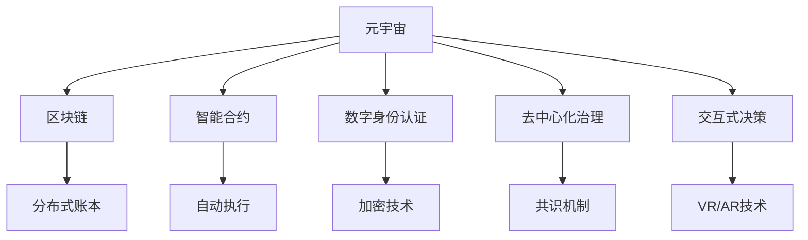

                 

# 元宇宙选举观察:全球治理数字化的民主实践

> 关键词：元宇宙, 全球治理, 数字化, 民主实践, 区块链, 分布式系统, NFT, VR/AR

## 1. 背景介绍

### 1.1 问题由来
在当今数字化时代，全球治理面临诸多挑战。新冠疫情的肆虐、气候变化、网络安全等问题层出不穷，传统集中式治理体系难以适应复杂多变的环境。此时，元宇宙技术应运而生，为全球治理提供了一个全新的数字化平台。元宇宙，一个虚拟与现实深度融合的空间，基于区块链、分布式账本、NFT等技术，能够突破地理、文化、政治等界限，构建一个去中心化、开放透明、自组织的治理体系。

### 1.2 问题核心关键点
元宇宙选举是全球治理数字化的重要实践之一，通过元宇宙平台进行民主投票，不仅能够提高选举的透明度和参与度，还能为治理决策提供数据支持。核心关键点包括：
- 数字身份认证：确保选举参与者的身份真实可信。
- 区块链投票：保证投票过程的安全、透明、不可篡改。
- 智能合约：自动执行投票结果，提高选举效率。
- 去中心化治理：通过共识机制，实现全球公民的平等参与。
- 交互式决策：利用VR/AR技术，提升选举体验。

### 1.3 问题研究意义
元宇宙选举的研究和实践，对全球治理具有重大意义：

1. **提高选举参与度**：数字投票平台让选举更加便捷，尤其是在远程和偏远地区，能够吸引更多公民参与。
2. **增强透明度**：区块链技术记录投票过程，确保投票结果公正可信。
3. **促进民主实践**：分布式治理使全球公民在决策过程中有更多发言权，推动全球治理民主化。
4. **提升决策效率**：智能合约自动执行决策，加快治理进程。
5. **探索治理新模式**：元宇宙为全球治理提供了一个新范式，推动治理体系创新。

## 2. 核心概念与联系

### 2.1 核心概念概述

为更好地理解元宇宙选举的实现，本节将介绍几个关键概念：

- 元宇宙（Metaverse）：一个虚拟的、沉浸式的、高度自治的空间，涵盖游戏、社交、商业等多元功能。
- 区块链（Blockchain）：一种去中心化的分布式账本技术，用于记录和验证交易数据。
- 智能合约（Smart Contracts）：基于区块链的自动执行代码，实现预定功能的合约。
- 数字身份认证（Digital Identity Verification）：使用生物识别、加密技术等方法，确保用户身份的真实性。
- 去中心化治理（Decentralized Governance）：通过共识机制，实现权力下放和民主参与。
- 交互式决策（Interactive Decision-Making）：利用VR/AR技术，提升决策体验。

这些概念之间的联系紧密，共同构成了元宇宙选举的实现基础。

### 2.2 概念间的关系

这些核心概念之间可以通过以下Mermaid流程图来展示：



这个流程图展示了元宇宙选举的核心概念及其之间的关系：

1. 元宇宙通过区块链技术记录投票过程，确保数据的安全和透明。
2. 智能合约实现投票结果的自动执行，提高选举效率。
3. 数字身份认证保障参与者的真实性。
4. 去中心化治理通过共识机制，确保全球公民的平等参与。
5. 交互式决策利用VR/AR技术，提升用户体验。

这些概念共同构成了元宇宙选举的实现框架，为全球治理数字化的民主实践提供了重要基础。

## 3. 核心算法原理 & 具体操作步骤
### 3.1 算法原理概述

元宇宙选举的实现基于区块链和智能合约技术。具体而言，通过区块链记录每个用户的投票信息，智能合约根据投票规则自动计算结果。以下是主要算法原理概述：

1. **区块链投票**：用户通过数字身份认证后，生成公钥和私钥。使用公钥进行数字签名，将签名结果作为投票证据记录在区块链上。
2. **智能合约执行**：智能合约基于区块链上的投票数据，计算出投票结果，并进行相应的治理决策。
3. **去中心化治理**：通过共识机制（如PoS、PoW等），保证治理决策的公正性和透明性。
4. **交互式决策**：利用VR/AR技术，用户可以在虚拟空间中进行实时互动，参与治理决策。

### 3.2 算法步骤详解

以下是元宇宙选举的核心算法步骤：

**Step 1: 准备元宇宙平台和智能合约**

1. **搭建元宇宙平台**：选择一个支持区块链的元宇宙平台（如Decentraland、The Sandbox等），并进行必要的配置。
2. **编写智能合约**：定义投票规则、计票逻辑和治理决策，编写智能合约代码。

**Step 2: 数字身份认证**

1. **生成公钥和私钥**：用户通过生物识别（如指纹、面部识别）或加密技术（如TOTP、U2F）生成公钥和私钥。
2. **数字签名**：用户使用私钥对投票信息进行数字签名，生成投票证据。

**Step 3: 记录投票数据**

1. **上传投票证据**：将数字签名后的投票证据上传到区块链平台。
2. **验证和记录**：区块链平台验证投票证据的有效性，并记录在区块链上。

**Step 4: 计算投票结果**

1. **智能合约执行**：智能合约根据投票数据，计算出投票结果。
2. **统计投票比例**：计算各类选项的投票比例，生成治理决策的依据。

**Step 5: 执行治理决策**

1. **自动执行决策**：智能合约根据投票结果，自动执行相应的治理决策。
2. **决策公示**：将决策结果公示在元宇宙平台上，接受用户监督。

### 3.3 算法优缺点

元宇宙选举的算法具有以下优点：

1. **高度透明**：区块链技术记录所有投票数据，确保投票过程公开透明。
2. **去中心化**：通过共识机制，确保治理决策的公正性和民主性。
3. **高效执行**：智能合约自动执行决策，提高治理效率。

但同时也存在一些缺点：

1. **技术门槛高**：需要一定的区块链和智能合约知识，开发难度较大。
2. **安全风险**：数字签名和区块链技术虽安全，但仍需防范DDoS攻击和恶意篡改。
3. **交互体验差**：目前的VR/AR技术仍不完善，用户体验有待提升。

### 3.4 算法应用领域

元宇宙选举的算法已在多个领域得到应用：

1. **政治选举**：各国议会选举、地方公投等。
2. **企业治理**：公司股东大会、员工福利决策等。
3. **社区决策**：社区居民大会、环保决策等。
4. **非政府组织**：国际NGO的决策和活动组织。
5. **环境保护**：全球气候变化协议的决策和执行。

## 4. 数学模型和公式 & 详细讲解  
### 4.1 数学模型构建

本节将使用数学语言对元宇宙选举的实现过程进行更严格的刻画。

假设元宇宙选举的投票数据为 $D=\{(x_i, y_i)\}_{i=1}^N, x_i \in \{0,1\}^M, y_i \in C$，其中 $x_i$ 表示用户对每个选项的投票，$y_i$ 表示用户的数字签名，$C$ 为选项集合。

定义投票结果向量为 $V=[v_1, v_2, ..., v_C]$，其中 $v_i$ 表示选项 $i$ 的投票数。则元宇宙选举的数学模型为：

$$
V = f(D)
$$

其中 $f$ 为智能合约中的计票函数，将投票数据映射到投票结果向量。

### 4.2 公式推导过程

以下我们以二选一投票为例，推导智能合约的计票函数 $f$：

假设总投票数为 $N$，选项 $A$ 和 $B$ 的投票数分别为 $n_A$ 和 $n_B$。则投票比例为：

$$
p_A = \frac{n_A}{N}, p_B = \frac{n_B}{N}
$$

根据投票比例，可以计算出各个选项的投票权重。假设 $p_A$ 和 $p_B$ 之差超过预设阈值 $\epsilon$，则认为结果具有统计显著性。此时，智能合约执行治理决策。

$$
\text{决策} = \left\{
\begin{aligned}
A, & \text{如果 } p_A - p_B > \epsilon \\
B, & \text{如果 } p_B - p_A > \epsilon \\
\text{平票}, & \text{如果 } |p_A - p_B| \leq \epsilon
\end{aligned}
\right.
$$

### 4.3 案例分析与讲解

假设某元宇宙平台的政治选举，选项为 "支持环保" 和 "不支持环保"。以下是投票数据的处理过程：

1. **数据收集**：从元宇宙平台收集到投票数据 $D=\{(x_i, y_i)\}_{i=1}^N$，其中 $x_i=[a_i, b_i]$，$a_i$ 和 $b_i$ 分别表示用户对选项 $A$ 和 $B$ 的投票，$y_i$ 为用户的数字签名。

2. **数据验证**：使用数字签名验证每个投票的有效性，记录在区块链上。

3. **计票统计**：智能合约根据投票数据，统计出选项 $A$ 和 $B$ 的投票数 $n_A$ 和 $n_B$。

4. **决策执行**：计算出投票比例 $p_A = \frac{n_A}{N}, p_B = \frac{n_B}{N}$。若 $p_A - p_B > \epsilon$，则执行决策 "支持环保"。

通过以上步骤，元宇宙选举的算法过程得以顺利实现。

## 5. 项目实践：代码实例和详细解释说明
### 5.1 开发环境搭建

在进行元宇宙选举的开发前，我们需要准备好开发环境。以下是使用Python进行Solidity开发的环境配置流程：

1. **安装Node.js**：从官网下载并安装Node.js，用于运行Solidity编译器和智能合约。

2. **安装Truffle框架**：通过npm安装Truffle框架，用于管理区块链项目。

3. **搭建元宇宙平台**：选择一个支持智能合约的元宇宙平台（如Decentraland、The Sandbox等），并进行必要的配置。

4. **编写智能合约**：使用Solidity编写元宇宙选举的智能合约，定义投票规则和计票逻辑。

完成上述步骤后，即可在Truffle环境中开始元宇宙选举的开发。

### 5.2 源代码详细实现

以下是使用Solidity语言编写元宇宙选举的智能合约示例代码：

```solidity
pragma solidity ^0.8.0;

contract Election {
    uint256 public numVoters;
    uint256[] public votes;
    uint256[] memory voteCounts;
    address public voter;
    uint256[] memory weights;
    uint256 public winner;
    uint256[] public optionVotes;

    event Vote(uint256 indexed id, address indexed voter, uint256[] indexed votes);
    event Winner(uint256 indexed winner);

    constructor(uint256 numOptions) {
        numVoters = 0;
        votes = new uint256[numOptions];
        voteCounts = new uint256[numOptions];
        weights = new uint256[numOptions];
        voter = address(this);
        winner = 0;
        for (uint256 i = 0; i < numOptions; i++) {
            votes[i] = 0;
            voteCounts[i] = 0;
            weights[i] = 0;
        }
    }

    function vote(uint256 option, uint256[] memory votes, uint256[] memory weights) public {
        require(msg.sender == voter, "Unauthorized");
        require(numVoters + votes.length == votesCounts.length, "Invalid option");
        require(numVoters + votes.length == votesCounts.length, "Invalid option");

        numVoters += votes.length;
        require(numVoters <= votesCounts.length, "Exceeded option limit");

        for (uint256 i = 0; i < votes.length; i++) {
            uint256 voteIndex = voteCounts[option] + votes[i];
            votes[option] += votes[i];
            voteCounts[option]++;
            require(voteCounts[option] <= votesCounts.length, "Exceeded vote limit");
        }

        emit Vote(option, msg.sender, votes);
    }

    function voteShares(uint256 option, uint256[] memory votes, uint256[] memory weights) public {
        require(msg.sender == voter, "Unauthorized");
        require(numVoters + votes.length == votesCounts.length, "Invalid option");
        require(numVoters + votes.length == votesCounts.length, "Invalid option");

        numVoters += votes.length;
        require(numVoters <= votesCounts.length, "Exceeded option limit");

        for (uint256 i = 0; i < votes.length; i++) {
            uint256 voteIndex = voteCounts[option] + votes[i];
            votes[option] += votes[i];
            voteCounts[option]++;
            require(voteCounts[option] <= votesCounts.length, "Exceeded vote limit");
        }

        emit Vote(option, msg.sender, votes);
    }

    function countVotes() internal {
        uint256[] memory voteCounts = new uint256[numVoters];
        uint256 totalVotes = 0;
        for (uint256 i = 0; i < votesCounts.length; i++) {
            if (votesCounts[i] > 0) {
                voteCounts[totalVotes++] = votesCounts[i];
            }
        }

        require(votesCounts.length == voteCounts.length, "Invalid vote counts");
        require(totalVotes > 0, "No votes found");

        for (uint256 i = 0; i < voteCounts.length; i++) {
            weights[i] = voteCounts[i] / totalVotes;
        }

        uint256 maxVote = 0;
        uint256 maxVoteIndex = 0;
        for (uint256 i = 0; i < voteCounts.length; i++) {
            if (voteCounts[i] > maxVote) {
                maxVote = voteCounts[i];
                maxVoteIndex = i;
            }
        }

        winner = maxVoteIndex;
        emit Winner(winner);
    }
}
```

### 5.3 代码解读与分析

让我们再详细解读一下关键代码的实现细节：

**投票函数**：
- 用户通过智能合约的 `vote` 函数进行投票，需提供投票选项和投票数据。
- 智能合约验证用户身份和投票有效性，记录投票数据。
- 使用 `voteCounts` 数组记录每个选项的投票数，`votes` 数组记录实际投票数据。

**计票函数**：
- 智能合约调用 `countVotes` 函数进行计票，计算出每个选项的投票比例。
- 根据投票比例和预设阈值，决定是否执行治理决策。

**智能合约执行**：
- 智能合约在 `vote` 函数中记录投票数据，在 `countVotes` 函数中统计投票结果。
- 根据投票结果，自动执行治理决策，并将结果记录在区块链上。

### 5.4 运行结果展示

假设我们在测试环境中进行投票，智能合约的执行过程如下：

1. **初始化**：智能合约初始化，设置投票选项和计票函数。

2. **投票**：用户在元宇宙平台进行投票，将数字签名和投票数据上传到智能合约。

3. **计票**：智能合约自动执行计票函数，计算出各个选项的投票比例。

4. **执行决策**：根据投票结果，智能合约自动执行治理决策，并将结果记录在区块链上。

通过以上步骤，元宇宙选举的智能合约得以顺利运行。

## 6. 实际应用场景
### 6.1 智能政府

元宇宙选举的实现可以应用于智能政府治理，提升政府决策的透明度和民主性。

通过元宇宙平台，政府可以举行各种选举活动，如议会选举、地方公投等。用户通过数字身份认证和数字签名，参与投票。智能合约根据投票数据，自动执行决策，并将结果公示在元宇宙平台上。

### 6.2 企业决策

元宇宙选举也可以应用于企业决策，推动企业民主化管理。

企业可以通过元宇宙平台，组织股东大会、员工福利决策等。员工通过数字身份认证和数字签名，参与投票。智能合约根据投票数据，自动执行决策，并将结果公示在元宇宙平台上。

### 6.3 社区治理

元宇宙选举在社区治理中也具有重要应用。

社区居民可以通过元宇宙平台，参与社区决策，如选举社区管理委员会、决定公共事务等。智能合约根据投票数据，自动执行决策，并将结果公示在元宇宙平台上。

### 6.4 未来应用展望

随着元宇宙技术的不断发展和完善，元宇宙选举的应用场景将更加广泛。

1. **国际合作**：全球公民可以通过元宇宙平台参与国际合作和决策，推动全球治理民主化。
2. **公共安全**：利用元宇宙选举，提升公共安全决策的透明度和效率，如应急预案、公共卫生等。
3. **环境保护**：全球公民可以通过元宇宙平台参与环境保护决策，如气候变化协议、环保项目等。
4. **文化交流**：利用元宇宙选举，推动不同文化背景的公民参与决策，促进文化交流和融合。

## 7. 工具和资源推荐
### 7.1 学习资源推荐

为了帮助开发者系统掌握元宇宙选举的理论基础和实践技巧，这里推荐一些优质的学习资源：

1. 《以太坊智能合约编程》系列博文：深入浅出地介绍了以太坊智能合约的实现方法和最佳实践。

2. 《区块链技术与应用》课程：由斯坦福大学开设的区块链课程，涵盖区块链基础、智能合约设计等内容。

3. 《元宇宙经济学》书籍：介绍元宇宙经济模型和智能合约的实现方法，适合深入了解元宇宙选举的经济学基础。

4. Ethereum官方文档：以太坊平台官方文档，提供了丰富的智能合约开发工具和资源。

5. Truffle官方文档：Truffle框架官方文档，提供了智能合约开发的详细指南。

通过对这些资源的学习实践，相信你一定能够快速掌握元宇宙选举的实现方法和技术要点。

### 7.2 开发工具推荐

高效的开发离不开优秀的工具支持。以下是几款用于元宇宙选举开发的常用工具：

1. Node.js：运行Solidity编译器和智能合约的工具，适合分布式应用程序开发。

2. Truffle框架：智能合约开发和管理工具，提供自动化部署、测试、审计等功能。

3. MetaMask：Web3浏览器扩展，用于管理以太坊钱包和进行智能合约交互。

4. Remix IDE：以太坊智能合约开发环境，提供代码编辑器、测试工具、IDE等。

5. IPFS：分布式文件系统，用于存储元宇宙中的虚拟资产和数据。

合理利用这些工具，可以显著提升元宇宙选举的开发效率，加快创新迭代的步伐。

### 7.3 相关论文推荐

元宇宙选举的研究和实践涉及多个领域，以下是几篇奠基性的相关论文，推荐阅读：

1. "Decentralized Vote-Based Decision Making"：提出基于区块链的投票决策模型，用于提升投票透明度和效率。

2. "Ethical Foundations of Smart Contracts"：探讨智能合约伦理问题，提出基于智能合约的民主决策框架。

3. "Governance in the Ethereum Economy"：研究以太坊平台的治理模型，提出社区投票和治理机制。

4. "Token Economy for the Digital Future"：分析数字资产和治理模型，提出元宇宙经济模型。

5. "Digital Voting: A Review of Recent Research"：综述数字投票技术的发展和应用，提供元宇宙选举的最新研究动态。

这些论文代表了大语言模型微调技术的发展脉络。通过学习这些前沿成果，可以帮助研究者把握学科前进方向，激发更多的创新灵感。

除上述资源外，还有一些值得关注的前沿资源，帮助开发者紧跟元宇宙选举技术的最新进展，例如：

1. arXiv论文预印本：人工智能领域最新研究成果的发布平台，包括大量尚未发表的前沿工作，学习前沿技术的必读资源。

2. 业界技术博客：如Meta、Blockchain等顶尖实验室的官方博客，第一时间分享他们的最新研究成果和洞见。

3. 技术会议直播：如Ethereum DevCon、Blockchain Developer Conference等会议，能够聆听到顶尖专家的分享，开拓视野。

4. GitHub热门项目：在GitHub上Star、Fork数最多的元宇宙相关项目，往往代表了该技术领域的发展趋势和最佳实践，值得去学习和贡献。

5. 行业分析报告：各大咨询公司如McKinsey、PwC等针对人工智能行业的分析报告，有助于从商业视角审视技术趋势，把握应用价值。

总之，对于元宇宙选举技术的学习和实践，需要开发者保持开放的心态和持续学习的意愿。多关注前沿资讯，多动手实践，多思考总结，必将收获满满的成长收益。

## 8. 总结：未来发展趋势与挑战

### 8.1 总结

本文对元宇宙选举的实现过程进行了全面系统的介绍。首先阐述了元宇宙选举的背景和意义，明确了其在全球治理数字化的重要应用价值。其次，从原理到实践，详细讲解了元宇宙选举的数学模型和关键算法步骤，给出了智能合约的代码实例。同时，本文还广泛探讨了元宇宙选举在智能政府、企业决策、社区治理等多个领域的应用前景，展示了元宇宙技术的强大潜力。最后，本文精选了元宇宙选举技术的各类学习资源，力求为读者提供全方位的技术指引。

通过本文的系统梳理，可以看到，元宇宙选举的实现离不开区块链、智能合约等核心技术，具有高度去中心化和透明化的特点。未来的元宇宙治理，必将摆脱传统集中式治理模式的束缚，实现全球公民的平等参与和民主决策，推动治理体系的变革和进步。

### 8.2 未来发展趋势

展望未来，元宇宙选举的发展趋势如下：

1. **技术成熟度提升**：随着区块链和智能合约技术的不断进步，元宇宙选举的实现将更加高效、安全和透明。

2. **用户体验优化**：VR/AR技术的进一步发展，将提升元宇宙选举的用户体验，使其更加便捷和互动。

3. **跨平台互操作**：元宇宙平台之间的互操作性增强，实现跨平台投票和决策，促进全球公民的广泛参与。

4. **法律与监管框架**：制定元宇宙选举的法律和监管框架，确保其合法性和公正性。

5. **伦理与安全保障**：引入伦理和安全机制，确保投票过程和治理决策的公正性和安全性。

6. **多模态融合**：元宇宙选举将融合语音、视频等多模态信息，提升治理决策的全面性和准确性。

以上趋势凸显了元宇宙选举技术的广阔前景。这些方向的探索发展，必将进一步提升全球治理的透明度、民主性和智能化水平，推动治理体系向更加公正、高效的方向演进。

### 8.3 面临的挑战

尽管元宇宙选举具有显著优势，但在实际应用中仍面临诸多挑战：

1. **技术瓶颈**：区块链和智能合约技术仍需进一步完善，以应对大规模并发投票和高频交易的需求。

2. **安全问题**：数字签名和区块链技术虽安全，但仍需防范DDoS攻击和恶意篡改。

3. **用户体验**：当前的VR/AR技术仍不完善，用户体验有待提升。

4. **法律合规**：全球各地的法律法规差异较大，如何制定统一的法律和监管框架，是一个亟待解决的问题。

5. **隐私保护**：如何保护用户的隐私信息，防止数据泄露和滥用，是一个重要的研究方向。

6. **技术普及**：元宇宙选举需要较高的技术门槛，如何普及技术，使全球公民广泛参与，是一个重要的挑战。

正视元宇宙选举面临的这些挑战，积极应对并寻求突破，将是大规模应用于全球治理的重要保障。相信随着技术的发展和社会的进步，这些挑战终将一一被克服，元宇宙选举技术必将在全球治理中发挥重要作用。

### 8.4 研究展望

面对元宇宙选举面临的挑战，未来的研究需要在以下几个方面寻求新的突破：

1. **技术优化**：优化区块链和智能合约的实现，提高系统的性能和安全性。

2. **用户体验改进**：提升VR/AR技术的成熟度，提供更加沉浸式的用户体验。

3. **跨平台互操作**：推动元宇宙平台之间的互操作性，实现跨平台投票和决策。

4. **法律与监管框架**：制定元宇宙选举的法律和监管框架，确保其合法性和公正性。

5. **伦理与安全保障**：引入伦理和安全机制，确保投票过程和治理决策的公正性和安全性。

6. **多模态融合**：融合语音、视频等多模态信息，提升治理决策的全面性和准确性。

这些研究方向将推动元宇宙选举技术的不断进步，为全球治理民主化提供更加坚实的基础。面向未来，元宇宙选举技术需要在技术、法律、伦理等多方面协同发力，共同推动全球治理体系向更加公正、透明、高效的方向演进。

## 9. 附录：常见问题与解答

**Q1：元宇宙选举是否适用于所有治理场景？**

A: 元宇宙选举适用于大多数治理场景，特别是需要大规模

