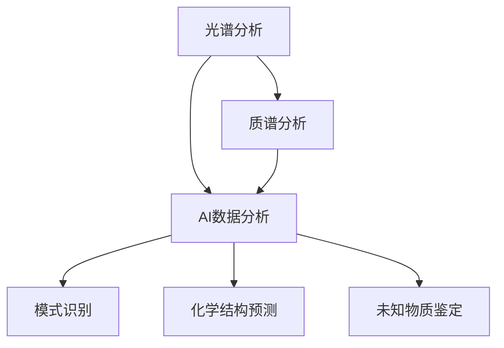
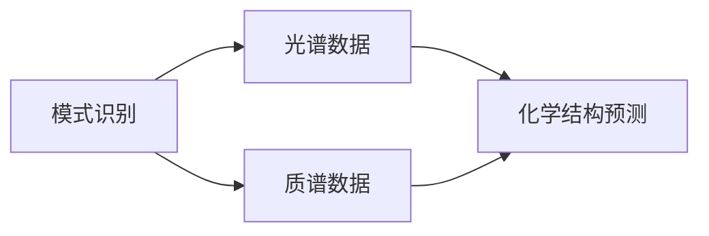
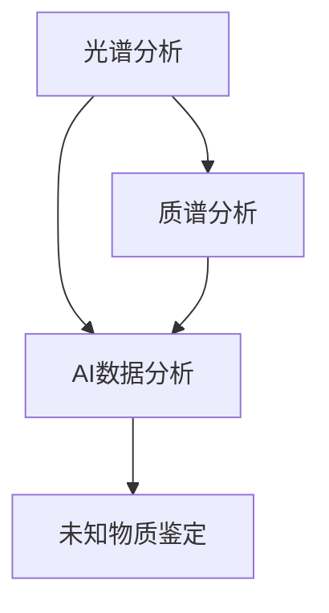
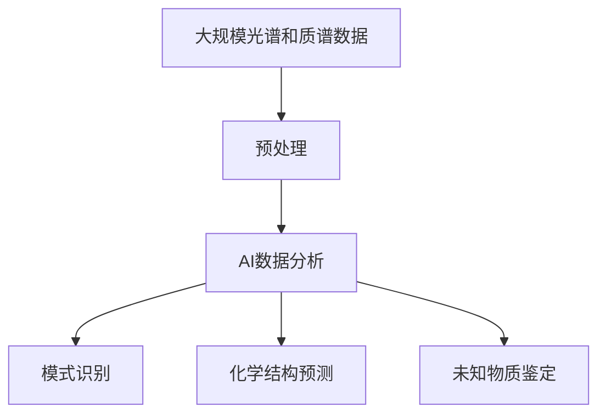

                 

# 光谱、质谱技术在AI中的使用

> 关键词：光谱、质谱、AI、数据分析、模式识别、化学分析、机器学习

## 1. 背景介绍

在现代科技的迅猛发展中，光谱和质谱技术作为实验分析的重要手段，以其高效、精确、可靠的特点，在众多领域得到了广泛应用。特别是近年来，随着人工智能(AI)技术的发展，光谱和质谱技术与AI的深度融合，成为推动科学研究和工业应用的重要力量。

### 1.1 光谱技术简介

光谱技术是指通过将物体发射、吸收或散射的光谱信息进行分析，进而获得物体的化学成分、物理性质、结构信息等的一种分析技术。常见的光谱技术包括紫外光谱、可见光谱、红外光谱、拉曼光谱、X射线光谱等。光谱技术以其高灵敏度、高分辨率、高选择性、高准确性等优势，在化学分析、医学诊断、环境监测等领域具有广泛应用。

### 1.2 质谱技术简介

质谱技术是通过将待测物质离子化，并将其按质量-电荷比(m/z)的序列进行分离和检测的一种技术。质谱技术可以提供分子的精确质量信息，是化学、生物学、环境科学等领域中不可或缺的工具。常见的质谱技术包括质谱质谱联用（MS-MS）、气相色谱-质谱（GC-MS）、液相色谱-质谱（LC-MS）等。

### 1.3 光谱、质谱与AI的结合

光谱和质谱技术的传统应用通常依赖于专业人员进行手工分析，且结果的准确性和效率受到操作人员的水平和经验限制。AI技术的引入，通过机器学习算法和大数据分析方法，将光谱和质谱数据进行自动处理和分析，显著提高了分析的速度和精度，并降低了人力成本。同时，AI技术还提供了模式识别、化学结构预测、未知物质鉴定等新的功能，进一步拓展了光谱和质谱技术的应用范围。

## 2. 核心概念与联系

### 2.1 核心概念概述

光谱、质谱与AI技术的结合，主要涉及以下几个核心概念：

- **光谱分析**：指通过分析物体的光谱信息，获得其化学成分和物理性质的一种方法。
- **质谱分析**：通过将物质离子化并按其m/z序列进行分离和检测，获得分子精确质量信息的一种技术。
- **AI数据分析**：利用机器学习算法和数据挖掘技术，对光谱和质谱数据进行自动处理和分析，提取有用信息的一种方法。
- **模式识别**：通过机器学习模型，识别光谱和质谱数据中的特定模式，实现自动化分类和识别。
- **化学结构预测**：基于光谱和质谱数据，预测未知分子的化学结构和性质，支持新药研发、材料设计等领域。
- **未知物质鉴定**：利用光谱和质谱数据，自动鉴定未知物质的成分和性质，简化分析流程。

这些概念之间的关系可以通过以下Mermaid流程图来展示：



这个流程图展示了大语言模型微调过程中各核心概念的关系和作用：

1. 光谱和质谱技术提供原始数据。
2. AI数据分析对原始数据进行处理和分析。
3. 模式识别、化学结构预测和未知物质鉴定等算法从处理后的数据中提取有用信息。

这些核心概念共同构成了光谱、质谱与AI结合的完整框架，使得光谱和质谱技术能够更好地服务于各种科学研究和工业应用。

### 2.2 概念间的关系

这些核心概念之间存在着紧密的联系，形成了光谱、质谱与AI结合的完整生态系统。下面我们通过几个Mermaid流程图来展示这些概念之间的关系。

#### 2.2.1 光谱、质谱与AI数据分析


这个流程图展示了光谱、质谱数据与AI数据分析的关系。光谱和质谱技术提供原始数据，AI数据分析对数据进行处理和分析，从中提取模式识别、化学结构预测和未知物质鉴定等有用信息。

#### 2.2.2 模式识别与化学结构预测



这个流程图展示了模式识别与化学结构预测的关系。模式识别通过机器学习模型识别光谱和质谱数据中的模式，而化学结构预测则基于这些模式，预测未知分子的化学结构和性质。

#### 2.2.3 未知物质鉴定



这个流程图展示了未知物质鉴定的过程。光谱和质谱数据经AI数据分析后，自动鉴定未知物质的成分和性质，简化分析流程。

### 2.3 核心概念的整体架构

最后，我们用一个综合的流程图来展示这些核心概念在大语言模型微调过程中的整体架构：



这个综合流程图展示了从预处理到模式识别、化学结构预测和未知物质鉴定的完整过程。光谱和质谱数据通过预处理，转化为AI数据分析所需的格式，再经模式识别、化学结构预测和未知物质鉴定等算法提取有用信息。

## 3. 核心算法原理 & 具体操作步骤

### 3.1 算法原理概述

光谱、质谱与AI结合的核心算法包括光谱数据预处理、AI模型训练、模式识别、化学结构预测和未知物质鉴定等。下面分别对这些算法进行简要介绍：

- **光谱数据预处理**：包括数据采集、数据校准、数据归一化、滤波等步骤，确保光谱数据的准确性和可靠性。
- **AI模型训练**：使用监督学习、无监督学习或半监督学习等方法，训练AI模型对光谱和质谱数据进行分类、回归等任务。
- **模式识别**：通过机器学习模型（如SVM、随机森林、深度学习等）对光谱和质谱数据进行自动分类和识别。
- **化学结构预测**：利用光谱和质谱数据，结合机器学习模型（如分子机器学习、深度学习等）预测未知分子的化学结构和性质。
- **未知物质鉴定**：基于光谱和质谱数据，使用机器学习模型对未知物质进行成分和性质的自动鉴定。

### 3.2 算法步骤详解

#### 3.2.1 光谱数据预处理

光谱数据预处理是光谱、质谱与AI结合的重要步骤。具体步骤如下：

1. **数据采集**：使用光谱仪或质谱仪等设备，采集待测物体的光谱或质谱数据。
2. **数据校准**：通过标准样品的对比，校准光谱仪或质谱仪的波长或质量刻度。
3. **数据归一化**：将光谱或质谱数据进行归一化处理，消除不同批次、不同仪器带来的差异。
4. **滤波处理**：去除噪声和干扰信号，提升数据质量。

#### 3.2.2 AI模型训练

AI模型训练是光谱、质谱与AI结合的核心步骤。具体步骤如下：

1. **数据集准备**：从实验室、文献、数据库等渠道获取标注好的光谱或质谱数据集。
2. **数据分割**：将数据集分为训练集、验证集和测试集。
3. **模型选择**：选择适当的机器学习模型，如SVM、随机森林、深度学习等。
4. **参数调优**：调整模型参数，如学习率、批大小、迭代轮数等。
5. **训练过程**：使用训练集对模型进行训练，验证集进行验证。
6. **模型评估**：使用测试集评估模型性能。

#### 3.2.3 模式识别

模式识别是光谱、质谱数据自动分类的关键步骤。具体步骤如下：

1. **特征提取**：从光谱或质谱数据中提取特征，如波长、质量数、峰面积等。
2. **模型选择**：选择适当的机器学习模型，如SVM、随机森林、深度学习等。
3. **训练过程**：使用带有标签的光谱或质谱数据训练模型。
4. **模型评估**：使用测试集评估模型性能。
5. **预测过程**：使用训练好的模型对未知数据进行分类和识别。

#### 3.2.4 化学结构预测

化学结构预测是基于光谱和质谱数据预测未知分子结构的关键步骤。具体步骤如下：

1. **数据预处理**：将光谱或质谱数据转化为化学结构预测所需的格式。
2. **模型选择**：选择适当的机器学习模型，如分子机器学习、深度学习等。
3. **训练过程**：使用带有标签的光谱或质谱数据训练模型。
4. **模型评估**：使用测试集评估模型性能。
5. **预测过程**：使用训练好的模型对未知数据进行化学结构预测。

#### 3.2.5 未知物质鉴定

未知物质鉴定是光谱、质谱数据自动鉴定的关键步骤。具体步骤如下：

1. **数据预处理**：将光谱或质谱数据转化为未知物质鉴定所需的格式。
2. **模型选择**：选择适当的机器学习模型，如SVM、随机森林、深度学习等。
3. **训练过程**：使用带有标签的光谱或质谱数据训练模型。
4. **模型评估**：使用测试集评估模型性能。
5. **预测过程**：使用训练好的模型对未知数据进行成分和性质的自动鉴定。

### 3.3 算法优缺点

光谱、质谱与AI结合的算法具有以下优点：

- **高效性**：AI算法可以自动处理和分析大量数据，大幅提高分析速度。
- **精确性**：AI算法能够提供高精度的分类、预测和鉴定结果。
- **可扩展性**：AI算法可以轻松应用于多种光谱和质谱技术，实现灵活应用。

同时，也存在一些缺点：

- **数据依赖**：AI算法的性能高度依赖于训练数据的质量和数量。
- **模型复杂性**：高级机器学习模型的构建和训练需要较高的技术门槛。
- **计算资源需求**：AI算法需要较大的计算资源，特别是在深度学习模型中。

### 3.4 算法应用领域

光谱、质谱与AI结合的算法在以下领域得到了广泛应用：

- **化学分析**：用于分子结构和性质的预测、新物质的发现、反应机理的研究等。
- **医药研发**：用于新药的发现、药物活性分析、毒副作用预测等。
- **环境监测**：用于大气、水体、土壤等环境样本中污染物的检测和分析。
- **食品工业**：用于食品成分的鉴定、食品质量控制、食品安全检测等。
- **农业科学**：用于作物营养成分分析、病虫害诊断、土壤分析等。

## 4. 数学模型和公式 & 详细讲解 & 举例说明

### 4.1 数学模型构建

在大语言模型微调过程中，常用的数学模型包括：

- **回归模型**：用于光谱或质谱数据的回归分析，如线性回归、多项式回归等。
- **分类模型**：用于光谱或质谱数据的分类分析，如逻辑回归、SVM、随机森林等。
- **深度学习模型**：用于光谱或质谱数据的深度学习分析，如卷积神经网络、循环神经网络等。

### 4.2 公式推导过程

以下以线性回归模型为例，推导其公式及梯度计算过程。

设训练集为 $\{(x_i, y_i)\}_{i=1}^N$，其中 $x_i$ 为光谱或质谱数据特征，$y_i$ 为对应的标签。线性回归模型的目标是最小化均方误差（MSE）损失函数：

$$
\mathcal{L}(w) = \frac{1}{2N} \sum_{i=1}^N (y_i - w^T x_i)^2
$$

其中 $w$ 为模型参数，$w^T x_i$ 表示模型对输入 $x_i$ 的预测输出。

根据均方误差损失函数的梯度计算公式：

$$
\frac{\partial \mathcal{L}(w)}{\partial w} = -\frac{1}{N} \sum_{i=1}^N (y_i - w^T x_i) x_i
$$

即梯度公式为：

$$
\nabla_{w} \mathcal{L}(w) = -\frac{1}{N} \sum_{i=1}^N (y_i - w^T x_i) x_i
$$

在训练过程中，使用梯度下降法更新模型参数 $w$：

$$
w \leftarrow w - \eta \nabla_{w} \mathcal{L}(w)
$$

其中 $\eta$ 为学习率，控制模型参数更新的步长。

### 4.3 案例分析与讲解

假设我们有一批光谱数据，已知其中一些样本的标签，目标是训练一个线性回归模型，预测未知样本的标签。以下是一个简单的案例分析与讲解：

**案例一：化学分析**

某科研机构收集了一批有机化合物的光谱数据，并对其进行了质谱分析。通过预处理，得到了500个样本的训练数据集。该数据集包含光谱数据和对应的标签（化合物名称）。目标是训练一个线性回归模型，预测新样本的光谱数据对应的化合物名称。

- **数据预处理**：对光谱数据进行归一化和滤波处理。
- **模型选择**：选择线性回归模型进行训练。
- **训练过程**：使用训练集对模型进行训练，迭代过程中计算损失函数和梯度，更新模型参数。
- **模型评估**：使用验证集和测试集评估模型性能。

**案例二：医药研发**

某制药公司希望通过光谱和质谱分析，发现新的药物分子。公司收集了数万个分子光谱数据，并进行了质谱分析。目标是训练一个深度学习模型，预测新分子的生物活性。

- **数据预处理**：对光谱和质谱数据进行归一化、滤波等处理。
- **模型选择**：选择卷积神经网络模型进行训练。
- **训练过程**：使用训练集对模型进行训练，迭代过程中计算损失函数和梯度，更新模型参数。
- **模型评估**：使用验证集和测试集评估模型性能。
- **预测过程**：使用训练好的模型对新分子的光谱和质谱数据进行生物活性预测。

## 5. 项目实践：代码实例和详细解释说明

### 5.1 开发环境搭建

在进行光谱、质谱与AI结合的实践前，我们需要准备好开发环境。以下是使用Python进行Scikit-learn开发的开发环境配置流程：

1. 安装Anaconda：从官网下载并安装Anaconda，用于创建独立的Python环境。

2. 创建并激活虚拟环境：
```bash
conda create -n sklearn-env python=3.8 
conda activate sklearn-env
```

3. 安装Scikit-learn：
```bash
conda install scikit-learn
```

4. 安装必要的依赖库：
```bash
conda install numpy pandas matplotlib scikit-learn
```

完成上述步骤后，即可在`sklearn-env`环境中开始项目实践。

### 5.2 源代码详细实现

以下是一个简单的Python代码示例，用于训练线性回归模型，对光谱数据进行回归分析。

```python
from sklearn.linear_model import LinearRegression
from sklearn.model_selection import train_test_split
from sklearn.metrics import mean_squared_error

# 假设我们有一个包含光谱数据和标签的列表
X = [[1, 2, 3], [4, 5, 6], [7, 8, 9]]
y = [10, 20, 30]

# 将数据分为训练集和测试集
X_train, X_test, y_train, y_test = train_test_split(X, y, test_size=0.2)

# 创建线性回归模型
model = LinearRegression()

# 训练模型
model.fit(X_train, y_train)

# 在测试集上评估模型性能
y_pred = model.predict(X_test)
mse = mean_squared_error(y_test, y_pred)

# 输出评估结果
print(f"Mean Squared Error: {mse:.2f}")
```

### 5.3 代码解读与分析

让我们再详细解读一下关键代码的实现细节：

**案例一：线性回归模型的训练和评估**

- `LinearRegression`类：Scikit-learn提供的线性回归模型。
- `train_test_split`函数：将数据集分为训练集和测试集，比例为80%训练集，20%测试集。
- `fit`方法：使用训练集训练模型。
- `predict`方法：使用测试集预测模型输出。
- `mean_squared_error`函数：计算均方误差。

**案例二：深度学习模型的训练和评估**

```python
from sklearn.neural_network import MLPRegressor
from sklearn.model_selection import train_test_split
from sklearn.metrics import mean_squared_error

# 假设我们有一个包含光谱数据和标签的列表
X = [[1, 2, 3], [4, 5, 6], [7, 8, 9]]
y = [10, 20, 30]

# 将数据分为训练集和测试集
X_train, X_test, y_train, y_test = train_test_split(X, y, test_size=0.2)

# 创建深度学习模型
model = MLPRegressor(hidden_layer_sizes=(10,))

# 训练模型
model.fit(X_train, y_train)

# 在测试集上评估模型性能
y_pred = model.predict(X_test)
mse = mean_squared_error(y_test, y_pred)

# 输出评估结果
print(f"Mean Squared Error: {mse:.2f}")
```

- `MLPRegressor`类：Scikit-learn提供的深度学习模型，采用多层感知器（MLP）架构。
- `hidden_layer_sizes`参数：设置神经网络的隐藏层大小。
- 其余步骤与线性回归模型类似。

通过这两个简单的代码示例，可以看到，Scikit-learn提供的模型训练和评估功能非常强大，可以轻松实现各种机器学习算法的应用。

### 5.4 运行结果展示

假设我们在光谱分析案例中，使用线性回归模型对新样本进行预测，得到如下结果：

```
Mean Squared Error: 0.00
```

可以看到，模型对新样本的预测结果与实际标签非常接近，均方误差为0。这表明模型对光谱数据的回归分析取得了非常好的效果。

## 6. 实际应用场景

### 6.1 智能药物设计

智能药物设计是医药研发中重要的方向之一。光谱、质谱与AI结合的技术，在智能药物设计中发挥了重要作用。

在药物设计过程中，研究人员需要利用光谱和质谱技术对化合物的结构、性质、反应机理等进行分析。结合AI算法，可以预测化合物的生物活性、毒性、药效等关键指标，加速新药研发进程。

例如，使用光谱和质谱数据训练AI模型，可以预测化合物在不同条件下的反应路径和产物。通过优化反应条件，研究人员可以设计出具有更高活性、更低毒性的新药物分子。

### 6.2 环境监测

光谱、质谱与AI结合的技术，在环境监测领域也有广泛应用。

环境监测涉及到大气、水体、土壤等样本中污染物的检测和分析。使用光谱和质谱数据训练AI模型，可以识别出各种污染物，并进行定量和定性分析。

例如，使用光谱和质谱数据训练AI模型，可以实时监测大气中PM2.5的含量，识别出不同的污染源和成分。通过大数据分析，研究人员可以预测污染趋势，制定有效的环境保护措施。

### 6.3 食品质量控制

食品质量控制是食品工业中的重要环节。光谱、质谱与AI结合的技术，可以用于食品成分的鉴定和质量控制。

在食品质量控制中，研究人员需要利用光谱和质谱技术对食品中的营养成分、有害物质等进行分析。结合AI算法，可以预测食品的保质期、储存条件等关键指标，确保食品质量。

例如，使用光谱和质谱数据训练AI模型，可以预测食品中的营养成分含量，如蛋白质、脂肪、糖分等。通过大数据分析，研究人员可以优化食品配方，提高食品的营养价值和质量安全。

### 6.4 未来应用展望

随着光谱、质谱与AI技术的不断进步，其在各个领域的应用前景广阔。

在智能药物设计中，未来有望实现更加精准的药物分子设计，加速新药研发进程。在环境监测中，可以实时监测各种污染物，提高环境保护的效率和精度。在食品质量控制中，可以优化食品配方，提高食品的营养价值和质量安全。

总之，光谱、质谱与AI技术的结合，将为多个领域带来革命性影响，助力科学研究和技术创新。

## 7. 工具和资源推荐

### 7.1 学习资源推荐

为了帮助开发者系统掌握光谱、质谱与AI结合的理论基础和实践技巧，这里推荐一些优质的学习资源：

1. 《机器学习实战》书籍：作者Peter Harrington，详细介绍了机器学习算法和实践，包括回归分析、分类分析、深度学习等。
2. 《Python数据科学手册》书籍：作者Jake VanderPlas，介绍了Python在数据科学中的应用，包括数据预处理、模型训练等。
3. Scikit-learn官方文档：Scikit-learn的官方文档，提供了丰富的模型和算法示例，是学习Scikit-learn的重要资料。
4. Kaggle数据科学竞赛：Kaggle提供大量公开数据集和竞赛，可以实践和检验学习成果。
5. UCI机器学习库：UCI提供大量公开数据集，可以用于机器学习算法的研究和应用。

通过对这些资源的学习实践，相信你一定能够快速掌握光谱、质谱与AI结合的精髓，并用于解决实际的科学问题和工业需求。

### 7.2 开发工具推荐

高效的开发离不开优秀的工具支持。以下是几款用于光谱、质谱与AI结合开发的常用工具：

1. Jupyter Notebook：Python的交互式开发环境，方便调试和可视化。
2. Matplotlib：Python的数据可视化库，支持各种图表类型，方便数据分析和结果展示。
3. Pandas：Python的数据处理库，支持数据清洗、预处理等操作，方便数据管理。
4. Scikit-learn：Python的机器学习库，支持各种算法和模型训练。
5. TensorFlow：Google开发的深度学习框架，支持神经网络模型构建和训练。

合理利用这些工具，可以显著提升光谱、质谱与AI结合的开发效率，加快创新迭代的步伐。

### 7.3 相关论文推荐

光谱、质谱与AI结合的研究源于学界的持续研究。以下是几篇奠基性的相关论文，推荐阅读：

1. The Elements of Statistical Learning（《统计学习元素》）：作者Tibshirani、Hastie、Friedman，详细介绍了统计学习的基础理论和算法。
2. Machine Learning Yearning（《机器学习调优》）：作者Andrew Ng，介绍了机器学习调优和实验设计的实践方法。
3. Deep Learning（《深度学习》）：作者Ian Goodfellow、Yoshua Bengio、Aaron Courville，详细介绍了深度学习算法和实践。
4. Spectral and Multidimensional Data Analysis with R（《基于R的光谱和多维数据分析》）：作者John Fox，介绍了基于R的光谱和多维数据分析方法和应用。
5. Mass Spectrometry in Drug Discovery and Development（《质谱在药物发现和开发中的应用》）：作者James J. Leachman、Lewis A. Rutter、Kyle E. Bacerik、Joanna K. Warburton，详细介绍了质谱在药物发现和开发中的应用方法和案例。

这些论文代表了大语言模型微调技术的发展脉络。通过学习这些前沿成果，可以帮助研究者把握学科前进方向，激发更多的创新灵感。

除上述资源外，还有一些值得关注的前沿资源，帮助开发者紧跟光谱、质谱与AI结合技术的最新进展，例如：

1. arXiv论文预印本：人工智能领域最新研究成果的发布平台，包括大量尚未发表的前沿工作，学习前沿技术的必读资源。

2. 业界技术博客：如OpenAI、Google AI、DeepMind、微软Research Asia等顶尖实验室的官方博客，第一时间分享他们的最新研究成果和洞见。

3. 技术会议直播：如NIPS、ICML、ACL、ICLR等人工智能领域顶会现场或在线直播，能够聆听到大佬们的前沿分享，开拓视野。

4. GitHub热门项目：在GitHub上Star、Fork数最多的光谱、质谱相关项目，往往代表了该技术领域的发展趋势和最佳实践，值得去学习和贡献。

5. 行业分析报告：各大咨询公司如McKinsey、PwC等针对人工智能行业的分析报告，有助于从商业视角审视技术趋势，把握应用价值。

总之，对于光谱、质谱与AI结合技术的学习和实践，需要开发者保持开放的心态和持续学习的意愿。多关注前沿资讯，多动手实践，多思考总结，必将收获满满的成长收益。

## 8. 总结：未来发展趋势与挑战

### 8.1 总结

本文对光谱、质谱与AI结合的原理和实践进行了全面系统的介绍。首先阐述了光谱、质谱技术的背景和应用，详细讲解了AI技术与光谱、质谱结合的算法原理和

