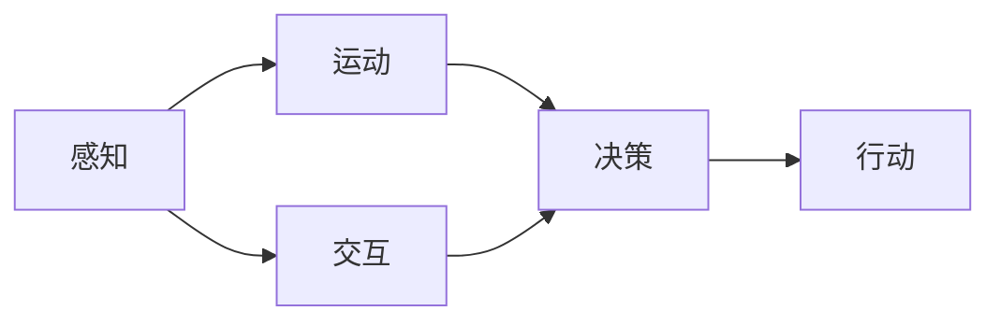

                 

## 1. 背景介绍

随着人工智能技术的飞速发展，尤其是深度学习技术的广泛应用，"具身智能"（Embodied Intelligence）的概念逐渐受到重视。具身智能强调将智能体（如机器人、智能设备）置于客观世界中，通过与环境的交互学习和适应，实现更高效、更灵活的决策和行动。这一范式突破了传统AI研究的边界，为AI技术在现实世界的应用提供了新的视角和方法。

在客观世界中，智能体不仅要处理大量的文本和数据，还需要与物理世界的交互，如感知、运动、交互等。这种"具身"的特性，使得具身智能在理解、决策和行动方面展现出与纯符号处理不同的优势。本文将从具身智能的概念出发，探讨其核心原理、实现步骤及应用场景，为未来AI技术的创新提供新的思路。

## 2. 核心概念与联系

### 2.1 核心概念概述

具身智能（Embodied Intelligence）是指将智能体置于真实世界中，通过感知、运动和交互，从环境中学习并适应新情境的能力。具身智能不仅关注符号层面的理解，更重视智能体在客观世界中的具身经验，以及基于这些经验进行决策和行动的能力。

1. **感知（Perception）**：智能体通过传感器（如摄像头、雷达、超声波等）获取环境信息，并通过算法对这些信息进行解读，以形成对环境的初步认知。
2. **运动（Motion）**：智能体通过执行器（如电机、关节等）进行移动和交互，从而对环境进行探索和适应。
3. **交互（Interaction）**：智能体通过与环境中的其他实体（如人、物、机器等）进行交互，获取反馈信息，以进一步调整决策和行动。

这些概念之间的联系可以通过以下Mermaid流程图来展示：



该流程图展示了感知、运动、交互、决策和行动之间的关系。感知获取环境信息，运动和交互与环境互动，决策基于感知和交互信息进行，行动则依据决策结果执行。这种多层次的相互作用，构成了具身智能的核心机制。

### 2.2 核心概念间的关系

具身智能中的感知、运动和交互三个核心概念之间有着紧密的联系，通过感知获取环境信息，运动和交互与之相互作用，最终反馈到决策和行动中，形成一个动态闭环。下面通过两个Mermaid流程图来进一步说明。

#### 2.2.1 感知-交互关系


该流程图展示了感知与交互之间的双向关系。感知获取环境信息后，智能体通过交互进行行动，而交互的反馈信息又会对感知进行进一步的调整和优化。这种动态交互过程，使智能体能够更准确地理解环境，做出更合理的决策。

#### 2.2.2 运动-交互关系


该流程图展示了运动与交互之间的双向关系。智能体通过运动进行探索和适应，而交互的反馈信息又会调整运动的策略和方式，从而形成更有效的运动方案。这种动态调整过程，使智能体能够更灵活地应对复杂环境。

## 3. 核心算法原理 & 具体操作步骤

### 3.1 算法原理概述

具身智能的核心算法原理主要涉及感知、运动和交互的动态闭环学习。其核心思想是通过与环境的交互，不断调整智能体的感知、运动和决策策略，以适应新的环境需求。具身智能的算法原理可以分为以下几个步骤：

1. **感知模块**：通过传感器获取环境信息，并将其转化为数字信号。
2. **运动模块**：根据感知信息，智能体执行相应的运动指令，改变自身状态。
3. **交互模块**：智能体通过执行器与环境进行交互，获取反馈信息。
4. **决策模块**：基于感知和交互信息，智能体进行决策，生成行动指令。
5. **行动模块**：智能体执行决策指令，更新自身状态，并继续感知、运动和交互循环。

### 3.2 算法步骤详解

具体来说，具身智能的算法实现步骤如下：

1. **数据预处理**：将环境传感器获取的数据进行清洗和处理，转化为可输入模型的格式。
2. **模型训练**：使用深度学习模型（如卷积神经网络、递归神经网络等）对感知和运动数据进行建模。
3. **交互优化**：通过强化学习等方法，优化智能体的交互行为，使其能够更好地适应环境。
4. **决策规划**：结合感知和交互信息，使用决策树、贝叶斯网络等算法进行决策规划。
5. **执行与反馈**：智能体执行决策，并获取反馈信息，用于调整感知、运动和决策策略。

### 3.3 算法优缺点

具身智能的算法具有以下优点：

1. **实时性**：由于智能体直接与环境交互，能够即时获取反馈信息，进行实时决策。
2. **适应性**：智能体能够根据环境的变化，动态调整感知、运动和决策策略，适应复杂多变的环境。
3. **鲁棒性**：通过与环境的不断交互和反馈，智能体的决策能力能够逐步增强，具有较强的鲁棒性。

同时，具身智能的算法也存在一些缺点：

1. **数据需求高**：由于智能体需要与环境交互，获取反馈信息，因此对环境数据的质量和量有较高要求。
2. **计算复杂度高**：实时感知、运动和决策的计算复杂度高，需要高性能的硬件支持。
3. **模型训练难度大**：智能体的感知和运动模型训练复杂，需要大量样本和计算资源。

### 3.4 算法应用领域

具身智能的应用领域广泛，包括机器人控制、自动驾驶、智能家居、医疗辅助等领域。以下是一些具体的应用场景：

1. **机器人控制**：在工业、农业和家庭服务等领域，机器人能够通过具身智能进行自主导航、操作和维护。例如，自动驾驶汽车、家庭清洁机器人等。
2. **自动驾驶**：智能车辆通过具身智能感知交通环境，进行自主决策和导航。例如，特斯拉的Autopilot系统、谷歌的Waymo等。
3. **智能家居**：智能家居设备通过具身智能实现环境感知和自动化控制，例如智能音箱、智能门锁等。
4. **医疗辅助**：医疗机器人通过具身智能进行手术操作、患者监护和康复训练，提高医疗效率和精准度。例如，达芬奇手术机器人、康复训练机器人等。

## 4. 数学模型和公式 & 详细讲解 & 举例说明

### 4.1 数学模型构建

具身智能的核心数学模型可以概括为以下几个部分：

1. **感知模型**：用于建模环境传感器的输出，通常使用卷积神经网络（CNN）或递归神经网络（RNN）。
2. **运动模型**：用于建模智能体的运动行为，通常使用LSTM、GRU等序列模型。
3. **交互模型**：用于建模智能体与环境之间的交互行为，通常使用强化学习模型。
4. **决策模型**：用于建模智能体的决策过程，通常使用决策树、贝叶斯网络等算法。
5. **行动模型**：用于建模智能体的执行过程，通常使用神经网络进行动作选择。

### 4.2 公式推导过程

以一个简单的具身智能系统为例，其数学模型可以表示为：

1. **感知模型**：
   $$
   h^i = f^i(\text{sensor}_i)
   $$
   其中，$h^i$ 表示感知模型第 $i$ 层的输出，$\text{sensor}_i$ 表示第 $i$ 层的输入数据，$f^i$ 表示感知模型的激活函数。

2. **运动模型**：
   $$
   a = g(\text{decision})
   $$
   其中，$a$ 表示智能体的运动指令，$\text{decision}$ 表示决策模型输出。

3. **交互模型**：
   $$
   r = h(\text{state}, a)
   $$
   其中，$r$ 表示智能体与环境交互的反馈，$\text{state}$ 表示智能体的当前状态，$h$ 表示交互模型的输出函数。

4. **决策模型**：
   $$
   \text{decision} = d(h^1, h^2, ..., h^n)
   $$
   其中，$d$ 表示决策模型的映射函数，$h^1, h^2, ..., h^n$ 表示不同层的感知模型输出。

5. **行动模型**：
   $$
   o = \pi(a, r)
   $$
   其中，$o$ 表示智能体的行动指令，$\pi$ 表示行动模型，$a$ 和 $r$ 分别为运动指令和交互反馈。

### 4.3 案例分析与讲解

以自动驾驶为例，其具身智能系统的构建和运行可以大致分为以下几个步骤：

1. **感知模块**：通过摄像头、雷达等传感器获取道路、交通灯、行人和车辆等信息。
2. **运动模块**：根据感知信息，智能体（汽车）通过执行器（如方向盘、油门、刹车等）调整自身状态。
3. **交互模块**：智能体与环境（道路、行人、车辆等）进行交互，获取反馈信息。
4. **决策模块**：基于感知和交互信息，智能体进行决策，生成行动指令。
5. **行动模块**：智能体执行决策指令，更新自身状态，并继续感知、运动和交互循环。

在实际应用中，自动驾驶系统会根据实时获取的感知信息，通过感知模型进行处理，得到道路和交通灯的状态；然后，通过决策模型进行决策规划，生成行动指令；最后，通过运动模型执行指令，更新自身状态。整个系统通过实时感知、运动和交互，不断调整决策和行动策略，以实现安全的自动驾驶。

## 5. 项目实践：代码实例和详细解释说明

### 5.1 开发环境搭建

构建具身智能系统的开发环境，需要安装Python、PyTorch、OpenCV、TensorFlow等常用库。以下是环境搭建的步骤：

1. **安装Python**：从官网下载并安装Python 3.x版本。
2. **安装PyTorch**：使用pip安装PyTorch，命令为：
   ```
   pip install torch torchvision torchaudio
   ```
3. **安装OpenCV**：使用pip安装OpenCV，命令为：
   ```
   pip install opencv-python
   ```
4. **安装TensorFlow**：使用pip安装TensorFlow，命令为：
   ```
   pip install tensorflow
   ```
5. **安装其他库**：根据需要安装其他常用库，如numpy、matplotlib、scikit-learn等。

完成环境搭建后，就可以开始编写具身智能系统的代码了。

### 5.2 源代码详细实现

以一个简单的机器人控制为例，展示具身智能系统的代码实现。

```python
import numpy as np
import cv2
import torch
import torchvision.transforms as transforms
from torchvision import models
from torch import nn

class Robot:
    def __init__(self):
        self.model = models.resnet18(pretrained=True)
        self.model.eval()
        self.image_transform = transforms.Compose([
            transforms.ToTensor(),
            transforms.Normalize(mean=[0.485, 0.456, 0.406], std=[0.229, 0.224, 0.225])
        ])
        self.motion = np.zeros(3)  # 初始化运动指令为0
        self.state = np.zeros(2)   # 初始化状态为0

    def detect(self, frame):
        frame_tensor = self.image_transform(frame).unsqueeze(0)
        with torch.no_grad():
            output = self.model(frame_tensor)
            _, predicted = torch.max(output, 1)
        return predicted.item()

    def interact(self, detected):
        if detected == 1:
            self.motion[0] = 0.1  # 向前移动
        else:
            self.motion[0] = -0.1  # 向后移动
        self.state = self.state + self.motion

    def decide(self, detected):
        if detected == 1:
            return 0  # 向左转向
        else:
            return 1  # 向右转向

    def act(self):
        action = self.decide(self.detect(frame))
        self.interact(action)
```

以上代码展示了机器人控制系统的核心逻辑：

1. **初始化**：加载预训练的ResNet模型，并设置初始的运动和状态。
2. **感知**：通过摄像头获取帧图像，并对其进行预处理，得到特征向量。
3. **决策**：基于感知结果，进行决策，生成行动指令。
4. **交互**：执行行动指令，更新智能体的状态。
5. **行动**：根据决策和交互结果，更新运动指令，进行下一次感知和交互。

### 5.3 代码解读与分析

以上代码中，`Robot`类表示一个简单的机器人控制系统的实现。其中，`detect`方法用于感知，`interact`方法用于交互，`decide`方法用于决策，`act`方法用于行动。

- **感知模块**：使用ResNet模型对摄像头获取的图像进行特征提取，得到感知结果。
- **决策模块**：根据感知结果，生成行动指令。
- **交互模块**：根据行动指令，更新智能体的状态。
- **行动模块**：根据决策和交互结果，更新运动指令，进行下一次感知和交互。

## 6. 实际应用场景

### 6.1 智能家居

智能家居设备通过具身智能实现环境感知和自动化控制，例如智能音箱、智能门锁等。智能音箱可以通过语音识别获取用户指令，进行音乐播放、天气查询等操作；智能门锁可以通过人脸识别或指纹识别，自动解锁，提高安全性和便利性。

### 6.2 医疗辅助

医疗机器人通过具身智能进行手术操作、患者监护和康复训练，提高医疗效率和精准度。例如，达芬奇手术机器人可以进行微创手术，提高手术的精确度和成功率；康复训练机器人可以协助患者进行康复训练，提高康复效果。

### 6.3 自动驾驶

智能车辆通过具身智能感知交通环境，进行自主决策和导航。例如，特斯拉的Autopilot系统、谷歌的Waymo等，通过摄像头、雷达等传感器获取道路、交通灯、行人和车辆等信息，进行实时决策和行动。

### 6.4 未来应用展望

未来，具身智能的应用将更加广泛，涵盖工业、农业、医疗、教育等多个领域。随着技术的不断进步，具身智能的感知、运动和决策能力将进一步提升，实现更加智能化、个性化的应用。例如，智能农业机器人可以根据土壤和气象数据，自动进行耕作和施肥；智能教育机器人可以根据学生的学习情况，进行个性化教学和辅导。

## 7. 工具和资源推荐

### 7.1 学习资源推荐

1. **《机器人学基础》**：这本书详细介绍了机器人控制、感知和决策的理论和实践，是理解具身智能的入门必读书籍。
2. **《强化学习》**：这本书是强化学习领域的经典教材，涵盖了许多具身智能中用到的强化学习算法。
3. **Coursera机器人学课程**：由斯坦福大学和UC Berkeley等知名高校开设的机器人学课程，内容丰富，涵盖具身智能的各个方面。
4. **Udacity机器人工程师纳米学位**：这是一门面向实际应用的机器人工程师课程，涵盖具身智能的实际应用案例。
5. **arXiv预印本**：在arXiv上可以获取最新的具身智能研究论文，了解最新的技术进展和研究热点。

### 7.2 开发工具推荐

1. **PyTorch**：支持动态计算图，适合进行具身智能系统的模型训练和推理。
2. **OpenCV**：用于处理摄像头和传感器获取的图像和视频数据。
3. **TensorFlow**：支持静态计算图，适合进行大规模深度学习模型的训练和部署。
4. **ROS（Robot Operating System）**：用于机器人系统集成和调试，支持多种传感器和执行器。

### 7.3 相关论文推荐

1. **"Sensor-rich multi-sensor perception and decision-making for autonomous mobile robotics"**：这篇文章详细介绍了多传感器融合技术在具身智能中的应用，是理解具身智能传感器的经典论文。
2. **"Deep reinforcement learning for intelligent autonomous driving"**：这篇文章研究了深度强化学习在自动驾驶中的应用，是具身智能在自动驾驶领域的经典研究。
3. **"Human-robot interaction through embodied cognition and neural networks"**：这篇文章探讨了具身智能在人类机器人交互中的应用，是理解具身智能的最新研究进展。

## 8. 总结：未来发展趋势与挑战

### 8.1 研究成果总结

本文介绍了具身智能的概念、原理和实现步骤，并展示了其在机器人控制、自动驾驶、医疗辅助等领域的实际应用。具身智能通过与环境的实时交互，提高了智能体的适应性和决策能力，具有广泛的应用前景。

### 8.2 未来发展趋势

未来，具身智能将朝着以下几个方向发展：

1. **多模态感知**：具身智能系统将融合多种传感器数据，如摄像头、雷达、超声波等，提高环境感知能力和决策精准度。
2. **深度学习融合**：具身智能系统将结合深度学习模型和强化学习算法，提升感知、决策和行动能力。
3. **人机交互**：具身智能系统将更加注重与人类用户的高效交互，提升系统的可理解性和可用性。
4. **自动化设计**：具身智能系统的设计和部署将更加自动化，减少人工干预和调试工作量。

### 8.3 面临的挑战

具身智能的发展也面临着诸多挑战：

1. **数据需求高**：具身智能系统需要大量的环境数据进行训练，获取和处理数据的成本较高。
2. **计算复杂度高**：实时感知、决策和行动的计算复杂度较高，需要高性能的硬件支持。
3. **环境复杂性**：实际应用环境复杂多变，具身智能系统需要具备较强的鲁棒性和适应性。
4. **安全性和可靠性**：具身智能系统需要具备高可靠性和安全性，避免系统故障和错误决策。

### 8.4 研究展望

未来，具身智能的研究将注重以下几个方面：

1. **多模态融合**：研究如何更好地融合多种传感器数据，提高环境感知能力和决策精准度。
2. **人机协同**：研究如何更好地实现人与智能体的高效交互，提升系统的可理解性和可用性。
3. **深度学习优化**：研究如何优化深度学习模型，提高感知、决策和行动能力。
4. **自动化设计**：研究如何实现具身智能系统的自动化设计和部署，减少人工干预和调试工作量。

## 9. 附录：常见问题与解答

**Q1: 具身智能和传统AI有什么区别？**

A: 具身智能强调将智能体置于客观世界中，通过与环境的交互学习和适应，实现更高效、更灵活的决策和行动。相比传统AI，具身智能更加注重智能体在客观世界中的具身经验，以及基于这些经验进行决策和行动的能力。

**Q2: 具身智能需要哪些传感器？**

A: 具身智能系统需要多种传感器，如摄像头、雷达、超声波等，用于获取环境信息。不同应用场景需要不同的传感器组合，例如自动驾驶需要摄像头、雷达和激光雷达，机器人控制需要摄像头、超声波和运动传感器。

**Q3: 具身智能的决策过程是怎样的？**

A: 具身智能的决策过程通常基于感知和交互信息，使用决策树、贝叶斯网络等算法进行决策规划，生成行动指令。决策过程需要综合考虑环境信息、智能体状态和历史行为，以做出合理的决策。

**Q4: 具身智能的挑战有哪些？**

A: 具身智能的发展面临着数据需求高、计算复杂度高、环境复杂性和安全性等挑战。解决这些挑战需要结合多种技术手段，如多模态融合、人机协同、深度学习优化和自动化设计等。

**Q5: 具身智能的未来发展方向是什么？**

A: 具身智能的未来发展方向包括多模态融合、深度学习优化、人机协同和自动化设计等。随着技术的不断进步，具身智能将实现更加智能化、个性化和自动化的应用。

---

作者：禅与计算机程序设计艺术 / Zen and the Art of Computer Programming

