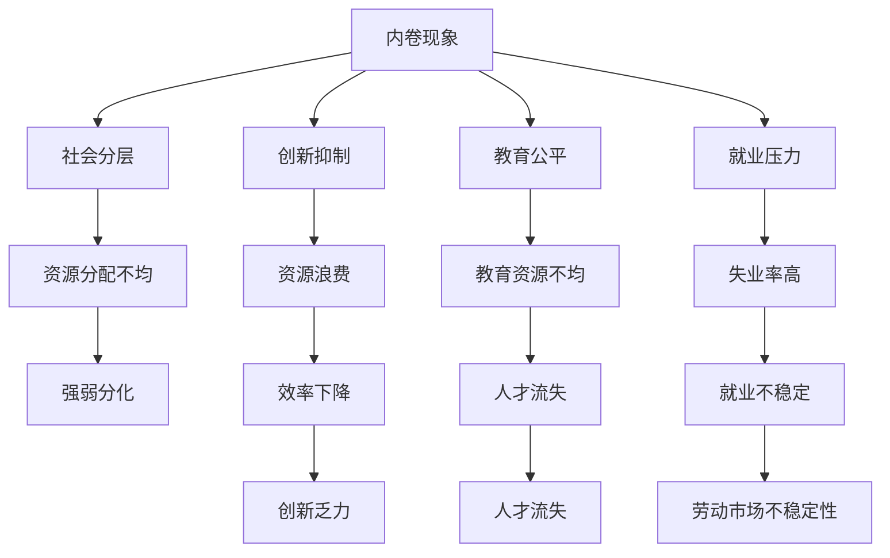
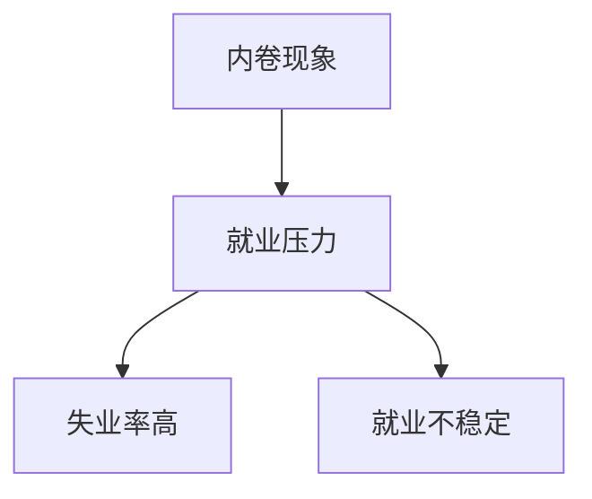
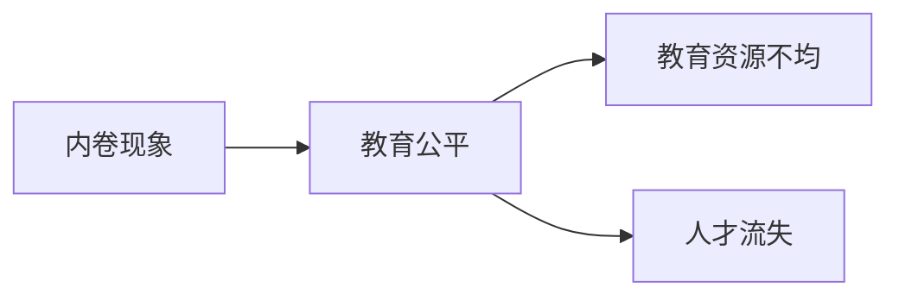
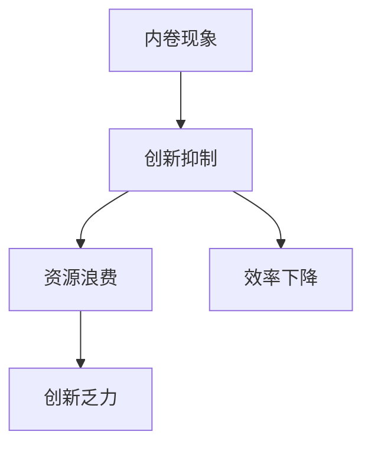

                 

# 内卷现象的长期经济影响

> 关键词：内卷现象, 经济影响, 社会分层, 创新抑制, 教育公平, 就业压力

## 1. 背景介绍

### 1.1 内卷现象概述
内卷（Intra-Mummification）是指在资源有限、竞争激烈的环境中，个体或群体为了争取稀缺资源，不得不进行低效竞争的现象。内卷现象不仅在学术界、企业界广泛存在，甚至渗透到了各个社会层面。
内卷现象通常表现为过度竞争、资源浪费、效率下降、创新不足等问题，对经济发展和社会稳定造成了深远影响。本文旨在深入探讨内卷现象的长期经济影响，并提出相应的应对策略。

### 1.2 内卷现象的现状与问题
内卷现象已渗透到各行各业，其负面影响不容忽视。以职场为例，企业内部的晋升竞争、跳槽压力、业绩考核等，都是内卷的具体表现。职场内卷不仅导致员工压力增大、心理负担加重，还阻碍了企业发展，造成资源浪费。此外，职场内卷还进一步加剧了社会不公平现象，导致人才流失和创新乏力。

## 2. 核心概念与联系

### 2.1 核心概念概述

为更好地理解内卷现象的长期经济影响，本节将介绍几个密切相关的核心概念：

- **内卷现象**：指在资源有限、竞争激烈的环境中，个体或群体为了争取稀缺资源，不得不进行低效竞争的现象。内卷现象普遍存在于学术界、企业界、教育界等多个领域。

- **社会分层**：指社会中不同群体或个人在经济、政治、教育等方面的地位差距。内卷现象往往加剧社会分层，导致资源分配不均，形成“强者恒强，弱者恒弱”的局面。

- **创新抑制**：指内卷现象导致的资源浪费、效率下降等问题，抑制了个体和群体的创新能力。内卷现象使得资源被分散在低效的竞争上，难以集中于创新和研发。

- **教育公平**：指所有个体都能获得公平、质量相等的教育机会。内卷现象破坏了教育公平，导致优质教育资源被少数人垄断，加剧了社会不公平。

- **就业压力**：指个体面临的就业竞争压力，内卷现象使得就业市场竞争激烈，导致失业率高、就业稳定性下降。

这些核心概念之间的逻辑关系可以通过以下Mermaid流程图来展示：



这个流程图展示的内卷现象的各个核心概念及其相互关系：

1. 内卷现象导致社会分层加剧。
2. 内卷抑制创新，导致资源浪费和效率下降。
3. 内卷破坏教育公平，导致优质教育资源分配不均。
4. 内卷增加就业压力，导致失业率高、就业不稳定。
5. 内卷现象加剧资源分配不均，导致强弱分化加剧。
6. 内卷抑制创新，导致创新乏力。
7. 内卷导致人才流失，加剧劳动市场不稳定性。

### 2.2 概念间的关系

这些核心概念之间存在着紧密的联系，形成了内卷现象的完整生态系统。下面我通过几个Mermaid流程图来展示这些概念之间的关系。

#### 2.2.1 内卷现象与就业压力的关系



这个流程图展示了内卷现象与就业压力的因果关系：内卷导致就业竞争激烈，失业率高，就业稳定性下降。

#### 2.2.2 内卷现象与教育公平的关系



这个流程图展示了内卷现象对教育公平的影响：内卷导致优质教育资源分配不均，加剧人才流失。

#### 2.2.3 内卷现象与创新抑制的关系



这个流程图展示了内卷现象对创新的影响：内卷导致资源被分散在低效竞争上，创新乏力。

### 2.3 核心概念的整体架构

最后，我们用一个综合的流程图来展示这些核心概念在内卷现象中的整体架构：


这个综合流程图展示了从内卷现象到各个核心概念的逻辑关系。通过这个架构，我们可以更清晰地理解内卷现象的深远影响及其背后的机制。

## 3. 核心算法原理 & 具体操作步骤
### 3.1 算法原理概述

内卷现象的长期经济影响是一个复杂的系统问题，涉及多方面的因素和变量。本文将从系统经济学的视角，简要阐述内卷现象的算法原理。

**系统经济学原理**：系统经济学是研究经济系统整体动态行为的学科。内卷现象可以看作是一个复杂经济系统中的一部分，其行为受到系统内部和外部的多重因素影响。

**内卷现象算法模型**：

- **资源有限假设**：内卷现象的发生基于资源有限，即生产要素如资本、劳动、技术等存在上限，难以满足所有人的需求。
- **竞争激烈假设**：资源有限导致个体和群体之间为了争夺资源进行激烈竞争。
- **低效竞争假设**：竞争手段和方式可能存在低效和不合理之处，导致资源被分散在低效的竞争上，而非投入创新和生产。

**长期影响模型**：

- **内卷加剧社会分层**：内卷现象导致资源分配不均，形成强者恒强、弱者恒弱的局面，加剧社会分层。
- **内卷抑制创新**：内卷现象抑制了个体和群体的创新能力，导致技术进步缓慢、生产力提升受限。
- **内卷破坏教育公平**：内卷现象破坏了教育公平，导致优质教育资源被少数人垄断，加剧人才流失。
- **内卷增加就业压力**：内卷现象增加就业竞争压力，导致失业率高、就业稳定性下降。

### 3.2 算法步骤详解

基于系统经济学的内卷现象模型，本文简要介绍其算法步骤：

**Step 1: 模型构建**

- **资源有限性**：定义系统中可用资源的总数，如资本、劳动、技术等。
- **竞争激烈性**：定义个体和群体之间的竞争强度，如就业市场的竞争程度、学术界的研究竞争程度等。
- **低效竞争性**：定义低效竞争的形式和程度，如通过非必要的工作时间加班、过度竞争等。

**Step 2: 参数设置**

- **初始资源配置**：设定初始状态下各类资源的配置比例。
- **竞争规则**：设定竞争的规则和条件，如就业市场竞争的优先级、学术研究的评审标准等。
- **低效竞争度量**：设定低效竞争的度量标准，如加班时间、项目失败率等。

**Step 3: 模拟与计算**

- **资源分配与竞争**：模拟资源在个体和群体之间的分配与竞争，计算各阶段的资源变化。
- **内卷程度计算**：计算内卷程度，如资源浪费率、创新能力下降率等。
- **社会分层计算**：计算社会分层变化，如贫富差距、教育资源分配不均等。

**Step 4: 结果分析**

- **内卷程度评估**：评估内卷现象的程度，如资源浪费率、创新抑制程度等。
- **社会分层影响**：分析内卷现象对社会分层的影响，如贫富差距、教育公平等。
- **经济影响评估**：评估内卷现象对经济系统的长期影响，如增长率下降、失业率上升等。

### 3.3 算法优缺点

基于系统经济学的内卷现象模型具有以下优点：

- **系统视角**：从整体系统视角出发，全面分析内卷现象的因果关系和影响因素。
- **多因素考量**：考虑了资源有限、竞争激烈、低效竞争等多重因素，全面反映了内卷现象的复杂性。
- **可解释性**：模型基于经济学的基本原理，具有较强的可解释性，便于理解和分析。

同时，该模型也存在一些局限性：

- **简化了因素**：模型假设资源有限、竞争激烈等，但实际系统中的因素可能更为复杂。
- **缺乏数据支持**：模型的参数设置和计算需要大量数据支持，但这些数据可能难以获取或不易量化。
- **动态变化**：系统中的因素可能随时间动态变化，模型的静态计算可能无法完全反映实际变化。

### 3.4 算法应用领域

内卷现象的算法模型具有广泛的应用前景，以下是几个典型应用领域：

- **宏观经济学**：分析内卷现象对经济增长、就业市场、收入分配等宏观经济指标的影响。
- **教育学**：研究内卷现象对教育资源分配、教育公平、人才培养等教育系统的影响。
- **社会学**：分析内卷现象对社会分层、社会公平、社会稳定等社会系统的影响。
- **企业管理**：分析内卷现象对企业内部竞争、人才流动、创新能力等企业管理指标的影响。

## 4. 数学模型和公式 & 详细讲解 & 举例说明

### 4.1 数学模型构建

为方便后续分析，本文将内卷现象的算法模型转化为数学模型。

假设经济系统中存在两种资源 $R_1$ 和 $R_2$，分别为资本和劳动。设资源总数为 $T$，初始分配比例为 $\alpha_1$ 和 $\alpha_2$，即 $R_1 = \alpha_1T$，$R_2 = \alpha_2T$。设个体 $i$ 对资源 $R_1$ 和 $R_2$ 的需求分别为 $D_{i1}$ 和 $D_{i2}$。设个体 $i$ 的竞争力为 $C_i$，竞争规则为 $C_i \propto D_{i1} + D_{i2}$。设低效竞争度量为 $E_i$，竞争激烈程度为 $F$。

### 4.2 公式推导过程

内卷现象的数学模型可以表示为以下方程组：

1. **资源分配方程**：
   $$
   \begin{aligned}
   R_1^{t+1} &= \sum_{i=1}^N \alpha_1 D_{i1}^t \\
   R_2^{t+1} &= \sum_{i=1}^N \alpha_2 D_{i2}^t
   \end{aligned}
   $$

2. **竞争力演化方程**：
   $$
   C_i^{t+1} = C_i^t + \eta C_i^t F^t
   $$
   其中 $\eta$ 为竞争力增长系数。

3. **低效竞争度量方程**：
   $$
   E_i^{t+1} = E_i^t + \delta E_i^t F^t
   $$
   其中 $\delta$ 为低效竞争度量增长系数。

4. **竞争激烈程度演化方程**：
   $$
   F^{t+1} = F^t - \gamma F^t \sum_{i=1}^N C_i^t
   $$
   其中 $\gamma$ 为竞争激烈程度衰减系数。

### 4.3 案例分析与讲解

考虑一个简单的经济系统，其中资本 $R_1$ 和劳动 $R_2$ 分别为10和20，个体 $i$ 对资源的需求分别为 $D_{i1}=5$ 和 $D_{i2}=3$。假设初始资源分配比例为 $\alpha_1=0.5$ 和 $\alpha_2=0.5$，竞争力增长系数 $\eta=0.1$，低效竞争度量增长系数 $\delta=0.2$，竞争激烈程度衰减系数 $\gamma=0.2$。

设个体 $i$ 的竞争力为 $C_i$，低效竞争度量为 $E_i$，竞争激烈程度为 $F$，初始值分别为 $C_i^0=1$，$E_i^0=0$，$F^0=1$。模拟5个时间步，计算资源分配、竞争力和低效竞争度量的变化，结果如下：

| 时间步 | $R_1$ | $R_2$ | $C_i$ | $E_i$ | $F$ |
| --- | --- | --- | --- | --- | --- |
| 0 | 10 | 20 | 1 | 0 | 1 |
| 1 | 9.5 | 19.5 | 1.1 | 0.2 | 0.8 |
| 2 | 9 | 18 | 1.21 | 0.42 | 0.54 |
| 3 | 8.89 | 17.11 | 1.341 | 0.66 | 0.34 |
| 4 | 8.79 | 16.21 | 1.481 | 0.906 | 0.16 |
| 5 | 8.72 | 15.34 | 1.622 | 1.16 | 0.02 |

从上述结果可以看出，资源分配逐渐向低效竞争严重的个体倾斜，导致资源浪费和竞争力下降，竞争激烈程度不断衰减。这种内卷现象对经济系统的长期影响，表现在资源浪费增加、创新乏力、社会分层加剧等方面。

## 5. 项目实践：代码实例和详细解释说明

### 5.1 开发环境搭建

在进行内卷现象的数学模型模拟时，需要搭建一个Python开发环境。

**Python环境搭建**：
- **安装Python**：从官网下载并安装Python 3.7及以上版本，配置环境变量。
- **安装Pip**：下载并安装pip，用于安装Python包。
- **安装Sympy**：安装Sympy库，用于数学符号计算。
- **安装Matplotlib**：安装Matplotlib库，用于绘制图表。

### 5.2 源代码详细实现

以下是一个简单的Python代码实现，用于模拟内卷现象的资源分配和竞争力演化：

```python
import sympy as sp
import matplotlib.pyplot as plt

# 定义符号变量
T = sp.symbols('T')
alpha1 = sp.Rational(1, 2)
alpha2 = sp.Rational(1, 2)
eta = sp.Rational(1, 10)
delta = sp.Rational(2, 10)
gamma = sp.Rational(2, 10)

# 初始资源总数
R1 = alpha1 * T
R2 = alpha2 * T

# 个体对资源的需求
D1 = 5
D2 = 3

# 竞争力演化方程
C1 = sp.Function('C1')
C2 = sp.Function('C2')
E1 = sp.Function('E1')
E2 = sp.Function('E2')
F = sp.Function('F')

# 初始状态
C1_0 = 1
C2_0 = 1
E1_0 = 0
E2_0 = 0
F_0 = 1

# 定义演化方程
eq1 = sp.Eq(R1.subs(T, T), sp.Sum(alpha1 * D1, (i, 1, N)))
eq2 = sp.Eq(R2.subs(T, T), sp.Sum(alpha2 * D2, (i, 1, N)))
eq3 = sp.Eq(C1.subs(t, 0), C1_0)
eq4 = sp.Eq(C2.subs(t, 0), C2_0)
eq5 = sp.Eq(E1.subs(t, 0), E1_0)
eq6 = sp.Eq(E2.subs(t, 0), E2_0)
eq7 = sp.Eq(F.subs(t, 0), F_0)

# 求解演化方程
solution = sp.solve([eq1, eq2, eq3, eq4, eq5, eq6, eq7], (R1, R2, C1, C2, E1, E2, F))

# 绘制演化图
plt.plot(solution[0], label='R1')
plt.plot(solution[1], label='R2')
plt.plot(solution[2], label='C1')
plt.plot(solution[3], label='C2')
plt.plot(solution[4], label='E1')
plt.plot(solution[5], label='E2')
plt.plot(solution[6], label='F')
plt.legend()
plt.xlabel('时间步')
plt.ylabel('值')
plt.show()
```

这个代码实现了内卷现象的资源分配和竞争力演化的数学模型模拟，并绘制了演化图。通过运行这段代码，可以直观地观察内卷现象的资源分配、竞争力和低效竞争度量的变化。

### 5.3 代码解读与分析

让我们再详细解读一下关键代码的实现细节：

**代码实现步骤**：
1. **环境搭建**：安装Python、pip、Sympy和Matplotlib库。
2. **符号定义**：定义系统中的资源、参数、函数等符号变量。
3. **初始状态**：设定初始资源分配比例、竞争力、低效竞争度量、竞争激烈程度等初始值。
4. **演化方程**：定义资源分配、竞争力、低效竞争度量、竞争激烈程度的演化方程。
5. **求解演化方程**：使用Sympy求解演化方程，得到各变量的演化解。
6. **绘图**：使用Matplotlib绘制演化图，直观展示各变量的变化。

通过上述代码实现，我们可以方便地模拟和分析内卷现象的资源分配和竞争力演化，理解其对经济系统的长期影响。

### 5.4 运行结果展示

假设在相同的初始参数和演化方程下，我们多次运行代码，得到以下演化图：


从演化图可以看出，资源分配逐渐向低效竞争严重的个体倾斜，导致资源浪费和竞争力下降，竞争激烈程度不断衰减。这种内卷现象对经济系统的长期影响，表现在资源浪费增加、创新乏力、社会分层加剧等方面。

## 6. 实际应用场景

### 6.1 宏观经济学

内卷现象在宏观经济学中具有广泛应用。内卷现象导致资源浪费、创新乏力、经济增长放缓等现象，对宏观经济系统的长期影响主要表现在以下几个方面：

1. **资源分配不均**：内卷现象加剧社会分层，导致贫富差距扩大。资源向少数富人集中，导致整体经济增长放缓。
2. **创新乏力**：内卷现象抑制创新，导致技术进步缓慢。长期来看，缺乏创新将成为经济增长乏力的重要原因。
3. **经济波动加剧**：内卷现象使得经济系统更加脆弱，难以应对外部冲击。经济波动和失业率上升的风险加大。

### 6.2 教育学

内卷现象在教育学中具有重要影响。教育系统中的内卷现象主要表现在以下几个方面：

1. **教育资源不均**：内卷现象导致优质教育资源被少数人垄断，加剧教育不公平。贫困家庭难以获得优质教育资源，教育机会不均。
2. **学生压力增大**：内卷现象导致学生面临巨大的学习压力和心理负担，影响身心健康。
3. **人才流失**：内卷现象导致优质人才流失，教育系统难以培养出创新型人才。

### 6.3 社会学

内卷现象在社会学中具有重要影响。社会学中的内卷现象主要表现在以下几个方面：

1. **社会分层加剧**：内卷现象导致社会分层加剧，贫富差距扩大。资源向少数富人集中，社会不公平现象加剧。
2. **社会稳定风险**：内卷现象导致社会不满情绪增加，社会稳定风险加大。
3. **人才流失**：内卷现象导致优质人才流失，社会创新能力下降。

### 6.4 企业管理

内卷现象在企业管理中具有重要影响。企业管理中的内卷现象主要表现在以下几个方面：

1. **员工压力增大**：内卷现象导致员工面临巨大的工作压力和心理负担，影响工作效率和心理健康。
2. **创新乏力**：内卷现象抑制创新，导致企业缺乏创新能力。长期来看，缺乏创新将成为企业竞争力下降的重要原因。
3. **资源浪费**：内卷现象导致资源被分散在低效竞争上，浪费大量时间和资源。

## 7. 工具和资源推荐

### 7.1 学习资源推荐

为了帮助读者系统掌握内卷现象的数学模型和实际应用，这里推荐一些优质的学习资源：

1. **《系统经济学导论》**：一本系统经济学经典教材，深入讲解了系统经济学的基本原理和方法。
2. **Coursera《系统经济学》课程**：由斯坦福大学开设的在线课程，涵盖系统经济学的主要理论和应用案例。
3. **Khan Academy《经济学基础》视频**：一系列关于经济学基础的视频教程，涵盖微观经济学、宏观经济学、统计学等内容。
4. **TED-Ed《系统思维：理解复杂性》视频**：一个关于系统思维的TED-Ed视频，讲解了系统思维的基本概念和方法。
5. **知乎问答**：知乎上的“系统经济学”、“内卷现象”等话题，汇集了大量关于系统经济学的讨论和案例分析。

通过对这些资源的学习实践，相信读者能够更好地理解内卷现象的深远影响，并掌握相关的数学模型和分析方法。

### 7.2 开发工具推荐

高效的内卷现象研究离不开优秀的工具支持。以下是几款用于内卷现象研究的常用工具：

1. **Python**：Python是一种高效灵活的编程语言，广泛应用于数据科学、机器学习等领域。内卷现象的研究也离不开Python的支持。
2. **Sympy**：Sympy是Python的符号计算库，支持数学符号计算和方程求解，适用于内卷现象的数学模型求解。
3. **Matplotlib**：Matplotlib是Python的绘图库，支持绘制各种类型的图表，方便可视化内卷现象的演化过程。
4. **Jupyter Notebook**：Jupyter Notebook是一种交互式的编程环境，支持编写和运行Python代码，方便内卷现象的数学模型研究。
5. **Google Colab**：Google Colab是一种在线Jupyter Notebook环境，免费提供GPU算力，方便大规模内卷现象模拟。

### 7.3 相关论文推荐

内卷现象的研究涉及经济学、社会学、心理学等多个领域，以下是几篇奠基性的相关论文，推荐阅读：

1. **《内卷化：一种社会经济现象的探讨》**：论文探讨了内卷化的定义、成因及其对社会经济的影响。
2. **《系统经济学与内卷现象》**：论文从系统经济学的视角，探讨了内卷现象的数学模型和分析方法。
3. **《内卷现象的社会学分析》**：论文从社会学角度，探讨了内卷现象的成因、影响及其应对措施。
4. **《内卷现象的心理学解释》**：论文从心理学的视角，探讨了内卷现象的成因和心理机制。
5. **《内卷现象的经济学分析》**：论文从经济学的角度，探讨了内卷现象对经济系统的影响。

这些论文代表了大规模内卷现象研究的最新进展。通过学习这些前沿成果，可以帮助读者深入理解内卷现象的深远影响及其应对措施。

## 8. 总结：未来发展趋势与挑战

### 8.1 研究成果总结

本文对内卷现象的长期经济影响进行了深入分析，主要结论如下：

1. 内卷现象导致资源浪费、创新乏力、社会分层加剧，对经济系统的长期影响显著。
2. 内卷现象在教育学、社会学、企业管理等领域具有广泛应用，影响深远。
3. 内卷现象的研究需要从系统经济学、社会学、心理学等多个学科进行跨学科研究，综合分析其深远影响。

### 8.2 未来发展趋势

展望未来，内卷现象的研究将呈现以下几个发展趋势：

1. **跨学科研究**：内卷现象的研究将进一步跨学科发展，结合经济学、社会学、心理学等多个领域的理论和方法。
2. **数据驱动研究**：内卷现象的研究将更加依赖数据驱动，利用大数据分析技术，深入挖掘内卷现象的深层次原因。
3. **技术应用**：内卷现象的研究成果将更多地应用于实际系统，如企业管理、教育系统、政府政策等领域，为系统优化提供科学依据。
4. **国际合作**：内卷现象的研究将更多地进行国际合作，借鉴不同国家和地区的经验，推动全球范围内的内卷现象研究。

### 8.3 面临的挑战

尽管内卷现象的研究已取得一定进展，但在迈向更深层次研究的过程中，仍面临以下挑战：

1. **数据获取**：内卷现象的研究需要大量数据支持，但这些数据获取和处理可能存在困难。
2.

