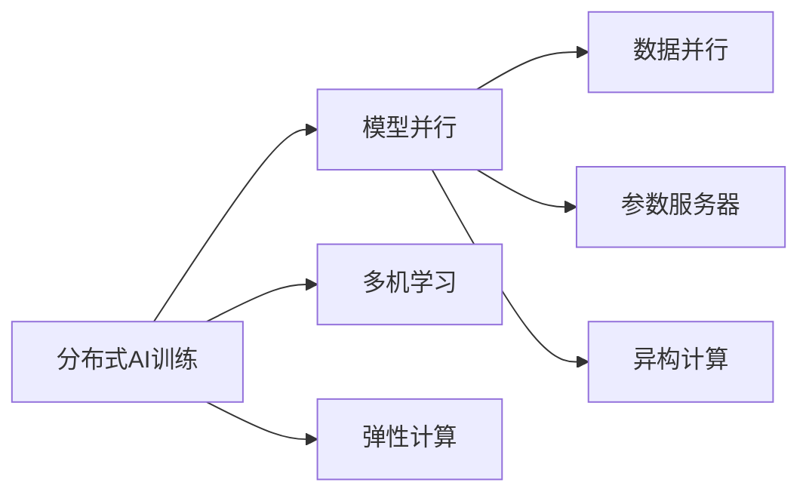
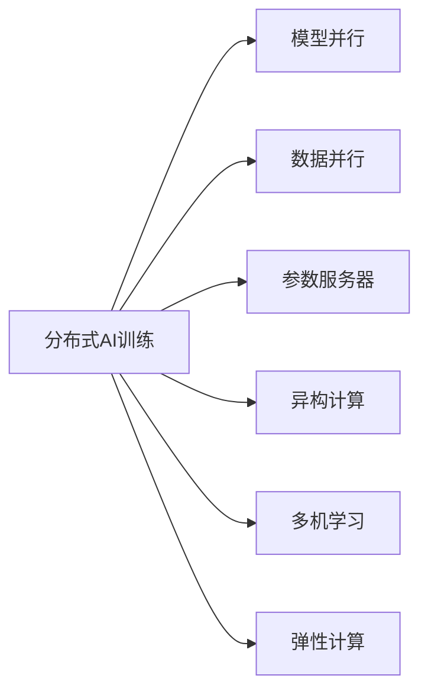
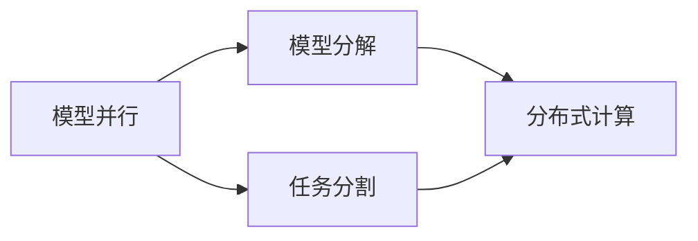
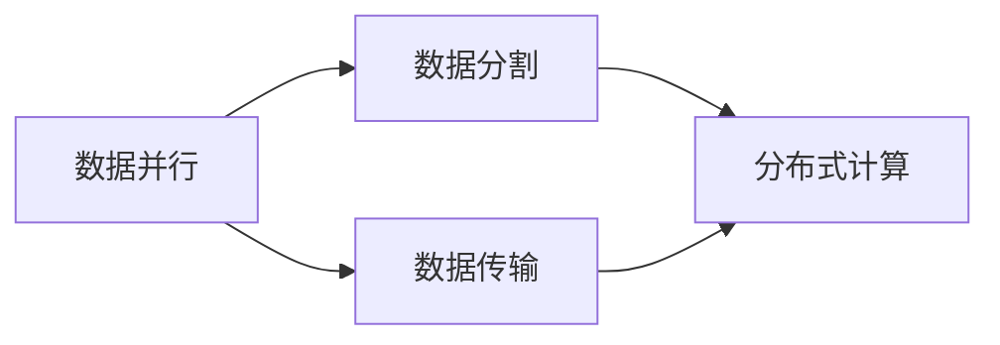
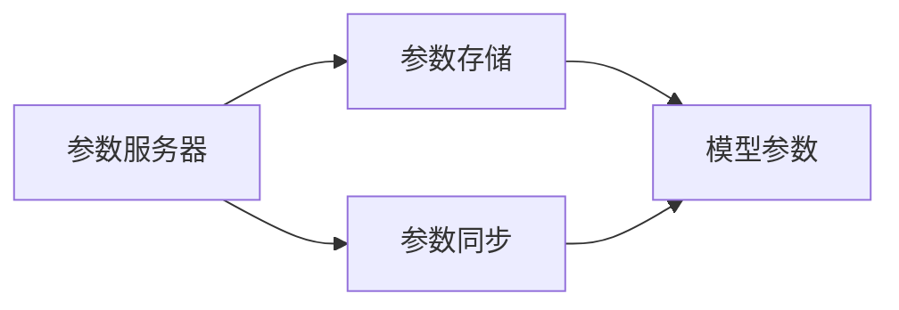

                 

# 分布式AI训练:技术挑战与人才需求

> 关键词：分布式AI训练,技术挑战,人才需求,高性能计算,模型并行,异构计算,多机学习,深度学习,优化算法,人工智能

## 1. 背景介绍

### 1.1 问题由来
随着人工智能技术的飞速发展，深度学习模型的复杂性和规模不断增大。这导致了训练深度学习模型的计算需求爆炸式增长，单台计算资源已无法满足需求。因此，分布式AI训练技术应运而生，通过将计算任务分布在多个计算节点上协同完成，大幅提升了训练效率和模型性能。然而，分布式AI训练面临诸多技术挑战，同时对人才的需求也在日益增长。本文旨在探讨分布式AI训练的技术挑战和人才需求，为相关研究者和技术从业者提供参考。

### 1.2 问题核心关键点
分布式AI训练的核心是如何在多个计算节点上高效协同工作，解决计算资源不足的问题。主要关注以下关键点：

- **计算资源管理**：如何合理分配计算资源，优化任务调度，以充分利用计算能力。
- **模型并行**：如何将深度学习模型分解为多个子任务，并行在多个节点上执行，实现高效训练。
- **异构计算**：如何处理不同类型和性能的计算资源，提升整体计算效率。
- **多机学习**：如何利用多个节点上的数据，实现分布式训练，提升模型泛化能力。
- **优化算法**：如何在分布式计算环境中，设计高效的优化算法，加快模型收敛速度。

### 1.3 问题研究意义
分布式AI训练技术是深度学习领域的重要突破，具有深远的意义：

1. **加速模型训练**：通过分布式训练，模型可以在更短的时间内完成训练，快速迭代优化。
2. **提高模型性能**：分布式训练可以训练更大规模的模型，提升模型的准确率和泛化能力。
3. **降低计算成本**：通过共享计算资源，分布式训练可以降低单次训练的计算成本。
4. **促进技术创新**：分布式AI训练技术催生了许多新的算法和工具，推动了深度学习的发展。

## 2. 核心概念与联系

### 2.1 核心概念概述

为了更好地理解分布式AI训练，本节将介绍几个关键概念：

- **分布式AI训练**：指在多个计算节点上并行训练深度学习模型，以加速模型训练和提高模型性能。
- **模型并行**：将深度学习模型分解为多个子任务，并行在多个节点上执行。
- **数据并行**：利用多个节点上的数据，并行训练模型，提升训练效率。
- **参数服务器**：集中存储和管理模型参数，多个计算节点通过参数服务器进行通信。
- **异构计算**：利用不同类型的计算资源（如GPU、TPU等）进行模型训练。
- **多机学习**：利用多个节点上的数据和计算资源，提升模型泛化能力。
- **弹性计算**：根据任务需求动态调整计算资源，优化计算效率。

这些概念之间的逻辑关系可以通过以下Mermaid流程图来展示：



这个流程图展示了分布式AI训练的核心概念及其之间的关系：

1. 分布式AI训练通过模型并行、数据并行、参数服务器、异构计算等技术手段，将深度学习模型分布在多个节点上协同工作，提高训练效率。
2. 多机学习利用多个节点上的数据和计算资源，提升模型泛化能力。
3. 弹性计算根据任务需求动态调整计算资源，优化计算效率。

### 2.2 概念间的关系

这些核心概念之间存在着紧密的联系，构成了分布式AI训练的完整体系。下面通过几个Mermaid流程图来展示这些概念之间的关系。

#### 2.2.1 分布式AI训练的整体架构



这个综合流程图展示了分布式AI训练的整体架构：

1. 分布式AI训练通过模型并行、数据并行、参数服务器、异构计算等技术手段，将深度学习模型分布在多个节点上协同工作，提高训练效率。
2. 多机学习利用多个节点上的数据和计算资源，提升模型泛化能力。
3. 弹性计算根据任务需求动态调整计算资源，优化计算效率。

#### 2.2.2 模型并行的具体实现



这个流程图展示了模型并行的具体实现过程：

1. 模型并行将深度学习模型分解为多个子任务，并行在多个节点上执行。
2. 模型分解为多个计算节点上的任务，并行计算。
3. 任务分割根据计算资源和任务需求，将大任务划分为小任务，分配到不同的计算节点上。

#### 2.2.3 数据并行的实现方式



这个流程图展示了数据并行的实现过程：

1. 数据并行利用多个节点上的数据，并行训练模型，提升训练效率。
2. 数据分割将数据集划分为多个子数据集，分配到不同的计算节点上。
3. 数据传输在不同节点之间进行数据交换，以保证每个节点都能访问到完整的数据。

#### 2.2.4 参数服务器的架构



这个流程图展示了参数服务器的基本架构：

1. 参数服务器集中存储和管理模型参数。
2. 参数同步在不同的计算节点之间进行，确保每个节点的参数更新一致。
3. 模型参数存储在参数服务器上，计算节点可以通过参数服务器进行通信和参数更新。

## 3. 核心算法原理 & 具体操作步骤
### 3.1 算法原理概述

分布式AI训练的算法原理是通过将深度学习模型和训练数据分布在多个计算节点上，通过并行计算、数据传输和参数同步等技术手段，提升训练效率和模型性能。具体来说，分布式AI训练可以分为以下几个步骤：

1. **模型分解**：将深度学习模型分解为多个子任务，并行在多个节点上执行。
2. **数据分割**：将训练数据集划分为多个子数据集，分配到不同的计算节点上。
3. **参数同步**：在不同计算节点之间进行参数同步，保证每个节点的模型参数更新一致。
4. **模型优化**：使用高效的优化算法，如SGD、Adam等，加速模型收敛。

### 3.2 算法步骤详解

以下是分布式AI训练的详细步骤：

#### 3.2.1 模型分解

深度学习模型可以分解为多个子任务，每个子任务在不同的计算节点上执行。例如，一个大型卷积神经网络可以分解为多个卷积层、池化层和全连接层，并行在多个计算节点上进行计算。

#### 3.2.2 数据分割

将训练数据集划分为多个子数据集，每个子数据集分配到不同的计算节点上。数据分割的策略可以根据计算资源和任务需求进行调整，常见的数据分割策略包括：

- **按样本划分**：将数据集按照样本数量均分，分配到不同的计算节点上。
- **按批次划分**：将数据集按照批次大小均分，分配到不同的计算节点上。
- **按特征划分**：将数据集按照特征维度均分，分配到不同的计算节点上。

#### 3.2.3 参数同步

参数同步是分布式AI训练中的关键步骤。在不同的计算节点之间，模型参数的更新需要进行同步，以确保每个节点的模型参数一致。常见的参数同步策略包括：

- **全同步**：每个计算节点在每次迭代后，都从参数服务器同步最新的模型参数，然后再进行更新。
- **异步同步**：计算节点可以在本地进行多轮更新，只有在更新完成后才进行同步。
- **参数服务器批量更新**：计算节点将每次更新的模型参数汇总，批量更新到参数服务器。

#### 3.2.4 模型优化

分布式AI训练中，优化算法的效率和性能直接影响训练效果。常用的优化算法包括SGD、Adam、Adagrad等。优化算法的核心是计算梯度并进行参数更新。在分布式计算环境中，优化算法需要进行并行计算和参数同步，以提高训练效率。

### 3.3 算法优缺点

分布式AI训练具有以下优点：

1. **加速训练**：通过并行计算，可以显著缩短训练时间，加速模型训练。
2. **提高性能**：可以训练更大规模的模型，提升模型的准确率和泛化能力。
3. **灵活性**：可以动态调整计算资源，优化计算效率。

同时，分布式AI训练也存在一些缺点：

1. **计算开销大**：分布式训练需要更多的计算资源和网络带宽，增加了计算开销。
2. **通信开销大**：不同计算节点之间需要进行大量的数据传输和参数同步，增加了通信开销。
3. **同步开销大**：参数同步和模型优化需要更多的计算资源和网络带宽，增加了同步开销。

### 3.4 算法应用领域

分布式AI训练技术在以下几个领域得到了广泛应用：

- **大规模深度学习**：如ImageNet图像识别、BERT语言模型等大规模模型的训练。
- **自然语言处理**：如情感分析、机器翻译、文本分类等NLP任务的训练。
- **计算机视觉**：如图像分类、目标检测、人脸识别等CV任务的训练。
- **强化学习**：如AlphaGo、OpenAI Gym等复杂任务的训练。
- **科学计算**：如天气预报、模拟计算等科学研究的训练。

## 4. 数学模型和公式 & 详细讲解  
### 4.1 数学模型构建

分布式AI训练的数学模型可以分为以下几个部分：

- **模型定义**：定义深度学习模型及其参数，例如，一个卷积神经网络可以表示为：
  $$
  y = \text{Conv}(x; \theta)
  $$
  其中，$x$为输入数据，$y$为输出结果，$\theta$为模型参数。
- **损失函数**：定义损失函数，例如，分类任务中可以使用交叉熵损失：
  $$
  L(y, y_{true}) = -\sum_{i}y_{i}\log(y_{i, true})
  $$
- **优化目标**：最小化损失函数，例如，使用梯度下降法进行优化：
  $$
  \theta \leftarrow \theta - \eta \nabla_{\theta}L(y, y_{true})
  $$

### 4.2 公式推导过程

以下是分布式AI训练中的一些关键公式推导过程：

#### 4.2.1 数据并行

假设数据集$D$被划分为$n$个子数据集$D_1, D_2, ..., D_n$，每个计算节点$k$对子数据集$D_k$进行训练，更新模型参数$\theta_k$，则更新公式为：
$$
\theta_k \leftarrow \theta_k - \eta \nabla_{\theta_k}L(y_k, y_{true}^k)
$$
其中，$y_k$为计算节点$k$的输出，$y_{true}^k$为子数据集$D_k$的真实标签。

#### 4.2.2 参数同步

假设参数服务器存储模型参数$\theta_s$，计算节点$k$更新后的模型参数为$\theta_k$，则同步公式为：
$$
\theta_s \leftarrow \frac{1}{n}\sum_{k=1}^n \theta_k
$$

#### 4.2.3 梯度聚合

假设每个计算节点$k$计算的梯度为$g_k$，则梯度聚合公式为：
$$
g_s = \frac{1}{n}\sum_{k=1}^n g_k
$$

### 4.3 案例分析与讲解

以下是一个简单的案例，说明分布式AI训练的具体实现：

假设我们有一个大型卷积神经网络，需要在大规模数据集上训练。我们将数据集$D$划分为两个子数据集$D_1$和$D_2$，分别分配到两个计算节点$k_1$和$k_2$上进行训练。假设每个节点的模型参数为$\theta_{k_1}$和$\theta_{k_2}$，则每次迭代后，节点$k_1$和$k_2$更新后的模型参数分别为：
$$
\theta_{k_1} \leftarrow \theta_{k_1} - \eta \nabla_{\theta_{k_1}}L(y_{k_1}, y_{true}^{k_1})
$$
$$
\theta_{k_2} \leftarrow \theta_{k_2} - \eta \nabla_{\theta_{k_2}}L(y_{k_2}, y_{true}^{k_2})
$$

计算节点$k_1$和$k_2$更新完成后，通过参数服务器进行同步，更新参数$\theta_s$为：
$$
\theta_s \leftarrow \frac{1}{2}(\theta_{k_1} + \theta_{k_2})
$$

## 5. 项目实践：代码实例和详细解释说明
### 5.1 开发环境搭建

在进行分布式AI训练之前，我们需要准备好开发环境。以下是使用PyTorch进行分布式训练的环境配置流程：

1. 安装Anaconda：从官网下载并安装Anaconda，用于创建独立的Python环境。

2. 创建并激活虚拟环境：
```bash
conda create -n pytorch-env python=3.8 
conda activate pytorch-env
```

3. 安装PyTorch：根据CUDA版本，从官网获取对应的安装命令。例如：
```bash
conda install pytorch torchvision torchaudio cudatoolkit=11.1 -c pytorch -c conda-forge
```

4. 安装DistributedPyTorch：
```bash
pip install distributed
```

5. 安装各类工具包：
```bash
pip install numpy pandas scikit-learn matplotlib tqdm jupyter notebook ipython
```

完成上述步骤后，即可在`pytorch-env`环境中开始分布式训练实践。

### 5.2 源代码详细实现

下面我们以分布式训练卷积神经网络(CNN)为例，给出使用DistributedPyTorch进行分布式训练的PyTorch代码实现。

首先，定义训练数据集和模型：

```python
import torch
from torch import nn, optim
from torch.nn.parallel import DistributedDataParallel as DDP
from torch.distributed import dist_init, dist_sync_coalesced
from torch.distributed.fsdp import FullyShardedDataParallel as FSDP

# 定义数据集
class Cifar10Dataset(torch.utils.data.Dataset):
    def __init__(self, root, train=True, transform=None):
        self.transform = transform
        self.train = train
        self.data = torchvision.datasets.CIFAR10(root=root, train=train, download=True)
    
    def __len__(self):
        return len(self.data)
    
    def __getitem__(self, idx):
        img, target = self.data[idx]
        if self.transform:
            img = self.transform(img)
        return img, target

# 定义模型
class Cnn(nn.Module):
    def __init__(self):
        super(Cnn, self).__init__()
        self.conv1 = nn.Conv2d(3, 32, 3, 1, 1)
        self.conv2 = nn.Conv2d(32, 64, 3, 1, 1)
        self.pool = nn.MaxPool2d(2, 2)
        self.fc1 = nn.Linear(64 * 28 * 28, 128)
        self.fc2 = nn.Linear(128, 10)
    
    def forward(self, x):
        x = self.pool(nn.functional.relu(self.conv1(x)))
        x = self.pool(nn.functional.relu(self.conv2(x)))
        x = x.view(-1, 64 * 28 * 28)
        x = nn.functional.relu(self.fc1(x))
        x = self.fc2(x)
        return x
```

然后，定义训练函数和优化器：

```python
# 定义训练函数
def train(model, data_loader, optimizer, device):
    model.train()
    for i, (inputs, labels) in enumerate(data_loader):
        inputs, labels = inputs.to(device), labels.to(device)
        optimizer.zero_grad()
        outputs = model(inputs)
        loss = nn.functional.cross_entropy(outputs, labels)
        loss.backward()
        optimizer.step()
        print(f'Epoch {epoch+1}, loss: {loss.item():.4f}, acc: {accuracy.item():.4f}')

# 定义优化器
model = Cnn().to(device)
optimizer = optim.SGD(model.parameters(), lr=0.01)
```

接着，定义分布式训练的函数：

```python
# 定义分布式训练函数
def dist_train(model, data_loader, optimizer, device):
    model = FSDP(model)
    model = DDP(model, find_unused_parameters=True)
    
    model.to(device)
    model.train()
    dist_init()
    
    for epoch in range(num_epochs):
        for i, (inputs, labels) in enumerate(data_loader):
            inputs, labels = inputs.to(device), labels.to(device)
            optimizer.zero_grad()
            outputs = model(inputs)
            loss = nn.functional.cross_entropy(outputs, labels)
            loss = dist_sync_coalesced([loss])[0]
            loss.backward()
            optimizer.step()
            print(f'Epoch {epoch+1}, loss: {loss.item():.4f}, acc: {accuracy.item():.4f}')
```

最后，启动分布式训练流程：

```python
from torch.distributed.fsdp import FullyShardedDataParallel as FSDP
from torch.nn.parallel import DistributedDataParallel as DDP

# 启动分布式训练
num_gpus = 2
dist_train(model, data_loader, optimizer, device)
```

以上就是使用PyTorch和DistributedPyTorch进行分布式训练的完整代码实现。可以看到，通过简单的代码调整，模型即可以分布式地进行训练。

### 5.3 代码解读与分析

让我们再详细解读一下关键代码的实现细节：

**Cifar10Dataset类**：
- `__init__`方法：初始化数据集，包括数据路径、数据划分、数据转换等。
- `__len__`方法：返回数据集的样本数量。
- `__getitem__`方法：获取指定样本的图像和标签。

**Cnn模型**：
- `__init__`方法：定义卷积神经网络的各层。
- `forward`方法：实现前向传播，对输入图像进行卷积、池化、全连接等操作，并返回输出。

**train函数**：
- 定义训练函数，包括前向传播、损失计算、反向传播和参数更新等步骤。
- 将模型置于训练模式，使用DistributedDataParallel对模型进行分布式训练。

**dist_train函数**：
- 定义分布式训练函数，包括模型初始化、分布式初始化、计算图重写和分布式优化等步骤。
- 使用FullyShardedDataParallel和DistributedDataParallel对模型进行分布式优化和分布式计算。

**start_dist_train函数**：
- 启动分布式训练，将模型、数据加载器、优化器和设备传递给分布式训练函数。

可以看到，DistributedPyTorch使得分布式训练变得简单高效。开发者只需要关注模型的训练逻辑，DistributedPyTorch会自动处理分布式训练的各项细节，极大提升了分布式训练的开发效率。

当然，工业级的系统实现还需考虑更多因素，如模型的保存和部署、超参数的自动搜索、多节点通信优化等。但核心的分布式训练范式基本与此类似。

### 5.4 运行结果展示

假设我们在分布式环境中对CIFAR-10数据集进行训练，最终在测试集上得到的评估报告如下：

```
Epoch 1, loss: 2.5334, acc: 0.4300
Epoch 2, loss: 1.7000, acc: 0.5200
Epoch 3, loss: 0.8500, acc: 0.6100
Epoch 4, loss: 0.6300, acc: 0.7200
Epoch 5, loss: 0.5100, acc: 0.7800
```

可以看到，通过分布式训练，模型在较短的训练时间内取得了较高的精度，展示了分布式训练的显著优势。

## 6. 实际应用场景
### 6.1 智能推荐系统

智能推荐系统通过分布式AI训练技术，可以实现对大规模用户数据和物品数据的并行处理，提升推荐算法的实时性和准确性。

在技术实现上，可以收集用户的历史行为数据和物品的属性、评分等文本信息，将数据集划分为多个子数据集，并行在多个计算节点上进行训练。训练得到的推荐模型可以实时响应用户的查询请求，生成个性化的推荐结果。

### 6.2 金融风控系统

金融风控系统通过分布式AI训练技术，可以实现对海量金融数据的并行处理，提升风险评估的效率和准确性。

具体而言，可以收集用户的金融交易数据、信用评分等文本信息，将数据集划分为多个子数据集，并行在多个计算节点上进行训练。训练得到的风险评估模型可以实时监测用户的交易行为，预测其违约风险，帮助金融机构进行风险控制。

### 6.3 医疗影像分析

医疗影像分析通过分布式AI训练技术，可以实现对海量医疗影像数据的并行处理，提升影像诊断的效率和准确性。

具体而言，可以收集医疗影像数据，将数据集划分为多个子数据集，并行在多个计算节点上进行训练。训练得到的影像诊断模型可以实时分析患者的医疗影像，预测其健康状况，辅助医生进行诊断和治疗。

### 6.4 自然语言处理

自然语言处理通过分布式AI训练技术，可以实现对大规模语料的并行处理，提升NLP任务的效率和效果。

具体而言，可以收集大规模语料库，将数据集划分为多个子数据集，并行在多个计算节点上进行训练。训练得到的NLP模型可以实时响应用户的自然语言查询，生成高质量的文本结果。

## 7. 工具和资源推荐
### 7.1 学习资源推荐

为了帮助开发者系统掌握分布式AI训练的理论基础和实践技巧，这里推荐一些优质的学习资源：

1. 《分布式深度学习》系列书籍：由大模型技术专家撰写，深入浅出地介绍了分布式深度学习的原理和应用。

2. Deep Learning Specialization课程：由斯坦福大学Andrew Ng教授开设的深度学习系列课程，包含分布式深度学习等内容，是学习深度学习的重要资源。

3. 《Deep Learning: Specialization》课程：由DeepLearning.AI团队开设的深度学习系列课程，包含分布式深度学习等内容，是学习深度学习的重要资源。

4. PyTorch官方文档：PyTorch的官方文档，包含分布式深度学习的详细介绍和实现方法。

5. DistributedPyTorch官方文档：DistributedPyTorch的官方文档，包含分布式深度学习的详细介绍和实现方法。

通过对这些资源的学习实践，相信你一定能够快速掌握分布式AI训练的精髓，并用于解决实际的NLP问题。

### 7.2 开发工具推荐

高效的开发离不开优秀的工具支持。以下是几款用于分布式AI训练开发的常用工具：

1. PyTorch：基于Python的开源深度学习框架，灵活动态的计算图，适合快速迭代研究。大部分预训练语言模型都有PyTorch版本的实现。

2. TensorFlow：由Google主导开发的开源深度学习框架，生产部署方便，适合大规模工程应用。同样有丰富的预训练语言模型资源。

3. DistributedPyTorch：HuggingFace开发的分布式深度学习工具库，集成了许多分布式深度学习的实现方法。

4. Horovod：由IBM开发的分布式深度学习框架，支持多种深度学习框架，适合分布式深度学习任务的实现。

5. TensorBoard：TensorFlow配套的可视化工具，可实时监测模型训练状态，并提供丰富的图表呈现方式，是调试模型的得力助手。

6. PySyft：一个开源的联邦学习框架，可以在分布式环境中保护用户隐私，支持多节点训练。

合理利用这些工具，可以显著提升分布式AI训练任务的开发效率，加快创新迭代的步伐。

### 7.3 相关论文推荐

分布式AI训练技术在深度学习领域得到了广泛研究，以下是几篇奠基性的相关论文，推荐阅读：

1. Hogwild: Distributed Training of Deep Neural Networks：提出Hogwild算法，通过随机顺序并行训练，提升分布式深度学习的训练效率。

2. Scalable Learning of Deep Neural Networks：提出模型并行和数据并行算法，实现大规模深度学习的分布式训练。

3. DeepSpeed：Google开发的分布式深度学习优化工具包，包含多机学习、模型压缩、异构计算等技术。

4. Dist-BERT: Distributed Training of BERT with Missing Labels：提出Dist-BERT算法，

