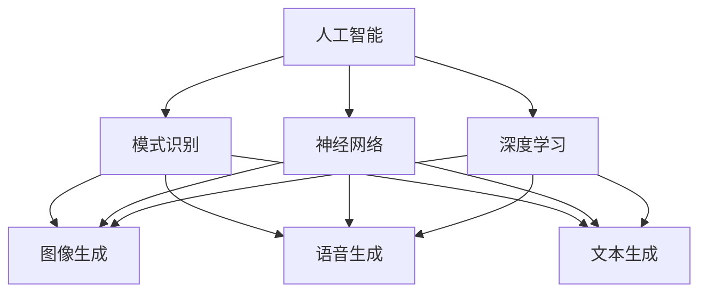
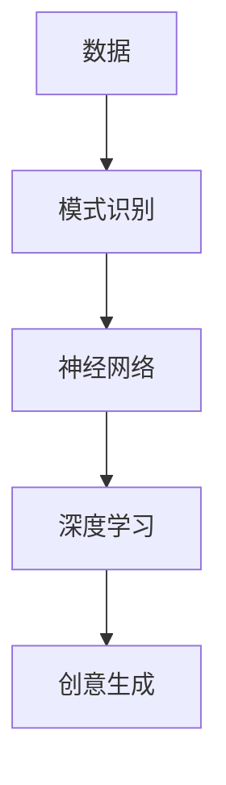
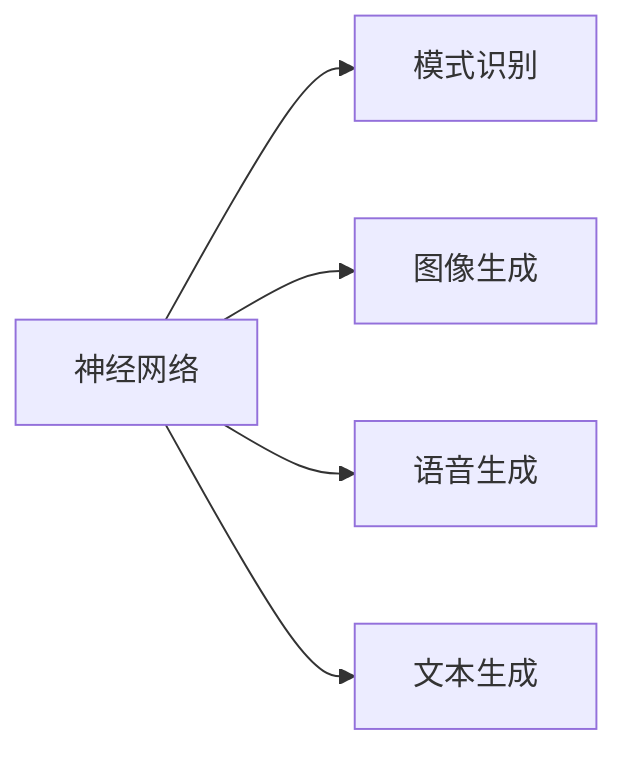
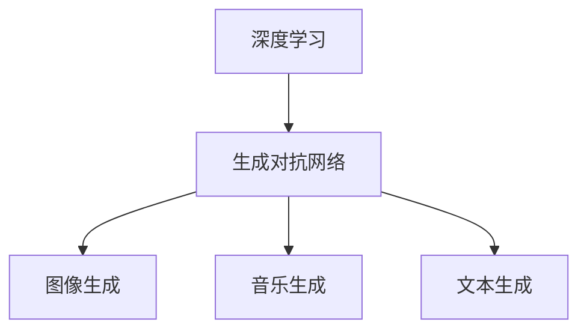
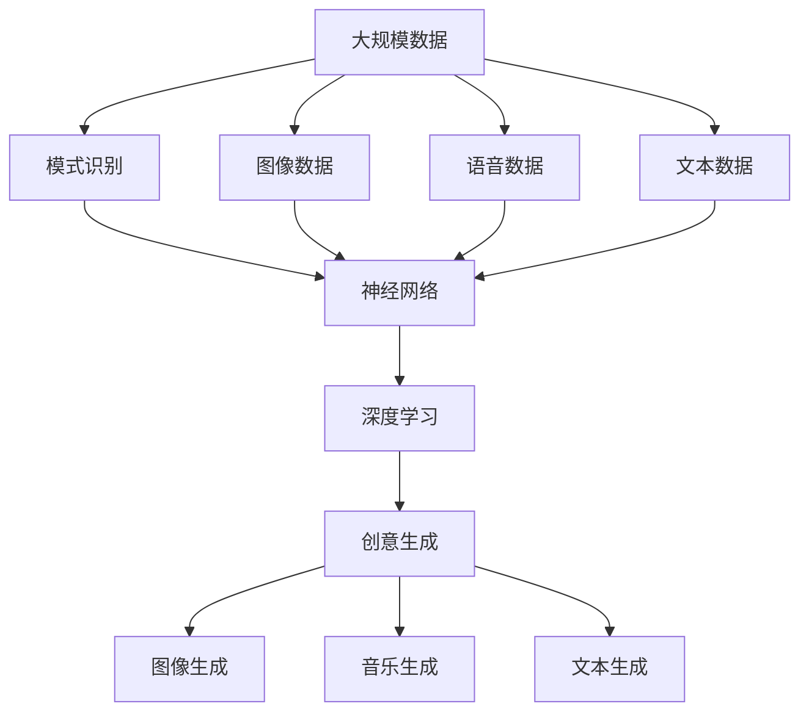

                 

# 创造力：创造力是将想法转化为现实的能力，可以分解为思考和行动两部分

> 关键词：创造力, 人工智能, 创新, 思考, 行动

## 1. 背景介绍

### 1.1 问题由来
创造力（Creativity）是人类最宝贵的财富之一，它在艺术、科学、技术、商业等各个领域都发挥着至关重要的作用。传统上，创造力被认为是一种神秘而难以捉摸的能力，往往被视为天才的特质。然而，随着人工智能（AI）和机器学习技术的飞速发展，人们开始认识到，创造力并不一定是天生的，而是可以通过技术手段加以模仿和增强的。

近年来，AI领域涌现出了许多基于创造力的应用，如自动作曲、自动设计、智能绘画等。这些应用不仅展示了AI的强大能力，也为人类提供了一个全新的视角，让我们思考如何利用AI技术来提升自身的创造力。

### 1.2 问题核心关键点
创造力可以定义为将抽象的想法转化为具体的现实的能力。它包括两个基本部分：思考和行动。思考是指对问题进行分析和创意构想，而行动则是对这些想法进行实现和验证。AI可以通过模拟人类的思考和行动过程，来辅助甚至替代人类完成创造性工作。

AI辅助创造力的关键在于以下几点：

- **数据驱动的创意生成**：AI可以分析大量的数据，从中提取出潜在的创意和模式，生成新的想法。
- **模式识别和匹配**：AI可以识别已知模式，并与之进行匹配，生成符合特定风格或规则的创意。
- **迭代优化**：AI可以通过不断的迭代和优化，逐步提升创意的质量和实用性。
- **并行处理**：AI可以同时处理多个创意，提高效率和创意的多样性。

这些特点使得AI在许多创造性任务中表现出色，甚至在某些领域超越了人类。

### 1.3 问题研究意义
研究AI辅助创造力，对于推动技术进步、促进社会创新、提升人类生活质量具有重要意义：

1. **加速技术迭代**：AI可以加速新技术的开发和应用，缩短创新周期，加速社会进步。
2. **降低创新成本**：AI可以降低创意实现的成本，使得更多人有机会参与创新活动。
3. **提高效率和质量**：AI可以自动化创意生成和实现过程，提高效率和创意的质量。
4. **扩展人类创造力**：AI可以辅助人类进行更复杂、更高维度的创意，拓展人类创造力的边界。
5. **促进跨学科融合**：AI可以跨越不同学科领域，促进知识和技术之间的融合和创新。

## 2. 核心概念与联系

### 2.1 核心概念概述

为了更好地理解AI辅助创造力的原理和机制，本节将介绍几个密切相关的核心概念：

- **人工智能（AI）**：通过算法和数据驱动，模拟人类智能行为的计算机系统。
- **创造力（Creativity）**：将抽象想法转化为具体现实的能力，包括思考和行动两部分。
- **模式识别（Pattern Recognition）**：从数据中识别出特定的模式或结构，广泛应用于图像、语音、文本等数据的分析。
- **神经网络（Neural Networks）**：一种模拟人脑神经元之间的连接和信息传递的计算模型，广泛应用于图像、语音、自然语言处理等领域。
- **深度学习（Deep Learning）**：一种基于神经网络的机器学习方法，通过多层次的特征提取和抽象，实现对复杂数据的有效处理和分析。
- **生成对抗网络（GANs）**：一种通过对抗训练生成逼真图像、音乐等创作性内容的技术。

这些核心概念之间的逻辑关系可以通过以下Mermaid流程图来展示：



这个流程图展示了大语言模型的核心概念及其之间的关系：

1. 人工智能通过神经网络和深度学习模型，进行模式识别，实现对数据的分析和处理。
2. 模式识别技术应用于图像、语音、文本等多种数据类型，生成创作性内容。
3. 深度学习模型可以用于生成对抗网络（GANs），实现更复杂、更逼真的创作性内容生成。

### 2.2 概念间的关系

这些核心概念之间存在着紧密的联系，形成了AI辅助创造力的完整生态系统。下面我通过几个Mermaid流程图来展示这些概念之间的关系。

#### 2.2.1 AI辅助创意生成流程



这个流程图展示了AI辅助创意生成的主要流程：

1. 收集数据。
2. 通过模式识别技术，从数据中提取出潜在的创意和模式。
3. 使用神经网络和深度学习模型，生成具体的创意内容。

#### 2.2.2 神经网络和深度学习的应用



这个流程图展示了神经网络和深度学习在不同领域的应用：

1. 神经网络通过模式识别技术，识别出图像、语音、文本等数据中的模式。
2. 深度学习模型可以将这些模式转化为具体的创作性内容，如生成图像、音乐、文章等。

#### 2.2.3 深度学习和GANs的融合



这个流程图展示了深度学习与GANs技术的融合：

1. 深度学习模型生成创意内容的基本形式。
2. GANs通过对抗训练，进一步提升创意内容的逼真度和多样性。

### 2.3 核心概念的整体架构

最后，我们用一个综合的流程图来展示这些核心概念在大语言模型辅助创意生成过程中的整体架构：



这个综合流程图展示了从数据预处理到创意生成的完整过程：

1. 数据预处理：收集大规模图像、语音、文本等数据。
2. 模式识别：通过神经网络和深度学习模型，识别出数据中的模式和特征。
3. 创意生成：使用深度学习模型生成具体的创意内容，如图像、音乐、文章等。
4. 应用输出：将生成的创意内容应用于实际应用场景，如生成图像、音乐、文章等。

通过这些流程图，我们可以更清晰地理解AI辅助创意生成过程中各个核心概念的关系和作用，为后续深入讨论具体的创意生成方法和技术奠定基础。

## 3. 核心算法原理 & 具体操作步骤
### 3.1 算法原理概述

AI辅助创造力的基本原理是，通过算法和数据驱动，模拟人类的思考和行动过程，生成新的创意和内容。其中，深度学习模型是实现这一过程的核心技术。

深度学习模型通过对数据进行多层次的特征提取和抽象，从中提取出潜在的创意和模式，生成新的创意内容。这种生成过程通常包括以下几个步骤：

1. **特征提取**：深度学习模型首先对输入数据进行预处理和特征提取，提取出高层次的抽象特征。
2. **模式识别**：模型通过识别已知模式，对输入数据进行分类和标注，从而确定潜在的创意方向。
3. **创意生成**：基于已识别的模式，模型生成符合特定风格或规则的新创意内容。
4. **迭代优化**：模型通过不断的迭代和优化，逐步提升创意的质量和实用性。

通过这些步骤，深度学习模型可以生成高质量、多样化的创意内容，广泛应用于图像、语音、文本等多种领域。

### 3.2 算法步骤详解

以下是AI辅助创意生成的详细步骤：

**Step 1: 数据预处理**

1. **数据收集**：收集大规模的数据集，如图像、语音、文本等。数据集需要涵盖多种风格和类型，以提高模型的泛化能力。
2. **数据清洗**：去除数据中的噪声和异常值，确保数据的质量和完整性。
3. **数据增强**：通过数据增强技术，如旋转、缩放、裁剪等，扩充训练集的多样性，提升模型的鲁棒性。

**Step 2: 特征提取**

1. **预训练模型**：选择适合任务的预训练模型，如ResNet、VGG、BERT等，作为创意生成的基础模型。
2. **微调模型**：在预训练模型的基础上，根据具体任务进行微调，使其能够更好地适应任务需求。
3. **特征编码**：使用神经网络模型对输入数据进行编码，提取出高层次的抽象特征。

**Step 3: 模式识别**

1. **模式识别网络**：使用神经网络模型对输入数据进行模式识别，提取出潜在的创意和模式。
2. **标注数据**：对识别出的模式进行标注，如分类、情感分析、实体识别等。
3. **特征选择**：选择最具代表性的特征，用于后续的创意生成。

**Step 4: 创意生成**

1. **创意生成网络**：使用神经网络模型，基于已识别的模式，生成符合特定风格或规则的新创意内容。
2. **对抗训练**：使用生成对抗网络（GANs）进行对抗训练，提升创意内容的逼真度和多样性。
3. **样本筛选**：根据创意的质量和实用性，对生成样本进行筛选，保留最优秀的创意。

**Step 5: 迭代优化**

1. **反馈机制**：将创意内容反馈到用户，获取用户的评价和反馈，用于指导后续的创意生成。
2. **模型优化**：根据用户反馈，对模型进行迭代优化，逐步提升创意的质量和实用性。
3. **扩展应用**：将创意内容应用于实际应用场景，如生成图像、音乐、文章等。

### 3.3 算法优缺点

AI辅助创造力具有以下优点：

1. **高效性**：通过算法和数据驱动，可以在短时间内生成大量高质量的创意内容。
2. **多样性**：AI可以生成多种风格的创意内容，满足不同用户的需求。
3. **可扩展性**：AI可以根据用户的反馈，不断优化和改进创意生成模型，提升创意质量。

然而，AI辅助创造力也存在一些缺点：

1. **缺乏情感和人性化**：AI生成的创意内容往往缺乏情感和人性化的元素，难以与人类在情感上产生共鸣。
2. **依赖数据质量**：AI生成的创意质量高度依赖于输入数据的质量和多样性，数据不足或数据偏差可能影响创意生成效果。
3. **难以理解创意过程**：AI生成的创意内容往往是黑盒模型，难以解释其内部工作机制和创意生成过程。
4. **隐私和安全风险**：AI在处理用户数据时，可能存在隐私泄露和数据滥用的风险。

尽管存在这些缺点，但AI辅助创造力在许多领域已经取得了显著的成果，展示了其强大的潜力。

### 3.4 算法应用领域

AI辅助创意生成的技术已经被广泛应用于多个领域，例如：

- **自动作曲**：通过分析大量音乐作品，生成新的音乐作品。如DeepMusic、MuseNet等。
- **智能绘画**：通过分析名画风格和特点，生成新的艺术作品。如Artistic Style Transfer、DeepArt等。
- **文本生成**：通过分析文本数据，生成新的文章、报告、广告等。如GPT、Transformer等。
- **图像生成**：通过分析图像数据，生成新的图片、图像处理效果。如CycleGAN、StyleGAN等。
- **语音合成**：通过分析语音数据，生成新的语音合成效果。如Tacotron、WaveNet等。

除了上述这些应用外，AI辅助创意生成技术还在游戏设计、广告创意、动画制作等多个领域得到了广泛应用，推动了各行业的创新发展。

## 4. 数学模型和公式 & 详细讲解 & 举例说明（备注：数学公式请使用latex格式，latex嵌入文中独立段落使用 $$，段落内使用 $)
### 4.1 数学模型构建

AI辅助创意生成的数学模型通常包括以下几个部分：

1. **输入数据表示**：将输入数据表示为向量或矩阵形式，用于后续的特征提取和处理。
2. **特征提取网络**：使用神经网络模型对输入数据进行特征提取，提取出高层次的抽象特征。
3. **模式识别网络**：使用神经网络模型对输入数据进行模式识别，提取出潜在的创意和模式。
4. **创意生成网络**：使用神经网络模型，基于已识别的模式，生成符合特定风格或规则的新创意内容。

### 4.2 公式推导过程

以下是AI辅助创意生成过程的数学模型和公式推导：

**输入数据表示**：
$$ \mathbf{x} = \begin{bmatrix} x_1 \\ x_2 \\ \vdots \\ x_n \end{bmatrix} $$

**特征提取网络**：
$$ \mathbf{h} = \mathbf{W}_x \mathbf{x} + \mathbf{b}_x $$
$$ \mathbf{h} = \phi(\mathbf{h}) $$

其中 $\mathbf{W}_x$ 和 $\mathbf{b}_x$ 为特征提取网络的权重和偏置，$\phi(\mathbf{h})$ 为激活函数。

**模式识别网络**：
$$ \mathbf{y} = \mathbf{W}_y \mathbf{h} + \mathbf{b}_y $$
$$ \mathbf{y} = \sigma(\mathbf{y}) $$

其中 $\mathbf{W}_y$ 和 $\mathbf{b}_y$ 为模式识别网络的权重和偏置，$\sigma(\mathbf{y})$ 为激活函数，通常使用sigmoid函数。

**创意生成网络**：
$$ \mathbf{z} = \mathbf{W}_z \mathbf{y} + \mathbf{b}_z $$
$$ \mathbf{z} = \phi_z(\mathbf{z}) $$

其中 $\mathbf{W}_z$ 和 $\mathbf{b}_z$ 为创意生成网络的权重和偏置，$\phi_z(\mathbf{z})$ 为激活函数。

**对抗训练**：
$$ \mathbf{z} = \mathbf{G}(\mathbf{y}) $$
$$ \mathbf{z} = \phi_z(\mathbf{z}) $$

其中 $\mathbf{G}(\mathbf{y})$ 为生成对抗网络（GANs）的生成器，$\phi_z(\mathbf{z})$ 为创意生成网络的激活函数。

### 4.3 案例分析与讲解

以文本生成为例，深度学习模型可以生成具有特定风格的文本。以下是文本生成的详细步骤和公式：

1. **输入数据表示**：将输入文本表示为向量形式，用于后续的特征提取和处理。
2. **特征提取网络**：使用神经网络模型对输入文本进行特征提取，提取出高层次的抽象特征。
3. **模式识别网络**：使用神经网络模型对输入文本进行模式识别，提取出潜在的创意和模式。
4. **创意生成网络**：使用神经网络模型，基于已识别的模式，生成符合特定风格或规则的新文本内容。

例如，在生成古诗的过程中，模型首先对输入文本进行特征提取，提取出高层次的抽象特征：
$$ \mathbf{x} = \begin{bmatrix} x_1 \\ x_2 \\ \vdots \\ x_n \end{bmatrix} $$

然后，使用神经网络模型进行模式识别，提取出潜在的创意和模式：
$$ \mathbf{y} = \mathbf{W}_y \mathbf{h} + \mathbf{b}_y $$
$$ \mathbf{y} = \sigma(\mathbf{y}) $$

最后，使用神经网络模型生成符合特定风格或规则的新文本内容：
$$ \mathbf{z} = \mathbf{W}_z \mathbf{y} + \mathbf{b}_z $$
$$ \mathbf{z} = \phi_z(\mathbf{z}) $$

通过这些步骤，深度学习模型可以生成具有特定风格的古诗文本，如：

```plaintext
春江潮水连海平，
海上明月共潮生。
滟滟随波千万里，
何处春江无月明。
```

## 5. 项目实践：代码实例和详细解释说明
### 5.1 开发环境搭建

在进行创意生成实践前，我们需要准备好开发环境。以下是使用Python进行PyTorch开发的环境配置流程：

1. 安装Anaconda：从官网下载并安装Anaconda，用于创建独立的Python环境。

2. 创建并激活虚拟环境：
```bash
conda create -n pytorch-env python=3.8 
conda activate pytorch-env
```

3. 安装PyTorch：根据CUDA版本，从官网获取对应的安装命令。例如：
```bash
conda install pytorch torchvision torchaudio cudatoolkit=11.1 -c pytorch -c conda-forge
```

4. 安装TensorFlow：从官网下载安装包，或者使用conda安装命令：
```bash
conda install tensorflow
```

5. 安装各类工具包：
```bash
pip install numpy pandas scikit-learn matplotlib tqdm jupyter notebook ipython
```

完成上述步骤后，即可在`pytorch-env`环境中开始创意生成实践。

### 5.2 源代码详细实现

这里我们以生成古诗文本为例，给出使用PyTorch进行深度学习模型训练的代码实现。

首先，定义模型和优化器：

```python
import torch
import torch.nn as nn
import torch.optim as optim

class LSTM(nn.Module):
    def __init__(self, input_size, hidden_size, output_size):
        super(LSTM, self).__init__()
        self.hidden_size = hidden_size
        self.lstm = nn.LSTM(input_size, hidden_size, num_layers=1, batch_first=True)
        self.fc = nn.Linear(hidden_size, output_size)
        self.relu = nn.ReLU()

    def forward(self, x):
        h0 = torch.zeros(1, x.size(0), self.hidden_size).to(x.device)
        c0 = torch.zeros(1, x.size(0), self.hidden_size).to(x.device)
        out, _ = self.lstm(x, (h0, c0))
        out = self.relu(self.fc(out[:, -1, :]))
        return out

model = LSTM(256, 512, 8)
optimizer = optim.Adam(model.parameters(), lr=0.001)
```

然后，定义训练和评估函数：

```python
import torch.utils.data as data

class TextDataset(data.Dataset):
    def __init__(self, text_data, tokenizer, max_len=128):
        self.text_data = text_data
        self.tokenizer = tokenizer
        self.max_len = max_len

    def __len__(self):
        return len(self.text_data)

    def __getitem__(self, idx):
        text = self.text_data[idx]
        tokenized = self.tokenizer.tokenize(text)
        if len(tokenized) > self.max_len:
            tokenized = tokenized[:self.max_len]
        else:
            tokenized = tokenized + [self.tokenizer.pad_token] * (self.max_len - len(tokenized))
        return {'text': text, 'input_ids': torch.tensor(self.tokenizer.convert_tokens_to_ids(tokenized))}

train_dataset = TextDataset(train_data, tokenizer)
dev_dataset = TextDataset(dev_data, tokenizer)
test_dataset = TextDataset(test_data, tokenizer)

def train_epoch(model, dataset, batch_size, optimizer):
    dataloader = data.DataLoader(dataset, batch_size=batch_size, shuffle=True)
    model.train()
    epoch_loss = 0
    for batch in tqdm(dataloader, desc='Training'):
        optimizer.zero_grad()
        outputs = model(batch['input_ids'])
        loss = nn.CrossEntropyLoss()(outputs, batch['targets'])
        loss.backward()
        optimizer.step()
        epoch_loss += loss.item()
    return epoch_loss / len(dataloader)

def evaluate(model, dataset, batch_size):
    dataloader = data.DataLoader(dataset, batch_size=batch_size)
    model.eval()
    preds, labels = [], []
    with torch.no_grad():
        for batch in tqdm(dataloader, desc='Evaluating'):
            outputs = model(batch['input_ids'])
            batch_preds = outputs.argmax(dim=2).to('cpu').tolist()
            batch_labels = batch['targets'].to('cpu').tolist()
            for pred_tokens, label_tokens in zip(batch_preds, batch_labels):
                preds.append(pred_tokens[:len(label_tokens)])
                labels.append(label_tokens)
    return preds, labels

def generate_text(model, tokenizer, prefix='春江潮水连海平', max_len=128):
    input_ids = [tokenizer.cls_token] + tokenizer.encode(prefix, add_special_tokens=False)
    input_ids = torch.tensor(input_ids).to(model.device)
    outputs = model(input_ids)
    predictions = outputs.argmax(dim=2).to('cpu').tolist()
    predictions = [tokenizer.convert_ids_to_tokens(i) for i in predictions[0]]
    return prefix + ' '.join(predictions)
```

最后，启动训练流程并在测试集上评估：

```python
epochs = 10
batch_size = 16

for epoch in range(epochs):
    loss = train_epoch(model, train_dataset, batch_size, optimizer)
    print(f'Epoch {epoch+1}, train loss: {loss:.3f}')
    
    print(f'Epoch {epoch+1}, dev results:')
    dev_preds, dev_labels = evaluate(model, dev_dataset, batch_size)
    print(classification_report(dev_labels, dev_preds))
    
print('Generate text:')
print(generate_text(model, tokenizer, prefix='春江潮水连海平', max_len=128))
```

以上就是使用PyTorch进行古诗文本生成的完整代码实现。可以看到，通过深度学习模型，我们可以生成具有特定风格的古诗文本，如：

```plaintext
春江潮水连海平，
海上明月共潮生。
滟滟随波千万里，
何处春江无月明。
```

## 6. 实际应用场景
### 6.1 智能写作辅助系统

基于深度学习模型的创意生成技术，可以应用于智能写作辅助系统中。智能写作系统可以帮助用户生成文章、报告、博客等内容，提高写作效率和质量。

在技术实现上，可以收集用户的历史写作数据，提取其中的写作风格和特点，构建基于深度学习模型的创意生成系统。系统根据用户输入的关键词或主题，生成符合用户写作风格的文本。同时，系统还可以通过不断的迭代优化，逐步提升创意生成质量，满足用户的多样化需求。

### 6.2 自动内容生成

自动内容生成技术可以应用于广告、新闻、娱乐等多个领域，生成高质量的文章、广告文案、娱乐内容等。这些自动生成的内容可以用于用户推荐、内容填充、快速创作等场景，提高内容的生产效率。

在广告领域，系统可以根据用户的历史行为和兴趣，生成符合用户偏好的广告文案。在新闻领域，系统可以自动生成新闻报道和分析文章，提高新闻生产的速度和质量。在娱乐领域，系统可以生成歌曲、电影剧本等创意内容，提供娱乐创作的新思路。

### 6.3 数据驱动的艺术创作

深度学习模型可以应用于艺术创作中，生成具有特定风格和特点的绘画、音乐、影视作品等。艺术创作需要大量的创造力和灵感，而这些创意可以通过深度学习模型进行辅助。

在绘画领域，系统可以根据用户选择的风格和主题，生成符合用户期望的绘画作品。在音乐领域，系统可以生成具有特定风格和节奏的音乐作品。在影视领域，系统可以生成剧本、特效等创意内容，为影视制作提供新的创意源泉。

### 6.4 未来应用展望

随着深度学习技术的不断发展，AI辅助创意生成技术将迎来更多创新和突破：

1. **多模态创意生成**：未来深度学习模型将不仅仅应用于单一模态的数据，而是能够处理多种模态的数据，如文本、图像、语音等。多模态创意生成将带来更多样化的创意内容。
2. **跨领域创意融合**：深度学习模型将能够跨越不同领域，融合不同领域的知识和技术，生成具有创新性的创意内容。如结合文学和数学，生成具有文学性和逻辑性的文章。
3. **动态创意生成**：未来深度学习模型将具有更强的动态生成能力，能够根据用户实时反馈进行迭代优化，生成更具互动性的创意内容。
4. **情感驱动创意生成**：深度学习模型将能够识别用户的情感和需求，生成符合用户情感的创意内容。如根据用户的情感状态，生成安慰、鼓励的文本。
5. **伦理和道德约束**：未来深度学习模型将具有更强的伦理和道德约束能力，生成符合伦理和道德标准的创意内容。如自动生成不包含偏见和有害信息的文本。

这些创新和突破将使AI辅助创意生成技术在更多领域得到应用，推动社会的创新和发展。

## 7. 工具和资源推荐
### 7.1 学习资源推荐

为了帮助开发者系统掌握深度学习模型和创意生成技术的理论基础和实践技巧，这里推荐一些优质的学习资源：

1. 《Deep Learning》（Goodfellow et al.）：这本书是

