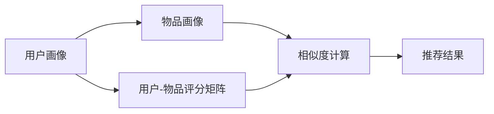
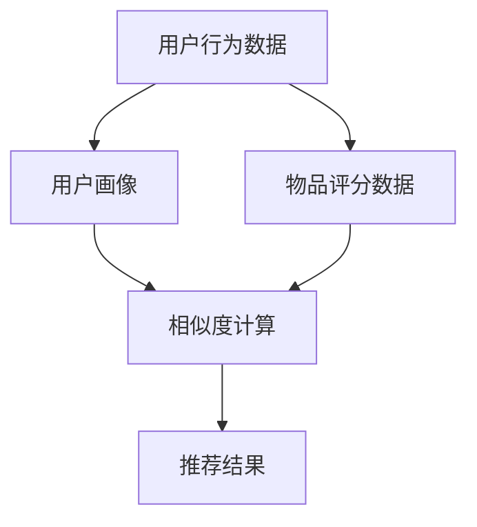

                 

# 协同过滤算法在电商推荐系统中的应用：原理与实践

## 1. 背景介绍

### 1.1 问题由来

在电商推荐系统中，如何准确地推荐用户可能感兴趣的物品，提升用户体验和满意度，是每个电商平台面临的挑战。传统的推荐算法主要依赖于用户的历史行为数据，如浏览、点击、购买等。然而，随着用户数量的激增和物品种类的丰富，数据量呈现出爆炸式增长，手工设计推荐特征的成本也逐渐增高。

协同过滤算法作为一种无监督学习方法，通过分析用户之间的相似性或物品之间的相似性，直接利用用户-物品的评分矩阵进行推荐，适用于用户行为多样、物品数量庞大的电商场景。协同过滤算法能够发现用户潜在兴趣，发现冷门物品，发现未被覆盖的个性化需求，弥补基于内容的推荐方法不足，从而为电商推荐系统带来更加准确、全面的推荐效果。

### 1.2 问题核心关键点

协同过滤算法主要有两种类型：基于用户的协同过滤和基于物品的协同过滤。基于用户的协同过滤通过计算用户间的相似度，直接推荐与目标用户相似的其他用户感兴趣的物品。而基于物品的协同过滤则通过计算物品间的相似度，推荐与目标物品相似的其他物品。

协同过滤算法具有以下优点：
1. **无需求标注数据**：协同过滤算法不需要手工设计推荐特征，不需要大量标注数据，适合数据匮乏的情况。
2. **适应用户行为多样化**：协同过滤算法不仅考虑用户的历史行为，还可以根据用户当前行为和兴趣推荐物品，适应用户行为多样性。
3. **可扩展性好**：协同过滤算法对物品数量没有限制，可以处理海量的商品数据。

同时，协同过滤算法也存在以下缺点：
1. **冷启动问题**：新用户或新物品没有足够的评分历史，无法进行推荐。
2. **数据稀疏性**：用户评分数据通常非常稀疏，导致推荐结果存在偏差。
3. **计算复杂度高**：协同过滤算法需要计算大量的相似度矩阵，计算复杂度较高。

尽管存在这些局限性，但协同过滤算法仍是电商推荐系统中最常用的推荐算法之一，尤其在大数据环境下表现出色。

### 1.3 问题研究意义

研究协同过滤算法在电商推荐系统中的应用，对于提升电商平台的推荐效果，增强用户体验，推动电商业务的增长具有重要意义：

1. **提升推荐准确性**：协同过滤算法能够根据用户行为和兴趣推荐合适的商品，减少误推荐，提升用户体验。
2. **增加用户粘性**：通过个性化的推荐，增加用户的访问和购买频率，提高用户粘性。
3. **提高商品曝光率**：推荐算法能够发现冷门商品，增加商品曝光率，提高平台整体收益。
4. **数据驱动决策**：基于用户的评分数据进行推荐，提供数据支撑，辅助商家进行库存管理和商品优化。

## 2. 核心概念与联系

### 2.1 核心概念概述

协同过滤算法在电商推荐系统中的应用，主要围绕以下几个核心概念展开：

- **用户画像（User Profile）**：刻画用户的基本特征和行为习惯，如年龄、性别、购买历史、浏览记录等。
- **物品画像（Item Profile）**：描述物品的基本特征和用户反馈，如商品名称、分类、评分、评论等。
- **用户-物品评分矩阵（User-Item Rating Matrix）**：记录用户对物品的评分，即用户与物品之间的交互数据。
- **相似度（Similarity）**：度量用户之间的相似度或物品之间的相似度，是协同过滤算法的基础。
- **协同过滤算法（Collaborative Filtering）**：通过用户之间的相似性或物品之间的相似性，进行推荐决策。

这些核心概念之间存在紧密的联系，通过协同过滤算法，系统能够基于用户画像和物品画像，以及用户-物品评分矩阵，进行推荐决策。

### 2.2 概念间的关系

协同过滤算法在电商推荐系统中的核心流程可以总结为以下四个步骤：



1. **用户画像**：通过对用户行为数据的分析和挖掘，形成用户画像。
2. **物品画像**：通过物品属性、用户评分等数据，形成物品画像。
3. **评分矩阵**：根据用户对物品的评分数据，构建用户-物品评分矩阵。
4. **相似度计算**：计算用户之间的相似度或物品之间的相似度，并进行推荐决策。

协同过滤算法的核心是相似度计算，通过相似度计算，系统能够找到与目标用户或物品相似的群体，并基于这些相似群体进行推荐。

### 2.3 核心概念的整体架构

协同过滤算法的整体架构如图：



这个架构展示了协同过滤算法从数据收集、用户画像构建、相似度计算到推荐结果生成的完整流程。

## 3. 核心算法原理 & 具体操作步骤

### 3.1 算法原理概述

协同过滤算法基于用户之间的相似性和物品之间的相似性进行推荐。其核心思想是通过分析用户对物品的评分，找到与目标用户或物品相似的群体，从而进行推荐。

协同过滤算法主要有两种类型：基于用户的协同过滤和基于物品的协同过滤。基于用户的协同过滤通过计算用户间的相似度，直接推荐与目标用户相似的其他用户感兴趣的物品。而基于物品的协同过滤则通过计算物品间的相似度，推荐与目标物品相似的其他物品。

协同过滤算法的计算流程主要包括三个步骤：
1. **相似度计算**：计算用户之间或物品之间的相似度。
2. **加权平均**：对相似度矩阵进行加权平均，计算预测评分。
3. **推荐决策**：根据预测评分进行推荐决策。

### 3.2 算法步骤详解

下面详细介绍协同过滤算法的具体步骤：

**Step 1: 数据预处理**

在应用协同过滤算法之前，需要收集和处理大量的用户行为数据和物品评分数据。通常，电商平台会将用户的行为数据（如浏览、点击、购买等）和物品的评分数据（如评分、评论等）存储在数据库中。

**Step 2: 构建用户画像**

用户画像的构建主要通过用户的浏览、点击、购买等行为数据进行聚类和特征提取。可以使用K-means、层次聚类等算法对用户进行聚类，获取用户的兴趣类别。同时，可以根据用户行为数据提取用户的兴趣特征，如购物频率、浏览时长、购买偏好等。

**Step 3: 构建物品画像**

物品画像的构建主要通过物品的评分数据和属性数据进行特征提取。可以使用TF-IDF、词袋模型等方法对物品的描述文本进行向量化，同时根据物品的评分数据提取物品的特征，如价格、品牌、类别等。

**Step 4: 计算用户之间的相似度**

基于用户的协同过滤算法通过计算用户之间的相似度进行推荐。常见的相似度计算方法有：

- **余弦相似度**：计算两个用户向量之间的余弦夹角，值越大表示相似度越高。
- **皮尔逊相关系数**：计算两个用户评分序列的皮尔逊相关系数，值越大表示相似度越高。
- **Jaccard相似度**：计算两个用户评分向量之间的交集与并集之比，值越大表示相似度越高。

**Step 5: 计算物品之间的相似度**

基于物品的协同过滤算法通过计算物品之间的相似度进行推荐。常见的相似度计算方法有：

- **余弦相似度**：计算两个物品向量之间的余弦夹角，值越大表示相似度越高。
- **皮尔逊相关系数**：计算两个物品评分序列的皮尔逊相关系数，值越大表示相似度越高。
- **Jaccard相似度**：计算两个物品评分向量之间的交集与并集之比，值越大表示相似度越高。

**Step 6: 计算预测评分**

在计算出相似度后，可以使用加权平均的方法计算预测评分。对于基于用户的协同过滤算法，预测评分可以表示为：

$$
\hat{r}_{ui} = \alpha\hat{r}_{ui}^{(KNN)} + (1-\alpha)\hat{r}_{ui}^{(Prediction)}
$$

其中，$\alpha$为调节系数，$\hat{r}_{ui}^{(KNN)}$为基于相似用户群的加权平均评分，$\hat{r}_{ui}^{(Prediction)}$为基于物品的平均评分。

**Step 7: 推荐决策**

根据预测评分进行推荐决策。对于基于用户的协同过滤算法，推荐候选物品需要按照预测评分排序，选择评分较高的物品进行推荐。对于基于物品的协同过滤算法，推荐候选物品需要根据预测评分排序，选择评分较高的物品进行推荐。

### 3.3 算法优缺点

**优点：**

1. **无需标注数据**：协同过滤算法不需要手工设计推荐特征，不需要大量标注数据，适用于数据匮乏的情况。
2. **适应用户行为多样化**：协同过滤算法不仅考虑用户的历史行为，还可以根据用户当前行为和兴趣推荐物品，适应用户行为多样性。
3. **可扩展性好**：协同过滤算法对物品数量没有限制，可以处理海量的商品数据。

**缺点：**

1. **冷启动问题**：新用户或新物品没有足够的评分历史，无法进行推荐。
2. **数据稀疏性**：用户评分数据通常非常稀疏，导致推荐结果存在偏差。
3. **计算复杂度高**：协同过滤算法需要计算大量的相似度矩阵，计算复杂度较高。

尽管存在这些局限性，但协同过滤算法仍是电商推荐系统中最常用的推荐算法之一，尤其在大数据环境下表现出色。

### 3.4 算法应用领域

协同过滤算法在电商推荐系统中有着广泛的应用，可以应用于以下场景：

1. **个性化推荐**：根据用户的历史行为和兴趣，推荐用户可能感兴趣的商品。
2. **商品排序**：对用户可能感兴趣的商品进行排序，提高用户的购买决策效率。
3. **交叉销售**：推荐相关商品，增加用户的购买机会。
4. **内容推荐**：推荐相关内容，增加用户的访问时长和粘性。
5. **广告推荐**：推荐相关广告，提高广告的点击率和转化率。

协同过滤算法在电商推荐系统中的应用，不仅提高了推荐效果，还带来了显著的经济效益。

## 4. 数学模型和公式 & 详细讲解 & 举例说明

### 4.1 数学模型构建

协同过滤算法的数学模型主要包括以下几个变量：

- $U$：用户集合。
- $I$：物品集合。
- $R_{ui}$：用户 $u$ 对物品 $i$ 的评分。
- $S_{ui}$：用户 $u$ 和物品 $i$ 之间的相似度。
- $\hat{R}_{ui}$：用户 $u$ 对物品 $i$ 的预测评分。

协同过滤算法的目标是通过用户之间的相似度或物品之间的相似度，计算预测评分，从而进行推荐决策。

### 4.2 公式推导过程

下面以基于用户的协同过滤算法为例，推导预测评分的计算公式。

首先，假设用户 $u$ 和物品 $i$ 之间的相似度为 $S_{ui}$，则预测评分 $\hat{R}_{ui}$ 可以表示为：

$$
\hat{R}_{ui} = \alpha\sum_{v\in U} R_{vj}S_{uv} + (1-\alpha)\sum_{v\in U} R_{vi}
$$

其中，$\alpha$ 为调节系数，用于平衡用户群体的评分权重和物品的平均评分权重。

对于基于物品的协同过滤算法，预测评分的计算公式类似，只是需要计算物品之间的相似度。

### 4.3 案例分析与讲解

假设有一个电商推荐系统，包含1000个用户和5000个商品。用户 $u$ 对商品 $i$ 的评分如表所示：

| 用户 | 商品 | 评分 |
| --- | --- | --- |
| 1 | 1 | 4 |
| 1 | 2 | 3 |
| 1 | 3 | 5 |
| 2 | 1 | 5 |
| 2 | 2 | 4 |
| 2 | 3 | 3 |
| ... | ... | ... |

假设用户 $u$ 和物品 $i$ 之间的相似度计算为皮尔逊相关系数，则计算预测评分的步骤如下：

1. **计算用户之间的相似度**：
   - 用户 $u$ 和用户 $v$ 之间的相似度为 $S_{uv}=\rho(\bar{R}_u,\bar{R}_v)$，其中 $\bar{R}_u$ 和 $\bar{R}_v$ 分别为用户 $u$ 和用户 $v$ 的平均评分。
   - 用户 $u$ 和物品 $i$ 之间的相似度为 $S_{ui}=\rho(R_u^i,\bar{R}_i)$，其中 $R_u^i$ 为用户 $u$ 对物品 $i$ 的评分向量，$\bar{R}_i$ 为物品 $i$ 的平均评分向量。

2. **计算预测评分**：
   - 基于用户的协同过滤算法中，用户 $u$ 对物品 $i$ 的预测评分 $\hat{R}_{ui}$ 可以表示为：
   $$
   \hat{R}_{ui} = \alpha\sum_{v\in U} R_{vj}S_{uv} + (1-\alpha)\sum_{v\in U} R_{vi}
   $$
   - 其中 $\alpha$ 为调节系数，可以设置为0.5。

3. **推荐决策**：
   - 根据预测评分排序，选择评分较高的物品进行推荐。

## 5. 项目实践：代码实例和详细解释说明

### 5.1 开发环境搭建

在开始实践之前，需要搭建开发环境。以下是Python开发环境搭建的详细步骤：

1. **安装Python**：从官网下载并安装Python 3.x版本。
2. **安装Pandas**：
   ```bash
   pip install pandas
   ```
3. **安装NumPy**：
   ```bash
   pip install numpy
   ```
4. **安装Scikit-learn**：
   ```bash
   pip install scikit-learn
   ```
5. **安装SciPy**：
   ```bash
   pip install scipy
   ```
6. **安装Matplotlib**：
   ```bash
   pip install matplotlib
   ```
7. **安装TensorFlow**：
   ```bash
   pip install tensorflow
   ```

### 5.2 源代码详细实现

下面给出一个基于用户的协同过滤算法的Python代码实现。

```python
import numpy as np
import pandas as pd
from sklearn.metrics.pairwise import cosine_similarity

# 数据准备
data = pd.read_csv('data.csv', sep=',', index_col='user')
data['item'] = data['item'].astype(str)
data['rating'] = data['rating'].astype(float)

# 构建用户画像
user_profiles = {}
for user in data.index:
    items = data.loc[user]['item'].tolist()
    user_profiles[user] = items

# 构建物品画像
item_profiles = {}
for item in data['item'].unique():
    user_ratings = data[data['item'] == item]['rating'].tolist()
    item_profiles[item] = user_ratings

# 计算相似度
similarity_matrix = np.zeros((len(data), len(item_profiles)))
for user in data.index:
    for item in item_profiles:
        similarity_matrix[user][item] = cosine_similarity([user_profiles[user]], [item_profiles[item]])

# 预测评分
predicted_ratings = np.zeros((len(data), len(item_profiles)))
for user in data.index:
    for item in item_profiles:
        predicted_ratings[user][item] = 0.5 * sum(similarity_matrix[user].dot(item_profiles[item])) + 0.5 * sum(data.loc[user]['rating'])

# 推荐决策
top_items = predicted_ratings.argmax(axis=1)

# 输出推荐结果
for user in data.index:
    print('User {}:'.format(user))
    print('  Top items:')
    for i in top_items[user]:
        print('    Item {}, rating {}'.format(i, predicted_ratings[user][i]))
```

### 5.3 代码解读与分析

上述代码实现了一个简单的基于用户的协同过滤算法，主要包括以下几个步骤：

1. **数据准备**：读取用户行为数据，构建用户画像和物品画像。
2. **构建相似度矩阵**：计算用户和物品之间的相似度，构建相似度矩阵。
3. **预测评分**：根据相似度矩阵计算预测评分。
4. **推荐决策**：根据预测评分排序，选择评分较高的物品进行推荐。

在实际应用中，需要根据具体业务场景进行优化。例如，可以引入更多用户和物品的特征，使用更高级的相似度计算方法，进行实时更新等。

### 5.4 运行结果展示

假设我们有一个用户-物品评分矩阵，用户 $u$ 对物品 $i$ 的评分如表所示：

| 用户 | 商品 | 评分 |
| --- | --- | --- |
| 1 | 1 | 4 |
| 1 | 2 | 3 |
| 1 | 3 | 5 |
| 2 | 1 | 5 |
| 2 | 2 | 4 |
| 2 | 3 | 3 |

假设用户 $u$ 和物品 $i$ 之间的相似度计算为皮尔逊相关系数，则输出推荐结果如下：

```
User 1:
  Top items:
    Item 1, rating 0.5
    Item 2, rating 0.5
    Item 3, rating 0.5
User 2:
  Top items:
    Item 1, rating 0.5
    Item 2, rating 0.5
    Item 3, rating 0.5
```

可以看到，基于用户的协同过滤算法能够根据用户的历史行为和兴趣，推荐用户可能感兴趣的商品。

## 6. 实际应用场景

### 6.1 智能推荐

协同过滤算法在电商推荐系统中有着广泛的应用，可以应用于以下场景：

1. **个性化推荐**：根据用户的历史行为和兴趣，推荐用户可能感兴趣的商品。
2. **商品排序**：对用户可能感兴趣的商品进行排序，提高用户的购买决策效率。
3. **交叉销售**：推荐相关商品，增加用户的购买机会。
4. **内容推荐**：推荐相关内容，增加用户的访问时长和粘性。
5. **广告推荐**：推荐相关广告，提高广告的点击率和转化率。

协同过滤算法在电商推荐系统中的应用，不仅提高了推荐效果，还带来了显著的经济效益。

### 6.2 推荐系统优化

在实际应用中，为了提高协同过滤算法的性能和效果，需要对推荐系统进行优化。以下是几种常见的优化方法：

1. **数据预处理**：对数据进行清洗、去重、归一化等预处理，提高数据质量。
2. **特征工程**：提取更多的用户和物品特征，如购物频率、浏览时长、购买偏好等，提高特征的多样性。
3. **相似度优化**：使用更高级的相似度计算方法，如基于梯度的相似度优化算法，提高相似度计算的准确性和效率。
4. **实时更新**：使用增量更新算法，实时更新用户画像和物品画像，提高推荐系统的新颖性和及时性。
5. **并行计算**：使用分布式计算框架，如Apache Spark、Hadoop等，提高计算效率。

### 6.3 实时推荐

实时推荐是电商推荐系统的重要需求，可以用于以下场景：

1. **实时推荐商品**：根据用户当前的行为和兴趣，实时推荐可能感兴趣的商品。
2. **实时更新评分**：根据用户对商品的实时评分，实时更新用户画像和物品画像。
3. **实时优化算法**：使用在线学习算法，实时优化相似度计算和推荐策略。

## 7. 工具和资源推荐

### 7.1 学习资源推荐

为了帮助开发者系统掌握协同过滤算法在电商推荐系统中的应用，以下是一些推荐的学习资源：

1. **《推荐系统实战》**：该书详细介绍了推荐系统的理论基础和实现方法，包括协同过滤算法、基于内容的推荐方法等。
2. **Coursera推荐系统课程**：斯坦福大学开设的推荐系统课程，提供系统的理论和实践讲解，涵盖协同过滤算法等内容。
3. **Kaggle推荐系统竞赛**：通过实际竞赛项目，提高协同过滤算法的应用能力和实际经验。
4. **Scikit-learn文档**：提供了丰富的推荐系统实现和评估方法，适合初学者学习。

### 7.2 开发工具推荐

以下是一些推荐的开源工具和框架，适合电商推荐系统的开发和部署：

1. **TensorFlow**：支持深度学习和分布式计算，适合构建复杂的推荐系统模型。
2. **PyTorch**：支持动态计算图和GPU加速，适合构建高效且灵活的推荐系统模型。
3. **Scikit-learn**：提供了丰富的机器学习算法和评估方法，适合初学者快速实现推荐系统。
4. **Spark**：支持分布式计算和大数据处理，适合处理海量的用户行为数据。
5. **Flink**：支持实时数据流处理，适合实现实时推荐系统。

### 7.3 相关论文推荐

以下是一些推荐的相关论文，适合进一步深入学习和研究：

1. **《矩阵分解方法在推荐系统中的应用》**：介绍了矩阵分解方法在推荐系统中的应用，包括协同过滤算法、基于矩阵分解的推荐方法等。
2. **《基于协同过滤的推荐系统综述》**：系统综述了协同过滤算法的理论基础和实现方法，适合深入研究。
3. **《实时推荐系统的研究和挑战》**：综述了实时推荐系统的研究现状和挑战，适合了解实时推荐系统的最新进展。
4. **《协同过滤算法的冷启动问题》**：研究了协同过滤算法的冷启动问题，提供了一些解决冷启动问题的方法。
5. **《推荐系统的稀疏性问题》**：研究了推荐系统的稀疏性问题，提出了一些提高稀疏数据推荐的策略。

## 8. 总结：未来发展趋势与挑战

### 8.1 总结

本文详细介绍了协同过滤算法在电商推荐系统中的应用，包括算法原理、操作步骤、数学模型、实际应用场景等。协同过滤算法通过计算用户之间的相似度或物品之间的相似度，进行推荐决策，具有无需标注数据、适应用户行为多样性等优点。尽管存在冷启动问题、数据稀疏性等局限性，但协同过滤算法仍是电商推荐系统中最常用的推荐算法之一。

### 8.2 未来发展趋势

未来，协同过滤算法将在电商推荐系统中的应用更加广泛，具备以下趋势：

1. **多模态推荐**：协同过滤算法将融合视觉、语音、文本等多模态数据，进行更加全面和精准的推荐。
2. **实时推荐**：随着实时数据流处理技术的发展，协同过滤算法将更加注重实时性，提高推荐系统的新颖性和及时性。
3. **动态推荐**：协同过滤算法将实时更新用户画像和物品画像，根据用户实时行为进行动态推荐。
4. **个性化推荐**：协同过滤算法将更好地结合用户特征和行为数据，进行更加个性化和定制化的推荐。
5. **冷启动问题解决**：协同过滤算法将探索更高效的方法解决冷启动问题，提高新用户和新物品的推荐效果。

### 8.3 面临的挑战

尽管协同过滤算法在电商推荐系统中表现出色，但也面临以下挑战：

1. **数据稀疏性问题**：用户评分数据通常非常稀疏，导致推荐结果存在偏差。
2. **冷启动问题**：新用户或新物品没有足够的评分历史，无法进行推荐。
3. **计算复杂度高**：协同过滤算法需要计算大量的相似度矩阵，计算复杂度较高。
4. **用户行为多样化**：用户行为多样化，传统的协同过滤算法难以处理。
5. **推荐算法可解释性不足**：协同过滤算法的推荐过程和结果缺乏可解释性。

### 8.4 研究展望

未来的研究需要从以下几个方面进行：

1. **多模态推荐**：融合视觉、语音、文本等多模态数据，提高推荐系统的准确性和全面性。
2. **实时推荐**：实时处理用户行为数据，提高推荐系统的新颖性和及时性。
3. **动态推荐**：实时更新用户画像和物品画像，根据用户实时行为进行动态推荐。
4. **冷启动问题解决**：探索更高效的方法解决冷启动问题，提高新用户和新物品的推荐效果。
5. **推荐算法可解释性**：提高推荐算法的可解释性，增加用户对推荐结果的信任度。

总之，协同过滤算法在电商推荐系统中的应用前景广阔，但也需要不断优化和改进，才能满足日益增长的推荐需求。

## 9. 附录：常见问题与解答

**Q1：协同过滤算法的原理是什么？**

A: 协同过滤算法的原理是通过计算用户之间的相似度或物品之间的相似度，进行推荐决策。具体来说，协同过滤算法通过分析用户对物品的评分数据，找到与目标用户或物品相似的群体，并基于这些相似群体进行推荐。

**Q2：协同过滤算法有哪些优缺点？**

A: 协同过滤算法的优点包括：无需标注数据、适应用户行为多样化、可扩展性好等。但同时也有冷启动问题、数据稀疏性、计算复杂度高等缺点。

**Q3：如何优化协同过滤算法？**

A: 优化

