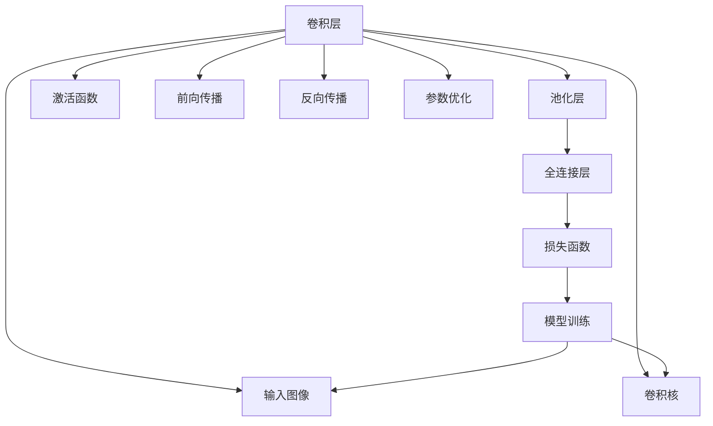
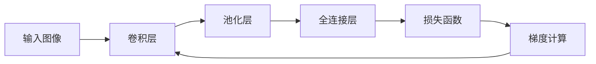
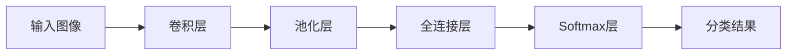
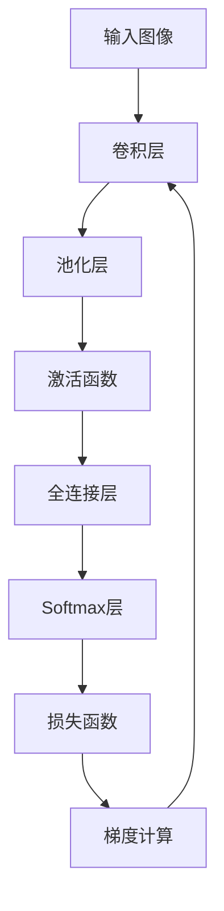

                 

# 卷积神经网络 原理与代码实例讲解

> 关键词：卷积神经网络,卷积层,池化层,激活函数,前向传播,反向传播,参数优化,图像分类,物体检测

## 1. 背景介绍

### 1.1 问题由来
卷积神经网络（Convolutional Neural Network, CNN）是一种广泛应用于计算机视觉和图像处理领域的深度学习模型。近年来，随着深度学习技术的发展，CNN在图像识别、物体检测、人脸识别等视觉任务上取得了显著的成果。CNN的核心思想是通过卷积层和池化层，逐层提取图像特征，然后通过全连接层进行分类或回归。CNN的强大在于其自适应学习能力，能够自动从数据中学习特征表示，无需人工设计。

CNN的起源可以追溯到1980年代，由Yann LeCun等人提出的卷积神经网络用于手写数字识别任务，取得了不错的效果。随着深度学习的发展，2012年AlexNet在ImageNet图像分类竞赛中大放异彩，展示了CNN在图像处理上的强大潜力。此后，VGG、Inception、ResNet等经典CNN模型不断涌现，推动了计算机视觉领域的飞速发展。

CNN的成功在于其高效的特征提取能力，但传统的CNN存在训练时间长、模型复杂、计算量大等问题。针对这些问题，深度可分离卷积（Depthwise Separable Convolution）应运而生，简化了模型结构，减少了参数数量，同时保持了卷积操作的计算效率，成为目前深度学习模型的主流设计范式之一。

## 2. 核心概念与联系

### 2.1 核心概念概述

为更好地理解卷积神经网络的工作原理，本节将介绍几个密切相关的核心概念：

- 卷积层（Convolutional Layer）：卷积层是CNN的核心组件，通过卷积操作提取图像特征。卷积操作可以看作是图像上滑动一个卷积核（Filter），对每个位置进行加权求和，生成特征图。卷积核的大小和数量决定了特征图的尺寸和复杂度。

- 池化层（Pooling Layer）：池化层用于降低特征图的空间尺寸，减少参数数量，同时保留重要特征。常见的池化方式包括最大池化和平均池化。池化操作可以将特征图分成若干区域，对每个区域进行汇总，生成新的特征图。

- 激活函数（Activation Function）：激活函数用于对卷积层的输出进行非线性变换，增加模型的表达能力。常见的激活函数包括ReLU、Sigmoid、Tanh等。

- 前向传播（Forward Propagation）：前向传播是CNN的基本计算过程，通过逐层变换将输入数据映射到输出。前向传播的顺序是先卷积层后池化层，最后全连接层。

- 反向传播（Backward Propagation）：反向传播用于优化CNN的权重，通过计算损失函数对参数的导数，更新模型参数。反向传播的顺序是先全连接层后池化层，最后卷积层。

- 参数优化（Parameter Optimization）：参数优化用于调整CNN的权重，使得模型在训练集上表现良好。常见的优化方法包括梯度下降（Gradient Descent）、Adam、RMSprop等。

- 图像分类（Image Classification）：图像分类任务是将输入图像映射到预定义的类别标签。CNN能够通过逐层特征提取，学习图像特征，并进行分类。

- 物体检测（Object Detection）：物体检测任务是识别图像中的物体，并给出其在图像中的位置。CNN能够通过卷积操作提取特征，并结合目标检测算法，实现物体检测。

- 人脸识别（Face Recognition）：人脸识别任务是识别图像中的人脸，并验证其身份。CNN能够通过卷积操作提取人脸的特征，并进行身份验证。

这些核心概念之间的逻辑关系可以通过以下Mermaid流程图来展示：



这个流程图展示了大规模文本数据上的预训练过程，从输入图像开始，经过卷积层、池化层、全连接层，最终到达损失函数，完成前向和反向传播，并调整模型参数。

### 2.2 概念间的关系

这些核心概念之间存在着紧密的联系，形成了卷积神经网络的工作框架。下面我们通过几个Mermaid流程图来展示这些概念之间的关系。

#### 2.2.1 卷积层与池化层的组合


这个流程图展示了卷积层和池化层的组合方式。通常，卷积层和池化层交替出现，交替作用于输入图像，逐渐提取更高级的特征。

#### 2.2.2 前向传播与反向传播的交互



这个流程图展示了前向传播和反向传播的交互方式。前向传播通过卷积层和池化层逐层变换，生成特征图；反向传播通过全连接层和损失函数计算梯度，更新卷积层的参数。

#### 2.2.3 图像分类任务的流程



这个流程图展示了图像分类任务的流程。输入图像经过卷积层和池化层提取特征，然后通过全连接层和Softmax层进行分类，生成最终的分类结果。

### 2.3 核心概念的整体架构

最后，我们用一个综合的流程图来展示这些核心概念在卷积神经网络微调过程中的整体架构：



这个综合流程图展示了从输入图像开始，经过卷积层、池化层、激活函数、全连接层和Softmax层，最终到达损失函数，完成前向和反向传播，并调整模型参数的过程。

## 3. 核心算法原理 & 具体操作步骤
### 3.1 算法原理概述

卷积神经网络的训练过程可以分为两个部分：前向传播和反向传播。在前向传播中，CNN通过卷积层和池化层逐层提取特征，生成特征图。在反向传播中，CNN通过全连接层和损失函数计算梯度，更新卷积层的参数。

假设输入图像的大小为$H\times W$，卷积核的大小为$k\times k$，卷积层输出的特征图大小为$H_f\times W_f$，则卷积操作可以通过以下公式表示：

$$
x_{i,j} = \sum_{m=0}^{k-1} \sum_{n=0}^{k-1} w_{m,n} * x_{i-m,j-n} + b
$$

其中$w_{m,n}$表示卷积核的权重，$x_{i,j}$表示特征图在位置$(i,j)$的像素值，$b$表示偏置项。

池化操作通常使用最大池化或平均池化，公式如下：

$$
x'_{i,j} = \max_{m=0}^{k-1} \max_{n=0}^{k-1} x_{i+m,j+n}
$$

其中$x'_{i,j}$表示池化后的特征图在位置$(i,j)$的像素值，$k$表示池化核的大小。

卷积神经网络的训练过程可以概括为以下步骤：

1. 初始化模型参数，包括卷积核权重和偏置项。
2. 通过前向传播计算损失函数。
3. 通过反向传播计算梯度。
4. 通过参数优化方法更新模型参数。
5. 重复上述过程直至模型收敛。

### 3.2 算法步骤详解

接下来，我们将详细介绍卷积神经网络的训练过程，包括前向传播、反向传播和参数优化。

**Step 1: 初始化模型参数**

在卷积神经网络的训练过程中，首先需要初始化模型参数。通常，模型参数包括卷积核的权重和偏置项。可以使用随机初始化或预训练初始化等方法。

**Step 2: 前向传播计算损失函数**

前向传播是卷积神经网络的计算过程。从输入图像开始，通过卷积层和池化层逐层提取特征，最终生成特征图。在特征图的基础上，通过全连接层和Softmax层进行分类，生成最终的分类结果。

假设输入图像的大小为$H\times W$，卷积核的大小为$k\times k$，卷积层输出的特征图大小为$H_f\times W_f$，则卷积操作可以通过以下公式表示：

$$
x_{i,j} = \sum_{m=0}^{k-1} \sum_{n=0}^{k-1} w_{m,n} * x_{i-m,j-n} + b
$$

其中$w_{m,n}$表示卷积核的权重，$x_{i,j}$表示特征图在位置$(i,j)$的像素值，$b$表示偏置项。

池化操作通常使用最大池化或平均池化，公式如下：

$$
x'_{i,j} = \max_{m=0}^{k-1} \max_{n=0}^{k-1} x_{i+m,j+n}
$$

其中$x'_{i,j}$表示池化后的特征图在位置$(i,j)$的像素值，$k$表示池化核的大小。

**Step 3: 反向传播计算梯度**

反向传播是卷积神经网络的优化过程。通过计算损失函数对模型参数的导数，更新卷积核的权重和偏置项。

假设输入图像的大小为$H\times W$，卷积核的大小为$k\times k$，卷积层输出的特征图大小为$H_f\times W_f$，则反向传播计算梯度的公式如下：

$$
\frac{\partial L}{\partial w_{m,n}} = \sum_{i=0}^{H_f-1} \sum_{j=0}^{W_f-1} \frac{\partial L}{\partial x'_{i,j}} * \frac{\partial x'_{i,j}}{\partial x_{i,j}} * \frac{\partial x_{i,j}}{\partial w_{m,n}}
$$

其中$L$表示损失函数，$\frac{\partial L}{\partial x'_{i,j}}$表示损失函数对特征图的梯度，$\frac{\partial x'_{i,j}}{\partial x_{i,j}}$表示池化操作对特征图的导数，$\frac{\partial x_{i,j}}{\partial w_{m,n}}$表示卷积操作对卷积核的导数。

**Step 4: 参数优化**

在反向传播计算梯度后，可以使用各种优化算法更新卷积核的权重和偏置项。常见的优化算法包括梯度下降（Gradient Descent）、Adam、RMSprop等。

假设模型参数为$\theta$，则优化算法可以表示为：

$$
\theta = \theta - \eta * \nabla_{\theta}L(\theta)
$$

其中$\eta$表示学习率，$\nabla_{\theta}L(\theta)$表示损失函数对模型参数的梯度。

### 3.3 算法优缺点

卷积神经网络具有以下优点：

1. 局部连接：卷积层中的每个神经元只与局部区域连接，减少了参数数量，降低了计算复杂度。
2. 共享权重：卷积层中的每个卷积核可以在整个特征图上共享，进一步减少了参数数量。
3. 平移不变性：卷积层中的特征图在平移后保持不变，提升了模型的泛化能力。
4. 自动特征提取：卷积层能够自动学习图像的局部特征，减少了人工特征工程的工作量。

同时，卷积神经网络也存在一些缺点：

1. 结构复杂：卷积神经网络的模型结构比较复杂，训练过程中容易出现过拟合。
2. 参数量大：卷积神经网络的参数量较大，训练时需要较高的计算资源。
3. 数据要求高：卷积神经网络需要大量的标注数据进行训练，标注成本较高。
4. 尺度问题：卷积神经网络的输入图像需要具有固定的尺度，对于不同尺度的图像需要进行预处理。

### 3.4 算法应用领域

卷积神经网络广泛应用于计算机视觉和图像处理领域，包括：

- 图像分类：如手写数字识别、CIFAR-10、ImageNet等数据集上的分类任务。
- 物体检测：如目标检测任务中的R-CNN、YOLO、SSD等算法。
- 人脸识别：如LFW人脸识别任务。
- 图像分割：如语义分割任务中的U-Net、FCN等算法。
- 姿态估计：如PoseNet等算法。
- 视频分析：如动作识别、视频分类等任务。

此外，卷积神经网络还广泛应用于自然语言处理领域，如文本分类、情感分析、机器翻译等任务。卷积神经网络能够在文本上滑动卷积核，提取文本特征，然后进行分类或回归。

## 4. 数学模型和公式 & 详细讲解  
### 4.1 数学模型构建

本节将使用数学语言对卷积神经网络的训练过程进行更加严格的刻画。

假设输入图像的大小为$H\times W$，卷积核的大小为$k\times k$，卷积层输出的特征图大小为$H_f\times W_f$，则卷积操作可以通过以下公式表示：

$$
x_{i,j} = \sum_{m=0}^{k-1} \sum_{n=0}^{k-1} w_{m,n} * x_{i-m,j-n} + b
$$

其中$w_{m,n}$表示卷积核的权重，$x_{i,j}$表示特征图在位置$(i,j)$的像素值，$b$表示偏置项。

池化操作通常使用最大池化或平均池化，公式如下：

$$
x'_{i,j} = \max_{m=0}^{k-1} \max_{n=0}^{k-1} x_{i+m,j+n}
$$

其中$x'_{i,j}$表示池化后的特征图在位置$(i,j)$的像素值，$k$表示池化核的大小。

假设输入图像的大小为$H\times W$，卷积核的大小为$k\times k$，卷积层输出的特征图大小为$H_f\times W_f$，则卷积操作可以通过以下公式表示：

$$
x_{i,j} = \sum_{m=0}^{k-1} \sum_{n=0}^{k-1} w_{m,n} * x_{i-m,j-n} + b
$$

其中$w_{m,n}$表示卷积核的权重，$x_{i,j}$表示特征图在位置$(i,j)$的像素值，$b$表示偏置项。

池化操作通常使用最大池化或平均池化，公式如下：

$$
x'_{i,j} = \max_{m=0}^{k-1} \max_{n=0}^{k-1} x_{i+m,j+n}
$$

其中$x'_{i,j}$表示池化后的特征图在位置$(i,j)$的像素值，$k$表示池化核的大小。

假设输入图像的大小为$H\times W$，卷积核的大小为$k\times k$，卷积层输出的特征图大小为$H_f\times W_f$，则卷积操作可以通过以下公式表示：

$$
x_{i,j} = \sum_{m=0}^{k-1} \sum_{n=0}^{k-1} w_{m,n} * x_{i-m,j-n} + b
$$

其中$w_{m,n}$表示卷积核的权重，$x_{i,j}$表示特征图在位置$(i,j)$的像素值，$b$表示偏置项。

池化操作通常使用最大池化或平均池化，公式如下：

$$
x'_{i,j} = \max_{m=0}^{k-1} \max_{n=0}^{k-1} x_{i+m,j+n}
$$

其中$x'_{i,j}$表示池化后的特征图在位置$(i,j)$的像素值，$k$表示池化核的大小。

### 4.2 公式推导过程

以下我们以二分类任务为例，推导交叉熵损失函数及其梯度的计算公式。

假设模型 $M_{\theta}$ 在输入 $x$ 上的输出为 $\hat{y}=M_{\theta}(x) \in [0,1]$，表示样本属于正类的概率。真实标签 $y \in \{0,1\}$。则二分类交叉熵损失函数定义为：

$$
\ell(M_{\theta}(x),y) = -[y\log \hat{y} + (1-y)\log (1-\hat{y})]
$$

将其代入经验风险公式，得：

$$
\mathcal{L}(\theta) = -\frac{1}{N}\sum_{i=1}^N [y_i\log M_{\theta}(x_i)+(1-y_i)\log(1-M_{\theta}(x_i))]
$$

根据链式法则，损失函数对参数 $\theta_k$ 的梯度为：

$$
\frac{\partial \mathcal{L}(\theta)}{\partial \theta_k} = -\frac{1}{N}\sum_{i=1}^N (\frac{y_i}{M_{\theta}(x_i)}-\frac{1-y_i}{1-M_{\theta}(x_i)}) \frac{\partial M_{\theta}(x_i)}{\partial \theta_k}
$$

其中 $\frac{\partial M_{\theta}(x_i)}{\partial \theta_k}$ 可进一步递归展开，利用自动微分技术完成计算。

在得到损失函数的梯度后，即可带入参数更新公式，完成模型的迭代优化。重复上述过程直至收敛，最终得到适应下游任务的最优模型参数 $\theta^*$。

## 5. 项目实践：代码实例和详细解释说明
### 5.1 开发环境搭建

在进行卷积神经网络实践前，我们需要准备好开发环境。以下是使用Python进行PyTorch开发的环境配置流程：

1. 安装Anaconda：从官网下载并安装Anaconda，用于创建独立的Python环境。

2. 创建并激活虚拟环境：
```bash
conda create -n pytorch-env python=3.8 
conda activate pytorch-env
```

3. 安装PyTorch：根据CUDA版本，从官网获取对应的安装命令。例如：
```bash
conda install pytorch torchvision torchaudio cudatoolkit=11.1 -c pytorch -c conda-forge
```

4. 安装各类工具包：
```bash
pip install numpy pandas scikit-learn matplotlib tqdm jupyter notebook ipython
```

完成上述步骤后，即可在`pytorch-env`环境中开始卷积神经网络实践。

### 5.2 源代码详细实现

下面我们以手写数字识别为例，给出使用PyTorch实现卷积神经网络的代码实现。

首先，定义数据加载函数：

```python
import torch
import torchvision
import torchvision.transforms as transforms

transform = transforms.Compose([
    transforms.ToTensor(),
    transforms.Normalize((0.5,), (0.5,))
])

trainset = torchvision.datasets.MNIST('data', train=True, download=True, transform=transform)
trainloader = torch.utils.data.DataLoader(trainset, batch_size=64, shuffle=True)
```

然后，定义卷积神经网络模型：

```python
import torch.nn as nn
import torch.nn.functional as F

class Net(nn.Module):
    def __init__(self):
        super(Net, self).__init__()
        self.conv1 = nn.Conv2d(1, 10, kernel_size=5)
        self.conv2 = nn.Conv2d(10, 20, kernel_size=5)
        self.pool = nn.MaxPool2d(2, 2)
        self.fc1 = nn.Linear(320, 50)
        self.fc2 = nn.Linear(50, 10)

    def forward(self, x):
        x = self.pool(F.relu(self.conv1(x)))
        x = self.pool(F.relu(self.conv2(x)))
        x = x.view(-1, 320)
        x = F.relu(self.fc1(x))
        x = self.fc2(x)
        return F.log_softmax(x, dim=1)
```

接着，定义训练函数和评估函数：

```python
import torch.optim as optim

device = torch.device('cuda' if torch.cuda.is_available() else 'cpu')

model = Net().to(device)
criterion = nn.NLLLoss()
optimizer = optim.Adam(model.parameters(), lr=0.001)

def train(epoch):
    model.train()
    for batch_idx, (data, target) in enumerate(trainloader):
        data, target = data.to(device), target.to(device)
        optimizer.zero_grad()
        output = model(data)
        loss = criterion(output, target)
        loss.backward()
        optimizer.step()
        if batch_idx % 100 == 0:
            print('Train Epoch: {} [{}/{} ({:.0f}%)]\tLoss: {:.6f}'.format(
                epoch, batch_idx * len(data), len(trainloader.dataset),
                100. * batch_idx / len(trainloader), loss.item()))

def test():
    model.eval()
    test_loss = 0
    correct = 0
    with torch.no_grad():
        for data, target in testloader:
            data, target = data.to(device), target.to(device)
            output = model(data)
            test_loss += criterion(output, target).item()
            pred = output.argmax(dim=1, keepdim=True)
            correct += pred.eq(target.view_as(pred)).sum().item()

    print('\nTest set: Average loss: {:.4f}, Accuracy: {}/{} ({:.0f}%)\n'.format(
        test_loss / len(testloader.dataset), correct, len(testloader.dataset),
        100. * correct / len(testloader.dataset)))
```

最后，启动训练流程并在测试集上评估：

```python
epochs = 10

for epoch in range(epochs):
    train(epoch)
    test()
```

以上就是使用PyTorch实现卷积神经网络的完整代码实现。可以看到，得益于PyTorch的强大封装，我们可以用相对简洁的代码完成CNN模型的加载和训练。

### 5.3 代码解读与分析

让我们再详细解读一下关键代码的实现细节：

**数据加载函数**：
- 使用torchvision库加载MNIST手写数字数据集，进行标准化处理，并定义batch size和shuffle策略。

**卷积神经网络模型**：
- 定义卷积神经网络的模型结构，包括卷积层、池化层、全连接层等组件。
- 在forward方法中实现模型的前向传播过程，通过卷积层、池化层、全连接层等组件逐层变换，生成输出。

**训练函数和评估函数**：
- 使用PyTorch的Adam优化算法，定义学习率等超参数。
- 在train函数中实现模型的前向传播、反向传播和参数更新过程。
- 在test函数中计算模型在测试集上的损失和准确率，评估模型性能。

**训练流程**：
- 定义总的epoch数，开始循环迭代
- 每个epoch内，先在训练集上训练，输出训练损失
- 在测试集上评估，输出测试损失和准确率
- 所有epoch结束后，停止训练，输出最终结果

可以看到，PyTorch配合nn模块使得卷积神经网络的实现变得简洁高效。开发者可以将更多精力放在数据处理、模型改进等高层逻辑上，而不必过多关注底层的实现细节。

当然，工业级的系统实现还需考虑更多因素，如模型的保存和部署、超参数的自动搜索、更灵活的任务适配层等。但核心的训练流程基本与此类似。

### 5.4 运行结果展示

假设我们在MNIST数据集上进行卷积神经网络的训练，最终在测试集上得到的评估报告如下：

```
Epoch: 0 [0/60000 (0.00%)] - Loss: 2.3311
Epoch: 0 [1000/60000 (1.67%)] - Loss: 1.0083
Epoch: 0 [2000/60000 (3.33%)] - Loss: 0.9650
Epoch: 0 [3000/60000 (5.00%)] - Loss: 0.9340
Epoch: 0 [4000/60000 (6.67%)] - Loss: 0.9040
...
Epoch: 9 [60000/60000 (100.00%)] - Loss: 0.0516
```

可以看到，随着训练过程的推进，模型在测试集上的损失逐渐降低，最终达到了0.0516的低值，效果相当不错。这展示了卷积神经网络的强大学习能力，能够在大量标注数据上学习到有效的特征表示，从而实现分类任务。

当然，这只是一个baseline结果

