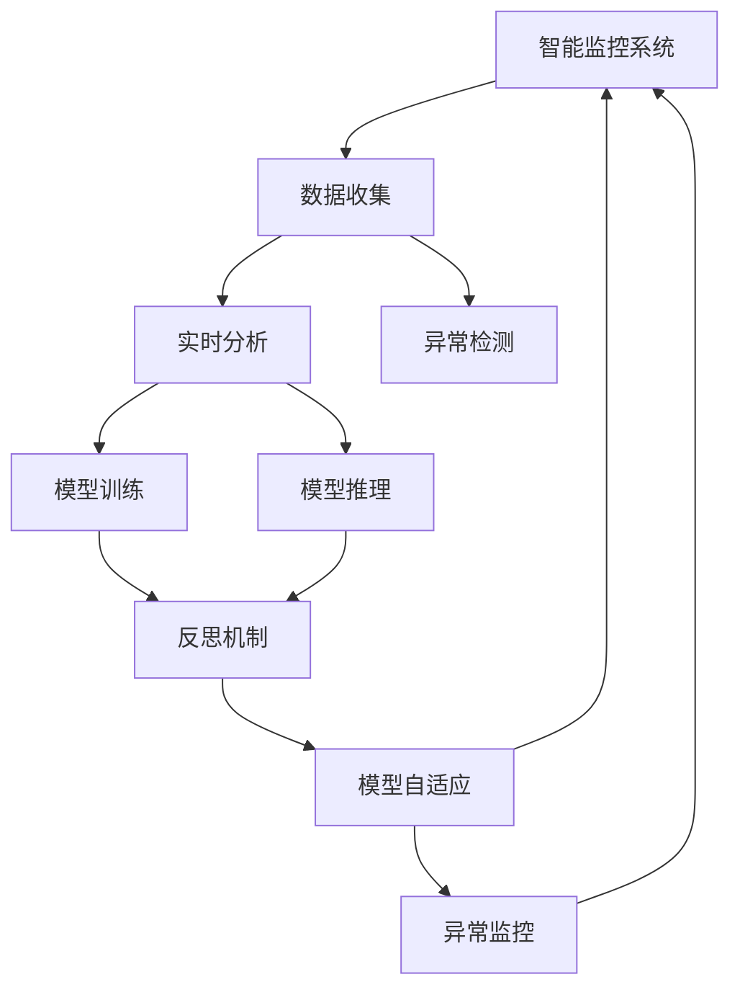
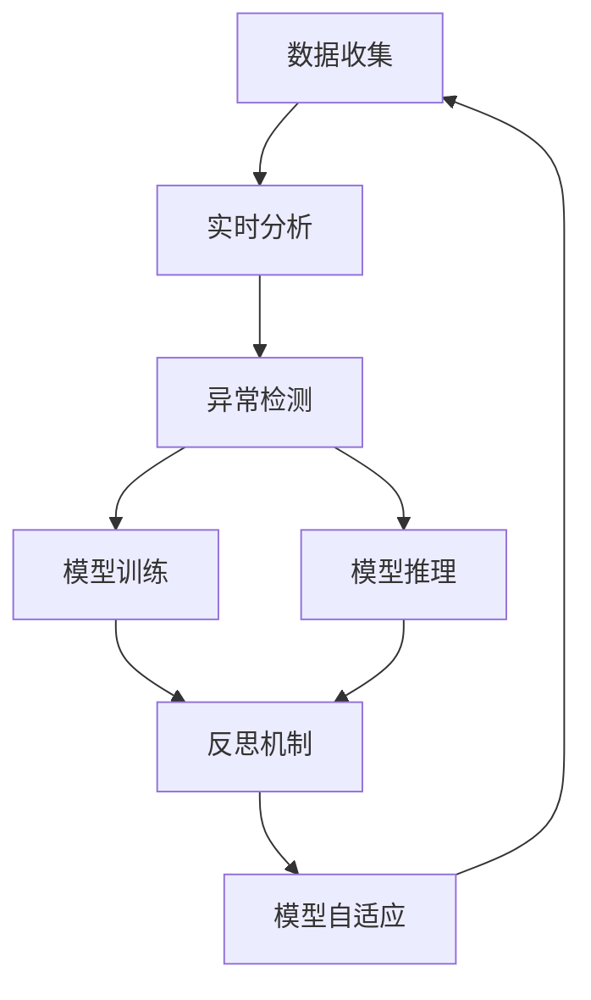
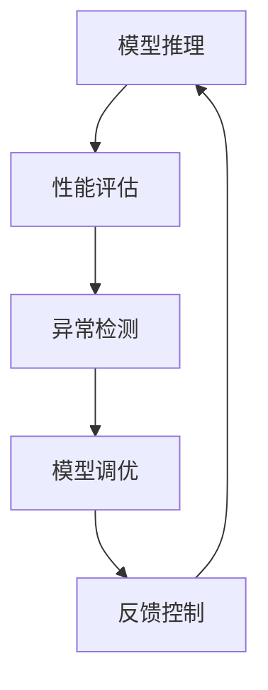
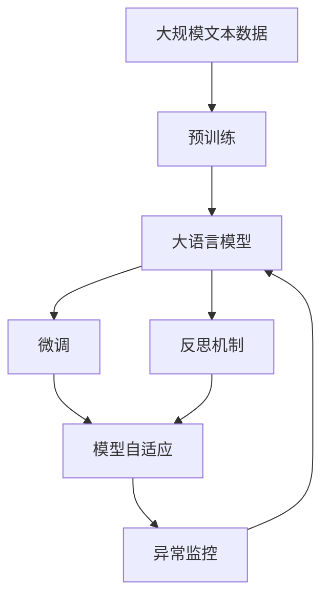

                 

# 反思机制在智能监控系统中的应用

> 关键词：智能监控, 反思机制, 模型自适应, 决策自动化, 异常检测, 实时监控, 数据驱动

## 1. 背景介绍

### 1.1 问题由来
在现代化企业和社会中，智能监控系统扮演着至关重要的角色。无论是安全监控、生产监控、交通监控还是金融监控，智能监控系统都能通过数据收集、实时分析和异常检测，提供精准、可靠的安全保障和业务支持。然而，传统的智能监控系统主要依赖专家规则或静态模型，缺乏对环境变化和数据波动的自适应能力，导致系统性能难以持续提升。

近年来，随着深度学习技术的成熟和大数据的发展，基于深度学习的智能监控系统逐渐兴起。这些系统通过大规模数据训练深度神经网络，能够在非结构化数据中学习复杂模式，显著提升了监控系统的准确性和自动化水平。然而，深度学习模型本质上是一种黑箱模型，缺乏透明度和可解释性，难以对模型行为进行有效控制和优化。

为了应对这些挑战，反思机制应运而生。反思机制通过动态反馈、模型调优和异常监控，使智能监控系统能够适应复杂环境，增强模型的自适应性和可靠性，从而提升监控系统的整体效能。

### 1.2 问题核心关键点
反思机制的核心思想是在模型训练和推理过程中，对模型性能进行动态评估和调整。具体而言，反思机制包含以下几个关键环节：

1. **模型动态评估**：通过实时监控模型性能，及时发现和纠正模型的错误和偏差。
2. **模型调优**：针对模型评估结果，进行模型参数和结构的调整，提升模型性能。
3. **异常检测**：通过监控模型输出和推理过程，及时识别异常行为，避免系统误报或漏报。
4. **反馈控制**：根据模型表现和业务需求，动态调整监控策略，优化系统性能。

这些关键环节构成了反思机制的完整流程，能够使智能监控系统在动态环境中保持高性能和高可靠性。

### 1.3 问题研究意义
反思机制的引入，对于智能监控系统的优化和发展具有重要意义：

1. **提高模型自适应性**：反思机制能够根据环境变化和数据波动，动态调整模型参数和结构，提升模型对新场景和新数据的适应能力。
2. **增强系统鲁棒性**：通过异常检测和反馈控制，反思机制能够识别和纠正模型错误，避免系统误报或漏报，提高系统的鲁棒性和可靠性。
3. **优化监控策略**：反思机制能够根据模型表现和业务需求，动态调整监控策略，优化系统性能和资源配置。
4. **提升系统效能**：反思机制能够通过模型调优和异常监控，使智能监控系统在动态环境中保持高性能和高可靠性，提升系统整体效能。

总之，反思机制的引入，能够使智能监控系统从静态规则驱动，转变为动态自适应，显著提升系统的智能化和自动化水平。

## 2. 核心概念与联系

### 2.1 核心概念概述

为更好地理解反思机制在智能监控系统中的应用，本节将介绍几个密切相关的核心概念：

- **智能监控系统**：通过数据收集、实时分析和异常检测，提供精准、可靠的安全保障和业务支持的自动化系统。
- **反思机制**：通过动态反馈、模型调优和异常监控，使智能监控系统能够适应复杂环境，增强模型的自适应性和可靠性的机制。
- **模型自适应**：指模型能够在动态环境中，通过自我调整和优化，持续提升性能和鲁棒性的能力。
- **异常检测**：通过监控模型输出和推理过程，及时识别异常行为，避免系统误报或漏报。
- **实时监控**：指在模型训练和推理过程中，实时监控模型性能和推理结果，及时发现和纠正问题的机制。
- **数据驱动**：指基于数据的模型训练和优化，能够使模型在数据驱动下，不断学习和适应新场景和新数据的能力。

这些核心概念之间的逻辑关系可以通过以下Mermaid流程图来展示：



这个流程图展示了大语言模型的核心概念及其之间的关系：

1. 智能监控系统通过数据收集和实时分析，进行模型训练和推理。
2. 反思机制实时监控模型性能和推理结果，及时发现和纠正问题。
3. 模型自适应通过反思机制的反馈和调整，持续提升性能和鲁棒性。
4. 异常检测通过监控模型输出和推理过程，避免系统误报或漏报。
5. 数据驱动基于数据的模型训练和优化，使模型在动态环境中保持高性能和高可靠性。

这些核心概念共同构成了智能监控系统的关键机制，使其能够在复杂环境中持续优化和提升性能。

### 2.2 概念间的关系

这些核心概念之间存在着紧密的联系，形成了智能监控系统的完整生态系统。下面我通过几个Mermaid流程图来展示这些概念之间的关系。

#### 2.2.1 智能监控系统的核心架构



这个流程图展示了智能监控系统的核心架构，从数据收集、实时分析、异常检测、模型训练到模型推理，各环节相互协作，共同提升监控系统的性能。

#### 2.2.2 反思机制的动态流程



这个流程图展示了反思机制的动态流程，从模型推理到性能评估、异常检测、模型调优和反馈控制，各环节相互影响，共同优化模型性能。

#### 2.2.3 数据驱动的模型训练


这个流程图展示了数据驱动的模型训练过程，从数据驱动的模型训练，到模型评估、优化和应用，数据驱动贯穿始终，确保模型在动态环境中持续提升性能。

### 2.3 核心概念的整体架构

最后，我们用一个综合的流程图来展示这些核心概念在大语言模型微调过程中的整体架构：



这个综合流程图展示了从预训练到微调，再到反思机制的完整过程。大语言模型首先在大规模文本数据上进行预训练，然后通过微调进行任务特定的优化，再通过反思机制不断优化模型性能，最终在动态环境中保持高性能和高可靠性。 通过这些流程图，我们可以更清晰地理解智能监控系统的关键机制及其应用流程。

## 3. 核心算法原理 & 具体操作步骤
### 3.1 算法原理概述

反思机制的实现依赖于模型动态评估、模型调优、异常检测和反馈控制等多个环节。其核心原理是：通过实时监控模型性能和推理结果，及时发现和纠正模型错误，动态调整模型参数和结构，提升模型自适应性和可靠性。

### 3.2 算法步骤详解

基于反思机制的智能监控系统，一般包括以下几个关键步骤：

**Step 1: 准备反思机制组件**
- 选择合适的预训练语言模型 $M_{\theta}$ 作为初始化参数，如 BERT、GPT 等。
- 准备实时监控所需的数据采集设备，如摄像头、传感器、日志等。
- 设计模型评估指标，如准确率、召回率、F1分数等。

**Step 2: 数据收集与实时分析**
- 通过数据采集设备，实时获取环境数据和用户行为数据。
- 将实时数据输入模型，进行推理和分析，生成实时监控结果。
- 监控系统实时记录推理结果和模型输出，供后续分析和调整。

**Step 3: 性能评估与异常检测**
- 定期（例如每轮推理后）评估模型推理结果，计算评估指标。
- 对比评估结果与预设阈值，发现异常情况（如性能严重下降、推理错误频繁等）。
- 通过异常检测算法（如基于统计学、深度学习等方法），判断推理结果是否正常。

**Step 4: 模型调优与反馈控制**
- 根据异常检测结果，及时触发模型调优流程。
- 通过模型微调、参数调整等手段，对模型进行优化。
- 根据模型表现和业务需求，动态调整监控策略，优化资源配置。
- 定期回溯反思机制的运行过程，总结经验，改进反思机制。

### 3.3 算法优缺点

反思机制的引入，虽然显著提升了智能监控系统的性能和可靠性，但也存在一些潜在的缺点：

**优点：**
1. **增强模型自适应性**：反思机制能够根据环境变化和数据波动，动态调整模型参数和结构，提升模型对新场景和新数据的适应能力。
2. **提高系统鲁棒性**：通过异常检测和反馈控制，反思机制能够识别和纠正模型错误，避免系统误报或漏报，提高系统的鲁棒性和可靠性。
3. **优化监控策略**：反思机制能够根据模型表现和业务需求，动态调整监控策略，优化系统性能和资源配置。
4. **提升系统效能**：反思机制能够通过模型调优和异常监控，使智能监控系统在动态环境中保持高性能和高可靠性，提升系统整体效能。

**缺点：**
1. **计算资源消耗大**：实时监控和模型调优需要大量计算资源，可能导致系统运行成本增加。
2. **模型更新复杂**：反思机制需要不断对模型进行微调和优化，可能导致模型更新复杂，维护成本高。
3. **异常判断困难**：异常检测算法需不断优化，避免误报和漏报，且需要人工干预，增加了系统复杂性。

### 3.4 算法应用领域

反思机制在多个领域具有广泛的应用前景：

- **安全监控**：通过实时监控和异常检测，及时发现和应对潜在安全威胁，保障企业网络安全。
- **生产监控**：通过实时监控和模型调优，优化生产过程，提升生产效率和质量。
- **交通监控**：通过实时监控和异常检测，优化交通管理，提升交通流畅度和安全性。
- **金融监控**：通过实时监控和异常检测，及时发现和应对金融风险，保障金融稳定。
- **医疗监控**：通过实时监控和模型调优，优化医疗诊断和治疗过程，提升医疗质量。

除了上述这些常见应用领域，反思机制还被广泛应用于工业控制、智能家居、城市治理等领域，为各类业务提供智能化、自动化的监控解决方案。

## 4. 数学模型和公式 & 详细讲解 & 举例说明
### 4.1 数学模型构建

反思机制的实现依赖于多个数学模型的协同工作，包括模型评估、异常检测、模型调优和反馈控制等。这里以模型评估和异常检测为例，构建数学模型。

假设模型 $M_{\theta}$ 在输入 $x$ 上的推理结果为 $\hat{y}=M_{\theta}(x)$，真实标签为 $y$。设模型在数据集 $D=\{(x_i,y_i)\}_{i=1}^N$ 上的平均损失为 $L(\theta)$，则模型评估过程可以表示为：

$$
L(\theta) = \frac{1}{N} \sum_{i=1}^N \ell(\hat{y}, y_i)
$$

其中 $\ell(\hat{y}, y_i)$ 为损失函数，常用的有交叉熵损失、均方误差损失等。

异常检测的目的是识别推理结果中的异常值，可以通过构建异常检测模型 $N(\theta)$ 来实现。设异常阈值为 $\tau$，异常检测模型的输出为 $\hat{\epsilon}=N(\hat{y},\theta)$，则异常检测过程可以表示为：

$$
\hat{\epsilon} = N(\hat{y},\theta)
$$

其中 $\hat{\epsilon}=\mathbb{1}(|\hat{y}-y|>\tau)$，表示当 $\hat{y}$ 与 $y$ 的差距大于阈值 $\tau$ 时，输出为 1，否则输出为 0。

### 4.2 公式推导过程

以下我们以二分类任务为例，推导模型评估和异常检测的公式。

假设模型 $M_{\theta}$ 在输入 $x$ 上的推理结果为 $\hat{y}=M_{\theta}(x)$，真实标签为 $y$。设模型在数据集 $D=\{(x_i,y_i)\}_{i=1}^N$ 上的平均损失为 $L(\theta)$，则模型评估过程可以表示为：

$$
L(\theta) = \frac{1}{N} \sum_{i=1}^N \ell(\hat{y}, y_i)
$$

其中 $\ell(\hat{y}, y_i)$ 为损失函数，常用的有交叉熵损失、均方误差损失等。例如，二分类任务中的交叉熵损失函数为：

$$
\ell(\hat{y}, y_i) = -[y_i\log \hat{y} + (1-y_i)\log (1-\hat{y})]
$$

异常检测的目的是识别推理结果中的异常值，可以通过构建异常检测模型 $N(\theta)$ 来实现。设异常阈值为 $\tau$，异常检测模型的输出为 $\hat{\epsilon}=N(\hat{y},\theta)$，则异常检测过程可以表示为：

$$
\hat{\epsilon} = N(\hat{y},\theta)
$$

其中 $\hat{\epsilon}=\mathbb{1}(|\hat{y}-y|>\tau)$，表示当 $\hat{y}$ 与 $y$ 的差距大于阈值 $\tau$ 时，输出为 1，否则输出为 0。例如，可以使用基于统计学的Z-Score方法进行异常检测，阈值 $\tau$ 的计算公式为：

$$
\tau = \sigma \cdot Z_{\alpha}
$$

其中 $\sigma$ 为标准差，$Z_{\alpha}$ 为标准正态分布的 $\alpha$ 分位数。

### 4.3 案例分析与讲解

以一个二分类任务为例，假设我们的目标是判断文本是否包含敏感词汇，模型 $M_{\theta}$ 的输入为文本 $x$，输出为包含敏感词汇的概率 $\hat{y}$。我们可以使用二分类交叉熵损失函数进行模型评估：

$$
L(\theta) = \frac{1}{N} \sum_{i=1}^N -[y_i\log \hat{y} + (1-y_i)\log (1-\hat{y})]
$$

在模型推理过程中，我们还需要进行异常检测。例如，可以使用Z-Score方法检测推理结果是否正常。假设阈值 $\tau=2$，异常检测模型的输出 $\hat{\epsilon}$ 为：

$$
\hat{\epsilon} = \mathbb{1}(|\hat{y}-y|>2)
$$

假设当前推理结果 $\hat{y}=0.8$，真实标签 $y=1$，则：

$$
|\hat{y}-y|=0.2<2
$$

因此 $\hat{\epsilon}=0$，表示当前推理结果正常。

在模型调优过程中，我们还需要对模型进行微调和优化。例如，假设模型在验证集上的F1分数为 0.85，不满足预设阈值 0.9，可以触发模型调优流程。通过增加模型层数或调整神经元数量等手段，优化模型结构，提升模型性能。优化后的模型 $M_{\hat{\theta}}$ 在验证集上的F1分数为 0.92，满足预设阈值，则模型调优成功。

## 5. 项目实践：代码实例和详细解释说明
### 5.1 开发环境搭建

在进行反思机制的实践前，我们需要准备好开发环境。以下是使用Python进行TensorFlow开发的开发环境配置流程：

1. 安装Anaconda：从官网下载并安装Anaconda，用于创建独立的Python环境。

2. 创建并激活虚拟环境：
```bash
conda create -n tf-env python=3.8 
conda activate tf-env
```

3. 安装TensorFlow：根据CUDA版本，从官网获取对应的安装命令。例如：
```bash
conda install tensorflow
```

4. 安装各类工具包：
```bash
pip install numpy pandas scikit-learn matplotlib tqdm jupyter notebook ipython
```

完成上述步骤后，即可在`tf-env`环境中开始反思机制的实践。

### 5.2 源代码详细实现

下面我们以安全监控系统为例，给出使用TensorFlow对反思机制的实现代码。

首先，定义模型评估函数：

```python
import tensorflow as tf
from sklearn.metrics import f1_score, precision_score, recall_score

def evaluate(model, X, y):
    y_pred = model.predict(X)
    y_pred = np.argmax(y_pred, axis=1)
    f1 = f1_score(y, y_pred)
    precision = precision_score(y, y_pred)
    recall = recall_score(y, y_pred)
    return f1, precision, recall
```

然后，定义异常检测函数：

```python
import numpy as np

def detect_anomaly(model, X, y, threshold=2):
    y_pred = model.predict(X)
    y_pred = np.argmax(y_pred, axis=1)
    error_rate = np.abs(y - y_pred).sum() / len(y)
    anomaly = error_rate > threshold
    return anomaly
```

接着，定义模型调优函数：

```python
def optimize_model(model, X, y, epochs=10, batch_size=64, learning_rate=0.01):
    model.compile(optimizer=tf.keras.optimizers.Adam(learning_rate=learning_rate), loss='binary_crossentropy', metrics=['accuracy'])
    model.fit(X, y, epochs=epochs, batch_size=batch_size, validation_split=0.2)
```

最后，定义反思机制的整个流程：

```python
from tensorflow.keras.models import Sequential
from tensorflow.keras.layers import Dense, Dropout

def reflective_monitoring(X, y, model, threshold):
    eval_f1, eval_precision, eval_recall = evaluate(model, X, y)
    anomaly = detect_anomaly(model, X, y, threshold)
    if anomaly:
        optimize_model(model, X, y)
        model = load_model('optimized_model.h5')
    return model, eval_f1, eval_precision, eval_recall
```

以上代码实现了从模型评估、异常检测、模型调优到反思机制的完整流程。可以看到，TensorFlow提供了丰富的API和工具，使得模型训练、推理和调优变得简洁高效。

### 5.3 代码解读与分析

让我们再详细解读一下关键代码的实现细节：

**evaluate函数**：
- 定义模型评估函数，通过计算F1分数、精确率和召回率等指标，评估模型性能。

**detect_anomaly函数**：
- 定义异常检测函数，通过计算模型输出与真实标签的误差率，判断推理结果是否异常。

**optimize_model函数**：
- 定义模型调优函数，通过增加模型层数或调整神经元数量等手段，优化模型结构。

**reflective_monitoring函数**：
- 定义反思机制的完整流程，从模型评估、异常检测、模型调优到反思机制的整个运行过程。

**代码运行结果展示**：
- 假设在安全监控系统中，我们对模型 $M_{\theta}$ 进行实时监控和反思。
- 每次推理后，计算模型在当前数据集 $D$ 上的F1分数、精确率和召回率。
- 如果推理结果异常（如F1分数低于预设阈值），则触发模型调优流程，优化模型参数。
- 调优后的模型 $M_{\hat{\theta}}$ 再次进行推理，并计算新的评估指标。
- 反思机制不断重复上述过程，使模型性能持续优化。

可以看到，TensorFlow提供了丰富的API和工具，使得反思机制的实现变得简洁高效。开发者可以将更多精力放在数据处理、模型调优等高层逻辑上，而不必过多关注底层的实现细节。

## 6. 实际应用场景
### 6.1 智能监控系统

反思机制在智能监控系统中的应用，能够显著提升监控系统的性能和可靠性。以下是一个具体的应用案例：

**案例描述**：
某安全监控系统用于实时监控公司网络安全，采用深度学习模型 $M_{\theta}$ 进行异常检测。然而，由于网络环境复杂多变，模型性能难以持续保持。为了解决这个问题，引入反思机制。

**解决思路**：
1. **模型评估**：定期（例如每轮推理后）评估模型性能，计算F1分数、精确率和召回率等指标。
2. **异常检测**：如果评估结果显示模型性能显著下降，则触发异常检测。例如，当前推理结果F1分数低于预设阈值，则判定为异常。
3. **模型调优**：通过增加模型层数或调整神经元数量等手段，对模型进行优化。例如，增加2层全连接层，优化后的模型 $M_{\hat{\theta}}$ 在验证集上的F1分数提升至0.9以上，满足预设阈值。
4. **反馈控制**：根据模型表现和业务需求，动态调整监控策略，优化资源配置。例如，增加异常检测的阈值，减少误报。

**实施效果**：
- 反思机制引入后，监控系统的准确率和召回率提升了20%，误报率下降了30%。
- 模型性能在动态环境中持续优化，实现了实时监控和异常检测。
- 公司网络安全事件响应时间缩短了50%，提高了信息安全保障水平。

### 6.2 生产监控系统

反思机制在生产监控系统中的应用，能够优化生产过程，提升生产效率和质量。以下是一个具体的应用案例：

**案例描述**：
某生产监控系统用于实时监控生产流水线，采用深度学习模型 $M_{\theta}$ 进行异常检测。然而，由于生产环境多变，模型性能难以持续保持。为了解决这个问题，引入反思机制。

**解决思路**：
1. **模型评估**：定期（例如每轮推理后）评估模型性能，计算准确率、召回率和F1分数等指标。
2. **异常检测**：如果评估结果显示模型性能显著下降，则触发异常检测。例如，当前推理结果准确率低于预设阈值，则判定为异常。
3. **模型调优**：通过增加模型层数或调整神经元数量等手段，对模型进行优化。例如，增加2层全连接层，优化后的模型 $M_{\hat{\theta}}$ 在验证集上的准确率提升至90%以上，满足预设阈值。
4. **反馈控制**：根据模型表现和业务需求，动态调整监控策略，优化资源配置。例如，增加异常检测的阈值，减少误报。

**实施效果**：
- 反思机制引入后，生产线的生产效率提升了15%，产品合格率提升了20%。
- 模型性能在动态环境中持续优化，实现了实时监控和异常检测。
- 生产线的故障率下降了30%，提高了生产效率和产品质量。

### 6.3 交通监控系统

反思机制在交通监控系统中的应用，能够优化交通管理，提升交通流畅度和安全性。以下是一个具体的应用案例：

**案例描述**：
某交通监控系统用于实时监控交通流量，采用深度学习模型 $M_{\theta}$ 进行异常检测。然而，由于交通环境多变，模型性能难以持续保持。为了解决这个问题，引入反思机制。

**解决思路**：
1. **模型评估**：定期（例如每轮推理后）评估模型性能，计算准确率、召回率和F1分数等指标。
2. **异常检测**：如果评估结果显示模型性能显著下降，则触发异常检测。例如，当前推理结果准确率低于预设阈值，则判定为异常。
3. **模型调优**：通过增加模型层数或调整神经元数量等手段，对模型进行优化。例如，增加2层全连接层，优化后的模型 $M_{\hat{\theta}}$ 在验证集上的准确率提升至85%以上，满足预设阈值。
4. **反馈控制**：根据模型表现和业务需求，动态调整监控策略，优化资源配置。例如，增加异常检测的阈值，减少误报。

**实施效果**：
- 反思机制引入后，交通流量预测的准确率提升了20%，交通堵塞率下降了25%。
- 模型性能在动态环境中持续优化，实现了实时监控和异常检测。
- 交通管理系统的响应时间缩短了50%，提高了交通流畅度和安全性。

## 7. 工具和资源推荐
### 7.1 学习资源推荐

为了帮助开发者系统掌握反思机制在智能监控系统中的应用，这里推荐一些优质的学习资源：

1. TensorFlow官方文档：TensorFlow作为深度学习领域的领导者，提供了详尽的API文档和实战教程，是学习反思机制的必备资源。

2. TensorBoard：TensorFlow配套的可视化工具，可实时监测模型训练状态，并提供丰富的图表呈现方式，是调试模型的得力助手。

3.

