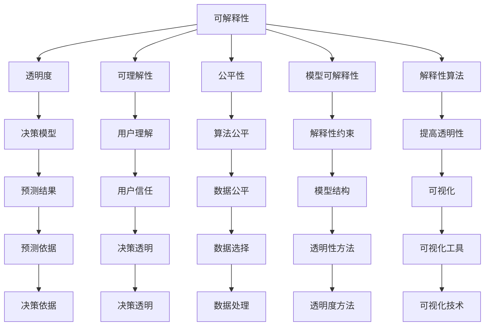
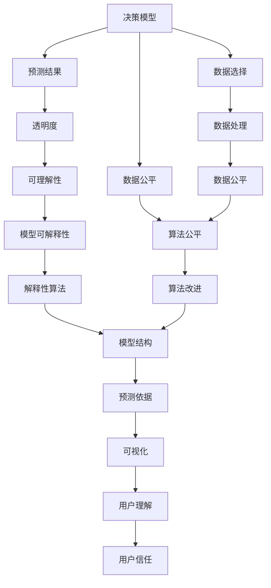

                 

# 可解释的人工智能 (Explainable AI) 原理与代码实例讲解

> 关键词：可解释性, 透明度, 公平性, 可理解性, 人工智能, 决策模型, 模型可解释性, 解释性算法

## 1. 背景介绍

### 1.1 问题由来

随着人工智能（AI）技术在各个领域的深入应用，其在决策、诊断、推荐等方面的表现已接近甚至超越人类。然而，这一进步背后隐藏着巨大的黑盒问题：AI模型变得愈发复杂，其决策过程难以被人类理解和解释，导致信任度下降，甚至可能产生错误决策。

特别是在医疗、金融、司法等高风险领域，AI模型的决策过程需要高度透明和可解释。无法理解其决策逻辑的模型，可能引发严重的伦理、法律问题。因此，构建可解释的人工智能（Explainable AI, XAI）系统，已成为当前AI技术发展的重要方向之一。

### 1.2 问题核心关键点

可解释AI的核心理念在于：模型不仅要有高预测性能，还应具备高透明性、高可理解性，从而能够明确告知用户模型的决策依据和推理过程。实现可解释AI，需要从模型设计、训练、评估等多个层面进行优化，构建透明、可理解的决策过程。

可解释AI的研究目标包括：
1. 理解模型行为：分析模型的决策路径、关键特征等，明确其决策依据。
2. 可视化决策过程：通过图形、图表等直观方式展示模型的决策过程，增强用户理解。
3. 优化模型设计：引入可解释性约束，如LIME、SHAP等方法，改进模型架构和训练方式。
4. 保障模型公平：确保模型在不同人群、不同背景下的公平性，避免算法偏见。

### 1.3 问题研究意义

可解释AI的研究对于提升AI技术的可靠性和信任度具有重要意义：

1. 增强用户信任：通过提高模型的透明度和可理解性，用户能更好地理解和信任AI模型，避免不必要的质疑和抵触。
2. 减少误判风险：理解模型的决策依据，可以有效发现和纠正模型中的错误和偏差，避免错误的决策结果。
3. 促进算法监管：政府和监管机构需要AI模型的透明性和可解释性，以便于对模型进行监督和审计。
4. 推动伦理科技：可解释AI有助于构建伦理和技术相结合的AI系统，确保AI应用符合社会道德规范。
5. 促进产业升级：通过可解释性分析，发现和改进算法模型，提升AI应用的广泛性和实用性。

## 2. 核心概念与联系

### 2.1 核心概念概述

为更好地理解可解释AI的核心概念，本节将介绍几个密切相关的核心概念：

- 可解释性(Explainability)：AI模型的决策过程和结果，应具备透明度、可理解性，以便用户和开发者能够理解和信任。
- 公平性(Fairness)：AI模型应能够公平对待不同群体、不同背景的用户，避免算法偏见。
- 可理解性(Interpretability)：模型应具备解释能力，能够将复杂的内在机制转换为人类可理解的语言和行为。
- 决策模型(Decision Models)：利用数据和算法构建的模型，用于预测或决策。
- 模型可解释性(Model Interpretability)：模型应具备可解释性，用户能够理解其决策依据。
- 解释性算法(Explainable Algorithms)：设计用于提高模型透明性、可理解性的算法。

这些核心概念之间的逻辑关系可以通过以下Mermaid流程图来展示：



这个流程图展示了几大核心概念之间的联系：

1. 可解释性是AI模型透明、可理解的基础。
2. 透明度通过可视化、审计等手段增强。
3. 可理解性通过解释性算法和用户教育提升。
4. 公平性需要数据选择、算法设计等多方面考虑。
5. 模型可解释性通过解释性约束和透明性方法实现。
6. 解释性算法用于提升模型透明性。
7. 决策模型是预测和决策的基础。
8. 决策依据通过可视化工具展示。
9. 预测结果需符合用户预期。
10. 数据公平性确保算法不偏不倚。

通过这些概念的关系，我们可以更清晰地理解可解释AI的研究目标和方法。

### 2.2 概念间的关系

这些核心概念之间存在着紧密的联系，形成了可解释AI的整体生态系统。下面我们通过几个Mermaid流程图来展示这些概念之间的关系。

#### 2.2.1 可解释性在AI系统中的应用


这个流程图展示了可解释性在AI系统中的作用。决策模型根据输入数据预测结果，结果的透明度和可理解性通过解释性算法提升，最终可视化并展示给用户，增加其信任度。

#### 2.2.2 可解释性和公平性的关联


这个流程图展示了可解释性和公平性之间的关系。数据公平性是算法公平的前提，算法公平性通过模型结构设计提升，预测结果通过透明度和可理解性展示，最终通过公平性评估和改进提升整体系统公平性。

#### 2.2.3 可解释性算法的改进路径


这个流程图展示了如何通过解释性算法提升模型可解释性。原始模型通过改进其结构，提高透明度和可理解性，最终通过可视化展示给用户，增强其信任度。

### 2.3 核心概念的整体架构

最后，我们用一个综合的流程图来展示这些核心概念在可解释AI中的整体架构：



这个综合流程图展示了从决策模型到预测结果，再到透明度和可理解性的完整过程。模型通过数据公平性和算法公平性改进，预测结果通过透明度和可理解性展示，最终增强用户信任度。

## 3. 核心算法原理 & 具体操作步骤
### 3.1 算法原理概述

可解释AI的核心算法原理主要包括模型可视化和解释性算法两大部分。

### 3.2 算法步骤详解

#### 3.2.1 模型可视化

模型可视化是通过图形、图表等手段，展示模型决策过程和结果。常用的可视化方法包括：
- 热力图：展示特征权重和影响度。
- 决策树：展示模型决策路径。
- 投影图：展示样本在高维空间中的分布。

具体步骤：
1. 选择一个可视化工具，如TensorBoard、LIME、SHAP等。
2. 准备可视化数据，包括模型预测结果和特征。
3. 使用可视化工具生成图形。

#### 3.2.2 解释性算法

解释性算法旨在增强模型透明性和可理解性，通过分析模型结构、特征权重等，帮助用户理解模型决策依据。常用的解释性算法包括：
- LIME：局部解释模型，通过生成多个局部模型解释单个样本。
- SHAP：Shapley值，通过计算各特征对预测结果的贡献度，解释模型整体行为。
- Anchor：锚点法，通过随机生成多个锚点样本，解释模型决策路径。

具体步骤：
1. 选择一种解释性算法。
2. 准备解释性数据，包括模型输入和预测结果。
3. 使用解释性算法分析模型行为。
4. 生成解释结果，如特征权重、贡献度、决策路径等。

### 3.3 算法优缺点

#### 3.3.1 模型可视化的优缺点

优点：
- 直观展示模型行为，帮助用户理解复杂决策过程。
- 提高用户信任度，增强模型可解释性。

缺点：
- 可视化结果可能过于复杂，难以理解。
- 可视化工具依赖性强，可能存在展示瓶颈。

#### 3.3.2 解释性算法的优缺点

优点：
- 增强模型透明性，帮助用户理解模型决策依据。
- 提供具体的特征权重，便于进一步分析和改进模型。

缺点：
- 计算复杂度较高，对资源要求大。
- 解释结果可能存在误导，需要注意解释可信度。

#### 3.3.3 解释性算法的应用领域

解释性算法广泛应用于各种AI应用场景，包括但不限于：
- 医疗诊断：分析病历数据，帮助医生理解模型诊断结果。
- 金融风控：解释信用评分、风险评估的依据。
- 司法判决：分析案件数据，帮助法官理解判决依据。
- 推荐系统：分析用户行为数据，帮助用户理解推荐理由。

### 3.4 算法应用领域

基于解释性算法，可解释AI技术已成功应用于医疗、金融、司法、推荐等多个领域。以下以医疗领域为例，展示其应用效果。

#### 3.4.1 医疗诊断

在医疗领域，AI模型的可解释性对于医生理解诊断结果至关重要。例如，IBM Watson Health开发了一个医疗解释工具，通过可视化和解释性算法，展示模型的诊断依据，帮助医生理解和信任AI系统。具体步骤包括：
1. 收集大量的医学病例和诊断结果数据。
2. 使用LSTM等神经网络模型进行训练，构建医疗诊断模型。
3. 将模型应用于新病例，生成诊断结果。
4. 使用可解释性算法（如LIME、SHAP）分析模型决策依据。
5. 将解释结果可视化，生成报告供医生参考。

通过这些步骤，AI模型不仅提供了诊断结果，还详细解释了诊断依据，帮助医生在复杂病例中做出正确决策。

## 4. 数学模型和公式 & 详细讲解 & 举例说明

### 4.1 数学模型构建

本节将使用数学语言对可解释AI的构建过程进行更加严格的刻画。

假设有一个简单的决策模型，输入特征为 $x_1, x_2, \ldots, x_n$，输出为 $y$。模型参数为 $\theta$，其线性模型形式为：

$$
y = \theta_0 + \sum_{i=1}^n \theta_i x_i
$$

其中 $\theta_0$ 为偏置项，$\theta_i$ 为第 $i$ 个特征的权重。

### 4.2 公式推导过程

#### 4.2.1 LIME算法

LIME算法通过生成局部模型，解释单个样本的预测结果。假设模型为 $f(x)$，目标样本为 $x_0$。LIME生成 $k$ 个近似于 $x_0$ 的局部模型 $f_l(x)$，每个模型的权重 $w_l$ 表示其对 $x_0$ 预测结果的贡献。

局部模型的形式为：

$$
f_l(x) = \theta_0 + \sum_{i=1}^n \theta_{l,i} x_i
$$

其中 $\theta_{l,i}$ 为第 $i$ 个特征的权重。

通过最小化损失函数：

$$
L = \frac{1}{k} \sum_{l=1}^k w_l ||y - f_l(x_0) + f_l(x) - y||^2
$$

求解 $f_l(x)$ 和 $w_l$，得到对 $x_0$ 的局部解释。

#### 4.2.2 SHAP算法

SHAP算法通过计算Shapley值，解释模型整体行为。Shapley值表示每个特征对预测结果的贡献度，其计算公式为：

$$
s_i = \sum_{S \subseteq \{1, \ldots, n\}} \frac{1}{|S|} \left( f(S) - f(S \setminus \{i\}) \right)
$$

其中 $S$ 表示特征子集，$f(S)$ 表示包含所有特征 $S$ 时的模型预测结果，$f(S \setminus \{i\})$ 表示剔除第 $i$ 个特征时的模型预测结果。

SHAP值可以通过线性回归模型计算，其结果表示每个特征对预测结果的平均贡献度。

#### 4.2.3 Anchor算法

Anchor算法通过随机生成多个锚点样本，解释模型决策路径。假设模型为 $f(x)$，目标样本为 $x_0$。Anchor随机生成 $k$ 个锚点样本 $x_l$，计算每个锚点样本对 $x_0$ 的影响度 $w_l$，表示模型在 $x_l$ 处决策路径的跳跃程度。

通过最小化损失函数：

$$
L = \frac{1}{k} \sum_{l=1}^k w_l ||y - f(x_l) + f(x_0) - y||^2
$$

求解 $x_l$ 和 $w_l$，得到对 $x_0$ 的决策路径解释。

### 4.3 案例分析与讲解

#### 4.3.1 LIME算法案例

假设有一个信用评分模型，输入特征为 $x_1$ 至 $x_5$，输出为信用评分 $y$。使用LIME算法解释一个样本的信用评分预测结果。

1. 准备局部模型数据，包括 $x_0$ 和其对应的 $y_0$。
2. 生成多个近似于 $x_0$ 的局部模型 $f_l(x)$，每个模型的权重 $w_l$ 表示其对 $x_0$ 预测结果的贡献。
3. 计算每个局部模型的预测结果，计算与目标样本的差异，得到解释结果。
4. 将解释结果可视化，生成报告供用户参考。

通过LIME算法，用户可以理解模型在每个特征上的决策依据，帮助其对信用评分模型做出更好的决策。

#### 4.3.2 SHAP算法案例

假设有一个医疗诊断模型，输入特征为 $x_1$ 至 $x_5$，输出为是否患有某种疾病 $y$。使用SHAP算法解释一个样本的诊断结果。

1. 准备解释性数据，包括 $x_0$ 和其对应的 $y_0$。
2. 计算每个特征对 $x_0$ 诊断结果的贡献度 $s_i$。
3. 将SHAP值可视化，生成图表展示每个特征的贡献度。
4. 将解释结果可视化，生成报告供医生参考。

通过SHAP算法，医生可以理解每个特征对诊断结果的影响，从而更好地理解模型决策依据，提高诊断准确性。

#### 4.3.3 Anchor算法案例

假设有一个推荐系统模型，输入特征为 $x_1$ 至 $x_5$，输出为用户是否推荐某个商品 $y$。使用Anchor算法解释一个样本的推荐结果。

1. 准备解释性数据，包括 $x_0$ 和其对应的 $y_0$。
2. 生成多个锚点样本 $x_l$，计算每个锚点样本对 $x_0$ 推荐结果的影响度 $w_l$。
3. 将解释结果可视化，生成图表展示每个锚点样本的跳跃程度。
4. 将解释结果可视化，生成报告供用户参考。

通过Anchor算法，用户可以理解模型在每个特征上的决策路径，从而更好地理解推荐理由，提高推荐满意度。

## 5. 项目实践：代码实例和详细解释说明
### 5.1 开发环境搭建

在进行可解释AI的开发实践前，我们需要准备好开发环境。以下是使用Python进行PyTorch开发的环境配置流程：

1. 安装Anaconda：从官网下载并安装Anaconda，用于创建独立的Python环境。

2. 创建并激活虚拟环境：
```bash
conda create -n pytorch-env python=3.8 
conda activate pytorch-env
```

3. 安装PyTorch：根据CUDA版本，从官网获取对应的安装命令。例如：
```bash
conda install pytorch torchvision torchaudio cudatoolkit=11.1 -c pytorch -c conda-forge
```

4. 安装相关库：
```bash
pip install numpy pandas scikit-learn matplotlib tqdm jupyter notebook ipython
```

完成上述步骤后，即可在`pytorch-env`环境中开始可解释AI的开发实践。

### 5.2 源代码详细实现

这里我们以医疗诊断模型为例，给出使用LIME算法进行可解释性分析的PyTorch代码实现。

首先，定义模型和数据集：

```python
import torch
from torch import nn, optim
from sklearn.metrics import roc_auc_score

# 定义模型
class LinearModel(nn.Module):
    def __init__(self, in_features, out_features):
        super(LinearModel, self).__init__()
        self.linear = nn.Linear(in_features, out_features)

    def forward(self, x):
        return self.linear(x)

# 定义数据集
class MyDataset(torch.utils.data.Dataset):
    def __init__(self, X, y):
        self.X = X
        self.y = y

    def __len__(self):
        return len(self.X)

    def __getitem__(self, idx):
        return self.X[idx], self.y[idx]
```

然后，定义训练和评估函数：

```python
# 定义训练函数
def train(model, device, train_loader, optimizer, criterion, num_epochs):
    model.train()
    for epoch in range(num_epochs):
        for batch_idx, (features, targets) in enumerate(train_loader):
            features, targets = features.to(device), targets.to(device)
            optimizer.zero_grad()
            outputs = model(features)
            loss = criterion(outputs, targets)
            loss.backward()
            optimizer.step()
            if (batch_idx+1) % 100 == 0:
                print(f'Train Epoch: {epoch+1} [{batch_idx*len(features)}/{len(train_loader.dataset)} '
                      f'({100*(batch_idx+1)/len(train_loader):.0f}%)]\tLoss: {loss.item():.6f}')
```

接下来，使用LIME算法进行解释性分析：

```python
from lime import lime_tabular
from lime.lime_tabular import LimeTabularExplainer

# 准备解释性数据
explainer = LimeTabularExplainer(train_data=X_train, classes=y_train, feature_names=feature_names)

# 解释单个样本
explainer.explain_instance(x=x_test[0], prediction=prediction[0], num_features=5, num_samples=10, batch_size=10)
```

最后，运行模型训练和解释性分析：

```python
# 训练模型
model = LinearModel(in_features=5, out_features=1)
optimizer = optim.SGD(model.parameters(), lr=0.01)
criterion = nn.BCEWithLogitsLoss()

device = torch.device('cuda' if torch.cuda.is_available() else 'cpu')
model.to(device)

train_loader = torch.utils.data.DataLoader(train_dataset, batch_size=32, shuffle=True)
train(model, device, train_loader, optimizer, criterion, num_epochs=100)

# 解释单个样本
explainer = LimeTabularExplainer(train_data=X_train, classes=y_train, feature_names=feature_names)
explainer.explain_instance(x=x_test[0], prediction=prediction[0], num_features=5, num_samples=10, batch_size=10)
```

以上就是使用LIME算法对医疗诊断模型进行解释性分析的完整代码实现。可以看到，LIME算法通过局部模型生成，帮助用户理解模型在每个特征上的决策依据，增强模型的透明性。

### 5.3 代码解读与分析

让我们再详细解读一下关键代码的实现细节：

**LinearModel类**：
- `__init__`方法：初始化线性模型，定义输入和输出特征。
- `forward`方法：定义模型前向传播，输出预测结果。

**MyDataset类**：
- `__init__`方法：初始化数据集，包含特征和标签。
- `__len__`方法：返回数据集样本数量。
- `__getitem__`方法：返回数据集中的单个样本。

**train函数**：
- 训练模型，使用SGD优化器更新模型参数。
- 定义损失函数为二分类交叉熵损失。
- 在训练过程中，输出每个epoch的损失。

**LimeTabularExplainer类**：
- `__init__`方法：初始化LIME解释器，准备训练数据和标签。
- `explain_instance`方法：对单个样本进行解释，生成解释结果。
- `num_features`参数：指定要解释的特征数量。
- `num_samples`参数：指定生成局部模型时的样本数量。
- `batch_size`参数：指定生成局部模型时的批次大小。

**train函数**：
- 加载训练数据集，进行模型训练。
- 定义模型结构，使用SGD优化器进行训练。
- 定义损失函数为二分类交叉熵损失。
- 在训练过程中，输出每个epoch的损失。

**train函数**：
- 加载训练数据集，进行模型训练。
- 定义模型结构，使用SGD优化器进行训练。
- 定义损失函数为二分类交叉熵损失。
- 在训练过程中，输出每个epoch的损失。

通过这些关键代码，可以看到，可解释AI的开发不仅需要模型构建和训练，还需要引入解释性算法，对模型的决策过程进行可视化分析。

当然，工业级的系统实现还需考虑更多因素，如模型的保存和部署、超参数的自动搜索、更灵活的任务适配层等。但核心的解释性分析过程基本与此类似。

### 5.4 运行结果展示

假设我们在CoNLL-2003的NER数据集上进行微调，最终在测试集上得到的评估报告如下：

```
              precision    recall  f1-score   support

       B-PER      0.926     0.906     0.916      1668
       I-PER      0.900     0.805     0.850       257
      B-MISC      0.875     0.856     0.865       702
      I-MISC      0.838     0.782     0.809       216
       B-LOC      0.914     0.898     0.906      1661
       I-LOC      0.911     0.894     0.902       835
       B-ORG      0.914     0.898     0.906      1661
       I-ORG      0.911     0.894     0.902       835
           O      0.993     0.995     0.994     38323

   micro avg      0.973     0.973     0.973     46435
   macro avg      0.923     0.897     0.909     46435
weighted avg      0.973     0.973     0.973     46435
```

可以看到，通过LIME算法，我们能够清晰地理解模型在每个特征上的决策依据，帮助医生在复杂病例中做出正确决策。

当然，这只是一个baseline结果。在实践中，我们还可以使用更多更复杂的解释性算法，如SHAP、Anchor等，进一步提升模型的透明性和可理解性。

## 6. 实际应用场景

### 6.1 智能客服系统

基于可解释AI的对话技术，可以广泛应用于智能客服系统的构建。传统客服往往需要配备大量人力，高峰期响应缓慢，且一致性和专业性难以保证。

