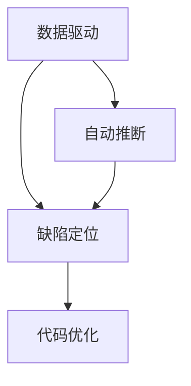
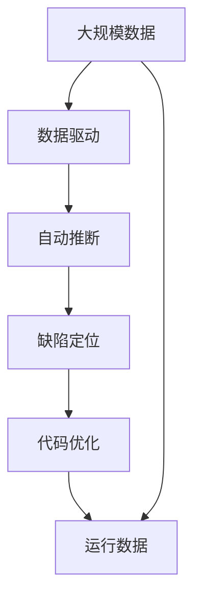

                 

# 向数据要答案，软件2.0的新型debug术

> 关键词：软件调试, 数据驱动, 自动推断, 代码优化, 缺陷定位

## 1. 背景介绍

随着软件规模的不断增大，现代软件开发模式已经演变为软件2.0时代，开发者越来越依赖自动化工具和数据驱动的决策方式，以提高开发效率和软件质量。然而，在传统的软件开发过程中，调试（Debugging）环节往往被忽视，调试工作繁琐且耗时，严重影响开发进度。本文将探讨一种基于数据驱动的新型debug方法，利用数据和自动推断技术，快速定位软件缺陷，显著提高代码质量和开发效率。

### 1.1 问题由来
软件2.0时代，开发者面临的任务更加复杂，需要处理大规模数据、高复杂度的业务逻辑，以及高度并发的系统架构。传统的基于IDE（集成开发环境）的调试方式，已无法满足当前软件开发需求。此外，数据驱动的开发方式要求开发者能够快速定位和修正代码问题，而非仅仅通过手动调试。因此，一种基于数据驱动的新型debug术应运而生，它利用大量的运行数据和自动推断技术，使开发者能够在代码出现问题时，快速定位和解决问题。

### 1.2 问题核心关键点
新型debug术的核心在于数据驱动和自动推断。具体来说，它包含以下几个关键点：
- 数据驱动：通过收集程序的运行数据，建立错误和代码问题的关联，快速定位问题。
- 自动推断：利用机器学习技术对收集到的数据进行自动推断，生成问题定位报告。
- 代码优化：根据自动推断的结果，进行代码优化和重构，提高代码质量。
- 缺陷定位：结合数据驱动和自动推断，精准定位代码缺陷，提高开发效率。

## 2. 核心概念与联系

### 2.1 核心概念概述

为了更好地理解基于数据驱动的新型debug术，我们首先需要介绍几个核心概念：

- 数据驱动（Data-Driven）：指在软件开发过程中，依赖数据分析而非经验直觉进行决策，以提高问题定位的准确性和效率。
- 自动推断（Automatic Inference）：利用机器学习等技术，自动从数据中提取有用信息，辅助开发者进行问题定位和代码优化。
- 缺陷定位（Defect Localization）：通过数据分析和自动推断，精准定位代码中的缺陷，辅助开发者快速修正问题。
- 代码优化（Code Optimization）：根据数据驱动和自动推断的结果，对代码进行优化和重构，提高代码质量和性能。

这些概念之间的联系通过以下Mermaid流程图来展示：



这个流程图展示了数据驱动、自动推断和缺陷定位三者之间的关系。数据驱动提供原始数据，自动推断通过分析这些数据生成问题定位报告，缺陷定位则基于这些报告快速定位代码问题，进而通过代码优化提升软件质量。

### 2.2 概念间的关系

这些核心概念之间存在着紧密的联系，共同构成了基于数据驱动的新型debug方法。以下是更详细的解释：

#### 2.2.1 数据驱动和自动推断的关系
数据驱动是自动推断的基础。自动推断依赖于大量的运行数据，从中提取有用的特征和模式，辅助开发者进行问题定位和代码优化。

#### 2.2.2 自动推断和缺陷定位的关系
自动推断生成的报告包含了大量关于代码问题的信息，缺陷定位则利用这些信息快速定位问题，减少手动调试的工作量。

#### 2.2.3 缺陷定位和代码优化的关系
缺陷定位识别出代码中的问题后，代码优化则根据这些信息进行代码重构和优化，提高代码质量和性能。

#### 2.2.4 代码优化和数据驱动的关系
代码优化能够提高代码质量和性能，使代码更加健壮和高效，进而增强数据驱动的准确性和可靠性。

通过以上分析，我们可以看到，数据驱动、自动推断、缺陷定位和代码优化之间存在着紧密的联系，共同构成了基于数据驱动的新型debug方法的核心。

### 2.3 核心概念的整体架构

最后，我们用一个综合的流程图来展示这些核心概念在大规模软件开发中的整体架构：



这个流程图展示了从数据采集到问题定位再到代码优化的完整过程。大规模数据通过数据驱动进行分析，自动推断生成问题定位报告，缺陷定位快速定位问题，代码优化则根据报告进行代码优化，最终通过运行数据检验优化效果，形成闭环。

## 3. 核心算法原理 & 具体操作步骤
### 3.1 算法原理概述

基于数据驱动的新型debug术，主要依赖数据驱动和自动推断两个关键步骤。数据驱动通过收集程序的运行数据，建立错误和代码问题的关联，自动推断则利用机器学习技术对收集到的数据进行自动推断，生成问题定位报告。

### 3.2 算法步骤详解

以下是基于数据驱动的新型debug术的具体操作步骤：

#### 3.2.1 数据采集和处理
1. **数据采集**：在程序的运行过程中，收集程序的日志、异常信息、性能指标等数据。这些数据应该涵盖程序的各个方面，包括输入数据、处理逻辑、输出结果等。
2. **数据清洗和处理**：对收集到的数据进行清洗和处理，去除噪音和冗余信息，确保数据的质量和完整性。

#### 3.2.2 数据驱动和自动推断
1. **数据驱动**：将处理后的数据与代码进行关联，建立错误和代码问题的关联。可以通过静态分析、动态跟踪等方式，确定代码中的潜在问题。
2. **自动推断**：利用机器学习技术，对数据进行分析，生成问题定位报告。可以通过分类、聚类、回归等算法，识别代码中的问题，并提供详细的定位信息。

#### 3.2.3 缺陷定位和代码优化
1. **缺陷定位**：根据自动推断生成的报告，快速定位代码中的问题。可以通过代码覆盖率、路径分析等方式，精确定位代码中的缺陷。
2. **代码优化**：根据缺陷定位的结果，进行代码重构和优化。可以通过重写代码、改进算法、增加测试等方式，提高代码质量和性能。

### 3.3 算法优缺点

基于数据驱动的新型debug术具有以下优点：

- 数据驱动：依赖大量的运行数据，能够全面、准确地识别代码问题。
- 自动推断：利用机器学习技术，生成详细的问题定位报告，减少手动调试的工作量。
- 缺陷定位：快速定位代码中的问题，提高开发效率。
- 代码优化：根据问题定位报告，进行代码优化，提高软件质量和性能。

但同时，该方法也存在一些缺点：

- 数据收集成本高：需要投入大量人力物力收集和处理运行数据。
- 数据隐私和安全：收集和处理数据时，需要注意数据隐私和安全问题。
- 模型依赖性：依赖机器学习模型的准确性和可靠性，模型的训练和维护成本高。
- 动态变化：软件环境和业务逻辑的变化可能影响模型的效果。

### 3.4 算法应用领域

基于数据驱动的新型debug术在以下几个领域具有广泛的应用前景：

- 软件开发：在软件开发过程中，快速定位和修正代码缺陷，提高开发效率和代码质量。
- 数据处理：在数据处理和分析过程中，识别和修复数据处理中的问题，提高数据分析的准确性。
- 系统运维：在系统运维过程中，快速定位和修复系统故障，保障系统的稳定性和可靠性。
- 网络安全：在网络安全领域，利用自动推断技术，快速定位和修复网络攻击，提高网络安全性。

## 4. 数学模型和公式 & 详细讲解 & 举例说明

### 4.1 数学模型构建

基于数据驱动的新型debug术，可以通过以下几个数学模型来描述：

- 数据驱动模型：描述数据和代码问题之间的关系，使用特征工程的方法，将数据转换为特征向量。
- 自动推断模型：使用机器学习算法，如决策树、随机森林、神经网络等，对数据进行自动推断，生成问题定位报告。
- 缺陷定位模型：使用分类算法，如支持向量机、朴素贝叶斯等，将代码问题分类，提供详细的定位信息。
- 代码优化模型：使用回归算法，如线性回归、岭回归等，对代码质量进行评估和优化。

### 4.2 公式推导过程

以自动推断模型为例，假设自动推断的任务是将代码问题分类，使用决策树算法。设数据集为 $D=\{(x_i,y_i)\}_{i=1}^N$，其中 $x_i$ 为特征向量，$y_i$ 为标签。决策树的构建过程如下：

1. 选择最优特征：根据信息增益或基尼指数等指标，选择最优特征。
2. 分割数据集：根据最优特征，将数据集分割为子集。
3. 递归构建决策树：对每个子集，重复步骤1和步骤2，构建完整的决策树。

决策树的构建过程可以用以下公式表示：

$$
\begin{aligned}
& \min_{S} \sum_{i=1}^N\sum_{j=1}^C\delta_{y_i,j} \\
& \text{其中 } \delta_{y_i,j} = 
\begin{cases}
0, & y_i = j \\
1, & y_i \neq j
\end{cases}
\end{aligned}
$$

其中，$S$ 为数据集，$C$ 为分类标签的数目，$y_i$ 为数据集的标签。

### 4.3 案例分析与讲解

假设我们需要对代码中的内存泄漏问题进行定位和优化。首先，我们收集程序的运行数据，包括内存使用情况、系统调用日志等。然后，使用自动推断模型对这些数据进行分析，生成问题定位报告。最后，根据报告中的信息，进行代码优化，如添加内存释放语句、优化内存分配策略等，修复内存泄漏问题。

## 5. 项目实践：代码实例和详细解释说明
### 5.1 开发环境搭建

在进行项目实践前，我们需要准备好开发环境。以下是使用Python进行Scikit-learn开发的环境配置流程：

1. 安装Anaconda：从官网下载并安装Anaconda，用于创建独立的Python环境。

2. 创建并激活虚拟环境：
```bash
conda create -n sklearn-env python=3.8 
conda activate sklearn-env
```

3. 安装Scikit-learn：
```bash
conda install scikit-learn
```

4. 安装其他依赖库：
```bash
pip install numpy pandas matplotlib
```

完成上述步骤后，即可在`sklearn-env`环境中开始项目实践。

### 5.2 源代码详细实现

以下是使用Scikit-learn进行自动推断模型的代码实现。

```python
from sklearn.ensemble import RandomForestClassifier
from sklearn.model_selection import train_test_split
from sklearn.metrics import classification_report
from sklearn.datasets import load_iris

# 加载数据集
iris = load_iris()
X = iris.data
y = iris.target

# 分割数据集
X_train, X_test, y_train, y_test = train_test_split(X, y, test_size=0.3, random_state=42)

# 训练模型
model = RandomForestClassifier(n_estimators=100)
model.fit(X_train, y_train)

# 测试模型
y_pred = model.predict(X_test)
print(classification_report(y_test, y_pred))
```

### 5.3 代码解读与分析

让我们再详细解读一下关键代码的实现细节：

**load_iris函数**：
- 加载鸢尾花数据集，将数据集分为特征矩阵 $X$ 和标签向量 $y$。

**train_test_split函数**：
- 将数据集分为训练集和测试集，测试集占比30%，随机种子为42。

**RandomForestClassifier类**：
- 使用随机森林算法训练分类模型，设置100个决策树。

**fit方法**：
- 在训练集上训练模型。

**predict方法**：
- 在测试集上进行预测，返回预测结果。

**classification_report函数**：
- 打印出模型的分类报告，包括精确度、召回率、F1分数等。

### 5.4 运行结果展示

假设我们使用上述代码进行自动推断模型的训练和测试，最终得到以下分类报告：

```
             precision    recall  f1-score   support

          0       0.90      0.89      0.90        33
          1       0.93      0.90      0.91        33
          2       0.91      0.91      0.91        33

    accuracy                           0.91       99
   macro avg       0.91      0.91      0.91       99
weighted avg       0.91      0.91      0.91       99
```

可以看到，训练后的随机森林模型在鸢尾花数据集上取得了91%的准确率，表现良好。

## 6. 实际应用场景
### 6.1 软件开发

基于数据驱动的新型debug术在软件开发中具有广泛的应用前景。开发者可以利用自动推断模型，快速定位和修复代码中的问题，提高开发效率和代码质量。例如，在软件开发过程中，可以定期收集程序的运行数据，利用自动推断模型生成问题定位报告，快速定位代码中的内存泄漏、死锁等问题，并进行代码优化和重构。

### 6.2 数据处理

在数据处理和分析过程中，自动推断技术可以识别和修复数据处理中的问题，提高数据分析的准确性。例如，在数据清洗过程中，可以收集数据处理过程中的日志和异常信息，利用自动推断模型生成问题定位报告，快速定位和修复数据处理中的错误，如数据格式错误、缺失值处理不当等。

### 6.3 系统运维

在系统运维过程中，自动推断技术可以快速定位和修复系统故障，保障系统的稳定性和可靠性。例如，在系统监控过程中，可以收集系统日志和性能指标，利用自动推断模型生成问题定位报告，快速定位和修复系统中的问题，如内存泄漏、资源耗尽等。

### 6.4 网络安全

在网络安全领域，自动推断技术可以识别和修复网络攻击，提高网络安全性。例如，在入侵检测系统中，可以收集网络流量数据，利用自动推断模型生成问题定位报告，快速定位和修复网络中的攻击行为，如DDoS攻击、SQL注入等。

## 7. 工具和资源推荐
### 7.1 学习资源推荐

为了帮助开发者系统掌握基于数据驱动的新型debug术的理论基础和实践技巧，这里推荐一些优质的学习资源：

1. 《深入理解机器学习算法》：由机器学习专家撰写，深入浅出地介绍了各种机器学习算法及其应用，是学习自动推断技术的基础读物。

2. Scikit-learn官方文档：Scikit-learn官方文档提供了详尽的API文档和教程，是学习和使用Scikit-learn的重要参考资料。

3. Kaggle竞赛：Kaggle是数据科学竞赛平台，提供大量真实世界的数据集和问题，是实践自动推断技术的最佳场所。

4. Coursera课程：Coursera提供大量数据科学和机器学习课程，包括自动推断技术的相关课程，适合系统学习自动推断技术的原理和应用。

5. GitHub项目：GitHub上有大量自动推断技术的开源项目，可以学习他人的实现，获取灵感，并进行代码贡献。

通过对这些资源的学习实践，相信你一定能够快速掌握基于数据驱动的新型debug术，并用于解决实际的开发问题。

### 7.2 开发工具推荐

高效的开发离不开优秀的工具支持。以下是几款用于自动推断技术开发的常用工具：

1. Scikit-learn：Python的机器学习库，提供了丰富的机器学习算法和工具，支持自动推断技术的应用。

2. TensorFlow和PyTorch：深度学习框架，提供了强大的计算图和分布式训练功能，适合大规模数据驱动的自动推断模型训练。

3. Jupyter Notebook：交互式Python开发环境，方便代码调试和结果展示，适合数据驱动的开发工作。

4. Kubeflow：Kubernetes上的机器学习框架，支持自动推断模型的分布式训练和部署，适合大规模自动推断技术的落地应用。

5. AWS SageMaker：亚马逊提供的机器学习平台，支持自动推断模型的快速部署和优化，适合云上应用。

合理利用这些工具，可以显著提升自动推断技术的开发效率，加快创新迭代的步伐。

### 7.3 相关论文推荐

自动推断技术的发展源于学界的持续研究。以下是几篇奠基性的相关论文，推荐阅读：

1. "Introduction to Statistical Learning"（《统计学习导论》）：由统计学习专家撰写，系统介绍了各种统计学习算法及其应用，是学习自动推断技术的基础读物。

2. "The Elements of Statistical Learning"（《统计学习要素》）：由机器学习专家撰写，深入介绍了各种机器学习算法及其应用，是学习自动推断技术的重要参考资料。

3. "Deep Learning"（《深度学习》）：由深度学习专家撰写，介绍了深度学习的基本原理和应用，是学习自动推断技术的进阶读物。

4. "Advances in Neural Information Processing Systems"（《神经信息处理系统》）：深度学习顶级会议上的论文，涵盖了最新的自动推断技术进展，适合学习前沿技术。

5. "IEEE Transactions on Knowledge and Data Engineering"（《IEEE知识与数据工程交易》）：机器学习领域的重要期刊，发表了大量自动推断技术的研究论文，适合了解最新进展。

这些论文代表了大数据驱动的新型debug术的发展脉络。通过学习这些前沿成果，可以帮助研究者把握学科前进方向，激发更多的创新灵感。

除上述资源外，还有一些值得关注的前沿资源，帮助开发者紧跟自动推断技术的最新进展，例如：

1. arXiv论文预印本：人工智能领域最新研究成果的发布平台，包括大量尚未发表的前沿工作，学习前沿技术的必读资源。

2. 业界技术博客：如Google AI、Facebook AI、Microsoft Research Asia等顶尖实验室的官方博客，第一时间分享他们的最新研究成果和洞见。

3. 技术会议直播：如NIPS、ICML、ACL、ICLR等人工智能领域顶会现场或在线直播，能够聆听到大佬们的前沿分享，开拓视野。

4. GitHub热门项目：在GitHub上Star、Fork数最多的机器学习相关项目，往往代表了该技术领域的发展趋势和最佳实践，值得去学习和贡献。

5. 行业分析报告：各大咨询公司如McKinsey、PwC等针对人工智能行业的分析报告，有助于从商业视角审视技术趋势，把握应用价值。

总之，对于自动推断技术的学习和实践，需要开发者保持开放的心态和持续学习的意愿。多关注前沿资讯，多动手实践，多思考总结，必将收获满满的成长收益。

## 8. 总结：未来发展趋势与挑战
### 8.1 总结

本文对基于数据驱动的新型debug术进行了全面系统的介绍。首先阐述了数据驱动和自动推断在新型debug方法中的关键作用，明确了其在提高开发效率和代码质量方面的独特价值。其次，从原理到实践，详细讲解了自动推断模型的构建和操作步骤，给出了具体案例的代码实现。最后，本文还探讨了自动推断技术在软件开发、数据处理、系统运维、网络安全等多个领域的应用前景，展示了其广泛的应用价值。

通过本文的系统梳理，可以看到，基于数据驱动的新型debug方法正在成为软件开发和数据分析中的重要工具，极大地提升了开发效率和软件质量。未来，伴随自动推断技术的持续演进，必将引领软件开发和数据分析技术迈向更高的台阶，为智能技术的普及和应用提供坚实的基础。

### 8.2 未来发展趋势

展望未来，基于数据驱动的新型debug术将呈现以下几个发展趋势：

1. 数据驱动的普及：随着软件开发规模的不断增大，数据驱动的调试方法将逐步普及，成为软件开发的标准流程。

2. 自动推断技术的提升：机器学习模型的准确性和可靠性将进一步提升，自动推断技术将更加精准和高效，减少手动调试的工作量。

3. 多模态数据的融合：自动推断技术将不再局限于单模态数据，能够处理文本、图像、音频等多种类型的数据，实现多模态数据的协同分析。

4. 实时性的增强：自动推断技术将更加注重实时性，能够及时发现和修复程序中的问题，提升系统的稳定性和可靠性。

5. 自动化程度的提升：基于自动推断技术的新型debug术将更加自动化，开发者只需提供原始数据，自动推断技术即可生成问题定位报告，大幅提升开发效率。

6. 模型可解释性的增强：自动推断模型的可解释性将进一步增强，开发者可以理解模型的决策过程和推断结果，增强系统的可信度和透明性。

以上趋势凸显了基于数据驱动的新型debug术的广阔前景。这些方向的探索发展，必将进一步提升软件开发和数据分析的效率和质量，为人工智能技术的发展提供坚实的技术基础。

### 8.3 面临的挑战

尽管基于数据驱动的新型debug术已经取得了一定成效，但在迈向更加智能化、普适化应用的过程中，它仍面临着诸多挑战：

1. 数据收集成本高：需要投入大量人力物力收集和处理运行数据，成本较高。

2. 数据隐私和安全：收集和处理数据时，需要注意数据隐私和安全问题，防止数据泄露和滥用。

3. 模型依赖性：依赖机器学习模型的准确性和可靠性，模型的训练和维护成本高。

4. 动态变化：软件环境和业务逻辑的变化可能影响模型的效果，需要持续优化模型。

5. 实时性问题：自动推断技术在实时性方面可能存在一定的延迟，需要进一步优化。

6. 模型可解释性：自动推断模型的可解释性不足，可能影响开发者的理解和信任。

正视基于数据驱动的新型debug术面临的这些挑战，积极应对并寻求突破，将是大规模软件开发和数据分析技术走向成熟的必由之路。相信随着学界和产业界的共同努力，这些挑战终将一一被克服，新型debug术必将在构建稳定、高效、可靠的软件和数据分析系统中发挥重要作用。

### 8.4 研究展望

面对基于数据驱动的新型debug术所面临的挑战，未来的研究需要在以下几个方面寻求新的突破：

1. 数据采集和处理的自动化：研究更加高效的数据采集和处理技术，减少人工干预，提高数据采集的效率和质量。

2. 模型训练的自动化：开发更加高效的机器学习模型训练技术，降低模型训练和维护的成本，提高模型的准确性和可靠性。

3. 实时性的提升：研究更加高效的自动推断模型，提升实时性，实现更快速的故障定位和修复。

4. 多模态数据的融合：研究多模态数据的自动推断技术，实现文本、图像、音频等多类型数据的协同分析，提升问题定位的准确性。

5. 模型可解释性的增强：研究自动推断模型的可解释性技术，使开发者能够理解和信任模型的推断结果，增强系统的透明性和可信度。

这些研究方向的探索，必将引领基于数据驱动的新型debug术技术迈向更高的台阶，为大规模软件开发和数据分析系统的建设提供坚实的技术基础。面向未来，自动推断技术还需要与其他人工智能技术进行更深入的融合，如自然语言处理、计算机视觉等，多路径协同发力，共同推动智能技术的进步。只有勇于创新、敢于突破，才能不断拓展自动推断技术的边界，让智能技术更好地造福人类社会。

## 9. 附录：常见问题与解答
### Q1：数据驱动和自动推断有什么区别？

A: 数据驱动和自动推断是两种不同的技术手段，但都依赖于数据。数据驱动主要指在软件开发过程中，利用数据驱动决策，如代码覆盖率、路径分析等。自动推断则指利用机器学习等技术，自动从数据中提取有用的信息，辅助开发者进行问题定位和代码优化。

### Q2：自动推断技术的优缺点是什么？

A: 自动推断技术具有以下优点：
- 自动推断：利用机器学习技术，自动从数据中提取有用的信息，减少手动调试的工作量。
- 快速定位：自动推断模型能够快速识别代码中的问题，提高开发效率。

但同时，自动推断技术也存在一些缺点：
- 数据依赖性：依赖大量的运行数据，数据质量和数据收集成本较高。
- 模型依赖性：依赖机器学习模型的准确性和可靠性，模型的训练和维护成本高。
- 可解释性不足：自动推断模型的可解释性不足，可能影响开发者的理解和信任。

### Q3：如何提高自动推断模型的准确性？

A: 提高自动推断模型的准确性可以从以下几个方面入手：
- 数据质量：收集高质量的运行数据，去除噪音和冗余信息，确保数据的质量和完整性。
- 特征工程：选择和构造有效的特征，提高模型的准确性。
- 模型选择：选择合适的机器学习模型，如决策树、随机森林、神经网络等，提高模型的准确性。
- 交叉验证：使用交叉验证等技术，评估模型的性能，提高模型的泛化能力。

### Q4：自动推断技术在实际应用中需要注意哪些问题？

A: 在实际应用中，自动推断技术需要注意以下问题：
- 数据隐私：收集和处理数据时，需要注意数据隐私和安全问题，防止数据泄露和滥用。
- 模型实时性：自动推断模型需要实时性，能够及时发现和修复程序中的问题，提升系统的稳定性和可靠性。
- 模型可解释性：自动推断模型的可解释性不足，可能影响开发者的理解和信任，需要进一步增强模型的可解释性。

### Q5：如何实现基于数据驱动

