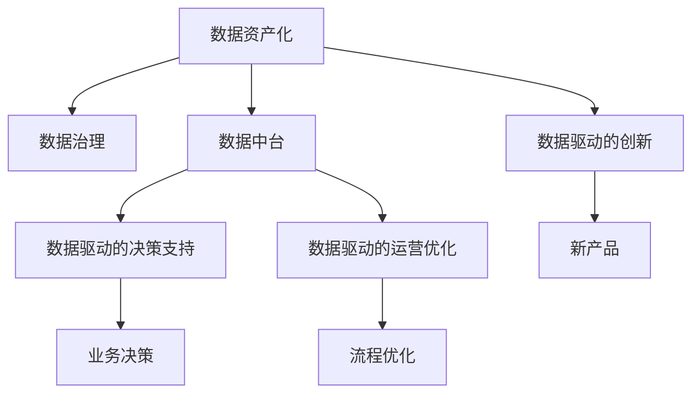

                 

# 商业模式的变革：从产品到数据的转变

## 1. 背景介绍

### 1.1 问题由来
过去几十年里，企业主要依赖于产品模式进行运营和发展。企业通过生产和销售商品或服务来获取收入，主要关注产品的设计、制造和分销，而对数据的重视程度相对较低。然而，随着互联网和信息技术的迅速发展，以及大数据时代的到来，数据已经成为一种重要的资产和资源，对企业的战略决策和运营管理产生了深远影响。数据在企业的业务流程中扮演着越来越重要的角色，从客户关系管理（CRM）、供应链优化、市场营销到产品推荐、风险控制等多个方面，数据都在发挥着至关重要的作用。

### 1.2 问题核心关键点
企业从产品模式向数据模式的转变，其核心在于如何有效利用数据，将数据作为核心竞争力的重要组成部分，从而提升企业的运营效率、市场响应速度和客户满意度。在这个过程中，企业需要考虑以下几个关键点：
- **数据的获取和存储**：如何高效地获取、存储和管理数据。
- **数据的分析和挖掘**：如何利用先进的数据分析技术，从海量数据中提取有价值的信息。
- **数据的可视化与决策支持**：如何将数据以可视化的形式展现给决策者，帮助其做出更明智的决策。
- **数据的共享与合作**：如何在保障数据安全和隐私的前提下，实现数据的共享和合作。

### 1.3 问题研究意义
企业从产品模式向数据模式转变，不仅是对业务流程的优化和提升，更是对企业战略和竞争力的重塑。数据驱动的商业模式能够使企业更加灵活地响应市场变化，提高运营效率，增强客户关系，提升竞争力。此外，数据驱动的模式还带来了新的业务机会和增长点，推动了企业创新和转型。

## 2. 核心概念与联系

### 2.1 核心概念概述
在大数据时代，数据成为企业的核心资产。企业需要重新审视自身的商业模式，将数据作为战略的核心要素。以下是与数据模式转变相关的几个核心概念：

- **数据资产化**：将数据视为企业的无形资产，进行管理和运营。
- **数据治理**：建立数据治理体系，确保数据的质量、安全性和合规性。
- **数据中台**：构建数据中台，统一管理和调度企业内部数据资源。
- **数据驱动的决策支持**：利用数据驱动的决策支持系统，提高决策的科学性和准确性。
- **数据驱动的运营优化**：通过数据分析和挖掘，优化企业的运营流程和管理效率。
- **数据驱动的创新**：利用大数据和人工智能技术，驱动产品和服务的创新。

这些核心概念共同构成了企业从产品模式向数据模式转变的完整框架。通过深入理解这些概念，企业可以更好地把握数据驱动转型的方向和路径。

### 2.2 概念间的关系

以下是一个Mermaid流程图，展示了数据驱动商业模式的关键概念及其相互关系：



通过这个流程图，我们可以更清晰地理解数据驱动商业模式中各个概念的相互依赖和作用机制。数据资产化是基础，数据治理保障数据质量和安全性，数据中台提供数据管理和调度的平台，数据驱动的决策支持提供科学的决策依据，数据驱动的运营优化提升运营效率，数据驱动的创新带来新的业务机会，最终支撑业务决策和流程优化，驱动新产品的开发和业务增长。

### 2.3 核心概念的整体架构

从整体上来看，数据驱动的商业模式可以概括为以下几个关键阶段：

1. **数据获取与存储**：通过各种渠道收集数据，并存储到数据湖或数据仓库中。
2. **数据治理与清洗**：对数据进行清洗、整理和标准化，确保数据的质量和一致性。
3. **数据分析和挖掘**：利用先进的数据分析技术和工具，从数据中提取有价值的信息和洞见。
4. **数据可视化与报告**：将分析结果以可视化的形式展现给决策者和业务用户，帮助他们理解和应用这些洞见。
5. **数据驱动的决策和运营**：将数据洞见应用于业务决策和运营优化，提升企业的运营效率和市场响应速度。
6. **数据驱动的创新**：利用数据洞察和人工智能技术，驱动产品和服务的创新，开拓新的业务机会。

这些阶段相互关联，构成了一个完整的数据驱动商业模式框架。企业需要根据自身情况，在各个阶段进行合理布局和资源投入，从而实现从产品模式向数据模式的顺利转型。

## 3. 核心算法原理 & 具体操作步骤
### 3.1 算法原理概述

数据驱动的商业模式的核心算法原理主要涉及以下几个方面：

- **数据挖掘算法**：如分类、聚类、关联规则等，用于从数据中提取有价值的信息和洞见。
- **预测算法**：如回归、时间序列预测等，用于预测未来的趋势和行为。
- **推荐算法**：如协同过滤、基于内容的推荐等，用于个性化推荐产品和内容。
- **自然语言处理**：用于处理和分析文本数据，如情感分析、文本分类等。
- **机器学习和深度学习**：利用算法模型对数据进行建模和分析，提取更深的洞见。

这些算法共同构成了数据驱动商业模式的技术基础。企业需要根据具体的业务需求和数据特点，选择合适的算法和技术，进行数据驱动的转型。

### 3.2 算法步骤详解

以下是一个基于数据驱动的商业模式的算法步骤详解：

1. **数据收集与预处理**：
   - 通过各种渠道（如传感器、社交媒体、电商平台等）收集数据。
   - 对收集到的数据进行清洗、整理和标准化，确保数据的质量和一致性。
   - 选择合适的数据存储技术，将数据存储到数据湖或数据仓库中。

2. **数据治理与治理工具**：
   - 建立数据治理体系，定义数据的标准、规范和流程。
   - 使用数据治理工具（如DataQuality、Informatica等）对数据进行监控和管理。
   - 进行数据审计和合规检查，确保数据符合法规要求。

3. **数据分析与挖掘**：
   - 选择合适的数据分析工具（如Python、R、SQL等）进行数据处理和分析。
   - 利用数据挖掘算法，从数据中提取有价值的信息和洞见。
   - 对分析结果进行可视化展现，帮助决策者和业务用户理解洞见。

4. **数据驱动的决策支持**：
   - 构建数据驱动的决策支持系统（如BI工具、决策分析平台等）。
   - 将分析结果整合到决策支持系统中，提供科学的决策依据。
   - 利用决策支持系统进行业务决策和流程优化，提升运营效率和市场响应速度。

5. **数据驱动的运营优化**：
   - 利用预测算法，对未来的业务趋势进行预测。
   - 根据预测结果，调整业务策略和运营流程，优化资源配置。
   - 使用自动化工具（如机器学习、机器人流程自动化等）进行运营优化。

6. **数据驱动的创新**：
   - 利用数据洞察和人工智能技术，驱动产品和服务的创新。
   - 开发新的业务模式和产品线，开拓新的业务机会。
   - 利用数据和算法进行市场预测和用户行为分析，优化产品设计和营销策略。

### 3.3 算法优缺点

数据驱动的商业模式具有以下优点：

- **灵活性**：数据驱动的决策支持系统能够快速响应市场变化，提高企业的市场响应速度。
- **效率提升**：通过数据驱动的运营优化，企业能够提升运营效率，降低成本。
- **客户洞察**：利用数据分析和挖掘技术，企业能够深入理解客户需求和行为，提升客户满意度和忠诚度。
- **业务创新**：数据驱动的创新带来新的业务机会和增长点，推动企业持续创新和转型。

同时，数据驱动的商业模式也存在一些缺点：

- **数据隐私和安全**：数据采集和处理过程中，涉及大量的个人隐私数据，如何保护数据隐私和安全是一个重要问题。
- **数据质量和管理**：数据质量对分析结果和决策支持系统的影响很大，数据管理不善会导致数据质量下降，影响分析结果的准确性。
- **技术和资源投入**：构建数据驱动的商业模式需要投入大量技术和资源，对企业的技术能力和资源配置提出了较高要求。
- **人才缺口**：数据驱动的商业模式需要大量具备数据分析、机器学习等技术背景的专业人才，而这方面的人才相对匮乏。

### 3.4 算法应用领域

数据驱动的商业模式已经在多个领域得到了广泛应用，以下是几个典型的应用场景：

- **零售和电子商务**：通过分析消费者购买行为和偏好，进行个性化推荐和营销，提升销售转化率和客户满意度。
- **金融和保险**：利用数据驱动的风险控制和反欺诈系统，降低金融风险和损失。
- **医疗健康**：通过分析医疗数据，提升疾病预测和预防能力，优化诊疗方案。
- **制造和供应链管理**：利用数据驱动的运营优化，提升生产效率和供应链管理效率。
- **营销和广告**：通过数据分析和挖掘，优化广告投放策略，提升广告效果和投资回报率。

## 4. 数学模型和公式 & 详细讲解  
### 4.1 数学模型构建

以下是一个简单的数据驱动商业模式的数学模型构建过程：

假设企业收集到的数据集为 $D = \{(x_i, y_i)\}_{i=1}^N$，其中 $x_i$ 表示特征向量，$y_i$ 表示目标变量。企业希望构建一个线性回归模型来预测目标变量 $y$。数学模型为：

$$
y = \theta_0 + \theta_1 x_1 + \theta_2 x_2 + \cdots + \theta_p x_p
$$

其中，$\theta_0, \theta_1, \ldots, \theta_p$ 为模型的参数，$x_1, x_2, \ldots, x_p$ 为特征变量，$y$ 为预测的目标变量。

### 4.2 公式推导过程

假设数据集 $D$ 服从正态分布 $N(\mu, \sigma^2)$，其中 $\mu$ 为均值，$\sigma^2$ 为方差。为了估计模型参数 $\theta$，我们需要最小化预测误差 $e$：

$$
e = \sum_{i=1}^N (y_i - \theta_0 - \theta_1 x_{1,i} - \theta_2 x_{2,i} - \cdots - \theta_p x_{p,i})^2
$$

通过最小二乘法，我们得到模型的最小化目标函数为：

$$
\hat{\theta} = \mathop{\arg\min}_{\theta} \frac{1}{N} \sum_{i=1}^N (y_i - \theta_0 - \theta_1 x_{1,i} - \theta_2 x_{2,i} - \cdots - \theta_p x_{p,i})^2
$$

求解上述最小化目标函数，得到模型参数的估计值：

$$
\hat{\theta} = (\mathbf{X}^T \mathbf{X})^{-1} \mathbf{X}^T \mathbf{y}
$$

其中，$\mathbf{X}$ 为特征矩阵，$\mathbf{y}$ 为目标向量。

### 4.3 案例分析与讲解

假设我们收集了一个电商平台的销售数据，目标是预测销售额 $y$ 与时间 $x_1$、促销活动 $x_2$、季节性因素 $x_3$ 的关系。通过最小二乘法，我们得到如下线性回归模型：

$$
y = \hat{\theta}_0 + \hat{\theta}_1 x_1 + \hat{\theta}_2 x_2 + \hat{\theta}_3 x_3
$$

其中，$\hat{\theta}_0, \hat{\theta}_1, \hat{\theta}_2, \hat{\theta}_3$ 分别为模型的参数。

通过这个模型，我们可以预测新的销售数据，并进行市场营销决策。例如，我们可以通过调整促销活动和季节性因素，来优化销售策略，提升销售额。

## 5. 项目实践：代码实例和详细解释说明
### 5.1 开发环境搭建

在进行数据驱动的商业模式项目实践前，我们需要准备好开发环境。以下是使用Python进行Scikit-learn开发的环境配置流程：

1. 安装Anaconda：从官网下载并安装Anaconda，用于创建独立的Python环境。

2. 创建并激活虚拟环境：
```bash
conda create -n data-sys env python=3.8 
conda activate data-sys
```

3. 安装Scikit-learn：
```bash
conda install scikit-learn
```

4. 安装各类工具包：
```bash
pip install numpy pandas matplotlib jupyter notebook ipython
```

完成上述步骤后，即可在`data-sys`环境中开始项目实践。

### 5.2 源代码详细实现

这里我们以线性回归模型为例，给出使用Scikit-learn对销售数据进行预测的Python代码实现。

```python
from sklearn.linear_model import LinearRegression
from sklearn.metrics import mean_squared_error
import pandas as pd

# 加载数据
data = pd.read_csv('sales_data.csv')

# 分割数据集
train_data = data[data['date'] < '2020-01-01']
test_data = data[data['date'] >= '2020-01-01']

# 定义特征和目标变量
X_train = train_data[['time', 'promo', 'season']]
y_train = train_data['sales']

# 定义模型并进行训练
model = LinearRegression()
model.fit(X_train, y_train)

# 预测测试集
X_test = test_data[['time', 'promo', 'season']]
y_pred = model.predict(X_test)

# 评估模型性能
mse = mean_squared_error(y_test, y_pred)
print(f'MSE: {mse:.2f}')
```

### 5.3 代码解读与分析

让我们再详细解读一下关键代码的实现细节：

- **数据加载和分割**：首先使用pandas库加载销售数据，并将其分割为训练集和测试集。这里假设训练集的截止日期为2020年1月1日。
- **定义特征和目标变量**：将时间、促销活动、季节性因素作为模型的特征，将销售额作为目标变量。
- **定义和训练模型**：使用Scikit-learn库的LinearRegression类定义线性回归模型，并通过fit方法进行训练。
- **预测测试集**：使用训练好的模型对测试集进行预测，得到预测结果。
- **评估模型性能**：使用均方误差（MSE）评估模型的预测性能，MSE越小表示模型的预测效果越好。

### 5.4 运行结果展示

假设我们在测试集上得到的均方误差为0.1，这意味着模型在预测销售额时，误差在0.1的范围内，说明模型的预测性能较好。

## 6. 实际应用场景
### 6.1 智能客服系统

智能客服系统可以通过数据驱动的商业模式进行优化和改进。传统客服系统往往依赖人工客服，成本高、效率低。通过构建基于数据的客服系统，可以实现自动化的客户问题解答和路由，提高客户满意度和服务效率。

在具体实现上，可以收集历史客服记录和客户反馈，构建监督学习模型，对新客户的问题进行自动分类和回答。同时，通过分析客户的历史行为和偏好，进行个性化推荐和智能调度，提升客服系统的灵活性和响应速度。

### 6.2 金融风险控制

金融领域面临的风险多种多样，传统的人工审核和风险控制方式效率低、成本高。通过数据驱动的商业模式，可以构建更加精准和高效的金融风险控制体系。

具体而言，可以收集用户的交易数据和行为数据，构建用户画像和行为模型，预测潜在的金融风险。利用机器学习模型，进行信用评分、欺诈检测和异常行为监控，降低金融风险和损失。

### 6.3 医疗健康管理

医疗健康领域的数据驱动商业模式可以提升疾病预测和预防能力，优化诊疗方案，提高医疗服务的质量和效率。

例如，通过分析患者的病历数据和基因信息，构建健康风险模型，预测患者的健康状况和疾病风险，进行早期干预和预防。同时，利用机器学习模型，优化诊疗方案，提升诊断准确率和医疗服务效率。

## 7. 工具和资源推荐
### 7.1 学习资源推荐

为了帮助开发者系统掌握数据驱动的商业模式的理论基础和实践技巧，这里推荐一些优质的学习资源：

1. **《Python数据科学手册》**：详细介绍了Python在数据科学中的应用，包括数据收集、数据清洗、数据分析和可视化等方面。
2. **Coursera《机器学习》课程**：斯坦福大学提供的机器学习课程，涵盖了机器学习的基础理论和应用案例，是学习数据驱动商业模式的重要基础。
3. **Kaggle数据科学竞赛**：Kaggle平台提供了大量的数据科学竞赛和项目，可以练习数据处理、分析和建模技能，积累实战经验。
4. **《数据科学实战》**：实用的数据科学项目实战指南，介绍了多个数据科学项目案例，涵盖数据收集、数据清洗、模型构建和结果解读等方面。
5. **《深度学习入门》**：介绍深度学习技术及其在数据驱动商业模式中的应用，适合入门和进阶学习。

通过这些资源的学习实践，相信你一定能够快速掌握数据驱动商业模式的精髓，并用于解决实际的业务问题。

### 7.2 开发工具推荐

高效的开发离不开优秀的工具支持。以下是几款用于数据驱动商业模式开发的常用工具：

1. **Jupyter Notebook**：基于IPython的交互式开发环境，支持Python、R等编程语言，适合数据驱动商业模式的分析和建模。
2. **Tableau**：数据可视化工具，支持将数据以图表和仪表盘的形式展现，帮助决策者和业务用户理解洞见。
3. **DataRobot**：自动机器学习平台，可以自动构建和优化数据驱动的决策支持系统，适合非数据科学家的使用。
4. **SQL**：数据查询语言，用于从数据仓库中提取和处理数据。
5. **PySpark**：基于Python的分布式计算框架，适合大规模数据处理和分析。

合理利用这些工具，可以显著提升数据驱动商业模式开发的效率和效果，加速创新迭代的步伐。

### 7.3 相关论文推荐

数据驱动的商业模式的发展源于学界的持续研究。以下是几篇奠基性的相关论文，推荐阅读：

1. **《Google Cloud AI Platform》**：介绍了Google AI平台的技术架构和应用案例，展示了数据驱动商业模式在实际应用中的效果。
2. **《大数据分析与挖掘》**：深入探讨了大数据分析技术及其在商业应用中的应用，介绍了多种数据挖掘算法和数据驱动的决策支持系统。
3. **《数据科学的方法和实践》**：系统介绍了数据科学的方法和实践，涵盖数据收集、数据处理、数据建模和数据可视化的全流程。
4. **《数据驱动的决策支持系统》**：介绍了数据驱动的决策支持系统在企业中的应用，展示了数据驱动决策的科学性和有效性。
5. **《机器学习与商业应用》**：介绍了机器学习技术及其在商业中的应用，展示了机器学习如何驱动企业创新和转型。

这些论文代表了大数据驱动商业模式的发展脉络。通过学习这些前沿成果，可以帮助研究者把握学科前进方向，激发更多的创新灵感。

除上述资源外，还有一些值得关注的前沿资源，帮助开发者紧跟数据驱动商业模式的最新进展，例如：

1. **arXiv论文预印本**：人工智能领域最新研究成果的发布平台，包括大量尚未发表的前沿工作，学习前沿技术的必读资源。
2. **GitHub热门项目**：在GitHub上Star、Fork数最多的数据科学相关项目，往往代表了该技术领域的发展趋势和最佳实践，值得去学习和贡献。
3. **技术会议直播**：如KDD、ICML、IEEE等人工智能领域顶会现场或在线直播，能够聆听到大佬们的前沿分享，开拓视野。
4. **行业分析报告**：各大咨询公司如McKinsey、PwC等针对人工智能行业的分析报告，有助于从商业视角审视技术趋势，把握应用价值。

总之，对于数据驱动商业模式的学习和实践，需要开发者保持开放的心态和持续学习的意愿。多关注前沿资讯，多动手实践，多思考总结，必将收获满满的成长收益。

## 8. 总结：未来发展趋势与挑战
### 8.1 研究成果总结

本文对数据驱动的商业模式进行了全面系统的介绍。首先阐述了数据驱动商业模式的背景和意义，明确了数据驱动的商业模式在提升企业运营效率、市场响应速度和客户满意度方面的独特价值。其次，从原理到实践，详细讲解了数据驱动的商业模式的数学模型和关键步骤，给出了数据驱动商业模式的完整代码实例。同时，本文还广泛探讨了数据驱动商业模式在智能客服、金融风险控制、医疗健康等多个行业领域的应用前景，展示了数据驱动商业模式的巨大潜力。此外，本文精选了数据驱动商业模式的各类学习资源，力求为读者提供全方位的技术指引。

通过本文的系统梳理，可以看到，数据驱动的商业模式正在成为企业从产品模式向数据模式转变的关键路径，极大地拓展了企业的运营边界，带来了全新的商业机遇。

### 8.2 未来发展趋势

展望未来，数据驱动的商业模式将呈现以下几个发展趋势：

1. **数据自动化采集与处理**：通过自动化数据采集和处理技术，提升数据获取和处理的效率，减少人工干预。
2. **数据中台的普及与应用**：数据中台将成为企业数据治理和应用的核心平台，提升数据共享和协同能力。
3. **数据驱动的智能决策**：利用人工智能技术，构建数据驱动的智能决策支持系统，提高决策的科学性和准确性。
4. **跨领域数据融合**：数据驱动的商业模式将突破行业界限，跨领域融合数据，提升企业的跨界创新能力。
5. **数据隐私与安全**：随着数据驱动商业模式的普及，数据隐私和安全性问题将日益凸显，相关技术将不断进步和完善。

这些趋势凸显了数据驱动商业模式的发展前景，企业需要积极拥抱数据驱动的变革，不断提升数据管理和应用的水平，才能在激烈的市场竞争中占据优势。

### 8.3 面临的挑战

尽管数据驱动的商业模式已经取得了瞩目成就，但在迈向更加智能化、普适化应用的过程中，它仍面临着诸多挑战：

1. **数据隐私与安全**：随着数据驱动商业模式的普及，数据隐私和安全性问题将日益凸显，相关技术需要不断进步和完善。
2. **数据质量和治理**：数据质量对数据驱动的商业模式至关重要，如何保障数据质量和管理数据，是数据驱动商业模式的长期挑战。
3. **技术和资源投入**：构建数据驱动的商业模式需要投入大量技术和资源，对企业的技术能力和资源配置提出了较高要求。
4. **人才缺口**：数据驱动的商业模式需要大量具备数据分析、机器学习等技术背景的专业人才，而这方面的人才相对匮乏。

### 8.4 研究展望

面对数据驱动商业模式所面临的种种挑战，未来的研究需要在以下几个方面寻求新的突破：

1. **自动化数据采集与处理**：开发更加高效的数据采集和处理技术，提高数据获取和处理的效率。
2. **数据治理与隐私保护**：建立更加完善的数据治理体系和隐私保护机制，保障数据质量和安全性。
3. **数据驱动的智能决策**：利用人工智能技术，构建更加智能和高效的决策支持系统，提升决策的科学性和准确性。
4. **跨领域数据融合**：探索跨领域数据融合技术，提升企业的跨界创新能力。
5. **数据驱动的运营优化**：开发更加灵活和高效的数据驱动运营优化技术，提升企业的运营效率。

这些研究方向的探索，必将引领数据驱动商业模式迈向更高的台阶，为构建智能驱动的商业体系铺平道路。面向未来，数据驱动商业模式需要与其他人工智能技术进行更深入的融合，如知识表示、因果推理、强化学习等，多路径协同发力，共同推动人工智能技术在垂直行业的规模化落地。只有勇于创新、敢于突破，才能不断拓展数据驱动商业模式的边界，让数据驱动技术更好地造福人类社会。

## 9. 附录：常见问题与解答
**Q1：数据驱动的商业模式是否适用于所有企业？**

A: 数据驱动的商业模式虽然在很多企业中取得了成功，但并非所有企业都适合采用数据驱动的模式。企业需要评估自身的业务模式和数据特点，确定是否适合从产品模式向数据模式转变。一般来说，数据驱动的商业模式适用于数据量较大、数据质量较高、数据管理能力较强的企业。

**Q2：数据驱动的商业模式如何降低成本？**

A: 数据驱动的商业模式可以在多个方面降低成本。例如，通过自动化数据采集和处理，减少人工干预，提高数据获取和处理的效率。同时，通过数据分析和挖掘，优化运营流程和管理效率，降低运营成本。此外，利用数据驱动的营销和广告策略，提升广告效果和投资回报率，降低市场营销成本。

**Q3：如何选择合适的数据驱动的商业模式？**

A: 选择合适的数据驱动的商业模式需要综合考虑多个因素，包括企业的业务模式、数据特点、技术能力和资源配置等。一般来说，企业可以从以下几个方面入手：

1. **数据质量和管理**：评估企业的数据质量和数据管理能力，确定是否适合从产品模式向数据模式转变。
2. **技术能力和资源投入**：评估企业的技术能力和资源配置，确定是否能够支持数据驱动的商业模式。
3. **业务需求和目标**：根据企业的业务需求和目标，选择合适的数据驱动的商业模式，如智能客服、金融风险控制、医疗健康等。

**Q4：如何保障数据隐私和安全？**

A: 保障数据隐私和安全是数据驱动商业模式的关键问题。以下是一些常见的保障措施：

1. **数据匿名化处理**：对敏感数据进行匿名化处理，保护用户隐私。
2. **数据加密技术**：采用数据加密技术，确保数据传输和存储的安全性。
3. **访问控制和权限管理**

