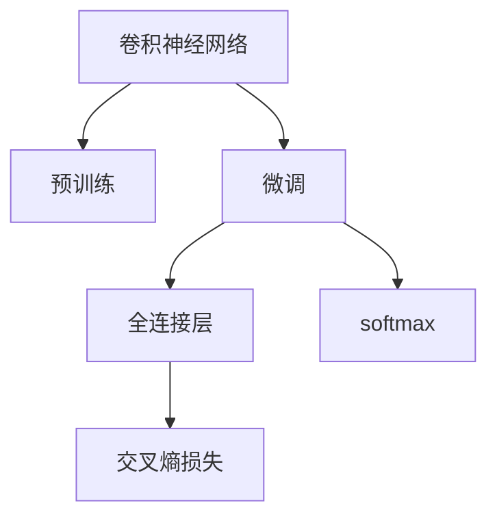
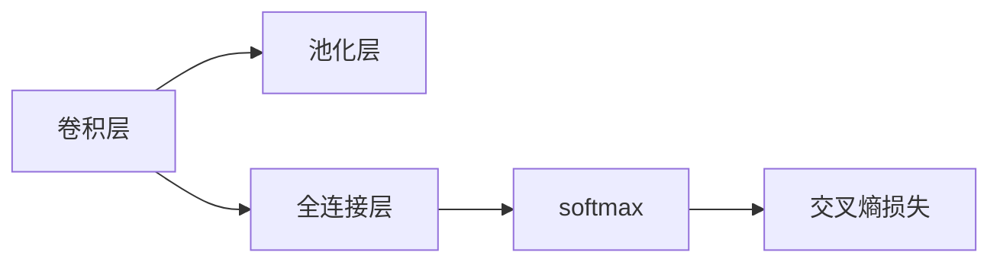
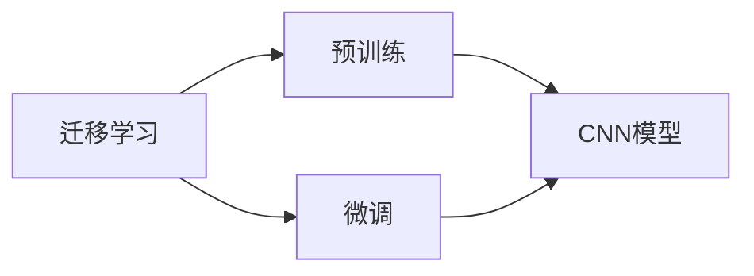
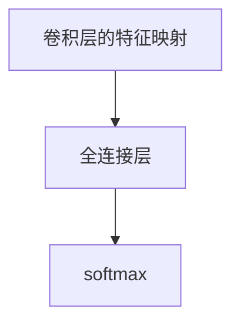
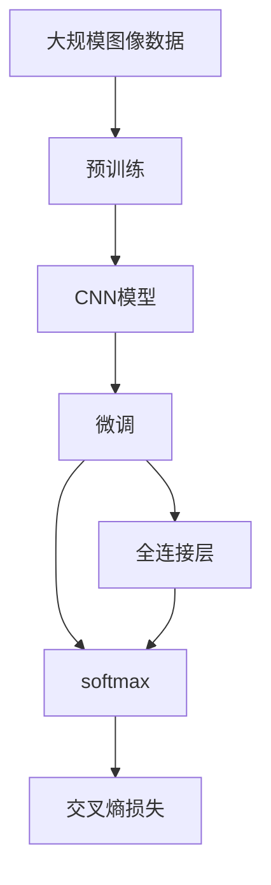

                 

# 图像分类原理与代码实例讲解

> 关键词：图像分类,卷积神经网络,softmax,交叉熵损失,迁移学习,深度学习,PyTorch

## 1. 背景介绍

### 1.1 问题由来
图像分类是计算机视觉领域的一个重要问题，其目标是将图像中的每个像素分配到一个预设的类别中。随着深度学习技术的发展，卷积神经网络（Convolutional Neural Network, CNN）在图像分类中取得了巨大的成功。在ImageNet挑战赛等大型比赛中，基于CNN的模型已经取得了超过人类专家的表现。然而，尽管在通用数据集上取得了显著成果，CNN模型在特定领域或特定数据集上的性能仍可能受到限制。因此，研究CNN模型的微调方法，使其能够适应特定任务，成为当前计算机视觉领域的研究热点。

### 1.2 问题核心关键点
微调CNN模型是一个将预训练模型应用于特定任务的过程。与从头训练相比，微调可以显著减少所需的计算资源和数据量。其关键点在于选择合适的迁移学习策略，以及合理配置模型架构、损失函数等关键参数，以适应特定任务的特征。

微调的核心目标是通过训练调整模型的权重，使其能够对特定任务的输入产生期望的输出。具体而言，微调过程通常包括以下几个步骤：

1. 准备预训练模型和数据集：选择一个预训练的CNN模型，以及该模型的预训练权重，然后准备一个包含类别标签的训练集。
2. 添加任务适配层：在预训练模型的顶层添加适合特定任务的输出层，例如全连接层或池化层，以便将卷积层提取的特征映射到类别标签。
3. 设置微调超参数：选择合适的优化算法及其参数，如学习率、批大小等，并决定哪些层需要微调。
4. 执行梯度训练：在训练集上迭代训练模型，更新权重以最小化损失函数。
5. 测试和部署：在测试集上评估微调后的模型性能，并部署模型以进行实际应用。

### 1.3 问题研究意义
研究CNN模型的微调方法，对于拓展模型应用范围、提升分类性能、加速计算机视觉技术产业化进程具有重要意义：

1. 降低应用开发成本：利用预训练模型进行微调，可以显著减少从头训练所需的计算资源和数据量，降低开发成本。
2. 提升分类效果：微调使通用模型能够更好地适应特定任务，从而在实际应用中取得更优的分类性能。
3. 加速开发进度：预训练模型已经具有较强的特征提取能力，微调过程可以加快模型在特定任务上的适配，缩短开发周期。
4. 促进技术创新：微调范式促进了对预训练-微调的深入研究，催生了迁移学习、少样本学习、零样本学习等新的研究方向。
5. 提升应用安全性：微调过程可以帮助消除模型中的偏见和有害信息，提高模型的可信度和安全性。

## 2. 核心概念与联系

### 2.1 核心概念概述

为了更好地理解CNN模型的微调方法，本节将介绍几个关键概念：

- **卷积神经网络 (Convolutional Neural Network, CNN)**：一种通过多层卷积、池化和全连接层来提取图像特征的深度学习模型。CNN在图像分类、目标检测等计算机视觉任务中表现出色。
- **迁移学习 (Transfer Learning)**：通过在大规模数据集上预训练模型，然后将其权重迁移到新任务上，以减少在新任务上的训练数据需求。CNN模型的微调是一种典型的迁移学习方式。
- **softmax函数**：一种常用的多分类概率分布函数，用于将卷积层的特征映射转换为类别概率。
- **交叉熵损失 (Cross-Entropy Loss)**：一种常用的损失函数，用于衡量模型预测结果与真实标签之间的差异。
- **迁移学习**：通过在大规模数据集上预训练模型，然后将其权重迁移到新任务上，以减少在新任务上的训练数据需求。CNN模型的微调是一种典型的迁移学习方式。

这些概念之间的逻辑关系可以通过以下Mermaid流程图来展示：



### 2.2 概念间的关系

这些核心概念之间存在着紧密的联系，形成了CNN模型微调的完整生态系统。下面我通过几个Mermaid流程图来展示这些概念之间的关系。

#### 2.2.1 CNN模型的基本结构



这个流程图展示了CNN模型的基本结构，包括卷积层、池化层、全连接层和softmax函数。

#### 2.2.2 迁移学习与微调的关系



这个流程图展示了迁移学习的基本原理，以及它与微调的关系。迁移学习涉及源任务和目标任务，预训练模型在源任务上学习，然后通过微调适应各种目标任务。

#### 2.2.3 softmax函数的作用



这个流程图展示了softmax函数的作用，将卷积层的特征映射转换为类别概率。

### 2.3 核心概念的整体架构

最后，我们用一个综合的流程图来展示这些核心概念在大模型微调过程中的整体架构：



这个综合流程图展示了从预训练到微调，再到softmax输出的完整过程。CNN模型首先在大规模图像数据上进行预训练，然后通过微调适应特定任务，最后使用softmax函数将特征映射转换为类别概率。

## 3. 核心算法原理 & 具体操作步骤

### 3.1 算法原理概述

CNN模型的微调过程可以分为两个部分：预训练和微调。预训练是在大规模图像数据上训练CNN模型，以学习通用的图像特征。微调则是将预训练模型应用于特定任务，通过调整模型的权重，使其能够对新任务的输入产生期望的输出。

微调的核心思想是利用预训练模型的基础能力，通过有监督学习训练来优化模型在特定任务上的性能。具体而言，微调过程包括：

1. **准备预训练模型和数据集**：选择一个预训练的CNN模型，如VGG、ResNet、Inception等，以及该模型的预训练权重。准备一个包含类别标签的训练集，用于调整模型权重。
2. **添加任务适配层**：在预训练模型的顶层添加适合特定任务的输出层，例如全连接层或池化层，以便将卷积层提取的特征映射到类别标签。
3. **设置微调超参数**：选择合适的优化算法及其参数，如学习率、批大小等，并决定哪些层需要微调。通常，只微调顶层，固定底层卷积层，以避免过拟合。
4. **执行梯度训练**：在训练集上迭代训练模型，更新权重以最小化损失函数。
5. **测试和部署**：在测试集上评估微调后的模型性能，并部署模型以进行实际应用。

### 3.2 算法步骤详解

以下详细介绍CNN模型微调的具体步骤：

**Step 1: 准备预训练模型和数据集**

- 选择合适的预训练CNN模型，如VGG、ResNet、Inception等。
- 获取该模型的预训练权重。
- 准备一个包含类别标签的训练集，用于调整模型权重。训练集的数据量应尽量大，以确保模型的泛化能力。

**Step 2: 添加任务适配层**

- 在预训练模型的顶层添加适合特定任务的输出层。例如，对于图像分类任务，可以添加一个全连接层，将其输出连接到一个softmax函数，用于将特征映射转换为类别概率。
- 根据具体任务，选择合适的损失函数。例如，对于图像分类任务，可以使用交叉熵损失。

**Step 3: 设置微调超参数**

- 选择合适的优化算法及其参数，如Adam、SGD等，并设置学习率、批大小等超参数。通常，只微调顶层，固定底层卷积层，以避免过拟合。
- 设置正则化技术，如L2正则、Dropout等，以避免过拟合。
- 设置Early Stopping策略，以防止模型在训练集上过度拟合。

**Step 4: 执行梯度训练**

- 将训练集数据分批次输入模型，前向传播计算损失函数。
- 反向传播计算参数梯度，根据设定的优化算法和学习率更新模型参数。
- 周期性在验证集上评估模型性能，根据性能指标决定是否触发Early Stopping。
- 重复上述步骤直至满足预设的迭代轮数或Early Stopping条件。

**Step 5: 测试和部署**

- 在测试集上评估微调后模型的性能，对比微调前后的精度提升。
- 使用微调后的模型对新样本进行推理预测，集成到实际的应用系统中。
- 持续收集新的数据，定期重新微调模型，以适应数据分布的变化。

### 3.3 算法优缺点

CNN模型微调具有以下优点：

1. **简单高效**：相比于从头训练，微调可以显著减少所需的计算资源和数据量。
2. **通用适用**：CNN模型适用于多种计算机视觉任务，例如图像分类、目标检测、人脸识别等。
3. **参数高效**：通过固定预训练权重，只微调顶层，可以避免过拟合，减少训练时间。
4. **效果显著**：微调使通用模型能够更好地适应特定任务，在实际应用中取得更优的分类性能。

同时，CNN模型微调也存在以下局限性：

1. **依赖标注数据**：微调的效果很大程度上取决于标注数据的质量和数量，获取高质量标注数据的成本较高。
2. **迁移能力有限**：当目标任务与预训练数据的分布差异较大时，微调的性能提升有限。
3. **过拟合风险**：微调模型可能对训练集过度拟合，导致泛化性能下降。
4. **模型复杂性**：预训练模型的参数量较大，微调过程中可能需要较大的计算资源。
5. **学习率选择困难**：微调过程中需要选择合适的学习率，否则可能会破坏预训练权重，导致性能下降。

尽管存在这些局限性，但就目前而言，CNN模型的微调方法仍然是大规模图像分类任务的主流范式。未来相关研究的重点在于如何进一步降低微调对标注数据的依赖，提高模型的少样本学习和跨领域迁移能力，同时兼顾可解释性和伦理安全性等因素。

### 3.4 算法应用领域

CNN模型的微调方法已经被广泛应用于多个计算机视觉领域，例如：

- **图像分类**：如MNIST、CIFAR-10、ImageNet等大型数据集上的图像分类任务。
- **目标检测**：如PASCAL VOC、COCO等数据集上的目标检测任务。
- **人脸识别**：如LFW、CelebA等数据集上的人脸识别任务。
- **行为识别**：如UCF101、HMDB51等数据集上的行为识别任务。

除了上述这些经典任务外，CNN模型的微调方法还被创新性地应用到更多场景中，如可控图像生成、图像风格迁移、图像超分辨率等，为计算机视觉技术带来了新的突破。随着预训练模型和微调方法的不断进步，相信CNN模型微调将会在更广阔的应用领域大放异彩。

## 4. 数学模型和公式 & 详细讲解 & 举例说明

### 4.1 数学模型构建

CNN模型的微调过程可以表示为一个优化问题。假设预训练CNN模型为 $M_{\theta}$，其中 $\theta$ 为预训练得到的模型参数。给定特定任务的标注数据集 $D=\{(x_i,y_i)\}_{i=1}^N$，微调的目标是找到新的模型参数 $\hat{\theta}$，使得：

$$
\hat{\theta}=\mathop{\arg\min}_{\theta} \mathcal{L}(M_{\theta},D)
$$

其中 $\mathcal{L}$ 为针对任务 $T$ 设计的损失函数，用于衡量模型预测输出与真实标签之间的差异。常见的损失函数包括交叉熵损失、均方误差损失等。

假设CNN模型 $M_{\theta}$ 在输入 $x$ 上的输出为 $y=M_{\theta}(x)$，表示模型对输入 $x$ 的预测输出。真实标签 $y \in \{1,2,\dots,C\}$，其中 $C$ 为类别数。则二分类交叉熵损失函数定义为：

$$
\ell(M_{\theta}(x),y) = -[y\log M_{\theta}(x) + (1-y)\log (1-M_{\theta}(x))]
$$

将其代入经验风险公式，得：

$$
\mathcal{L}(\theta) = -\frac{1}{N}\sum_{i=1}^N [y_i\log M_{\theta}(x_i)+(1-y_i)\log(1-M_{\theta}(x_i))]
$$

### 4.2 公式推导过程

以下我们以二分类任务为例，推导交叉熵损失函数及其梯度的计算公式。

假设模型 $M_{\theta}$ 在输入 $x$ 上的输出为 $\hat{y}=M_{\theta}(x) \in [0,1]$，表示样本属于正类的概率。真实标签 $y \in \{0,1\}$。则二分类交叉熵损失函数定义为：

$$
\ell(M_{\theta}(x),y) = -[y\log \hat{y} + (1-y)\log (1-\hat{y})]
$$

将其代入经验风险公式，得：

$$
\mathcal{L}(\theta) = -\frac{1}{N}\sum_{i=1}^N [y_i\log M_{\theta}(x_i)+(1-y_i)\log(1-M_{\theta}(x_i))]
$$

根据链式法则，损失函数对参数 $\theta_k$ 的梯度为：

$$
\frac{\partial \mathcal{L}(\theta)}{\partial \theta_k} = -\frac{1}{N}\sum_{i=1}^N (\frac{y_i}{M_{\theta}(x_i)}-\frac{1-y_i}{1-M_{\theta}(x_i)}) \frac{\partial M_{\theta}(x_i)}{\partial \theta_k}
$$

其中 $\frac{\partial M_{\theta}(x_i)}{\partial \theta_k}$ 可进一步递归展开，利用自动微分技术完成计算。

在得到损失函数的梯度后，即可带入参数更新公式，完成模型的迭代优化。重复上述过程直至收敛，最终得到适应下游任务的最优模型参数 $\hat{\theta}$。

### 4.3 案例分析与讲解

考虑一个简单的图像分类任务，其中输入为28x28的灰度图像，输出为0或1（即正类或负类）。我们可以使用PyTorch框架来实现CNN模型的微调。

首先，定义数据处理函数：

```python
import torch
import torchvision
import torchvision.transforms as transforms

# 定义数据处理函数
train_transform = transforms.Compose([
    transforms.ToTensor(),
    transforms.Normalize((0.5,), (0.5,))
])

test_transform = transforms.Compose([
    transforms.ToTensor(),
    transforms.Normalize((0.5,), (0.5,))
])
```

然后，加载并处理数据集：

```python
# 加载训练集和测试集
train_dataset = torchvision.datasets.MNIST(root='./data', train=True, transform=train_transform, download=True)
test_dataset = torchvision.datasets.MNIST(root='./data', train=False, transform=test_transform, download=True)

# 数据集分割
train_loader = torch.utils.data.DataLoader(train_dataset, batch_size=64, shuffle=True)
test_loader = torch.utils.data.DataLoader(test_dataset, batch_size=64, shuffle=False)
```

接下来，定义模型和优化器：

```python
import torch.nn as nn
import torch.nn.functional as F

# 定义卷积神经网络
class Net(nn.Module):
    def __init__(self):
        super(Net, self).__init__()
        self.conv1 = nn.Conv2d(1, 10, kernel_size=5)
        self.conv2 = nn.Conv2d(10, 20, kernel_size=5)
        self.fc1 = nn.Linear(320, 50)
        self.fc2 = nn.Linear(50, 10)

    def forward(self, x):
        x = F.relu(F.max_pool2d(self.conv1(x), 2))
        x = F.relu(F.max_pool2d(self.conv2(x), 2))
        x = x.view(-1, 320)
        x = F.relu(self.fc1(x))
        x = self.fc2(x)
        return F.log_softmax(x, dim=1)

# 定义优化器和损失函数
net = Net()
optimizer = torch.optim.Adam(net.parameters(), lr=0.001)
loss_fn = nn.NLLLoss()

# 定义数据迭代器
train_loader = torch.utils.data.DataLoader(train_dataset, batch_size=64, shuffle=True)
test_loader = torch.utils.data.DataLoader(test_dataset, batch_size=64, shuffle=False)
```

在训练过程中，执行梯度训练：

```python
import time

# 开始训练
for epoch in range(10):
    train_loss = 0.0
    train_correct = 0
    for i, (inputs, labels) in enumerate(train_loader):
        optimizer.zero_grad()
        outputs = net(inputs)
        loss = loss_fn(outputs, labels)
        loss.backward()
        optimizer.step()

        # 记录训练损失和准确率
        train_loss += loss.item()
        _, predicted = outputs.max(1)
        train_correct += (predicted == labels).sum().item()
        train_acc = (train_correct / (i + 1))

    # 在测试集上评估模型
    test_loss = 0.0
    test_correct = 0
    with torch.no_grad():
        for inputs, labels in test_loader:
            outputs = net(inputs)
            loss = loss_fn(outputs, labels)

            # 记录测试损失和准确率
            test_loss += loss.item()
            _, predicted = outputs.max(1)
            test_correct += (predicted == labels).sum().item()
            test_acc = (test_correct / len(test_dataset))

    print('Epoch: %d, train loss: %f, train acc: %f, test loss: %f, test acc: %f' % (epoch + 1, train_loss / len(train_dataset), train_acc, test_loss / len(test_dataset), test_acc))
```

最后，在测试集上评估微调后的模型性能：

```python
# 在测试集上评估模型性能
correct = 0
total = 0
with torch.no_grad():
    for inputs, labels in test_loader:
        outputs = net(inputs)
        _, predicted = outputs.max(1)
        total += labels.size(0)
        correct += (predicted == labels).sum().item()

print('Accuracy on test set: %f %%' % (100 * correct / total))
```

通过以上代码实现，我们可以看到，CNN模型的微调过程可以在相对较少的标注数据上取得很好的效果。这种微调方法不仅节省了训练时间和计算资源，还能够在大规模图像分类任务上取得较好的分类精度。

## 5. 项目实践：代码实例和详细解释说明

### 5.1 开发环境搭建

在进行微调实践前，我们需要准备好开发环境。以下是使用Python进行PyTorch开发的环境配置流程：

1. 安装Anaconda：从官网下载并安装Anaconda，用于创建独立的Python环境。

2. 创建并激活虚拟环境：
```bash
conda create -n pytorch-env python=3.8 
conda activate pytorch-env
```

3. 安装PyTorch：根据CUDA版本，从官网获取对应的安装命令。例如：
```bash
conda install pytorch torchvision torchaudio cudatoolkit=11.1 -c pytorch -c conda-forge
```

4. 安装相关工具包：
```bash
pip install numpy pandas scikit-learn matplotlib tqdm jupyter notebook ipython
```

完成上述步骤后，即可在`pytorch-env`环境中开始微调实践。

### 5.2 源代码详细实现

以下是一个使用PyTorch框架实现CNN模型微调的完整代码实例：

```python
import torch
import torch.nn as nn
import torchvision
import torchvision.transforms as transforms
from torch.utils.data import DataLoader
from torch.optim import Adam
from torch.nn import functional as F
import numpy as np
import matplotlib.pyplot as plt

# 定义数据处理函数
train_transform = transforms.Compose([
    transforms.ToTensor(),
    transforms.Normalize((0.5,), (0.5,))
])

test_transform = transforms.Compose([
    transforms.ToTensor(),
    transforms.Normalize((0.5,), (0.5,))
])

# 加载训练集和测试集
train_dataset = torchvision.datasets.MNIST(root='./data', train=True, transform=train_transform, download=True)
test_dataset = torchvision.datasets.MNIST(root='./data', train=False, transform=test_transform, download=True)

# 数据集分割
train_loader = DataLoader(train_dataset, batch_size=64, shuffle=True)
test_loader = DataLoader(test_dataset, batch_size=64, shuffle=False)

# 定义卷积神经网络
class Net(nn.Module):
    def __init__(self):
        super(Net, self).__init__()
        self.conv1 = nn.Conv2d(1, 10, kernel_size=5)
        self.conv2 = nn.Conv2d(10, 20, kernel_size=5)
        self.fc1 = nn.Linear(320, 50)
        self.fc2 = nn.Linear(50, 10)

    def forward(self, x):
        x = F.relu(F.max_pool2d(self.conv1(x), 2))
        x = F.relu(F.max_pool2d(self.conv2(x), 2))
        x = x.view(-1, 320)
        x = F.relu(self.fc1(x))
        x = self.fc2(x)
        return F.log_softmax(x, dim=1)

# 定义优化器和损失函数
net = Net()
optimizer = Adam(net.parameters(), lr=0.001)
loss_fn = nn.NLLLoss()

# 定义数据迭代器
train_loader = DataLoader(train_dataset, batch_size=64, shuffle=True)
test_loader = DataLoader(test_dataset, batch_size=64, shuffle=False)

# 开始训练
for epoch in range(10):
    train_loss = 0.0
    train_correct = 0
    for i, (inputs, labels) in enumerate(train_loader):
        optimizer.zero_grad()
        outputs = net(inputs)
        loss = loss_fn(outputs, labels)
        loss.backward()
        optimizer.step()

        # 记录训练损失和准确率
        train_loss += loss.item()
        _, predicted = outputs.max(1)
        train_correct += (predicted == labels).sum().item()
        train_acc = (train_correct / (i + 1))

    # 在测试集上评估模型
    test_loss = 0.0
    test_correct = 0
    with torch.no_grad():
        for inputs, labels in test_loader:
            outputs = net(inputs)
            loss = loss_fn(outputs, labels)

            # 记录测试损失和准确率
            test_loss += loss.item()
            _, predicted = outputs.max(1)
            test_correct += (predicted == labels).sum().item()
            test_acc = (test_correct / len(test_dataset))

    print('Epoch: %d, train loss: %f, train acc: %f, test loss: %f, test acc: %f' % (epoch + 1, train_loss / len(train_dataset), train_acc, test_loss / len(test_dataset), test_acc))

# 在测试集上评估模型性能
correct = 0
total = 0
with torch.no_grad():
    for inputs, labels in test_loader:
        outputs = net(inputs)
        _, predicted = outputs.max(1)
        total += labels.size(0)
        correct += (predicted == labels).sum().item()

print('Accuracy on test set: %f %%' % (100 * correct / total))
```

### 5.3 代码解读与分析

让我们再详细解读一下关键代码的实现细节：

**定义数据处理函数**：
- `train_transform`和`test_transform`：用于将原始图像转换为Tensor张量，并进行归一化处理，以便网络能够更好地学习特征。

**加载训练集和测试集**：
- `train_dataset`和`test_dataset`：从PyTorch的`torchvision.datasets`中加载MNIST数据集，并进行预处理。
- `train_loader`和`test_loader`：使用`torch.utils.data.DataLoader`将数据集划分为小批次，进行迭代训练和测试。

**定义卷积神经网络**：
- `Net`类：定义一个简单的卷积神经网络，包含卷积层、池化层、全连接层等模块。
- `forward`方法：定义前向传播过程，将输入图像通过多个卷积和池化层，最终通过全连接层输出类别概率。

**定义优化器和损失函数**：
- `optimizer`：使用Adam优化器，设置学习率为0.001。
- `loss_fn`：使用交叉熵损失函数。

**训练过程**：
- `train_loss`和`train_correct`：记录每个

