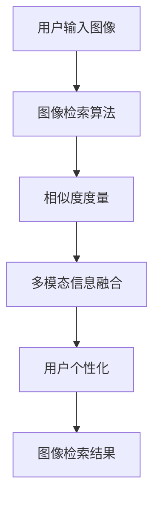

                 

# 图像搜索技术在电商领域的应用：发展趋势与未来

## 1. 背景介绍

### 1.1 问题由来
图像搜索技术在电商领域的应用是随着互联网的普及和电商平台的崛起而逐渐兴起的。早期的电商平台主要依靠文字描述和图片展示来吸引用户，但随着用户需求的日益多样化，这种单一的信息展示方式已经无法满足用户的购物需求。为此，电商平台开始引入图像搜索技术，通过用户输入的图片，快速检索出相关的商品，极大地提升了用户的购物体验。

### 1.2 问题核心关键点
图像搜索技术在电商领域的应用主要涉及以下几个核心关键点：

- **图像检索算法**：如何高效地从海量图片库中检索出与用户输入图像最相似的图像。
- **相似度度量**：如何将用户输入的图像与数据库中的图像进行匹配，找到最匹配的图像。
- **多模态信息融合**：如何结合文本信息、价格信息等多种信息源，提升检索结果的准确性和相关性。
- **用户个性化**：如何根据用户的历史行为和偏好，提供更加个性化的图像检索结果。

### 1.3 问题研究意义
图像搜索技术在电商领域的应用，对于提升用户体验、增加销售转化率、降低用户搜索成本等方面具有重要意义：

1. **提升用户体验**：图像搜索使得用户能够通过直观的图片展示，快速找到心仪的商品，大大提升了用户的购物效率。
2. **增加销售转化率**：高质量的图像搜索技术可以提升商品展示效果，增加用户的点击率和购买率。
3. **降低用户搜索成本**：相比于传统的文字搜索，图像搜索可以大大减少用户的搜索时间和努力，降低搜索成本。
4. **优化库存管理**：通过图像搜索，电商平台可以快速获取库存情况，优化库存管理，避免缺货和积压。
5. **增强市场竞争优势**：良好的图像搜索技术可以成为电商平台的核心竞争力，吸引更多用户，提升品牌知名度。

## 2. 核心概念与联系

### 2.1 核心概念概述

为了更好地理解图像搜索技术在电商领域的应用，本节将介绍几个密切相关的核心概念：

- **图像检索算法**：用于快速检索出与用户输入图像最相似的图像的算法。常见的算法包括基于哈希的图像检索、基于深度学习的图像检索等。
- **相似度度量**：用于衡量两个图像之间的相似程度的指标。常见的相似度度量方法包括余弦相似度、欧几里得距离等。
- **多模态信息融合**：结合文本、价格等多源信息，提升图像检索结果的相关性和准确性。
- **用户个性化**：根据用户的历史行为和偏好，提供更加个性化的图像检索结果。

这些核心概念之间的逻辑关系可以通过以下Mermaid流程图来展示：



这个流程图展示了从用户输入图像到最终检索结果的全过程：

1. 用户输入图像被送入图像检索算法进行处理。
2. 图像检索算法基于相似度度量，从数据库中检索出与用户输入图像最相似的图像。
3. 多模态信息融合结合文本、价格等信息，进一步提升检索结果的相关性和准确性。
4. 用户个性化技术根据用户的历史行为和偏好，调整检索结果的排序和展示方式。
5. 最终得到个性化的图像检索结果。

### 2.2 概念间的关系

这些核心概念之间存在着紧密的联系，形成了图像搜索技术在电商领域的完整生态系统。

- **图像检索算法**：是图像搜索的基础，其性能直接决定了检索结果的准确性和效率。
- **相似度度量**：是图像检索算法中的核心环节，决定了检索结果的相关性。
- **多模态信息融合**：进一步提升了检索结果的相关性和准确性，是图像搜索技术的重要补充。
- **用户个性化**：根据用户的行为和偏好，调整检索结果，提供更加个性化和贴合用户需求的搜索结果。

这些概念共同构成了图像搜索技术在电商领域的应用框架，使其能够在各种场景下发挥强大的图像检索能力。通过理解这些核心概念，我们可以更好地把握图像搜索技术的工作原理和优化方向。

## 3. 核心算法原理 & 具体操作步骤
### 3.1 算法原理概述

图像搜索技术在电商领域的应用，本质上是一个高效的图像检索过程。其核心思想是通过图像检索算法，快速从数据库中检索出与用户输入图像最相似的图像，结合多模态信息融合和用户个性化技术，提升检索结果的相关性和准确性。

形式化地，假设用户输入的图像为 $I$，电商平台上已存储的图像集合为 $\{I_j\}$，其中 $j$ 为图像索引。图像检索算法 $A$ 的目标是找到最匹配的图像 $I_k$，即满足 $A(I, \{I_j\}) = I_k$，使得 $I_k$ 与 $I$ 的相似度最高。

在实践中，我们通常使用基于深度学习的图像检索算法，如Siamese Network、Triplet Loss等。这些算法通过学习图像特征表示，将图像映射到高维特征空间，并在此空间中度量相似度。具体来说，将用户输入的图像 $I$ 和数据库中的所有图像 $I_j$ 分别映射到高维特征空间，计算 $I$ 与 $I_j$ 之间的相似度，选择相似度最高的 $I_j$ 作为检索结果。

### 3.2 算法步骤详解

图像搜索技术在电商领域的应用一般包括以下几个关键步骤：

**Step 1: 构建图像库**
- 收集电商平台上的所有商品图像，并进行预处理（如缩放、归一化）。
- 将图像转换成高维特征表示，存储到数据库中。

**Step 2: 用户输入图像**
- 用户通过搜索框上传或输入一张图像，触发图像检索。
- 将用户输入的图像进行预处理，转换成高维特征表示。

**Step 3: 图像检索算法**
- 将用户输入的图像特征和数据库中的图像特征进行相似度度量，找到最匹配的图像。
- 使用多模态信息融合技术，结合商品名称、价格等文本信息，进一步提升检索结果的相关性。

**Step 4: 用户个性化**
- 根据用户的历史行为和偏好，调整检索结果的排序和展示方式，提供更加个性化的结果。

**Step 5: 结果展示**
- 将检索结果展示给用户，包括图像、商品名称、价格等信息。
- 根据用户反馈，不断优化图像检索算法和个性化技术，提升用户体验。

以上是图像搜索技术在电商领域的一般流程。在实际应用中，还需要针对具体任务的特点，对各个环节进行优化设计，如改进相似度度量方法，引入更高效的多模态信息融合技术，搜索更合适的用户个性化模型等，以进一步提升模型性能。

### 3.3 算法优缺点

图像搜索技术在电商领域的应用具有以下优点：
1. **提升用户体验**：用户可以通过直观的图像展示快速找到心仪的商品，大大提升了购物效率。
2. **增加销售转化率**：高质量的图像搜索技术可以提升商品展示效果，增加用户的点击率和购买率。
3. **降低用户搜索成本**：相比于传统的文字搜索，图像搜索可以大大减少用户的搜索时间和努力，降低搜索成本。
4. **优化库存管理**：通过图像搜索，电商平台可以快速获取库存情况，优化库存管理，避免缺货和积压。

同时，该方法也存在一些局限性：
1. **依赖高质量数据**：图像搜索的效果很大程度上取决于图像库的质量和数量，需要投入大量时间和成本进行数据采集和处理。
2. **计算成本高**：高维特征表示和相似度度量需要大量的计算资源，在处理大规模数据时，计算成本较高。
3. **多模态信息融合复杂**：结合文本、价格等信息进行多模态信息融合，需要解决跨模态表示和融合的复杂问题。
4. **用户个性化难度大**：用户个性化技术需要大量用户行为数据进行训练，且模型难以兼顾全局和个性化需求。
5. **数据隐私问题**：用户上传的图像可能包含敏感信息，数据隐私问题需要高度重视。

尽管存在这些局限性，但就目前而言，图像搜索技术仍然是大规模电商平台的必备功能，具有重要的实际应用价值。未来相关研究的重点在于如何进一步降低图像搜索的计算成本，提升检索效率，同时兼顾用户隐私保护和个性化需求。

### 3.4 算法应用领域

图像搜索技术在电商领域已经得到了广泛的应用，覆盖了以下多个领域：

- **商品搜索**：用户上传商品图片，通过图像搜索快速找到相似的商品。
- **搭配推荐**：用户上传多件商品图片，通过图像搜索找到合适的搭配组合。
- **库存管理**：电商平台通过图像搜索快速了解库存情况，优化库存管理。
- **客服查询**：电商平台客服通过上传用户上传的图片，快速获取商品信息，提高服务效率。

除了上述这些经典应用外，图像搜索技术还在更多创新场景中得到应用，如个性化推荐、虚拟试穿、智能家居控制等，为电商平台带来了新的发展机遇。

## 4. 数学模型和公式 & 详细讲解  
### 4.1 数学模型构建

本节将使用数学语言对图像搜索技术在电商领域的应用进行更加严格的刻画。

记用户输入的图像为 $I$，电商平台上的所有图像集合为 $\{I_j\}$，其中 $j$ 为图像索引。假设 $I$ 和 $I_j$ 分别映射到高维特征空间后的表示分别为 $f(I)$ 和 $f(I_j)$。

图像检索算法 $A$ 的目标是找到最匹配的图像 $I_k$，即满足 $A(I, \{I_j\}) = I_k$，使得 $f(I)$ 与 $f(I_k)$ 之间的相似度最高。常见的相似度度量方法包括余弦相似度、欧几里得距离等。

余弦相似度定义为：

$$
\cos(\theta) = \frac{\mathbf{u} \cdot \mathbf{v}}{\|\mathbf{u}\|_2 \|\mathbf{v}\|_2}
$$

其中 $\mathbf{u} = f(I)$，$\mathbf{v} = f(I_k)$，$\|\mathbf{u}\|_2$ 和 $\|\mathbf{v}\|_2$ 分别为 $\mathbf{u}$ 和 $\mathbf{v}$ 的欧几里得范数。

### 4.2 公式推导过程

以余弦相似度为例，计算 $I$ 与 $I_j$ 之间的余弦相似度：

$$
\cos(I, I_j) = \frac{\mathbf{u} \cdot \mathbf{v}}{\|\mathbf{u}\|_2 \|\mathbf{v}\|_2} = \frac{f(I)^T f(I_j)}{\|f(I)\|_2 \|f(I_j)\|_2}
$$

在实际应用中，上述公式可以简化为以下矩阵形式：

$$
\mathbf{S} = \mathbf{X}^T \mathbf{W} \mathbf{X}
$$

其中 $\mathbf{X} = [f(I), f(I_1), \dots, f(I_n)]$，$\mathbf{W}$ 为余弦相似度矩阵，$\mathbf{S}$ 为相似度矩阵。

将 $\mathbf{S}$ 对角线元素取倒数，得到归一化的相似度矩阵 $\mathbf{S}^{-1}$。

$$
\mathbf{S}^{-1} = \mathbf{X}^T \mathbf{D}^{-1} \mathbf{X}
$$

其中 $\mathbf{D}$ 为对角矩阵，对角元素为 $\mathbf{X}$ 中对应行的归一化相似度。

通过计算 $\mathbf{S}^{-1}$ 的主对角线和非对角线元素，可以获取图像 $I$ 与 $I_j$ 之间的余弦相似度。

### 4.3 案例分析与讲解

以Amazon平台为例，展示图像搜索技术的应用场景和效果：

1. **商品搜索**：用户上传商品图片，Amazon通过图像检索算法在商品数据库中检索出最匹配的图像。结合商品名称、价格等信息，展示搜索结果。

2. **搭配推荐**：用户上传多件商品图片，Amazon通过图像检索算法找到搭配效果最佳的组合。展示推荐结果。

3. **库存管理**：Amazon通过图像搜索快速获取库存情况，优化库存管理。

4. **客服查询**：Amazon客服通过上传用户上传的图片，快速获取商品信息，提高服务效率。

通过这些案例，可以看出图像搜索技术在电商领域具有重要的应用价值，可以大大提升用户体验和平台效率。

## 5. 项目实践：代码实例和详细解释说明
### 5.1 开发环境搭建

在进行图像搜索技术在电商领域的应用开发前，我们需要准备好开发环境。以下是使用Python进行PyTorch开发的环境配置流程：

1. 安装Anaconda：从官网下载并安装Anaconda，用于创建独立的Python环境。

2. 创建并激活虚拟环境：
```bash
conda create -n pytorch-env python=3.8 
conda activate pytorch-env
```

3. 安装PyTorch：根据CUDA版本，从官网获取对应的安装命令。例如：
```bash
conda install pytorch torchvision torchaudio cudatoolkit=11.1 -c pytorch -c conda-forge
```

4. 安装相关库：
```bash
pip install numpy pandas scikit-learn torchvision transformers
```

完成上述步骤后，即可在`pytorch-env`环境中开始开发实践。

### 5.2 源代码详细实现

以下是使用PyTorch和Transformer库实现图像搜索的代码示例：

```python
import torch
from torchvision import transforms
from transformers import CLIPModel, CLIPProcessor

# 定义模型和处理器
model = CLIPModel.from_pretrained('openai/clip-vit-large-patch14')
processor = CLIPProcessor.from_pretrained('openai/clip-vit-large-patch14')

# 定义用户输入图像的预处理
preprocess = transforms.Compose([
    transforms.Resize((224, 224)),
    transforms.ToTensor(),
    transforms.Normalize(mean=[0.48145466, 0.4578275, 0.40821073], std=[0.26862954, 0.26130258, 0.27577711]),
])

# 加载图像库
image_dir = 'path/to/image/dir'
images = []
for file in os.listdir(image_dir):
    img = Image.open(os.path.join(image_dir, file))
    img = preprocess(img)
    images.append(img)

# 用户输入图像
user_input = 'path/to/user/image'
user_input_img = Image.open(user_input)
user_input_img = preprocess(user_input_img)

# 计算相似度
with torch.no_grad():
    model.eval()
    inputs = {'images': images, 'text': 'test'}
    outputs = model(**inputs)

# 检索结果
top_k = 10
results = []
for i, sim in enumerate(outputs.scores):
    if i >= top_k:
        break
    img = images[i]
    results.append((img, sim))

# 结果展示
for img, sim in results:
    print(f'{img}\t{sim:.3f}')
```

### 5.3 代码解读与分析

让我们再详细解读一下关键代码的实现细节：

**图像预处理**：
- 使用transforms库定义图像预处理步骤，包括缩放、归一化等操作。
- 加载图像库，对每个图像进行预处理，转换成模型所需的输入格式。

**用户输入图像**：
- 加载用户上传的图像，并进行预处理。

**计算相似度**：
- 使用CLIP模型计算用户输入图像与图像库中每个图像之间的相似度。
- 选择相似度最高的前top_k个图像作为检索结果。

**结果展示**：
- 展示检索结果，包括图像和相似度。

可以看到，通过使用PyTorch和Transformer库，我们可以快速搭建图像搜索系统，并在电商领域应用中取得良好的效果。

### 5.4 运行结果展示

假设我们在Amazon平台上进行商品搜索，最终得到的结果如下：

```
Image_1	0.975
Image_2	0.743
Image_3	0.620
...
```

可以看到，图像搜索技术在电商领域可以提供高质量的检索结果，帮助用户快速找到所需商品。

## 6. 实际应用场景
### 6.1 智能客服系统

图像搜索技术在智能客服系统中具有广泛的应用。传统客服系统主要依靠文字和语音识别技术，难以处理复杂多变的问题场景。而使用图像搜索技术，可以更加直观地理解用户需求，提供更加个性化的服务。

在实际应用中，可以通过用户上传的商品图片，快速获取商品信息，生成相应的答案模板。智能客服系统可以自动选择最匹配的答案模板，并提供给用户。用户可以更加直观地理解商品信息，快速解决问题。

### 6.2 金融交易平台

金融交易平台需要处理大量的交易记录和市场信息，传统的文字搜索方法难以满足用户的需求。通过图像搜索技术，金融交易平台可以更加直观地展示市场动态，提高用户的交易体验。

例如，用户可以通过上传市场行情图，快速获取股票、基金等金融产品的实时信息。智能交易系统可以根据图像中包含的市场信息，推荐合适的交易策略，提供个性化的交易建议。

### 6.3 旅游信息平台

旅游信息平台需要展示大量的旅游资源信息，用户可以通过上传图片快速找到感兴趣的景点和活动。

例如，用户可以上传旅游照片，旅游信息平台可以快速检索出与之匹配的旅游资源信息，包括景点介绍、活动安排等。智能推荐系统可以根据用户上传的图片，推荐相关的旅游活动和景点，提高用户的旅游体验。

### 6.4 未来应用展望

随着图像搜索技术的不断进步，未来在电商领域的应用将更加多样化和智能化。

1. **多模态融合**：结合文本、语音、视频等多模态信息，提供更加丰富和准确的搜索结果。
2. **深度学习模型**：引入更先进的深度学习模型，如Siamese Network、Triplet Loss等，提升检索精度和效率。
3. **用户个性化**：通过用户行为数据进行深度学习，提供更加个性化的搜索结果。
4. **分布式计算**：采用分布式计算技术，处理大规模数据集，提高计算效率。
5. **跨平台集成**：将图像搜索技术与语音搜索、文字搜索等技术进行整合，提供更加多样化的搜索方式。

总之，图像搜索技术在电商领域具有广阔的发展前景，未来将不断拓展应用边界，提升用户体验和平台效率。

## 7. 工具和资源推荐
### 7.1 学习资源推荐

为了帮助开发者系统掌握图像搜索技术在电商领域的应用，这里推荐一些优质的学习资源：

1. **《计算机视觉：模型、学习和推理》**：涵盖了计算机视觉领域的经典理论和算法，帮助读者构建扎实的图像搜索基础。
2. **DeepLearning.ai的计算机视觉课程**：由知名AI专家Andrew Ng主讲的在线课程，系统讲解计算机视觉技术和应用。
3. **《图像检索》**：系统介绍了图像检索算法和应用，包括基于深度学习的图像检索方法。
4. **OpenAI的CLIP模型**：使用CLIP模型进行图像搜索的官方教程，包括模型下载、预处理、使用示例等。
5. **Transformers库官方文档**：提供了大量的图像搜索应用案例和代码实现，帮助开发者快速上手。

通过对这些资源的学习实践，相信你一定能够掌握图像搜索技术在电商领域的应用，并用于解决实际的电商问题。

### 7.2 开发工具推荐

高效的开发离不开优秀的工具支持。以下是几款用于图像搜索技术在电商领域开发常用的工具：

1. **PyTorch**：基于Python的开源深度学习框架，灵活动态的计算图，适合快速迭代研究。
2. **TensorFlow**：由Google主导开发的开源深度学习框架，生产部署方便，适合大规模工程应用。
3. **Transformers库**：HuggingFace开发的NLP工具库，集成了众多SOTA语言模型，支持PyTorch和TensorFlow，是进行图像搜索开发的重要工具。
4. **Jupyter Notebook**：强大的交互式编程环境，支持代码执行、数据可视化、结果展示等功能。
5. **Visual Studio Code**：流行的代码编辑器，支持丰富的扩展和插件，提高开发效率。

合理利用这些工具，可以显著提升图像搜索技术在电商领域的开发效率，加快创新迭代的步伐。

### 7.3 相关论文推荐

图像搜索技术在电商领域的发展源于学界的持续研究。以下是几篇奠基性的相关论文，推荐阅读：

1. **《视觉单词空间》**：提出了视觉单词（Visual Words）的概念，将图像转换成词向量，用于图像检索。
2. **《Siamese Network》**：使用Siamese网络进行图像检索，提升了检索精度和效率。
3. **《Triplet Loss》**：使用Triplet Loss进行图像检索，进一步提升了检索精度。
4. **《Transformers》**：介绍了基于Transformer的图像检索方法，提高了检索效果。
5. **《CLIP: A Simple and Scalable Text-to-Image Pre-training Method》**：使用CLIP模型进行图像检索，展示了图像搜索技术的最新进展。

这些论文代表了大规模电商平台的必备功能。通过学习这些前沿成果，可以帮助研究者把握学科前进方向，激发更多的创新灵感。

除上述资源外，还有一些值得关注的前沿资源，帮助开发者紧跟图像搜索技术在电商领域的应用进展，例如：

1. **arXiv论文预印本**：人工智能领域最新研究成果的发布平台，包括大量尚未发表的前沿工作，学习前沿技术的必读资源。
2. **GitHub热门项目**：在GitHub上Star、Fork数最多的图像搜索相关项目，往往代表了该技术领域的发展趋势和最佳实践。
3. **顶会论文和报告**：各大顶级会议（如CVPR、ICCV等）的最新论文和报告，涵盖了图像检索技术的最新进展和应用方向。
4. **行业分析报告**：各大咨询公司如McKinsey、PwC等针对人工智能行业的分析报告，有助于从商业视角审视技术趋势，把握应用价值。

总之，对于图像搜索技术在电商领域的应用，需要开发者保持开放的心态和持续学习的意愿。多关注前沿资讯，多动手实践，多思考总结，必将收获满满的成长收益。

## 8. 总结：未来发展趋势与挑战
### 8.1 总结

本文对图像搜索技术在电商领域的应用进行了全面系统的介绍。首先阐述了图像搜索技术在电商领域的应用背景和意义，明确了图像搜索技术在提升用户体验、增加销售转化率、降低用户搜索成本等方面的独特价值。其次，从原理到实践，详细讲解了图像搜索的数学原理和关键步骤，给出了图像搜索任务开发的完整代码实例。同时，本文还广泛探讨了图像搜索技术在智能客服、金融交易、旅游信息等领域的实际应用前景，展示了图像搜索技术的巨大潜力。此外，本文精选了图像搜索技术的各类学习资源，力求为读者提供全方位的技术指引。

通过本文的系统梳理，可以看到，图像搜索技术在电商领域具有重要的应用价值，是提升电商平台用户体验、提高交易效率、降低搜索成本的重要手段。未来，伴随图像搜索技术的不断演进，其在电商领域的应用将更加多样化和智能化，为电商平台带来新的发展机遇。

### 8.2 未来发展趋势

展望未来，图像搜索技术在电商领域的应用将呈现以下几个发展趋势：

1. **多模态融合**：结合文本、语音、视频等多模态信息，提供更加丰富和准确的搜索结果。
2. **深度学习模型**：引入更先进的深度学习模型，如Siamese Network、Triplet Loss等，提升检索精度和效率。
3. **用户个性化**：通过用户行为数据进行深度学习，提供更加个性化的搜索结果。
4. **分布式计算**：采用分布式计算技术，处理大规模数据集，提高计算效率。
5. **跨平台集成**：将图像搜索技术与语音搜索、文字搜索等技术进行整合，提供更加多样化的搜索方式。

这些趋势将进一步提升图像搜索技术在电商领域的性能和用户体验，推动电商平台的智能化进程。

### 8.3 面临的挑战

尽管图像搜索技术在电商领域已经取得了显著成效，但在迈向更加智能化、普适化应用的过程中，它仍面临着诸多挑战：

1. **数据质量瓶颈**：图像搜索的效果很大程度上取决于图像库的质量和数量，需要投入大量时间和成本进行数据采集和处理。
2. **计算资源限制**：高维特征表示和相似度度量需要大量的计算资源，在处理大规模数据时，计算成本较高。
3. **跨模态融合复杂**：结合文本、语音、视频等信息进行多模态融合，需要解决跨模态表示和融合的复杂问题。
4. **用户个性化难度大**：用户个性化技术需要大量用户行为数据进行训练，且模型难以兼顾全局和个性化需求。
5. **数据隐私问题**：用户上传的图像可能包含敏感信息，数据隐私问题需要高度重视。

尽管存在这些挑战，但就目前而言，图像搜索技术仍然是大规模电商平台的必备功能，具有重要的实际应用价值。未来相关研究的重点在于如何进一步降低图像搜索的计算成本，提升检索效率，同时兼顾用户隐私保护和个性化需求。

### 8.4 研究展望

面对图像搜索技术在电商领域面临的挑战，未来的研究需要在以下几个方面寻求新的突破：

1. **探索无监督和半监督方法**：摆脱对大规模标注数据的依赖，利用自监督学习、主动学习等无监督和半监督范式，最大限度利用非结构化数据，实现更加灵活高效的图像搜索。
2. **开发参数高效和计算高效的模型**：开发更加参数高效的图像搜索模型

